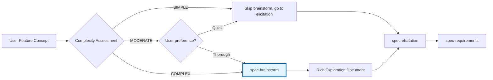

# spec-brainstorm - Exploration Positioning Context-Aware

## Propósito
**Facilitação estruturada de exploração de ideias** para features complexas usando Documentation-Rich approach. Captura knowledge organizacional através de brainstorming sessions sistematizadas e produz documentation comprehensive de exploration processes.

## Quando Usar
- **Features complexas**: Multi-component, multi-stakeholder, ou high-impact features
- **Ambiguidade de requirements**: Quando user concept precisa de clarificação
- **Innovation opportunities**: Exploration de novas abordagens ou technologies
- **Risk reduction**: Multiple alternatives precisam ser exploradas antes de commitment

## Responsabilidades

### 1. Structured Knowledge Capture

#### **1.1 Complexity Assessment & Trigger Logic**
```yaml
complexity_factors:
  technical_complexity: SIMPLE|MODERATE|COMPLEX
  stakeholder_count: 1-2|3-5|6+
  integration_scope: SINGLE_COMPONENT|CROSS_COMPONENT|SYSTEM_WIDE
  innovation_level: INCREMENTAL|MODERATE|BREAKTHROUGH

trigger_conditions:
  complexity_threshold: COMPLEX
  ambiguity_level: HIGH
  user_request: explicit_brainstorm
  alternatives_needed: true
```

#### **1.2 Exploration Dimensions**
- **Technical Perspectives**: Architecture, implementation, technology choices
- **Business Perspectives**: Value proposition, ROI, market fit
- **User Perspectives**: Experience, usability, accessibility
- **Implementation Perspectives**: Timeline, resources, risks

### 2. Rich Documentation Output

#### **2.1 Brainstorm Session Documentation**
```markdown
# Feature Exploration Session: {Feature Name}

**Generated**: {timestamp}
**Session Duration**: {duration}
**Complexity Level**: {SIMPLE|MODERATE|COMPLEX}
**Exploration Depth**: {SHALLOW|MODERATE|DEEP}

## Executive Summary
- **Ideas Generated**: {count}
- **Perspectives Explored**: {technical|business|user|implementation}
- **Alternative Approaches**: {count}
- **Recommended Path**: {primary_recommendation}

## Feature Concept Analysis
**Original Concept**: {user_provided_description}
**Refined Understanding**: {clarified_understanding}
**Key Assumptions**: {list_of_assumptions}
**Success Metrics**: {proposed_metrics}

## Structured Exploration

### Technical Perspectives
#### Architecture Approaches
1. **Monolithic Integration**
   - **Description**: {approach_details}
   - **Pros**: {benefits}
   - **Cons**: {limitations}
   - **Complexity**: {SIMPLE|MODERATE|COMPLEX}
   - **Risk**: {LOW|MEDIUM|HIGH}

2. **Microservice Approach**
   - **Description**: {approach_details}
   - **Pros**: {benefits}
   - **Cons**: {limitations}
   - **Complexity**: {SIMPLE|MODERATE|COMPLEX}
   - **Risk**: {LOW|MEDIUM|HIGH}

#### Technology Stack Options
| Option | Maturity | Team Expertise | Integration Effort | Risk Level |
|--------|----------|----------------|-------------------|------------|
| React + Node.js | HIGH | HIGH | LOW | LOW |
| Vue + Express | MEDIUM | MEDIUM | LOW | MEDIUM |
| Angular + NestJS | HIGH | LOW | MEDIUM | MEDIUM |

### Business Perspectives
#### Value Proposition Analysis
- **Primary Value**: {main_benefit}
- **Secondary Values**: {additional_benefits}
- **Market Differentiation**: {unique_selling_points}
- **Revenue Impact**: {estimated_impact}

#### ROI Considerations
- **Development Cost**: {estimate_range}
- **Maintenance Cost**: {annual_estimate}
- **Expected Revenue**: {projected_revenue}
- **Break-even Timeline**: {months}

### User Experience Perspectives
#### User Journey Scenarios
1. **Primary User Flow**
   - **User Type**: {target_user}
   - **Entry Point**: {how_they_arrive}
   - **Key Actions**: {step_by_step}
   - **Exit Point**: {completion_state}
   - **Pain Points**: {potential_friction}

2. **Alternative User Flow**
   - **User Type**: {secondary_user}
   - **Entry Point**: {alternative_entry}
   - **Key Actions**: {different_steps}
   - **Exit Point**: {alternative_completion}
   - **Pain Points**: {different_friction}

#### Accessibility Considerations
- **Visual Accessibility**: {considerations}
- **Motor Accessibility**: {considerations}
- **Cognitive Accessibility**: {considerations}
- **Compliance Requirements**: {WCAG_level}

### Implementation Perspectives
#### Development Approaches
1. **Phased Rollout**
   - **Phase 1**: {MVP_features}
   - **Phase 2**: {enhancement_features}
   - **Phase 3**: {advanced_features}
   - **Timeline**: {total_duration}

2. **Big Bang Approach**
   - **Full Feature Set**: {complete_scope}
   - **Timeline**: {concentrated_timeline}
   - **Risk**: {concentrated_risk}

#### Resource Requirements
- **Development Team**: {size_and_skills}
- **Design Resources**: {UI/UX_needs}
- **QA Resources**: {testing_requirements}
- **DevOps Support**: {infrastructure_needs}

## Alternative Analysis & Comparison

### Alternative 1: {Alternative Name}
**Concept**: {alternative_description}
**Strengths**: {key_advantages}
**Weaknesses**: {key_limitations}
**Implementation Effort**: {SMALL|MEDIUM|LARGE}
**Risk Level**: {LOW|MEDIUM|HIGH}
**Strategic Fit**: {alignment_assessment}

### Alternative 2: {Alternative Name}
**Concept**: {alternative_description}
**Strengths**: {key_advantages}
**Weaknesses**: {key_limitations}
**Implementation Effort**: {SMALL|MEDIUM|LARGE}
**Risk Level**: {LOW|MEDIUM|HIGH}
**Strategic Fit**: {alignment_assessment}

## Preliminary User Stories

### Epic: {Feature Name}
#### Story 1: Core Functionality
**As a** {user_type}
**I want** {capability}
**So that** {benefit}

**Acceptance Criteria**:
- Given {precondition}
- When {action}
- Then {expected_outcome}

**Complexity**: {story_points_estimate}
**Priority**: {HIGH|MEDIUM|LOW}

#### Story 2: Enhanced Experience
**As a** {user_type}
**I want** {capability}
**So that** {benefit}

**Acceptance Criteria**:
- Given {precondition}
- When {action}
- Then {expected_outcome}

**Complexity**: {story_points_estimate}
**Priority**: {HIGH|MEDIUM|LOW}

## Exploration Insights & Knowledge Capture

### Key Insights Discovered
1. **Insight 1**: {important_discovery}
2. **Insight 2**: {important_discovery}
3. **Insight 3**: {important_discovery}

### Assumptions Validated/Invalidated
- **Validated**: {confirmed_assumptions}
- **Invalidated**: {rejected_assumptions}
- **Need Research**: {uncertain_assumptions}

### Knowledge Gaps Identified
- **Technical**: {missing_technical_knowledge}
- **Market**: {missing_market_knowledge}
- **User**: {missing_user_knowledge}
- **Competitive**: {missing_competitive_knowledge}

### Recommended Next Steps
1. **Immediate**: {urgent_actions}
2. **Short-term**: {near_term_actions}
3. **Long-term**: {future_considerations}

## Risk Assessment & Mitigation

### High-Risk Areas
| Risk | Impact | Probability | Mitigation Strategy |
|------|--------|-------------|---------------------|
| Technical complexity underestimated | HIGH | MEDIUM | Proof of concept phase |
| User adoption lower than expected | MEDIUM | MEDIUM | User research validation |
| Integration challenges | MEDIUM | HIGH | Architecture review |

### Success Criteria Definition
- **Technical Success**: {measurable_technical_outcomes}
- **Business Success**: {measurable_business_outcomes}
- **User Success**: {measurable_user_outcomes}

## Handoff to Next Phase

### Enriched Context for spec-elicitation
- **Refined Feature Concept**: {clarified_understanding}
- **Key Architectural Considerations**: {technical_insights}
- **Critical Success Factors**: {success_requirements}
- **Risk Areas for Alignment Check**: {areas_needing_validation}

### Structured Input for Requirements Phase
- **Prioritized User Stories**: {story_backlog}
- **Technical Constraints**: {implementation_boundaries}
- **Success Metrics**: {measurable_outcomes}
- **Alternative Approaches**: {backup_options}

---
**Session Type**: Comprehensive Documentation-Rich Exploration
**Generated by**: spec-brainstorm
**Next Phase**: spec-elicitation (alignment validation)
**Follow-up**: spec-requirements (formal specification)
```

### 3. Context Workflow Integration

#### **3.1 Discovery Phase Positioning**


#### **3.2 Handoff Optimization**
- **Input**: Basic feature concept, complexity assessment
- **Processing**: Multi-dimensional exploration, alternative generation
- **Output**: Comprehensive exploration document + structured alternatives
- **Quality Focus**: Knowledge preservation over speed

## Workflow Integration

### Entrada
```yaml
feature_concept:
  name: string
  description: text
  user_context: text
  complexity_trigger: COMPLEX|USER_REQUESTED

session_config:
  exploration_depth: SHALLOW|MODERATE|DEEP
  time_budget: 30min|60min|90min
  focus_areas: [technical, business, user, implementation]

context_inputs:
  project_constraints: optional
  existing_architecture: optional
  market_context: optional
```

### Processo
1. **Complexity Assessment**: Evaluate if brainstorm needed
2. **Session Setup**: Configure exploration dimensions
3. **Multi-perspective Exploration**: Systematic idea generation
4. **Alternative Development**: Create and compare options
5. **Knowledge Synthesis**: Structure insights and learnings
6. **Preliminary Story Creation**: Generate initial user stories
7. **Handoff Preparation**: Package for next phase

### Saída
```yaml
exploration_document:
  location: .claude/specs/{feature-name}/exploration-session.md
  format: structured_comprehensive_markdown
  quality: documentation_rich

structured_alternatives:
  primary_approach: recommended_path
  alternative_approaches: backup_options
  risk_assessment: risk_mitigation_strategies

preliminary_stories:
  epic_definition: high_level_scope
  core_stories: essential_functionality
  enhancement_stories: additional_value

handoff_context:
  for_elicitation: alignment_focus_areas
  for_requirements: story_starting_points
  for_design: technical_considerations
```

## Templates e Estruturas

### Template: Idea Exploration Matrix
```markdown
## Idea Exploration Matrix

| Idea | Technical Feasibility | Business Value | User Impact | Implementation Effort | Risk Level |
|------|----------------------|----------------|-------------|----------------------|------------|
| Idea 1 | HIGH | MEDIUM | HIGH | MEDIUM | LOW |
| Idea 2 | MEDIUM | HIGH | MEDIUM | HIGH | MEDIUM |
| Idea 3 | LOW | HIGH | HIGH | VERY HIGH | HIGH |

### Recommendation Logic
- **Top Choice**: Idea 1 (balanced feasibility/impact)
- **Alternative**: Idea 2 (if business value prioritized)
- **Long-term**: Idea 3 (if technical risk acceptable)
```

### Template: Perspective Deep Dive
```markdown
## Technical Perspective Deep Dive

### Architecture Exploration
**Monolithic vs Microservice Decision Tree**
```
Feature Complexity: {SIMPLE|MODERATE|COMPLEX}
    ↓
{SIMPLE} → Monolithic (faster development)
{MODERATE} → Evaluate team structure and deployment needs
{COMPLEX} → Microservice (better scalability/maintenance)
```

**Technology Stack Considerations**
- **Current Stack Compatibility**: {assessment}
- **Team Expertise Alignment**: {assessment}
- **Learning Curve**: {assessment}
- **Long-term Maintenance**: {assessment}

**Integration Complexity**
- **Database Changes**: {NONE|MINOR|MAJOR}
- **API Modifications**: {NONE|MINOR|MAJOR}
- **UI/UX Impact**: {NONE|MINOR|MAJOR}
- **Third-party Dependencies**: {list}
```

## Configuração e Personalização

### Configurações Padrão
```yaml
spec_brainstorm:
  complexity_threshold: COMPLEX
  default_depth: MODERATE
  max_session_time: 60min
  min_alternatives: 2
  max_alternatives: 5
  perspective_coverage:
    - technical
    - business
    - user
    - implementation
  auto_story_generation: true
  risk_assessment: enabled
```

### Exploration Levels
- **SHALLOW**: Quick ideation, 2-3 alternatives, 30min
- **MODERATE**: Structured exploration, 3-4 alternatives, 60min
- **DEEP**: Comprehensive analysis, 4-5 alternatives, 90min+

## Error Handling

### Complexity Assessment Failures
```yaml
assessment_error:
  action: default_to_moderate_complexity
  warning: "Manual complexity review recommended"
  continue: true

insufficient_context:
  action: request_more_details
  required_fields: [feature_description, user_context]
  escalate: false
```

### Session Timeouts
```yaml
idea_generation_timeout:
  action: return_partial_results
  min_ideas_required: 3
  mark_incomplete: true

alternative_creation_timeout:
  action: use_generated_ideas_as_alternatives
  min_alternatives: 2
  continue: true
```

### Quality Assurance
```yaml
insufficient_alternatives:
  min_required: 2
  action: extend_exploration
  quality_gate: true

low_documentation_quality:
  criteria: completeness_score < 70%
  action: request_session_extension
  manual_review: recommended
```

## Métricas de Sucesso

### Coverage Metrics
- % complex features receiving brainstorm sessions
- Average alternatives generated per session
- % sessions producing actionable user stories
- Documentation completeness scores

### Quality Metrics
- Accuracy of complexity assessments
- Usefulness rating of generated alternatives
- Time saved in requirements phase
- Innovation index (novel ideas generated)

### Impact Metrics
- % brainstormed features successfully implemented
- Reduction in requirements changes post-brainstorm
- Stakeholder satisfaction with exploration process
- Knowledge reuse rate across projects

## Comandos de Uso

```bash
# Automatic complexity-triggered brainstorm
*spec-brainstorm --feature-concept "real-time collaboration system" --auto-assess

# Manual deep exploration session
*spec-brainstorm --feature-concept "user onboarding flow" --depth DEEP --time-budget 90min

# Quick alternative generation
*spec-brainstorm --feature-concept "export functionality" --depth SHALLOW --focus technical
```

## Troubleshooting

### Problemas Comuns
1. **Complexity over-assessment**: Features marked complex unnecessarily
2. **Session too long**: Time budget exceeded, incomplete documentation
3. **Insufficient alternatives**: Not enough viable options generated
4. **Low user context**: Brainstorm lacks user perspective depth

### Solutions
1. **Calibrate complexity thresholds** based on team/project context
2. **Implement time boxing** with quality checkpoints
3. **Improve alternative generation** prompts and techniques
4. **Require user context** as mandatory input

---

**Nota**: Este agente é otimizado para **comprehensive knowledge capture** através de structured exploration, priorizando quality de documentação e depth de analysis sobre speed de execution. O foco está na criação de organizational knowledge artifacts que informam todo o ciclo de development.