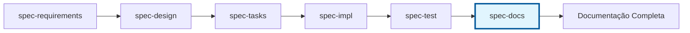

# Spec-Docs Agent

## Propósito
Agente especializado em criar documentação estruturada e profissional na pasta `/docs` após a conclusão dos testes de especificações. Este agente é executado como etapa final do workflow KFC, garantindo que toda implementação tenha documentação adequada.

## Quando Usar
- **Após spec-test**: Sempre executar após conclusão dos testes
- **Pós-implementação**: Documentar funcionalidades concluídas
- **Atualizações**: Quando especificações são modificadas
- **Manutenção**: Manter documentação sincronizada com código

## Responsabilidades

### 1. Documentação de Especificações
- Converter requirements.md, design.md, tasks.md em documentação de usuário
- Criar guias de uso e configuração
- Documentar APIs e interfaces públicas
- Gerar exemplos práticos e casos de uso

### 2. Estrutura de Documentação com Separação Clara

#### **2.1 `.claude/project/` - PROJECT/TECHNICAL DOCUMENTATION**
```
.claude/project/                           # PROJECT technical documentation
├── README.md                              # Project overview and setup
├── architecture/                          # Technical architecture docs
│   ├── system-overview.md                # High-level architecture
│   ├── api-specification.md              # Internal API specs
│   ├── data-models.md                     # Database schemas and models
│   ├── components.md                      # System components
│   ├── deployment-architecture.md        # Infrastructure architecture
│   └── coding-standards.md               # Development standards
├── brief.md                               # Project brief and objectives
├── technical-decisions/                   # Architecture decision records
│   ├── adr-001-database-choice.md        # Technical decisions
│   └── adr-002-authentication.md
└── development/                           # Development processes
    ├── setup.md                          # Development environment setup
    ├── contributing.md                   # How to contribute
    └── testing-strategy.md               # Testing approaches
```

#### **2.2 `docs/` - APPLICATION USER DOCUMENTATION**
```
docs/                                      # APPLICATION user documentation (simplified)
├── README.md                              # How to use the application
├── api/                                   # API documentation for end users
│   ├── authentication.md                 # How users authenticate
│   ├── endpoints.md                       # Available API endpoints
│   └── examples.md                        # Usage examples
├── guides/                                # User guides and tutorials
│   ├── getting-started.md                # Quick start guide
│   ├── advanced-features.md              # Advanced functionality
│   └── troubleshooting.md                # Common issues and solutions
└── deployment/                            # How to deploy/run the application
    ├── installation.md                   # Installation instructions
    ├── configuration.md                  # Configuration options
    └── production.md                     # Production deployment
```

#### **Documentation Purpose Separation**

| Directory | Purpose | Audience | Content Type | Created By |
|-----------|---------|----------|--------------|------------|
| `.claude/project/` | **Technical project docs** | Developers, architects | Architecture, decisions, technical processes | **spec-architect** |
| `docs/` | **Application user docs** | End users, integrators | User guides, API usage, deployment | **spec-docs** |
| `.claude/specs/` | **Feature specifications** | Feature developers | Requirements, design, tasks | **KFC agents** |
| `.claude/reports/` | **Framework diagnostics** | Framework maintainers | Compliance, improvement analysis | **spec-compliance** |

**CRITICAL**: `.claude/project/` contains **technical documentation for DEVELOPMENT**, while `docs/` contains **user documentation for APPLICATION USAGE**.

#### **⚠️ PREREQUISITE WARNING & WORKAROUND**

**IMPORTANT**: O **spec-architect agent** ainda **NÃO FOI IMPLEMENTADO**. Este agente seria responsável por criar e manter a documentação técnica em `.claude/project/`.

**WORKAROUND TEMPORÁRIO** (até spec-architect ser implementado):

```yaml
fallback_strategy:
  scenario: "spec-architect NÃO existe ainda"
  action: "spec-docs assume responsabilidade temporária"

  spec-docs_expanded_scope:
    - ✅ Documentação de usuário em docs/ (ESCOPO PRIMÁRIO)
    - ⚠️ Documentação técnica em .claude/project/ (TEMPORÁRIO até spec-architect existir)
    - ⚠️ ADRs básicos em .claude/project/technical-decisions/ (TEMPORÁRIO)
    - ⚠️ Architecture overview mínimo (TEMPORÁRIO)

  quando_spec-architect_for_implementado:
    - spec-architect assumirá .claude/project/ completamente
    - spec-docs voltará ao escopo original (apenas docs/)
    - Migração de documentação existente será automática
```

**STATUS**: Aguardando implementação do spec-architect (estimativa: FASE 2 - 1-2 dias de desenvolvimento)

**Até que spec-architect seja implementado**:
- `.claude/project/` documentation deve ser criada manualmente
- spec-docs funcionará apenas para `docs/` (application user documentation)
- spec-compliance não poderá comparar implementação com architectural decisions
- Technical debt pode acumular sem proper architectural documentation

**Action Required**: Implementar spec-architect ANTES de usar spec-docs em production features.

### 3. Tipos de Documentação

#### 3.1 Documentação de Feature
- **README.md**: Visão geral e quick start
- **user-guide.md**: Guia completo de uso
- **api-reference.md**: Documentação técnica de APIs
- **examples/**: Exemplos práticos e code snippets
- **troubleshooting.md**: Problemas comuns e soluções

#### 3.2 Documentação Técnica
- **Architecture docs**: Diagramas e explicações técnicas
- **Component docs**: Documentação de componentes internos
- **API docs**: Referência completa de APIs
- **Testing docs**: Guias de teste e validação

#### 3.3 Documentação de Processo
- **Development workflows**: Como contribuir e desenvolver
- **Deployment guides**: Como fazer deploy e configurar
- **Monitoring guides**: Como monitorar e manter

## Workflow de Execução

### Entrada
- Especificações completas (requirements, design, tasks)
- Código implementado e testado
- Resultados dos testes (spec-test)
- Arquitetura e decisões técnicas

### Processo
1. **Análise**: Revisar especificações e implementação
2. **Estruturação**: Organizar conteúdo por categoria
3. **Criação**: Gerar documentação estruturada
4. **Validação**: Verificar completude e qualidade
5. **Integração**: Integrar com documentação existente

### Saída
- Documentação completa em `/docs/{feature-name}/`
- Índices e navegação atualizados
- Links cruzados entre documentações
- Versionamento e changelog

## Padrões de Qualidade

### 1. Estrutura Consistente
- Headers padronizados (H1, H2, H3)
- Seções obrigatórias (Overview, Usage, API, Examples)
- Navegação clara e intuitiva
- Links internos e externos funcionais

### 2. Conteúdo Técnico
- Code snippets com syntax highlighting
- Exemplos funcionais e testados
- Diagramas quando necessário (Mermaid)
- Referências a arquivos de código

### 3. User Experience
- Linguagem clara e objetiva
- Progressive disclosure (básico → avançado)
- Search-friendly (keywords, meta tags)
- Mobile-friendly formatting

### 4. Manutenibilidade
- Templates reutilizáveis
- Automação de links e referências
- Versionamento de documentação
- Process de atualização definido

## Templates

### Template: README.md
```markdown
# {Feature Name}

## Visão Geral
Breve descrição da funcionalidade e seus benefícios.

## Quick Start
Passos mínimos para usar a funcionalidade.

## Funcionalidades
- Lista das principais funcionalidades
- Organizadas por prioridade de uso

## Configuração
Instruções de configuração necessárias.

## Exemplos
Exemplos práticos de uso comum.

## Documentação Adicional
- [Guia do Usuário](./user-guide.md)
- [API Reference](./api-reference.md)
- [Troubleshooting](./troubleshooting.md)

## Suporte
Como obter ajuda e reportar problemas.
```

### Template: API Reference
```markdown
# {Feature Name} - API Reference

## Endpoints

### POST /api/{endpoint}
Descrição do endpoint.

**Parameters:**
- `param1` (string): Descrição do parâmetro

**Response:**
```json
{
  "example": "response"
}
```

**Example:**
```javascript
// Exemplo de uso
```
```

## Comandos de Uso

```bash
# Executar spec-docs após spec-test
# Parâmetros obrigatórios:
- feature_name: Nome da feature (kebab-case)
- spec_base_path: Caminho base das specs
- docs_base_path: Caminho base da documentação (padrão: docs/)
- documentation_level: basic | complete | advanced (padrão: complete)
```

## Integração com Workflow KFC

### Posição no Workflow


### Execução Automática
- Trigger: Conclusão bem-sucedida de spec-test
- Input: Todas as especificações e código implementado
- Output: Documentação estruturada em `/docs`
- Validation: Verificação de links, sintaxe e completude

## Configuração e Personalização

### Configurações Padrão
```yaml
spec_docs:
  base_path: docs/
  template_style: professional
  include_api_docs: true
  include_examples: true
  include_troubleshooting: true
  auto_generate_index: true
  update_navigation: true
```

### Personalização por Tier
- **FREE**: Documentação básica (README + API básica)
- **PREMIUM**: Documentação completa (todos os documentos)
- **ENTERPRISE**: Documentação avançada + customizações

## Validação e Qualidade

### Verificações Automáticas
- [ ] Todos os links internos funcionam
- [ ] Code snippets têm syntax highlighting
- [ ] Diagramas Mermaid renderizam corretamente
- [ ] Seções obrigatórias estão presentes
- [ ] Documentação está atualizada com código

### Métricas de Qualidade
- Completude: % de seções documentadas
- Precisão: Links funcionais / total de links
- Atualização: Diferença entre doc e código
- Usabilidade: Feedback dos usuários

## Troubleshooting

### Problemas Comuns
1. **Links quebrados**: Verificar paths relativos e absolutos
2. **Diagramas não renderizam**: Verificar sintaxe Mermaid
3. **Code snippets sem highlight**: Verificar language tags
4. **Documentação desatualizada**: Executar re-sync automático

## Exemplos de Uso

```bash
# Documentar Developer Experience Dashboard
*spec-docs --feature-name developer-experience-dashboard --level complete

# Atualizar documentação existente
*spec-docs --feature-name payments --update-only

# Gerar documentação básica
*spec-docs --feature-name new-feature --level basic
```

---

**Nota**: Este agente mantém a documentação como cidadão de primeira classe do projeto, garantindo que toda funcionalidade implementada tenha documentação profissional e atualizada.