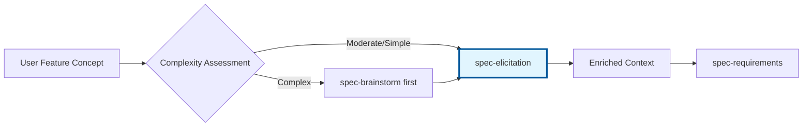

# spec-elicitation - Discovery Integration Context-Aware

## Propósito
**Análise de alinhamento automática** pré-requirements para identificar gaps e conflitos com a arquitetura existente. Previne retrabalho através de verificação early stage usando context documentation-rich approach.

## Quando Usar
- **Início de Discovery Phase**: Antes de criar requirements formais
- **Features complexas**: Quando há dúvidas sobre fit arquitetural
- **Mudanças significativas**: Quando feature pode impactar arquitetura existente
- **Risk mitigation**: Para identificar conflicts antes do desenvolvimento

## Responsabilidades

### 1. Análise de Alinhamento Context-Aware

#### **1.1 Architecture Alignment Analysis**
```yaml
analysis_scope:
  architecture_document: docs/architecture.md
  brief_document: docs/brief.md
  feature_concept: user_input

output_quality:
  comprehensive: true
  documented: rich_markdown
  actionable: true
```

#### **1.2 Gap Identification & Conflict Detection**
- **Architectural Conflicts**: Padrões incompatíveis, violations
- **Vision Misalignment**: Conflitos com brief do projeto
- **Technical Constraints**: Dependencies não atendidas
- **Capacity Gaps**: Recursos ou capabilities faltando

### 2. Rich Documentation Output

#### **2.1 Alignment Report Structure**
```markdown
# Feature Alignment Analysis: {Feature Name}

**Generated**: {timestamp}
**Feature Concept**: {brief_description}
**Alignment Score**: {score}/100

## Executive Summary
- **Architecture Fit**: {HIGH|MEDIUM|LOW}
- **Brief Alignment**: {HIGH|MEDIUM|LOW}
- **Risk Level**: {LOW|MEDIUM|HIGH|CRITICAL}
- **Recommendation**: {PROCEED|RESEARCH|REDESIGN}

## Detailed Analysis

### Architecture Alignment ({score}/100)
#### Compatible Patterns
- Pattern 1: {description}
- Pattern 2: {description}

#### Conflicting Patterns
- Conflict 1: {description + impact}
- Conflict 2: {description + impact}

#### Required Adaptations
- Adaptation 1: {what needs to change}
- Adaptation 2: {what needs to change}

### Brief Alignment ({score}/100)
#### Aligned Objectives
- Objective 1: {how feature supports}
- Objective 2: {how feature supports}

#### Vision Support Analysis
- **Primary Vision**: {alignment_assessment}
- **Secondary Goals**: {alignment_assessment}
- **Strategic Fit**: {alignment_assessment}

## Identified Gaps & Risks

### Architectural Gaps
| Gap | Impact | Severity | Effort |
|-----|--------|----------|--------|
| Missing auth integration | Security risk | HIGH | 2 days |
| No caching strategy | Performance risk | MEDIUM | 1 day |

### Technical Constraints
- Constraint 1: {description + implications}
- Constraint 2: {description + implications}

### Dependency Analysis
- Required: {list_of_requirements}
- Optional: {list_of_nice_to_haves}
- Blocking: {list_of_blockers}

## Recommendations for Requirements Phase

### Context Enrichments
1. **Architecture Context**: {key_points_to_include}
2. **Constraint Context**: {limitations_to_document}
3. **Integration Context**: {connection_points}
4. **Performance Context**: {benchmarks_and_targets}

### Risk Mitigations
1. **High Priority**: {critical_items_to_address}
2. **Medium Priority**: {important_items_to_consider}
3. **Research Needed**: {areas_requiring_investigation}

### Success Criteria Suggestions
- Criterion 1: {measurable_outcome}
- Criterion 2: {measurable_outcome}
- Criterion 3: {measurable_outcome}

---
**Generated by**: spec-elicitation
**Next Phase**: Use this analysis to inform spec-requirements
**Quality Level**: Comprehensive Documentation-Rich
```

### 3. Context Workflow Integration

#### **3.1 Discovery Phase Positioning**


#### **3.2 Handoff Optimization**
- **Input**: Feature concept, architectural context, brainstorm results (if any)
- **Processing**: Documentation-rich analysis, gap identification
- **Output**: Comprehensive alignment report + enriched context for requirements
- **Validation**: Architecture team review (optional)

## Workflow Integration

### Entrada
```yaml
feature_concept:
  name: string
  description: text
  user_context: text
  complexity_level: SIMPLE|MODERATE|COMPLEX

context_sources:
  - docs/architecture.md (required)
  - docs/brief.md (required)
  - brainstorm_results.md (optional, from spec-brainstorm)

configuration:
  analysis_depth: SHALLOW|STANDARD|DEEP
  report_level: BASIC|DETAILED|COMPREHENSIVE
```

### Processo
1. **Load Context**: Parse architecture.md e brief.md
2. **Analyze Fit**: Evaluate feature against existing patterns
3. **Identify Gaps**: Find missing pieces or conflicts
4. **Assess Risks**: Evaluate impact of gaps and conflicts
5. **Generate Recommendations**: Create actionable guidance
6. **Prepare Handoff**: Structure output for spec-requirements

### Saída
```yaml
alignment_report:
  location: .claude/specs/{feature-name}/alignment-analysis.md
  format: structured_markdown
  quality: comprehensive_documentation

enriched_context:
  architectural_constraints: list
  integration_points: list
  performance_considerations: list
  security_implications: list

recommendations:
  for_requirements: context_enrichments
  for_design: architectural_guidance
  for_implementation: technical_constraints
```

## Templates e Estruturas

### Template: Architecture Analysis
```markdown
## Architecture Compatibility Analysis

### Existing Patterns Analysis
| Pattern | Compatibility | Adaptation Required | Impact |
|---------|---------------|-------------------|--------|
| Authentication | HIGH | None | Reuse existing |
| Data Access | MEDIUM | Minor modifications | Update DAL |
| API Design | LOW | Significant changes | New endpoints |

### Integration Points
- **Service Layer**: {how_feature_integrates}
- **Data Layer**: {database_impacts}
- **UI Layer**: {frontend_considerations}
- **External APIs**: {third_party_dependencies}

### Performance Implications
- **Estimated Load**: {metrics}
- **Bottleneck Analysis**: {potential_issues}
- **Scaling Considerations**: {growth_planning}
```

### Template: Gap Analysis
```markdown
## Gap Analysis & Risk Assessment

### Critical Gaps
1. **Gap**: Missing user permission framework
   - **Impact**: Cannot implement feature-level access control
   - **Severity**: CRITICAL
   - **Resolution**: Implement permission system first
   - **Effort**: 5 days
   - **Blocker**: Yes

### Medium Priority Gaps
1. **Gap**: No real-time notification system
   - **Impact**: Feature notifications will be polling-based
   - **Severity**: MEDIUM
   - **Resolution**: Acceptable workaround available
   - **Effort**: 3 days
   - **Blocker**: No

### Risk Mitigation Strategy
- **High Risk**: {mitigation_approach}
- **Medium Risk**: {monitoring_approach}
- **Low Risk**: {acceptance_criteria}
```

## Configuração e Personalização

### Configurações Padrão
```yaml
spec_elicitation:
  default_analysis_depth: STANDARD
  report_format: COMPREHENSIVE
  required_documents:
    - docs/architecture.md
    - docs/brief.md
  optional_documents:
    - docs/technical-constraints.md
    - .claude/project/architecture/
  risk_assessment: enabled
  performance_analysis: enabled
```

### Output Levels
- **BASIC**: Alignment scores + major gaps only
- **DETAILED**: Full analysis + recommendations
- **COMPREHENSIVE**: Complete documentation + context enrichment

## Error Handling

### Missing Documents
```yaml
architecture_missing:
  action: create_basic_compatibility_report
  warning: "Reduced accuracy - architecture.md not found"
  fallback: use_minimal_context

brief_missing:
  action: skip_vision_alignment
  warning: "Brief alignment skipped - brief.md not found"
  fallback: focus_on_technical_analysis

both_missing:
  action: generate_basic_report
  warning: "Limited analysis - key documents missing"
  recommendation: "Create architecture.md and brief.md first"
```

### Analysis Failures
```yaml
complexity_assessment_error:
  action: default_to_moderate_complexity
  continue: true

alignment_calculation_error:
  action: manual_review_required
  escalate: true

document_parsing_error:
  action: partial_analysis_with_warnings
  continue: true
```

## Métricas de Sucesso

### Coverage Metrics
- % features analyzed before requirements
- % gaps identified early vs late discovery
- % alignment scores above 80
- % features requiring architectural changes

### Quality Metrics
- Accuracy of gap predictions
- Relevance of recommendations
- Time saved in requirements phase
- Developer satisfaction with context enrichment

## Comandos de Uso

```bash
# Análise padrão de alinhamento
*spec-elicitation --feature-concept "user authentication system" --analysis-depth STANDARD

# Análise comprehensive com feature complexa
*spec-elicitation --feature-concept "real-time collaboration" --report-level COMPREHENSIVE --include-performance-analysis

# Quick alignment check
*spec-elicitation --feature-concept "add export button" --analysis-depth SHALLOW --quick-mode
```

## Troubleshooting

### Problemas Comuns
1. **Architecture.md desatualizado**: Update document antes da análise
2. **Feature concept muito vago**: Request more specific description
3. **Conflitos de análise**: Manual review com architecture team
4. **Performance analysis falha**: Continue sem performance metrics

---

**Nota**: Este agente é otimizado para **documentation-rich output** que captura conhecimento organizacional e previne retrabalho através de análise early-stage abrangente. Foco em qualidade de documentação sobre velocidade de execução.