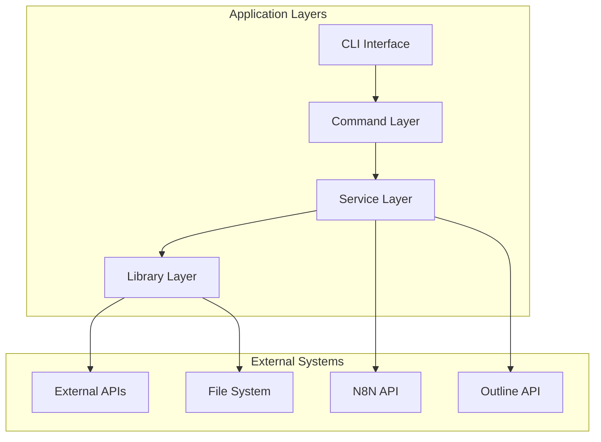

# Architecture Patterns - docs-jana

## Overview

Este documento define os padrões arquiteturais utilizados no projeto docs-jana, garantindo consistência, escalabilidade e manutenibilidade.

## System Architecture

### High-Level Architecture



## Architectural Layers

### 1. CLI Layer
**Purpose**: User interface and command parsing

**Responsibilities**:
- Parse command-line arguments
- Display output and progress
- Handle user interaction
- Route to appropriate commands

**Example**:
```javascript
// cli.js
#!/usr/bin/env node
import { program } from 'commander';
import { n8nDownloadCommand } from './src/commands/n8n-download.js';

program
  .command('n8n:download')
  .description('Download workflows from N8N')
  .option('-f, --folder <folder>', 'Target folder')
  .action(n8nDownloadCommand);

program.parse();
```

### 2. Command Layer
**Purpose**: Command implementation and orchestration

**Responsibilities**:
- Validate command options
- Orchestrate service calls
- Handle command-specific logic
- Format output for CLI

**Pattern**: Command Pattern

**Example**:
```javascript
// src/commands/n8n-download.js
import { N8NService } from '../services/N8NService.js';
import { FileService } from '../services/FileService.js';
import { createProgressBar } from '../lib/utils/progress.js';

export async function n8nDownloadCommand(options) {
  // 1. Validate options
  validateOptions(options);

  // 2. Initialize services
  const n8nService = new N8NService(config.n8n);
  const fileService = new FileService();

  // 3. Execute business logic
  const workflows = await n8nService.getWorkflows();
  const progress = createProgressBar(workflows.length);

  for (const workflow of workflows) {
    await fileService.saveWorkflow(workflow, options.folder);
    progress.increment();
  }

  // 4. Return result
  return {
    success: true,
    downloaded: workflows.length,
  };
}
```

### 3. Service Layer
**Purpose**: Business logic and external API interaction

**Responsibilities**:
- Implement business logic
- Manage external API calls
- Handle data transformation
- Implement retry logic and error handling

**Pattern**: Service Pattern / Repository Pattern

**Example**:
```javascript
// src/services/N8NService.js
import axios from 'axios';
import { ApiError } from '../lib/errors/ApiError.js';

/**
 * Service for N8N API interactions
 */
export class N8NService {
  constructor(config) {
    this.apiUrl = config.apiUrl;
    this.apiKey = config.apiKey;
    this.client = this._createClient();
  }

  /**
   * Fetches all workflows from N8N
   * @returns {Promise<Array>} List of workflows
   */
  async getWorkflows() {
    try {
      const response = await this.client.get('/workflows');
      return this._transformWorkflows(response.data);
    } catch (error) {
      throw new ApiError('Failed to fetch workflows', error);
    }
  }

  /**
   * Uploads a workflow to N8N
   * @param {Object} workflow - Workflow object
   * @returns {Promise<Object>} Upload result
   */
  async uploadWorkflow(workflow) {
    const validated = this._validateWorkflow(workflow);
    const sanitized = this._sanitizeWorkflow(validated);

    try {
      const response = await this.client.post('/workflows', sanitized);
      return response.data;
    } catch (error) {
      throw new ApiError('Failed to upload workflow', error);
    }
  }

  // Private methods
  _createClient() {
    return axios.create({
      baseURL: this.apiUrl,
      headers: {
        'X-N8N-API-KEY': this.apiKey,
      },
    });
  }

  _transformWorkflows(data) {
    return data.map(this._transformWorkflow);
  }

  _transformWorkflow(workflow) {
    return {
      id: workflow.id,
      name: workflow.name,
      active: workflow.active,
      nodes: workflow.nodes || [],
      connections: workflow.connections || {},
    };
  }

  _validateWorkflow(workflow) {
    if (!workflow.id) throw new Error('Workflow ID required');
    if (!workflow.name) throw new Error('Workflow name required');
    return workflow;
  }

  _sanitizeWorkflow(workflow) {
    // Remove internal fields
    const { __internal, _cache, ...clean } = workflow;
    return clean;
  }
}
```

### 4. Library Layer
**Purpose**: Reusable utilities and helpers

**Responsibilities**:
- Provide utility functions
- Handle cross-cutting concerns
- Implement common patterns

**Pattern**: Utility/Helper Pattern

**Example**:
```javascript
// src/lib/utils/fileUtils.js

/**
 * Sanitizes a filename
 * @param {string} filename - Filename to sanitize
 * @returns {string} Sanitized filename
 */
export function sanitizeFilename(filename) {
  return filename
    .replace(/[^a-z0-9.-]/gi, '-')
    .toLowerCase()
    .replace(/-+/g, '-')
    .replace(/^-|-$/g, '');
}

/**
 * Ensures directory exists
 * @param {string} dirPath - Directory path
 * @returns {Promise<void>}
 */
export async function ensureDir(dirPath) {
  try {
    await fs.access(dirPath);
  } catch {
    await fs.mkdir(dirPath, { recursive: true });
  }
}
```

## Design Patterns

### 1. Service Pattern

**When to use**: Encapsulate business logic and external API calls

**Structure**:
```javascript
class ServiceName {
  constructor(config) {
    // Initialize service
  }

  async publicMethod() {
    // Public API
  }

  _privateMethod() {
    // Internal implementation
  }
}
```

**Benefits**:
- Encapsulation
- Testability
- Reusability
- Single Responsibility

### 2. Repository Pattern

**When to use**: Abstract data access layer

**Structure**:
```javascript
class WorkflowRepository {
  constructor(dataSource) {
    this.dataSource = dataSource;
  }

  async findById(id) {
    return this.dataSource.findOne({ id });
  }

  async findAll(filters = {}) {
    return this.dataSource.find(filters);
  }

  async save(workflow) {
    return this.dataSource.save(workflow);
  }

  async delete(id) {
    return this.dataSource.delete({ id });
  }
}
```

**Benefits**:
- Data access abstraction
- Easy to swap data sources
- Centralized query logic
- Better testability

### 3. Factory Pattern

**When to use**: Create complex objects or services

**Structure**:
```javascript
class ServiceFactory {
  static createN8NService(env = 'production') {
    const config = this._getConfig(env);
    return new N8NService(config);
  }

  static createOutlineService(env = 'production') {
    const config = this._getConfig(env);
    return new OutlineService(config);
  }

  static _getConfig(env) {
    return env === 'test' ? testConfig : productionConfig;
  }
}

// Usage
const service = ServiceFactory.createN8NService('production');
```

**Benefits**:
- Centralized object creation
- Environment-specific configuration
- Easier testing
- Dependency injection

### 4. Strategy Pattern

**When to use**: Multiple algorithms/approaches for same task

**Structure**:
```javascript
// Different upload strategies
class DirectUploadStrategy {
  async upload(workflow) {
    return api.post('/workflows', workflow);
  }
}

class BatchUploadStrategy {
  async upload(workflows) {
    return api.post('/workflows/batch', workflows);
  }
}

class UploadService {
  constructor(strategy) {
    this.strategy = strategy;
  }

  setStrategy(strategy) {
    this.strategy = strategy;
  }

  async execute(data) {
    return this.strategy.upload(data);
  }
}

// Usage
const uploader = new UploadService(new DirectUploadStrategy());
await uploader.execute(workflow);

// Switch strategy
uploader.setStrategy(new BatchUploadStrategy());
await uploader.execute(workflows);
```

**Benefits**:
- Flexible algorithm selection
- Open/Closed Principle
- Runtime strategy switching
- Better testability

### 5. Builder Pattern

**When to use**: Construct complex objects step by step

**Structure**:
```javascript
class WorkflowBuilder {
  constructor() {
    this.workflow = {
      nodes: [],
      connections: {},
    };
  }

  withId(id) {
    this.workflow.id = id;
    return this;
  }

  withName(name) {
    this.workflow.name = name;
    return this;
  }

  addNode(node) {
    this.workflow.nodes.push(node);
    return this;
  }

  addConnection(source, target) {
    this.workflow.connections[source] = target;
    return this;
  }

  build() {
    this._validate();
    return this.workflow;
  }

  _validate() {
    if (!this.workflow.id) throw new Error('ID required');
    if (!this.workflow.name) throw new Error('Name required');
  }
}

// Usage
const workflow = new WorkflowBuilder()
  .withId('wf-123')
  .withName('My Workflow')
  .addNode({ id: 'node1', type: 'trigger' })
  .addNode({ id: 'node2', type: 'action' })
  .addConnection('node1', 'node2')
  .build();
```

**Benefits**:
- Fluent interface
- Step-by-step construction
- Validation before creation
- Immutable result

### 6. Middleware Pattern

**When to use**: Add cross-cutting concerns (logging, validation, etc)

**Structure**:
```javascript
class RequestPipeline {
  constructor() {
    this.middlewares = [];
  }

  use(middleware) {
    this.middlewares.push(middleware);
    return this;
  }

  async execute(context) {
    let index = 0;

    const next = async () => {
      if (index >= this.middlewares.length) return;

      const middleware = this.middlewares[index++];
      await middleware(context, next);
    };

    await next();
    return context;
  }
}

// Middleware functions
const loggingMiddleware = async (ctx, next) => {
  console.log('Request:', ctx.request);
  await next();
  console.log('Response:', ctx.response);
};

const validationMiddleware = async (ctx, next) => {
  if (!ctx.request.id) {
    throw new Error('ID required');
  }
  await next();
};

const authMiddleware = async (ctx, next) => {
  ctx.user = await authenticate(ctx.request.token);
  await next();
};

// Usage
const pipeline = new RequestPipeline()
  .use(loggingMiddleware)
  .use(authMiddleware)
  .use(validationMiddleware);

await pipeline.execute(context);
```

**Benefits**:
- Separation of concerns
- Reusable middleware
- Easy to add/remove features
- Clear execution flow

## Error Handling Architecture

### Error Hierarchy

```javascript
// Base error
class AppError extends Error {
  constructor(message, code) {
    super(message);
    this.name = this.constructor.name;
    this.code = code;
    Error.captureStackTrace(this, this.constructor);
  }
}

// Specific errors
class ValidationError extends AppError {
  constructor(message, field) {
    super(message, 'VALIDATION_ERROR');
    this.field = field;
  }
}

class ApiError extends AppError {
  constructor(message, statusCode) {
    super(message, 'API_ERROR');
    this.statusCode = statusCode;
  }
}

class NotFoundError extends AppError {
  constructor(resource, id) {
    super(`${resource} not found: ${id}`, 'NOT_FOUND');
    this.resource = resource;
    this.id = id;
  }
}
```

### Error Handling Flow

```javascript
async function handleCommand(options) {
  try {
    // Command execution
    const result = await executeCommand(options);
    return { success: true, data: result };
  } catch (error) {
    // Log error
    logger.error('Command failed', {
      error: error.message,
      code: error.code,
      stack: error.stack,
    });

    // Transform error for user
    if (error instanceof ValidationError) {
      return {
        success: false,
        error: `Invalid ${error.field}: ${error.message}`,
      };
    }

    if (error instanceof ApiError) {
      return {
        success: false,
        error: `API error (${error.statusCode}): ${error.message}`,
      };
    }

    // Generic error
    return {
      success: false,
      error: 'An unexpected error occurred',
    };
  }
}
```

## Configuration Management

### Configuration Pattern

```javascript
// config/index.js
import dotenv from 'dotenv';

dotenv.config();

export const config = {
  n8n: {
    apiUrl: process.env.N8N_API_URL,
    apiKey: process.env.N8N_API_KEY,
    timeout: parseInt(process.env.N8N_TIMEOUT) || 5000,
  },

  outline: {
    apiUrl: process.env.OUTLINE_API_URL,
    apiKey: process.env.OUTLINE_API_KEY,
    collectionId: process.env.OUTLINE_COLLECTION_ID,
  },

  app: {
    env: process.env.NODE_ENV || 'development',
    logLevel: process.env.LOG_LEVEL || 'info',
    maxRetries: parseInt(process.env.MAX_RETRIES) || 3,
  },
};

// Validate configuration
export function validateConfig() {
  const required = ['N8N_API_URL', 'N8N_API_KEY'];

  for (const key of required) {
    if (!process.env[key]) {
      throw new Error(`Missing required environment variable: ${key}`);
    }
  }
}
```

## Logging Architecture

### Structured Logging

```javascript
// lib/logger.js
class Logger {
  constructor(context = {}) {
    this.context = context;
  }

  info(message, meta = {}) {
    this._log('INFO', message, meta);
  }

  error(message, meta = {}) {
    this._log('ERROR', message, meta);
  }

  warn(message, meta = {}) {
    this._log('WARN', message, meta);
  }

  _log(level, message, meta) {
    const logEntry = {
      timestamp: new Date().toISOString(),
      level,
      message,
      ...this.context,
      ...meta,
    };

    console.log(JSON.stringify(logEntry));
  }

  child(context) {
    return new Logger({ ...this.context, ...context });
  }
}

// Usage
const logger = new Logger({ service: 'n8n-service' });
const requestLogger = logger.child({ requestId: '123' });

requestLogger.info('Processing workflow', { workflowId: 'wf-456' });
```

## Testing Architecture

### Test Organization

```
__tests__/
├── unit/              # Fast, isolated tests
├── integration/       # Service integration tests
├── e2e/              # End-to-end workflow tests
├── __fixtures__/     # Test data
└── __mocks__/        # Mock implementations
```

### Testing Patterns

```javascript
// Unit test example
describe('N8NService', () => {
  let service;
  let mockClient;

  beforeEach(() => {
    mockClient = createMockClient();
    service = new N8NService({ client: mockClient });
  });

  it('should fetch workflows', async () => {
    mockClient.get.mockResolvedValue({ data: [workflow] });

    const result = await service.getWorkflows();

    expect(result).toHaveLength(1);
    expect(mockClient.get).toHaveBeenCalledWith('/workflows');
  });
});
```

## Performance Considerations

### Caching Strategy

```javascript
class CachedService {
  constructor(service, ttl = 60000) {
    this.service = service;
    this.cache = new Map();
    this.ttl = ttl;
  }

  async get(key) {
    const cached = this.cache.get(key);

    if (cached && Date.now() - cached.timestamp < this.ttl) {
      return cached.data;
    }

    const data = await this.service.get(key);
    this.cache.set(key, { data, timestamp: Date.now() });

    return data;
  }

  invalidate(key) {
    this.cache.delete(key);
  }

  clear() {
    this.cache.clear();
  }
}
```

### Batch Processing

```javascript
async function processBatch(items, batchSize = 10) {
  const results = [];

  for (let i = 0; i < items.length; i += batchSize) {
    const batch = items.slice(i, i + batchSize);
    const batchResults = await Promise.all(batch.map(processItem));
    results.push(...batchResults);
  }

  return results;
}
```

---

**Last Updated**: 2024-10-01
**Version**: 1.0.0
