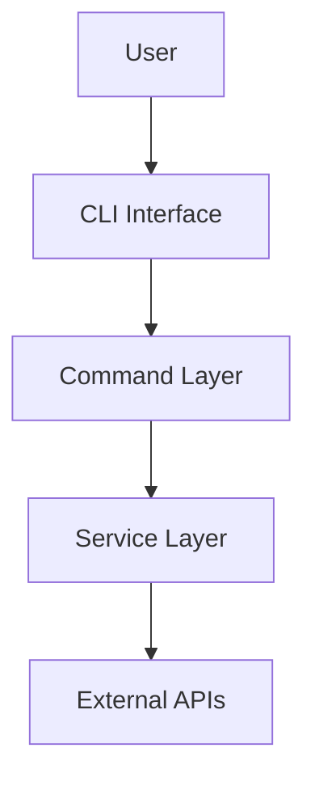

# Documentation Standards - docs-jana

## Overview

Este documento define os padrões de documentação para o projeto docs-jana, garantindo clareza, consistência e facilidade de manutenção.

## Documentation Types

### 1. Code Documentation (JSDoc)
### 2. API Documentation
### 3. User Documentation (README, Guides)
### 4. Architecture Documentation
### 5. Specification Documents (KFC Workflow)

---

## 1. Code Documentation (JSDoc)

### Function Documentation

```javascript
/**
 * Uploads a workflow to N8N API
 *
 * This function handles the complete upload process including:
 * - Validation of workflow structure
 * - Sanitization of sensitive data
 * - Retry logic for network failures
 * - Progress tracking
 *
 * @param {Object} workflow - The workflow object to upload
 * @param {string} workflow.id - Unique workflow identifier
 * @param {string} workflow.name - Human-readable workflow name
 * @param {Array<Node>} workflow.nodes - Array of workflow nodes
 * @param {Object} workflow.connections - Node connection mapping
 * @param {Object} [options] - Optional configuration
 * @param {boolean} [options.overwrite=false] - Whether to overwrite existing workflow
 * @param {number} [options.timeout=5000] - Request timeout in milliseconds
 * @param {number} [options.retries=3] - Number of retry attempts
 *
 * @returns {Promise<UploadResult>} Upload result object
 * @returns {boolean} returns.success - Whether upload was successful
 * @returns {string} returns.id - ID of uploaded workflow
 * @returns {string} returns.message - Status message
 *
 * @throws {ValidationError} If workflow structure is invalid
 * @throws {ApiError} If API request fails after all retries
 * @throws {NetworkError} If network is unavailable
 *
 * @example
 * // Basic upload
 * const result = await uploadWorkflow({
 *   id: 'wf-123',
 *   name: 'My Workflow',
 *   nodes: [...],
 *   connections: {...}
 * });
 *
 * @example
 * // Upload with options
 * const result = await uploadWorkflow(workflow, {
 *   overwrite: true,
 *   timeout: 10000,
 *   retries: 5
 * });
 *
 * @see {@link https://docs.n8n.io/api/workflows|N8N Workflow API}
 */
async function uploadWorkflow(workflow, options = {}) {
  // Implementation
}
```

### Class Documentation

```javascript
/**
 * Service for interacting with N8N API
 *
 * Provides methods for managing workflows including:
 * - Fetching workflows (all or by ID)
 * - Creating new workflows
 * - Updating existing workflows
 * - Deleting workflows
 *
 * Includes built-in error handling and retry logic.
 *
 * @class
 * @example
 * const service = new N8NService({
 *   apiUrl: 'https://n8n.example.com',
 *   apiKey: 'your-api-key'
 * });
 *
 * const workflows = await service.getWorkflows();
 */
class N8NService {
  /**
   * Creates an N8N service instance
   *
   * @param {Object} config - Service configuration
   * @param {string} config.apiUrl - N8N API base URL (e.g., 'https://n8n.example.com')
   * @param {string} config.apiKey - N8N API authentication key
   * @param {number} [config.timeout=5000] - Request timeout in milliseconds
   * @param {number} [config.retries=3] - Number of retry attempts for failed requests
   *
   * @throws {Error} If apiUrl or apiKey is missing
   */
  constructor(config) {
    // Implementation
  }

  /**
   * Fetches all workflows from N8N
   *
   * @async
   * @returns {Promise<Array<Workflow>>} Array of workflow objects
   * @throws {ApiError} If API request fails
   */
  async getWorkflows() {
    // Implementation
  }
}
```

### Type Definitions

```javascript
/**
 * @typedef {Object} Workflow
 * @property {string} id - Unique workflow identifier (UUID format)
 * @property {string} name - Human-readable workflow name (max 255 chars)
 * @property {boolean} active - Whether workflow is active and can be triggered
 * @property {Array<Node>} nodes - Array of workflow nodes
 * @property {Object<string, Connection>} connections - Node connection mapping
 * @property {WorkflowSettings} settings - Workflow configuration settings
 * @property {Object} metadata - Additional metadata
 * @property {Date} metadata.createdAt - Creation timestamp
 * @property {Date} metadata.updatedAt - Last update timestamp
 * @property {string} metadata.createdBy - Creator user ID
 */

/**
 * @typedef {Object} Node
 * @property {string} id - Unique node identifier
 * @property {string} name - Node display name
 * @property {string} type - Node type (e.g., 'n8n-nodes-base.httpRequest')
 * @property {string} typeVersion - Node type version
 * @property {Object} parameters - Node-specific parameters
 * @property {Position} position - Node position on canvas
 */

/**
 * @typedef {Object} Position
 * @property {number} x - X coordinate on canvas
 * @property {number} y - Y coordinate on canvas
 */

/**
 * @typedef {Object} UploadResult
 * @property {boolean} success - Whether operation was successful
 * @property {string} id - Workflow ID
 * @property {string} message - Status message
 * @property {Object} [error] - Error details if failed
 */
```

### Module Documentation

```javascript
/**
 * Utility functions for file operations
 *
 * Provides helper functions for common file system operations including:
 * - Filename sanitization
 * - Directory creation and management
 * - File reading/writing with error handling
 * - Path resolution and validation
 *
 * All functions handle errors gracefully and provide detailed error messages.
 *
 * @module fileUtils
 * @example
 * import { sanitizeFilename, ensureDir } from './lib/utils/fileUtils.js';
 *
 * const safe = sanitizeFilename('my@file#name.txt');
 * await ensureDir('/path/to/directory');
 */
```

---

## 2. API Documentation

### Endpoint Documentation Format

```markdown
## POST /workflows

Uploads a new workflow to N8N.

### Authentication
Requires API key in `X-N8N-API-KEY` header.

### Request

**Headers:**
```
Content-Type: application/json
X-N8N-API-KEY: your-api-key
```

**Body:**
```json
{
  "id": "workflow-123",
  "name": "My Workflow",
  "active": true,
  "nodes": [...],
  "connections": {...}
}
```

**Parameters:**

| Field | Type | Required | Description |
|-------|------|----------|-------------|
| id | string | Yes | Unique workflow identifier (UUID) |
| name | string | Yes | Workflow name (max 255 chars) |
| active | boolean | No | Whether workflow is active (default: false) |
| nodes | Array | Yes | Array of workflow nodes |
| connections | Object | Yes | Node connections mapping |

### Response

**Success (200 OK):**
```json
{
  "success": true,
  "data": {
    "id": "workflow-123",
    "name": "My Workflow",
    "createdAt": "2024-01-01T00:00:00Z"
  }
}
```

**Error (400 Bad Request):**
```json
{
  "success": false,
  "error": {
    "code": "VALIDATION_ERROR",
    "message": "Invalid workflow structure",
    "details": [
      {
        "field": "nodes",
        "message": "At least one node required"
      }
    ]
  }
}
```

### Error Codes

| Code | Status | Description |
|------|--------|-------------|
| VALIDATION_ERROR | 400 | Request validation failed |
| UNAUTHORIZED | 401 | Invalid or missing API key |
| NOT_FOUND | 404 | Workflow not found |
| CONFLICT | 409 | Workflow with ID already exists |
| INTERNAL_ERROR | 500 | Server error |

### Example

```bash
curl -X POST https://n8n.example.com/api/v1/workflows \
  -H "Content-Type: application/json" \
  -H "X-N8N-API-KEY: your-api-key" \
  -d '{
    "id": "workflow-123",
    "name": "My Workflow",
    "nodes": [],
    "connections": {}
  }'
```
```

---

## 3. User Documentation

### README Structure

```markdown
# Project Name

Brief description of what the project does (1-2 sentences).

## Features

- Feature 1
- Feature 2
- Feature 3

## Installation

### Prerequisites
- Node.js >= 14.0.0
- pnpm >= 8.0.0

### Steps

```bash
# Clone repository
git clone https://github.com/your-org/docs-jana.git

# Install dependencies
pnpm install

# Setup environment
cp .env.example .env
# Edit .env with your configuration

# Run
pnpm start
```

## Usage

### Basic Usage

```bash
# Download workflows from N8N
docs-jana n8n:download --folder jana

# Upload to Outline
docs-jana outline:upload --folder jana
```

### Advanced Usage

[More detailed examples...]

## Configuration

### Environment Variables

| Variable | Required | Default | Description |
|----------|----------|---------|-------------|
| N8N_API_URL | Yes | - | N8N API base URL |
| N8N_API_KEY | Yes | - | N8N API key |
| OUTLINE_API_URL | Yes | - | Outline API URL |

### Configuration File

[Details about configuration file...]

## Documentation

- [API Documentation](docs/api/README.md)
- [User Guide](docs/guides/user-guide.md)
- [Architecture](docs/architecture.md)
- [Contributing](CONTRIBUTING.md)

## Troubleshooting

### Common Issues

#### Issue 1: API Authentication Failed
**Symptom:** Error message "Unauthorized"
**Solution:** Check that your API key is correct in .env file

#### Issue 2: Network Timeout
**Symptom:** Request times out
**Solution:** Increase timeout in configuration

## License

MIT License - see [LICENSE](LICENSE) file

## Support

- GitHub Issues: [Report a bug](https://github.com/your-org/docs-jana/issues)
- Documentation: [Read the docs](https://docs.example.com)
```

### User Guide Structure

```markdown
# User Guide

## Table of Contents

1. [Getting Started](#getting-started)
2. [Core Concepts](#core-concepts)
3. [Common Tasks](#common-tasks)
4. [Advanced Features](#advanced-features)
5. [Troubleshooting](#troubleshooting)

## Getting Started

### What is docs-jana?

[Clear explanation of the tool's purpose and benefits]

### Quick Start

[Step-by-step guide to get users productive quickly]

## Core Concepts

### Concept 1: Workflows

[Explanation with examples and diagrams]

### Concept 2: Collections

[Explanation with examples and diagrams]

## Common Tasks

### Task 1: Downloading Workflows

**Goal:** Download all workflows from N8N to local files

**Steps:**
1. Configure your N8N credentials
2. Run the download command
3. Verify the downloaded files

**Command:**
```bash
docs-jana n8n:download --folder my-workflows
```

**Expected Output:**
```
Downloading workflows...
✓ Workflow 1 downloaded
✓ Workflow 2 downloaded
Done! 2 workflows downloaded to ./workflows/my-workflows
```

[More tasks...]

## Advanced Features

[Advanced usage patterns and features]

## Troubleshooting

[Common problems and solutions]
```

---

## 4. Architecture Documentation

### Architecture Decision Records (ADR)

```markdown
# ADR 001: Use Service Pattern for API Interactions

## Status
Accepted

## Context
We need a consistent way to interact with external APIs (N8N, Outline).
Multiple approaches exist: direct API calls, service classes, repositories.

## Decision
We will use the Service Pattern with dedicated service classes for each API.

## Consequences

### Positive
- Clear separation of concerns
- Easy to test with mocks
- Consistent error handling
- Reusable across commands

### Negative
- Additional abstraction layer
- More files to maintain

## Implementation
- Create `N8NService` class
- Create `OutlineService` class
- Use dependency injection for configuration

## Date
2024-01-01

## Author
Team Lead
```

### Architecture Diagrams

```markdown
# System Architecture

## Overview



## Component Details

### CLI Layer
[Description of CLI layer]

### Command Layer
[Description of command layer]

[More details...]
```

---

## 5. Specification Documents (KFC Workflow)

See templates in `.claude/templates/` for detailed specification document formats:
- `requirements-template.md`
- `design-template.md`
- `tasks-template.md`

---

## Documentation Best Practices

### Writing Style

#### Clear and Concise
```markdown
✅ Good:
"Configure your N8N API credentials in the .env file"

❌ Bad:
"You should probably configure the N8N API credentials somewhere,
maybe in the .env file or something like that"
```

#### Active Voice
```markdown
✅ Good:
"The service validates the workflow before uploading"

❌ Bad:
"The workflow is validated by the service before being uploaded"
```

#### Examples
Always provide examples for:
- API usage
- Configuration
- CLI commands
- Code patterns

### Organization

#### Logical Structure
- Start with overview
- Progress from simple to complex
- Group related information
- Use clear headings

#### Table of Contents
For documents > 100 lines, include TOC

#### Cross-References
Link to related documentation

### Maintenance

#### Keep Updated
- Update docs with code changes
- Review quarterly for accuracy
- Archive outdated docs

#### Version Documentation
- Tag docs with version numbers
- Maintain changelog
- Document breaking changes

---

## Tools and Automation

### JSDoc Generation
```bash
# Generate JSDoc documentation
pnpm run docs:generate
```

### Markdown Linting
```bash
# Lint markdown files
pnpm run docs:lint
```

### Documentation Testing
```bash
# Test code examples in docs
pnpm run docs:test
```

---

**Last Updated**: 2024-10-01
**Version**: 1.0.0
