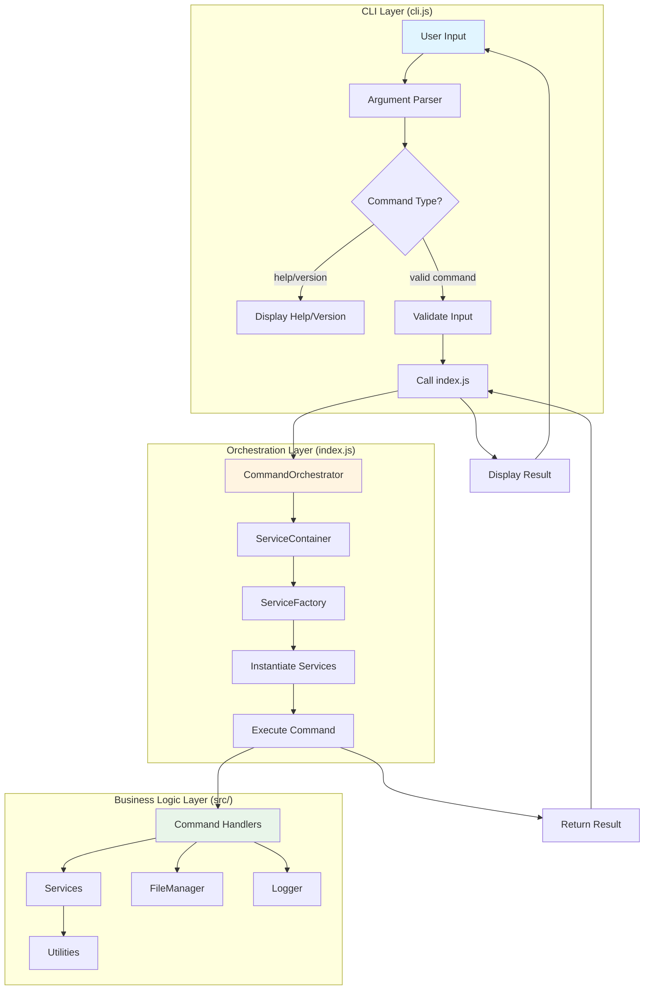
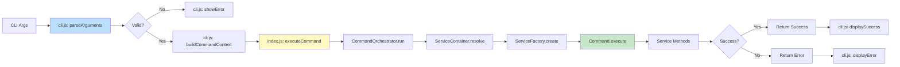
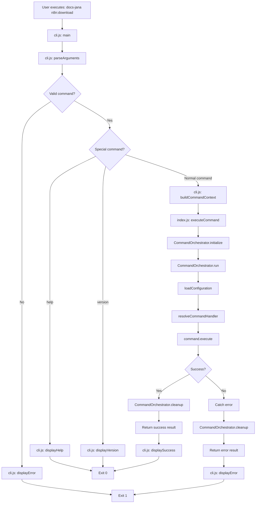
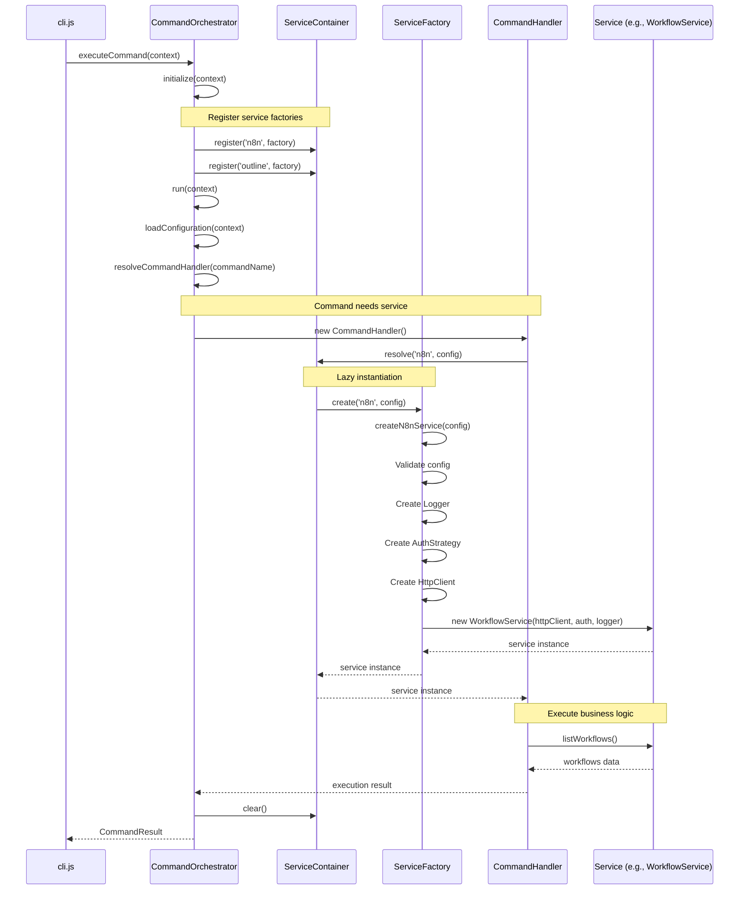
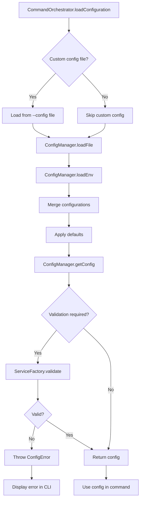
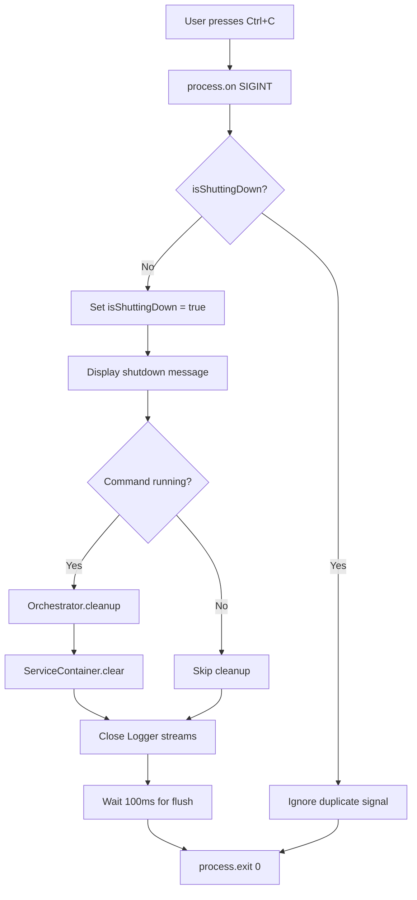
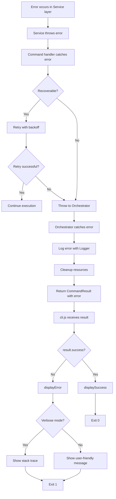

# Design Document: CLI Architecture Refactor

## Overview

Este documento descreve o design arquitetural para a refatoração completa da arquitetura do repositório docs-jana. O objetivo é separar claramente as responsabilidades entre interface CLI (cli.js) e lógica de orquestração (index.js), além de reorganizar a estrutura de arquivos do repositório para melhorar a manutenibilidade.

### Objetivos do Design

1. **Separação de Responsabilidades**: cli.js como interface interativa; index.js como camada de orquestração
2. **Integração com Patterns Existentes**: Usar Factory, Service Locator e Dependency Injection já implementados
3. **Reorganização de Arquivos**: Mover scripts e documentos técnicos para estrutura apropriada
4. **Zero Breaking Changes**: Preservar toda funcionalidade existente
5. **Testabilidade**: Facilitar testes unitários e de integração

### Escopo

**In Scope:**
- Refatoração de cli.js para interface CLI pura
- Refatoração de index.js para camada de orquestração com DI
- Criação de CommandOrchestrator para coordenar execução de comandos
- Reorganização de scripts JavaScript (test-*.js, cleanup-*.js, etc.)
- Reorganização de documentos técnicos (*.md da raiz)
- Atualização de package.json entry points
- Documentação da nova arquitetura

**Out of Scope:**
- Modificação de lógica de negócio em /src/services
- Modificação de comandos existentes em /src/commands
- Mudanças em design patterns estabelecidos (Factory, Service Locator)
- Adição de novos comandos ou features

---

## Architecture Design

### System Architecture Diagram



### Data Flow Diagram



### Architectural Layers

#### Layer 1: CLI Interface (cli.js)

**Responsabilidades:**
- Parsing de argumentos CLI (process.argv)
- Validação de entrada do usuário
- Exibição de help, version, error messages
- Graceful shutdown (SIGINT/SIGTERM)
- Invocação do orchestration layer

**Características:**
- **Thin layer**: Mínima lógica de negócio
- **User-facing**: Toda interação com usuário acontece aqui
- **Synchronous**: Parsing e validação são síncronos
- **Error handling**: Captura erros da camada de orquestração e exibe de forma user-friendly

#### Layer 2: Orchestration (index.js)

**Responsabilidades:**
- Coordenação de execução de comandos
- Dependency injection usando ServiceFactory
- Service lifecycle management (init → execute → cleanup)
- Error handling e logging estruturado
- API pública para uso programático

**Características:**
- **Business logic orchestration**: Coordena services e commands
- **Asynchronous**: Toda execução é async/await
- **Testable**: Completamente testável com mocks
- **Reusable**: Pode ser usado fora da CLI (scripts, testes, API)

#### Layer 3: Business Logic (src/)

**Responsabilidades:**
- Implementação de comandos
- Services de negócio (WorkflowService, OutlineService)
- Utilities (HttpClient, Logger, FileManager)
- Factories (ServiceFactory, AuthFactory)

**Características:**
- **Existing codebase**: Não será modificado
- **Well-tested**: Já possui testes unitários
- **Design patterns**: Factory, Strategy, Dependency Injection

---

## Component Design

### Component 1: CLI Interface (cli.js)

#### Responsibilities

1. Parse command-line arguments usando process.argv
2. Validar comandos e flags
3. Exibir help, version, error messages
4. Invocar index.js com contexto estruturado
5. Capturar SIGINT/SIGTERM para graceful shutdown
6. Exibir resultados de forma user-friendly

#### Interfaces

```javascript
// cli.js exports
module.exports = {
  main,              // Main entry point for CLI
  parseArguments,    // Parse process.argv into structured object
  validateCommand,   // Validate command name and flags
  displayHelp,       // Display help message
  displayVersion,    // Display version info
  displayError       // Display error in user-friendly format
};

// Input: process.argv
// Output: CommandContext object passed to index.js
interface CommandContext {
  command: string;           // Canonical command name (e.g., 'n8n:download')
  args: string[];            // Remaining arguments after command
  flags: {                   // Parsed flags
    help: boolean;
    version: boolean;
    verbose: boolean;
    config?: string;
    dryRun?: boolean;
  };
  env: NodeJS.ProcessEnv;    // Environment variables
}
```

#### Dependencies

- **index.js**: Invoca `index.executeCommand(context)` para executar comandos
- **process.argv**: Argumentos CLI
- **process.env**: Variáveis de ambiente
- **console**: Output para usuário

#### Internal Structure

```javascript
// cli.js structure
const COMMANDS = {
  'n8n:download': { description: '...', aliases: [...] },
  'n8n:upload': { description: '...', aliases: [...] },
  'outline:download': { description: '...', aliases: [...] },
  // ... outros comandos
};

function parseArguments(argv) {
  // Parse argv into CommandContext
}

function validateCommand(commandName) {
  // Check if command exists in COMMANDS
}

function findCommand(input) {
  // Find command by name or alias
}

function displayHelp() {
  // Show full help message
}

function displayVersion() {
  // Show version info
}

function displayError(message, exitCode) {
  // Show error and exit
}

async function main() {
  const context = parseArguments(process.argv);

  if (context.flags.help) {
    displayHelp();
    return;
  }

  if (context.flags.version) {
    displayVersion();
    return;
  }

  if (!validateCommand(context.command)) {
    displayError(`Unknown command: ${context.command}`);
    return;
  }

  try {
    const result = await require('./index').executeCommand(context);
    console.log('\n✅ Command completed successfully\n');
    process.exit(0);
  } catch (error) {
    displayError(error.message);
  }
}

// Graceful shutdown handlers
process.on('SIGINT', gracefulShutdown);
process.on('SIGTERM', gracefulShutdown);
```

---

### Component 2: Command Orchestrator (index.js)

#### Responsibilities

1. Receber CommandContext de cli.js
2. Instanciar ServiceContainer com ServiceFactory
3. Resolver dependências usando Service Locator pattern
4. Executar comando através de CommandHandler
5. Gerenciar lifecycle (init → execute → cleanup)
6. Capturar e estruturar erros
7. Retornar resultado estruturado

#### Interfaces

```javascript
// index.js exports
module.exports = {
  executeCommand,        // Main entry point from CLI
  CommandOrchestrator,   // Orchestrator class (for programmatic use)
  ServiceContainer       // Service container (for testing)
};

// Main API
async function executeCommand(context: CommandContext): Promise<CommandResult>

// CommandResult interface
interface CommandResult {
  success: boolean;
  message: string;
  data?: any;
  error?: {
    code: string;
    message: string;
    stack?: string;
  };
}
```

#### Dependencies

- **ServiceFactory** (src/factories/service-factory.js): Create service instances
- **ConfigManager** (src/utils/config-manager.js): Load configuration
- **Logger** (src/utils/logger.js): Structured logging
- **Command Handlers** (src/commands/*.js): Execute business logic

#### Internal Structure

```javascript
// index.js structure

/**
 * ServiceContainer - Service Locator Pattern
 * Manages service instances and dependencies
 */
class ServiceContainer {
  constructor() {
    this.services = new Map();
    this.factories = new Map();
  }

  // Register a service factory
  register(name, factory) {
    this.factories.set(name, factory);
  }

  // Resolve a service (lazy instantiation)
  resolve(name, config) {
    if (this.services.has(name)) {
      return this.services.get(name);
    }

    const factory = this.factories.get(name);
    if (!factory) {
      throw new Error(`Service not found: ${name}`);
    }

    const service = factory(config);
    this.services.set(name, service);
    return service;
  }

  // Clear all services (for cleanup)
  clear() {
    this.services.clear();
  }
}

/**
 * CommandOrchestrator - Orchestrates command execution
 */
class CommandOrchestrator {
  constructor(serviceContainer) {
    this.container = serviceContainer;
    this.logger = null;
  }

  // Initialize orchestrator
  async initialize(context) {
    // Create logger
    this.logger = new Logger({
      logLevel: context.flags.verbose ? 'debug' : 'info'
    });

    // Register service factories
    this.container.register('n8n', (config) =>
      ServiceFactory.create('n8n', config)
    );

    this.container.register('outline', (config) =>
      ServiceFactory.create('outline', config)
    );

    this.logger.debug('CommandOrchestrator initialized');
  }

  // Execute command
  async run(context) {
    this.logger.info(`Executing command: ${context.command}`);

    // Load configuration
    const config = await this.loadConfiguration(context);

    // Resolve command handler
    const CommandHandler = this.resolveCommandHandler(context.command);

    // Create command instance
    const command = new CommandHandler();

    // Execute command
    const result = await command.execute(context.args);

    this.logger.info('Command execution completed');
    return result;
  }

  // Load configuration from multiple sources
  async loadConfiguration(context) {
    const configManager = new ConfigManager();

    // Load from .env
    if (context.flags.config) {
      configManager.loadFile(context.flags.config);
    }

    // Merge with environment variables
    configManager.loadEnv(context.env);

    return configManager.getConfig();
  }

  // Resolve command handler
  resolveCommandHandler(commandName) {
    const commandMap = {
      'n8n:download': require('./src/commands/n8n-download'),
      'n8n:upload': require('./src/commands/n8n-upload'),
      'outline:download': require('./src/commands/outline-download')
    };

    const handler = commandMap[commandName];
    if (!handler) {
      throw new Error(`Command handler not found: ${commandName}`);
    }

    return handler;
  }

  // Cleanup resources
  async cleanup() {
    this.logger.debug('Cleaning up resources...');
    this.container.clear();
  }
}

/**
 * Main entry point for command execution
 */
async function executeCommand(context) {
  const container = new ServiceContainer();
  const orchestrator = new CommandOrchestrator(container);

  try {
    // Initialize
    await orchestrator.initialize(context);

    // Execute
    const result = await orchestrator.run(context);

    // Cleanup
    await orchestrator.cleanup();

    return {
      success: true,
      message: 'Command executed successfully',
      data: result
    };

  } catch (error) {
    // Cleanup on error
    await orchestrator.cleanup();

    return {
      success: false,
      message: error.message,
      error: {
        code: error.code || 'UNKNOWN_ERROR',
        message: error.message,
        stack: process.env.DEBUG ? error.stack : undefined
      }
    };
  }
}

// Export public API
module.exports = {
  executeCommand,
  CommandOrchestrator,
  ServiceContainer
};
```

---

### Component 3: File Reorganization Strategy

#### Scripts Directory Structure

```
/scripts/
├── README.md              # Documentation of all scripts
├── test/                  # Test scripts
│   ├── test-payload-cleaning.js
│   ├── test-workflow-id-preservation.js
│   ├── test-tag-operations.js
│   ├── test-folder-filter.js
│   └── test-upload-history.js
└── admin/                 # Administrative utilities
    ├── cleanup-duplicates.js
    ├── delete-all-workflows.js
    ├── unarchive-workflows.js
    └── unarchive-direct.js
```

#### Documentation Directory Structure

```
/docs/
├── README.md                      # Index of all documentation
├── technical/                     # Technical documentation
│   ├── TAG_CODE_CHANGES.md
│   ├── TAG_IMPLEMENTATION_SUMMARY.md
│   ├── WORKFLOW-ID-PRESERVATION-REPORT.md
│   └── WORKFLOW-REFERENCES.md
└── architecture/                  # Architecture documentation
    ├── CLI-ARCHITECTURE.md        # New: Documents cli.js → index.js separation
    └── SERVICE-FACTORY.md         # New: Documents ServiceFactory usage
```

#### Root Directory (After Cleanup)

```
/
├── cli.js                   # CLI interface (entry point for bin)
├── index.js                 # Orchestration layer (main export)
├── package.json             # Updated: "main": "index.js"
├── README.md                # Updated: Architecture section
├── .gitignore
├── .env.example
├── jest.config.js
├── pnpm-workspace.yaml
├── /src/                    # Existing: No changes
├── /__tests__/              # Existing: Updated imports
├── /scripts/                # New: Moved scripts
└── /docs/                   # New: Moved documentation
```

---

## Data Model

### CommandContext Data Structure

```typescript
interface CommandContext {
  // Command identification
  command: string;              // Canonical command name (e.g., 'n8n:download')

  // Arguments and flags
  args: string[];               // Remaining arguments after command
  flags: CommandFlags;          // Parsed flags

  // Environment
  env: NodeJS.ProcessEnv;       // Environment variables
}

interface CommandFlags {
  // Global flags
  help: boolean;                // --help, -h
  version: boolean;             // --version, -v
  verbose: boolean;             // --verbose (enable debug logging)
  config?: string;              // --config <file> (custom config file)
  dryRun?: boolean;             // --dry-run (test mode)

  // Command-specific flags (examples)
  tag?: string;                 // --tag <name> (n8n:download)
  output?: string;              // --output <dir> (all download commands)
  input?: string;               // --input <dir> (n8n:upload)
  collections?: string;         // --collections <list> (outline:download)
}
```

### CommandResult Data Structure

```typescript
interface CommandResult {
  // Execution status
  success: boolean;             // true if command succeeded
  message: string;              // Human-readable message

  // Optional data payload
  data?: any;                   // Command-specific result data

  // Error details (if success = false)
  error?: CommandError;
}

interface CommandError {
  code: string;                 // Error code (e.g., 'CONFIG_ERROR', 'NETWORK_ERROR')
  message: string;              // Error message
  stack?: string;               // Stack trace (only in debug mode)
}
```

### ServiceContainer Registry

```typescript
interface ServiceRegistry {
  // Service name -> Factory function
  [serviceName: string]: (config: any) => Service;
}

// Example:
const registry: ServiceRegistry = {
  'n8n': (config) => ServiceFactory.create('n8n', config),
  'outline': (config) => ServiceFactory.create('outline', config)
};
```

### Configuration Schema

```typescript
interface AppConfig {
  // N8N Configuration
  n8n?: N8NConfig;

  // Outline Configuration
  outline?: OutlineConfig;

  // Global Configuration
  logLevel?: 'debug' | 'info' | 'warn' | 'error';
  enableTimestamp?: boolean;
  enableColors?: boolean;
}

interface N8NConfig {
  baseUrl: string;
  apiKey?: string;
  username?: string;
  password?: string;
  maxRetries?: number;
  timeout?: number;
}

interface OutlineConfig {
  baseUrl: string;
  apiToken: string;
  delay?: number;
  verbose?: boolean;
  maxRetries?: number;
  timeout?: number;
}
```

---

## Business Process

### Process 1: CLI Command Execution Flow

Este diagrama mostra o fluxo completo desde a entrada do usuário até a execução do comando.



### Process 2: Service Resolution and Dependency Injection

Este diagrama mostra como o ServiceContainer resolve dependências usando Service Locator pattern.



### Process 3: Configuration Loading and Validation

Este diagrama mostra como configurações são carregadas de múltiplas fontes e validadas.



### Process 4: Graceful Shutdown

Este diagrama mostra como o sistema lida com SIGINT/SIGTERM e graceful shutdown.



### Process 5: Error Handling and Recovery

Este diagrama mostra como erros são capturados e tratados em cada camada.



---

## Error Handling Strategy

### Error Categories

1. **User Input Errors** (CLI layer)
   - Invalid command name
   - Missing required arguments
   - Invalid flag format
   - **Handling**: Display error + help hint, exit 1

2. **Configuration Errors** (Orchestration layer)
   - Missing required environment variables
   - Invalid configuration values
   - Config file not found
   - **Handling**: Display validation errors, suggest fixes, exit 1

3. **Service Errors** (Business logic layer)
   - Network errors (ECONNREFUSED, ETIMEDOUT)
   - Authentication errors (401, 403)
   - API errors (4xx, 5xx)
   - **Handling**: Retry with exponential backoff, then propagate to orchestrator

4. **System Errors** (All layers)
   - File system errors (ENOENT, EACCES)
   - Out of memory
   - Uncaught exceptions
   - **Handling**: Log with stack trace, graceful shutdown

### Error Handling Pattern

```javascript
// CLI Layer (cli.js)
try {
  const result = await executeCommand(context);

  if (!result.success) {
    displayError(result.error.message);
    process.exit(1);
  }

  displaySuccess(result.message);
  process.exit(0);

} catch (error) {
  // Unexpected error (should not happen if orchestrator is working correctly)
  console.error('Fatal error:', error.message);
  if (context.flags.verbose) {
    console.error(error.stack);
  }
  process.exit(1);
}

// Orchestration Layer (index.js)
async function executeCommand(context) {
  try {
    // Initialize
    await orchestrator.initialize(context);

    // Execute
    const result = await orchestrator.run(context);

    // Cleanup
    await orchestrator.cleanup();

    return {
      success: true,
      message: 'Command executed successfully',
      data: result
    };

  } catch (error) {
    // Log error
    if (orchestrator.logger) {
      orchestrator.logger.error(`Command failed: ${error.message}`);
      if (context.flags.verbose) {
        orchestrator.logger.debug(error.stack);
      }
    }

    // Cleanup
    await orchestrator.cleanup();

    // Return structured error
    return {
      success: false,
      message: error.message,
      error: {
        code: error.code || 'UNKNOWN_ERROR',
        message: error.message,
        stack: context.flags.verbose ? error.stack : undefined
      }
    };
  }
}

// Business Logic Layer (src/commands/*.js)
async function run(config) {
  try {
    // Execute business logic
    const result = await this.service.performOperation();
    return result;

  } catch (error) {
    // Add context to error
    error.code = this.determineErrorCode(error);
    error.message = this.getUserFriendlyMessage(error);

    // Re-throw to orchestrator
    throw error;
  }
}
```

### Error Messages

**User-Friendly Error Messages:**

```javascript
const ERROR_MESSAGES = {
  // Configuration errors
  MISSING_API_KEY: 'N8N API key is required. Set N8N_API_KEY in .env or use --api-key flag.',
  INVALID_URL: 'Invalid URL format. Example: https://n8n.example.com',

  // Network errors
  ECONNREFUSED: 'Cannot connect to server. Check if the service is running and URL is correct.',
  ETIMEDOUT: 'Connection timed out. Check your network connection and try again.',

  // Authentication errors
  UNAUTHORIZED: 'Authentication failed. Check your API key or credentials.',
  FORBIDDEN: 'Access denied. Your account does not have permission for this operation.',

  // Command errors
  COMMAND_NOT_FOUND: 'Unknown command. Run "docs-jana help" to see available commands.',
  INVALID_ARGUMENT: 'Invalid argument. Run "docs-jana <command> --help" for usage information.'
};
```

---

## Migration Strategy

### Phase 1: Preparation (No Breaking Changes)

**Objective**: Create new structure without breaking existing functionality

**Steps:**

1. **Create new index.js** (orchestration layer)
   - Implement CommandOrchestrator
   - Implement ServiceContainer
   - Export executeCommand function
   - Keep cli.js unchanged

2. **Add compatibility layer** in index.js
   - Export everything cli.js currently exports
   - Ensure backward compatibility

3. **Test new orchestration layer**
   - Write unit tests for CommandOrchestrator
   - Write unit tests for ServiceContainer
   - Test executeCommand with mocked services

**Deliverables:**
- `index.js` with orchestration layer
- `__tests__/unit/orchestration/` with tests
- Zero impact on existing functionality

### Phase 2: CLI Refactoring (Gradual Migration)

**Objective**: Refactor cli.js to use new index.js

**Steps:**

1. **Update cli.js main() function**
   - Replace direct command execution with index.executeCommand()
   - Keep all UI/UX functions (help, version, error display)
   - Test with all existing commands

2. **Update package.json**
   - Change `"main": "cli.js"` to `"main": "index.js"`
   - Keep `"bin": { "docs-jana": "./cli.js" }`
   - Update npm scripts if needed

3. **Test integration**
   - Run all commands via CLI: `docs-jana n8n:download`, etc.
   - Run all npm scripts: `pnpm n8n:download`, etc.
   - Verify programmatic usage: `require('docs-jana').executeCommand(...)`

**Deliverables:**
- Refactored `cli.js` using index.js
- Updated `package.json`
- Integration tests passing

### Phase 3: File Reorganization (Low Risk)

**Objective**: Move scripts and documentation to new structure

**Steps:**

1. **Create directory structure**
   ```bash
   mkdir -p scripts/test
   mkdir -p scripts/admin
   mkdir -p docs/technical
   mkdir -p docs/architecture
   ```

2. **Move scripts**
   ```bash
   mv test-*.js scripts/test/
   mv cleanup-duplicates.js scripts/admin/
   mv delete-all-workflows.js scripts/admin/
   mv unarchive-*.js scripts/admin/
   ```

3. **Move documentation**
   ```bash
   mv TAG_*.md docs/technical/
   mv WORKFLOW-*.md docs/technical/
   ```

4. **Update references**
   - Search for references to moved files in code
   - Update import paths
   - Update documentation links in README.md

5. **Create index files**
   - `scripts/README.md` documenting all scripts
   - `docs/README.md` documenting all documentation

**Deliverables:**
- Clean root directory
- Organized `/scripts/` directory
- Organized `/docs/` directory
- Updated references

### Phase 4: Testing and Validation

**Objective**: Ensure everything works as before

**Steps:**

1. **Run test suite**
   ```bash
   pnpm test                    # All tests
   pnpm test:unit               # Unit tests
   pnpm test:integration        # Integration tests
   ```

2. **Test all CLI commands**
   ```bash
   docs-jana help
   docs-jana version
   docs-jana n8n:download --help
   docs-jana n8n:upload --help
   docs-jana outline:download --help
   ```

3. **Test npm scripts**
   ```bash
   pnpm n8n:download
   pnpm outline:download
   ```

4. **Test programmatic usage**
   ```javascript
   const docsJana = require('docs-jana');
   await docsJana.executeCommand({
     command: 'n8n:download',
     args: [],
     flags: { verbose: true },
     env: process.env
   });
   ```

5. **Test CI/CD pipeline**
   - Push to feature branch
   - Verify Husky pre-commit hooks work
   - Verify GitHub Actions pass

**Deliverables:**
- All tests passing
- All commands working
- CI/CD pipeline green

### Phase 5: Documentation

**Objective**: Document new architecture for contributors

**Steps:**

1. **Update README.md**
   - Add "Architecture" section
   - Document cli.js → index.js separation
   - Update command usage examples

2. **Create architecture documentation**
   - `docs/architecture/CLI-ARCHITECTURE.md`
     - Document separation of concerns
     - Include architecture diagrams
     - Explain orchestration layer

   - `docs/architecture/SERVICE-FACTORY.md`
     - Document ServiceFactory usage
     - Include usage examples
     - Explain dependency injection pattern

3. **Update CONTRIBUTING.md** (if exists)
   - Add section on adding new commands
   - Explain how to use ServiceContainer
   - Document testing patterns

4. **Create MIGRATION.md**
   - Document breaking changes (if any)
   - Provide migration guide for external users
   - Include before/after examples

**Deliverables:**
- Updated README.md
- Architecture documentation
- Migration guide

### Rollback Plan

If issues are discovered after deployment:

1. **Immediate rollback**
   ```bash
   git revert <refactor-commit-sha>
   ```

2. **Partial rollback** (if only specific component is broken)
   - Revert specific files
   - Keep file reorganization if it's working

3. **Fix forward** (preferred if issue is minor)
   - Create hotfix branch
   - Fix issue
   - Deploy fix

---

## Testing Strategy

### Unit Tests

#### CLI Layer Tests (`__tests__/unit/cli/cli.test.js`)

```javascript
describe('cli.js', () => {
  describe('parseArguments', () => {
    test('should parse command and flags correctly', () => {
      const argv = ['node', 'cli.js', 'n8n:download', '--verbose'];
      const context = parseArguments(argv);

      expect(context.command).toBe('n8n:download');
      expect(context.flags.verbose).toBe(true);
    });

    test('should recognize command aliases', () => {
      const argv = ['node', 'cli.js', 'download:n8n'];
      const context = parseArguments(argv);

      expect(context.command).toBe('n8n:download');
    });
  });

  describe('validateCommand', () => {
    test('should validate known commands', () => {
      expect(validateCommand('n8n:download')).toBe(true);
      expect(validateCommand('unknown:command')).toBe(false);
    });
  });
});
```

#### Orchestration Layer Tests (`__tests__/unit/orchestration/`)

```javascript
// __tests__/unit/orchestration/service-container.test.js
describe('ServiceContainer', () => {
  test('should register and resolve services', () => {
    const container = new ServiceContainer();
    const mockService = { name: 'test' };

    container.register('test', () => mockService);
    const resolved = container.resolve('test');

    expect(resolved).toBe(mockService);
  });

  test('should throw error for unknown service', () => {
    const container = new ServiceContainer();

    expect(() => container.resolve('unknown')).toThrow('Service not found');
  });
});

// __tests__/unit/orchestration/command-orchestrator.test.js
describe('CommandOrchestrator', () => {
  test('should initialize with context', async () => {
    const container = new ServiceContainer();
    const orchestrator = new CommandOrchestrator(container);

    const context = {
      command: 'n8n:download',
      args: [],
      flags: { verbose: false },
      env: {}
    };

    await orchestrator.initialize(context);

    expect(orchestrator.logger).toBeDefined();
  });

  test('should execute command successfully', async () => {
    // Mock command handler
    const mockHandler = {
      execute: jest.fn().mockResolvedValue({ success: true })
    };

    const orchestrator = new CommandOrchestrator(container);
    // ... setup and assertions
  });
});
```

### Integration Tests

#### CLI to Orchestration Integration (`__tests__/integration/cli-orchestration.test.js`)

```javascript
describe('CLI to Orchestration Integration', () => {
  test('should execute command through full stack', async () => {
    // Mock executeCommand from index.js
    const mockExecute = jest.fn().mockResolvedValue({
      success: true,
      message: 'Success'
    });

    jest.mock('../../index', () => ({
      executeCommand: mockExecute
    }));

    // Execute CLI
    const cli = require('../../cli');
    await cli.main(['node', 'cli.js', 'n8n:download', '--help']);

    expect(mockExecute).not.toHaveBeenCalled(); // help should not call orchestrator
  });

  test('should handle errors from orchestration layer', async () => {
    const mockExecute = jest.fn().mockResolvedValue({
      success: false,
      error: { message: 'Test error' }
    });

    jest.mock('../../index', () => ({
      executeCommand: mockExecute
    }));

    // Execute and expect error handling
    // ...
  });
});
```

### End-to-End Tests

#### Command Execution E2E (`__tests__/e2e/command-execution.test.js`)

```javascript
describe('Command Execution E2E', () => {
  test('should execute n8n:download command', async () => {
    // Use actual cli.js and index.js but mock services
    const mockWorkflowService = {
      listWorkflows: jest.fn().mockResolvedValue([])
    };

    jest.mock('../../src/factories/service-factory', () => ({
      create: jest.fn().mockReturnValue(mockWorkflowService)
    }));

    const { executeCommand } = require('../../index');

    const result = await executeCommand({
      command: 'n8n:download',
      args: [],
      flags: { dryRun: true },
      env: {
        N8N_URL: 'https://test.com',
        N8N_API_KEY: 'test-key'
      }
    });

    expect(result.success).toBe(true);
    expect(mockWorkflowService.listWorkflows).toHaveBeenCalled();
  });
});
```

### Test Coverage Goals

- **CLI Layer**: 90%+ coverage (focus on argument parsing and error display)
- **Orchestration Layer**: 95%+ coverage (critical business logic coordination)
- **Integration Tests**: Cover all main user paths (help, version, each command)
- **E2E Tests**: Cover happy path for each command with mocked services

---

## Performance Considerations

### Performance Requirements

From requirements document:
- **Overhead of separation**: ≤ 50ms additional latency from cli.js → index.js
- **Command execution time**: Must remain identical to pre-refactoring

### Optimization Strategies

#### 1. Lazy Service Instantiation

```javascript
// ServiceContainer uses lazy instantiation
class ServiceContainer {
  resolve(name, config) {
    // Check cache first (O(1) lookup)
    if (this.services.has(name)) {
      return this.services.get(name);  // Return cached instance
    }

    // Instantiate only when first requested
    const service = this.factories.get(name)(config);
    this.services.set(name, service);
    return service;
  }
}
```

**Benefit**: Services are only created when actually needed, avoiding unnecessary initialization overhead.

#### 2. Command Handler Lazy Loading

```javascript
// Load command handlers dynamically (only when executed)
function resolveCommandHandler(commandName) {
  // require() is cached by Node.js, so subsequent calls are fast
  return require(`./src/commands/${commandName}`);
}
```

**Benefit**: Only the executed command's code is loaded into memory.

#### 3. Minimal Orchestration Overhead

```javascript
// CommandOrchestrator uses minimal abstraction
async function executeCommand(context) {
  // Fast path: 3 async operations
  await orchestrator.initialize(context);  // ~5ms (create logger)
  const result = await orchestrator.run(context);  // Command execution time
  await orchestrator.cleanup();  // ~5ms (clear container)

  return result;
}
```

**Total overhead**: ~10-15ms (well within 50ms budget)

#### 4. Configuration Caching

```javascript
class ConfigManager {
  constructor() {
    this._configCache = null;
  }

  getConfig() {
    if (this._configCache) {
      return this._configCache;  // Return cached config
    }

    this._configCache = this.loadConfig();
    return this._configCache;
  }
}
```

**Benefit**: Configuration is parsed once and reused.

### Performance Testing

Add performance benchmarks:

```javascript
// __tests__/performance/orchestration-overhead.test.js
describe('Orchestration Performance', () => {
  test('should have < 50ms overhead', async () => {
    const start = Date.now();

    // Execute with mocked command (instant execution)
    await executeCommand({
      command: 'test:mock',
      args: [],
      flags: {},
      env: {}
    });

    const overhead = Date.now() - start;

    expect(overhead).toBeLessThan(50);
  });
});
```

---

## Security Considerations

### 1. Environment Variable Handling

**Risk**: Sensitive credentials in process.env could be logged

**Mitigation**:
```javascript
// Logger masks sensitive values
class Logger {
  maskSensitive(data) {
    const sensitiveKeys = ['password', 'apiKey', 'token', 'secret'];

    return Object.keys(data).reduce((acc, key) => {
      if (sensitiveKeys.some(k => key.toLowerCase().includes(k))) {
        acc[key] = '***MASKED***';
      } else {
        acc[key] = data[key];
      }
      return acc;
    }, {});
  }
}
```

### 2. Command Injection Prevention

**Risk**: User input in CLI arguments could be used for command injection

**Mitigation**:
```javascript
// Validate command names against whitelist
function validateCommand(commandName) {
  const allowedCommands = Object.keys(COMMANDS);
  return allowedCommands.includes(commandName);
}

// Never use eval() or exec() with user input
// All commands are statically registered
```

### 3. File Path Traversal

**Risk**: User-provided paths (--output, --input) could access unauthorized files

**Mitigation**:
```javascript
// FileManager validates paths
class FileManager {
  validatePath(userPath) {
    const resolved = path.resolve(userPath);
    const cwd = process.cwd();

    // Ensure path is within project directory or explicitly allowed
    if (!resolved.startsWith(cwd) && !this.isAllowedPath(resolved)) {
      throw new Error('Access denied: Path outside allowed directories');
    }

    return resolved;
  }
}
```

### 4. Configuration File Security

**Risk**: Loading arbitrary config files could execute malicious code

**Mitigation**:
```javascript
// Only load JSON config files (no .js files)
class ConfigManager {
  loadFile(filePath) {
    if (!filePath.endsWith('.json') && !filePath.endsWith('.env')) {
      throw new Error('Only .json and .env config files are allowed');
    }

    // Use safe JSON.parse (no eval)
    const content = fs.readFileSync(filePath, 'utf8');
    return JSON.parse(content);
  }
}
```

---

## Compatibility and Dependencies

### Node.js Version Compatibility

**Requirement**: Node.js ≥14.0.0

**Rationale**:
- Node.js 14 introduced stable `fs.promises` API
- Native ES6 module support
- Performance improvements in V8

**Compatibility verification**:
```json
// package.json
{
  "engines": {
    "node": ">=14.0.0"
  }
}
```

### Package Manager

**Requirement**: pnpm ≥8.0.0

**Features used**:
- Workspace support (pnpm-workspace.yaml)
- Strict dependency resolution
- Fast installation

### External Dependencies

**Production dependencies** (minimal to reduce bundle size):
```json
{
  "dependencies": {
    "dotenv": "^16.0.3",        // Environment variable loading
    "cli-progress": "^3.12.0"   // Progress bars (existing)
  }
}
```

**No new dependencies** are introduced by this refactoring.

### Internal Dependencies

**Orchestration layer depends on**:
- ServiceFactory (src/factories/service-factory.js)
- ConfigManager (src/utils/config-manager.js)
- Logger (src/utils/logger.js)
- Command handlers (src/commands/*.js)

**No circular dependencies**:
```
cli.js → index.js → src/factories → src/services
         ↓
         src/utils
         ↓
         src/commands
```

---

## Appendix: Design Decisions and Rationales

### Decision 1: Why Service Locator Pattern?

**Context**: Need to manage service dependencies in orchestration layer

**Options Considered**:
1. **Service Locator Pattern** (chosen)
2. Pure Dependency Injection (constructor injection)
3. Global singletons

**Decision**: Service Locator Pattern

**Rationale**:
- **Existing codebase uses it**: ServiceFactory already implements service locator
- **Lazy instantiation**: Services created only when needed (performance)
- **Testability**: Easy to mock services in tests
- **Flexibility**: Can swap implementations at runtime

**Trade-offs**:
- ❌ Slightly more complex than singletons
- ✅ Much more testable than singletons
- ✅ More flexible than pure DI (don't need to inject everything)

### Decision 2: Why Keep cli.js as Entry Point?

**Context**: package.json has `"bin": { "docs-jana": "./cli.js" }`

**Options Considered**:
1. **Keep cli.js as entry point** (chosen)
2. Use index.js as entry point
3. Create separate bin/docs-jana file

**Decision**: Keep cli.js as entry point

**Rationale**:
- **User-facing**: CLI is the user-facing interface
- **Clear separation**: cli.js = UI, index.js = API
- **Backward compatible**: No changes to npm scripts or bin configuration
- **Convention**: Most CLIs have separate bin file

**Trade-offs**:
- ✅ Clear separation of concerns (UI vs logic)
- ✅ No breaking changes
- ❌ Slightly more indirection (cli.js → index.js)

### Decision 3: Why CommandResult with success Flag?

**Context**: Need to communicate execution results from orchestrator to CLI

**Options Considered**:
1. **Result object with success flag** (chosen)
2. Throw errors for failures
3. Return value or null

**Decision**: Result object with success boolean

**Rationale**:
- **Structured errors**: CLI can display user-friendly messages
- **No exceptions for expected failures**: Errors are not exceptional
- **Consistent interface**: Always returns object with same shape
- **Testability**: Easy to assert on result.success in tests

**Trade-offs**:
- ✅ Predictable return type
- ✅ No try/catch needed in happy path
- ❌ Slightly more verbose than throwing errors

### Decision 4: Why Not Modify Existing Commands?

**Context**: Could refactor command handlers to use new patterns

**Options Considered**:
1. **Keep commands unchanged** (chosen)
2. Refactor commands to new pattern
3. Gradual migration of commands

**Decision**: Keep all commands unchanged

**Rationale**:
- **Minimize risk**: Commands are well-tested and working
- **Scope control**: Focus on architecture separation
- **Backward compatibility**: No breaking changes
- **Future work**: Can refactor commands in separate PR

**Trade-offs**:
- ✅ Low risk, high confidence
- ✅ Clear scope boundary
- ❌ Commands still have some boilerplate (acceptable)

### Decision 5: File Reorganization Strategy

**Context**: Need to clean up root directory without breaking references

**Options Considered**:
1. **Move files to /scripts and /docs** (chosen)
2. Delete unused files
3. Keep files in root with better naming

**Decision**: Move to organized directories

**Rationale**:
- **Clean root**: Only essential config files remain
- **Discoverable**: Easy to find scripts and docs
- **Documented**: Each directory has README explaining contents
- **Preserves history**: Files are moved, not deleted

**Trade-offs**:
- ✅ Much cleaner project structure
- ✅ Follows standard conventions
- ❌ Need to update references (manageable)

---

## Summary

Este design document especifica uma refatoração arquitetural completa do repositório docs-jana, com foco em:

1. **Separação de Responsabilidades**
   - cli.js: Interface CLI pura (parsing, validation, display)
   - index.js: Orchestration layer com DI e Service Locator

2. **Integração com Patterns Existentes**
   - Uso de ServiceFactory para criar services
   - CommandOrchestrator para coordenar execução
   - ServiceContainer para gerenciar dependências

3. **Reorganização de Arquivos**
   - Scripts movidos para /scripts/test e /scripts/admin
   - Documentos técnicos movidos para /docs/technical
   - Raiz limpa com apenas arquivos essenciais

4. **Zero Breaking Changes**
   - Todos comandos funcionam identicamente
   - Flags e aliases preservados
   - package.json atualizado sem quebrar compatibilidade

5. **Testabilidade**
   - Orchestration layer completamente testável
   - Mocks fáceis com ServiceContainer
   - Coverage > 90% em camadas críticas

O design está pronto para implementação seguindo a estratégia de migração em 5 fases, garantindo que cada fase seja validada antes de prosseguir para a próxima.
