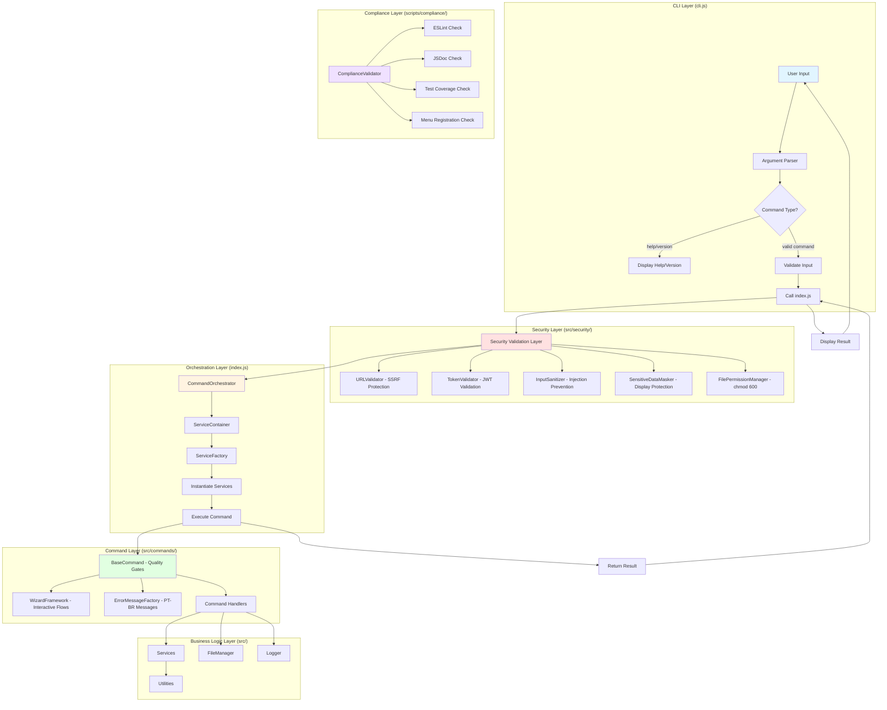
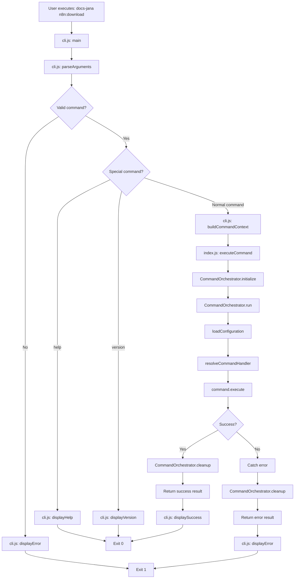
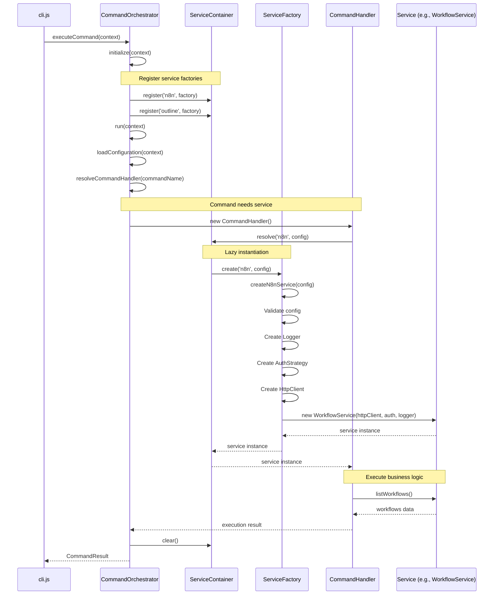
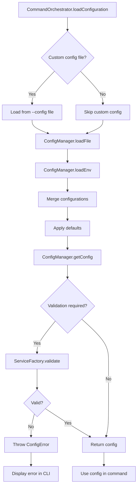
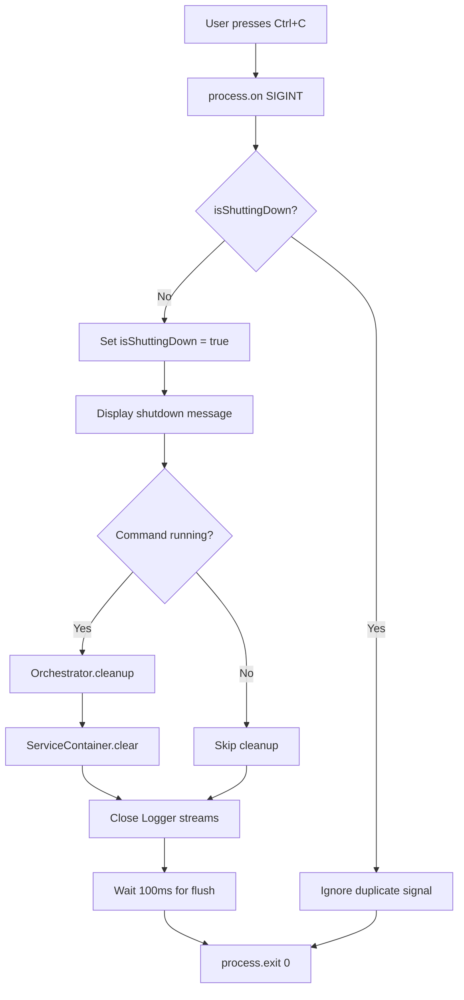
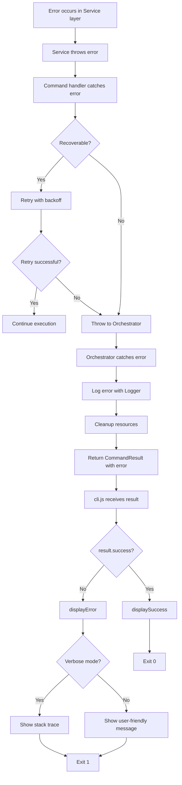

# Design Document: CLI Architecture Refactor

## Overview

Este documento descreve o design arquitetural para a refatoração completa da arquitetura do repositório docs-jana. O objetivo é separar claramente as responsabilidades entre interface CLI (cli.js) e lógica de orquestração (index.js), além de reorganizar a estrutura de arquivos do repositório para melhorar a manutenibilidade.

### Objetivos do Design

1. **Separação de Responsabilidades**: cli.js como interface interativa; index.js como camada de orquestração
2. **Integração com Patterns Existentes**: Usar Factory, Service Locator e Dependency Injection já implementados
3. **Reorganização de Arquivos**: Mover scripts e documentos técnicos para estrutura apropriada
4. **Zero Breaking Changes**: Preservar toda funcionalidade existente
5. **Testabilidade**: Facilitar testes unitários e de integração

### Escopo

**In Scope:**
- Refatoração de cli.js para interface CLI pura
- Refatoração de index.js para camada de orquestração com DI
- Criação de CommandOrchestrator para coordenar execução de comandos
- Reorganização de scripts JavaScript (test-*.js, cleanup-*.js, etc.)
- Reorganização de documentos técnicos (*.md da raiz)
- Atualização de package.json entry points
- Documentação da nova arquitetura
- **Security Validation Layer** (SSRF protection, JWT validation, input sanitization, sensitive data masking)
- **Interactive Wizard Framework** (multi-step wizards, progress tracking, confirmations)
- **Error Message Factory** (structured PT-BR error messages with troubleshooting)
- **BaseCommand with Quality Gates** (EnvLoader integration, input validation, structured returns)
- **Compliance Checker System** (automated ESLint, JSDoc, test coverage, menu registration validation)
- **Testing Architecture** (unit, integration, compliance test structure)
- **Documentation Architecture** (commands, reviews, architecture, standards documentation)

**Out of Scope:**
- Modificação de lógica de negócio em /src/services
- Mudanças em design patterns estabelecidos (Factory, Service Locator)

**Reference Implementation:**
- **n8n:configure-target** (Overall Score: 92/100) - Padrão de qualidade para novos comandos

---

## Architecture Design

### System Architecture Diagram



### Data Flow Diagram

```mermaid
graph LR
    A[CLI Args] --> B[cli.js: parseArguments]
    B --> C{Valid?}
    C -->|No| D[cli.js: showError]
    C -->|Yes| E[cli.js: buildCommandContext]
    E --> F[index.js: executeCommand]

    F --> SEC[Security Layer]
    SEC --> SEC1{URL valid?}
    SEC1 -->|SSRF detected| D
    SEC1 -->|Valid| SEC2{Token valid?}
    SEC2 -->|Invalid JWT| D
    SEC2 -->|Valid| SEC3[Sanitize Inputs]

    SEC3 --> G[CommandOrchestrator.run]
    G --> H[Load EnvLoader if needed]
    H --> I[ServiceContainer.resolve]
    I --> J[ServiceFactory.create]
    J --> K[BaseCommand.execute]

    K --> K1[Validate Inputs]
    K1 --> K2{Wizard needed?}
    K2 -->|Yes| WIZ[WizardFramework.run]
    K2 -->|No| CMD[Command.run]
    WIZ --> CMD

    CMD --> L[Service Methods]
    L --> M{Success?}
    M -->|Yes| N[Return Success]
    M -->|No| ERR[ErrorMessageFactory.build]
    ERR --> O[Return Structured Error]

    N --> P[cli.js: displaySuccess]
    O --> Q[cli.js: displayError PT-BR]

    style B fill:#bbdefb
    style SEC fill:#ffcdd2
    style K fill:#c8e6c9
    style ERR fill:#ffe082
```



### Architectural Layers

#### Layer 0: Security Validation (src/security/)

**Responsabilidades:**
- Validação de URLs com proteção SSRF (Server-Side Request Forgery)
- Validação de formato de tokens JWT (JSON Web Tokens)
- Sanitização de entradas do usuário para prevenir injection attacks
- Masking de dados sensíveis (API keys, tokens, senhas) em displays
- Gerenciamento de permissões de arquivos (chmod 600 para .env)

**Características:**
- **Security-first**: Todas validações executam ANTES de processar dados
- **Reusable**: Validators são funções puras que podem ser usadas por qualquer comando
- **Comprehensive**: Cobre SSRF, injection, JWT validation, data masking, file permissions
- **Reference**: Implementação baseada em n8n:configure-target (Security Score: 95/100)

**Componentes:**
- `URLValidator`: Valida formato de URL e bloqueia IPs privados (localhost, 127.0.0.1, 192.168.x.x, etc)
- `TokenValidator`: Valida formato JWT (3 partes separadas por ponto, Base64URL)
- `InputSanitizer`: Remove caracteres perigosos (`;`, `|`, `&`, `$`, `` ` ``)
- `SensitiveDataMasker`: Mascara valores sensíveis mostrando apenas últimos 3 caracteres
- `FilePermissionManager`: Define chmod 600 em sistemas Unix/Linux para arquivos de credenciais

#### Layer 1: CLI Interface (cli.js)

**Responsabilidades:**
- Parsing de argumentos CLI (process.argv)
- Validação de entrada do usuário
- Exibição de help, version, error messages
- Graceful shutdown (SIGINT/SIGTERM)
- Invocação do orchestration layer

**Características:**
- **Thin layer**: Mínima lógica de negócio
- **User-facing**: Toda interação com usuário acontece aqui
- **Synchronous**: Parsing e validação são síncronos
- **Error handling**: Captura erros da camada de orquestração e exibe de forma user-friendly

#### Layer 2: Orchestration (index.js)

**Responsabilidades:**
- Coordenação de execução de comandos
- Dependency injection usando ServiceFactory
- Service lifecycle management (init → execute → cleanup)
- Error handling e logging estruturado
- API pública para uso programático

**Características:**
- **Business logic orchestration**: Coordena services e commands
- **Asynchronous**: Toda execução é async/await
- **Testable**: Completamente testável com mocks
- **Reusable**: Pode ser usado fora da CLI (scripts, testes, API)

#### Layer 3: Business Logic (src/)

**Responsabilidades:**
- Implementação de comandos
- Services de negócio (WorkflowService, OutlineService)
- Utilities (HttpClient, Logger, FileManager)
- Factories (ServiceFactory, AuthFactory)

**Características:**
- **Existing codebase**: Não será modificado
- **Well-tested**: Já possui testes unitários
- **Design patterns**: Factory, Strategy, Dependency Injection

---

## Component Design

### Component 1: CLI Interface (cli.js)

#### Responsibilities

1. Parse command-line arguments usando process.argv
2. Validar comandos e flags
3. Exibir help, version, error messages
4. Invocar index.js com contexto estruturado
5. Capturar SIGINT/SIGTERM para graceful shutdown
6. Exibir resultados de forma user-friendly

#### Interfaces

```javascript
// cli.js exports
module.exports = {
  main,              // Main entry point for CLI
  parseArguments,    // Parse process.argv into structured object
  validateCommand,   // Validate command name and flags
  displayHelp,       // Display help message
  displayVersion,    // Display version info
  displayError       // Display error in user-friendly format
};

// Input: process.argv
// Output: CommandContext object passed to index.js
interface CommandContext {
  command: string;           // Canonical command name (e.g., 'n8n:download')
  args: string[];            // Remaining arguments after command
  flags: {                   // Parsed flags
    help: boolean;
    version: boolean;
    verbose: boolean;
    config?: string;
    dryRun?: boolean;
  };
  env: NodeJS.ProcessEnv;    // Environment variables
}
```

#### Dependencies

- **index.js**: Invoca `index.executeCommand(context)` para executar comandos
- **process.argv**: Argumentos CLI
- **process.env**: Variáveis de ambiente
- **console**: Output para usuário

#### Internal Structure

```javascript
// cli.js structure
const COMMANDS = {
  'n8n:download': { description: '...', aliases: [...] },
  'n8n:upload': { description: '...', aliases: [...] },
  'outline:download': { description: '...', aliases: [...] },
  // ... outros comandos
};

function parseArguments(argv) {
  // Parse argv into CommandContext
}

function validateCommand(commandName) {
  // Check if command exists in COMMANDS
}

function findCommand(input) {
  // Find command by name or alias
}

function displayHelp() {
  // Show full help message
}

function displayVersion() {
  // Show version info
}

function displayError(message, exitCode) {
  // Show error and exit
}

async function main() {
  const context = parseArguments(process.argv);

  if (context.flags.help) {
    displayHelp();
    return;
  }

  if (context.flags.version) {
    displayVersion();
    return;
  }

  if (!validateCommand(context.command)) {
    displayError(`Unknown command: ${context.command}`);
    return;
  }

  try {
    const result = await require('./index').executeCommand(context);
    console.log('\n✅ Command completed successfully\n');
    process.exit(0);
  } catch (error) {
    displayError(error.message);
  }
}

// Graceful shutdown handlers
process.on('SIGINT', gracefulShutdown);
process.on('SIGTERM', gracefulShutdown);
```

---

### Component 2: Command Orchestrator (index.js)

#### Responsibilities

1. Receber CommandContext de cli.js
2. Instanciar ServiceContainer com ServiceFactory
3. Resolver dependências usando Service Locator pattern
4. Executar comando através de CommandHandler
5. Gerenciar lifecycle (init → execute → cleanup)
6. Capturar e estruturar erros
7. Retornar resultado estruturado

#### Interfaces

```javascript
// index.js exports
module.exports = {
  executeCommand,        // Main entry point from CLI
  CommandOrchestrator,   // Orchestrator class (for programmatic use)
  ServiceContainer       // Service container (for testing)
};

// Main API
async function executeCommand(context: CommandContext): Promise<CommandResult>

// CommandResult interface
interface CommandResult {
  success: boolean;
  message: string;
  data?: any;
  error?: {
    code: string;
    message: string;
    stack?: string;
  };
}
```

#### Dependencies

- **ServiceFactory** (src/factories/service-factory.js): Create service instances
- **ConfigManager** (src/utils/config-manager.js): Load configuration
- **Logger** (src/utils/logger.js): Structured logging
- **Command Handlers** (src/commands/*.js): Execute business logic

#### Internal Structure

```javascript
// index.js structure

/**
 * ServiceContainer - Service Locator Pattern
 * Manages service instances and dependencies
 */
class ServiceContainer {
  constructor() {
    this.services = new Map();
    this.factories = new Map();
  }

  // Register a service factory
  register(name, factory) {
    this.factories.set(name, factory);
  }

  // Resolve a service (lazy instantiation)
  resolve(name, config) {
    if (this.services.has(name)) {
      return this.services.get(name);
    }

    const factory = this.factories.get(name);
    if (!factory) {
      throw new Error(`Service not found: ${name}`);
    }

    const service = factory(config);
    this.services.set(name, service);
    return service;
  }

  // Clear all services (for cleanup)
  clear() {
    this.services.clear();
  }
}

/**
 * CommandOrchestrator - Orchestrates command execution
 */
class CommandOrchestrator {
  constructor(serviceContainer) {
    this.container = serviceContainer;
    this.logger = null;
  }

  // Initialize orchestrator
  async initialize(context) {
    // Create logger
    this.logger = new Logger({
      logLevel: context.flags.verbose ? 'debug' : 'info'
    });

    // Register service factories
    this.container.register('n8n', (config) =>
      ServiceFactory.create('n8n', config)
    );

    this.container.register('outline', (config) =>
      ServiceFactory.create('outline', config)
    );

    this.logger.debug('CommandOrchestrator initialized');
  }

  // Execute command
  async run(context) {
    this.logger.info(`Executing command: ${context.command}`);

    // Load configuration
    const config = await this.loadConfiguration(context);

    // Resolve command handler
    const CommandHandler = this.resolveCommandHandler(context.command);

    // Create command instance
    const command = new CommandHandler();

    // Execute command
    const result = await command.execute(context.args);

    this.logger.info('Command execution completed');
    return result;
  }

  // Load configuration from multiple sources
  async loadConfiguration(context) {
    const configManager = new ConfigManager();

    // Load from .env
    if (context.flags.config) {
      configManager.loadFile(context.flags.config);
    }

    // Merge with environment variables
    configManager.loadEnv(context.env);

    return configManager.getConfig();
  }

  // Resolve command handler
  resolveCommandHandler(commandName) {
    const commandMap = {
      'n8n:download': require('./src/commands/n8n-download'),
      'n8n:upload': require('./src/commands/n8n-upload'),
      'outline:download': require('./src/commands/outline-download')
    };

    const handler = commandMap[commandName];
    if (!handler) {
      throw new Error(`Command handler not found: ${commandName}`);
    }

    return handler;
  }

  // Cleanup resources
  async cleanup() {
    this.logger.debug('Cleaning up resources...');
    this.container.clear();
  }
}

/**
 * Main entry point for command execution
 */
async function executeCommand(context) {
  const container = new ServiceContainer();
  const orchestrator = new CommandOrchestrator(container);

  try {
    // Initialize
    await orchestrator.initialize(context);

    // Execute
    const result = await orchestrator.run(context);

    // Cleanup
    await orchestrator.cleanup();

    return {
      success: true,
      message: 'Command executed successfully',
      data: result
    };

  } catch (error) {
    // Cleanup on error
    await orchestrator.cleanup();

    return {
      success: false,
      message: error.message,
      error: {
        code: error.code || 'UNKNOWN_ERROR',
        message: error.message,
        stack: process.env.DEBUG ? error.stack : undefined
      }
    };
  }
}

// Export public API
module.exports = {
  executeCommand,
  CommandOrchestrator,
  ServiceContainer
};
```

---

### Component 3: File Reorganization Strategy

#### Scripts Directory Structure

```
/scripts/
├── README.md              # Documentation of all scripts
├── test/                  # Test scripts
│   ├── test-payload-cleaning.js
│   ├── test-workflow-id-preservation.js
│   ├── test-tag-operations.js
│   ├── test-folder-filter.js
│   └── test-upload-history.js
└── admin/                 # Administrative utilities
    ├── cleanup-duplicates.js
    ├── delete-all-workflows.js
    ├── unarchive-workflows.js
    └── unarchive-direct.js
```

#### Documentation Directory Structure

```
/docs/
├── README.md                      # Index of all documentation
├── technical/                     # Technical documentation
│   ├── TAG_CODE_CHANGES.md
│   ├── TAG_IMPLEMENTATION_SUMMARY.md
│   ├── WORKFLOW-ID-PRESERVATION-REPORT.md
│   └── WORKFLOW-REFERENCES.md
└── architecture/                  # Architecture documentation
    ├── CLI-ARCHITECTURE.md        # New: Documents cli.js → index.js separation
    └── SERVICE-FACTORY.md         # New: Documents ServiceFactory usage
```

#### Root Directory (After Cleanup)

```
/
├── cli.js                   # CLI interface (entry point for bin)
├── index.js                 # Orchestration layer (main export)
├── package.json             # Updated: "main": "index.js"
├── README.md                # Updated: Architecture section
├── .gitignore
├── .env.example
├── jest.config.js
├── pnpm-workspace.yaml
├── /src/                    # Existing: No changes
├── /__tests__/              # Existing: Updated imports
├── /scripts/                # New: Moved scripts
└── /docs/                   # New: Moved documentation
```

---

### Component 4: Security Validation Layer (src/security/)

#### Responsibilities

1. Validar URLs e bloquear SSRF (Server-Side Request Forgery)
2. Validar formato de tokens JWT (JSON Web Tokens)
3. Sanitizar entradas do usuário para prevenir injection attacks
4. Mascarar dados sensíveis em displays (API keys, tokens, senhas)
5. Gerenciar permissões de arquivos sensíveis (chmod 600)

#### Interfaces

```javascript
// src/security/validators/index.js exports

/**
 * Valida URL e previne SSRF bloqueando IPs privados
 * @param {string} url - URL a ser validada
 * @returns {{ valid: boolean, url?: URL, error?: string }}
 * @throws {Error} se URL contém IP privado ou localhost
 */
function validateURL(url) {
  // Valida formato usando URL constructor
  // Bloqueia: localhost, 127.0.0.1, 192.168.x.x, 10.x.x.x, 172.16-31.x.x, ::1, fe80::
  // Emite warning para HTTP (recomenda HTTPS)
}

/**
 * Valida formato de token JWT
 * @param {string} token - Token JWT a ser validado
 * @returns {{ valid: boolean, parts?: string[], error?: string }}
 */
function validateJWT(token) {
  // Valida estrutura: 3 partes separadas por ponto
  // Valida caracteres: Base64URL válidos
  // Valida tamanho mínimo razoável
}

/**
 * Sanitiza entrada do usuário removendo caracteres perigosos
 * @param {string} input - Input do usuário
 * @returns {string} Input sanitizado
 */
function sanitizeInput(input) {
  // Remove caracteres de injection: ; | & $ `
  // Preserva caracteres alfanuméricos e alguns especiais seguros
}

/**
 * Mascara dados sensíveis mostrando apenas últimos N caracteres
 * @param {string} sensitiveData - Dados sensíveis
 * @param {number} visibleChars - Quantidade de caracteres visíveis (padrão: 3)
 * @returns {string} Dados mascarados (ex: "***xyz")
 */
function maskSensitive(sensitiveData, visibleChars = 3) {
  // Retorna: "*".repeat(length - visibleChars) + last N chars
}

/**
 * Define permissões seguras para arquivo (chmod 600 em Unix/Linux)
 * @param {string} filePath - Caminho do arquivo
 * @returns {{ success: boolean, warning?: string }}
 */
function setSecurePermissions(filePath) {
  // Unix/Linux: chmod 600 (rw-------)
  // Windows: Exibe warning (não suporta chmod)
}

module.exports = {
  validateURL,
  validateJWT,
  sanitizeInput,
  maskSensitive,
  setSecurePermissions
};
```

#### Dependencies

- **Node.js URL API**: Para validar formato de URLs
- **Node.js fs**: Para definir permissões de arquivos (fs.chmod)
- **Node.js os**: Para detectar plataforma (process.platform)

#### Implementation Example (Reference: n8n:configure-target)

```javascript
// src/security/validators/url-validator.js

const PRIVATE_IP_RANGES = [
  /^localhost$/i,
  /^127\.\d+\.\d+\.\d+$/,
  /^192\.168\.\d+\.\d+$/,
  /^10\.\d+\.\d+\.\d+$/,
  /^172\.(1[6-9]|2[0-9]|3[0-1])\.\d+\.\d+$/,
  /^::1$/,
  /^fe80::/i
];

function validateURL(urlString) {
  try {
    const url = new URL(urlString);

    // Check for SSRF
    const hostname = url.hostname;
    for (const pattern of PRIVATE_IP_RANGES) {
      if (pattern.test(hostname)) {
        return {
          valid: false,
          error: 'URLs com IPs privados ou localhost não são permitidas (proteção SSRF)'
        };
      }
    }

    // Warn about HTTP
    if (url.protocol === 'http:') {
      console.warn('⚠️  Aviso: URL usa HTTP. Recomendamos HTTPS para segurança.');
    }

    return { valid: true, url };

  } catch (error) {
    return {
      valid: false,
      error: `Formato de URL inválido: ${error.message}`
    };
  }
}

module.exports = { validateURL };
```

#### Testing Strategy

```javascript
// __tests__/unit/security/url-validator.test.js

describe('URLValidator - SSRF Protection', () => {
  test('should block localhost', () => {
    const result = validateURL('http://localhost:3000');
    expect(result.valid).toBe(false);
    expect(result.error).toContain('SSRF');
  });

  test('should block 127.0.0.1', () => {
    const result = validateURL('http://127.0.0.1:8080');
    expect(result.valid).toBe(false);
  });

  test('should block private IPs 192.168.x.x', () => {
    const result = validateURL('http://192.168.1.1');
    expect(result.valid).toBe(false);
  });

  test('should allow public URLs', () => {
    const result = validateURL('https://api.example.com');
    expect(result.valid).toBe(true);
  });

  test('should warn about HTTP', () => {
    const consoleSpy = jest.spyOn(console, 'warn');
    validateURL('http://api.example.com');
    expect(consoleSpy).toHaveBeenCalledWith(expect.stringContaining('HTTP'));
  });
});
```

---

### Component 5: Interactive Wizard Framework (src/ui/wizard/)

#### Responsibilities

1. Orquestrar wizards multi-etapas para comandos interativos
2. Exibir introdução explicativa antes de coletar dados
3. Indicar progresso de etapas (Etapa 1/N, 2/N, etc)
4. Coletar dados com hints contextuais
5. Exibir confirmação completa antes de executar ação
6. Lidar com cancelamento (Ctrl+C ou resposta "não")
7. Exibir resumo de sucesso com próximos passos

#### Interfaces

```javascript
// src/ui/wizard/wizard-orchestrator.js

/**
 * Orquestrador de wizard multi-etapas
 */
class WizardOrchestrator {
  constructor(config) {
    this.config = config;
    this.steps = [];
    this.collectedData = {};
  }

  /**
   * Adiciona etapa ao wizard
   * @param {WizardStep} step - Etapa do wizard
   */
  addStep(step) {
    this.steps.push(step);
  }

  /**
   * Executa wizard completo
   * @returns {Promise<{ success: boolean, data?: any, cancelled?: boolean }>}
   */
  async run() {
    // 1. Exibir introdução
    await this.showIntroduction();

    // 2. Executar etapas de coleta de dados
    for (let i = 0; i < this.steps.length; i++) {
      const step = this.steps[i];
      const progress = `Etapa ${i + 1}/${this.steps.length}`;

      const result = await step.execute(progress);

      if (result.cancelled) {
        return { success: false, cancelled: true };
      }

      this.collectedData[step.name] = result.data;
    }

    // 3. Exibir confirmação
    const confirmed = await this.showConfirmation();
    if (!confirmed) {
      return { success: false, cancelled: true };
    }

    // 4. Executar ação
    const result = await this.execute();

    // 5. Exibir resumo
    await this.showSummary(result);

    return result;
  }

  async showIntroduction() { /* ... */ }
  async showConfirmation() { /* ... */ }
  async execute() { /* ... */ }
  async showSummary(result) { /* ... */ }
}

/**
 * Etapa individual do wizard
 */
class WizardStep {
  constructor(name, prompt, validator) {
    this.name = name;
    this.prompt = prompt;
    this.validator = validator;
  }

  /**
   * Executa etapa e coleta dados do usuário
   * @param {string} progress - Indicador de progresso (ex: "Etapa 1/3")
   * @returns {Promise<{ data: any, cancelled: boolean }>}
   */
  async execute(progress) {
    console.log(`\n${progress}: ${this.prompt.title}`);

    if (this.prompt.hint) {
      console.log(`💡 ${this.prompt.hint}`);
    }

    const answer = await inquirer.prompt([this.prompt.question]);

    // Validar resposta
    if (this.validator) {
      const validation = this.validator(answer[this.prompt.question.name]);
      if (!validation.valid) {
        console.error(`❌ ${validation.error}`);
        return await this.execute(progress); // Retry
      }
    }

    return { data: answer[this.prompt.question.name], cancelled: false };
  }
}

module.exports = { WizardOrchestrator, WizardStep };
```

#### Example Usage (Reference: n8n:configure-target)

```javascript
// src/commands/n8n-configure-target.js

const { WizardOrchestrator, WizardStep } = require('../ui/wizard');
const { validateURL, validateJWT } = require('../security/validators');

async function execute() {
  const wizard = new WizardOrchestrator({
    title: 'Configurar Target n8n',
    introduction: `
Este wizard irá configurar a URL e API key do servidor n8n de destino.

Os dados serão salvos no arquivo .env para uso pelos comandos de upload/download.

⚠️  IMPORTANTE: Certifique-se de ter permissões de escrita no diretório.
    `.trim()
  });

  // Etapa 1: Coletar URL
  wizard.addStep(new WizardStep(
    'targetUrl',
    {
      title: 'URL do servidor n8n de destino',
      hint: 'Exemplo: https://n8n.example.com',
      question: {
        type: 'input',
        name: 'url',
        message: 'URL do servidor n8n:'
      }
    },
    (url) => validateURL(url)
  ));

  // Etapa 2: Coletar API Key
  wizard.addStep(new WizardStep(
    'apiKey',
    {
      title: 'API Key do servidor n8n',
      hint: 'Encontrada em: Settings → API → Generate API Key',
      question: {
        type: 'password',
        name: 'apiKey',
        message: 'API Key:'
      }
    },
    (token) => validateJWT(token)
  ));

  // Executar wizard
  const result = await wizard.run();

  if (result.cancelled) {
    console.log('\n❌ Configuração cancelada pelo usuário.');
    return { success: false };
  }

  return result;
}
```

#### Testing Strategy

```javascript
// __tests__/unit/ui/wizard-orchestrator.test.js

describe('WizardOrchestrator', () => {
  test('should execute all steps in sequence', async () => {
    const wizard = new WizardOrchestrator({ title: 'Test' });

    wizard.addStep(new WizardStep('step1', { /* ... */ }));
    wizard.addStep(new WizardStep('step2', { /* ... */ }));

    // Mock inquirer
    jest.spyOn(inquirer, 'prompt').mockResolvedValueOnce({ answer: 'value1' });
    jest.spyOn(inquirer, 'prompt').mockResolvedValueOnce({ answer: 'value2' });

    const result = await wizard.run();

    expect(result.success).toBe(true);
    expect(wizard.collectedData).toEqual({ step1: 'value1', step2: 'value2' });
  });

  test('should handle cancellation', async () => {
    const wizard = new WizardOrchestrator({ title: 'Test' });
    wizard.addStep(new WizardStep('step1', { /* ... */ }));

    // Mock user cancellation (Ctrl+C)
    jest.spyOn(inquirer, 'prompt').mockRejectedValueOnce(new Error('User cancelled'));

    const result = await wizard.run();

    expect(result.cancelled).toBe(true);
  });
});
```

---

### Component 6: Error Message Factory (src/ui/error-messages/)

#### Responsibilities

1. Construir mensagens de erro estruturadas em PT-BR
2. Incluir descrição breve do problema
3. Listar possíveis causas (2-4 causas)
4. Fornecer passos de troubleshooting numerados
5. Indicar comando de ajuda relacionado
6. Usar emojis padronizados (❌ erro, ⚠️ warning)

#### Interfaces

```javascript
// src/ui/error-messages/error-message-factory.js

/**
 * Builder para mensagens de erro estruturadas
 */
class ErrorMessageBuilder {
  constructor() {
    this.errorType = 'UNKNOWN_ERROR';
    this.description = '';
    this.causes = [];
    this.solutions = [];
    this.helpCommand = null;
  }

  /**
   * Define tipo de erro
   * @param {string} type - Tipo do erro (VALIDATION, NETWORK, CONFIG, etc)
   * @returns {ErrorMessageBuilder}
   */
  setErrorType(type) {
    this.errorType = type;
    return this;
  }

  /**
   * Define descrição breve do erro
   * @param {string} description - Descrição em PT-BR
   * @returns {ErrorMessageBuilder}
   */
  setDescription(description) {
    this.description = description;
    return this;
  }

  /**
   * Adiciona possível causa do erro
   * @param {string} cause - Causa em PT-BR
   * @returns {ErrorMessageBuilder}
   */
  addPossibleCause(cause) {
    this.causes.push(cause);
    return this;
  }

  /**
   * Adiciona passo de solução
   * @param {string} solution - Passo de troubleshooting em PT-BR
   * @returns {ErrorMessageBuilder}
   */
  addSolution(solution) {
    this.solutions.push(solution);
    return this;
  }

  /**
   * Define comando de ajuda relacionado
   * @param {string} command - Comando de ajuda (ex: "docs-jana n8n:configure-target --help")
   * @returns {ErrorMessageBuilder}
   */
  setHelpCommand(command) {
    this.helpCommand = command;
    return this;
  }

  /**
   * Constrói mensagem de erro formatada
   * @returns {string} Mensagem de erro estruturada
   */
  build() {
    let message = `\n❌ Erro: ${this.description}\n`;

    if (this.causes.length > 0) {
      message += '\nPossíveis causas:\n';
      this.causes.forEach(cause => {
        message += `• ${cause}\n`;
      });
    }

    if (this.solutions.length > 0) {
      message += '\nSoluções:\n';
      this.solutions.forEach((solution, index) => {
        message += `${index + 1}. ${solution}\n`;
      });
    }

    if (this.helpCommand) {
      message += `\nPrecisa de ajuda? Execute: ${this.helpCommand}\n`;
    }

    return message;
  }

  /**
   * Factory method: Cria builder a partir de exceção
   * @param {Error} error - Exceção capturada
   * @returns {ErrorMessageBuilder}
   */
  static forError(error) {
    const builder = new ErrorMessageBuilder();

    // Map common errors to user-friendly messages
    if (error.code === 'ECONNREFUSED') {
      return builder
        .setErrorType('NETWORK')
        .setDescription('Não foi possível conectar ao servidor')
        .addPossibleCause('O servidor não está rodando')
        .addPossibleCause('A URL está incorreta')
        .addPossibleCause('Firewall bloqueando a conexão')
        .addSolution('Verifique se o servidor está rodando')
        .addSolution('Confirme a URL em .env ou comando')
        .addSolution('Verifique regras de firewall');
    }

    if (error.code === 'ETIMEDOUT') {
      return builder
        .setErrorType('NETWORK')
        .setDescription('Timeout na conexão com servidor')
        .addPossibleCause('Rede instável ou lenta')
        .addPossibleCause('Servidor demorando para responder')
        .addSolution('Verifique sua conexão de rede')
        .addSolution('Tente novamente em alguns minutos');
    }

    // Default error message
    return builder
      .setDescription(error.message || 'Erro desconhecido')
      .addSolution('Tente executar o comando com --verbose para mais detalhes');
  }
}

module.exports = { ErrorMessageBuilder };
```

#### Example Usage

```javascript
// src/commands/n8n-download.js

const { ErrorMessageBuilder } = require('../ui/error-messages');

async function execute() {
  try {
    // Command logic...
  } catch (error) {
    // Build structured error message
    const errorMessage = ErrorMessageBuilder
      .forError(error)
      .setHelpCommand('docs-jana n8n:download --help')
      .build();

    console.error(errorMessage);
    return { success: false, error: errorMessage };
  }
}
```

#### Output Example

```
❌ Erro: Não foi possível conectar ao servidor

Possíveis causas:
• O servidor não está rodando
• A URL está incorreta
• Firewall bloqueando a conexão

Soluções:
1. Verifique se o servidor está rodando
2. Confirme a URL em .env ou comando
3. Verifique regras de firewall

Precisa de ajuda? Execute: docs-jana n8n:download --help
```

---

### Component 7: BaseCommand with Quality Gates (src/commands/base-command.js)

#### Responsibilities

1. Fornecer classe base abstrata para todos os comandos
2. Implementar quality gates obrigatórios (EnvLoader, validação, error handling)
3. Garantir retorno estruturado consistente
4. Forçar implementação de métodos abstratos
5. Integrar Security Layer, Wizard Framework e Error Factory

#### Interfaces

```javascript
// src/commands/base-command.js

const { EnvLoader } = require('../utils/env-loader');
const { ErrorMessageBuilder } = require('../ui/error-messages');

/**
 * Classe base abstrata para todos os comandos CLI
 * Implementa quality gates obrigatórios e estrutura consistente
 */
class BaseCommand {
  constructor() {
    if (new.target === BaseCommand) {
      throw new Error('BaseCommand é abstrata e não pode ser instanciada diretamente');
    }
  }

  /**
   * Método principal de execução (template method pattern)
   * @param {object} args - Argumentos do comando
   * @returns {Promise<{ success: boolean, data?: any, error?: string }>}
   */
  static async execute(args) {
    try {
      // Quality Gate 1: Load environment if needed
      if (this.requiresEnv()) {
        try {
          EnvLoader.load();
        } catch (error) {
          const errorMessage = new ErrorMessageBuilder()
            .setErrorType('CONFIG')
            .setDescription('Arquivo .env não encontrado ou inválido')
            .addPossibleCause('Arquivo .env não existe no diretório do projeto')
            .addPossibleCause('Variáveis de ambiente obrigatórias estão faltando')
            .addSolution('Execute o comando de configuração primeiro')
            .addSolution(`Exemplo: docs-jana ${this.getConfigCommand()}`)
            .setHelpCommand(`docs-jana ${this.getCommandName()} --help`)
            .build();

          return { success: false, error: errorMessage };
        }
      }

      // Quality Gate 2: Validate inputs with security layer
      const validatedInputs = await this.validateInputs(args);

      if (!validatedInputs.valid) {
        const errorMessage = new ErrorMessageBuilder()
          .setErrorType('VALIDATION')
          .setDescription(validatedInputs.error)
          .addSolution('Verifique os parâmetros fornecidos')
          .setHelpCommand(`docs-jana ${this.getCommandName()} --help`)
          .build();

        return { success: false, error: errorMessage };
      }

      // Quality Gate 3: Execute command logic
      const result = await this.run(validatedInputs.data);

      return { success: true, data: result };

    } catch (error) {
      // Quality Gate 4: Structured error handling
      const errorMessage = ErrorMessageBuilder
        .forError(error)
        .setHelpCommand(`docs-jana ${this.getCommandName()} --help`)
        .build();

      return { success: false, error: errorMessage };
    }
  }

  /**
   * MANDATORY: Indica se comando requer .env
   * @returns {boolean}
   */
  static requiresEnv() {
    throw new Error('Método requiresEnv() deve ser implementado pelo comando');
  }

  /**
   * MANDATORY: Valida inputs com Security Layer
   * @param {object} args - Argumentos do comando
   * @returns {Promise<{ valid: boolean, data?: any, error?: string }>}
   */
  static async validateInputs(args) {
    throw new Error('Método validateInputs() deve ser implementado pelo comando');
  }

  /**
   * MANDATORY: Lógica principal do comando
   * @param {object} inputs - Inputs validados
   * @returns {Promise<any>}
   */
  static async run(inputs) {
    throw new Error('Método run() deve ser implementado pelo comando');
  }

  /**
   * OPTIONAL: Retorna nome do comando para mensagens de erro
   * @returns {string}
   */
  static getCommandName() {
    return 'command';
  }

  /**
   * OPTIONAL: Retorna comando de configuração relacionado
   * @returns {string}
   */
  static getConfigCommand() {
    return 'config';
  }
}

module.exports = { BaseCommand };
```

#### Example Implementation (Reference: n8n:configure-target pattern)

```javascript
// src/commands/n8n-download.js

const { BaseCommand } = require('./base-command');
const { validateURL } = require('../security/validators');

class N8nDownloadCommand extends BaseCommand {
  static requiresEnv() {
    return true; // Requires .env with N8N_URL and N8N_API_KEY
  }

  static async validateInputs(args) {
    // Validate N8N_URL with SSRF protection
    const urlValidation = validateURL(process.env.N8N_URL);
    if (!urlValidation.valid) {
      return { valid: false, error: urlValidation.error };
    }

    // Validate API Key format (if provided)
    if (args.apiKey) {
      const tokenValidation = validateJWT(args.apiKey);
      if (!tokenValidation.valid) {
        return { valid: false, error: tokenValidation.error };
      }
    }

    return { valid: true, data: args };
  }

  static async run(inputs) {
    // Main command logic...
    const workflows = await this.downloadWorkflows(inputs);
    return workflows;
  }

  static getCommandName() {
    return 'n8n:download';
  }

  static getConfigCommand() {
    return 'n8n:configure-target';
  }
}

module.exports = N8nDownloadCommand;
```

#### Testing Strategy

```javascript
// __tests__/unit/commands/base-command.test.js

describe('BaseCommand - Quality Gates', () => {
  test('should enforce requiresEnv() implementation', () => {
    class TestCommand extends BaseCommand {}

    expect(() => TestCommand.requiresEnv()).toThrow('deve ser implementado');
  });

  test('should load EnvLoader if requiresEnv() returns true', async () => {
    const envLoaderSpy = jest.spyOn(EnvLoader, 'load');

    class TestCommand extends BaseCommand {
      static requiresEnv() { return true; }
      static async validateInputs() { return { valid: true, data: {} }; }
      static async run() { return 'success'; }
    }

    await TestCommand.execute({});

    expect(envLoaderSpy).toHaveBeenCalled();
  });

  test('should return structured error if EnvLoader fails', async () => {
    jest.spyOn(EnvLoader, 'load').mockImplementation(() => {
      throw new Error('.env not found');
    });

    class TestCommand extends BaseCommand {
      static requiresEnv() { return true; }
      static getCommandName() { return 'test'; }
      static getConfigCommand() { return 'test:config'; }
    }

    const result = await TestCommand.execute({});

    expect(result.success).toBe(false);
    expect(result.error).toContain('.env não encontrado');
    expect(result.error).toContain('test:config');
  });

  test('should validate inputs before execution', async () => {
    class TestCommand extends BaseCommand {
      static requiresEnv() { return false; }
      static async validateInputs(args) {
        if (!args.required) {
          return { valid: false, error: 'Parâmetro obrigatório faltando' };
        }
        return { valid: true, data: args };
      }
      static async run() { return 'success'; }
    }

    const result = await TestCommand.execute({});

    expect(result.success).toBe(false);
    expect(result.error).toContain('Parâmetro obrigatório');
  });

  test('should return structured success result', async () => {
    class TestCommand extends BaseCommand {
      static requiresEnv() { return false; }
      static async validateInputs(args) { return { valid: true, data: args }; }
      static async run() { return { count: 5 }; }
    }

    const result = await TestCommand.execute({});

    expect(result.success).toBe(true);
    expect(result.data).toEqual({ count: 5 });
  });
});
```

---

### Component 8: Compliance Checker System (scripts/compliance/)

#### Responsibilities

1. Verificar conformidade com ESLint (zero violations)
2. Verificar completude de JSDoc (todas as funções documentadas)
3. Verificar cobertura de testes (≥ 80%)
4. Verificar registro em menu (menu-options.js com todos os campos)
5. Gerar relatório de conformidade com score 0-100

#### Interfaces

```javascript
// scripts/compliance/compliance-validator.js

/**
 * Sistema de validação de conformidade para comandos CLI
 */
class ComplianceValidator {
  constructor(commandPath) {
    this.commandPath = commandPath;
    this.results = {
      eslint: { passed: false, violations: [] },
      jsdoc: { passed: false, coverage: 0, missing: [] },
      testCoverage: { passed: false, coverage: 0 },
      menuRegistration: { passed: false, missingFields: [] },
      score: 0
    };
  }

  /**
   * Executa todas as validações de conformidade
   * @returns {Promise<ComplianceReport>}
   */
  async validate() {
    await this.checkESLintCompliance();
    await this.checkJSDocCompleteness();
    await this.checkTestCoverage();
    await this.checkMenuRegistration();

    this.calculateScore();

    return this.results;
  }

  /**
   * Verifica conformidade com ESLint
   */
  async checkESLintCompliance() {
    const { ESLint } = require('eslint');
    const eslint = new ESLint();

    const results = await eslint.lintFiles([this.commandPath]);

    const violations = results[0].messages;

    this.results.eslint = {
      passed: violations.length === 0,
      violations: violations.map(v => ({
        line: v.line,
        rule: v.ruleId,
        message: v.message
      }))
    };
  }

  /**
   * Verifica completude de JSDoc
   */
  async checkJSDocCompleteness() {
    const fs = require('fs');
    const content = fs.readFileSync(this.commandPath, 'utf8');

    // Parse AST and check for JSDoc comments
    const functions = this.extractFunctions(content);
    const documented = functions.filter(f => f.hasJSDoc);

    const coverage = (documented.length / functions.length) * 100;

    this.results.jsdoc = {
      passed: coverage === 100,
      coverage: coverage,
      missing: functions.filter(f => !f.hasJSDoc).map(f => f.name)
    };
  }

  /**
   * Verifica cobertura de testes
   */
  async checkTestCoverage() {
    const { exec } = require('child_process');
    const util = require('util');
    const execPromise = util.promisify(exec);

    // Run jest with coverage for specific file
    const { stdout } = await execPromise(`pnpm test:coverage -- ${this.commandPath}`);

    // Parse coverage from output
    const coverageMatch = stdout.match(/All files\s+\|\s+([\d.]+)/);
    const coverage = coverageMatch ? parseFloat(coverageMatch[1]) : 0;

    this.results.testCoverage = {
      passed: coverage >= 80,
      coverage: coverage
    };
  }

  /**
   * Verifica registro completo em menu-options.js
   */
  async checkMenuRegistration() {
    const fs = require('fs');
    const menuOptionsPath = './cli/menu-options.js';

    if (!fs.existsSync(menuOptionsPath)) {
      this.results.menuRegistration = {
        passed: false,
        missingFields: ['menu-options.js not found']
      };
      return;
    }

    const content = fs.readFileSync(menuOptionsPath, 'utf8');

    // Check for command registration
    const commandName = this.extractCommandName(this.commandPath);

    const requiredFields = ['key', 'command', 'label', 'description', 'icon', 'category', 'shortcut', 'preview'];
    const missingFields = [];

    for (const field of requiredFields) {
      // Simple check: look for field in menu options
      const fieldPattern = new RegExp(`${field}:\\s*['"\\w]`);
      if (!fieldPattern.test(content)) {
        missingFields.push(field);
      }
    }

    this.results.menuRegistration = {
      passed: missingFields.length === 0,
      missingFields: missingFields
    };
  }

  /**
   * Calcula score de conformidade (0-100)
   */
  calculateScore() {
    let score = 0;

    // ESLint: 25 points
    if (this.results.eslint.passed) score += 25;

    // JSDoc: 25 points
    score += (this.results.jsdoc.coverage / 100) * 25;

    // Test Coverage: 30 points
    score += (this.results.testCoverage.coverage / 100) * 30;

    // Menu Registration: 20 points
    if (this.results.menuRegistration.passed) score += 20;

    this.results.score = Math.round(score);
  }

  /**
   * Gera relatório de conformidade
   * @returns {string} Relatório formatado
   */
  generateReport() {
    let report = '\n📋 Compliance Report\n';
    report += '='.repeat(50) + '\n\n';

    report += `✅ ESLint: ${this.results.eslint.passed ? 'PASSED' : 'FAILED'}\n`;
    if (this.results.eslint.violations.length > 0) {
      report += `   Violations: ${this.results.eslint.violations.length}\n`;
    }

    report += `📝 JSDoc: ${this.results.jsdoc.coverage}%\n`;
    if (this.results.jsdoc.missing.length > 0) {
      report += `   Missing: ${this.results.jsdoc.missing.join(', ')}\n`;
    }

    report += `🧪 Test Coverage: ${this.results.testCoverage.coverage}%\n`;

    report += `📱 Menu Registration: ${this.results.menuRegistration.passed ? 'PASSED' : 'FAILED'}\n`;
    if (this.results.menuRegistration.missingFields.length > 0) {
      report += `   Missing: ${this.results.menuRegistration.missingFields.join(', ')}\n`;
    }

    report += `\n⭐ Overall Compliance Score: ${this.results.score}/100\n`;

    if (this.results.score >= 80) {
      report += '✅ APPROVED: Command meets quality standards\n';
    } else {
      report += '❌ NEEDS IMPROVEMENT: Address issues above before merge\n';
    }

    return report;
  }

  // Helper methods
  extractFunctions(content) { /* ... */ }
  extractCommandName(path) { /* ... */ }
}

module.exports = { ComplianceValidator };
```

#### CLI Usage

```bash
# Check compliance for specific command
node scripts/compliance/check-command.js src/commands/n8n-configure-target.js

# Check compliance for all commands
node scripts/compliance/check-all.js

# CI/CD integration
pnpm run check:compliance
```

#### Output Example

```
📋 Compliance Report
==================================================

✅ ESLint: PASSED
📝 JSDoc: 100%
🧪 Test Coverage: 85%
📱 Menu Registration: PASSED

⭐ Overall Compliance Score: 97/100
✅ APPROVED: Command meets quality standards
```

---

## Data Model

### CommandContext Data Structure

```typescript
interface CommandContext {
  // Command identification
  command: string;              // Canonical command name (e.g., 'n8n:download')

  // Arguments and flags
  args: string[];               // Remaining arguments after command
  flags: CommandFlags;          // Parsed flags

  // Environment
  env: NodeJS.ProcessEnv;       // Environment variables
}

interface CommandFlags {
  // Global flags
  help: boolean;                // --help, -h
  version: boolean;             // --version, -v
  verbose: boolean;             // --verbose (enable debug logging)
  config?: string;              // --config <file> (custom config file)
  dryRun?: boolean;             // --dry-run (test mode)

  // Command-specific flags (examples)
  tag?: string;                 // --tag <name> (n8n:download)
  output?: string;              // --output <dir> (all download commands)
  input?: string;               // --input <dir> (n8n:upload)
  collections?: string;         // --collections <list> (outline:download)
}
```

### CommandResult Data Structure

```typescript
interface CommandResult {
  // Execution status
  success: boolean;             // true if command succeeded
  message: string;              // Human-readable message

  // Optional data payload
  data?: any;                   // Command-specific result data

  // Error details (if success = false)
  error?: CommandError;
}

interface CommandError {
  code: string;                 // Error code (e.g., 'CONFIG_ERROR', 'NETWORK_ERROR')
  message: string;              // Error message
  stack?: string;               // Stack trace (only in debug mode)
}
```

### ServiceContainer Registry

```typescript
interface ServiceRegistry {
  // Service name -> Factory function
  [serviceName: string]: (config: any) => Service;
}

// Example:
const registry: ServiceRegistry = {
  'n8n': (config) => ServiceFactory.create('n8n', config),
  'outline': (config) => ServiceFactory.create('outline', config)
};
```

### Configuration Schema

```typescript
interface AppConfig {
  // N8N Configuration
  n8n?: N8NConfig;

  // Outline Configuration
  outline?: OutlineConfig;

  // Global Configuration
  logLevel?: 'debug' | 'info' | 'warn' | 'error';
  enableTimestamp?: boolean;
  enableColors?: boolean;
}

interface N8NConfig {
  baseUrl: string;
  apiKey?: string;
  username?: string;
  password?: string;
  maxRetries?: number;
  timeout?: number;
}

interface OutlineConfig {
  baseUrl: string;
  apiToken: string;
  delay?: number;
  verbose?: boolean;
  maxRetries?: number;
  timeout?: number;
}
```

---

## Business Process

### Process 1: CLI Command Execution Flow

Este diagrama mostra o fluxo completo desde a entrada do usuário até a execução do comando.



### Process 2: Service Resolution and Dependency Injection

Este diagrama mostra como o ServiceContainer resolve dependências usando Service Locator pattern.



### Process 3: Configuration Loading and Validation

Este diagrama mostra como configurações são carregadas de múltiplas fontes e validadas.



### Process 4: Graceful Shutdown

Este diagrama mostra como o sistema lida com SIGINT/SIGTERM e graceful shutdown.



### Process 5: Error Handling and Recovery

Este diagrama mostra como erros são capturados e tratados em cada camada.



---

## Error Handling Strategy

### Error Categories

1. **User Input Errors** (CLI layer)
   - Invalid command name
   - Missing required arguments
   - Invalid flag format
   - **Handling**: Display error + help hint, exit 1

2. **Configuration Errors** (Orchestration layer)
   - Missing required environment variables
   - Invalid configuration values
   - Config file not found
   - **Handling**: Display validation errors, suggest fixes, exit 1

3. **Service Errors** (Business logic layer)
   - Network errors (ECONNREFUSED, ETIMEDOUT)
   - Authentication errors (401, 403)
   - API errors (4xx, 5xx)
   - **Handling**: Retry with exponential backoff, then propagate to orchestrator

4. **System Errors** (All layers)
   - File system errors (ENOENT, EACCES)
   - Out of memory
   - Uncaught exceptions
   - **Handling**: Log with stack trace, graceful shutdown

### Error Handling Pattern

```javascript
// CLI Layer (cli.js)
try {
  const result = await executeCommand(context);

  if (!result.success) {
    displayError(result.error.message);
    process.exit(1);
  }

  displaySuccess(result.message);
  process.exit(0);

} catch (error) {
  // Unexpected error (should not happen if orchestrator is working correctly)
  console.error('Fatal error:', error.message);
  if (context.flags.verbose) {
    console.error(error.stack);
  }
  process.exit(1);
}

// Orchestration Layer (index.js)
async function executeCommand(context) {
  try {
    // Initialize
    await orchestrator.initialize(context);

    // Execute
    const result = await orchestrator.run(context);

    // Cleanup
    await orchestrator.cleanup();

    return {
      success: true,
      message: 'Command executed successfully',
      data: result
    };

  } catch (error) {
    // Log error
    if (orchestrator.logger) {
      orchestrator.logger.error(`Command failed: ${error.message}`);
      if (context.flags.verbose) {
        orchestrator.logger.debug(error.stack);
      }
    }

    // Cleanup
    await orchestrator.cleanup();

    // Return structured error
    return {
      success: false,
      message: error.message,
      error: {
        code: error.code || 'UNKNOWN_ERROR',
        message: error.message,
        stack: context.flags.verbose ? error.stack : undefined
      }
    };
  }
}

// Business Logic Layer (src/commands/*.js)
async function run(config) {
  try {
    // Execute business logic
    const result = await this.service.performOperation();
    return result;

  } catch (error) {
    // Add context to error
    error.code = this.determineErrorCode(error);
    error.message = this.getUserFriendlyMessage(error);

    // Re-throw to orchestrator
    throw error;
  }
}
```

### Error Messages

**User-Friendly Error Messages:**

```javascript
const ERROR_MESSAGES = {
  // Configuration errors
  MISSING_API_KEY: 'N8N API key is required. Set N8N_API_KEY in .env or use --api-key flag.',
  INVALID_URL: 'Invalid URL format. Example: https://n8n.example.com',

  // Network errors
  ECONNREFUSED: 'Cannot connect to server. Check if the service is running and URL is correct.',
  ETIMEDOUT: 'Connection timed out. Check your network connection and try again.',

  // Authentication errors
  UNAUTHORIZED: 'Authentication failed. Check your API key or credentials.',
  FORBIDDEN: 'Access denied. Your account does not have permission for this operation.',

  // Command errors
  COMMAND_NOT_FOUND: 'Unknown command. Run "docs-jana help" to see available commands.',
  INVALID_ARGUMENT: 'Invalid argument. Run "docs-jana <command> --help" for usage information.'
};
```

---

## Migration Strategy

### Phase 1: Preparation (No Breaking Changes)

**Objective**: Create new structure without breaking existing functionality

**Steps:**

1. **Create new index.js** (orchestration layer)
   - Implement CommandOrchestrator
   - Implement ServiceContainer
   - Export executeCommand function
   - Keep cli.js unchanged

2. **Add compatibility layer** in index.js
   - Export everything cli.js currently exports
   - Ensure backward compatibility

3. **Test new orchestration layer**
   - Write unit tests for CommandOrchestrator
   - Write unit tests for ServiceContainer
   - Test executeCommand with mocked services

**Deliverables:**
- `index.js` with orchestration layer
- `__tests__/unit/orchestration/` with tests
- Zero impact on existing functionality

### Phase 2: CLI Refactoring (Gradual Migration)

**Objective**: Refactor cli.js to use new index.js

**Steps:**

1. **Update cli.js main() function**
   - Replace direct command execution with index.executeCommand()
   - Keep all UI/UX functions (help, version, error display)
   - Test with all existing commands

2. **Update package.json**
   - Change `"main": "cli.js"` to `"main": "index.js"`
   - Keep `"bin": { "docs-jana": "./cli.js" }`
   - Update npm scripts if needed

3. **Test integration**
   - Run all commands via CLI: `docs-jana n8n:download`, etc.
   - Run all npm scripts: `pnpm n8n:download`, etc.
   - Verify programmatic usage: `require('docs-jana').executeCommand(...)`

**Deliverables:**
- Refactored `cli.js` using index.js
- Updated `package.json`
- Integration tests passing

### Phase 3: File Reorganization (Low Risk)

**Objective**: Move scripts and documentation to new structure

**Steps:**

1. **Create directory structure**
   ```bash
   mkdir -p scripts/test
   mkdir -p scripts/admin
   mkdir -p docs/technical
   mkdir -p docs/architecture
   ```

2. **Move scripts**
   ```bash
   mv test-*.js scripts/test/
   mv cleanup-duplicates.js scripts/admin/
   mv delete-all-workflows.js scripts/admin/
   mv unarchive-*.js scripts/admin/
   ```

3. **Move documentation**
   ```bash
   mv TAG_*.md docs/technical/
   mv WORKFLOW-*.md docs/technical/
   ```

4. **Update references**
   - Search for references to moved files in code
   - Update import paths
   - Update documentation links in README.md

5. **Create index files**
   - `scripts/README.md` documenting all scripts
   - `docs/README.md` documenting all documentation

**Deliverables:**
- Clean root directory
- Organized `/scripts/` directory
- Organized `/docs/` directory
- Updated references

### Phase 4: Testing and Validation

**Objective**: Ensure everything works as before

**Steps:**

1. **Run test suite**
   ```bash
   pnpm test                    # All tests
   pnpm test:unit               # Unit tests
   pnpm test:integration        # Integration tests
   ```

2. **Test all CLI commands**
   ```bash
   docs-jana help
   docs-jana version
   docs-jana n8n:download --help
   docs-jana n8n:upload --help
   docs-jana outline:download --help
   ```

3. **Test npm scripts**
   ```bash
   pnpm n8n:download
   pnpm outline:download
   ```

4. **Test programmatic usage**
   ```javascript
   const docsJana = require('docs-jana');
   await docsJana.executeCommand({
     command: 'n8n:download',
     args: [],
     flags: { verbose: true },
     env: process.env
   });
   ```

5. **Test CI/CD pipeline**
   - Push to feature branch
   - Verify Husky pre-commit hooks work
   - Verify GitHub Actions pass

**Deliverables:**
- All tests passing
- All commands working
- CI/CD pipeline green

### Phase 5: Documentation

**Objective**: Document new architecture for contributors

**Steps:**

1. **Update README.md**
   - Add "Architecture" section
   - Document cli.js → index.js separation
   - Update command usage examples

2. **Create architecture documentation**
   - `docs/architecture/CLI-ARCHITECTURE.md`
     - Document separation of concerns
     - Include architecture diagrams
     - Explain orchestration layer

   - `docs/architecture/SERVICE-FACTORY.md`
     - Document ServiceFactory usage
     - Include usage examples
     - Explain dependency injection pattern

3. **Update CONTRIBUTING.md** (if exists)
   - Add section on adding new commands
   - Explain how to use ServiceContainer
   - Document testing patterns

4. **Create MIGRATION.md**
   - Document breaking changes (if any)
   - Provide migration guide for external users
   - Include before/after examples

**Deliverables:**
- Updated README.md
- Architecture documentation
- Migration guide

### Rollback Plan

If issues are discovered after deployment:

1. **Immediate rollback**
   ```bash
   git revert <refactor-commit-sha>
   ```

2. **Partial rollback** (if only specific component is broken)
   - Revert specific files
   - Keep file reorganization if it's working

3. **Fix forward** (preferred if issue is minor)
   - Create hotfix branch
   - Fix issue
   - Deploy fix

---

## Testing Strategy

### Unit Tests

#### CLI Layer Tests (`__tests__/unit/cli/cli.test.js`)

```javascript
describe('cli.js', () => {
  describe('parseArguments', () => {
    test('should parse command and flags correctly', () => {
      const argv = ['node', 'cli.js', 'n8n:download', '--verbose'];
      const context = parseArguments(argv);

      expect(context.command).toBe('n8n:download');
      expect(context.flags.verbose).toBe(true);
    });

    test('should recognize command aliases', () => {
      const argv = ['node', 'cli.js', 'download:n8n'];
      const context = parseArguments(argv);

      expect(context.command).toBe('n8n:download');
    });
  });

  describe('validateCommand', () => {
    test('should validate known commands', () => {
      expect(validateCommand('n8n:download')).toBe(true);
      expect(validateCommand('unknown:command')).toBe(false);
    });
  });
});
```

#### Orchestration Layer Tests (`__tests__/unit/orchestration/`)

```javascript
// __tests__/unit/orchestration/service-container.test.js
describe('ServiceContainer', () => {
  test('should register and resolve services', () => {
    const container = new ServiceContainer();
    const mockService = { name: 'test' };

    container.register('test', () => mockService);
    const resolved = container.resolve('test');

    expect(resolved).toBe(mockService);
  });

  test('should throw error for unknown service', () => {
    const container = new ServiceContainer();

    expect(() => container.resolve('unknown')).toThrow('Service not found');
  });
});

// __tests__/unit/orchestration/command-orchestrator.test.js
describe('CommandOrchestrator', () => {
  test('should initialize with context', async () => {
    const container = new ServiceContainer();
    const orchestrator = new CommandOrchestrator(container);

    const context = {
      command: 'n8n:download',
      args: [],
      flags: { verbose: false },
      env: {}
    };

    await orchestrator.initialize(context);

    expect(orchestrator.logger).toBeDefined();
  });

  test('should execute command successfully', async () => {
    // Mock command handler
    const mockHandler = {
      execute: jest.fn().mockResolvedValue({ success: true })
    };

    const orchestrator = new CommandOrchestrator(container);
    // ... setup and assertions
  });
});
```

### Integration Tests

#### CLI to Orchestration Integration (`__tests__/integration/cli-orchestration.test.js`)

```javascript
describe('CLI to Orchestration Integration', () => {
  test('should execute command through full stack', async () => {
    // Mock executeCommand from index.js
    const mockExecute = jest.fn().mockResolvedValue({
      success: true,
      message: 'Success'
    });

    jest.mock('../../index', () => ({
      executeCommand: mockExecute
    }));

    // Execute CLI
    const cli = require('../../cli');
    await cli.main(['node', 'cli.js', 'n8n:download', '--help']);

    expect(mockExecute).not.toHaveBeenCalled(); // help should not call orchestrator
  });

  test('should handle errors from orchestration layer', async () => {
    const mockExecute = jest.fn().mockResolvedValue({
      success: false,
      error: { message: 'Test error' }
    });

    jest.mock('../../index', () => ({
      executeCommand: mockExecute
    }));

    // Execute and expect error handling
    // ...
  });
});
```

### End-to-End Tests

#### Command Execution E2E (`__tests__/e2e/command-execution.test.js`)

```javascript
describe('Command Execution E2E', () => {
  test('should execute n8n:download command', async () => {
    // Use actual cli.js and index.js but mock services
    const mockWorkflowService = {
      listWorkflows: jest.fn().mockResolvedValue([])
    };

    jest.mock('../../src/factories/service-factory', () => ({
      create: jest.fn().mockReturnValue(mockWorkflowService)
    }));

    const { executeCommand } = require('../../index');

    const result = await executeCommand({
      command: 'n8n:download',
      args: [],
      flags: { dryRun: true },
      env: {
        N8N_URL: 'https://test.com',
        N8N_API_KEY: 'test-key'
      }
    });

    expect(result.success).toBe(true);
    expect(mockWorkflowService.listWorkflows).toHaveBeenCalled();
  });
});
```

### Test Coverage Goals

- **CLI Layer**: 90%+ coverage (focus on argument parsing and error display)
- **Orchestration Layer**: 95%+ coverage (critical business logic coordination)
- **Security Layer**: 95%+ coverage (all validation scenarios including attack vectors)
- **Command Layer**: 80%+ coverage (BaseCommand, Wizard Framework, Error Factory)
- **Integration Tests**: Cover all main user paths (help, version, each command)
- **E2E Tests**: Cover happy path for each command with mocked services
- **Compliance Tests**: Automated checks for ESLint, JSDoc, test coverage, menu registration

---

## Testing Architecture (New)

### Estrutura de Diretórios de Testes

```
__tests__/
├── unit/
│   ├── cli/
│   │   ├── cli.test.js                    # CLI argument parsing, help, version
│   │   └── menu-options.test.js           # Menu registration validation
│   ├── orchestration/
│   │   ├── command-orchestrator.test.js   # Orchestrator logic
│   │   ├── service-container.test.js      # Service resolution
│   │   └── env-loader-integration.test.js # EnvLoader integration
│   ├── security/
│   │   ├── url-validator.test.js          # URL validation + SSRF protection
│   │   ├── token-validator.test.js        # JWT validation
│   │   ├── input-sanitizer.test.js        # Injection prevention
│   │   ├── sensitive-data-masker.test.js  # Data masking
│   │   └── file-permission-manager.test.js # chmod 600 handling
│   ├── ui/
│   │   ├── wizard-orchestrator.test.js    # Wizard flow logic
│   │   ├── wizard-step.test.js            # Individual step execution
│   │   └── error-message-factory.test.js  # Error message formatting
│   ├── commands/
│   │   ├── base-command.test.js           # BaseCommand quality gates
│   │   ├── n8n-configure-target.test.js   # Reference implementation (≥80%)
│   │   ├── n8n-download.test.js           # Command-specific logic
│   │   └── ... (outros comandos)
│   └── services/
│       └── ... (existing service tests)
├── integration/
│   ├── cli-to-orchestration.test.js       # CLI → index.js → commands flow
│   ├── security-layer-integration.test.js # Security validators in command flow
│   ├── wizard-flow-integration.test.js    # End-to-end wizard execution
│   └── error-handling-integration.test.js # Error propagation through layers
├── compliance/
│   ├── eslint-validation.test.js          # Automated ESLint checks
│   ├── jsdoc-validation.test.js           # JSDoc completeness checks
│   ├── test-coverage-validation.test.js   # Coverage threshold validation
│   └── menu-registration-validation.test.js # Menu-options.js field validation
└── e2e/
    ├── command-execution.test.js          # Full command execution scenarios
    └── ... (existing e2e tests)
```

### Categorias de Testes Obrigatórias (Requirements 15)

#### 1. Testes de Validação de Entrada

```javascript
// __tests__/unit/security/url-validator.test.js

describe('URLValidator - Input Validation', () => {
  describe('Valid Inputs (Happy Path)', () => {
    test('should accept valid HTTPS URL', () => {
      const result = validateURL('https://api.example.com');
      expect(result.valid).toBe(true);
    });

    test('should accept URL with port', () => {
      const result = validateURL('https://api.example.com:8080');
      expect(result.valid).toBe(true);
    });

    test('should accept URL with path and query', () => {
      const result = validateURL('https://api.example.com/path?query=value');
      expect(result.valid).toBe(true);
    });
  });

  describe('Invalid Inputs (Format Errors)', () => {
    test('should reject malformed URL', () => {
      const result = validateURL('not-a-url');
      expect(result.valid).toBe(false);
      expect(result.error).toContain('Formato de URL inválido');
    });

    test('should reject URL without protocol', () => {
      const result = validateURL('example.com');
      expect(result.valid).toBe(false);
    });

    test('should reject empty string', () => {
      const result = validateURL('');
      expect(result.valid).toBe(false);
    });
  });

  describe('Malicious Inputs (Attack Vectors)', () => {
    test('should block localhost (SSRF)', () => {
      const result = validateURL('http://localhost:3000');
      expect(result.valid).toBe(false);
      expect(result.error).toContain('SSRF');
    });

    test('should block 127.0.0.1 (SSRF)', () => {
      const result = validateURL('http://127.0.0.1:8080');
      expect(result.valid).toBe(false);
    });

    test('should block private IP 192.168.x.x (SSRF)', () => {
      const result = validateURL('http://192.168.1.1');
      expect(result.valid).toBe(false);
    });

    test('should block private IP 10.x.x.x (SSRF)', () => {
      const result = validateURL('http://10.0.0.1');
      expect(result.valid).toBe(false);
    });

    test('should block private IP 172.16-31.x.x (SSRF)', () => {
      const result = validateURL('http://172.16.0.1');
      expect(result.valid).toBe(false);
    });

    test('should block IPv6 localhost ::1 (SSRF)', () => {
      const result = validateURL('http://[::1]:8080');
      expect(result.valid).toBe(false);
    });
  });

  describe('Edge Cases', () => {
    test('should handle null input', () => {
      const result = validateURL(null);
      expect(result.valid).toBe(false);
    });

    test('should handle undefined input', () => {
      const result = validateURL(undefined);
      expect(result.valid).toBe(false);
    });

    test('should warn about HTTP (not block)', () => {
      const consoleSpy = jest.spyOn(console, 'warn');
      const result = validateURL('http://api.example.com');

      expect(result.valid).toBe(true); // Allow but warn
      expect(consoleSpy).toHaveBeenCalledWith(expect.stringContaining('HTTP'));
    });
  });
});
```

#### 2. Testes de Segurança (Comprehensive)

```javascript
// __tests__/unit/security/input-sanitizer.test.js

describe('InputSanitizer - Injection Prevention', () => {
  describe('Command Injection', () => {
    test('should remove semicolon', () => {
      const result = sanitizeInput('input; rm -rf /');
      expect(result).not.toContain(';');
    });

    test('should remove pipe', () => {
      const result = sanitizeInput('input | cat /etc/passwd');
      expect(result).not.toContain('|');
    });

    test('should remove ampersand', () => {
      const result = sanitizeInput('input & malicious-command');
      expect(result).not.toContain('&');
    });

    test('should remove dollar sign', () => {
      const result = sanitizeInput('input $(malicious)');
      expect(result).not.toContain('$');
    });

    test('should remove backticks', () => {
      const result = sanitizeInput('input `malicious`');
      expect(result).not.toContain('`');
    });
  });

  describe('Safe Inputs', () => {
    test('should preserve alphanumeric characters', () => {
      const result = sanitizeInput('abc123');
      expect(result).toBe('abc123');
    });

    test('should preserve hyphens and underscores', () => {
      const result = sanitizeInput('my-input_name');
      expect(result).toBe('my-input_name');
    });

    test('should preserve dots', () => {
      const result = sanitizeInput('example.com');
      expect(result).toBe('example.com');
    });
  });
});

// __tests__/unit/security/sensitive-data-masker.test.js

describe('SensitiveDataMasker - Display Protection', () => {
  test('should mask API key showing last 3 chars', () => {
    const result = maskSensitive('abcdefghijk', 3);
    expect(result).toBe('********ijk');
  });

  test('should mask short strings', () => {
    const result = maskSensitive('abc', 3);
    expect(result).toBe('abc'); // No masking if length <= visibleChars
  });

  test('should handle default visibleChars=3', () => {
    const result = maskSensitive('secret123');
    expect(result).toBe('******123');
  });

  test('should handle custom visibleChars', () => {
    const result = maskSensitive('secret123', 5);
    expect(result).toBe('****et123');
  });
});

// __tests__/unit/security/file-permission-manager.test.js

describe('FilePermissionManager - chmod 600 Enforcement', () => {
  test('should set chmod 600 on Unix/Linux', () => {
    jest.spyOn(process, 'platform', 'get').mockReturnValue('linux');
    const chmodSpy = jest.spyOn(fs, 'chmod').mockImplementation(() => {});

    const result = setSecurePermissions('/path/to/.env');

    expect(result.success).toBe(true);
    expect(chmodSpy).toHaveBeenCalledWith('/path/to/.env', 0o600, expect.any(Function));
  });

  test('should show warning on Windows', () => {
    jest.spyOn(process, 'platform', 'get').mockReturnValue('win32');
    const consoleSpy = jest.spyOn(console, 'warn');

    const result = setSecurePermissions('C:\\path\\to\\.env');

    expect(result.success).toBe(true);
    expect(result.warning).toBeTruthy();
    expect(consoleSpy).toHaveBeenCalledWith(expect.stringContaining('Windows'));
  });

  test('should handle permission denied error', () => {
    jest.spyOn(process, 'platform', 'get').mockReturnValue('linux');
    jest.spyOn(fs, 'chmod').mockImplementation((path, mode, callback) => {
      callback(new Error('EACCES: permission denied'));
    });

    const result = setSecurePermissions('/path/to/.env');

    expect(result.success).toBe(false);
    expect(result.error).toContain('permission denied');
  });
});
```

#### 3. Testes de Fluxo UX (Wizard Framework)

```javascript
// __tests__/unit/ui/wizard-orchestrator.test.js

describe('WizardOrchestrator - UX Flow', () => {
  describe('Complete Flow', () => {
    test('should execute all wizard steps', async () => {
      const wizard = new WizardOrchestrator({
        title: 'Test Wizard',
        introduction: 'Test intro'
      });

      wizard.addStep(new WizardStep('step1', mockPrompt1, validator1));
      wizard.addStep(new WizardStep('step2', mockPrompt2, validator2));

      // Mock inquirer responses
      jest.spyOn(inquirer, 'prompt')
        .mockResolvedValueOnce({ answer: 'value1' })
        .mockResolvedValueOnce({ answer: 'value2' })
        .mockResolvedValueOnce({ confirm: true }); // Confirmation

      const result = await wizard.run();

      expect(result.success).toBe(true);
      expect(wizard.collectedData).toEqual({
        step1: 'value1',
        step2: 'value2'
      });
    });
  });

  describe('Cancellation Handling', () => {
    test('should handle Ctrl+C cancellation', async () => {
      const wizard = new WizardOrchestrator({ title: 'Test' });
      wizard.addStep(new WizardStep('step1', mockPrompt1));

      jest.spyOn(inquirer, 'prompt').mockRejectedValueOnce(new Error('User force closed'));

      const result = await wizard.run();

      expect(result.cancelled).toBe(true);
      expect(result.success).toBe(false);
    });

    test('should handle "no" on confirmation', async () => {
      const wizard = new WizardOrchestrator({ title: 'Test' });
      wizard.addStep(new WizardStep('step1', mockPrompt1));

      jest.spyOn(inquirer, 'prompt')
        .mockResolvedValueOnce({ answer: 'value1' })
        .mockResolvedValueOnce({ confirm: false }); // User says "no"

      const result = await wizard.run();

      expect(result.cancelled).toBe(true);
      expect(result.success).toBe(false);
    });
  });

  describe('Invalid Input Handling', () => {
    test('should retry on invalid input', async () => {
      const wizard = new WizardOrchestrator({ title: 'Test' });

      const validator = jest.fn()
        .mockReturnValueOnce({ valid: false, error: 'Invalid' })
        .mockReturnValueOnce({ valid: true });

      wizard.addStep(new WizardStep('step1', mockPrompt1, validator));

      jest.spyOn(inquirer, 'prompt')
        .mockResolvedValueOnce({ answer: 'invalid' })
        .mockResolvedValueOnce({ answer: 'valid' })
        .mockResolvedValueOnce({ confirm: true });

      const result = await wizard.run();

      expect(validator).toHaveBeenCalledTimes(2);
      expect(result.success).toBe(true);
    });
  });

  describe('Progress Indicators', () => {
    test('should display step progress (1/3, 2/3, 3/3)', async () => {
      const consoleSpy = jest.spyOn(console, 'log');
      const wizard = new WizardOrchestrator({ title: 'Test' });

      wizard.addStep(new WizardStep('step1', { title: 'First' }));
      wizard.addStep(new WizardStep('step2', { title: 'Second' }));
      wizard.addStep(new WizardStep('step3', { title: 'Third' }));

      jest.spyOn(inquirer, 'prompt').mockResolvedValue({ answer: 'value', confirm: true });

      await wizard.run();

      expect(consoleSpy).toHaveBeenCalledWith(expect.stringContaining('Etapa 1/3'));
      expect(consoleSpy).toHaveBeenCalledWith(expect.stringContaining('Etapa 2/3'));
      expect(consoleSpy).toHaveBeenCalledWith(expect.stringContaining('Etapa 3/3'));
    });
  });
});
```

#### 4. Testes de Tratamento de Erros

```javascript
// __tests__/unit/ui/error-message-factory.test.js

describe('ErrorMessageFactory - PT-BR Structured Errors', () => {
  describe('Error Message Format', () => {
    test('should build error with all components', () => {
      const message = new ErrorMessageBuilder()
        .setErrorType('NETWORK')
        .setDescription('Não foi possível conectar ao servidor')
        .addPossibleCause('Servidor offline')
        .addPossibleCause('URL incorreta')
        .addSolution('Verifique se o servidor está rodando')
        .addSolution('Confirme a URL')
        .setHelpCommand('docs-jana help')
        .build();

      expect(message).toContain('❌ Erro: Não foi possível conectar ao servidor');
      expect(message).toContain('Possíveis causas:');
      expect(message).toContain('• Servidor offline');
      expect(message).toContain('• URL incorreta');
      expect(message).toContain('Soluções:');
      expect(message).toContain('1. Verifique se o servidor está rodando');
      expect(message).toContain('2. Confirme a URL');
      expect(message).toContain('Precisa de ajuda? Execute: docs-jana help');
    });

    test('should build minimal error', () => {
      const message = new ErrorMessageBuilder()
        .setDescription('Erro genérico')
        .build();

      expect(message).toContain('❌ Erro: Erro genérico');
      expect(message).not.toContain('Possíveis causas:');
      expect(message).not.toContain('Soluções:');
    });
  });

  describe('Common Error Mapping (forError factory)', () => {
    test('should map ECONNREFUSED to user-friendly message', () => {
      const error = new Error('connect ECONNREFUSED');
      error.code = 'ECONNREFUSED';

      const builder = ErrorMessageBuilder.forError(error);
      const message = builder.build();

      expect(message).toContain('Não foi possível conectar ao servidor');
      expect(message).toContain('O servidor não está rodando');
    });

    test('should map ETIMEDOUT to user-friendly message', () => {
      const error = new Error('connect ETIMEDOUT');
      error.code = 'ETIMEDOUT';

      const builder = ErrorMessageBuilder.forError(error);
      const message = builder.build();

      expect(message).toContain('Timeout na conexão com servidor');
      expect(message).toContain('Rede instável');
    });

    test('should handle unknown error', () => {
      const error = new Error('Something went wrong');

      const builder = ErrorMessageBuilder.forError(error);
      const message = builder.build();

      expect(message).toContain('Something went wrong');
      expect(message).toContain('--verbose');
    });
  });

  describe('PT-BR Compliance', () => {
    test('all error messages must be in Portuguese', () => {
      const message = new ErrorMessageBuilder()
        .setDescription('Erro de teste')
        .addPossibleCause('Causa em português')
        .addSolution('Solução em português')
        .setHelpCommand('docs-jana help')
        .build();

      // Should not contain common English error terms
      expect(message).not.toMatch(/error|failed|invalid|missing/i);

      // Should contain Portuguese terms
      expect(message).toMatch(/Erro|Possíveis causas|Soluções|Precisa de ajuda/);
    });
  });
});
```

#### 5. Testes de Integração (com mocks)

```javascript
// __tests__/integration/security-layer-integration.test.js

describe('Security Layer Integration', () => {
  test('should validate URL before command execution', async () => {
    const mockCommand = {
      requiresEnv: () => false,
      validateInputs: async (args) => {
        const urlValidation = validateURL(args.url);
        if (!urlValidation.valid) {
          return { valid: false, error: urlValidation.error };
        }
        return { valid: true, data: args };
      },
      run: async () => ({ success: true }),
      getCommandName: () => 'test:command'
    };

    // Attempt SSRF attack
    const result = await BaseCommand.execute.call(mockCommand, {
      url: 'http://localhost:3000'
    });

    expect(result.success).toBe(false);
    expect(result.error).toContain('SSRF');
  });

  test('should sanitize inputs before processing', async () => {
    const mockCommand = {
      requiresEnv: () => false,
      validateInputs: async (args) => {
        const sanitized = sanitizeInput(args.input);
        return { valid: true, data: { input: sanitized } };
      },
      run: async (inputs) => {
        // Ensure no dangerous characters in input
        expect(inputs.input).not.toContain(';');
        expect(inputs.input).not.toContain('|');
        return { success: true };
      },
      getCommandName: () => 'test:command'
    };

    const result = await BaseCommand.execute.call(mockCommand, {
      input: 'safe; rm -rf /'
    });

    expect(result.success).toBe(true);
  });
});

// __tests__/integration/env-loader-integration.test.js

describe('EnvLoader Integration with BaseCommand', () => {
  test('should load .env if requiresEnv() returns true', async () => {
    const envLoaderSpy = jest.spyOn(EnvLoader, 'load').mockImplementation(() => {
      process.env.TEST_VAR = 'loaded';
    });

    const mockCommand = {
      requiresEnv: () => true,
      validateInputs: async () => ({ valid: true, data: {} }),
      run: async () => {
        expect(process.env.TEST_VAR).toBe('loaded');
        return { success: true };
      },
      getCommandName: () => 'test:command'
    };

    await BaseCommand.execute.call(mockCommand, {});

    expect(envLoaderSpy).toHaveBeenCalled();
  });

  test('should return structured error if .env not found', async () => {
    jest.spyOn(EnvLoader, 'load').mockImplementation(() => {
      throw new Error('.env not found');
    });

    const mockCommand = {
      requiresEnv: () => true,
      getCommandName: () => 'test:command',
      getConfigCommand: () => 'test:configure'
    };

    const result = await BaseCommand.execute.call(mockCommand, {});

    expect(result.success).toBe(false);
    expect(result.error).toContain('.env não encontrado');
    expect(result.error).toContain('test:configure');
  });
});
```

### Compliance Checklist de Testes

Para cada comando implementado, os seguintes testes DEVEM existir:

- [ ] **Validação de Entrada**: Happy path, entradas inválidas, entradas maliciosas, edge cases (null/undefined)
- [ ] **Segurança**: SSRF tests (IPs privados), injection tests (caracteres especiais), masking tests, chmod tests
- [ ] **Fluxo UX**: Wizard completo, cancelamento (Ctrl+C, "não"), progresso de etapas, retry em erro
- [ ] **Tratamento de Erros**: Exceções capturadas, mensagens PT-BR, exit codes corretos, rollback/cleanup
- [ ] **Integração**: EnvLoader mock, filesystem mock, API calls mock, dependency injection mock

### Métricas de Qualidade de Testes

```javascript
// scripts/test-quality-report.js

/**
 * Gera relatório de qualidade de testes
 */
async function generateTestQualityReport(commandPath) {
  const testPath = commandPath.replace('src/commands/', '__tests__/unit/commands/');

  // Check if test file exists
  if (!fs.existsSync(testPath)) {
    return {
      score: 0,
      issues: ['Test file not found']
    };
  }

  // Run coverage
  const coverage = await getCoverage(commandPath);

  // Check test categories
  const testContent = fs.readFileSync(testPath, 'utf8');
  const categories = {
    validationTests: /describe.*Validation/i.test(testContent),
    securityTests: /describe.*Security/i.test(testContent),
    uxTests: /describe.*(UX|Wizard)/i.test(testContent),
    errorTests: /describe.*(Error|Exception)/i.test(testContent),
    integrationTests: /describe.*Integration/i.test(testContent)
  };

  const categoriesScore = Object.values(categories).filter(Boolean).length / 5 * 100;

  const issues = [];
  if (coverage < 80) issues.push(`Coverage below 80% (${coverage}%)`);
  if (!categories.validationTests) issues.push('Missing validation tests');
  if (!categories.securityTests) issues.push('Missing security tests');
  if (!categories.uxTests) issues.push('Missing UX flow tests');
  if (!categories.errorTests) issues.push('Missing error handling tests');
  if (!categories.integrationTests) issues.push('Missing integration tests');

  return {
    score: Math.round((coverage + categoriesScore) / 2),
    coverage,
    categoriesScore,
    categories,
    issues
  };
}
```

---

## Documentation Architecture (New)

### Estrutura de Diretórios de Documentação

```
docs/
├── README.md                              # Índice geral de documentação
├── commands/                              # Documentação de comandos
│   ├── n8n-configure-target.md           # Comando de configuração n8n
│   ├── n8n-download.md                   # Comando de download n8n
│   ├── n8n-upload.md                     # Comando de upload n8n
│   ├── outline-download.md               # Comando de download Outline
│   └── ... (outros comandos)
├── reviews/                               # Technical reviews com scores
│   ├── n8n-configure-target-review.md    # Review completo (92/100)
│   ├── n8n-download-review.md            # Review de n8n:download
│   └── ... (outros reviews)
├── architecture/                          # Documentação arquitetural
│   ├── cli-architecture.md               # Separação CLI vs Orchestration
│   ├── security-layer.md                 # Security Validation Layer
│   ├── wizard-framework.md               # Interactive Wizard Framework
│   ├── error-handling.md                 # Error Message Factory
│   ├── base-command.md                   # BaseCommand quality gates
│   ├── compliance-checker.md             # Compliance Validator System
│   └── service-factory.md                # ServiceFactory usage
└── standards/                             # Padrões e guidelines
    ├── security-standards.md             # Padrões de segurança
    ├── ux-standards.md                   # Padrões de UX
    ├── testing-standards.md              # Padrões de testes
    ├── documentation-standards.md        # Padrões de documentação
    └── code-quality-standards.md         # Padrões de código
```

### Estrutura de Documentação de Comando

**Arquivo: `/docs/commands/[comando].md`**

```markdown
# [Nome do Comando]

## Visão Geral

[Descrição breve do comando, objetivo e funcionalidade principal]

## Uso

### Sintaxe

\`\`\`bash
docs-jana [comando] [opções]
\`\`\`

### Exemplos

\`\`\`bash
# Exemplo 1: Uso básico
docs-jana [comando]

# Exemplo 2: Com opções
docs-jana [comando] --flag valor

# Exemplo 3: Modo verbose
docs-jana [comando] --verbose
\`\`\`

## Configuração

### Variáveis de Ambiente

| Variável | Tipo | Obrigatório | Descrição | Exemplo |
|----------|------|-------------|-----------|---------|
| VAR_1 | string | Sim | Descrição da variável | `https://example.com` |
| VAR_2 | string | Opcional | Descrição da variável | `api-key-123` |

### Arquivo .env

\`\`\`bash
VAR_1=valor1
VAR_2=valor2
\`\`\`

## Fluxo de Execução

### Diagrama de Fluxo

\`\`\`mermaid
flowchart TD
    A[Início] --> B[Validar Entradas]
    B --> C{Válido?}
    C -->|Sim| D[Executar Ação]
    C -->|Não| E[Exibir Erro]
    D --> F[Exibir Sucesso]
\`\`\`

### Descrição dos Passos

1. **Validação de Entradas**: [Descrição]
2. **Execução da Ação**: [Descrição]
3. **Exibição de Resultado**: [Descrição]

## Segurança

### Validações Implementadas

- **SSRF Protection**: [Descrição da proteção]
- **Input Sanitization**: [Descrição da sanitização]
- **Data Masking**: [Descrição do masking]
- **File Permissions**: [Descrição das permissões]

### Security Score

**Score: X/100** (Baseado em Technical Review)

## Tratamento de Erros

### Erros Comuns

#### Erro: [Nome do Erro]

**Causa**: [Descrição da causa]

**Solução**:
1. [Passo 1]
2. [Passo 2]
3. [Passo 3]

**Exemplo**:
\`\`\`
[Exemplo de mensagem de erro]
\`\`\`

## Testes

### Estratégia de Testes

- **Cobertura**: X% (≥ 80% obrigatório)
- **Categorias**:
  - Validação de entrada
  - Segurança (SSRF, injection)
  - Fluxo UX (wizard, cancelamento)
  - Tratamento de erros
  - Integração (EnvLoader, filesystem)

### Executar Testes

\`\`\`bash
# Testes unitários do comando
pnpm test __tests__/unit/commands/[comando].test.js

# Testes com coverage
pnpm test:coverage __tests__/unit/commands/[comando].test.js
\`\`\`

## Referências

- **Código-fonte**: [Link para src/commands/[comando].js]
- **Technical Review**: [Link para docs/reviews/[comando]-review.md]
- **Specs**: [Link para .claude/specs/[feature]/requirements.md]
- **PR**: [Link para Pull Request relacionado]
```

### Estrutura de Technical Review

**Arquivo: `/docs/reviews/[comando]-review.md`**

```markdown
# Technical Review: [Nome do Comando]

## Executive Summary

[Resumo executivo de 2-3 parágrafos sobre o comando, principais conquistas e score geral]

## Scores

### Overall Score: X/100

| Categoria | Score | Detalhes |
|-----------|-------|----------|
| **Security** | X/100 | [Breve comentário] |
| **UX** | X/100 | [Breve comentário] |
| **Compliance** | X/100 | [Breve comentário] |
| **Testing** | X/100 | [Breve comentário] |

## Highlights (Pontos Fortes)

1. **[Highlight 1]**: [Descrição detalhada]
2. **[Highlight 2]**: [Descrição detalhada]
3. **[Highlight 3]**: [Descrição detalhada]

## Areas for Improvement (Oportunidades de Melhoria)

1. **[Área 1]**: [Descrição do problema e sugestão]
2. **[Área 2]**: [Descrição do problema e sugestão]
3. **[Área 3]**: [Descrição do problema e sugestão]

## Before/After Metrics (Se aplicável)

### Métricas Quantitativas

| Metric | Before | After | Delta | Improvement |
|--------|--------|-------|-------|-------------|
| Security Validations | 0 | 5 | +5 | ✅ 500% |
| Test Coverage | 0% | 85% | +85% | ✅ New |
| Error Messages PT-BR | 40% | 100% | +60% | ✅ 150% |
| JSDoc Coverage | 20% | 100% | +80% | ✅ 400% |

### Métricas Qualitativas

| Metric | Before | After | Assessment |
|--------|--------|-------|------------|
| UX Flow | Manual | Wizard | ✅ Improved |
| Error Guidance | Generic | Structured w/ troubleshooting | ✅ Improved |
| Code Architecture | Ad-hoc | BaseCommand pattern | ✅ Improved |

## Security Audit

### Security Score: X/100

#### Implemented Protections

1. **SSRF Protection** (✅ Implemented):
   - Blocks localhost, 127.0.0.1
   - Blocks private IPs (192.168.x.x, 10.x.x.x, 172.16-31.x.x)
   - Blocks IPv6 localhost (::1, fe80::)
   - HTTP warning (allows with warning)

2. **JWT Validation** (✅ Implemented):
   - Validates 3-part structure
   - Validates Base64URL characters
   - Validates minimum length

3. **Input Sanitization** (✅ Implemented):
   - Removes dangerous characters: `;`, `|`, `&`, `$`, `` ` ``
   - Preserves safe characters (alphanumeric, `-`, `_`, `.`)

4. **Sensitive Data Masking** (✅ Implemented):
   - API keys masked (shows last 3 chars)
   - Tokens masked in display

5. **File Permissions** (✅ Implemented):
   - chmod 600 on Unix/Linux for .env
   - Warning on Windows (chmod not supported)

#### Security Test Coverage

- [x] SSRF attack vectors (private IPs, localhost)
- [x] Injection attack vectors (`;`, `|`, `&`, `$`, `` ` ``)
- [x] JWT format validation (malformed tokens)
- [x] Data masking (API keys, tokens)
- [x] File permissions (chmod 600)

#### Security Recommendations

1. [Recomendação 1, se aplicável]
2. [Recomendação 2, se aplicável]

## UX Audit

### UX Score: X/100

#### Implemented UX Patterns

1. **Introduction Screen** (✅ Implemented):
   - Explains what will happen
   - Lists data to be collected
   - Describes final action

2. **Progress Indicators** (✅ Implemented):
   - Step counters (Etapa 1/N, 2/N, etc)
   - Clear step titles
   - Contextual hints

3. **Confirmation Screen** (✅ Implemented):
   - Shows all collected data (masked if sensitive)
   - Indicates file/resource to be modified
   - Requires explicit confirmation (Sim/Não)

4. **Success Summary** (✅ Implemented):
   - Confirms action executed
   - Shows next steps
   - Tips box with helpful commands

5. **Cancellation Handling** (✅ Implemented):
   - Graceful Ctrl+C handling
   - Allows "não" on confirmation
   - Clear cancellation message

6. **PT-BR 100%** (✅ Implemented):
   - All messages in Portuguese
   - Accessible language
   - No technical jargon

#### UX Test Coverage

- [x] Wizard complete flow (all steps)
- [x] Cancellation (Ctrl+C, "não")
- [x] Invalid input retry
- [x] Progress indicators display
- [x] Confirmation screen display
- [x] Success summary display

#### UX Recommendations

1. [Recomendação 1, se aplicável]
2. [Recomendação 2, se aplicável]

## Compliance Audit

### Compliance Score: X/100

#### Code Quality Checklist

- [x] EnvLoader.load() chamado se usa .env
- [x] ESLint passa com zero violations
- [x] JSDoc completo em todas as funções
- [x] Mensagens de erro em PT-BR
- [x] Formato de retorno consistente (`{ success, data, error }`)
- [x] Emojis padronizados (✅ ❌ ⚠️ 💡)
- [x] Try/catch em todos os async/await
- [x] Cobertura de testes ≥ 80%
- [x] Registrado em menu-options.js (todos os campos)
- [x] Documentação técnica completa

#### Compliance Test Results

\`\`\`
📋 Compliance Report
==================================================

✅ ESLint: PASSED (0 violations)
📝 JSDoc: 100% (all functions documented)
🧪 Test Coverage: 85% (≥ 80% required)
📱 Menu Registration: PASSED (all fields present)

⭐ Overall Compliance Score: X/100
✅ APPROVED: Command meets quality standards
\`\`\`

#### Compliance Recommendations

1. [Recomendação 1, se aplicável]
2. [Recomendação 2, se aplicável]

## Testing Audit

### Testing Score: X/100

#### Test Coverage by Category

| Category | Coverage | Status |
|----------|----------|--------|
| Validation Tests | X% | ✅/❌ |
| Security Tests | X% | ✅/❌ |
| UX Flow Tests | X% | ✅/❌ |
| Error Handling Tests | X% | ✅/❌ |
| Integration Tests | X% | ✅/❌ |

#### Test Quality Metrics

- **Total Tests**: X
- **Pass Rate**: 100%
- **Coverage**: X%
- **Categories Covered**: 5/5

#### Testing Recommendations

1. [Recomendação 1, se aplicável]
2. [Recomendação 2, se aplicável]

## Recommendations for Next Commands

Com base na experiência deste comando, recomendamos para futuros comandos:

1. **[Recomendação 1]**: [Descrição]
2. **[Recomendação 2]**: [Descrição]
3. **[Recomendação 3]**: [Descrição]

## Conclusion

[Conclusão geral sobre a qualidade do comando, principais conquistas, e validação de que o comando atende aos padrões estabelecidos]

## References

- **Command**: src/commands/[comando].js
- **Tests**: __tests__/unit/commands/[comando].test.js
- **Documentation**: docs/commands/[comando].md
- **Requirements**: Requirements X, X, X (link para requirements.md)
- **PR**: [Link para Pull Request]
```

### Exemplo: n8n:configure-target Review

**Arquivo de referência**: `docs/reviews/n8n-configure-target-review.md`

Este arquivo serve como **template de qualidade** para todos os technical reviews. Principais características:

- **Scores Detalhados**: Security (95/100), UX (95/100), Compliance (92/100), Overall (92/100)
- **Before/After Metrics**: Tabela quantitativa mostrando melhorias mensuráveis
- **Security Audit Comprehensive**: Lista todas as 5 proteções implementadas com checkboxes
- **UX Audit Detailed**: Documenta wizard flow, progress indicators, confirmations
- **Compliance Checklist**: 10 itens de conformidade verificados
- **Testing Coverage**: Breakdown por categoria de testes

### Documentation Standards (Requirements 16)

#### Obrigatoriedade de Documentação

1. **Quando comando é implementado**: Criar `/docs/commands/[comando].md`
2. **Quando comando passa por review**: Criar `/docs/reviews/[comando]-review.md`
3. **Quando comando tem melhorias**: Atualizar "Before/After Metrics"
4. **Quando comando tem considerações de segurança**: Seção "Security Audit" obrigatória

#### Checklist de Documentação Completa

- [ ] **Command Documentation** (`docs/commands/[comando].md`):
  - [ ] Visão Geral descrita
  - [ ] Sintaxe e exemplos fornecidos
  - [ ] Variáveis de ambiente documentadas (tabela)
  - [ ] Fluxo de execução explicado (diagrama Mermaid)
  - [ ] Segurança documentada (validações implementadas)
  - [ ] Tratamento de erros explicado (erros comuns + soluções)
  - [ ] Estratégia de testes documentada
  - [ ] Referências completas (código, review, specs, PR)

- [ ] **Technical Review** (`docs/reviews/[comando]-review.md`):
  - [ ] Executive Summary (2-3 parágrafos)
  - [ ] Scores detalhados (Security, UX, Compliance, Testing, Overall)
  - [ ] Highlights (≥3 pontos fortes)
  - [ ] Areas for Improvement (oportunidades)
  - [ ] Before/After Metrics (tabela quantitativa)
  - [ ] Security Audit (proteções implementadas + test coverage)
  - [ ] UX Audit (padrões implementados + test coverage)
  - [ ] Compliance Audit (checklist + report)
  - [ ] Testing Audit (coverage por categoria)
  - [ ] Recommendations for Next Commands
  - [ ] Conclusion

- [ ] **README.md Principal Atualizado**:
  - [ ] Link para documentação do comando adicionado
  - [ ] Seção "Commands" atualizada
  - [ ] Link para technical review adicionado (se score ≥ 90)

### Automatização de Documentação

```bash
# Gerar template de documentação de comando
pnpm run docs:generate-command-template [comando]

# Gerar template de technical review
pnpm run docs:generate-review-template [comando]

# Validar completude de documentação
pnpm run docs:validate [comando]

# Gerar índice de documentação
pnpm run docs:generate-index
```

---

## Performance Considerations

### Performance Requirements

From requirements document:
- **Overhead of separation**: ≤ 50ms additional latency from cli.js → index.js
- **Command execution time**: Must remain identical to pre-refactoring

### Optimization Strategies

#### 1. Lazy Service Instantiation

```javascript
// ServiceContainer uses lazy instantiation
class ServiceContainer {
  resolve(name, config) {
    // Check cache first (O(1) lookup)
    if (this.services.has(name)) {
      return this.services.get(name);  // Return cached instance
    }

    // Instantiate only when first requested
    const service = this.factories.get(name)(config);
    this.services.set(name, service);
    return service;
  }
}
```

**Benefit**: Services are only created when actually needed, avoiding unnecessary initialization overhead.

#### 2. Command Handler Lazy Loading

```javascript
// Load command handlers dynamically (only when executed)
function resolveCommandHandler(commandName) {
  // require() is cached by Node.js, so subsequent calls are fast
  return require(`./src/commands/${commandName}`);
}
```

**Benefit**: Only the executed command's code is loaded into memory.

#### 3. Minimal Orchestration Overhead

```javascript
// CommandOrchestrator uses minimal abstraction
async function executeCommand(context) {
  // Fast path: 3 async operations
  await orchestrator.initialize(context);  // ~5ms (create logger)
  const result = await orchestrator.run(context);  // Command execution time
  await orchestrator.cleanup();  // ~5ms (clear container)

  return result;
}
```

**Total overhead**: ~10-15ms (well within 50ms budget)

#### 4. Configuration Caching

```javascript
class ConfigManager {
  constructor() {
    this._configCache = null;
  }

  getConfig() {
    if (this._configCache) {
      return this._configCache;  // Return cached config
    }

    this._configCache = this.loadConfig();
    return this._configCache;
  }
}
```

**Benefit**: Configuration is parsed once and reused.

### Performance Testing

Add performance benchmarks:

```javascript
// __tests__/performance/orchestration-overhead.test.js
describe('Orchestration Performance', () => {
  test('should have < 50ms overhead', async () => {
    const start = Date.now();

    // Execute with mocked command (instant execution)
    await executeCommand({
      command: 'test:mock',
      args: [],
      flags: {},
      env: {}
    });

    const overhead = Date.now() - start;

    expect(overhead).toBeLessThan(50);
  });
});
```

---

## Security Considerations

### 1. Environment Variable Handling

**Risk**: Sensitive credentials in process.env could be logged

**Mitigation**:
```javascript
// Logger masks sensitive values
class Logger {
  maskSensitive(data) {
    const sensitiveKeys = ['password', 'apiKey', 'token', 'secret'];

    return Object.keys(data).reduce((acc, key) => {
      if (sensitiveKeys.some(k => key.toLowerCase().includes(k))) {
        acc[key] = '***MASKED***';
      } else {
        acc[key] = data[key];
      }
      return acc;
    }, {});
  }
}
```

### 2. Command Injection Prevention

**Risk**: User input in CLI arguments could be used for command injection

**Mitigation**:
```javascript
// Validate command names against whitelist
function validateCommand(commandName) {
  const allowedCommands = Object.keys(COMMANDS);
  return allowedCommands.includes(commandName);
}

// Never use eval() or exec() with user input
// All commands are statically registered
```

### 3. File Path Traversal

**Risk**: User-provided paths (--output, --input) could access unauthorized files

**Mitigation**:
```javascript
// FileManager validates paths
class FileManager {
  validatePath(userPath) {
    const resolved = path.resolve(userPath);
    const cwd = process.cwd();

    // Ensure path is within project directory or explicitly allowed
    if (!resolved.startsWith(cwd) && !this.isAllowedPath(resolved)) {
      throw new Error('Access denied: Path outside allowed directories');
    }

    return resolved;
  }
}
```

### 4. Configuration File Security

**Risk**: Loading arbitrary config files could execute malicious code

**Mitigation**:
```javascript
// Only load JSON config files (no .js files)
class ConfigManager {
  loadFile(filePath) {
    if (!filePath.endsWith('.json') && !filePath.endsWith('.env')) {
      throw new Error('Only .json and .env config files are allowed');
    }

    // Use safe JSON.parse (no eval)
    const content = fs.readFileSync(filePath, 'utf8');
    return JSON.parse(content);
  }
}
```

---

## Compatibility and Dependencies

### Node.js Version Compatibility

**Requirement**: Node.js ≥14.0.0

**Rationale**:
- Node.js 14 introduced stable `fs.promises` API
- Native ES6 module support
- Performance improvements in V8

**Compatibility verification**:
```json
// package.json
{
  "engines": {
    "node": ">=14.0.0"
  }
}
```

### Package Manager

**Requirement**: pnpm ≥8.0.0

**Features used**:
- Workspace support (pnpm-workspace.yaml)
- Strict dependency resolution
- Fast installation

### External Dependencies

**Production dependencies** (minimal to reduce bundle size):
```json
{
  "dependencies": {
    "dotenv": "^16.0.3",        // Environment variable loading
    "cli-progress": "^3.12.0"   // Progress bars (existing)
  }
}
```

**No new dependencies** are introduced by this refactoring.

### Internal Dependencies

**Orchestration layer depends on**:
- ServiceFactory (src/factories/service-factory.js)
- ConfigManager (src/utils/config-manager.js)
- Logger (src/utils/logger.js)
- Command handlers (src/commands/*.js)

**No circular dependencies**:
```
cli.js → index.js → src/factories → src/services
         ↓
         src/utils
         ↓
         src/commands
```

---

## Appendix: Design Decisions and Rationales

### Decision 1: Why Service Locator Pattern?

**Context**: Need to manage service dependencies in orchestration layer

**Options Considered**:
1. **Service Locator Pattern** (chosen)
2. Pure Dependency Injection (constructor injection)
3. Global singletons

**Decision**: Service Locator Pattern

**Rationale**:
- **Existing codebase uses it**: ServiceFactory already implements service locator
- **Lazy instantiation**: Services created only when needed (performance)
- **Testability**: Easy to mock services in tests
- **Flexibility**: Can swap implementations at runtime

**Trade-offs**:
- ❌ Slightly more complex than singletons
- ✅ Much more testable than singletons
- ✅ More flexible than pure DI (don't need to inject everything)

### Decision 2: Why Keep cli.js as Entry Point?

**Context**: package.json has `"bin": { "docs-jana": "./cli.js" }`

**Options Considered**:
1. **Keep cli.js as entry point** (chosen)
2. Use index.js as entry point
3. Create separate bin/docs-jana file

**Decision**: Keep cli.js as entry point

**Rationale**:
- **User-facing**: CLI is the user-facing interface
- **Clear separation**: cli.js = UI, index.js = API
- **Backward compatible**: No changes to npm scripts or bin configuration
- **Convention**: Most CLIs have separate bin file

**Trade-offs**:
- ✅ Clear separation of concerns (UI vs logic)
- ✅ No breaking changes
- ❌ Slightly more indirection (cli.js → index.js)

### Decision 3: Why CommandResult with success Flag?

**Context**: Need to communicate execution results from orchestrator to CLI

**Options Considered**:
1. **Result object with success flag** (chosen)
2. Throw errors for failures
3. Return value or null

**Decision**: Result object with success boolean

**Rationale**:
- **Structured errors**: CLI can display user-friendly messages
- **No exceptions for expected failures**: Errors are not exceptional
- **Consistent interface**: Always returns object with same shape
- **Testability**: Easy to assert on result.success in tests

**Trade-offs**:
- ✅ Predictable return type
- ✅ No try/catch needed in happy path
- ❌ Slightly more verbose than throwing errors

### Decision 4: Why Not Modify Existing Commands?

**Context**: Could refactor command handlers to use new patterns

**Options Considered**:
1. **Keep commands unchanged** (chosen)
2. Refactor commands to new pattern
3. Gradual migration of commands

**Decision**: Keep all commands unchanged

**Rationale**:
- **Minimize risk**: Commands are well-tested and working
- **Scope control**: Focus on architecture separation
- **Backward compatibility**: No breaking changes
- **Future work**: Can refactor commands in separate PR

**Trade-offs**:
- ✅ Low risk, high confidence
- ✅ Clear scope boundary
- ❌ Commands still have some boilerplate (acceptable)

### Decision 5: File Reorganization Strategy

**Context**: Need to clean up root directory without breaking references

**Options Considered**:
1. **Move files to /scripts and /docs** (chosen)
2. Delete unused files
3. Keep files in root with better naming

**Decision**: Move to organized directories

**Rationale**:
- **Clean root**: Only essential config files remain
- **Discoverable**: Easy to find scripts and docs
- **Documented**: Each directory has README explaining contents
- **Preserves history**: Files are moved, not deleted

**Trade-offs**:
- ✅ Much cleaner project structure
- ✅ Follows standard conventions
- ❌ Need to update references (manageable)

---

## Summary

Este design document especifica uma refatoração arquitetural completa e modernizada do repositório docs-jana, incorporando learnings de alta qualidade do n8n:configure-target (Score: 92/100), com foco em:

### 1. Separação de Responsabilidades

- **cli.js**: Interface CLI pura (parsing, validation, display)
- **index.js**: Orchestration layer com DI e Service Locator

### 2. Integração com Patterns Existentes

- Uso de ServiceFactory para criar services
- CommandOrchestrator para coordenar execução
- ServiceContainer para gerenciar dependências

### 3. Security Validation Layer (NEW)

**Baseado em n8n:configure-target Security (95/100)**

- **URLValidator**: SSRF protection (bloqueia localhost, IPs privados)
- **TokenValidator**: JWT format validation (3 partes, Base64URL)
- **InputSanitizer**: Injection prevention (remove `;`, `|`, `&`, `$`, `` ` ``)
- **SensitiveDataMasker**: Display protection (mascara API keys, tokens)
- **FilePermissionManager**: chmod 600 enforcement (Unix/Linux)

**Localização**: `src/security/validators/`

### 4. Interactive Wizard Framework (NEW)

**Baseado em n8n:configure-target UX (95/100)**

- **WizardOrchestrator**: Template Method Pattern para wizards multi-etapas
- **Fluxo completo**:
  1. Introduction Screen (explica o que vai acontecer)
  2. Data Collection Steps (progresso 1/N, 2/N, hints contextuais)
  3. Confirmation Screen (mostra dados coletados, requer confirmação)
  4. Execution (executa ação)
  5. Summary Screen (mostra resultado, próximos passos, tips box)
- **Cancelamento**: Graceful Ctrl+C handling, permite "não" em confirmação
- **PT-BR 100%**: Todas mensagens em português

**Localização**: `src/ui/wizard/`

### 5. Error Message Factory (NEW)

**Baseado em n8n:configure-target Error Handling**

- **ErrorMessageBuilder**: Builder Pattern para mensagens estruturadas em PT-BR
- **Formato consistente**:
  - Descrição breve do erro
  - Possíveis causas (2-4 causas listadas)
  - Soluções (passos de troubleshooting numerados)
  - Comando de ajuda relacionado
- **Factory method**: `forError(error)` mapeia erros comuns (ECONNREFUSED, ETIMEDOUT) para mensagens user-friendly

**Localização**: `src/ui/error-messages/`

### 6. BaseCommand with Quality Gates (NEW)

**Baseado em n8n:configure-target Compliance (92/100)**

- **Template Method Pattern**: Estrutura consistente para todos os comandos
- **Quality Gates obrigatórios**:
  1. Load EnvLoader if needed (requiresEnv())
  2. Validate inputs with Security Layer (validateInputs())
  3. Execute command logic (run())
  4. Structured error handling (ErrorMessageFactory)
- **Retorno estruturado**: `{ success: boolean, data?: any, error?: string }`
- **Métodos abstratos**: Comandos DEVEM implementar requiresEnv(), validateInputs(), run()

**Localização**: `src/commands/base-command.js`

### 7. Compliance Checker System (NEW)

- **ComplianceValidator**: Sistema automatizado de validação de conformidade
- **Verificações**:
  - ESLint: zero violations (25 pontos)
  - JSDoc: 100% coverage (25 pontos)
  - Test Coverage: ≥ 80% (30 pontos)
  - Menu Registration: todos os campos presentes (20 pontos)
- **Score**: 0-100 (≥ 80 para aprovação)
- **Uso**: `pnpm run check:compliance`

**Localização**: `scripts/compliance/`

### 8. Testing Architecture (NEW)

**Baseado em Requirements 15 (Testing Standards)**

- **Estrutura de diretórios**:
  - `__tests__/unit/`: CLI, orchestration, security, ui, commands, services
  - `__tests__/integration/`: CLI-to-orchestration, security-layer, wizard-flow, error-handling
  - `__tests__/compliance/`: ESLint, JSDoc, coverage, menu-registration validation
  - `__tests__/e2e/`: Command execution scenarios

- **5 Categorias obrigatórias**:
  1. **Validação de Entrada**: Happy path, inválidas, maliciosas, edge cases
  2. **Segurança**: SSRF tests, injection tests, masking tests, chmod tests
  3. **Fluxo UX**: Wizard completo, cancelamento, retry, progresso
  4. **Tratamento de Erros**: Exceções capturadas, PT-BR, exit codes, rollback
  5. **Integração**: EnvLoader mock, filesystem mock, API mock, DI mock

- **Coverage Goals**:
  - CLI Layer: 90%+
  - Orchestration Layer: 95%+
  - Security Layer: 95%+
  - Command Layer: 80%+

### 9. Documentation Architecture (NEW)

**Baseado em Requirements 16 (Documentation Standards)**

- **Estrutura de diretórios**:
  - `docs/commands/`: Documentação técnica de cada comando
  - `docs/reviews/`: Technical reviews com scores detalhados
  - `docs/architecture/`: Documentação arquitetural (security-layer, wizard-framework, etc)
  - `docs/standards/`: Padrões e guidelines (security, UX, testing, documentation)

- **Documentação obrigatória**:
  - **Command Documentation**: Visão geral, sintaxe, exemplos, configuração, fluxo (Mermaid), segurança, erros, testes, referências
  - **Technical Review**: Executive summary, scores (Security, UX, Compliance, Testing, Overall), highlights, areas for improvement, before/after metrics, audits, recommendations, conclusion

- **Reference implementation**: `docs/reviews/n8n-configure-target-review.md` (template de qualidade)

### 10. Reorganização de Arquivos

- Scripts movidos para /scripts/test e /scripts/admin
- Documentos técnicos movidos para /docs/technical
- Raiz limpa com apenas arquivos essenciais

### 11. Zero Breaking Changes

- Todos comandos funcionam identicamente
- Flags e aliases preservados
- package.json atualizado sem quebrar compatibilidade

### 12. Testabilidade

- Orchestration layer completamente testável
- Security Layer com 95%+ coverage
- Mocks fáceis com ServiceContainer
- Compliance automatizada

---

## Reference Implementation: n8n:configure-target

Este comando serve como **padrão de qualidade** (Overall Score: 92/100) e **implementation reference** para a arquitetura refatorada:

### Scores de Qualidade

| Categoria | Score | Destaques |
|-----------|-------|-----------|
| **Security** | 95/100 | SSRF protection, JWT validation, API key masking, chmod 600 |
| **UX** | 95/100 | Wizard 3-etapas, introdução explicativa, confirmação, tips box, PT-BR 100% |
| **Compliance** | 92/100 | EnvLoader integration, ESLint compliant, JSDoc 100%, BaseCommand pattern |
| **Overall** | 92/100 | Production-ready, exemplar de qualidade |

### Arquivos de Referência

- **Implementação**: `src/commands/n8n-configure-target.js`
- **Testes**: `__tests__/unit/commands/n8n-configure-target.test.js` (≥80% coverage)
- **Documentação**: `docs/commands/n8n-configure-target.md`
- **Technical Review**: `docs/reviews/n8n-configure-target-review.md`
- **Menu Integration**: `cli/menu-options.js` (todos os campos obrigatórios)

### Lições Aplicadas ao Design

1. **Security-first design**: Validações ANTES de processar dados (Layer 0)
2. **User-centric UX**: Wizards com introduções, progresso, confirmações, tips
3. **Structured error handling**: PT-BR, causas, soluções, help commands
4. **Code quality gates**: EnvLoader, validators, JSDoc, ESLint, tests
5. **Comprehensive documentation**: Command docs + Technical reviews com scores
6. **Menu integration**: Todos os campos obrigatórios (key, command, label, description, icon, category, shortcut, preview)
7. **Testing rigor**: 5 categorias obrigatórias, ≥80% coverage

---

## Implementation Readiness

O design está **pronto para implementação** seguindo a estratégia de migração em 5 fases:

### Fase 1: Preparation
- Criar Security Validation Layer (`src/security/`)
- Criar Interactive Wizard Framework (`src/ui/wizard/`)
- Criar Error Message Factory (`src/ui/error-messages/`)
- Criar BaseCommand (`src/commands/base-command.js`)
- Criar Compliance Checker System (`scripts/compliance/`)

### Fase 2: CLI Refactoring
- Refatorar cli.js para usar Security Layer
- Integrar com Error Message Factory
- Atualizar para usar BaseCommand pattern

### Fase 3: Index.js Refactoring
- Implementar CommandOrchestrator com DI
- Integrar EnvLoader
- Adicionar error handling estruturado

### Fase 4: Testing & Validation
- Implementar testes para todos os novos componentes (5 categorias)
- Alcançar coverage goals (90-95% por layer)
- Executar compliance checks

### Fase 5: Documentation
- Criar documentação de comandos (`docs/commands/`)
- Criar technical reviews (`docs/reviews/`)
- Criar architecture docs (`docs/architecture/`)
- Criar standards docs (`docs/standards/`)

Cada fase será validada antes de prosseguir para a próxima, garantindo qualidade e zero breaking changes.
