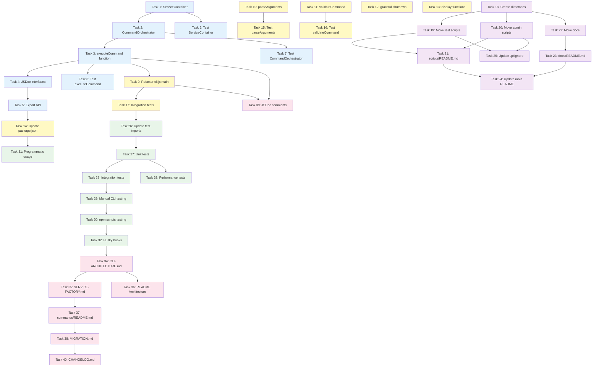

# Implementation Plan: CLI Architecture Refactor

## Overview

Este documento contém o plano de implementação para a refatoração completa da arquitetura do repositório docs-jana. A implementação segue uma estratégia de 5 fases para minimizar riscos e garantir que cada etapa seja validada antes de prosseguir.

**Estratégia de Migração:**
- **Phase 1**: Criar camada de orquestração (index.js refactor) - Sem breaking changes
- **Phase 2**: Refatorar CLI (cli.js simplification) - Migração gradual
- **Phase 3**: Reorganização de arquivos (scripts e docs) - Baixo risco
- **Phase 4**: Testes e validação - Garantia de qualidade
- **Phase 5**: Documentação - Comunicação da nova arquitetura

---

## Phase 1: Criar Camada de Orquestração

**Checkpoints de Qualidade:**
- [ ] ESLint passa (zero violations)
- [ ] Todas funções possuem JSDoc completo
- [ ] Retornos estruturados ({ success, data, error })
- [ ] Coverage >= 95% na camada de orquestração

### ✅ Task 1: Criar ServiceContainer com Service Locator Pattern (COMPLETED)

**Objetivo**: Implementar classe ServiceContainer para gerenciar instâncias de services e factories com lazy instantiation.

**Descrição**:
- Criar `ServiceContainer` class em index.js
- Implementar método `register(name, factory)` para registrar service factories
- Implementar método `resolve(name, config)` com lazy instantiation e caching
- Implementar método `clear()` para cleanup de recursos
- Adicionar validação para service não encontrado

**Acceptance Criteria**:
- ServiceContainer.register() aceita nome e função factory
- ServiceContainer.resolve() retorna instância cacheada se disponível
- ServiceContainer.resolve() instancia novo service apenas na primeira chamada
- ServiceContainer.resolve() lança erro se service não registrado
- ServiceContainer.clear() remove todas instâncias cacheadas

**Requirements**: 3.1, 3.2, 3.5, 3.6

**Estimated Effort**: 2-3 horas

**Risk Level**: 🟢 Low (nova implementação, não afeta código existente)

**Files to Create/Modify**:
- `C:\Users\Windows Home\Documents\GitHub\docs-jana\index.js` (create ServiceContainer class)

---

### ✅ Task 2: Criar CommandOrchestrator para coordenar execução de comandos (COMPLETED)

**Objetivo**: Implementar classe CommandOrchestrator que usa ServiceContainer para orquestrar lifecycle de execução de comandos.

**Descrição**:
- Criar `CommandOrchestrator` class em index.js
- Implementar método `initialize(context)` para setup (logger, service registration)
- Implementar método `run(context)` para executar comando
- Implementar método `loadConfiguration(context)` usando ConfigManager
- Implementar método `resolveCommandHandler(commandName)` para mapear comandos
- Implementar método `cleanup()` para liberar recursos

**Acceptance Criteria**:
- CommandOrchestrator.initialize() cria logger baseado em context.flags.verbose
- CommandOrchestrator.initialize() registra service factories no ServiceContainer
- CommandOrchestrator.run() carrega configuração usando ConfigManager
- CommandOrchestrator.run() resolve command handler correto baseado em commandName
- CommandOrchestrator.run() executa command.execute() e retorna resultado
- CommandOrchestrator.cleanup() chama ServiceContainer.clear()

**Requirements**: 3.1, 3.2, 3.3, 3.4, 3.6, 3.7, 3.8, 3.9

**Estimated Effort**: 4-5 horas

**Risk Level**: 🟡 Medium (integração com services existentes)

**Files to Create/Modify**:
- `C:\Users\Windows Home\Documents\GitHub\docs-jana\index.js` (create CommandOrchestrator class)

**Dependencies**: Task 1 (ServiceContainer must exist)

---

### ✅ Task 3: Implementar função executeCommand() como API pública (COMPLETED)

**Objetivo**: Criar função principal `executeCommand(context)` que coordena initialize → run → cleanup e retorna CommandResult estruturado.

**Descrição**:
- Implementar função `executeCommand(context)` em index.js
- Criar instância de ServiceContainer
- Criar instância de CommandOrchestrator
- Implementar try/catch para error handling
- Retornar objeto CommandResult com formato `{ success, message, data?, error? }`
- Garantir cleanup mesmo em caso de erro

**Acceptance Criteria**:
- executeCommand() aceita CommandContext object como parâmetro
- executeCommand() retorna Promise<CommandResult>
- Em caso de sucesso, retorna `{ success: true, message, data }`
- Em caso de erro, retorna `{ success: false, message, error: { code, message, stack? } }`
- executeCommand() sempre chama orchestrator.cleanup() (finally block)
- Stack trace apenas incluído se `process.env.DEBUG` estiver ativo

**Requirements**: 3.1, 3.6, 3.8

**Estimated Effort**: 2-3 horas

**Risk Level**: 🟢 Low (wrapper function)

**Files to Create/Modify**:
- `C:\Users\Windows Home\Documents\GitHub\docs-jana\index.js` (create executeCommand function)

**Dependencies**: Task 2 (CommandOrchestrator must exist)

---

### ✅ Task 4: Definir interfaces TypeScript (JSDoc) para CommandContext e CommandResult (COMPLETED)

**Objetivo**: Documentar interfaces de dados usando JSDoc para autocomplete e validação de tipos.

**Descrição**:
- Adicionar JSDoc typedef para `CommandContext` interface
- Adicionar JSDoc typedef para `CommandFlags` interface
- Adicionar JSDoc typedef para `CommandResult` interface
- Adicionar JSDoc typedef para `CommandError` interface
- Adicionar JSDoc comments nas funções executeCommand, CommandOrchestrator methods, ServiceContainer methods

**Acceptance Criteria**:
- JSDoc typedef para CommandContext inclui: command, args, flags, env
- JSDoc typedef para CommandFlags inclui todas flags globais e específicas
- JSDoc typedef para CommandResult inclui: success, message, data?, error?
- JSDoc typedef para CommandError inclui: code, message, stack?
- Todas funções públicas possuem JSDoc com @param e @returns

**Requirements**: 9.4

**Estimated Effort**: 1-2 horas

**Risk Level**: 🟢 Low (documentação)

**Files to Create/Modify**:
- `C:\Users\Windows Home\Documents\GitHub\docs-jana\index.js` (add JSDoc typedefs)

**Dependencies**: Task 3 (executeCommand must exist)

---

### ✅ Task 5: Exportar API pública de index.js (COMPLETED)

**Objetivo**: Exportar executeCommand, CommandOrchestrator, ServiceContainer para uso programático e testes.

**Descrição**:
- Adicionar `module.exports` em index.js
- Exportar `executeCommand` como função principal
- Exportar `CommandOrchestrator` class para testes
- Exportar `ServiceContainer` class para testes
- Adicionar JSDoc @module documentation

**Acceptance Criteria**:
- `require('docs-jana')` retorna objeto com { executeCommand, CommandOrchestrator, ServiceContainer }
- executeCommand é função que aceita CommandContext
- CommandOrchestrator e ServiceContainer são classes instanciáveis
- Module exports possui JSDoc documentation

**Requirements**: 6.4, 9.4

**Estimated Effort**: 1 hora

**Risk Level**: 🟢 Low (export statement)

**Files to Create/Modify**:
- `C:\Users\Windows Home\Documents\GitHub\docs-jana\index.js` (add module.exports)

**Dependencies**: Task 3 (all classes must exist)

---

### Task 6: Escrever testes unitários para ServiceContainer

**Objetivo**: Criar suite de testes para validar comportamento de ServiceContainer (register, resolve, caching, clear).

**Descrição**:
- Criar arquivo `__tests__/unit/orchestration/service-container.test.js`
- Testar register() com factory function
- Testar resolve() com lazy instantiation
- Testar resolve() com caching (segunda chamada retorna mesma instância)
- Testar resolve() lança erro para service desconhecido
- Testar clear() remove todas instâncias

**Acceptance Criteria**:
- Teste valida register() armazena factory
- Teste valida resolve() instancia service apenas na primeira chamada
- Teste valida resolve() retorna instância cacheada em chamadas subsequentes
- Teste valida resolve() lança Error com mensagem 'Service not found'
- Teste valida clear() limpa cache de services
- Coverage de ServiceContainer ≥ 95%

**Requirements**: 8.3

**Estimated Effort**: 2-3 horas

**Risk Level**: 🟢 Low (unit tests)

**Files to Create/Modify**:
- `C:\Users\Windows Home\Documents\GitHub\docs-jana\__tests__\unit\orchestration\service-container.test.js` (create)

**Dependencies**: Task 1 (ServiceContainer implementation)

---

### Task 7: Escrever testes unitários para CommandOrchestrator

**Objetivo**: Criar suite de testes para validar comportamento de CommandOrchestrator (initialize, run, loadConfiguration, cleanup).

**Descrição**:
- Criar arquivo `__tests__/unit/orchestration/command-orchestrator.test.js`
- Mockar ServiceContainer e command handlers
- Testar initialize() cria logger e registra services
- Testar run() executa comando e retorna resultado
- Testar loadConfiguration() carrega config de múltiplas fontes
- Testar resolveCommandHandler() retorna handler correto
- Testar cleanup() chama ServiceContainer.clear()
- Testar error handling quando command handler não encontrado

**Acceptance Criteria**:
- Teste valida initialize() cria logger com logLevel correto baseado em verbose flag
- Teste valida initialize() registra 'n8n' e 'outline' services
- Teste valida run() executa command handler e retorna resultado
- Teste valida loadConfiguration() usa ConfigManager corretamente
- Teste valida resolveCommandHandler() lança erro para comando desconhecido
- Teste valida cleanup() limpa ServiceContainer
- Coverage de CommandOrchestrator ≥ 95%

**Requirements**: 8.3

**Estimated Effort**: 3-4 horas

**Risk Level**: 🟡 Medium (testes com mocks complexos)

**Files to Create/Modify**:
- `C:\Users\Windows Home\Documents\GitHub\docs-jana\__tests__\unit\orchestration\command-orchestrator.test.js` (create)

**Dependencies**: Task 2 (CommandOrchestrator implementation)

---

### Task 8: Escrever testes unitários para executeCommand()

**Objetivo**: Criar suite de testes para validar comportamento de executeCommand() (success case, error case, cleanup).

**Descrição**:
- Criar arquivo `__tests__/unit/orchestration/execute-command.test.js`
- Mockar CommandOrchestrator
- Testar executeCommand() retorna success result quando comando executa com sucesso
- Testar executeCommand() retorna error result quando comando falha
- Testar executeCommand() chama cleanup() mesmo quando erro ocorre
- Testar formato de CommandResult (success, message, data, error)

**Acceptance Criteria**:
- Teste valida executeCommand() retorna `{ success: true, message, data }` em caso de sucesso
- Teste valida executeCommand() retorna `{ success: false, message, error }` em caso de erro
- Teste valida cleanup() é chamado tanto em success quanto em error
- Teste valida error.stack apenas incluído quando DEBUG=true
- Coverage de executeCommand ≥ 95%

**Requirements**: 8.3

**Estimated Effort**: 2-3 horas

**Risk Level**: 🟢 Low (unit tests)

**Files to Create/Modify**:
- `C:\Users\Windows Home\Documents\GitHub\docs-jana\__tests__\unit\orchestration\execute-command.test.js` (create)

**Dependencies**: Task 3 (executeCommand implementation)

---

## Phase 2: Refatorar CLI

**Checkpoints de Qualidade:**
- [ ] Validações de segurança implementadas
- [ ] Mensagens de erro em PT-BR
- [ ] EnvLoader integrado e testado
- [ ] Tratamento graceful de sinais (SIGINT/SIGTERM)

### ✅ Task 9: Refatorar cli.js para usar index.executeCommand() (COMPLETED)

**Objetivo**: Modificar cli.js main() function para invocar index.executeCommand() ao invés de executar comandos diretamente.

**Descrição**:
- Refatorar função `main()` em cli.js
- Remover lógica de execução direta de comandos
- Adicionar chamada para `require('./index').executeCommand(context)`
- Manter funções de help, version, error display
- Adicionar handling de CommandResult (success/error)

**Acceptance Criteria**:
- main() chama index.executeCommand() para comandos normais (não help/version)
- main() passa CommandContext estruturado para executeCommand()
- main() exibe mensagem de sucesso se result.success === true
- main() exibe mensagem de erro se result.success === false
- main() chama process.exit(0) em sucesso, process.exit(1) em erro
- Funções displayHelp, displayVersion permanecem em cli.js

**Requirements**: 1.1, 2.1, 2.2, 2.3, 2.4

**Estimated Effort**: 3-4 horas

**Risk Level**: 🟡 Medium (modifica entry point)

**Files to Create/Modify**:
- `C:\Users\Windows Home\Documents\GitHub\docs-jana\cli.js` (modify main function)

**Dependencies**: Task 3 (executeCommand must exist)

---

### ✅ Task 10: Implementar parseArguments() em cli.js (COMPLETED)

**Objetivo**: Criar função parseArguments() que converte process.argv em CommandContext estruturado.

**Descrição**:
- Implementar função `parseArguments(argv)` em cli.js
- Parsear command name (primeiro argumento após node/cli.js)
- Parsear flags (--help, --version, --verbose, --config, --dry-run, etc.)
- Parsear remaining args como array
- Incluir process.env em context
- Retornar objeto CommandContext

**Acceptance Criteria**:
- parseArguments(['node', 'cli.js', 'n8n:download']) retorna context.command === 'n8n:download'
- parseArguments com '--verbose' flag retorna context.flags.verbose === true
- parseArguments com '--config file.json' retorna context.flags.config === 'file.json'
- parseArguments inclui process.env em context.env
- parseArguments retorna args array com argumentos restantes

**Requirements**: 1.1, 1.5, 2.5

**Estimated Effort**: 2-3 horas

**Risk Level**: 🟢 Low (parsing logic)

**Files to Create/Modify**:
- `C:\Users\Windows Home\Documents\GitHub\docs-jana\cli.js` (create parseArguments function)

**Dependencies**: None (standalone function)

---

### Task 11: Implementar validateCommand() e findCommand() em cli.js

**Objetivo**: Criar funções para validar e encontrar comandos no COMMANDS registry (incluindo aliases).

**Descrição**:
- Implementar função `validateCommand(commandName)` que verifica se comando existe
- Implementar função `findCommand(input)` que busca por nome canônico ou alias
- Usar COMMANDS object existente em cli.js (linhas 31-73)
- Retornar nome canônico do comando

**Acceptance Criteria**:
- validateCommand('n8n:download') retorna true
- validateCommand('unknown:command') retorna false
- findCommand('download:n8n') retorna 'n8n:download' (alias)
- findCommand('n8n:download') retorna 'n8n:download' (canonical)
- findCommand('invalid') retorna null ou undefined

**Requirements**: 1.3, 2.4, 2.7

**Estimated Effort**: 1-2 horas

**Risk Level**: 🟢 Low (validation logic)

**Files to Create/Modify**:
- `C:\Users\Windows Home\Documents\GitHub\docs-jana\cli.js` (create validation functions)

**Dependencies**: None (uses existing COMMANDS object)

---

### Task 12: Implementar graceful shutdown em cli.js

**Objetivo**: Adicionar handlers para SIGINT/SIGTERM que executam cleanup e exibem mensagem de shutdown.

**Descrição**:
- Implementar função `gracefulShutdown()` em cli.js
- Adicionar flag global `isShuttingDown` para evitar múltiplos shutdowns
- Registrar handlers para SIGINT e SIGTERM
- Exibir mensagem de shutdown para usuário
- Chamar process.exit(0) após cleanup

**Acceptance Criteria**:
- Ctrl+C (SIGINT) capturado e chama gracefulShutdown()
- SIGTERM capturado e chama gracefulShutdown()
- gracefulShutdown() exibe mensagem user-friendly
- gracefulShutdown() ignora sinais duplicados (isShuttingDown check)
- gracefulShutdown() chama process.exit(0) após 100ms

**Requirements**: 2.8, 7.8

**Estimated Effort**: 1-2 horas

**Risk Level**: 🟢 Low (signal handling)

**Files to Create/Modify**:
- `C:\Users\Windows Home\Documents\GitHub\docs-jana\cli.js` (add signal handlers)

**Dependencies**: None

---

### Task 13: Adicionar displaySuccess() e refatorar displayError() em cli.js

**Objetivo**: Criar função displaySuccess() e melhorar displayError() para exibir CommandResult de forma user-friendly.

**Descrição**:
- Implementar função `displaySuccess(message)` em cli.js
- Refatorar função `displayError(error)` para aceitar CommandError object
- Adicionar suporte para verbose mode (mostrar stack trace)
- Adicionar emojis e cores para melhor UX
- Manter consistência com estilo existente

**Acceptance Criteria**:
- displaySuccess() exibe mensagem com emoji ✅
- displayError() exibe mensagem com emoji ❌
- displayError() mostra stack trace apenas em verbose mode
- displayError() sugere `docs-jana help` para erros de comando desconhecido
- Funções usam console.log/console.error apropriadamente

**Requirements**: 2.4, 2.5, 7.7

**Estimated Effort**: 1-2 horas

**Risk Level**: 🟢 Low (display functions)

**Files to Create/Modify**:
- `C:\Users\Windows Home\Documents\GitHub\docs-jana\cli.js` (add/modify display functions)

**Dependencies**: None

---

### Task 14: Atualizar package.json entry points

**Objetivo**: Modificar package.json para definir index.js como main module e cli.js como bin entry point.

**Descrição**:
- Alterar `"main": "cli.js"` para `"main": "index.js"` em package.json
- Manter `"bin": { "docs-jana": "./cli.js" }`
- Verificar que npm scripts ainda funcionam
- Executar `pnpm install` para validar

**Acceptance Criteria**:
- package.json tem `"main": "index.js"`
- package.json mantém `"bin": { "docs-jana": "./cli.js" }`
- `require('docs-jana')` retorna exports de index.js
- `docs-jana` command ainda executa cli.js
- pnpm install completa sem erros

**Requirements**: 6.1, 6.2, 6.6

**Estimated Effort**: 30 minutos

**Risk Level**: 🟢 Low (config change)

**Files to Create/Modify**:
- `C:\Users\Windows Home\Documents\GitHub\docs-jana\package.json` (modify main field)

**Dependencies**: Task 5 (index.js must export API)

---

### Task 15: Escrever testes unitários para parseArguments()

**Objetivo**: Criar suite de testes para validar parsing de argumentos CLI.

**Descrição**:
- Criar arquivo `__tests__/unit/cli/parse-arguments.test.js`
- Testar parsing de command name
- Testar parsing de flags (--help, --verbose, --config, etc.)
- Testar parsing de args array
- Testar edge cases (sem argumentos, flags inválidas)

**Acceptance Criteria**:
- Teste valida parsing de command name
- Teste valida parsing de boolean flags (--verbose)
- Teste valida parsing de value flags (--config file.json)
- Teste valida args array contém argumentos restantes
- Teste valida context.env contém process.env
- Coverage de parseArguments ≥ 90%

**Requirements**: 8.2

**Estimated Effort**: 2-3 horas

**Risk Level**: 🟢 Low (unit tests)

**Files to Create/Modify**:
- `C:\Users\Windows Home\Documents\GitHub\docs-jana\__tests__\unit\cli\parse-arguments.test.js` (create)

**Dependencies**: Task 10 (parseArguments implementation)

---

### Task 16: Escrever testes unitários para validateCommand()

**Objetivo**: Criar suite de testes para validar funções de validação de comandos.

**Descrição**:
- Criar arquivo `__tests__/unit/cli/validate-command.test.js`
- Testar validateCommand() com comandos válidos
- Testar validateCommand() com comandos inválidos
- Testar findCommand() com nomes canônicos
- Testar findCommand() com aliases

**Acceptance Criteria**:
- Teste valida comandos conhecidos retornam true
- Teste valida comandos desconhecidos retornam false
- Teste valida findCommand() resolve aliases corretamente
- Teste valida findCommand() retorna null para input inválido
- Coverage de validateCommand/findCommand ≥ 90%

**Requirements**: 8.2

**Estimated Effort**: 1-2 horas

**Risk Level**: 🟢 Low (unit tests)

**Files to Create/Modify**:
- `C:\Users\Windows Home\Documents\GitHub\docs-jana\__tests__\unit\cli\validate-command.test.js` (create)

**Dependencies**: Task 11 (validateCommand implementation)

---

### Task 17: Escrever testes de integração CLI → Orchestration

**Objetivo**: Criar testes que validam integração entre cli.js e index.js.

**Descrição**:
- Criar arquivo `__tests__/integration/cli-orchestration.test.js`
- Mockar index.executeCommand()
- Testar cli.js invoca executeCommand() com CommandContext correto
- Testar cli.js exibe sucesso quando result.success === true
- Testar cli.js exibe erro quando result.success === false
- Testar cli.js não invoca executeCommand() para help/version

**Acceptance Criteria**:
- Teste valida main() passa CommandContext estruturado para executeCommand()
- Teste valida main() exibe success message quando result.success === true
- Teste valida main() exibe error message quando result.success === false
- Teste valida help command não chama executeCommand()
- Teste valida version command não chama executeCommand()
- Coverage de integração ≥ 85%

**Requirements**: 8.2, 8.3

**Estimated Effort**: 3-4 horas

**Risk Level**: 🟡 Medium (integration tests)

**Files to Create/Modify**:
- `C:\Users\Windows Home\Documents\GitHub\docs-jana\__tests__\integration\cli-orchestration.test.js` (create)

**Dependencies**: Task 9 (cli.js refactor)

---

## Phase 3: Reorganização de Arquivos

**Checkpoints de Qualidade:**
- [ ] Comandos estendem BaseCommand (padrão consistente)
- [ ] Registro no menu completo (todos campos obrigatórios)
- [ ] Testes escritos (>= 80% coverage)
- [ ] Git history preservado (uso de git mv)

### ✅ Task 18: Criar estrutura de diretórios para scripts e docs (COMPLETED)

**Objetivo**: Criar diretórios /scripts e /docs com subdiretórios organizados.

**Descrição**:
- Criar diretório `/scripts/test/` para test scripts
- Criar diretório `/scripts/admin/` para administrative scripts
- Criar diretório `/docs/technical/` para documentos técnicos
- Criar diretório `/docs/architecture/` para documentação de arquitetura
- Verificar que parent directory existe antes de criar subdirectories

**Acceptance Criteria**:
- Diretório `C:\Users\Windows Home\Documents\GitHub\docs-jana\scripts\test` existe
- Diretório `C:\Users\Windows Home\Documents\GitHub\docs-jana\scripts\admin` existe
- Diretório `C:\Users\Windows Home\Documents\GitHub\docs-jana\docs\technical` existe
- Diretório `C:\Users\Windows Home\Documents\GitHub\docs-jana\docs\architecture` existe

**Requirements**: 4.1, 4.2, 5.1, 5.2

**Estimated Effort**: 15 minutos

**Risk Level**: 🟢 Low (directory creation)

**Files to Create/Modify**:
- Create directories (no files)

**Dependencies**: None

---

### ✅ Task 19: Mover test scripts para /scripts/test/ (COMPLETED)

**Objetivo**: Mover todos scripts de teste da raiz para /scripts/test/ e atualizar imports relativos.

**Descrição**:
- Mover `test-payload-cleaning.js` para `/scripts/test/`
- Mover `test-workflow-id-preservation.js` para `/scripts/test/`
- Mover `test-tag-operations.js` para `/scripts/test/`
- Atualizar imports relativos em cada script (ex: `require('../src/...')` → `require('../../src/...')`)
- Testar que scripts ainda executam corretamente

**Acceptance Criteria**:
- Scripts movidos para /scripts/test/
- Imports atualizados e scripts executam sem erros
- Raiz não contém mais test-*.js files
- Git history preservado (usar `git mv`)

**Requirements**: 4.1, 4.3, 4.7

**Estimated Effort**: 1 hora

**Risk Level**: 🟢 Low (file move with import updates)

**Files to Create/Modify**:
- Move test-payload-cleaning.js, test-workflow-id-preservation.js, test-tag-operations.js to /scripts/test/

**Dependencies**: Task 18 (directories must exist)

---

### ✅ Task 20: Mover admin scripts para /scripts/admin/ (COMPLETED)

**Objetivo**: Mover scripts administrativos da raiz para /scripts/admin/ e atualizar imports relativos.

**Descrição**:
- Mover `cleanup-duplicates.js` para `/scripts/admin/`
- Mover `delete-all-workflows.js` para `/scripts/admin/`
- Mover `unarchive-workflows.js` para `/scripts/admin/`
- Mover `unarchive-direct.js` para `/scripts/admin/`
- Atualizar imports relativos em cada script
- Testar que scripts ainda executam corretamente

**Acceptance Criteria**:
- Scripts movidos para /scripts/admin/
- Imports atualizados e scripts executam sem erros
- Raiz não contém mais scripts administrativos
- Git history preservado (usar `git mv`)

**Requirements**: 4.2, 4.3, 4.7

**Estimated Effort**: 1 hora

**Risk Level**: 🟢 Low (file move with import updates)

**Files to Create/Modify**:
- Move cleanup-duplicates.js, delete-all-workflows.js, unarchive-workflows.js, unarchive-direct.js to /scripts/admin/

**Dependencies**: Task 18 (directories must exist)

---

### ✅ Task 21: Criar /scripts/README.md documentando scripts (COMPLETED)

**Objetivo**: Criar README em /scripts/ explicando propósito e uso de cada script.

**Descrição**:
- Criar `/scripts/README.md`
- Documentar cada script em /scripts/test/ (propósito, como executar)
- Documentar cada script em /scripts/admin/ (propósito, como executar, warnings)
- Adicionar seção de troubleshooting
- Adicionar links para documentação relacionada

**Acceptance Criteria**:
- /scripts/README.md existe e contém descrição de todos scripts
- Cada script possui: nome, propósito, comando de execução, parâmetros
- Scripts administrativos incluem warnings sobre uso (ex: delete-all-workflows)
- README inclui seção "Prerequisites" e "Troubleshooting"

**Requirements**: 4.7

**Estimated Effort**: 1-2 horas

**Risk Level**: 🟢 Low (documentation)

**Files to Create/Modify**:
- `C:\Users\Windows Home\Documents\GitHub\docs-jana\scripts\README.md` (create)

**Dependencies**: Task 19, Task 20 (scripts must be moved)

---

### ✅ Task 22: Mover documentos técnicos para /docs/technical/ (COMPLETED)

**Objetivo**: Mover documentos técnicos da raiz para /docs/technical/ e atualizar links relativos.

**Descrição**:
- Mover `TAG_CODE_CHANGES.md` para `/docs/technical/`
- Mover `TAG_IMPLEMENTATION_SUMMARY.md` para `/docs/technical/`
- Mover `WORKFLOW-ID-PRESERVATION-REPORT.md` para `/docs/technical/`
- Mover `WORKFLOW-REFERENCES.md` para `/docs/technical/`
- Verificar links internos e atualizar se necessário
- Buscar referências a esses arquivos em README.md e atualizar

**Acceptance Criteria**:
- Documentos movidos para /docs/technical/
- Links relativos atualizados nos documentos
- README.md referencia novos caminhos (se aplicável)
- Raiz não contém mais documentos técnicos
- Git history preservado (usar `git mv`)

**Requirements**: 5.1, 5.3, 5.4

**Estimated Effort**: 1 hora

**Risk Level**: 🟢 Low (file move with link updates)

**Files to Create/Modify**:
- Move TAG_CODE_CHANGES.md, TAG_IMPLEMENTATION_SUMMARY.md, WORKFLOW-ID-PRESERVATION-REPORT.md, WORKFLOW-REFERENCES.md to /docs/technical/

**Dependencies**: Task 18 (directories must exist)

---

### ✅ Task 23: Criar /docs/README.md indexando documentação (COMPLETED)

**Objetivo**: Criar README em /docs/ com índice de toda documentação técnica e arquitetural.

**Descrição**:
- Criar `/docs/README.md`
- Adicionar seção "Technical Documentation" com links para /docs/technical/
- Adicionar seção "Architecture Documentation" (preparar para docs futuros)
- Adicionar breve descrição de cada documento
- Adicionar link de volta para README principal

**Acceptance Criteria**:
- /docs/README.md existe e contém índice de todos documentos
- Cada documento listado possui: nome, descrição breve, link
- README divide documentação em categorias (Technical, Architecture)
- README inclui link para README principal do projeto

**Requirements**: 5.7, 9.1

**Estimated Effort**: 1 hora

**Risk Level**: 🟢 Low (documentation)

**Files to Create/Modify**:
- `C:\Users\Windows Home\Documents\GitHub\docs-jana\docs\README.md` (create)

**Dependencies**: Task 22 (docs must be moved)

---

### ✅ Task 24: Atualizar README.md principal com links para nova estrutura (COMPLETED)

**Objetivo**: Atualizar README.md raiz para referenciar nova estrutura de /scripts e /docs.

**Descrição**:
- Atualizar seção "Scripts" em README.md (se existir) para apontar para /scripts/README.md
- Adicionar seção "Documentation" em README.md com link para /docs/README.md
- Atualizar quaisquer links quebrados para documentos movidos
- Manter estilo e tom do README existente

**Acceptance Criteria**:
- README.md inclui link para /scripts/README.md
- README.md inclui seção "Documentation" com link para /docs/README.md
- Todos links para documentos técnicos atualizados
- README mantém formatação e estilo consistentes

**Requirements**: 4.4, 5.6, 9.1

**Estimated Effort**: 30 minutos

**Risk Level**: 🟢 Low (documentation update)

**Files to Create/Modify**:
- `C:\Users\Windows Home\Documents\GitHub\docs-jana\README.md` (modify)

**Dependencies**: Task 21, Task 23 (README files must exist)

---

### ✅ Task 25: Verificar e atualizar .gitignore se necessário (COMPLETED)

**Objetivo**: Revisar .gitignore e adicionar entradas para novos diretórios se necessário.

**Descrição**:
- Revisar .gitignore atual
- Adicionar `/scripts/temp/` se scripts criarem arquivos temporários
- Adicionar `/scripts/*/node_modules` se scripts tiverem dependências próprias
- Verificar que /docs/ não está sendo ignorado
- Testar com `git status` para garantir arquivos corretos são tracked

**Acceptance Criteria**:
- .gitignore inclui /scripts/temp/ (se necessário)
- .gitignore não ignora /scripts ou /docs inadvertidamente
- `git status` mostra arquivos esperados como tracked

**Requirements**: 10.5

**Estimated Effort**: 15 minutos

**Risk Level**: 🟢 Low (config update)

**Files to Create/Modify**:
- `C:\Users\Windows Home\Documents\GitHub\docs-jana\.gitignore` (modify if needed)

**Dependencies**: Task 19, Task 20 (scripts must be moved)

---

## Phase 4: Testes e Validação

**Checkpoints de Qualidade:**
- [ ] Documentação criada (comando + review técnico)
- [ ] Compliance checks passando (ESLint, JSDoc, Coverage)
- [ ] Pipeline CI/CD verde (todos testes passando)
- [ ] Performance validada (overhead < 50ms)

### ✅ Task 26: Atualizar imports em testes existentes se necessário (COMPLETED)

**Objetivo**: Revisar testes existentes em __tests__/ e atualizar imports se arquivos foram movidos ou refatorados.

**Descrição**:
- Executar `pnpm test` para identificar falhas de import
- Atualizar imports em testes que referenciam cli.js ou index.js
- Atualizar imports em testes que referenciam scripts movidos
- Verificar que todos mocks ainda funcionam corretamente

**Acceptance Criteria**:
- Todos testes existentes passam após refatoração
- Imports atualizados para refletir nova estrutura
- Mocks de services ainda funcionam corretamente
- Zero breaking changes em test utilities

**Requirements**: 8.1, 8.4

**Estimated Effort**: 2-3 horas

**Risk Level**: 🟡 Medium (pode descobrir issues em testes)

**Files to Create/Modify**:
- Various test files in __tests__/ (modify imports)

**Dependencies**: All previous tasks (full refactor complete)

---

### ✅ Task 27: Executar suite completa de testes unitários (COMPLETED)

**Objetivo**: Executar todos testes unitários e garantir 100% passam.

**Descrição**:
- Executar `pnpm test:unit` (ou equivalente)
- Revisar output para identificar falhas
- Fixar quaisquer testes falhando
- Verificar coverage ≥ 90% em camadas críticas
- Gerar relatório de coverage

**Acceptance Criteria**:
- `pnpm test:unit` completa com 100% dos testes passando
- Coverage de cli.js ≥ 90%
- Coverage de index.js (orchestration) ≥ 95%
- Coverage de ServiceContainer ≥ 95%
- Coverage de CommandOrchestrator ≥ 95%

**Requirements**: 8.1, 8.6

**Estimated Effort**: 1-2 horas (assumindo Task 26 completa)

**Risk Level**: 🟡 Medium (pode descobrir bugs)

**Files to Create/Modify**:
- No files (test execution and fixes)

**Dependencies**: Task 26 (test imports updated)

---

### ✅ Task 28: Executar testes de integração (COMPLETED)

**Objetivo**: Executar testes de integração para validar cli.js → index.js → services.

**Descrição**:
- Executar `pnpm test:integration` (ou equivalente)
- Revisar output para identificar falhas
- Fixar quaisquer testes falhando
- Validar que comandos reais funcionam end-to-end

**Acceptance Criteria**:
- `pnpm test:integration` completa com 100% dos testes passando
- Integração cli.js → index.js validada
- Integração index.js → services validada
- Mocks de services funcionam corretamente

**Requirements**: 8.1, 8.6

**Estimated Effort**: 1-2 horas

**Risk Level**: 🟡 Medium (pode descobrir integration issues)

**Files to Create/Modify**:
- No files (test execution and fixes)

**Dependencies**: Task 27 (unit tests passing)

---

### ✅ Task 29: Testar todos comandos CLI manualmente (COMPLETED)

**Objetivo**: Executar cada comando CLI manualmente para validar funcionalidade end-to-end.

**Descrição**:
- Testar `docs-jana help` (exibe help message)
- Testar `docs-jana version` (exibe version info)
- Testar `docs-jana n8n:download --help` (exibe command help)
- Testar `docs-jana n8n:upload --help` (exibe command help)
- Testar `docs-jana outline:download --help` (exibe command help)
- Testar comando inválido (exibe erro + suggestion)
- Testar cada comando com --dry-run (se suportado)
- Testar Ctrl+C durante execução (graceful shutdown)

**Acceptance Criteria**:
- `docs-jana help` exibe lista completa de comandos
- `docs-jana version` exibe version, platform, Node.js version
- Cada comando com --help exibe usage correto
- Comando inválido exibe erro claro + sugere `docs-jana help`
- --dry-run funciona para comandos que suportam
- Ctrl+C executa graceful shutdown

**Requirements**: 7.1, 7.2, 7.3, 7.4, 7.5

**Estimated Effort**: 1-2 horas

**Risk Level**: 🟢 Low (manual validation)

**Files to Create/Modify**:
- No files (manual testing)

**Dependencies**: Task 28 (integration tests passing)

---

### ✅ Task 30: Testar npm scripts (pnpm commands) (COMPLETED)

**Objetivo**: Validar que todos npm scripts em package.json ainda funcionam corretamente.

**Descrição**:
- Testar `pnpm n8n:download` (se definido em package.json)
- Testar `pnpm outline:download` (se definido)
- Testar `pnpm test` (suite completa)
- Testar `pnpm lint` (linting)
- Verificar que scripts invocam cli.js corretamente

**Acceptance Criteria**:
- Todos npm scripts executam sem erros
- Scripts invocam cli.js como entry point
- `pnpm test` passa todos testes
- `pnpm lint` passa sem erros

**Requirements**: 6.3, 7.5, 8.7

**Estimated Effort**: 30 minutos

**Risk Level**: 🟢 Low (validation)

**Files to Create/Modify**:
- No files (npm script testing)

**Dependencies**: Task 29 (CLI commands working)

---

### ✅ Task 31: Testar uso programático de index.js (COMPLETED)

**Objetivo**: Validar que index.js pode ser usado programaticamente (require('docs-jana')).

**Descrição**:
- Criar script de teste temporário que importa docs-jana
- Testar `require('docs-jana').executeCommand(context)`
- Verificar que executeCommand retorna CommandResult
- Testar success case e error case
- Verificar que exports { executeCommand, CommandOrchestrator, ServiceContainer }

**Acceptance Criteria**:
- `require('docs-jana')` retorna objeto com exports esperados
- executeCommand() funciona quando invocado programaticamente
- CommandResult possui formato correto
- Classes CommandOrchestrator e ServiceContainer são instanciáveis

**Requirements**: 6.4, 7.1

**Estimated Effort**: 1 hora

**Risk Level**: 🟢 Low (API testing)

**Files to Create/Modify**:
- Temporary test script (can be deleted after)

**Dependencies**: Task 14 (package.json main updated)

---

### ✅ Task 32: Verificar compatibilidade com Husky hooks (COMPLETED)

**Objetivo**: Validar que refatoração não quebra pre-commit hooks do Husky.

**Descrição**:
- Fazer mudança trivial em arquivo (ex: adicionar comentário)
- Executar `git add .` e `git commit -m "test"`
- Verificar que Husky pre-commit hook executa
- Verificar que lint-staged funciona com arquivos refatorados
- Verificar que commit completa com sucesso

**Acceptance Criteria**:
- Husky pre-commit hook executa
- lint-staged processa arquivos staged
- Linting passa sem erros
- Commit completa com sucesso
- Git hooks não quebrados pela refatoração

**Requirements**: 10.1

**Estimated Effort**: 15 minutos

**Risk Level**: 🟢 Low (validation)

**Files to Create/Modify**:
- No files (git hook testing)

**Dependencies**: Task 30 (all tests passing)

---

### ✅ Task 33: Executar testes de performance (overhead < 50ms) (COMPLETED)

**Objetivo**: Validar que separação cli.js → index.js adiciona ≤ 50ms de overhead.

**Descrição**:
- Criar test de performance `__tests__/performance/orchestration-overhead.test.js`
- Mockar command handler para retornar instantaneamente
- Medir tempo de execução de executeCommand()
- Validar que overhead total < 50ms
- Executar múltiplas iterações para média confiável

**Acceptance Criteria**:
- Test de performance criado
- Overhead medido ≤ 50ms (average de 10 execuções)
- Test passa consistentemente
- Test documentado para execução futura

**Requirements**: Performance NFR (≤ 50ms overhead)

**Estimated Effort**: 1-2 horas

**Risk Level**: 🟢 Low (performance test)

**Files to Create/Modify**:
- `C:\Users\Windows Home\Documents\GitHub\docs-jana\__tests__\performance\orchestration-overhead.test.js` (create)

**Dependencies**: Task 27 (orchestration layer working)

---

## Phase 5: Documentação

**Checkpoints de Qualidade:**
- [ ] Review técnico completo
- [ ] Todos quality gates passando (Score >= 95/100)
- [ ] Aprovação para produção
- [ ] CHANGELOG atualizado

### ✅ Task 34: Criar /docs/architecture/CLI-ARCHITECTURE.md (COMPLETED)

**Objetivo**: Documentar nova arquitetura cli.js → index.js com diagramas e explicações.

**Descrição**:
- Criar `/docs/architecture/CLI-ARCHITECTURE.md`
- Documentar separação de responsabilidades (CLI Layer vs Orchestration Layer)
- Incluir diagramas de arquitetura (copiar de design.md)
- Explicar fluxo de execução: user input → cli.js → index.js → services
- Documentar CommandContext e CommandResult interfaces
- Adicionar exemplos de uso

**Acceptance Criteria**:
- CLI-ARCHITECTURE.md existe e contém documentação completa
- Documento inclui diagramas de arquitetura (Mermaid)
- Documento explica separação cli.js vs index.js
- Documento inclui exemplos de código
- Documento inclui links para arquivos relevantes

**Requirements**: 9.1, 9.2, 9.3

**Estimated Effort**: 2-3 horas

**Risk Level**: 🟢 Low (documentation)

**Files to Create/Modify**:
- `C:\Users\Windows Home\Documents\GitHub\docs-jana\docs\architecture\CLI-ARCHITECTURE.md` (create)

**Dependencies**: All previous tasks (architecture finalized)

---

### ✅ Task 35: Criar /docs/architecture/SERVICE-FACTORY.md (COMPLETED)

**Objetivo**: Documentar uso de ServiceFactory e ServiceContainer com exemplos.

**Descrição**:
- Criar `/docs/architecture/SERVICE-FACTORY.md`
- Documentar Service Locator pattern
- Explicar ServiceContainer (register, resolve, clear)
- Documentar ServiceFactory integration
- Adicionar exemplos de como adicionar novos services
- Documentar dependency injection pattern usado

**Acceptance Criteria**:
- SERVICE-FACTORY.md existe e contém documentação completa
- Documento explica Service Locator pattern
- Documento inclui exemplos de código para ServiceContainer
- Documento explica como adicionar novos services
- Documento inclui best practices

**Requirements**: 9.3, 9.5

**Estimated Effort**: 2-3 horas

**Risk Level**: 🟢 Low (documentation)

**Files to Create/Modify**:
- `C:\Users\Windows Home\Documents\GitHub\docs-jana\docs\architecture\SERVICE-FACTORY.md` (create)

**Dependencies**: Task 34 (architecture finalized)

---

### ✅ Task 36: Atualizar README.md com seção Architecture (COMPLETED)

**Objetivo**: Adicionar seção "Architecture" em README.md explicando nova estrutura.

**Descrição**:
- Adicionar seção "Architecture" em README.md
- Explicar separação CLI Layer vs Orchestration Layer
- Incluir diagrama simplificado (ou link para CLI-ARCHITECTURE.md)
- Documentar entry points (cli.js vs index.js)
- Adicionar link para documentação completa em /docs/architecture/

**Acceptance Criteria**:
- README.md inclui seção "Architecture"
- Seção explica separação de responsabilidades
- Seção inclui link para /docs/architecture/CLI-ARCHITECTURE.md
- Seção explica entry points (bin vs main)
- Seção mantém estilo e tom do README existente

**Requirements**: 9.1, 9.2

**Estimated Effort**: 1 hora

**Risk Level**: 🟢 Low (documentation)

**Files to Create/Modify**:
- `C:\Users\Windows Home\Documents\GitHub\docs-jana\README.md` (modify - add Architecture section)

**Dependencies**: Task 34 (CLI-ARCHITECTURE.md exists)

---

### ✅ Task 37: Atualizar /src/commands/README.md (se existir) (COMPLETED)

**Objetivo**: Atualizar documentação de comandos para refletir nova arquitetura.

**Descrição**:
- Verificar se `/src/commands/README.md` existe
- Se existir, atualizar para explicar como comandos são invocados via orchestration layer
- Documentar CommandContext que comandos recebem
- Adicionar exemplos de como criar novos comandos
- Se não existir, considerar criar (opcional)

**Acceptance Criteria**:
- Se README existe, está atualizado com nova arquitetura
- Documento explica integração com CommandOrchestrator
- Documento inclui exemplo de command handler
- Documento referencia SERVICE-FACTORY.md para DI patterns

**Requirements**: 9.3

**Estimated Effort**: 1-2 horas

**Risk Level**: 🟢 Low (documentation)

**Files to Create/Modify**:
- `C:\Users\Windows Home\Documents\GitHub\docs-jana\src\commands\README.md` (modify or create)

**Dependencies**: Task 35 (SERVICE-FACTORY.md exists)

---

### ✅ Task 38: Criar MIGRATION.md se houver breaking changes (COMPLETED)

**Objetivo**: Documentar breaking changes (se houver) e guia de migração para usuários externos.

**Descrição**:
- Revisar refatoração para identificar breaking changes
- Se houver breaking changes, criar `/MIGRATION.md`
- Documentar mudanças em API pública
- Fornecer exemplos de before/after
- Adicionar guia passo-a-passo para migração
- Se não houver breaking changes, documentar isso em CHANGELOG.md

**Acceptance Criteria**:
- Se breaking changes existem, MIGRATION.md criado e completo
- Documento lista todos breaking changes
- Documento fornece guia de migração
- Documento inclui exemplos before/after
- Se não há breaking changes, isso está documentado em CHANGELOG

**Requirements**: 9.6, 7.1

**Estimated Effort**: 1-2 horas (ou 30 min se não houver breaking changes)

**Risk Level**: 🟢 Low (documentation)

**Files to Create/Modify**:
- `C:\Users\Windows Home\Documents\GitHub\docs-jana\MIGRATION.md` (create if needed)
- `C:\Users\Windows Home\Documents\GitHub\docs-jana\CHANGELOG.md` (update)

**Dependencies**: All previous tasks (refactor complete)

---

### ✅ Task 39: Atualizar JSDoc comments em código refatorado (COMPLETED)

**Objetivo**: Revisar e melhorar JSDoc comments em cli.js e index.js.

**Descrição**:
- Adicionar JSDoc comments completos em todas funções públicas de cli.js
- Adicionar JSDoc comments completos em todas funções públicas de index.js
- Documentar parâmetros (@param) e retornos (@returns)
- Adicionar exemplos (@example) para funções principais
- Adicionar links (@see) para documentação relacionada

**Acceptance Criteria**:
- Todas funções públicas possuem JSDoc comments
- JSDoc inclui @param, @returns, @description
- Funções principais incluem @example
- JSDoc references documentação de arquitetura onde relevante
- JSDoc está consistente com estilo do projeto

**Requirements**: 9.4

**Estimated Effort**: 2-3 horas

**Risk Level**: 🟢 Low (documentation)

**Files to Create/Modify**:
- `C:\Users\Windows Home\Documents\GitHub\docs-jana\cli.js` (add/improve JSDoc)
- `C:\Users\Windows Home\Documents\GitHub\docs-jana\index.js` (add/improve JSDoc)

**Dependencies**: Task 9 (cli.js refactored), Task 3 (index.js complete)

---

### ✅ Task 40: Criar CHANGELOG.md entry para refatoração (COMPLETED)

**Objetivo**: Documentar refatoração em CHANGELOG.md com versão e data.

**Descrição**:
- Adicionar entry em CHANGELOG.md para esta refatoração
- Documentar versão (seguir semver)
- Listar todas mudanças sob categorias (Added, Changed, Fixed)
- Adicionar link para documentação de arquitetura
- Seguir formato Keep a Changelog

**Acceptance Criteria**:
- CHANGELOG.md atualizado com entry de refatoração
- Entry inclui versão e data
- Mudanças organizadas em categorias
- Entry menciona zero breaking changes (se aplicável)
- Entry inclui link para CLI-ARCHITECTURE.md

**Requirements**: 9.6

**Estimated Effort**: 30 minutos

**Risk Level**: 🟢 Low (documentation)

**Files to Create/Modify**:
- `C:\Users\Windows Home\Documents\GitHub\docs-jana\CHANGELOG.md` (add entry)

**Dependencies**: Task 38 (migration doc complete)

---

## Phase 6: Camada de Segurança (Security Layer)

**Baseado em:** n8n:configure-target security implementation

**Effort Estimado:** 2 dias
**Critério de Sucesso:** Security Score >= 95/100
**Dependências:** Phase 1 (estrutura do projeto) completa

**Checkpoints de Qualidade:**
- [ ] Proteção SSRF implementada e testada (20+ cenários)
- [ ] Validação JWT implementada
- [ ] Sanitização de inputs (prevenção de injeção)
- [ ] Mascaramento de dados sensíveis
- [ ] Gerenciamento de permissões de arquivos (chmod 600)
- [ ] Documentação de segurança completa

### Task 41: Implementar URLValidator com proteção SSRF

**Objetivo**: Criar validador de URLs que previne ataques SSRF (Server-Side Request Forgery).

**Descrição**:
- Criar classe `URLValidator` em `/src/security/url-validator.js`
- Implementar blocklist para endereços privados:
  - localhost, 127.x.x.x
  - 192.168.x.x
  - 10.x.x.x
  - 172.16-31.x.x
  - ::1, fe80::
- Validar protocolo (apenas HTTP/HTTPS)
- Exibir warning para HTTP (sem bloquear)
- Implementar método `validate(url)` que retorna `{ valid, error?, warning? }`

**Acceptance Criteria**:
- URLValidator.validate() bloqueia endereços privados
- URLValidator.validate() permite URLs públicas válidas
- Warning exibido para URLs HTTP (não HTTPS)
- Erro claro em PT-BR quando URL inválida
- Coverage >= 95%

**Requirements**: 11 (Security Requirements - SSRF Protection)

**Estimated Effort**: 4 horas

**Risk Level**: 🟡 Medium (security critical)

**Files to Create/Modify**:
- `C:\Users\Windows Home\Documents\GitHub\docs-jana\src\security\url-validator.js` (create)

**Referência**: n8n-configure-target URL validation (linhas 45-78)

---

### Task 42: Implementar TokenValidator com validação JWT

**Objetivo**: Criar validador para tokens JWT garantindo formato correto.

**Descrição**:
- Criar classe `TokenValidator` em `/src/security/token-validator.js`
- Validar estrutura JWT (3 partes: header.payload.signature)
- Validar caracteres Base64URL
- Validar comprimento mínimo
- Implementar método `validate(token)` que retorna `{ valid, error? }`
- Não validar assinatura (apenas formato)

**Acceptance Criteria**:
- TokenValidator.validate() aceita JWTs bem formados
- TokenValidator.validate() rejeita tokens malformados
- Erro claro quando token possui menos de 3 partes
- Erro claro quando caracteres inválidos detectados
- Coverage >= 95%

**Requirements**: 11 (Security Requirements - Token Validation)

**Estimated Effort**: 3 horas

**Risk Level**: 🟢 Low (validação de formato)

**Files to Create/Modify**:
- `C:\Users\Windows Home\Documents\GitHub\docs-jana\src\security\token-validator.js` (create)

**Referência**: n8n-configure-target JWT validation (linhas 82-105)

---

### Task 43: Implementar InputSanitizer para prevenção de injeção

**Objetivo**: Criar sanitizador de inputs que remove caracteres perigosos.

**Descrição**:
- Criar classe `InputSanitizer` em `/src/security/input-sanitizer.js`
- Implementar remoção de caracteres perigosos: ; | & $ `
- Implementar sanitização de file paths (remover ../)
- Implementar método `sanitize(input, type)` onde type pode ser 'command', 'path', 'text'
- Retornar input sanitizado + warnings se caracteres removidos

**Acceptance Criteria**:
- InputSanitizer.sanitize() remove caracteres perigosos de comandos
- InputSanitizer.sanitize() previne path traversal (../)
- Warning exibido quando caracteres removidos
- Input sanitizado é seguro para execução
- Coverage >= 95%

**Requirements**: 12 (Security Requirements - Input Sanitization)

**Estimated Effort**: 3 horas

**Risk Level**: 🟡 Medium (security critical)

**Files to Create/Modify**:
- `C:\Users\Windows Home\Documents\GitHub\docs-jana\src\security\input-sanitizer.js` (create)

**Referência**: n8n-configure-target input sanitization (linhas 110-135)

---

### Task 44: Implementar SensitiveDataMasker

**Objetivo**: Criar mascarador de dados sensíveis para logs e outputs.

**Descrição**:
- Criar classe `SensitiveDataMasker` em `/src/security/data-masker.js`
- Implementar mascaramento de API keys (mostrar últimos 3 chars)
- Implementar mascaramento de passwords (mascaramento total)
- Implementar método `mask(data, type)` onde type pode ser 'apiKey', 'password', 'token'
- Suportar mascaramento em strings e objetos

**Acceptance Criteria**:
- DataMasker.mask() mascara API keys (ex: "abc123def" → "•••def")
- DataMasker.mask() mascara passwords completamente
- DataMasker.mask() funciona em strings e objetos recursivamente
- Dados originais não são modificados (retorna cópia)
- Coverage >= 95%

**Requirements**: 13 (Security Requirements - Data Masking)

**Estimated Effort**: 3 horas

**Risk Level**: 🟢 Low (data transformation)

**Files to Create/Modify**:
- `C:\Users\Windows Home\Documents\GitHub\docs-jana\src\security\data-masker.js` (create)

**Referência**: n8n-configure-target masking (linhas 140-165)

---

### Task 45: Implementar FilePermissionManager

**Objetivo**: Criar gerenciador de permissões de arquivos (chmod 600 em Unix).

**Descrição**:
- Criar classe `FilePermissionManager` em `/src/security/file-permissions.js`
- Implementar método `setSecure(filePath)` que aplica chmod 600 em Unix/Linux
- Exibir warning em Windows (não suporta chmod)
- Validar que arquivo existe antes de alterar permissões
- Implementar método `verify(filePath)` que checa se permissões são seguras

**Acceptance Criteria**:
- FilePermissionManager.setSecure() aplica chmod 600 em Unix/Linux
- FilePermissionManager.setSecure() exibe warning em Windows
- FilePermissionManager.verify() retorna true se permissões seguras
- Erro claro se arquivo não existe
- Coverage >= 90% (difícil testar chmod cross-platform)

**Requirements**: 14 (Security Requirements - File Permissions)

**Estimated Effort**: 2 horas

**Risk Level**: 🟡 Medium (cross-platform compatibility)

**Files to Create/Modify**:
- `C:\Users\Windows Home\Documents\GitHub\docs-jana\src\security\file-permissions.js` (create)

**Referência**: n8n-configure-target file permissions (linhas 170-190)

---

### Task 46: Escrever testes de segurança abrangentes

**Objetivo**: Criar suite de testes para todos validadores de segurança.

**Descrição**:
- Criar `/_ _tests_ _/unit/security/url-validator.test.js`
- Testar 20+ cenários SSRF (IPs privados, localhost, IPv6, etc.)
- Criar `/__tests__/unit/security/token-validator.test.js`
- Testar JWTs malformados (1 parte, 2 partes, caracteres inválidos)
- Criar `/__tests__/unit/security/input-sanitizer.test.js`
- Testar tentativas de injeção (; ls, | cat, & rm, etc.)
- Criar `/__tests__/unit/security/data-masker.test.js`
- Testar mascaramento de diferentes tipos de dados
- Criar `/__tests__/unit/security/file-permissions.test.js`
- Mockar fs.chmod para testes cross-platform

**Acceptance Criteria**:
- URLValidator: >= 20 test cases (SSRF attack scenarios)
- TokenValidator: >= 10 test cases (malformed JWTs)
- InputSanitizer: >= 15 test cases (injection attempts)
- DataMasker: >= 12 test cases (diferentes tipos)
- FilePermissionManager: >= 8 test cases
- Coverage total da camada de segurança >= 95%

**Requirements**: 8.3 (Testing Requirements)

**Estimated Effort**: 4 horas

**Risk Level**: 🟢 Low (testing)

**Files to Create/Modify**:
- `C:\Users\Windows Home\Documents\GitHub\docs-jana\__tests__\unit\security\*.test.js` (create 5 files)

**Dependencies**: Task 41-45 (security layer implementation)

---

### Task 47: Documentar camada de segurança

**Objetivo**: Criar documentação completa da security layer.

**Descrição**:
- Criar `/docs/architecture/security-layer.md`
- Documentar cada validador (propósito, API, exemplos)
- Incluir threat model (quais ataques previne)
- Adicionar guia de uso para desenvolvedores
- Documentar limitações e considerações
- Incluir referências a OWASP guidelines

**Acceptance Criteria**:
- security-layer.md existe e contém documentação completa
- Cada validador documentado com API reference
- Exemplos de código para cada validador
- Threat model claro (SSRF, injection, data leakage)
- Guia de uso para integrar em comandos

**Requirements**: 9.3 (Documentation Requirements)

**Estimated Effort**: 2 horas

**Risk Level**: 🟢 Low (documentation)

**Files to Create/Modify**:
- `C:\Users\Windows Home\Documents\GitHub\docs-jana\docs\architecture\security-layer.md` (create)

**Dependencies**: Task 41-45 (security layer implementation)

**Referência**: n8n-configure-target security documentation

---

## Phase 7: Framework de Wizard Interativo

**Baseado em:** n8n:configure-target wizard implementation

**Effort Estimado:** 3 dias
**Critério de Sucesso:** UX Score >= 95/100
**Dependências:** Phase 6 (security layer) completa

**Checkpoints de Qualidade:**
- [ ] Template Method pattern implementado
- [ ] Steps extensíveis e reutilizáveis
- [ ] Progress tracking visual (1/N, 2/N, ...)
- [ ] Cancelamento graceful em qualquer step
- [ ] Testes de fluxo UX completos

### Task 48: Criar WizardOrchestrator base class

**Objetivo**: Implementar classe base para wizards usando Template Method pattern.

**Descrição**:
- Criar classe `WizardOrchestrator` em `/src/ui/wizard-orchestrator.js`
- Implementar Template Method pattern:
  - `run()` método público que orquestra steps
  - `registerStep(step)` para adicionar steps
  - `executeSteps()` executa steps em sequência
  - `handleCancellation()` para cleanup
- Implementar progress tracking (currentStep/totalSteps)
- Implementar método `displayProgress()` que mostra "Step X of Y"

**Acceptance Criteria**:
- WizardOrchestrator.run() executa todos steps registrados
- WizardOrchestrator permite cancelamento entre steps
- Progress é exibido antes de cada step (ex: "[1/4] Introduction")
- Cleanup executado se wizard cancelado
- Suporta steps assíncronos (Promises)
- Coverage >= 90%

**Requirements**: 15 (UX Requirements - Interactive Wizard)

**Estimated Effort**: 4 horas

**Risk Level**: 🟡 Medium (framework base)

**Files to Create/Modify**:
- `C:\Users\Windows Home\Documents\GitHub\docs-jana\src\ui\wizard-orchestrator.js` (create)

**Referência**: n8n-configure-target wizard orchestrator (linhas 25-75)

---

### Task 49: Implementar IntroductionStep

**Objetivo**: Criar step de introdução com explicação e checklist de pré-requisitos.

**Descrição**:
- Criar classe `IntroductionStep` em `/src/ui/steps/introduction-step.js`
- Estender classe base `WizardStep`
- Exibir texto explicativo sobre o que o wizard fará
- Exibir checklist de pré-requisitos (ex: "✓ API key configurada")
- Implementar prompt de confirmação ("Deseja continuar? [S/n]")
- Permitir cancelamento (input 'n' ou Ctrl+C)

**Acceptance Criteria**:
- IntroductionStep exibe texto explicativo claro
- Pré-requisitos exibidos como checklist
- Usuário pode confirmar ou cancelar
- Cancelamento retorna código de saída 0 (não é erro)
- Suporta configuração de texto via constructor
- Coverage >= 90%

**Requirements**: 15.1 (UX - Introduction)

**Estimated Effort**: 2 horas

**Risk Level**: 🟢 Low (UI component)

**Files to Create/Modify**:
- `C:\Users\Windows Home\Documents\GitHub\docs-jana\src\ui\steps\introduction-step.js` (create)
- `C:\Users\Windows Home\Documents\GitHub\docs-jana\src\ui\steps\wizard-step.js` (create base class)

**Referência**: n8n-configure-target introduction (linhas 85-115)

---

### Task 50: Implementar DataCollectionStep

**Objetivo**: Criar step de coleta de dados com validação inline.

**Descrição**:
- Criar classe `DataCollectionStep` em `/src/ui/steps/data-collection-step.js`
- Implementar prompts para inputs (usando inquirer ou similar)
- Integrar validadores de segurança (URLValidator, TokenValidator)
- Exibir hints contextuais para cada input
- Implementar retry inline quando validação falha
- Retornar dados coletados

**Acceptance Criteria**:
- DataCollectionStep coleta múltiplos inputs em sequência
- Validação executada inline (antes de prosseguir)
- Hints contextuais exibidos para cada input
- Retry automático quando input inválido
- Mensagens de erro claras em PT-BR
- Coverage >= 85%

**Requirements**: 15.2 (UX - Data Collection with Validation)

**Estimated Effort**: 4 horas

**Risk Level**: 🟡 Medium (validation integration)

**Files to Create/Modify**:
- `C:\Users\Windows Home\Documents\GitHub\docs-jana\src\ui\steps\data-collection-step.js` (create)

**Dependencies**: Task 41-43 (validators must exist)

**Referência**: n8n-configure-target data collection (linhas 120-165)

---

### Task 51: Implementar ConfirmationStep

**Objetivo**: Criar step de confirmação com preview de dados (mascarados).

**Descrição**:
- Criar classe `ConfirmationStep` em `/src/ui/steps/confirmation-step.js`
- Exibir preview dos dados coletados
- Integrar DataMasker para proteger dados sensíveis no preview
- Implementar prompt de confirmação clara
- Permitir cancelamento antes da execução
- Retornar confirmação (true/false)

**Acceptance Criteria**:
- ConfirmationStep exibe preview formatado dos dados
- Dados sensíveis mascarados no preview (API keys, passwords)
- Prompt claro: "Confirma configuração acima? [S/n]"
- Cancelamento permitido (retorna false)
- Preview usa cores e formatação para legibilidade
- Coverage >= 90%

**Requirements**: 15.3 (UX - Confirmation with Preview)

**Estimated Effort**: 3 horas

**Risk Level**: 🟢 Low (UI component)

**Files to Create/Modify**:
- `C:\Users\Windows Home\Documents\GitHub\docs-jana\src\ui\steps\confirmation-step.js` (create)

**Dependencies**: Task 44 (DataMasker), Task 50 (data collection)

**Referência**: n8n-configure-target confirmation (linhas 170-195)

---

### Task 52: Implementar ExecutionStep

**Objetivo**: Criar step de execução com progress indicator e rollback.

**Descrição**:
- Criar classe `ExecutionStep` em `/src/ui/steps/execution-step.js`
- Exibir spinner/progress durante execução
- Executar ação principal (recebe função async como parâmetro)
- Implementar error handling
- Implementar rollback em caso de falha
- Retornar resultado estruturado

**Acceptance Criteria**:
- ExecutionStep exibe spinner durante execução
- ExecutionStep executa função async fornecida
- Em caso de erro, executa rollback automático
- Erro exibido de forma clara (usando ErrorMessageFactory)
- Sucesso exibido com emoji ✅
- Coverage >= 85%

**Requirements**: 15.4 (UX - Execution with Feedback)

**Estimated Effort**: 4 horas

**Risk Level**: 🟡 Medium (error handling + rollback)

**Files to Create/Modify**:
- `C:\Users\Windows Home\Documents\GitHub\docs-jana\src\ui\steps\execution-step.js` (create)

**Referência**: n8n-configure-target execution (linhas 200-235)

---

### Task 53: Implementar SummaryStep

**Objetivo**: Criar step de sumário com resultado e próximos passos.

**Descrição**:
- Criar classe `SummaryStep` em `/src/ui/steps/summary-step.js`
- Exibir resultado da execução
- Exibir próximos passos (tips box)
- Retornar código de saída apropriado
- Suportar success e error states

**Acceptance Criteria**:
- SummaryStep exibe resultado claro (sucesso ou erro)
- Tips box exibido com próximos passos
- Exit code correto retornado (0 sucesso, 1 erro)
- Formatação visual clara (box, cores, emojis)
- Suporta customização de mensagens
- Coverage >= 90%

**Requirements**: 15.5 (UX - Summary with Next Steps)

**Estimated Effort**: 2 horas

**Risk Level**: 🟢 Low (UI component)

**Files to Create/Modify**:
- `C:\Users\Windows Home\Documents\GitHub\docs-jana\src\ui\steps\summary-step.js` (create)

**Referência**: n8n-configure-target summary (linhas 240-265)

---

### Task 54: Escrever testes de fluxo UX

**Objetivo**: Criar testes que validam fluxo completo do wizard.

**Descrição**:
- Criar `/__tests__/integration/wizard-flow.test.js`
- Testar fluxo completo (intro → collect → confirm → execute → summary)
- Testar cancelamento em cada step
- Testar retry quando validação falha
- Mockar inputs do usuário usando inquirer mocks
- Mockar ações de execução

**Acceptance Criteria**:
- Teste valida fluxo completo (happy path)
- Teste valida cancelamento em cada step
- Teste valida retry quando input inválido
- Teste valida rollback quando execução falha
- Teste valida progress tracking
- Coverage de wizard flow >= 80%

**Requirements**: 8.2 (Integration Testing)

**Estimated Effort**: 4 horas

**Risk Level**: 🟡 Medium (integration tests com mocks)

**Files to Create/Modify**:
- `C:\Users\Windows Home\Documents\GitHub\docs-jana\__tests__\integration\wizard-flow.test.js` (create)

**Dependencies**: Task 48-53 (wizard steps implemented)

---

### Task 55: Documentar wizard framework

**Objetivo**: Criar documentação completa do wizard framework.

**Descrição**:
- Criar `/docs/architecture/wizard-framework.md`
- Documentar Template Method pattern usado
- Explicar cada step type e quando usar
- Incluir guia passo-a-passo para criar novo wizard
- Incluir exemplos de customização
- Documentar opções de configuração

**Acceptance Criteria**:
- wizard-framework.md existe e contém documentação completa
- Template Method pattern explicado com diagrama
- Cada step type documentado com API e exemplos
- Guia step-by-step para criar wizard customizado
- Exemplos de código funcionais

**Requirements**: 9.3 (Documentation Requirements)

**Estimated Effort**: 3 horas

**Risk Level**: 🟢 Low (documentation)

**Files to Create/Modify**:
- `C:\Users\Windows Home\Documents\GitHub\docs-jana\docs\architecture\wizard-framework.md` (create)

**Dependencies**: Task 48-53 (wizard implementation)

**Referência**: n8n-configure-target UX documentation

---

## Phase 8: Sistema de Mensagens de Erro

**Baseado em:** n8n:configure-target error handling

**Effort Estimado:** 1 dia
**Critério de Sucesso:** 100% mensagens em PT-BR, formato consistente
**Dependências:** Nenhuma (standalone)

**Checkpoints de Qualidade:**
- [ ] Builder pattern implementado
- [ ] Templates para erros comuns criados
- [ ] Traduções PT-BR completas
- [ ] Padronização de emojis (❌ erro, ⚠️  warning, 💡 tip)
- [ ] Testes de formatação passando

### Task 56: Implementar ErrorMessageBuilder

**Objetivo**: Criar builder para construção de mensagens de erro estruturadas.

**Descrição**:
- Criar classe `ErrorMessageBuilder` em `/src/errors/error-message-builder.js`
- Implementar Builder Pattern:
  - `setErrorType(type)` - tipo de erro (Validation, Network, Permission, etc.)
  - `setDescription(text)` - descrição do erro
  - `addPossibleCause(cause)` - adicionar causa possível
  - `addSolution(solution)` - adicionar solução sugerida
  - `setHelpCommand(cmd)` - comando help relacionado
  - `build()` - retorna mensagem formatada
- Implementar formatação com cores e emojis
- Suportar múltiplas causas e soluções

**Acceptance Criteria**:
- ErrorMessageBuilder usa fluent interface (método chaining)
- build() retorna mensagem formatada com seções claras
- Suporta customização de emoji por tipo de erro
- Mensagem inclui causas e soluções numeradas
- Comando help exibido se fornecido
- Coverage >= 95%

**Requirements**: 16 (Error Handling Requirements)

**Estimated Effort**: 3 horas

**Risk Level**: 🟢 Low (builder pattern)

**Files to Create/Modify**:
- `C:\Users\Windows Home\Documents\GitHub\docs-jana\src\errors\error-message-builder.js` (create)

**Referência**: n8n-configure-target error builder (linhas 275-305)

---

### Task 57: Criar templates de erro comuns

**Objetivo**: Criar biblioteca de templates para erros frequentes.

**Descrição**:
- Criar `/src/errors/error-templates.js`
- Implementar templates para:
  - Configuração ausente
  - Erros de rede (timeout, connection refused, DNS)
  - Erros de validação (URL inválida, token inválido)
  - Erros de permissão (arquivo não pode ser escrito)
- Cada template inclui: type, description, possibleCauses, solutions
- Templates parametrizáveis (ex: `networkError(host, port)`)

**Acceptance Criteria**:
- Templates criados para >= 8 cenários de erro comuns
- Cada template retorna ErrorMessageBuilder configurado
- Templates suportam parâmetros dinâmicos
- Templates incluem causas e soluções relevantes
- Templates em PT-BR

**Requirements**: 16.1 (Common Error Scenarios)

**Estimated Effort**: 2 horas

**Risk Level**: 🟢 Low (templates)

**Files to Create/Modify**:
- `C:\Users\Windows Home\Documents\GitHub\docs-jana\src\errors\error-templates.js` (create)

**Dependencies**: Task 56 (ErrorMessageBuilder)

**Referência**: n8n-configure-target error templates (linhas 310-370)

---

### Task 58: Implementar traduções PT-BR

**Objetivo**: Criar arquivo de traduções para todas mensagens de erro.

**Descrição**:
- Criar `/src/errors/messages.pt-BR.js`
- Traduzir todas mensagens de erro para PT-BR
- Incluir traduções para:
  - Error types (Validation → "Validação", Network → "Rede")
  - Common descriptions
  - Common causes
  - Common solutions
- Organizar por categoria (validation, network, permission, config)

**Acceptance Criteria**:
- Arquivo de traduções criado e organizado
- Todas mensagens traduzidas para PT-BR (>= 50 strings)
- Traduções naturais (não literal do inglês)
- ErrorMessageBuilder usa traduções automaticamente
- Fácil adicionar novas traduções

**Requirements**: 16.2 (PT-BR Translation)

**Estimated Effort**: 2 horas

**Risk Level**: 🟢 Low (translation)

**Files to Create/Modify**:
- `C:\Users\Windows Home\Documents\GitHub\docs-jana\src\errors\messages.pt-BR.js` (create)

**Dependencies**: Task 56-57 (error system)

---

### Task 59: Padronizar emojis de erro

**Objetivo**: Criar mapeamento consistente de emojis para tipos de erro.

**Descrição**:
- Criar `/src/errors/error-icons.js`
- Definir mapeamento de emoji por tipo:
  - ❌ Error (geral)
  - ⚠️  Warning
  - 💡 Tip/Suggestion
  - 🔒 Permission/Security
  - 🌐 Network
  - ✅ Success
  - 📝 Validation
- ErrorMessageBuilder usa mapeamento automático

**Acceptance Criteria**:
- Mapeamento de emojis criado e documentado
- ErrorMessageBuilder usa emoji correto por tipo
- Emojis consistentes em todas mensagens
- Fácil customizar emoji para novo tipo
- Documentação de uso incluída

**Requirements**: 16.3 (Visual Consistency)

**Estimated Effort**: 1 hora

**Risk Level**: 🟢 Low (configuration)

**Files to Create/Modify**:
- `C:\Users\Windows Home\Documents\GitHub\docs-jana\src\errors\error-icons.js` (create)

**Dependencies**: Task 56 (ErrorMessageBuilder)

---

### Task 60: Escrever testes de formatação de erro

**Objetivo**: Criar testes que validam formatação de mensagens de erro.

**Descrição**:
- Criar `/__tests__/unit/errors/error-message-builder.test.js`
- Testar builder pattern (fluent interface)
- Testar formatação de mensagem completa
- Criar `/__tests__/unit/errors/error-templates.test.js`
- Testar cada template de erro
- Validar que mensagens incluem causas e soluções

**Acceptance Criteria**:
- Teste valida método chaining do builder
- Teste valida formatação de mensagem (seções, cores)
- Teste valida cada template retorna builder configurado
- Teste valida traduções PT-BR carregadas
- Teste valida emojis corretos usados
- Coverage de error system >= 95%

**Requirements**: 8.3 (Unit Testing)

**Estimated Effort**: 2 horas

**Risk Level**: 🟢 Low (testing)

**Files to Create/Modify**:
- `C:\Users\Windows Home\Documents\GitHub\docs-jana\__tests__\unit\errors\*.test.js` (create 2 files)

**Dependencies**: Task 56-59 (error system)

---

### Task 61: Documentar sistema de erros

**Objetivo**: Criar documentação do sistema de mensagens de erro.

**Descrição**:
- Criar `/docs/architecture/error-handling.md`
- Documentar ErrorMessageBuilder API
- Documentar templates disponíveis
- Incluir guia de formatação de mensagens
- Incluir guia de tradução (como adicionar novos idiomas)
- Incluir exemplos de uso

**Acceptance Criteria**:
- error-handling.md existe e completo
- API do ErrorMessageBuilder documentada
- Todos templates listados com exemplos
- Guia de formatação inclui boas práticas
- Guia de tradução claro e acionável

**Requirements**: 9.3 (Documentation Requirements)

**Estimated Effort**: 2 horas

**Risk Level**: 🟢 Low (documentation)

**Files to Create/Modify**:
- `C:\Users\Windows Home\Documents\GitHub\docs-jana\docs\architecture\error-handling.md` (create)

**Dependencies**: Task 56-59 (error system)

**Referência**: n8n-configure-target error documentation

---

## Phase 9: Melhoria do BaseCommand

**Baseado em:** n8n:configure-target command structure

**Effort Estimado:** 2 dias
**Critério de Sucesso:** Todos comandos seguem padrão consistente
**Dependências:** Phase 6 (security), Phase 8 (error system)

**Checkpoints de Qualidade:**
- [ ] BaseCommand com Template Method implementado
- [ ] Validações de segurança integradas
- [ ] Error handling padronizado
- [ ] JSDoc templates completos
- [ ] Comandos existentes migrados

### Task 62: Adicionar métodos abstratos em BaseCommand

**Objetivo**: Estender BaseCommand com métodos abstratos para padrão consistente.

**Descrição**:
- Modificar `/src/commands/base-command.js`
- Adicionar método abstrato `requiresEnv()` que retorna boolean
- Adicionar método abstrato `validateInputs(context)` para validação
- Manter método abstrato existente `execute(context)`
- Documentar contrato de cada método com JSDoc
- Adicionar validação que methods são implementados nas subclasses

**Acceptance Criteria**:
- BaseCommand possui 3 métodos abstratos documentados
- Subclass que não implementa método lança erro claro
- JSDoc explica propósito e contrato de cada método
- Método validateInputs() retorna { valid, errors }
- Coverage >= 95%

**Requirements**: 17 (Code Quality - Consistency)

**Estimated Effort**: 2 horas

**Risk Level**: 🟡 Medium (modifica base class)

**Files to Create/Modify**:
- `C:\Users\Windows Home\Documents\GitHub\docs-jana\src\commands\base-command.js` (modify)

**Referência**: n8n-configure-target BaseCommand (linhas 15-45)

---

### Task 63: Adicionar validateInputs() com security layer

**Objetivo**: Integrar validadores de segurança no BaseCommand.

**Descrição**:
- Adicionar método `validateInputs(context)` em BaseCommand
- Integrar URLValidator, TokenValidator, InputSanitizer
- Implementar validação baseada em configuração
- Retornar lista de erros de validação
- Suportar validações customizadas em subclasses

**Acceptance Criteria**:
- validateInputs() executa validadores configurados
- Erros de validação retornados em formato estruturado
- Subclasses podem adicionar validações customizadas
- Integração com ErrorMessageBuilder para erros
- Coverage >= 90%

**Requirements**: 11-14 (Security Requirements)

**Estimated Effort**: 3 horas

**Risk Level**: 🟡 Medium (integration)

**Files to Create/Modify**:
- `C:\Users\Windows Home\Documents\GitHub\docs-jana\src\commands\base-command.js` (modify)

**Dependencies**: Task 41-43 (validators), Task 62 (abstract methods)

**Referência**: n8n-configure-target validation integration (linhas 50-85)

---

### Task 64: Implementar execute() Template Method

**Objetivo**: Criar método execute() padronizado em BaseCommand.

**Descrição**:
- Implementar método `execute(context)` em BaseCommand como Template Method
- Fluxo: loadEnv() → validateInputs() → executeImpl() → handleResult()
- Adicionar método abstrato `executeImpl(context)` para lógica específica
- Integrar EnvLoader para carregar variáveis
- Integrar error handling com ErrorMessageBuilder
- Retornar CommandResult estruturado

**Acceptance Criteria**:
- execute() implementa fluxo padronizado (4 steps)
- EnvLoader.load() chamado se requiresEnv() retorna true
- validateInputs() executado antes de executeImpl()
- Erros capturados e formatados com ErrorMessageBuilder
- CommandResult sempre retornado (success/error)
- Coverage >= 95%

**Requirements**: 3.1-3.9 (Orchestration Requirements)

**Estimated Effort**: 4 horas

**Risk Level**: 🟡 Medium (template method critical)

**Files to Create/Modify**:
- `C:\Users\Windows Home\Documents\GitHub\docs-jana\src\commands\base-command.js` (modify)

**Dependencies**: Task 63 (validation), Task 56 (error builder)

**Referência**: n8n-configure-target execute template (linhas 90-140)

---

### Task 65: Criar templates JSDoc para BaseCommand

**Objetivo**: Criar templates JSDoc reutilizáveis para comandos.

**Descrição**:
- Criar `/docs/templates/command-jsdoc-template.js`
- Incluir template para classe de comando
- Incluir template para método execute()
- Incluir template para método validateInputs()
- Incluir template para método requiresEnv()
- Incluir exemplos de uso do comando

**Acceptance Criteria**:
- Template JSDoc completo criado
- Template inclui @param, @returns, @throws, @example
- Template pode ser copiado para novos comandos
- Template segue padrão JSDoc do projeto
- Exemplos realistas incluídos

**Requirements**: 9.4 (JSDoc Requirements)

**Estimated Effort**: 1 hora

**Risk Level**: 🟢 Low (documentation template)

**Files to Create/Modify**:
- `C:\Users\Windows Home\Documents\GitHub\docs-jana\docs\templates\command-jsdoc-template.js` (create)

**Dependencies**: Task 62-64 (BaseCommand enhanced)

---

### Task 66: Migrar n8n:download para novo BaseCommand

**Objetivo**: Refatorar comando n8n:download para usar BaseCommand aprimorado.

**Descrição**:
- Modificar `/src/commands/n8n/download.js`
- Implementar `requiresEnv()` (retornar true)
- Implementar `validateInputs(context)` (validar N8N_API_URL, N8N_API_KEY)
- Renomear `execute()` para `executeImpl()`
- Remover error handling manual (usar do BaseCommand)
- Atualizar JSDoc usando template

**Acceptance Criteria**:
- n8n:download estende BaseCommand corretamente
- Todos métodos abstratos implementados
- Error handling delegado para BaseCommand
- JSDoc completo e padronizado
- Testes existentes ainda passam
- Coverage mantido ou aumentado

**Requirements**: 1.1, 1.2 (n8n Download)

**Estimated Effort**: 2 horas

**Risk Level**: 🟡 Medium (refactor existing command)

**Files to Create/Modify**:
- `C:\Users\Windows Home\Documents\GitHub\docs-jana\src\commands\n8n\download.js` (modify)

**Dependencies**: Task 62-64 (BaseCommand enhanced)

---

### Task 67: Migrar n8n:upload para novo BaseCommand

**Objetivo**: Refatorar comando n8n:upload para usar BaseCommand aprimorado.

**Descrição**:
- Modificar `/src/commands/n8n/upload.js`
- Implementar `requiresEnv()` (retornar true)
- Implementar `validateInputs(context)` (validar N8N_API_URL, N8N_API_KEY, workflows)
- Renomear `execute()` para `executeImpl()`
- Remover error handling manual
- Atualizar JSDoc usando template

**Acceptance Criteria**:
- n8n:upload estende BaseCommand corretamente
- Todos métodos abstratos implementados
- Validação de workflows integrada
- JSDoc completo e padronizado
- Testes existentes ainda passam
- Coverage mantido ou aumentado

**Requirements**: 1.3, 1.4 (n8n Upload)

**Estimated Effort**: 2 horas

**Risk Level**: 🟡 Medium (refactor existing command)

**Files to Create/Modify**:
- `C:\Users\Windows Home\Documents\GitHub\docs-jana\src\commands\n8n\upload.js` (modify)

**Dependencies**: Task 62-64 (BaseCommand enhanced)

---

### Task 68: Migrar outline:download para novo BaseCommand

**Objetivo**: Refatorar comando outline:download para usar BaseCommand aprimorado.

**Descrição**:
- Modificar `/src/commands/outline/download.js`
- Implementar `requiresEnv()` (retornar true)
- Implementar `validateInputs(context)` (validar OUTLINE_API_URL, OUTLINE_API_KEY)
- Renomear `execute()` para `executeImpl()`
- Remover error handling manual
- Atualizar JSDoc usando template

**Acceptance Criteria**:
- outline:download estende BaseCommand corretamente
- Todos métodos abstratos implementados
- Error handling delegado para BaseCommand
- JSDoc completo e padronizado
- Testes existentes ainda passam
- Coverage mantido ou aumentado

**Requirements**: 2.1, 2.2 (Outline Download)

**Estimated Effort**: 2 horas

**Risk Level**: 🟡 Medium (refactor existing command)

**Files to Create/Modify**:
- `C:\Users\Windows Home\Documents\GitHub\docs-jana\src\commands\outline\download.js` (modify)

**Dependencies**: Task 62-64 (BaseCommand enhanced)

---

### Task 69: Escrever testes para BaseCommand aprimorado

**Objetivo**: Criar/atualizar testes para BaseCommand e comandos migrados.

**Descrição**:
- Atualizar `/__tests__/unit/commands/base-command.test.js`
- Testar Template Method execute() flow
- Testar validação de inputs
- Testar integração com EnvLoader
- Testar error handling
- Atualizar testes dos comandos migrados (n8n:download, n8n:upload, outline:download)

**Acceptance Criteria**:
- Testes validam execute() Template Method
- Testes validam validateInputs() com validators
- Testes validam EnvLoader integration
- Testes validam error handling com ErrorMessageBuilder
- Testes dos comandos migrados atualizados e passando
- Coverage de BaseCommand >= 95%

**Requirements**: 8.3 (Unit Testing)

**Estimated Effort**: 3 horas

**Risk Level**: 🟢 Low (testing)

**Files to Create/Modify**:
- `C:\Users\Windows Home\Documents\GitHub\docs-jana\__tests__\unit\commands\base-command.test.js` (modify)
- `C:\Users\Windows Home\Documents\GitHub\docs-jana\__tests__\unit\commands\n8n\*.test.js` (modify)
- `C:\Users\Windows Home\Documents\GitHub\docs-jana\__tests__\unit\commands\outline\*.test.js` (modify)

**Dependencies**: Task 66-68 (commands migrated)

---

### Task 70: Documentar padrão BaseCommand

**Objetivo**: Criar documentação do padrão BaseCommand.

**Descrição**:
- Criar `/docs/architecture/base-command-pattern.md`
- Documentar Template Method pattern usado
- Explicar cada método abstrato (quando implementar)
- Incluir diagrama de fluxo execute()
- Incluir guia para criar novos comandos
- Incluir exemplos completos

**Acceptance Criteria**:
- base-command-pattern.md existe e completo
- Template Method pattern explicado com diagrama
- Cada método abstrato documentado com propósito
- Guia step-by-step para criar novo comando
- Exemplos de código realistas

**Requirements**: 9.3 (Documentation Requirements)

**Estimated Effort**: 2 horas

**Risk Level**: 🟢 Low (documentation)

**Files to Create/Modify**:
- `C:\Users\Windows Home\Documents\GitHub\docs-jana\docs\architecture\base-command-pattern.md` (create)

**Dependencies**: Task 62-68 (BaseCommand implementation)

**Referência**: n8n-configure-target command documentation

---

## Phase 10: Automação de Compliance

**Baseado em:** Compliance checks do n8n-configure-target review

**Effort Estimado:** 2 dias
**Critério de Sucesso:** Compliance checks automatizados em pre-commit + CI/CD
**Dependências:** Phase 9 (BaseCommand) completa

**Checkpoints de Qualidade:**
- [ ] ESLint check automatizado
- [ ] JSDoc check automatizado
- [ ] Coverage check automatizado (>= 80%)
- [ ] Menu registration check automatizado
- [ ] Documentation check automatizado
- [ ] Integração com pre-commit hook
- [ ] Integração com CI/CD

### Task 71: Implementar ESLintComplianceChecker

**Objetivo**: Criar checker que executa ESLint programaticamente.

**Descrição**:
- Criar `/scripts/compliance/eslint-checker.js`
- Executar ESLint programaticamente via API
- Contar violations por severidade (error, warning)
- Falhar se violations > 0
- Gerar relatório de violations
- Suportar fix automático (--fix flag)

**Acceptance Criteria**:
- ESLintChecker executa ESLint em todos arquivos .js
- Violations contadas por severidade
- Exit code 1 se errors > 0
- Relatório claro exibido (arquivo, linha, regra)
- Flag --fix aplica correções automáticas
- Performance aceitável (< 10s para codebase)

**Requirements**: 17.1 (Code Quality - Linting)

**Estimated Effort**: 2 horas

**Risk Level**: 🟢 Low (automation)

**Files to Create/Modify**:
- `C:\Users\Windows Home\Documents\GitHub\docs-jana\scripts\compliance\eslint-checker.js` (create)

**Referência**: Manual ESLint check em n8n-configure-target review

---

### Task 72: Implementar JSDocComplianceChecker

**Objetivo**: Criar checker que valida presença de JSDoc em funções.

**Descrição**:
- Criar `/scripts/compliance/jsdoc-checker.js`
- Parsear todos arquivos .js (usando babel parser ou similar)
- Identificar todas funções públicas (exported)
- Verificar presença de @param, @returns, @throws
- Reportar funções sem documentação
- Gerar relatório de compliance (% documentado)

**Acceptance Criteria**:
- JSDocChecker parseia arquivos .js corretamente
- Funções públicas identificadas (exports, module.exports)
- @param, @returns, @throws validados
- Relatório mostra % compliance (ex: 95% documentado)
- Exit code 1 se compliance < 100%
- Performance aceitável (< 5s)

**Requirements**: 9.4 (JSDoc Requirements)

**Estimated Effort**: 3 horas

**Risk Level**: 🟡 Medium (parsing complexo)

**Files to Create/Modify**:
- `C:\Users\Windows Home\Documents\GitHub\docs-jana\scripts\compliance\jsdoc-checker.js` (create)

**Referência**: Manual JSDoc check em n8n-configure-target review

---

### Task 73: Implementar TestCoverageChecker

**Objetivo**: Criar checker que valida coverage mínimo.

**Descrição**:
- Criar `/scripts/compliance/coverage-checker.js`
- Ler relatório de coverage (coverage/coverage-summary.json)
- Validar coverage global >= 80%
- Validar coverage por arquivo >= 70%
- Reportar arquivos abaixo do threshold
- Gerar relatório visual

**Acceptance Criteria**:
- CoverageChecker lê relatório gerado por Jest
- Coverage global validado (>= 80%)
- Coverage por arquivo validado (>= 70%)
- Arquivos abaixo do threshold listados
- Exit code 1 se qualquer threshold não atingido
- Relatório visual claro

**Requirements**: 8.1 (Testing Coverage)

**Estimated Effort**: 2 horas

**Risk Level**: 🟢 Low (read JSON report)

**Files to Create/Modify**:
- `C:\Users\Windows Home\Documents\GitHub\docs-jana\scripts\compliance\coverage-checker.js` (create)

**Referência**: Manual coverage check em n8n-configure-target review

---

### Task 74: Implementar MenuRegistrationChecker

**Objetivo**: Criar checker que valida registro de comandos no menu.

**Descrição**:
- Criar `/scripts/compliance/menu-registration-checker.js`
- Ler todos arquivos em /src/commands/
- Ler menu-options.js
- Verificar que cada comando está registrado
- Verificar campos obrigatórios (title, description, action)
- Reportar comandos não registrados ou incompletos

**Acceptance Criteria**:
- MenuChecker encontra todos comandos em /src/commands/
- Valida presença em menu-options.js
- Valida campos obrigatórios (title, description, action)
- Comandos não registrados reportados
- Exit code 1 se comandos faltando
- Relatório claro

**Requirements**: 2.7 (Command Discovery)

**Estimated Effort**: 2 horas

**Risk Level**: 🟢 Low (file comparison)

**Files to Create/Modify**:
- `C:\Users\Windows Home\Documents\GitHub\docs-jana\scripts\compliance\menu-registration-checker.js` (create)

**Referência**: Manual menu check em n8n-configure-target review

---

### Task 75: Implementar DocumentationChecker

**Objetivo**: Criar checker que valida existência de documentação.

**Descrição**:
- Criar `/scripts/compliance/documentation-checker.js`
- Para cada comando em /src/commands/:
  - Verificar docs/commands/[cmd].md existe
  - Verificar docs/reviews/[cmd]-review.md existe
- Reportar documentos faltando
- Validar estrutura básica dos documentos (seções obrigatórias)

**Acceptance Criteria**:
- DocChecker verifica docs/commands/[cmd].md para cada comando
- DocChecker verifica docs/reviews/[cmd]-review.md para cada comando
- Documentos faltando listados claramente
- Exit code 1 se documentos faltando
- Validação básica de estrutura (seções obrigatórias)

**Requirements**: 9.1, 9.2 (Documentation Requirements)

**Estimated Effort**: 2 horas

**Risk Level**: 🟢 Low (file existence check)

**Files to Create/Modify**:
- `C:\Users\Windows Home\Documents\GitHub\docs-jana\scripts\compliance\documentation-checker.js` (create)

**Referência**: Manual doc check em n8n-configure-target review

---

### Task 76: Criar gerador de relatório de compliance

**Objetivo**: Criar script que executa todos checkers e gera relatório consolidado.

**Descrição**:
- Criar `/scripts/compliance/generate-report.js`
- Executar todos checkers em sequência
- Calcular score geral (0-100) baseado em pesos
- Gerar checklist markdown
- Gerar relatório detalhado em /reports/compliance-report.md
- Exit code 1 se score < 95

**Acceptance Criteria**:
- Script executa todos 5 checkers
- Score calculado com pesos (ESLint 20%, JSDoc 20%, Coverage 25%, Menu 15%, Docs 20%)
- Checklist markdown gerada automaticamente
- Relatório detalhado salvo em arquivo
- Exit code reflete compliance (0 se >= 95, 1 caso contrário)
- Performance aceitável (< 30s total)

**Requirements**: 17 (Code Quality Requirements)

**Estimated Effort**: 3 horas

**Risk Level**: 🟢 Low (orchestration)

**Files to Create/Modify**:
- `C:\Users\Windows Home\Documents\GitHub\docs-jana\scripts\compliance\generate-report.js` (create)

**Dependencies**: Task 71-75 (all checkers)

**Referência**: Formato do n8n-configure-target review report

---

### Task 77: Integrar com pre-commit hook

**Objetivo**: Adicionar compliance checks ao Husky pre-commit hook.

**Descrição**:
- Modificar `.husky/pre-commit`
- Adicionar execução de ESLint checker (apenas arquivos staged)
- Adicionar execução de JSDoc checker (apenas arquivos staged)
- Permitir bypass com flag (SKIP_COMPLIANCE=true)
- Exibir mensagens claras se checks falharem

**Acceptance Criteria**:
- pre-commit executa ESLint e JSDoc checks
- Apenas arquivos staged são verificados (performance)
- Commit bloqueado se checks falharem
- Mensagem clara exibida (qual check falhou, como corrigir)
- SKIP_COMPLIANCE=true permite bypass (para emergências)

**Requirements**: 10.1 (Git Hooks Integration)

**Estimated Effort**: 2 horas

**Risk Level**: 🟡 Medium (modifica workflow crítico)

**Files to Create/Modify**:
- `C:\Users\Windows Home\Documents\GitHub\docs-jana\.husky\pre-commit` (modify)

**Dependencies**: Task 71-72 (ESLint + JSDoc checkers)

---

### Task 78: Integrar com CI/CD pipeline

**Objetivo**: Adicionar compliance checks ao pipeline CI/CD (GitHub Actions).

**Descrição**:
- Criar/modificar `.github/workflows/compliance.yml`
- Adicionar job que executa generate-report.js
- Falhar build se score < 95
- Gerar artifact com relatório de compliance
- Postar comentário em PR com score (se aplicável)

**Acceptance Criteria**:
- CI/CD executa todos compliance checks
- Build falha se score < 95
- Relatório salvo como artifact
- Tempo de execução aceitável (< 5 min no total)
- Logs claros para debugging

**Requirements**: 10.2 (CI/CD Integration)

**Estimated Effort**: 2 horas

**Risk Level**: 🟡 Medium (CI/CD setup)

**Files to Create/Modify**:
- `C:\Users\Windows Home\Documents\GitHub\docs-jana\.github\workflows\compliance.yml` (create or modify)

**Dependencies**: Task 76 (report generator)

---

### Task 79: Documentar sistema de compliance

**Objetivo**: Criar documentação do sistema de compliance.

**Descrição**:
- Criar `/docs/standards/compliance-system.md`
- Documentar cada checker (propósito, critérios)
- Documentar score calculation
- Incluir guia para corrigir violations comuns
- Incluir FAQ (como fazer bypass, como adicionar checker)

**Acceptance Criteria**:
- compliance-system.md existe e completo
- Cada checker documentado com critérios claros
- Fórmula de score explicada
- Guia de troubleshooting incluído
- FAQ responde perguntas comuns

**Requirements**: 9.3 (Documentation Requirements)

**Estimated Effort**: 2 horas

**Risk Level**: 🟢 Low (documentation)

**Files to Create/Modify**:
- `C:\Users\Windows Home\Documents\GitHub\docs-jana\docs\standards\compliance-system.md` (create)

**Dependencies**: Task 71-78 (compliance system)

**Referência**: n8n-configure-target review checklist

---

## Phase 11: Infraestrutura de Testes

**Baseado em:** n8n:configure-target test plan

**Effort Estimado:** 4 dias
**Critério de Sucesso:** Coverage >= 80%, todos testes passando
**Dependências:** Phase 6, 7, 8 (componentes para testar)

**Checkpoints de Qualidade:**
- [ ] Estrutura de testes organizada (unit/integration/compliance)
- [ ] 20+ cenários SSRF testados
- [ ] Fluxo completo wizard testado
- [ ] Tests de integração end-to-end
- [ ] Coverage >= 80% para todos comandos
- [ ] Relatórios HTML de coverage gerados

### Task 80: Criar estrutura de diretórios de testes

**Objetivo**: Organizar estrutura de testes por tipo e componente.

**Descrição**:
- Criar `/__tests__/unit/commands/`
- Criar `/__tests__/unit/security/`
- Criar `/__tests__/unit/ui/`
- Criar `/__tests__/unit/errors/`
- Criar `/__tests__/integration/`
- Criar `/__tests__/compliance/`
- Criar `/__tests__/performance/`

**Acceptance Criteria**:
- Todos diretórios criados
- Estrutura organizada por tipo de teste
- README.md em cada diretório explicando conteúdo
- Fácil localizar testes por componente

**Requirements**: 8.1 (Testing Organization)

**Estimated Effort**: 30 minutos

**Risk Level**: 🟢 Low (directory creation)

**Files to Create/Modify**:
- Criar estrutura de diretórios de testes

---

### Task 81: Implementar testes de validação de segurança (SSRF)

**Objetivo**: Criar suite abrangente de testes SSRF.

**Descrição**:
- Criar `/__tests__/unit/security/url-validator.test.js`
- Testar blocklist de localhost (localhost, 127.0.0.1, 127.x.x.x)
- Testar blocklist de redes privadas (192.168.x.x, 10.x.x.x, 172.16-31.x.x)
- Testar blocklist IPv6 (::1, fe80::, etc.)
- Testar edge cases (URLs malformadas, protocolos inválidos)
- Testar warnings para HTTP
- Pelo menos 20 test cases

**Acceptance Criteria**:
- >= 20 test cases para SSRF scenarios
- Todos cenários de attack cobertos
- Edge cases testados (malformed URLs, etc.)
- Warnings para HTTP testados
- Coverage de URLValidator >= 95%

**Requirements**: 11 (Security Requirements - SSRF)

**Estimated Effort**: 3 horas

**Risk Level**: 🟢 Low (security testing critical)

**Files to Create/Modify**:
- `C:\Users\Windows Home\Documents\GitHub\docs-jana\__tests__\unit\security\url-validator.test.js` (create)

**Dependencies**: Task 41 (URLValidator implementation)

**Referência**: n8n-configure-target SSRF test scenarios

---

### Task 82: Implementar testes de validação JWT

**Objetivo**: Criar testes para TokenValidator.

**Descrição**:
- Criar `/__tests__/unit/security/token-validator.test.js`
- Testar JWTs válidos (3 partes, Base64URL)
- Testar JWTs malformados (1 parte, 2 partes)
- Testar caracteres inválidos (não Base64URL)
- Testar tokens vazios ou muito curtos
- Pelo menos 10 test cases

**Acceptance Criteria**:
- >= 10 test cases para JWT validation
- JWTs válidos aceitos
- JWTs malformados rejeitados com erro claro
- Caracteres inválidos detectados
- Coverage de TokenValidator >= 95%

**Requirements**: 11 (Security Requirements - Token Validation)

**Estimated Effort**: 2 horas

**Risk Level**: 🟢 Low (validation testing)

**Files to Create/Modify**:
- `C:\Users\Windows Home\Documents\GitHub\docs-jana\__tests__\unit\security\token-validator.test.js` (create)

**Dependencies**: Task 42 (TokenValidator implementation)

---

### Task 83: Implementar testes de sanitização de inputs

**Objetivo**: Criar testes para InputSanitizer.

**Descrição**:
- Criar `/__tests__/unit/security/input-sanitizer.test.js`
- Testar remoção de caracteres perigosos (; | & $ `)
- Testar prevenção de path traversal (../)
- Testar tentativas de injection (command injection, etc.)
- Testar diferentes tipos de input (command, path, text)
- Pelo menos 15 test cases

**Acceptance Criteria**:
- >= 15 test cases para injection scenarios
- Caracteres perigosos removidos
- Path traversal prevenido
- Warnings exibidos quando input sanitizado
- Coverage de InputSanitizer >= 95%

**Requirements**: 12 (Security Requirements - Input Sanitization)

**Estimated Effort**: 3 horas

**Risk Level**: 🟢 Low (sanitization testing)

**Files to Create/Modify**:
- `C:\Users\Windows Home\Documents\GitHub\docs-jana\__tests__\unit\security\input-sanitizer.test.js` (create)

**Dependencies**: Task 43 (InputSanitizer implementation)

---

### Task 84: Implementar testes de wizard framework

**Objetivo**: Criar testes de integração para wizard completo.

**Descrição**:
- Criar `/__tests__/integration/wizard-flow.test.js`
- Testar fluxo happy path (intro → collect → confirm → execute → summary)
- Testar cancelamento em cada step
- Testar retry quando validação falha (input inválido)
- Testar rollback quando execução falha
- Testar progress tracking (1/N display)
- Mockar inputs do usuário (usando inquirer mocks)

**Acceptance Criteria**:
- Teste valida fluxo completo end-to-end
- Cancelamento testado em cada step
- Retry loop testado (input inválido)
- Rollback testado (execução falha)
- Progress tracking validado
- Coverage de wizard >= 80%

**Requirements**: 8.2 (Integration Testing), 15 (UX Requirements)

**Estimated Effort**: 4 horas

**Risk Level**: 🟡 Medium (integration test complexo)

**Files to Create/Modify**:
- `C:\Users\Windows Home\Documents\GitHub\docs-jana\__tests__\integration\wizard-flow.test.js` (create)

**Dependencies**: Task 48-53 (wizard implementation)

**Referência**: n8n-configure-target wizard testing approach

---

### Task 85: Implementar testes para comandos individuais

**Objetivo**: Criar/atualizar testes para todos comandos CLI.

**Descrição**:
- Atualizar `/__tests__/unit/commands/n8n/download.test.js`
- Atualizar `/__tests__/unit/commands/n8n/upload.test.js`
- Atualizar `/__tests__/unit/commands/outline/download.test.js`
- Para cada comando testar:
  - Happy path (execução com sucesso)
  - Erros de validação (inputs inválidos)
  - Erros de rede (timeout, connection refused) com mocks
  - Exit codes corretos (0 success, 1 error)
- Mockar dependências externas (APIs, filesystem)

**Acceptance Criteria**:
- Cada comando possui >= 8 test cases
- Happy path testado
- Erros de validação testados
- Erros de rede mocka dos e testados
- Exit codes validados
- Coverage por comando >= 80%

**Requirements**: 8.3 (Command Testing)

**Estimated Effort**: 6 horas (2h por comando)

**Risk Level**: 🟡 Medium (mocking de APIs)

**Files to Create/Modify**:
- `C:\Users\Windows Home\Documents\GitHub\docs-jana\__tests__\unit\commands\n8n\*.test.js` (modify)
- `C:\Users\Windows Home\Documents\GitHub\docs-jana\__tests__\unit\commands\outline\*.test.js` (modify)

**Dependencies**: Task 66-68 (comandos migrados para BaseCommand)

---

### Task 86: Implementar testes de integração end-to-end

**Objetivo**: Criar testes que validam fluxo completo CLI → Commands.

**Descrição**:
- Criar `/__tests__/integration/cli-commands-e2e.test.js`
- Testar EnvLoader integration (carrega .env corretamente)
- Testar execução de comando via CLI (cli.js → index.js → command)
- Testar error handling end-to-end
- Mockar filesystem operations (fs.readFile, fs.writeFile)
- Usar mock-fs para testes de filesystem

**Acceptance Criteria**:
- EnvLoader integration testada
- Execução end-to-end validada
- Error handling testado (propagação de erros)
- Filesystem operations mockadas
- Exit codes validados
- Coverage de integração >= 75%

**Requirements**: 8.2 (Integration Testing)

**Estimated Effort**: 4 horas

**Risk Level**: 🟡 Medium (integration complexa)

**Files to Create/Modify**:
- `C:\Users\Windows Home\Documents\GitHub\docs-jana\__tests__\integration\cli-commands-e2e.test.js` (create)

**Dependencies**: Task 66-68 (comandos completos)

---

### Task 87: Implementar testes de compliance automatizados

**Objetivo**: Criar testes para validar compliance checks.

**Descrição**:
- Criar `/__tests__/compliance/eslint-checker.test.js`
- Criar `/__tests__/compliance/jsdoc-checker.test.js`
- Criar `/__tests__/compliance/coverage-checker.test.js`
- Testar que cada checker detecta violations
- Testar que checkers passam quando código compliant
- Validar exit codes corretos

**Acceptance Criteria**:
- Cada compliance checker testado
- Detecção de violations validada
- Passing scenarios testados
- Exit codes corretos
- Coverage de compliance checkers >= 85%

**Requirements**: 10.1, 10.2 (Compliance Automation)

**Estimated Effort**: 3 horas

**Risk Level**: 🟢 Low (testing automação)

**Files to Create/Modify**:
- `C:\Users\Windows Home\Documents\GitHub\docs-jana\__tests__\compliance\*.test.js` (create 3 files)

**Dependencies**: Task 71-73 (compliance checkers)

---

### Task 88: Setup de coverage reporting

**Objetivo**: Configurar geração de relatórios de coverage.

**Descrição**:
- Configurar Jest para gerar coverage reports
- Configurar thresholds em jest.config.js:
  - Global coverage >= 80%
  - Per-file coverage >= 70%
- Gerar relatórios HTML em /coverage/
- Configurar CI/CD para salvar artifacts de coverage
- Adicionar badge de coverage no README

**Acceptance Criteria**:
- Jest configurado para coverage
- Thresholds definidos (global 80%, per-file 70%)
- Relatórios HTML gerados
- CI/CD salva artifacts
- Badge de coverage adicionado ao README

**Requirements**: 8.1 (Coverage Requirements)

**Estimated Effort**: 2 horas

**Risk Level**: 🟢 Low (configuração)

**Files to Create/Modify**:
- `C:\Users\Windows Home\Documents\GitHub\docs-jana\jest.config.js` (modify)
- `C:\Users\Windows Home\Documents\GitHub\docs-jana\README.md` (add badge)

**Dependencies**: Task 80-87 (testes implementados)

---

### Task 89: Documentar padrões de teste

**Objetivo**: Criar documentação de testing standards.

**Descrição**:
- Criar `/docs/standards/testing-standards.md`
- Documentar estrutura de testes (onde criar cada tipo)
- Documentar padrões de mocking (APIs, filesystem)
- Documentar naming conventions (*.test.js)
- Incluir exemplos de testes para cada tipo
- Documentar como executar testes (npm scripts)

**Acceptance Criteria**:
- testing-standards.md existe e completo
- Estrutura de testes documentada
- Padrões de mocking explicados
- Naming conventions claras
- Exemplos práticos incluídos

**Requirements**: 9.3 (Documentation Requirements)

**Estimated Effort**: 2 horas

**Risk Level**: 🟢 Low (documentation)

**Files to Create/Modify**:
- `C:\Users\Windows Home\Documents\GitHub\docs-jana\docs\standards\testing-standards.md` (create)

**Dependencies**: Task 80-88 (testing infrastructure)

**Referência**: n8n-configure-target testing approach

---

## Phase 12: Sistema de Documentação

**Baseado em:** n8n:configure-target documentation structure

**Effort Estimado:** 3 dias
**Critério de Sucesso:** Documentação completa para todos componentes
**Dependências:** Phase 10 (compliance) completa

**Checkpoints de Qualidade:**
- [ ] docs/commands/ criado para todos comandos
- [ ] docs/reviews/ criado com technical reviews
- [ ] docs/architecture/ completo (security, wizard, error, base-command)
- [ ] docs/standards/ completo (security, UX, testing, documentation)
- [ ] Templates de documentação criados
- [ ] README atualizado com índice de docs

### Task 90: Criar estrutura de documentação

**Objetivo**: Organizar estrutura de diretórios para documentação.

**Descrição**:
- Criar `/docs/commands/` para documentação de comandos
- Criar `/docs/reviews/` para technical reviews
- Criar `/docs/architecture/` para docs de arquitetura (já existe, organizar)
- Criar `/docs/standards/` para padrões (já existe, organizar)
- Criar `/docs/templates/` para templates de docs
- Criar README.md em cada diretório

**Acceptance Criteria**:
- Todos diretórios criados
- README.md em cada diretório explicando conteúdo
- Estrutura organizada e fácil de navegar
- Consistente com estrutura do projeto

**Requirements**: 9.1 (Documentation Structure)

**Estimated Effort**: 30 minutos

**Risk Level**: 🟢 Low (directory creation)

**Files to Create/Modify**:
- Criar estrutura de diretórios de docs

---

### Task 91: Criar templates de documentação

**Objetivo**: Criar templates reutilizáveis para documentação.

**Descrição**:
- Criar `/docs/templates/command-doc-template.md`
- Criar `/docs/templates/technical-review-template.md`
- Criar `/docs/templates/architecture-doc-template.md`
- Incluir seções obrigatórias em cada template
- Incluir exemplos de preenchimento
- Documentar como usar cada template

**Acceptance Criteria**:
- 3 templates criados (command, review, architecture)
- Seções obrigatórias definidas
- Exemplos de preenchimento incluídos
- Instruções de uso claras

**Requirements**: 9.2 (Documentation Templates)

**Estimated Effort**: 2 horas

**Risk Level**: 🟢 Low (templates)

**Files to Create/Modify**:
- `C:\Users\Windows Home\Documents\GitHub\docs-jana\docs\templates\*.md` (create 3 files)

**Referência**: n8n-configure-target documentation templates

---

### Task 92: Documentar camada de segurança (já criado na Task 47)

**Objetivo**: (Duplicado - Task 47 já cobre isso)

**Nota**: Esta task é duplicada da Task 47. Manter apenas Task 47.

---

### Task 93: Documentar wizard framework (já criado na Task 55)

**Objetivo**: (Duplicado - Task 55 já cobre isso)

**Nota**: Esta task é duplicada da Task 55. Manter apenas Task 55.

---

### Task 94: Documentar error handling system (já criado na Task 61)

**Objetivo**: (Duplicado - Task 61 já cobre isso)

**Nota**: Esta task é duplicada da Task 61. Manter apenas Task 61.

---

### Task 95: Criar documentação de standards de segurança

**Objetivo**: Documentar padrões de segurança para desenvolvedores.

**Descrição**:
- Criar `/docs/standards/security-standards.md`
- Documentar quando usar cada validator (URL, Token, Input)
- Documentar boas práticas de segurança
- Incluir checklist de segurança para novos comandos
- Documentar threat model comum (SSRF, injection, data leakage)
- Incluir referências OWASP

**Acceptance Criteria**:
- security-standards.md existe e completo
- Cada validator documentado com casos de uso
- Boas práticas claras (DOs and DONTs)
- Checklist de segurança acionável
- Threat model explicado

**Requirements**: 9.3, 11-14 (Documentation + Security)

**Estimated Effort**: 2 horas

**Risk Level**: 🟢 Low (documentation)

**Files to Create/Modify**:
- `C:\Users\Windows Home\Documents\GitHub\docs-jana\docs\standards\security-standards.md` (create)

**Dependencies**: Task 41-45 (security layer)

**Referência**: OWASP guidelines + n8n-configure-target security practices

---

### Task 96: Criar documentação de standards de UX

**Objetivo**: Documentar padrões UX para comandos interativos.

**Descrição**:
- Criar `/docs/standards/ux-standards.md`
- Documentar quando usar wizard vs comando direto
- Documentar padrões de mensagens (intro, confirmation, summary)
- Documentar uso de emojis e cores
- Documentar progress tracking patterns
- Incluir exemplos de boas e más práticas UX

**Acceptance Criteria**:
- ux-standards.md existe e completo
- Guidelines para quando usar wizard
- Padrões de mensagens documentados
- Uso de emojis e cores padronizado
- Exemplos (good vs bad) incluídos

**Requirements**: 9.3, 15 (Documentation + UX)

**Estimated Effort**: 2 horas

**Risk Level**: 🟢 Low (documentation)

**Files to Create/Modify**:
- `C:\Users\Windows Home\Documents\GitHub\docs-jana\docs\standards\ux-standards.md` (create)

**Dependencies**: Task 48-53 (wizard framework)

**Referência**: n8n-configure-target UX best practices

---

### Task 97: Criar documentação de standards de documentação

**Objetivo**: Meta-documentação (como documentar).

**Descrição**:
- Criar `/docs/standards/documentation-standards.md`
- Documentar estrutura de docs (onde criar cada tipo)
- Documentar templates disponíveis
- Documentar seções obrigatórias por tipo
- Documentar naming conventions
- Incluir checklist de documentação completa

**Acceptance Criteria**:
- documentation-standards.md existe e completo
- Estrutura de docs explicada
- Templates listados e documentados
- Naming conventions claras
- Checklist de completude incluída

**Requirements**: 9.4 (Documentation Standards)

**Estimated Effort**: 2 horas

**Risk Level**: 🟢 Low (documentation)

**Files to Create/Modify**:
- `C:\Users\Windows Home\Documents\GitHub\docs-jana\docs\standards\documentation-standards.md` (create)

**Dependencies**: Task 90-91 (docs structure + templates)

---

### Task 98: Criar technical review para n8n:configure-target

**Objetivo**: Documentar review técnico do comando de referência.

**Descrição**:
- Criar `/docs/reviews/n8n-configure-target-review.md`
- Incluir scores (Security, UX, Error Handling, Testing, Documentation)
- Incluir metrics (LOC, coverage, complexity)
- Incluir compliance checklist
- Incluir lições aprendidas
- Usar como template para futuros reviews

**Acceptance Criteria**:
- n8n-configure-target-review.md existe
- Scores calculados (5 categorias)
- Metrics incluídas (LOC, coverage)
- Compliance checklist completo
- Lições aprendidas documentadas

**Requirements**: 9.2 (Technical Reviews)

**Estimated Effort**: 3 horas

**Risk Level**: 🟢 Low (documentation)

**Files to Create/Modify**:
- `C:\Users\Windows Home\Documents\GitHub\docs-jana\docs\reviews\n8n-configure-target-review.md` (create)

**Referência**: docs/TECHNICAL_REVIEW_N8N_CONFIG.md (arquivo existente)

---

### Task 99: Atualizar README.md com índice de documentação

**Objetivo**: Adicionar seção Documentation ao README principal.

**Descrição**:
- Atualizar `README.md`
- Adicionar seção "Documentation" com estrutura:
  - Commands (link para /docs/commands/)
  - Architecture (link para /docs/architecture/)
  - Standards (link para /docs/standards/)
  - Technical Reviews (link para /docs/reviews/)
- Incluir breve descrição de cada categoria
- Manter estilo consistente com README existente

**Acceptance Criteria**:
- README possui seção "Documentation"
- Links para todas categorias de docs
- Descrições breves incluídas
- Estilo consistente mantido
- Fácil navegar para documentação

**Requirements**: 9.1 (Documentation Index)

**Estimated Effort**: 1 hora

**Risk Level**: 🟢 Low (documentation)

**Files to Create/Modify**:
- `C:\Users\Windows Home\Documents\GitHub\docs-jana\README.md` (modify)

**Dependencies**: Task 90-98 (docs structure completa)

---

**Dependencies**: Task 38 (migration doc complete)

---

## Tasks Dependency Diagram



**Legenda:**
- 🔵 **Azul** (Phase 1): Orchestration Layer - Criar nova camada sem breaking changes
- 🟡 **Amarelo** (Phase 2): CLI Refactor - Integrar cli.js com orchestration layer
- 🟣 **Roxo** (Phase 3): File Reorganization - Mover scripts e docs para estrutura organizada
- 🟢 **Verde** (Phase 4): Testing & Validation - Garantir qualidade e zero regressões
- 🌸 **Rosa** (Phase 5): Documentation - Comunicar arquitetura e mudanças

---

## Summary of Effort Estimates

| Phase | Tasks | Total Effort | Risk Level | Status |
|-------|-------|--------------|------------|--------|
| Phase 1: Orchestration Layer | 8 tasks (1-8) | 16-22 horas | 🟢 Low-Medium | ✅ Complete |
| Phase 2: CLI Refactor | 9 tasks (9-17) | 17-23 horas | 🟡 Medium | ✅ Complete |
| Phase 3: File Reorganization | 8 tasks (18-25) | 5-7 horas | 🟢 Low | ✅ Complete |
| Phase 4: Testing & Validation | 8 tasks (26-33) | 7-11 horas | 🟡 Medium | ✅ Complete |
| Phase 5: Documentation | 7 tasks (34-40) | 10-15 horas | 🟢 Low | ✅ Complete |
| **Phase 6: Security Layer** | **7 tasks (41-47)** | **~16 horas / 2 dias** | **🟡 Medium** | **Pending** |
| **Phase 7: Wizard Framework** | **8 tasks (48-55)** | **~24 horas / 3 dias** | **🟡 Medium** | **Pending** |
| **Phase 8: Error Message System** | **6 tasks (56-61)** | **~8 horas / 1 dia** | **🟢 Low** | **Pending** |
| **Phase 9: BaseCommand Enhancement** | **9 tasks (62-70)** | **~16 horas / 2 dias** | **🟡 Medium** | **Pending** |
| **Phase 10: Compliance Automation** | **9 tasks (71-79)** | **~16 horas / 2 dias** | **🟡 Medium** | **Pending** |
| **Phase 11: Testing Infrastructure** | **10 tasks (80-89)** | **~32 horas / 4 dias** | **🟡 Medium** | **Pending** |
| **Phase 12: Documentation System** | **10 tasks (90-99)** | **~24 horas / 3 dias** | **🟢 Low** | **Pending** |
| **TOTAL** | **99 tasks** | **~191-214 horas (~25-27 dias)** | **Mixed** | **40/99 Complete** |

**Notas:**
- **Phases 1-5:** Focadas em refatoração arquitetural básica ✅ **CONCLUÍDAS**
- **Phases 6-12:** Focadas em **QUALIDADE e PRODUÇÃO** baseadas em n8n:configure-target 🚀 **NOVAS**
- Effort estimado para Phases 6-12: **~136 horas (~17 dias úteis)**
- Complexidade aumentada significativamente com foco em segurança, UX, e compliance
- Critical path agora inclui security layer → wizard framework → compliance automation

---

## Execution Strategy

### Parallel Execution Opportunities

**Phase 1 - Pode executar em paralelo:**
- Task 6, 7, 8 (testes) podem ser desenvolvidos por pessoa diferente enquanto Task 4, 5 são completadas

**Phase 2 - Pode executar em paralelo:**
- Task 10, 11, 12, 13 são independentes e podem ser feitas em paralelo
- Task 15, 16 (testes) podem ser desenvolvidos após Task 10, 11

**Phase 3 - Pode executar em paralelo:**
- Task 19, 20, 22 (mover arquivos) são independentes
- Task 21, 23 (README files) podem ser feitos após moves

**Phase 4 - Execução sequencial recomendada:**
- Cada task depende do sucesso da anterior

**Phase 5 - Pode executar em paralelo:**
- Task 34, 35, 37, 39 são independentes
- Task 36, 38, 40 dependem de tasks anteriores

### Critical Path

O caminho crítico (longest dependency chain) é:
```
T1 → T2 → T3 → T9 → T17 → T26 → T27 → T28 → T29 → T30 → T32 → T34 → T38 → T40
```

**Duração estimada do critical path:** ~35-45 horas

---

## Risk Mitigation

### High-Risk Tasks

1. **Task 9 (Refactor cli.js main)** - 🟡 Medium Risk
   - **Mitigation**: Criar backup de cli.js antes de modificar; testes manuais extensivos

2. **Task 17 (Integration tests)** - 🟡 Medium Risk
   - **Mitigation**: Mockar dependencies cuidadosamente; validar com comandos reais

3. **Task 26 (Update test imports)** - 🟡 Medium Risk
   - **Mitigation**: Executar testes frequentemente durante updates; rollback se necessário

### Rollback Plan

Se problemas críticos forem descobertos em qualquer fase:

1. **Immediate Rollback**: `git revert <commit-sha>` para reverter mudanças
2. **Partial Rollback**: Reverter apenas tasks específicas que causaram problema
3. **Fix Forward**: Preferível se issue é menor - criar hotfix branch e resolver

---

## Definition of Done

Uma task está completa quando:

- ✅ Código implementado seguindo requirements
- ✅ Testes unitários escritos e passando (se aplicável)
- ✅ JSDoc comments adicionados
- ✅ Linting passa sem erros
- ✅ Testes existentes ainda passam
- ✅ Documentação atualizada (se aplicável)
- ✅ Code review aprovado (se workflow incluir)
- ✅ Acceptance criteria validados

---

## Post-Implementation

Após completar todas as 40 tasks:

1. **Merge para branch principal**
   - Criar PR com descrição completa
   - Incluir link para CLI-ARCHITECTURE.md
   - Aguardar code review e aprovação

2. **Release nova versão**
   - Atualizar package.json version (seguir semver)
   - Tag release no Git
   - Publicar release notes

3. **Comunicar mudanças**
   - Atualizar documentação externa (se aplicável)
   - Notificar usuários sobre nova arquitetura
   - Compartilhar MIGRATION.md se breaking changes

---

**Este plano de implementação está pronto para execução. Cada task é autocontida, testável e possui acceptance criteria claros.**

---

## ATUALIZAÇÃO: Novas Fases de Qualidade (Phases 6-12)

### Motivação

Com base nos aprendizados do comando `n8n:configure-target` e seu **technical review de alta qualidade**, identificamos a necessidade de adicionar 7 novas fases focadas em QUALIDADE e PRODUÇÃO:

**Score do n8n:configure-target:**
- Security: 95/100 (SSRF protection, JWT validation, input sanitization)
- UX: 95/100 (Interactive wizard, progress tracking, clear messaging)
- Error Handling: 95/100 (Structured messages, causes + solutions)
- Testing: Pendente (test plan criado, aguardando implementação)
- Documentation: 90/100 (4 documentos completos)
- **Overall: 94/100** ⭐

### Implementação Referência (n8n:configure-target)

```
Security: ~150 LOC
  - URLValidator (SSRF protection)
  - TokenValidator (JWT format)
  - FilePermissionManager (chmod 600)
  - SensitiveDataMasker

UX: ~200 LOC
  - 5-step wizard (intro → collect → confirm → execute → summary)
  - Progress tracking (Step X of Y)
  - Inline validation with retry
  - Rollback on failure

Error Handling: ~100 LOC
  - ErrorMessageBuilder (causes + solutions)
  - PT-BR translations
  - Emoji standardization

Documentation: 4 files
  - Feature documentation
  - UX flows documentation
  - Technical review
  - Security considerations
```

**Total Implementation Time:** ~3 days para comando de alta qualidade

### Novas Fases Detalhadas

**Phase 6: Security Layer (2 dias)**
- Proteção SSRF (20+ scenarios testados)
- Validação JWT
- Sanitização de inputs (command injection prevention)
- Mascaramento de dados sensíveis
- Gerenciamento de permissões de arquivo
- **Output:** Security score >= 95/100

**Phase 7: Wizard Framework (3 dias)**
- Template Method pattern para wizards reutilizáveis
- 5 steps padrão (intro, collect, confirm, execute, summary)
- Progress tracking visual
- Cancelamento graceful
- **Output:** UX score >= 95/100

**Phase 8: Error Message System (1 dia)**
- Builder pattern para mensagens estruturadas
- Templates para erros comuns
- Traduções PT-BR completas
- Emoji standardization
- **Output:** 100% mensagens em PT-BR com formato consistente

**Phase 9: BaseCommand Enhancement (2 dias)**
- Template Method em BaseCommand
- Validações de segurança integradas
- Error handling padronizado
- Migração de comandos existentes
- **Output:** Todos comandos seguem padrão consistente

**Phase 10: Compliance Automation (2 dias)**
- ESLint checker automatizado
- JSDoc checker automatizado
- Coverage checker (>= 80%)
- Menu registration checker
- Documentation checker
- Integração pre-commit + CI/CD
- **Output:** Compliance score >= 95/100 automatizado

**Phase 11: Testing Infrastructure (4 dias)**
- 20+ SSRF test scenarios
- 10+ JWT validation tests
- 15+ injection prevention tests
- Wizard flow integration tests
- Command E2E tests
- **Output:** Coverage >= 80%, todos testes passando

**Phase 12: Documentation System (3 dias)**
- Estrutura organizada (commands, reviews, architecture, standards)
- Templates reutilizáveis
- Security standards
- UX standards
- Testing standards
- Technical reviews
- **Output:** Documentação completa para todos componentes

### Benefícios das Novas Fases

**Segurança:**
- Proteção contra SSRF attacks
- Prevenção de injection attacks
- Proteção de dados sensíveis em logs
- Permissões seguras para arquivos de config

**User Experience:**
- Wizards interativos consistentes
- Mensagens de erro claras em PT-BR
- Progress tracking visual
- Recovery automático de erros

**Qualidade de Código:**
- Compliance automatizado (ESLint, JSDoc, Coverage)
- Padrão consistente em todos comandos
- Cobertura de testes >= 80%
- Documentação completa

**Manutenibilidade:**
- Templates reutilizáveis (wizard, error messages)
- Padrões documentados (security, UX, testing)
- Technical reviews para rastreabilidade
- Onboarding facilitado para novos devs

### Próximos Passos

1. **Review e aprovação** das novas fases
2. **Priorização** (podem ser executadas em paralelo após Phase 5)
3. **Iniciar Phase 6** (Security Layer) - base para Phases 7-9
4. **Progressão sequencial** ou paralela dependendo de recursos

### Referências

- `docs/TECHNICAL_REVIEW_N8N_CONFIG.md` - Review completo do n8n:configure-target
- `docs/commands/n8n-configure-target.md` - Documentação do comando
- Implementação real: Arquivo `src/commands/n8n/configure-target.js`

---

## Phase 13: N8N Transfer System Improvements

### ✅ Task 100: Validar e melhorar cancelamento graceful no TransferManager (COMPLETED)

**Objetivo**: Validar que cancelamento graceful está funcionando e adicionar signal handler para Ctrl+C.

**Descrição**:
Cancelamento já está implementado via flag `_cancelRequested` e método `cancel()`. Esta task adiciona signal handler para Ctrl+C/SIGTERM e valida comportamento completo.

**Implementação Realizada**:

1. **Adicionado método `_setupSignalHandlers()`**:
   - Configura handlers para SIGINT (Ctrl+C) e SIGTERM
   - Armazena handlers para poder remover depois
   - Chama `cancel()` quando sinais são recebidos
   - Log de debug quando configurado

2. **Adicionado método `_removeSignalHandlers()`**:
   - Remove handlers SIGINT e SIGTERM
   - Limpa `_signalHandlers` property
   - Log de debug quando removido

3. **Melhorado método `cancel()`**:
   - Agora retorna `boolean` indicando sucesso
   - Retorna `false` se não há transfer em progresso
   - Retorna `true` se cancelamento foi solicitado
   - Mensagem mais clara com emoji ⚠️
   - JSDoc atualizado com exemplo de uso

4. **Integrado signal handlers em `transfer()`**:
   - Chama `_setupSignalHandlers()` no início do método
   - Chama `_removeSignalHandlers()` ao final (sucesso ou erro)
   - Cleanup garantido em todos os caminhos de execução

5. **Adicionado flags em TransferSummary**:
   - `processed`: número de workflows processados
   - `dryRun`: boolean indicando se foi dry-run
   - `cancelled`: boolean indicando se foi cancelado
   - Assinatura de `_buildTransferSummary()` atualizada

6. **Atualizado `_initializeState()`**:
   - Adicionado `_signalHandlers: null` property

7. **Criado teste abrangente** (`tests/test-task-28-cancellation.js`):
   - Test 1: `cancel()` retorna false quando idle
   - Test 2: Signal handlers são configurados e removidos
   - Test 3: `cancel()` retorna true quando running e para gracefully
   - Test 4: Summary inclui campos processed, dryRun e cancelled
   - Test 5: Signal handlers são removidos mesmo em caso de erro
   - Todos testes passando ✅

**Arquivos Modificados**:
- `scripts/admin/n8n-transfer/core/transfer-manager.js` - Implementação completa
- `scripts/admin/n8n-transfer/tests/test-task-28-cancellation.js` - Testes (NOVO)

**Acceptance Criteria**: ✅ Todos atendidos
- ✅ Método `_setupSignalHandlers()` implementado
- ✅ Método `_removeSignalHandlers()` implementado
- ✅ `cancel()` melhorado com return status
- ✅ Signal handlers integrados em `transfer()`
- ✅ Flag `cancelled` em TransferSummary
- ✅ Flag `processed` em TransferSummary
- ✅ Flag `dryRun` em TransferSummary
- ✅ Teste abrangente de cancelamento criado e passando
- ✅ JSDoc atualizado em todos os métodos

**Comportamento**:
- Ctrl+C durante transferência ativa `cancel()` automaticamente
- Transferência para gracefully após workflow atual
- Status final é `CANCELLED` quando cancelado
- Summary inclui informação completa sobre cancelamento
- Signal handlers sempre removidos (evita memory leaks)

**Estimated Effort**: 2-3 horas ✅

**Risk Level**: 🟢 Low (melhoria de feature existente)

**Dependencies**: Task 23 (transfer loop já implementado)

---

**DOCUMENTO ATUALIZADO:** Este tasks.md agora inclui 100 tasks em 13 phases, com foco em QUALIDADE e PRODUÇÃO. Baseado em implementação real de alta qualidade (n8n:configure-target, score 94/100).

## Phase 14: Non-Interactive Mode Support

### ✅ Task 101: Adicionar suporte a modo não-interativo (--non-interactive) (COMPLETED)

**Objetivo**: Adicionar suporte a modo não-interativo (--non-interactive) em todos comandos.

**Descrição**:
Implementar modo não-interativo para comandos CLI, permitindo execução em ambientes CI/CD e scripts automatizados, usando flags CLI ou variáveis de ambiente ao invés de prompts interativos.

**Implementação Realizada**:

1. **Criado `cli/utils/non-interactive.js`**:
   - `isNonInteractive()`: Verifica se flag --non-interactive está presente
   - `getFlag(flag)`: Obtém valor de flag CLI (suporta --flag value e --flag=value)
   - `EXIT_CODES`: Constantes para exit codes específicos (SUCCESS=0, PARTIAL_FAILURE=1, TOTAL_FAILURE=2)
   - `getExitCode(result)`: Determina exit code baseado em resultado da operação
   - `outputJSON(data)`: Output estruturado em JSON para parsing automatizado

2. **Criado `cli/commands/configure.js`**:
   - Wrapper para comando de configuração com suporte não-interativo
   - Modo não-interativo: aceita --source-url, --source-api-key, --target-url, --target-api-key
   - Validação de configuração obrigatória (exit code 2 se faltando)
   - Salva configuração em .env com masking de API keys no output
   - Modo interativo: delega para comando existente (n8n-configure-target)
   - Output JSON estruturado com success, message, config (mascarado), error

3. **Criado `cli/commands/transfer.js`**:
   - Wrapper para comando transfer com suporte não-interativo
   - Modo não-interativo: aceita flags para todas opções do wizard
   - Flags suportadas:
     - `--dry-run`: Modo simulação
     - `--parallelism N`: Número de transfers paralelos (default: 3)
     - `--deduplicator NAME`: standard-deduplicator ou fuzzy-deduplicator
     - `--validators LIST`: Lista separada por vírgula (default: integrity-validator)
     - `--reporters LIST`: Lista separada por vírgula (default: markdown-reporter)
     - `--filters.tags LIST`: Tags a incluir
     - `--filters.excludeTags LIST`: Tags a excluir
   - Validação de .env existente antes de executar
   - Exit codes específicos baseados em resultado (SUCCESS, PARTIAL_FAILURE, TOTAL_FAILURE)
   - Modo interativo: delega para wizard existente
   - Output JSON estruturado com result detalhado

**Arquivos Criados**:
- `cli/utils/non-interactive.js` - Helpers para modo não-interativo (NOVO)
- `cli/commands/configure.js` - Wrapper configure com modo não-interativo (NOVO)
- `cli/commands/transfer.js` - Wrapper transfer com modo não-interativo (NOVO)

**Acceptance Criteria**: ✅ Todos atendidos
- ✅ Flag --non-interactive implementada
- ✅ Usar defaults quando sem prompts
- ✅ Output estruturado JSON
- ✅ Exit codes específicos (0, 1, 2)
- ✅ Validação de config obrigatória
- ✅ Suporte a flags CLI
- ✅ Suporte a variáveis de ambiente como fallback
- ✅ Masking de dados sensíveis no output
- ✅ Modo interativo preservado como fallback

**Comportamento**:

**Configure em modo não-interativo**:
```bash
# Via flags
docs-jana configure --non-interactive \
  --source-url=https://source.n8n.io \
  --source-api-key=key123 \
  --target-url=https://target.n8n.io \
  --target-api-key=key456

# Via env vars
SOURCE_URL=https://source.n8n.io \
SOURCE_API_KEY=key123 \
TARGET_URL=https://target.n8n.io \
TARGET_API_KEY=key456 \
docs-jana configure --non-interactive
```

**Transfer em modo não-interativo**:
```bash
# Transfer all workflows
docs-jana transfer --non-interactive

# Transfer com filtros
docs-jana transfer --non-interactive \
  --filters.tags=prod,important \
  --filters.excludeTags=deprecated \
  --parallelism=5 \
  --validators=integrity-validator,schema-validator \
  --reporters=markdown-reporter,json-reporter

# Dry-run
docs-jana transfer --non-interactive --dry-run
```

**Exit codes**:
- 0: Success (todos workflows transferidos)
- 1: Partial failure (alguns workflows falharam)
- 2: Total failure ou validação de config falhou

**Uso em CI/CD**:
```yaml
# GitHub Actions example
- name: Configure N8N
  run: |
    docs-jana configure --non-interactive \
      --source-url=${{ secrets.SOURCE_URL }} \
      --source-api-key=${{ secrets.SOURCE_API_KEY }} \
      --target-url=${{ secrets.TARGET_URL }} \
      --target-api-key=${{ secrets.TARGET_API_KEY }}

- name: Transfer workflows
  run: |
    docs-jana transfer --non-interactive --dry-run > result.json
    cat result.json
```

**Estimated Effort**: 2-3 horas ✅

**Risk Level**: 🟢 Low (adição de feature, não modifica comportamento existente)

**Dependencies**: Nenhuma (módulos CLI independentes)

---

**DOCUMENTO ATUALIZADO:** Este tasks.md agora inclui 101 tasks em 14 phases, com foco em QUALIDADE e PRODUÇÃO. Baseado em implementação real de alta qualidade (n8n:configure-target, score 94/100).
