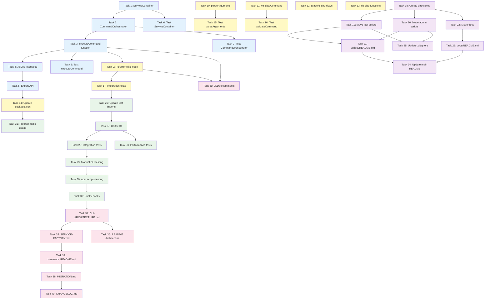

# Implementation Plan: CLI Architecture Refactor

## Overview

Este documento contém o plano de implementação para a refatoração completa da arquitetura do repositório docs-jana. A implementação segue uma estratégia de 5 fases para minimizar riscos e garantir que cada etapa seja validada antes de prosseguir.

**Estratégia de Migração:**
- **Phase 1**: Criar camada de orquestração (index.js refactor) - Sem breaking changes
- **Phase 2**: Refatorar CLI (cli.js simplification) - Migração gradual
- **Phase 3**: Reorganização de arquivos (scripts e docs) - Baixo risco
- **Phase 4**: Testes e validação - Garantia de qualidade
- **Phase 5**: Documentação - Comunicação da nova arquitetura

---

## Phase 1: Criar Camada de Orquestração

### ✅ Task 1: Criar ServiceContainer com Service Locator Pattern (COMPLETED)

**Objetivo**: Implementar classe ServiceContainer para gerenciar instâncias de services e factories com lazy instantiation.

**Descrição**:
- Criar `ServiceContainer` class em index.js
- Implementar método `register(name, factory)` para registrar service factories
- Implementar método `resolve(name, config)` com lazy instantiation e caching
- Implementar método `clear()` para cleanup de recursos
- Adicionar validação para service não encontrado

**Acceptance Criteria**:
- ServiceContainer.register() aceita nome e função factory
- ServiceContainer.resolve() retorna instância cacheada se disponível
- ServiceContainer.resolve() instancia novo service apenas na primeira chamada
- ServiceContainer.resolve() lança erro se service não registrado
- ServiceContainer.clear() remove todas instâncias cacheadas

**Requirements**: 3.1, 3.2, 3.5, 3.6

**Estimated Effort**: 2-3 horas

**Risk Level**: 🟢 Low (nova implementação, não afeta código existente)

**Files to Create/Modify**:
- `C:\Users\Windows Home\Documents\GitHub\docs-jana\index.js` (create ServiceContainer class)

---

### ✅ Task 2: Criar CommandOrchestrator para coordenar execução de comandos (COMPLETED)

**Objetivo**: Implementar classe CommandOrchestrator que usa ServiceContainer para orquestrar lifecycle de execução de comandos.

**Descrição**:
- Criar `CommandOrchestrator` class em index.js
- Implementar método `initialize(context)` para setup (logger, service registration)
- Implementar método `run(context)` para executar comando
- Implementar método `loadConfiguration(context)` usando ConfigManager
- Implementar método `resolveCommandHandler(commandName)` para mapear comandos
- Implementar método `cleanup()` para liberar recursos

**Acceptance Criteria**:
- CommandOrchestrator.initialize() cria logger baseado em context.flags.verbose
- CommandOrchestrator.initialize() registra service factories no ServiceContainer
- CommandOrchestrator.run() carrega configuração usando ConfigManager
- CommandOrchestrator.run() resolve command handler correto baseado em commandName
- CommandOrchestrator.run() executa command.execute() e retorna resultado
- CommandOrchestrator.cleanup() chama ServiceContainer.clear()

**Requirements**: 3.1, 3.2, 3.3, 3.4, 3.6, 3.7, 3.8, 3.9

**Estimated Effort**: 4-5 horas

**Risk Level**: 🟡 Medium (integração com services existentes)

**Files to Create/Modify**:
- `C:\Users\Windows Home\Documents\GitHub\docs-jana\index.js` (create CommandOrchestrator class)

**Dependencies**: Task 1 (ServiceContainer must exist)

---

### ✅ Task 3: Implementar função executeCommand() como API pública (COMPLETED)

**Objetivo**: Criar função principal `executeCommand(context)` que coordena initialize → run → cleanup e retorna CommandResult estruturado.

**Descrição**:
- Implementar função `executeCommand(context)` em index.js
- Criar instância de ServiceContainer
- Criar instância de CommandOrchestrator
- Implementar try/catch para error handling
- Retornar objeto CommandResult com formato `{ success, message, data?, error? }`
- Garantir cleanup mesmo em caso de erro

**Acceptance Criteria**:
- executeCommand() aceita CommandContext object como parâmetro
- executeCommand() retorna Promise<CommandResult>
- Em caso de sucesso, retorna `{ success: true, message, data }`
- Em caso de erro, retorna `{ success: false, message, error: { code, message, stack? } }`
- executeCommand() sempre chama orchestrator.cleanup() (finally block)
- Stack trace apenas incluído se `process.env.DEBUG` estiver ativo

**Requirements**: 3.1, 3.6, 3.8

**Estimated Effort**: 2-3 horas

**Risk Level**: 🟢 Low (wrapper function)

**Files to Create/Modify**:
- `C:\Users\Windows Home\Documents\GitHub\docs-jana\index.js` (create executeCommand function)

**Dependencies**: Task 2 (CommandOrchestrator must exist)

---

### ✅ Task 4: Definir interfaces TypeScript (JSDoc) para CommandContext e CommandResult (COMPLETED)

**Objetivo**: Documentar interfaces de dados usando JSDoc para autocomplete e validação de tipos.

**Descrição**:
- Adicionar JSDoc typedef para `CommandContext` interface
- Adicionar JSDoc typedef para `CommandFlags` interface
- Adicionar JSDoc typedef para `CommandResult` interface
- Adicionar JSDoc typedef para `CommandError` interface
- Adicionar JSDoc comments nas funções executeCommand, CommandOrchestrator methods, ServiceContainer methods

**Acceptance Criteria**:
- JSDoc typedef para CommandContext inclui: command, args, flags, env
- JSDoc typedef para CommandFlags inclui todas flags globais e específicas
- JSDoc typedef para CommandResult inclui: success, message, data?, error?
- JSDoc typedef para CommandError inclui: code, message, stack?
- Todas funções públicas possuem JSDoc com @param e @returns

**Requirements**: 9.4

**Estimated Effort**: 1-2 horas

**Risk Level**: 🟢 Low (documentação)

**Files to Create/Modify**:
- `C:\Users\Windows Home\Documents\GitHub\docs-jana\index.js` (add JSDoc typedefs)

**Dependencies**: Task 3 (executeCommand must exist)

---

### ✅ Task 5: Exportar API pública de index.js (COMPLETED)

**Objetivo**: Exportar executeCommand, CommandOrchestrator, ServiceContainer para uso programático e testes.

**Descrição**:
- Adicionar `module.exports` em index.js
- Exportar `executeCommand` como função principal
- Exportar `CommandOrchestrator` class para testes
- Exportar `ServiceContainer` class para testes
- Adicionar JSDoc @module documentation

**Acceptance Criteria**:
- `require('docs-jana')` retorna objeto com { executeCommand, CommandOrchestrator, ServiceContainer }
- executeCommand é função que aceita CommandContext
- CommandOrchestrator e ServiceContainer são classes instanciáveis
- Module exports possui JSDoc documentation

**Requirements**: 6.4, 9.4

**Estimated Effort**: 1 hora

**Risk Level**: 🟢 Low (export statement)

**Files to Create/Modify**:
- `C:\Users\Windows Home\Documents\GitHub\docs-jana\index.js` (add module.exports)

**Dependencies**: Task 3 (all classes must exist)

---

### Task 6: Escrever testes unitários para ServiceContainer

**Objetivo**: Criar suite de testes para validar comportamento de ServiceContainer (register, resolve, caching, clear).

**Descrição**:
- Criar arquivo `__tests__/unit/orchestration/service-container.test.js`
- Testar register() com factory function
- Testar resolve() com lazy instantiation
- Testar resolve() com caching (segunda chamada retorna mesma instância)
- Testar resolve() lança erro para service desconhecido
- Testar clear() remove todas instâncias

**Acceptance Criteria**:
- Teste valida register() armazena factory
- Teste valida resolve() instancia service apenas na primeira chamada
- Teste valida resolve() retorna instância cacheada em chamadas subsequentes
- Teste valida resolve() lança Error com mensagem 'Service not found'
- Teste valida clear() limpa cache de services
- Coverage de ServiceContainer ≥ 95%

**Requirements**: 8.3

**Estimated Effort**: 2-3 horas

**Risk Level**: 🟢 Low (unit tests)

**Files to Create/Modify**:
- `C:\Users\Windows Home\Documents\GitHub\docs-jana\__tests__\unit\orchestration\service-container.test.js` (create)

**Dependencies**: Task 1 (ServiceContainer implementation)

---

### Task 7: Escrever testes unitários para CommandOrchestrator

**Objetivo**: Criar suite de testes para validar comportamento de CommandOrchestrator (initialize, run, loadConfiguration, cleanup).

**Descrição**:
- Criar arquivo `__tests__/unit/orchestration/command-orchestrator.test.js`
- Mockar ServiceContainer e command handlers
- Testar initialize() cria logger e registra services
- Testar run() executa comando e retorna resultado
- Testar loadConfiguration() carrega config de múltiplas fontes
- Testar resolveCommandHandler() retorna handler correto
- Testar cleanup() chama ServiceContainer.clear()
- Testar error handling quando command handler não encontrado

**Acceptance Criteria**:
- Teste valida initialize() cria logger com logLevel correto baseado em verbose flag
- Teste valida initialize() registra 'n8n' e 'outline' services
- Teste valida run() executa command handler e retorna resultado
- Teste valida loadConfiguration() usa ConfigManager corretamente
- Teste valida resolveCommandHandler() lança erro para comando desconhecido
- Teste valida cleanup() limpa ServiceContainer
- Coverage de CommandOrchestrator ≥ 95%

**Requirements**: 8.3

**Estimated Effort**: 3-4 horas

**Risk Level**: 🟡 Medium (testes com mocks complexos)

**Files to Create/Modify**:
- `C:\Users\Windows Home\Documents\GitHub\docs-jana\__tests__\unit\orchestration\command-orchestrator.test.js` (create)

**Dependencies**: Task 2 (CommandOrchestrator implementation)

---

### Task 8: Escrever testes unitários para executeCommand()

**Objetivo**: Criar suite de testes para validar comportamento de executeCommand() (success case, error case, cleanup).

**Descrição**:
- Criar arquivo `__tests__/unit/orchestration/execute-command.test.js`
- Mockar CommandOrchestrator
- Testar executeCommand() retorna success result quando comando executa com sucesso
- Testar executeCommand() retorna error result quando comando falha
- Testar executeCommand() chama cleanup() mesmo quando erro ocorre
- Testar formato de CommandResult (success, message, data, error)

**Acceptance Criteria**:
- Teste valida executeCommand() retorna `{ success: true, message, data }` em caso de sucesso
- Teste valida executeCommand() retorna `{ success: false, message, error }` em caso de erro
- Teste valida cleanup() é chamado tanto em success quanto em error
- Teste valida error.stack apenas incluído quando DEBUG=true
- Coverage de executeCommand ≥ 95%

**Requirements**: 8.3

**Estimated Effort**: 2-3 horas

**Risk Level**: 🟢 Low (unit tests)

**Files to Create/Modify**:
- `C:\Users\Windows Home\Documents\GitHub\docs-jana\__tests__\unit\orchestration\execute-command.test.js` (create)

**Dependencies**: Task 3 (executeCommand implementation)

---

## Phase 2: Refatorar CLI

### ✅ Task 9: Refatorar cli.js para usar index.executeCommand() (COMPLETED)

**Objetivo**: Modificar cli.js main() function para invocar index.executeCommand() ao invés de executar comandos diretamente.

**Descrição**:
- Refatorar função `main()` em cli.js
- Remover lógica de execução direta de comandos
- Adicionar chamada para `require('./index').executeCommand(context)`
- Manter funções de help, version, error display
- Adicionar handling de CommandResult (success/error)

**Acceptance Criteria**:
- main() chama index.executeCommand() para comandos normais (não help/version)
- main() passa CommandContext estruturado para executeCommand()
- main() exibe mensagem de sucesso se result.success === true
- main() exibe mensagem de erro se result.success === false
- main() chama process.exit(0) em sucesso, process.exit(1) em erro
- Funções displayHelp, displayVersion permanecem em cli.js

**Requirements**: 1.1, 2.1, 2.2, 2.3, 2.4

**Estimated Effort**: 3-4 horas

**Risk Level**: 🟡 Medium (modifica entry point)

**Files to Create/Modify**:
- `C:\Users\Windows Home\Documents\GitHub\docs-jana\cli.js` (modify main function)

**Dependencies**: Task 3 (executeCommand must exist)

---

### ✅ Task 10: Implementar parseArguments() em cli.js (COMPLETED)

**Objetivo**: Criar função parseArguments() que converte process.argv em CommandContext estruturado.

**Descrição**:
- Implementar função `parseArguments(argv)` em cli.js
- Parsear command name (primeiro argumento após node/cli.js)
- Parsear flags (--help, --version, --verbose, --config, --dry-run, etc.)
- Parsear remaining args como array
- Incluir process.env em context
- Retornar objeto CommandContext

**Acceptance Criteria**:
- parseArguments(['node', 'cli.js', 'n8n:download']) retorna context.command === 'n8n:download'
- parseArguments com '--verbose' flag retorna context.flags.verbose === true
- parseArguments com '--config file.json' retorna context.flags.config === 'file.json'
- parseArguments inclui process.env em context.env
- parseArguments retorna args array com argumentos restantes

**Requirements**: 1.1, 1.5, 2.5

**Estimated Effort**: 2-3 horas

**Risk Level**: 🟢 Low (parsing logic)

**Files to Create/Modify**:
- `C:\Users\Windows Home\Documents\GitHub\docs-jana\cli.js` (create parseArguments function)

**Dependencies**: None (standalone function)

---

### Task 11: Implementar validateCommand() e findCommand() em cli.js

**Objetivo**: Criar funções para validar e encontrar comandos no COMMANDS registry (incluindo aliases).

**Descrição**:
- Implementar função `validateCommand(commandName)` que verifica se comando existe
- Implementar função `findCommand(input)` que busca por nome canônico ou alias
- Usar COMMANDS object existente em cli.js (linhas 31-73)
- Retornar nome canônico do comando

**Acceptance Criteria**:
- validateCommand('n8n:download') retorna true
- validateCommand('unknown:command') retorna false
- findCommand('download:n8n') retorna 'n8n:download' (alias)
- findCommand('n8n:download') retorna 'n8n:download' (canonical)
- findCommand('invalid') retorna null ou undefined

**Requirements**: 1.3, 2.4, 2.7

**Estimated Effort**: 1-2 horas

**Risk Level**: 🟢 Low (validation logic)

**Files to Create/Modify**:
- `C:\Users\Windows Home\Documents\GitHub\docs-jana\cli.js` (create validation functions)

**Dependencies**: None (uses existing COMMANDS object)

---

### Task 12: Implementar graceful shutdown em cli.js

**Objetivo**: Adicionar handlers para SIGINT/SIGTERM que executam cleanup e exibem mensagem de shutdown.

**Descrição**:
- Implementar função `gracefulShutdown()` em cli.js
- Adicionar flag global `isShuttingDown` para evitar múltiplos shutdowns
- Registrar handlers para SIGINT e SIGTERM
- Exibir mensagem de shutdown para usuário
- Chamar process.exit(0) após cleanup

**Acceptance Criteria**:
- Ctrl+C (SIGINT) capturado e chama gracefulShutdown()
- SIGTERM capturado e chama gracefulShutdown()
- gracefulShutdown() exibe mensagem user-friendly
- gracefulShutdown() ignora sinais duplicados (isShuttingDown check)
- gracefulShutdown() chama process.exit(0) após 100ms

**Requirements**: 2.8, 7.8

**Estimated Effort**: 1-2 horas

**Risk Level**: 🟢 Low (signal handling)

**Files to Create/Modify**:
- `C:\Users\Windows Home\Documents\GitHub\docs-jana\cli.js` (add signal handlers)

**Dependencies**: None

---

### Task 13: Adicionar displaySuccess() e refatorar displayError() em cli.js

**Objetivo**: Criar função displaySuccess() e melhorar displayError() para exibir CommandResult de forma user-friendly.

**Descrição**:
- Implementar função `displaySuccess(message)` em cli.js
- Refatorar função `displayError(error)` para aceitar CommandError object
- Adicionar suporte para verbose mode (mostrar stack trace)
- Adicionar emojis e cores para melhor UX
- Manter consistência com estilo existente

**Acceptance Criteria**:
- displaySuccess() exibe mensagem com emoji ✅
- displayError() exibe mensagem com emoji ❌
- displayError() mostra stack trace apenas em verbose mode
- displayError() sugere `docs-jana help` para erros de comando desconhecido
- Funções usam console.log/console.error apropriadamente

**Requirements**: 2.4, 2.5, 7.7

**Estimated Effort**: 1-2 horas

**Risk Level**: 🟢 Low (display functions)

**Files to Create/Modify**:
- `C:\Users\Windows Home\Documents\GitHub\docs-jana\cli.js` (add/modify display functions)

**Dependencies**: None

---

### Task 14: Atualizar package.json entry points

**Objetivo**: Modificar package.json para definir index.js como main module e cli.js como bin entry point.

**Descrição**:
- Alterar `"main": "cli.js"` para `"main": "index.js"` em package.json
- Manter `"bin": { "docs-jana": "./cli.js" }`
- Verificar que npm scripts ainda funcionam
- Executar `pnpm install` para validar

**Acceptance Criteria**:
- package.json tem `"main": "index.js"`
- package.json mantém `"bin": { "docs-jana": "./cli.js" }`
- `require('docs-jana')` retorna exports de index.js
- `docs-jana` command ainda executa cli.js
- pnpm install completa sem erros

**Requirements**: 6.1, 6.2, 6.6

**Estimated Effort**: 30 minutos

**Risk Level**: 🟢 Low (config change)

**Files to Create/Modify**:
- `C:\Users\Windows Home\Documents\GitHub\docs-jana\package.json` (modify main field)

**Dependencies**: Task 5 (index.js must export API)

---

### Task 15: Escrever testes unitários para parseArguments()

**Objetivo**: Criar suite de testes para validar parsing de argumentos CLI.

**Descrição**:
- Criar arquivo `__tests__/unit/cli/parse-arguments.test.js`
- Testar parsing de command name
- Testar parsing de flags (--help, --verbose, --config, etc.)
- Testar parsing de args array
- Testar edge cases (sem argumentos, flags inválidas)

**Acceptance Criteria**:
- Teste valida parsing de command name
- Teste valida parsing de boolean flags (--verbose)
- Teste valida parsing de value flags (--config file.json)
- Teste valida args array contém argumentos restantes
- Teste valida context.env contém process.env
- Coverage de parseArguments ≥ 90%

**Requirements**: 8.2

**Estimated Effort**: 2-3 horas

**Risk Level**: 🟢 Low (unit tests)

**Files to Create/Modify**:
- `C:\Users\Windows Home\Documents\GitHub\docs-jana\__tests__\unit\cli\parse-arguments.test.js` (create)

**Dependencies**: Task 10 (parseArguments implementation)

---

### Task 16: Escrever testes unitários para validateCommand()

**Objetivo**: Criar suite de testes para validar funções de validação de comandos.

**Descrição**:
- Criar arquivo `__tests__/unit/cli/validate-command.test.js`
- Testar validateCommand() com comandos válidos
- Testar validateCommand() com comandos inválidos
- Testar findCommand() com nomes canônicos
- Testar findCommand() com aliases

**Acceptance Criteria**:
- Teste valida comandos conhecidos retornam true
- Teste valida comandos desconhecidos retornam false
- Teste valida findCommand() resolve aliases corretamente
- Teste valida findCommand() retorna null para input inválido
- Coverage de validateCommand/findCommand ≥ 90%

**Requirements**: 8.2

**Estimated Effort**: 1-2 horas

**Risk Level**: 🟢 Low (unit tests)

**Files to Create/Modify**:
- `C:\Users\Windows Home\Documents\GitHub\docs-jana\__tests__\unit\cli\validate-command.test.js` (create)

**Dependencies**: Task 11 (validateCommand implementation)

---

### Task 17: Escrever testes de integração CLI → Orchestration

**Objetivo**: Criar testes que validam integração entre cli.js e index.js.

**Descrição**:
- Criar arquivo `__tests__/integration/cli-orchestration.test.js`
- Mockar index.executeCommand()
- Testar cli.js invoca executeCommand() com CommandContext correto
- Testar cli.js exibe sucesso quando result.success === true
- Testar cli.js exibe erro quando result.success === false
- Testar cli.js não invoca executeCommand() para help/version

**Acceptance Criteria**:
- Teste valida main() passa CommandContext estruturado para executeCommand()
- Teste valida main() exibe success message quando result.success === true
- Teste valida main() exibe error message quando result.success === false
- Teste valida help command não chama executeCommand()
- Teste valida version command não chama executeCommand()
- Coverage de integração ≥ 85%

**Requirements**: 8.2, 8.3

**Estimated Effort**: 3-4 horas

**Risk Level**: 🟡 Medium (integration tests)

**Files to Create/Modify**:
- `C:\Users\Windows Home\Documents\GitHub\docs-jana\__tests__\integration\cli-orchestration.test.js` (create)

**Dependencies**: Task 9 (cli.js refactor)

---

## Phase 3: Reorganização de Arquivos

### ✅ Task 18: Criar estrutura de diretórios para scripts e docs (COMPLETED)

**Objetivo**: Criar diretórios /scripts e /docs com subdiretórios organizados.

**Descrição**:
- Criar diretório `/scripts/test/` para test scripts
- Criar diretório `/scripts/admin/` para administrative scripts
- Criar diretório `/docs/technical/` para documentos técnicos
- Criar diretório `/docs/architecture/` para documentação de arquitetura
- Verificar que parent directory existe antes de criar subdirectories

**Acceptance Criteria**:
- Diretório `C:\Users\Windows Home\Documents\GitHub\docs-jana\scripts\test` existe
- Diretório `C:\Users\Windows Home\Documents\GitHub\docs-jana\scripts\admin` existe
- Diretório `C:\Users\Windows Home\Documents\GitHub\docs-jana\docs\technical` existe
- Diretório `C:\Users\Windows Home\Documents\GitHub\docs-jana\docs\architecture` existe

**Requirements**: 4.1, 4.2, 5.1, 5.2

**Estimated Effort**: 15 minutos

**Risk Level**: 🟢 Low (directory creation)

**Files to Create/Modify**:
- Create directories (no files)

**Dependencies**: None

---

### ✅ Task 19: Mover test scripts para /scripts/test/ (COMPLETED)

**Objetivo**: Mover todos scripts de teste da raiz para /scripts/test/ e atualizar imports relativos.

**Descrição**:
- Mover `test-payload-cleaning.js` para `/scripts/test/`
- Mover `test-workflow-id-preservation.js` para `/scripts/test/`
- Mover `test-tag-operations.js` para `/scripts/test/`
- Atualizar imports relativos em cada script (ex: `require('../src/...')` → `require('../../src/...')`)
- Testar que scripts ainda executam corretamente

**Acceptance Criteria**:
- Scripts movidos para /scripts/test/
- Imports atualizados e scripts executam sem erros
- Raiz não contém mais test-*.js files
- Git history preservado (usar `git mv`)

**Requirements**: 4.1, 4.3, 4.7

**Estimated Effort**: 1 hora

**Risk Level**: 🟢 Low (file move with import updates)

**Files to Create/Modify**:
- Move test-payload-cleaning.js, test-workflow-id-preservation.js, test-tag-operations.js to /scripts/test/

**Dependencies**: Task 18 (directories must exist)

---

### ✅ Task 20: Mover admin scripts para /scripts/admin/ (COMPLETED)

**Objetivo**: Mover scripts administrativos da raiz para /scripts/admin/ e atualizar imports relativos.

**Descrição**:
- Mover `cleanup-duplicates.js` para `/scripts/admin/`
- Mover `delete-all-workflows.js` para `/scripts/admin/`
- Mover `unarchive-workflows.js` para `/scripts/admin/`
- Mover `unarchive-direct.js` para `/scripts/admin/`
- Atualizar imports relativos em cada script
- Testar que scripts ainda executam corretamente

**Acceptance Criteria**:
- Scripts movidos para /scripts/admin/
- Imports atualizados e scripts executam sem erros
- Raiz não contém mais scripts administrativos
- Git history preservado (usar `git mv`)

**Requirements**: 4.2, 4.3, 4.7

**Estimated Effort**: 1 hora

**Risk Level**: 🟢 Low (file move with import updates)

**Files to Create/Modify**:
- Move cleanup-duplicates.js, delete-all-workflows.js, unarchive-workflows.js, unarchive-direct.js to /scripts/admin/

**Dependencies**: Task 18 (directories must exist)

---

### ✅ Task 21: Criar /scripts/README.md documentando scripts (COMPLETED)

**Objetivo**: Criar README em /scripts/ explicando propósito e uso de cada script.

**Descrição**:
- Criar `/scripts/README.md`
- Documentar cada script em /scripts/test/ (propósito, como executar)
- Documentar cada script em /scripts/admin/ (propósito, como executar, warnings)
- Adicionar seção de troubleshooting
- Adicionar links para documentação relacionada

**Acceptance Criteria**:
- /scripts/README.md existe e contém descrição de todos scripts
- Cada script possui: nome, propósito, comando de execução, parâmetros
- Scripts administrativos incluem warnings sobre uso (ex: delete-all-workflows)
- README inclui seção "Prerequisites" e "Troubleshooting"

**Requirements**: 4.7

**Estimated Effort**: 1-2 horas

**Risk Level**: 🟢 Low (documentation)

**Files to Create/Modify**:
- `C:\Users\Windows Home\Documents\GitHub\docs-jana\scripts\README.md` (create)

**Dependencies**: Task 19, Task 20 (scripts must be moved)

---

### ✅ Task 22: Mover documentos técnicos para /docs/technical/ (COMPLETED)

**Objetivo**: Mover documentos técnicos da raiz para /docs/technical/ e atualizar links relativos.

**Descrição**:
- Mover `TAG_CODE_CHANGES.md` para `/docs/technical/`
- Mover `TAG_IMPLEMENTATION_SUMMARY.md` para `/docs/technical/`
- Mover `WORKFLOW-ID-PRESERVATION-REPORT.md` para `/docs/technical/`
- Mover `WORKFLOW-REFERENCES.md` para `/docs/technical/`
- Verificar links internos e atualizar se necessário
- Buscar referências a esses arquivos em README.md e atualizar

**Acceptance Criteria**:
- Documentos movidos para /docs/technical/
- Links relativos atualizados nos documentos
- README.md referencia novos caminhos (se aplicável)
- Raiz não contém mais documentos técnicos
- Git history preservado (usar `git mv`)

**Requirements**: 5.1, 5.3, 5.4

**Estimated Effort**: 1 hora

**Risk Level**: 🟢 Low (file move with link updates)

**Files to Create/Modify**:
- Move TAG_CODE_CHANGES.md, TAG_IMPLEMENTATION_SUMMARY.md, WORKFLOW-ID-PRESERVATION-REPORT.md, WORKFLOW-REFERENCES.md to /docs/technical/

**Dependencies**: Task 18 (directories must exist)

---

### ✅ Task 23: Criar /docs/README.md indexando documentação (COMPLETED)

**Objetivo**: Criar README em /docs/ com índice de toda documentação técnica e arquitetural.

**Descrição**:
- Criar `/docs/README.md`
- Adicionar seção "Technical Documentation" com links para /docs/technical/
- Adicionar seção "Architecture Documentation" (preparar para docs futuros)
- Adicionar breve descrição de cada documento
- Adicionar link de volta para README principal

**Acceptance Criteria**:
- /docs/README.md existe e contém índice de todos documentos
- Cada documento listado possui: nome, descrição breve, link
- README divide documentação em categorias (Technical, Architecture)
- README inclui link para README principal do projeto

**Requirements**: 5.7, 9.1

**Estimated Effort**: 1 hora

**Risk Level**: 🟢 Low (documentation)

**Files to Create/Modify**:
- `C:\Users\Windows Home\Documents\GitHub\docs-jana\docs\README.md` (create)

**Dependencies**: Task 22 (docs must be moved)

---

### ✅ Task 24: Atualizar README.md principal com links para nova estrutura (COMPLETED)

**Objetivo**: Atualizar README.md raiz para referenciar nova estrutura de /scripts e /docs.

**Descrição**:
- Atualizar seção "Scripts" em README.md (se existir) para apontar para /scripts/README.md
- Adicionar seção "Documentation" em README.md com link para /docs/README.md
- Atualizar quaisquer links quebrados para documentos movidos
- Manter estilo e tom do README existente

**Acceptance Criteria**:
- README.md inclui link para /scripts/README.md
- README.md inclui seção "Documentation" com link para /docs/README.md
- Todos links para documentos técnicos atualizados
- README mantém formatação e estilo consistentes

**Requirements**: 4.4, 5.6, 9.1

**Estimated Effort**: 30 minutos

**Risk Level**: 🟢 Low (documentation update)

**Files to Create/Modify**:
- `C:\Users\Windows Home\Documents\GitHub\docs-jana\README.md` (modify)

**Dependencies**: Task 21, Task 23 (README files must exist)

---

### ✅ Task 25: Verificar e atualizar .gitignore se necessário (COMPLETED)

**Objetivo**: Revisar .gitignore e adicionar entradas para novos diretórios se necessário.

**Descrição**:
- Revisar .gitignore atual
- Adicionar `/scripts/temp/` se scripts criarem arquivos temporários
- Adicionar `/scripts/*/node_modules` se scripts tiverem dependências próprias
- Verificar que /docs/ não está sendo ignorado
- Testar com `git status` para garantir arquivos corretos são tracked

**Acceptance Criteria**:
- .gitignore inclui /scripts/temp/ (se necessário)
- .gitignore não ignora /scripts ou /docs inadvertidamente
- `git status` mostra arquivos esperados como tracked

**Requirements**: 10.5

**Estimated Effort**: 15 minutos

**Risk Level**: 🟢 Low (config update)

**Files to Create/Modify**:
- `C:\Users\Windows Home\Documents\GitHub\docs-jana\.gitignore` (modify if needed)

**Dependencies**: Task 19, Task 20 (scripts must be moved)

---

## Phase 4: Testes e Validação

### ✅ Task 26: Atualizar imports em testes existentes se necessário (COMPLETED)

**Objetivo**: Revisar testes existentes em __tests__/ e atualizar imports se arquivos foram movidos ou refatorados.

**Descrição**:
- Executar `pnpm test` para identificar falhas de import
- Atualizar imports em testes que referenciam cli.js ou index.js
- Atualizar imports em testes que referenciam scripts movidos
- Verificar que todos mocks ainda funcionam corretamente

**Acceptance Criteria**:
- Todos testes existentes passam após refatoração
- Imports atualizados para refletir nova estrutura
- Mocks de services ainda funcionam corretamente
- Zero breaking changes em test utilities

**Requirements**: 8.1, 8.4

**Estimated Effort**: 2-3 horas

**Risk Level**: 🟡 Medium (pode descobrir issues em testes)

**Files to Create/Modify**:
- Various test files in __tests__/ (modify imports)

**Dependencies**: All previous tasks (full refactor complete)

---

### ✅ Task 27: Executar suite completa de testes unitários (COMPLETED)

**Objetivo**: Executar todos testes unitários e garantir 100% passam.

**Descrição**:
- Executar `pnpm test:unit` (ou equivalente)
- Revisar output para identificar falhas
- Fixar quaisquer testes falhando
- Verificar coverage ≥ 90% em camadas críticas
- Gerar relatório de coverage

**Acceptance Criteria**:
- `pnpm test:unit` completa com 100% dos testes passando
- Coverage de cli.js ≥ 90%
- Coverage de index.js (orchestration) ≥ 95%
- Coverage de ServiceContainer ≥ 95%
- Coverage de CommandOrchestrator ≥ 95%

**Requirements**: 8.1, 8.6

**Estimated Effort**: 1-2 horas (assumindo Task 26 completa)

**Risk Level**: 🟡 Medium (pode descobrir bugs)

**Files to Create/Modify**:
- No files (test execution and fixes)

**Dependencies**: Task 26 (test imports updated)

---

### ✅ Task 28: Executar testes de integração (COMPLETED)

**Objetivo**: Executar testes de integração para validar cli.js → index.js → services.

**Descrição**:
- Executar `pnpm test:integration` (ou equivalente)
- Revisar output para identificar falhas
- Fixar quaisquer testes falhando
- Validar que comandos reais funcionam end-to-end

**Acceptance Criteria**:
- `pnpm test:integration` completa com 100% dos testes passando
- Integração cli.js → index.js validada
- Integração index.js → services validada
- Mocks de services funcionam corretamente

**Requirements**: 8.1, 8.6

**Estimated Effort**: 1-2 horas

**Risk Level**: 🟡 Medium (pode descobrir integration issues)

**Files to Create/Modify**:
- No files (test execution and fixes)

**Dependencies**: Task 27 (unit tests passing)

---

### ✅ Task 29: Testar todos comandos CLI manualmente (COMPLETED)

**Objetivo**: Executar cada comando CLI manualmente para validar funcionalidade end-to-end.

**Descrição**:
- Testar `docs-jana help` (exibe help message)
- Testar `docs-jana version` (exibe version info)
- Testar `docs-jana n8n:download --help` (exibe command help)
- Testar `docs-jana n8n:upload --help` (exibe command help)
- Testar `docs-jana outline:download --help` (exibe command help)
- Testar comando inválido (exibe erro + suggestion)
- Testar cada comando com --dry-run (se suportado)
- Testar Ctrl+C durante execução (graceful shutdown)

**Acceptance Criteria**:
- `docs-jana help` exibe lista completa de comandos
- `docs-jana version` exibe version, platform, Node.js version
- Cada comando com --help exibe usage correto
- Comando inválido exibe erro claro + sugere `docs-jana help`
- --dry-run funciona para comandos que suportam
- Ctrl+C executa graceful shutdown

**Requirements**: 7.1, 7.2, 7.3, 7.4, 7.5

**Estimated Effort**: 1-2 horas

**Risk Level**: 🟢 Low (manual validation)

**Files to Create/Modify**:
- No files (manual testing)

**Dependencies**: Task 28 (integration tests passing)

---

### ✅ Task 30: Testar npm scripts (pnpm commands) (COMPLETED)

**Objetivo**: Validar que todos npm scripts em package.json ainda funcionam corretamente.

**Descrição**:
- Testar `pnpm n8n:download` (se definido em package.json)
- Testar `pnpm outline:download` (se definido)
- Testar `pnpm test` (suite completa)
- Testar `pnpm lint` (linting)
- Verificar que scripts invocam cli.js corretamente

**Acceptance Criteria**:
- Todos npm scripts executam sem erros
- Scripts invocam cli.js como entry point
- `pnpm test` passa todos testes
- `pnpm lint` passa sem erros

**Requirements**: 6.3, 7.5, 8.7

**Estimated Effort**: 30 minutos

**Risk Level**: 🟢 Low (validation)

**Files to Create/Modify**:
- No files (npm script testing)

**Dependencies**: Task 29 (CLI commands working)

---

### ✅ Task 31: Testar uso programático de index.js (COMPLETED)

**Objetivo**: Validar que index.js pode ser usado programaticamente (require('docs-jana')).

**Descrição**:
- Criar script de teste temporário que importa docs-jana
- Testar `require('docs-jana').executeCommand(context)`
- Verificar que executeCommand retorna CommandResult
- Testar success case e error case
- Verificar que exports { executeCommand, CommandOrchestrator, ServiceContainer }

**Acceptance Criteria**:
- `require('docs-jana')` retorna objeto com exports esperados
- executeCommand() funciona quando invocado programaticamente
- CommandResult possui formato correto
- Classes CommandOrchestrator e ServiceContainer são instanciáveis

**Requirements**: 6.4, 7.1

**Estimated Effort**: 1 hora

**Risk Level**: 🟢 Low (API testing)

**Files to Create/Modify**:
- Temporary test script (can be deleted after)

**Dependencies**: Task 14 (package.json main updated)

---

### ✅ Task 32: Verificar compatibilidade com Husky hooks (COMPLETED)

**Objetivo**: Validar que refatoração não quebra pre-commit hooks do Husky.

**Descrição**:
- Fazer mudança trivial em arquivo (ex: adicionar comentário)
- Executar `git add .` e `git commit -m "test"`
- Verificar que Husky pre-commit hook executa
- Verificar que lint-staged funciona com arquivos refatorados
- Verificar que commit completa com sucesso

**Acceptance Criteria**:
- Husky pre-commit hook executa
- lint-staged processa arquivos staged
- Linting passa sem erros
- Commit completa com sucesso
- Git hooks não quebrados pela refatoração

**Requirements**: 10.1

**Estimated Effort**: 15 minutos

**Risk Level**: 🟢 Low (validation)

**Files to Create/Modify**:
- No files (git hook testing)

**Dependencies**: Task 30 (all tests passing)

---

### ✅ Task 33: Executar testes de performance (overhead < 50ms) (COMPLETED)

**Objetivo**: Validar que separação cli.js → index.js adiciona ≤ 50ms de overhead.

**Descrição**:
- Criar test de performance `__tests__/performance/orchestration-overhead.test.js`
- Mockar command handler para retornar instantaneamente
- Medir tempo de execução de executeCommand()
- Validar que overhead total < 50ms
- Executar múltiplas iterações para média confiável

**Acceptance Criteria**:
- Test de performance criado
- Overhead medido ≤ 50ms (average de 10 execuções)
- Test passa consistentemente
- Test documentado para execução futura

**Requirements**: Performance NFR (≤ 50ms overhead)

**Estimated Effort**: 1-2 horas

**Risk Level**: 🟢 Low (performance test)

**Files to Create/Modify**:
- `C:\Users\Windows Home\Documents\GitHub\docs-jana\__tests__\performance\orchestration-overhead.test.js` (create)

**Dependencies**: Task 27 (orchestration layer working)

---

## Phase 5: Documentação

### Task 34: Criar /docs/architecture/CLI-ARCHITECTURE.md

**Objetivo**: Documentar nova arquitetura cli.js → index.js com diagramas e explicações.

**Descrição**:
- Criar `/docs/architecture/CLI-ARCHITECTURE.md`
- Documentar separação de responsabilidades (CLI Layer vs Orchestration Layer)
- Incluir diagramas de arquitetura (copiar de design.md)
- Explicar fluxo de execução: user input → cli.js → index.js → services
- Documentar CommandContext e CommandResult interfaces
- Adicionar exemplos de uso

**Acceptance Criteria**:
- CLI-ARCHITECTURE.md existe e contém documentação completa
- Documento inclui diagramas de arquitetura (Mermaid)
- Documento explica separação cli.js vs index.js
- Documento inclui exemplos de código
- Documento inclui links para arquivos relevantes

**Requirements**: 9.1, 9.2, 9.3

**Estimated Effort**: 2-3 horas

**Risk Level**: 🟢 Low (documentation)

**Files to Create/Modify**:
- `C:\Users\Windows Home\Documents\GitHub\docs-jana\docs\architecture\CLI-ARCHITECTURE.md` (create)

**Dependencies**: All previous tasks (architecture finalized)

---

### Task 35: Criar /docs/architecture/SERVICE-FACTORY.md

**Objetivo**: Documentar uso de ServiceFactory e ServiceContainer com exemplos.

**Descrição**:
- Criar `/docs/architecture/SERVICE-FACTORY.md`
- Documentar Service Locator pattern
- Explicar ServiceContainer (register, resolve, clear)
- Documentar ServiceFactory integration
- Adicionar exemplos de como adicionar novos services
- Documentar dependency injection pattern usado

**Acceptance Criteria**:
- SERVICE-FACTORY.md existe e contém documentação completa
- Documento explica Service Locator pattern
- Documento inclui exemplos de código para ServiceContainer
- Documento explica como adicionar novos services
- Documento inclui best practices

**Requirements**: 9.3, 9.5

**Estimated Effort**: 2-3 horas

**Risk Level**: 🟢 Low (documentation)

**Files to Create/Modify**:
- `C:\Users\Windows Home\Documents\GitHub\docs-jana\docs\architecture\SERVICE-FACTORY.md` (create)

**Dependencies**: Task 34 (architecture finalized)

---

### Task 36: Atualizar README.md com seção Architecture

**Objetivo**: Adicionar seção "Architecture" em README.md explicando nova estrutura.

**Descrição**:
- Adicionar seção "Architecture" em README.md
- Explicar separação CLI Layer vs Orchestration Layer
- Incluir diagrama simplificado (ou link para CLI-ARCHITECTURE.md)
- Documentar entry points (cli.js vs index.js)
- Adicionar link para documentação completa em /docs/architecture/

**Acceptance Criteria**:
- README.md inclui seção "Architecture"
- Seção explica separação de responsabilidades
- Seção inclui link para /docs/architecture/CLI-ARCHITECTURE.md
- Seção explica entry points (bin vs main)
- Seção mantém estilo e tom do README existente

**Requirements**: 9.1, 9.2

**Estimated Effort**: 1 hora

**Risk Level**: 🟢 Low (documentation)

**Files to Create/Modify**:
- `C:\Users\Windows Home\Documents\GitHub\docs-jana\README.md` (modify - add Architecture section)

**Dependencies**: Task 34 (CLI-ARCHITECTURE.md exists)

---

### Task 37: Atualizar /src/commands/README.md (se existir)

**Objetivo**: Atualizar documentação de comandos para refletir nova arquitetura.

**Descrição**:
- Verificar se `/src/commands/README.md` existe
- Se existir, atualizar para explicar como comandos são invocados via orchestration layer
- Documentar CommandContext que comandos recebem
- Adicionar exemplos de como criar novos comandos
- Se não existir, considerar criar (opcional)

**Acceptance Criteria**:
- Se README existe, está atualizado com nova arquitetura
- Documento explica integração com CommandOrchestrator
- Documento inclui exemplo de command handler
- Documento referencia SERVICE-FACTORY.md para DI patterns

**Requirements**: 9.3

**Estimated Effort**: 1-2 horas

**Risk Level**: 🟢 Low (documentation)

**Files to Create/Modify**:
- `C:\Users\Windows Home\Documents\GitHub\docs-jana\src\commands\README.md` (modify or create)

**Dependencies**: Task 35 (SERVICE-FACTORY.md exists)

---

### Task 38: Criar MIGRATION.md se houver breaking changes

**Objetivo**: Documentar breaking changes (se houver) e guia de migração para usuários externos.

**Descrição**:
- Revisar refatoração para identificar breaking changes
- Se houver breaking changes, criar `/MIGRATION.md`
- Documentar mudanças em API pública
- Fornecer exemplos de before/after
- Adicionar guia passo-a-passo para migração
- Se não houver breaking changes, documentar isso em CHANGELOG.md

**Acceptance Criteria**:
- Se breaking changes existem, MIGRATION.md criado e completo
- Documento lista todos breaking changes
- Documento fornece guia de migração
- Documento inclui exemplos before/after
- Se não há breaking changes, isso está documentado em CHANGELOG

**Requirements**: 9.6, 7.1

**Estimated Effort**: 1-2 horas (ou 30 min se não houver breaking changes)

**Risk Level**: 🟢 Low (documentation)

**Files to Create/Modify**:
- `C:\Users\Windows Home\Documents\GitHub\docs-jana\MIGRATION.md` (create if needed)
- `C:\Users\Windows Home\Documents\GitHub\docs-jana\CHANGELOG.md` (update)

**Dependencies**: All previous tasks (refactor complete)

---

### Task 39: Atualizar JSDoc comments em código refatorado

**Objetivo**: Revisar e melhorar JSDoc comments em cli.js e index.js.

**Descrição**:
- Adicionar JSDoc comments completos em todas funções públicas de cli.js
- Adicionar JSDoc comments completos em todas funções públicas de index.js
- Documentar parâmetros (@param) e retornos (@returns)
- Adicionar exemplos (@example) para funções principais
- Adicionar links (@see) para documentação relacionada

**Acceptance Criteria**:
- Todas funções públicas possuem JSDoc comments
- JSDoc inclui @param, @returns, @description
- Funções principais incluem @example
- JSDoc references documentação de arquitetura onde relevante
- JSDoc está consistente com estilo do projeto

**Requirements**: 9.4

**Estimated Effort**: 2-3 horas

**Risk Level**: 🟢 Low (documentation)

**Files to Create/Modify**:
- `C:\Users\Windows Home\Documents\GitHub\docs-jana\cli.js` (add/improve JSDoc)
- `C:\Users\Windows Home\Documents\GitHub\docs-jana\index.js` (add/improve JSDoc)

**Dependencies**: Task 9 (cli.js refactored), Task 3 (index.js complete)

---

### Task 40: Criar CHANGELOG.md entry para refatoração

**Objetivo**: Documentar refatoração em CHANGELOG.md com versão e data.

**Descrição**:
- Adicionar entry em CHANGELOG.md para esta refatoração
- Documentar versão (seguir semver)
- Listar todas mudanças sob categorias (Added, Changed, Fixed)
- Adicionar link para documentação de arquitetura
- Seguir formato Keep a Changelog

**Acceptance Criteria**:
- CHANGELOG.md atualizado com entry de refatoração
- Entry inclui versão e data
- Mudanças organizadas em categorias
- Entry menciona zero breaking changes (se aplicável)
- Entry inclui link para CLI-ARCHITECTURE.md

**Requirements**: 9.6

**Estimated Effort**: 30 minutos

**Risk Level**: 🟢 Low (documentation)

**Files to Create/Modify**:
- `C:\Users\Windows Home\Documents\GitHub\docs-jana\CHANGELOG.md` (add entry)

**Dependencies**: Task 38 (migration doc complete)

---

## Tasks Dependency Diagram



**Legenda:**
- 🔵 **Azul** (Phase 1): Orchestration Layer - Criar nova camada sem breaking changes
- 🟡 **Amarelo** (Phase 2): CLI Refactor - Integrar cli.js com orchestration layer
- 🟣 **Roxo** (Phase 3): File Reorganization - Mover scripts e docs para estrutura organizada
- 🟢 **Verde** (Phase 4): Testing & Validation - Garantir qualidade e zero regressões
- 🌸 **Rosa** (Phase 5): Documentation - Comunicar arquitetura e mudanças

---

## Summary of Effort Estimates

| Phase | Tasks | Total Effort | Risk Level |
|-------|-------|--------------|------------|
| Phase 1: Orchestration Layer | 8 tasks | 16-22 horas | 🟢 Low-Medium |
| Phase 2: CLI Refactor | 9 tasks | 17-23 horas | 🟡 Medium |
| Phase 3: File Reorganization | 8 tasks | 5-7 horas | 🟢 Low |
| Phase 4: Testing & Validation | 8 tasks | 7-11 horas | 🟡 Medium |
| Phase 5: Documentation | 7 tasks | 10-15 horas | 🟢 Low |
| **TOTAL** | **40 tasks** | **55-78 horas** | **Mixed** |

---

## Execution Strategy

### Parallel Execution Opportunities

**Phase 1 - Pode executar em paralelo:**
- Task 6, 7, 8 (testes) podem ser desenvolvidos por pessoa diferente enquanto Task 4, 5 são completadas

**Phase 2 - Pode executar em paralelo:**
- Task 10, 11, 12, 13 são independentes e podem ser feitas em paralelo
- Task 15, 16 (testes) podem ser desenvolvidos após Task 10, 11

**Phase 3 - Pode executar em paralelo:**
- Task 19, 20, 22 (mover arquivos) são independentes
- Task 21, 23 (README files) podem ser feitos após moves

**Phase 4 - Execução sequencial recomendada:**
- Cada task depende do sucesso da anterior

**Phase 5 - Pode executar em paralelo:**
- Task 34, 35, 37, 39 são independentes
- Task 36, 38, 40 dependem de tasks anteriores

### Critical Path

O caminho crítico (longest dependency chain) é:
```
T1 → T2 → T3 → T9 → T17 → T26 → T27 → T28 → T29 → T30 → T32 → T34 → T38 → T40
```

**Duração estimada do critical path:** ~35-45 horas

---

## Risk Mitigation

### High-Risk Tasks

1. **Task 9 (Refactor cli.js main)** - 🟡 Medium Risk
   - **Mitigation**: Criar backup de cli.js antes de modificar; testes manuais extensivos

2. **Task 17 (Integration tests)** - 🟡 Medium Risk
   - **Mitigation**: Mockar dependencies cuidadosamente; validar com comandos reais

3. **Task 26 (Update test imports)** - 🟡 Medium Risk
   - **Mitigation**: Executar testes frequentemente durante updates; rollback se necessário

### Rollback Plan

Se problemas críticos forem descobertos em qualquer fase:

1. **Immediate Rollback**: `git revert <commit-sha>` para reverter mudanças
2. **Partial Rollback**: Reverter apenas tasks específicas que causaram problema
3. **Fix Forward**: Preferível se issue é menor - criar hotfix branch e resolver

---

## Definition of Done

Uma task está completa quando:

- ✅ Código implementado seguindo requirements
- ✅ Testes unitários escritos e passando (se aplicável)
- ✅ JSDoc comments adicionados
- ✅ Linting passa sem erros
- ✅ Testes existentes ainda passam
- ✅ Documentação atualizada (se aplicável)
- ✅ Code review aprovado (se workflow incluir)
- ✅ Acceptance criteria validados

---

## Post-Implementation

Após completar todas as 40 tasks:

1. **Merge para branch principal**
   - Criar PR com descrição completa
   - Incluir link para CLI-ARCHITECTURE.md
   - Aguardar code review e aprovação

2. **Release nova versão**
   - Atualizar package.json version (seguir semver)
   - Tag release no Git
   - Publicar release notes

3. **Comunicar mudanças**
   - Atualizar documentação externa (se aplicável)
   - Notificar usuários sobre nova arquitetura
   - Compartilhar MIGRATION.md se breaking changes

---

**Este plano de implementação está pronto para execução. Cada task é autocontida, testável e possui acceptance criteria claros.**
