# Design Document - Melhorias de UX e Estética do Menu Interativo da CLI

## Overview

### Objetivo do Design

Este documento especifica o design técnico detalhado para implementar melhorias estéticas e de experiência do usuário (UX) no menu interativo de inicialização da CLI docs-jana. O objetivo é transformar a interface atual em uma experiência visual moderna, profissional e atraente, mantendo total compatibilidade com diferentes terminais e preservando todas as funcionalidades existentes.

### Escopo

**Incluído:**
- Modernização visual do header com bordas decorativas Unicode
- Sistema de bordas e decorações modernas com fallbacks em cascata
- Paletas de cores vibrantes e profissionais para cada tema
- Sistema de detecção de capabilities do terminal
- Componentes visuais reutilizáveis (BorderRenderer, LayoutManager, etc)
- Footer aprimorado com informações auxiliares
- Sistema de ícones e símbolos aprimorados
- Layout responsivo baseado em largura do terminal
- Feedback visual aprimorado para ações do usuário
- Documentação técnica completa com JSDoc

**Excluído:**
- Alteração de funcionalidades existentes (navegação, comandos, histórico)
- Modificação da arquitetura dos 8 componentes principais
- Alteração de dependências externas (chalk, cli-table3, inquirer, ora)
- Implementação de novos comandos ou features funcionais

### Contexto Arquitetural

A CLI docs-jana utiliza uma arquitetura modular com 8 componentes principais:

1. **MenuOrchestrator** - Coordenador central do menu
2. **UIRenderer** - Renderizador de interface (FOCO PRINCIPAL)
3. **StateManager** - Gerenciamento de estado
4. **ConfigManager** - Configurações do usuário
5. **CommandHistory** - Histórico de execução
6. **ThemeEngine** - Sistema de temas e cores (EXTENSÃO)
7. **AnimationEngine** - Animações e spinners (EXTENSÃO)
8. **KeyboardMapper** - Mapeamento de atalhos

As melhorias visuais serão implementadas principalmente através de:
- **Novos componentes visuais** em `src/ui/menu/visual/` (BorderRenderer, LayoutManager, TerminalDetector, IconMapper)
- **Extensão do UIRenderer** para usar os novos componentes visuais
- **Extensão do ThemeEngine** com paletas expandidas e modos visuais
- **Arquivo de constantes** `src/ui/menu/config/visual-constants.js` para design tokens

## Architecture Design

### System Architecture Diagram


### Data Flow Diagram


## Component Design

### Component 1: TerminalDetector

**Responsabilidades:**
- Detectar capabilities do terminal (Unicode, cores, emojis, largura)
- Fornecer informações sobre suporte a caracteres especiais
- Detectar mudanças em tempo de execução (redimensionamento)
- Prover API consistente para consulta de features

**Interfaces:**

```javascript
/**
 * TerminalDetector - Detects terminal capabilities
 */
class TerminalDetector {
  /**
   * Detects all terminal capabilities
   * @returns {TerminalCapabilities}
   */
  detect() {}

  /**
   * Checks if Unicode box-drawing is supported
   * @returns {boolean}
   */
  supportsUnicode() {}

  /**
   * Checks if emojis are supported
   * @returns {boolean}
   */
  supportsEmojis() {}

  /**
   * Gets color support level
   * @returns {number} 0=none, 1=basic (16), 2=256, 3=truecolor
   */
  getColorLevel() {}

  /**
   * Gets terminal dimensions
   * @returns {{width: number, height: number}}
   */
  getDimensions() {}

  /**
   * Sets up listener for terminal resize events
   * @param {Function} callback - Called when terminal resizes
   */
  onResize(callback) {}
}
```

**Dependências:**
- `process.stdout.getWindowSize()` - Detectar dimensões
- `chalk.level` (via ThemeEngine) - Detectar suporte a cores
- Testes de encoding para Unicode/Emoji

**Data Structures:**

```javascript
/**
 * @typedef {Object} TerminalCapabilities
 * @property {boolean} supportsUnicode - Terminal supports Unicode box-drawing
 * @property {boolean} supportsEmojis - Terminal supports emoji rendering
 * @property {number} colorLevel - 0=none, 1=basic, 2=256, 3=truecolor
 * @property {number} width - Terminal width in columns
 * @property {number} height - Terminal height in rows
 * @property {string} platform - OS platform (win32, linux, darwin)
 * @property {boolean} isCi - Running in CI environment
 * @property {string} terminalType - TERM environment variable value
 */
```

### Component 2: BorderRenderer

**Responsabilidades:**
- Renderizar bordas decorativas usando Unicode ou ASCII
- Aplicar fallbacks automáticos baseados em capabilities
- Fornecer diferentes estilos de bordas (single, double, bold, rounded)
- Calcular e ajustar largura de bordas dinamicamente

**Interfaces:**

```javascript
/**
 * BorderRenderer - Renders decorative borders with fallbacks
 */
class BorderRenderer {
  /**
   * @param {TerminalDetector} terminalDetector
   * @param {VisualConstants} visualConstants
   */
  constructor(terminalDetector, visualConstants) {}

  /**
   * Renders top border
   * @param {number} width - Border width in columns
   * @param {BorderStyle} style - Border style preset
   * @returns {string}
   */
  renderTopBorder(width, style = 'single') {}

  /**
   * Renders bottom border
   * @param {number} width - Border width in columns
   * @param {BorderStyle} style - Border style preset
   * @returns {string}
   */
  renderBottomBorder(width, style = 'single') {}

  /**
   * Renders separator line
   * @param {number} width - Separator width in columns
   * @param {BorderStyle} style - Border style preset
   * @returns {string}
   */
  renderSeparator(width, style = 'single') {}

  /**
   * Renders boxed text with borders
   * @param {string} text - Text to box
   * @param {BorderBoxOptions} options - Box styling options
   * @returns {string}
   */
  renderBox(text, options = {}) {}

  /**
   * Gets border character set for current terminal
   * @param {BorderStyle} style - Border style preset
   * @returns {BorderCharSet}
   */
  getCharSet(style) {}
}
```

**Dependências:**
- `TerminalDetector` - Para detectar suporte a Unicode
- `VisualConstants` - Para obter conjuntos de caracteres

**Data Structures:**

```javascript
/**
 * @typedef {'single' | 'double' | 'bold' | 'rounded' | 'ascii'} BorderStyle
 */

/**
 * @typedef {Object} BorderCharSet
 * @property {string} topLeft - Top-left corner
 * @property {string} topRight - Top-right corner
 * @property {string} bottomLeft - Bottom-left corner
 * @property {string} bottomRight - Bottom-right corner
 * @property {string} horizontal - Horizontal line
 * @property {string} vertical - Vertical line
 * @property {string} cross - Cross junction
 * @property {string} teeLeft - T junction pointing left
 * @property {string} teeRight - T junction pointing right
 * @property {string} teeTop - T junction pointing up
 * @property {string} teeBottom - T junction pointing down
 */

/**
 * @typedef {Object} BorderBoxOptions
 * @property {BorderStyle} style - Border style
 * @property {number} padding - Internal padding in spaces
 * @property {string} align - Text alignment: 'left' | 'center' | 'right'
 * @property {string} color - Border color (theme color name)
 */
```

### Component 3: LayoutManager

**Responsabilidades:**
- Gerenciar layout responsivo baseado em largura do terminal
- Calcular espaçamentos e margens adequados
- Determinar modo de layout (expandido, padrão, compacto)
- Truncar e quebrar texto quando necessário

**Interfaces:**

```javascript
/**
 * LayoutManager - Manages responsive layout calculations
 */
class LayoutManager {
  /**
   * @param {TerminalDetector} terminalDetector
   * @param {VisualConstants} visualConstants
   */
  constructor(terminalDetector, visualConstants) {}

  /**
   * Determines current layout mode based on terminal width
   * @returns {LayoutMode} 'expanded' | 'standard' | 'compact'
   */
  getLayoutMode() {}

  /**
   * Calculates content width considering margins
   * @returns {number} Available content width in columns
   */
  getContentWidth() {}

  /**
   * Calculates horizontal padding for elements
   * @param {LayoutMode} mode - Layout mode
   * @returns {number} Padding in spaces
   */
  getHorizontalPadding(mode) {}

  /**
   * Calculates vertical spacing between sections
   * @param {string} sectionType - 'header' | 'options' | 'footer'
   * @returns {number} Number of blank lines
   */
  getVerticalSpacing(sectionType) {}

  /**
   * Truncates text to fit within available width
   * @param {string} text - Text to truncate
   * @param {number} maxWidth - Maximum width
   * @param {string} ellipsis - Ellipsis string (default: '...')
   * @returns {string}
   */
  truncateText(text, maxWidth, ellipsis = '...') {}

  /**
   * Wraps text to fit within available width
   * @param {string} text - Text to wrap
   * @param {number} maxWidth - Maximum width
   * @returns {string[]} Array of wrapped lines
   */
  wrapText(text, maxWidth) {}

  /**
   * Centers text within available width
   * @param {string} text - Text to center
   * @param {number} width - Total width
   * @returns {string}
   */
  centerText(text, width) {}
}
```

**Dependências:**
- `TerminalDetector` - Para obter largura do terminal
- `VisualConstants` - Para obter valores de spacing

**Data Structures:**

```javascript
/**
 * @typedef {'expanded' | 'standard' | 'compact'} LayoutMode
 */

/**
 * @typedef {Object} LayoutConfig
 * @property {LayoutMode} mode - Current layout mode
 * @property {number} contentWidth - Available content width
 * @property {number} terminalWidth - Total terminal width
 * @property {number} horizontalPadding - Horizontal padding in spaces
 * @property {Object} verticalSpacing - Vertical spacing map
 * @property {number} verticalSpacing.beforeHeader - Lines before header
 * @property {number} verticalSpacing.afterHeader - Lines after header
 * @property {number} verticalSpacing.betweenOptions - Lines between options
 * @property {number} verticalSpacing.beforeFooter - Lines before footer
 */
```

### Component 4: IconMapper

**Responsabilidades:**
- Mapear tipos de ações para ícones apropriados
- Fornecer fallbacks para terminais sem suporte a Unicode/Emoji
- Permitir customização de ícones via configuração
- Manter consistência visual através de categorias

**Interfaces:**

```javascript
/**
 * IconMapper - Maps action types to appropriate icons with fallbacks
 */
class IconMapper {
  /**
   * @param {TerminalDetector} terminalDetector
   */
  constructor(terminalDetector) {}

  /**
   * Gets icon for a specific action type
   * @param {string} actionType - Type of action (download, upload, settings, etc)
   * @returns {string} Icon string (emoji, Unicode, or ASCII)
   */
  getIcon(actionType) {}

  /**
   * Gets status indicator icon
   * @param {StatusType} status - Status type
   * @returns {string} Status icon
   */
  getStatusIcon(status) {}

  /**
   * Gets selection indicator
   * @returns {string} Selection arrow/marker
   */
  getSelectionIndicator() {}

  /**
   * Gets category icon
   * @param {string} category - Category name
   * @returns {string} Category icon
   */
  getCategoryIcon(category) {}

  /**
   * Registers custom icon mapping
   * @param {string} actionType - Action type identifier
   * @param {IconSet} iconSet - Icon set with Unicode/ASCII fallbacks
   */
  registerIcon(actionType, iconSet) {}
}
```

**Dependências:**
- `TerminalDetector` - Para determinar nível de suporte a ícones

**Data Structures:**

```javascript
/**
 * @typedef {'success' | 'error' | 'warning' | 'info' | 'neutral'} StatusType
 */

/**
 * @typedef {Object} IconSet
 * @property {string} emoji - Emoji representation
 * @property {string} unicode - Unicode character representation
 * @property {string} ascii - ASCII fallback
 * @property {string} plain - Plain text fallback
 */

/**
 * Default icon mappings
 */
const DEFAULT_ICONS = {
  // Actions
  download: { emoji: '📥', unicode: '↓', ascii: 'v', plain: '[D]' },
  upload: { emoji: '📤', unicode: '↑', ascii: '^', plain: '[U]' },
  settings: { emoji: '⚙️', unicode: '⚙', ascii: '*', plain: '[*]' },
  docs: { emoji: '📋', unicode: '☰', ascii: '=', plain: '[=]' },
  stats: { emoji: '📊', unicode: '▪', ascii: '#', plain: '[#]' },
  refresh: { emoji: '🔄', unicode: '↻', ascii: '@', plain: '[@]' },
  help: { emoji: '❓', unicode: '?', ascii: '?', plain: '[?]' },
  exit: { emoji: '🚪', unicode: '×', ascii: 'x', plain: '[X]' },

  // Status
  success: { emoji: '✓', unicode: '✓', ascii: '+', plain: '[+]' },
  error: { emoji: '✗', unicode: '✗', ascii: '-', plain: '[-]' },
  warning: { emoji: '⚠', unicode: '!', ascii: '!', plain: '[!]' },
  info: { emoji: '•', unicode: '•', ascii: '*', plain: '[*]' },

  // Selection
  selected: { emoji: '▶', unicode: '▶', ascii: '>', plain: '>' },
  unselected: { emoji: ' ', unicode: ' ', ascii: ' ', plain: ' ' }
};
```

### Component 5: VisualConstants

**Responsabilidades:**
- Centralizar constantes de design (design tokens)
- Definir conjuntos de caracteres para bordas
- Definir paletas de cores expandidas
- Definir espaçamentos e dimensões padrão

**Interfaces:**

```javascript
/**
 * VisualConstants - Centralized design tokens and constants
 */
module.exports = {
  /**
   * Border character sets
   */
  BORDER_CHARS: {
    // Unicode box-drawing characters
    unicode: {
      single: { /* ... */ },
      double: { /* ... */ },
      bold: { /* ... */ },
      rounded: { /* ... */ }
    },
    // ASCII fallback characters
    ascii: {
      single: { /* ... */ },
      double: { /* ... */ }
    }
  },

  /**
   * Layout breakpoints and dimensions
   */
  LAYOUT: {
    breakpoints: {
      expanded: 100,    // width >= 100 columns
      standard: 80,     // width >= 80 columns
      compact: 60       // width >= 60 columns
    },
    minWidth: 60,       // Minimum supported terminal width
    margins: {
      expanded: 4,
      standard: 2,
      compact: 1
    },
    padding: {
      header: { vertical: 1, horizontal: 2 },
      options: { vertical: 0, horizontal: 2 },
      footer: { vertical: 1, horizontal: 2 }
    }
  },

  /**
   * Spacing constants
   */
  SPACING: {
    beforeHeader: 1,
    afterHeader: 1,
    betweenOptions: 0,
    beforeDescription: 1,
    afterDescription: 1,
    beforeFooter: 1
  },

  /**
   * Typography
   */
  TYPOGRAPHY: {
    maxDescriptionLength: {
      expanded: 120,
      standard: 80,
      compact: 60
    },
    ellipsis: '...',
    indentation: 2  // spaces for option indentation
  }
};
```

## Data Model

### Core Data Structures

#### VisualConfig

```javascript
/**
 * Visual configuration object stored in ConfigManager
 *
 * @typedef {Object} VisualConfig
 * @property {string} theme - Active theme name
 * @property {BorderStyle} borderStyle - Preferred border style
 * @property {boolean} useEmojis - Enable emoji icons
 * @property {boolean} animationsEnabled - Enable animations
 * @property {LayoutMode} layoutMode - Preferred layout mode (or 'auto')
 * @property {boolean} highContrastMode - Enable high contrast mode
 * @property {Object} customColors - User-defined color overrides
 */
```

#### ThemeDefinition (Extended)

```javascript
/**
 * Extended theme definition with visual enhancements
 *
 * @typedef {Object} ThemeDefinition
 * @property {string} name - Theme name
 * @property {ColorPalette} colors - Color palette
 * @property {BackgroundColors} backgrounds - Background colors
 * @property {BorderColors} borders - Border-specific colors
 * @property {ContrastRatios} contrastRatios - WCAG compliance ratios
 */

/**
 * @typedef {Object} ColorPalette
 * @property {string} primary - Primary interactive color
 * @property {string} success - Success state color
 * @property {string} error - Error state color
 * @property {string} warning - Warning state color
 * @property {string} info - Info state color
 * @property {string} highlight - Highlight/accent color
 * @property {string} muted - Muted/secondary text color
 * @property {string} destructive - Destructive action color
 * @property {string} selectedText - Text on selected background
 * @property {string} dimText - Dimmed text color (NEW)
 * @property {string} accent1 - Additional accent color 1 (NEW)
 * @property {string} accent2 - Additional accent color 2 (NEW)
 */

/**
 * @typedef {Object} BorderColors
 * @property {string} primary - Primary border color (NEW)
 * @property {string} secondary - Secondary border color (NEW)
 * @property {string} accent - Accent border color (NEW)
 * @property {string} muted - Muted border color (NEW)
 */
```

#### RenderState

```javascript
/**
 * Complete state for rendering operations
 *
 * @typedef {Object} RenderState
 * @property {Array<MenuOption>} options - Menu options
 * @property {number} selectedIndex - Currently selected index
 * @property {string} mode - Current mode (navigation, preview, history, etc)
 * @property {boolean} isExecuting - Command execution in progress
 * @property {TerminalCapabilities} capabilities - Terminal capabilities
 * @property {LayoutConfig} layout - Layout configuration
 * @property {ThemeDefinition} theme - Active theme
 * @property {Object} lastExecution - Last command execution result
 * @property {number} timestamp - Render timestamp
 */
```

### Data Flow


## Business Process

### Process 1: Menu Initialization and First Render


### Process 2: Dynamic Theme Switching


### Process 3: Terminal Resize Handling


### Process 4: Icon Rendering with Fallback Chain

```mermaid
flowchart TD
    A[UIRenderer needs icon for 'download'] --> B[IconMapper.getIcon 'download']

    B --> C[Get icon set from DEFAULT_ICONS]
    C --> D{Terminal supports emojis?}

    D -->|Yes| E[Try emoji: 📥]
    D -->|No| F{Terminal supports Unicode?}

    F -->|Yes| G[Try Unicode: ↓]
    F -->|No| H{Terminal supports ASCII?}

    H -->|Yes| I[Use ASCII: v]
    H -->|No| J[Use plain text: D]

    E --> K{Rendering test passes?}
    K -->|Yes| L[Return emoji]
    K -->|No| F

    G --> M{Rendering test passes?}
    M -->|Yes| N[Return Unicode]
    M -->|No| H

    I --> O[Return ASCII]
    J --> P[Return plain text]

    L --> Q[Cache result for performance]
    N --> Q
    O --> Q
    P --> Q

    Q --> R[Return icon to UIRenderer]
```



### Process 5: Border Rendering with Style Selection


### Process 6: Layout Calculation and Text Wrapping


## Error Handling Strategy

### Error Categories

#### 1. Terminal Capability Errors

**Scenario:** Terminal não suporta features requeridas (muito estreito, sem cores)

**Strategy:**
- Detectar capabilities durante inicialização
- Aplicar fallbacks automáticos e progressivos
- Nunca falhar - sempre degradar gracefully
- Logar warnings mas continuar execução

**Implementation:**

```javascript
try {
  const capabilities = terminalDetector.detect();

  if (capabilities.width < LAYOUT.minWidth) {
    logger.warn(`Terminal too narrow (${capabilities.width} cols). Minimum is ${LAYOUT.minWidth}. Layout may be compromised.`);
    // Continue with compact mode and minimal margins
  }

  if (capabilities.colorLevel === 0) {
    logger.warn('No color support detected. Using plain text mode.');
    // Continue with no-color theme
  }

} catch (error) {
  logger.error('Failed to detect terminal capabilities:', error);
  // Use safest fallback: ASCII only, no colors, standard width
  capabilities = getDefaultFallbackCapabilities();
}
```

#### 2. Rendering Errors

**Scenario:** Erro ao renderizar componentes visuais (bordas, ícones, cores)

**Strategy:**
- Tentar renderizar com fallback mais simples
- Capturar erros em nível de componente individual
- Não deixar erro em um componente quebrar todo o menu
- Logar erro detalhado para debugging

**Implementation:**

```javascript
renderHeader() {
  try {
    const border = borderRenderer.renderTopBorder(width, 'double');
    return border;
  } catch (error) {
    logger.error('Failed to render header border:', error);
    // Fallback to simple text separator
    return '='.repeat(width);
  }
}

renderOption(option, isSelected) {
  try {
    const icon = iconMapper.getIcon(option.actionType);
    return `${icon} ${option.label}`;
  } catch (error) {
    logger.error('Failed to get icon for option:', error);
    // Fallback to no icon
    return option.label;
  }
}
```

#### 3. Theme Loading Errors

**Scenario:** Tema não encontrado ou inválido

**Strategy:**
- Validar tema antes de aplicar
- Fallback para tema default em caso de erro
- Preservar preferência do usuário para próxima sessão válida
- Notificar usuário sobre fallback aplicado

**Implementation:**

```javascript
async loadTheme(themeName) {
  try {
    const theme = this.themes[themeName];

    if (!theme) {
      throw new Error(`Theme '${themeName}' not found`);
    }

    // Validate contrast ratios
    const validation = this._validateThemeContrast(theme);
    if (!validation.valid) {
      logger.warn(`Theme '${themeName}' has contrast issues:`, validation.issues);
      // Continue anyway but warn user
    }

    this.currentTheme = theme;

  } catch (error) {
    logger.error(`Failed to load theme '${themeName}':`, error);
    logger.info('Falling back to default theme');

    // Load default theme as fallback
    this.currentTheme = this.themes.default;

    // Show user notification
    console.warn(`Could not load theme '${themeName}', using default theme.`);
  }
}
```

#### 4. Configuration Errors

**Scenario:** Configuração visual corrompida ou inválida

**Strategy:**
- Validar cada campo da configuração
- Usar valores padrão para campos inválidos
- Não bloquear inicialização por configuração ruim
- Oferecer reset de configuração via menu

**Implementation:**

```javascript
loadVisualConfig() {
  try {
    const config = configManager.get('visual');

    // Validate and sanitize
    const validConfig = {
      theme: this.themes[config.theme] ? config.theme : 'default',
      borderStyle: VALID_BORDER_STYLES.includes(config.borderStyle)
        ? config.borderStyle
        : 'single',
      useEmojis: typeof config.useEmojis === 'boolean'
        ? config.useEmojis
        : true,
      animationsEnabled: typeof config.animationsEnabled === 'boolean'
        ? config.animationsEnabled
        : true
    };

    return validConfig;

  } catch (error) {
    logger.error('Failed to load visual config:', error);
    return getDefaultVisualConfig();
  }
}
```

#### 5. Performance Issues

**Scenario:** Renderização lenta ou travando o terminal

**Strategy:**
- Implementar cache de renderização
- Debounce de eventos de resize
- Limitar taxa de re-renderização (throttling)
- Permitir desabilitar features custosas

**Implementation:**

```javascript
render(state) {
  // Check if state actually changed
  if (this.isCached(state)) {
    return this.cachedOutput;
  }

  const startTime = Date.now();

  try {
    const output = this.performRender(state);

    const renderTime = Date.now() - startTime;
    if (renderTime > 100) {
      logger.warn(`Slow render detected: ${renderTime}ms`);
    }

    // Cache output
    this.cacheOutput(state, output);

    return output;

  } catch (error) {
    logger.error('Render failed:', error);
    // Return minimal fallback
    return this.renderFallbackMenu(state);
  }
}

// Debounce terminal resize
onTerminalResize() {
  clearTimeout(this.resizeTimeout);

  this.resizeTimeout = setTimeout(() => {
    this.handleResize();
  }, 200); // Wait 200ms after last resize event
}
```

### Error Recovery Flow


## Testing Strategy

### Unit Tests

**Coverage Target:** ≥ 80% code coverage

**Test Files:**

1. **TerminalDetector.test.js**
   - Test detection of Unicode support
   - Test detection of emoji support
   - Test color level detection (mock chalk.level)
   - Test dimension retrieval
   - Test resize event handling

2. **BorderRenderer.test.js**
   - Test border rendering with different styles
   - Test Unicode to ASCII fallback
   - Test width calculation
   - Test box rendering with padding
   - Test color application

3. **LayoutManager.test.js**
   - Test layout mode determination
   - Test content width calculation
   - Test text truncation
   - Test text wrapping
   - Test text centering

4. **IconMapper.test.js**
   - Test icon retrieval for all action types
   - Test emoji to Unicode fallback
   - Test Unicode to ASCII fallback
   - Test custom icon registration
   - Test status icons

5. **UIRenderer.test.js** (Extended)
   - Test header rendering with new borders
   - Test footer rendering with new layout
   - Test option rendering with new icons
   - Test responsive layout switching
   - Test theme application

6. **ThemeEngine.test.js** (Extended)
   - Test new color palette fields
   - Test border color application
   - Test contrast validation with new colors
   - Test theme switching

### Integration Tests

**Test Scenarios:**

1. **Full Menu Rendering**
   - Test complete menu render cycle
   - Verify all components work together
   - Test state transitions

2. **Theme Switching**
   - Test switching between all 4 themes
   - Verify colors update correctly
   - Verify persistence to config

3. **Terminal Resize**
   - Test layout changes on resize
   - Verify debouncing works
   - Verify no rendering glitches

4. **Fallback Chain**
   - Test rendering with no Unicode support
   - Test rendering with no color support
   - Test rendering in minimal terminal

### Visual Regression Tests

**Manual Testing Checklist:**

- [ ] Header renders correctly in all themes
- [ ] Borders are aligned and complete
- [ ] Icons display correctly or fallback gracefully
- [ ] Colors are vibrant and consistent
- [ ] Footer shows all information clearly
- [ ] Layout adapts to different widths (100, 80, 60 columns)
- [ ] High contrast mode is readable
- [ ] No visual glitches during navigation
- [ ] Animations are smooth (if enabled)
- [ ] Text wrapping works correctly

### Performance Tests

**Benchmarks:**

```javascript
describe('Performance', () => {
  it('should render menu in < 100ms', () => {
    const startTime = Date.now();
    uiRenderer.render(state);
    const duration = Date.now() - startTime;
    expect(duration).toBeLessThan(100);
  });

  it('should handle resize in < 200ms', () => {
    const startTime = Date.now();
    terminalDetector.onResize(() => {
      const duration = Date.now() - startTime;
      expect(duration).toBeLessThan(200);
    });
    process.stdout.emit('resize');
  });
});
```

### Accessibility Tests

**Validation:**

- [ ] Test with `NO_COLOR` environment variable
- [ ] Test with `TERM=dumb`
- [ ] Test with screen reader (validate plain text mode)
- [ ] Test contrast ratios programmatically (WCAG 2.1 AA)
- [ ] Test with color blindness simulators

## Implementation Notes

### Phase 1: Foundation Components (Priority: HIGH)

**Files to Create:**
- `src/ui/menu/visual/TerminalDetector.js`
- `src/ui/menu/visual/VisualConstants.js`
- `src/ui/menu/visual/index.js` (exports all visual components)

**Files to Modify:**
- None (pure addition)

**Tests:**
- `tests/ui/menu/visual/TerminalDetector.test.js`
- Unit tests for detection logic

**Estimated Effort:** 4-6 hours

### Phase 2: Border and Layout (Priority: HIGH)

**Files to Create:**
- `src/ui/menu/visual/BorderRenderer.js`
- `src/ui/menu/visual/LayoutManager.js`

**Files to Modify:**
- None (pure addition)

**Tests:**
- `tests/ui/menu/visual/BorderRenderer.test.js`
- `tests/ui/menu/visual/LayoutManager.test.js`

**Estimated Effort:** 6-8 hours

### Phase 3: Icons and Theme Extension (Priority: MEDIUM)

**Files to Create:**
- `src/ui/menu/visual/IconMapper.js`

**Files to Modify:**
- `src/ui/menu/utils/ThemeEngine.js` (add border colors, new palette fields)
- `src/ui/menu/themes/default.js` (extend palette)
- `src/ui/menu/themes/dark.js` (extend palette)
- `src/ui/menu/themes/light.js` (extend palette)
- `src/ui/menu/themes/high-contrast.js` (extend palette)

**Tests:**
- `tests/ui/menu/visual/IconMapper.test.js`
- `tests/ui/menu/utils/ThemeEngine.test.js` (update existing)

**Estimated Effort:** 4-6 hours

### Phase 4: UIRenderer Integration (Priority: HIGH)

**Files to Modify:**
- `src/ui/menu/components/UIRenderer.js`
  - Update `renderHeader()` to use BorderRenderer
  - Update `renderOptions()` to use IconMapper
  - Update `renderFooter()` to use new layout
  - Update `renderDescription()` to use LayoutManager
  - Add responsive layout switching

**Tests:**
- `tests/ui/menu/components/UIRenderer.test.js` (update existing)

**Estimated Effort:** 8-10 hours

### Phase 5: CLI Entry Point Update (Priority: LOW)

**Files to Modify:**
- `cli.js` - Update `printHelp()` function to use BorderRenderer

**Tests:**
- `tests/cli.test.js` (update existing if exists)

**Estimated Effort:** 2-3 hours

### Phase 6: Documentation and Polish (Priority: MEDIUM)

**Files to Create:**
- Documentation for new visual components
- Migration guide for theme authors
- Visual design guide

**Files to Modify:**
- README.md (add visual customization section)
- CONTRIBUTING.md (add visual component guidelines)

**Estimated Effort:** 4-5 hours

**Total Estimated Effort:** 28-38 hours

### Dependencies Between Phases


### Code Style Guidelines

**JSDoc Requirements:**
- Every public method must have complete JSDoc
- All @param and @returns must be documented
- Use @typedef for complex types
- Include usage examples for non-trivial functions

**Example:**

```javascript
/**
 * Renders a decorated border at the top of a section
 *
 * Automatically detects terminal capabilities and applies appropriate fallbacks:
 * - Unicode support → box-drawing characters
 * - ASCII only → simple characters (-, =, +)
 *
 * @param {number} width - Width of border in columns
 * @param {BorderStyle} style - Border style preset ('single', 'double', 'bold', 'rounded')
 * @returns {string} Formatted border string ready for terminal output
 *
 * @example
 * // Renders: ╔═════════════════════════╗
 * const border = borderRenderer.renderTopBorder(25, 'double');
 *
 * @example
 * // In ASCII-only terminal, renders: +=======================+
 * const border = borderRenderer.renderTopBorder(25, 'double');
 */
renderTopBorder(width, style = 'single') {
  // Implementation
}
```

**Naming Conventions:**
- Classes: PascalCase (e.g., `BorderRenderer`)
- Methods: camelCase (e.g., `renderTopBorder`)
- Constants: SCREAMING_SNAKE_CASE (e.g., `BORDER_CHARS`)
- Private methods: prefix with `_` (e.g., `_validateInput`)

**Error Handling:**
- Always provide fallbacks for visual components
- Log errors but don't throw for rendering issues
- Validate inputs and provide clear error messages

### Backwards Compatibility

**Guarantees:**
- All existing menu functionality preserved
- All existing themes continue to work
- All existing configuration keys remain valid
- New visual fields are optional with sensible defaults

**Migration Path:**
- Old themes automatically get new color fields with computed defaults
- Missing configuration values use constants from VisualConstants
- No breaking changes to public APIs

### Performance Considerations

**Optimizations:**
- Cache terminal capability detection results
- Cache border strings for common widths
- Debounce resize events (200ms)
- Lazy-load heavy visual assets
- Memoize expensive calculations

**Monitoring:**
- Log render times in debug mode
- Warn if render takes > 100ms
- Track cache hit rates

**Thresholds:**
- Initial render: < 100ms
- Navigation update: < 50ms
- Resize re-render: < 200ms
- Theme switch: < 150ms

---

## Aprovação

Este documento de design está pronto para revisão. Após aprovação, procederemos para o plano de implementação detalhado.

**Próximos Passos:**
1. Revisão e aprovação deste design
2. Criação do plano de implementação (implementation-plan.md)
3. Início da implementação em fases

**Questões em Aberto:**
- Preferência por usar emojis por padrão ou Unicode symbols?
- Limite de suporte a largura mínima do terminal (atualmente 60 colunas)?
- Necessidade de modo "ultra-compact" para terminais < 60 colunas?