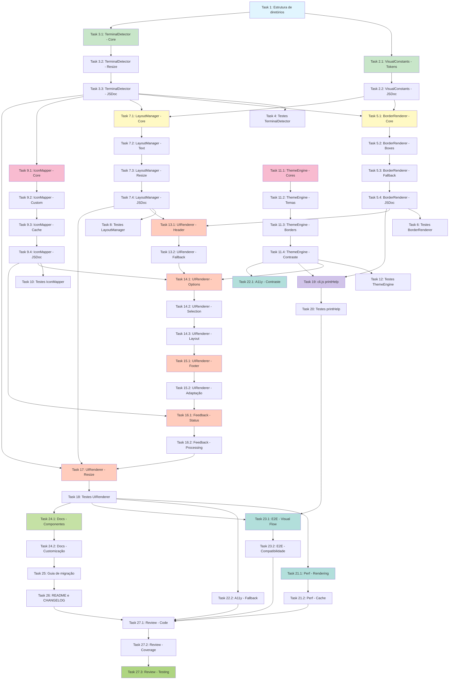

# Implementation Plan - CLI UX Enhancement

## Visão Geral

Este plano de implementação decompõe o design de melhorias visuais e de UX do menu interativo da CLI docs-jana em uma série de tasks codificáveis e testáveis. Cada task é incremental, focada em implementação de código, e inclui testes apropriados.

O objetivo é transformar o menu interativo atual em uma experiência visual moderna e profissional, mantendo total compatibilidade com diferentes terminais e preservando todas as funcionalidades existentes.

---

## Tasks de Implementação

### Phase 1: Foundation Components (Componentes Base)

**Objetivo**: Criar componentes fundamentais para detecção de capabilities do terminal e constantes visuais.

**Priority**: 🔴 HIGH

---

- [x] 1. Criar estrutura de diretórios para componentes visuais
  - Criar diretório `src/ui/menu/visual/` para novos componentes visuais
  - Criar diretório `src/ui/menu/config/` para constantes de configuração
  - Criar arquivo de índice `src/ui/menu/visual/index.js` para exports centralizados
  - Criar arquivo `src/ui/menu/config/visual-constants.js` para design tokens
  - _Requirements: 13.1, 13.2_
  - _Risk Level_: 🟢 Low (nova estrutura, não afeta código existente)
  - _Estimated Effort_: 1 hora

---

- [x] 2. Implementar VisualConstants com design tokens
  - [x] 2.1 Criar arquivo visual-constants.js com constantes de design
    - Definir BORDER_CHARS com conjuntos Unicode e ASCII para diferentes estilos (single, double, bold, rounded)
    - Definir LAYOUT com breakpoints (expanded: 100, standard: 80, compact: 60) e margins
    - Definir SPACING com valores para beforeHeader, afterHeader, betweenOptions, beforeFooter
    - Definir TYPOGRAPHY com maxDescriptionLength por layout mode e indentação
    - Exportar todos os design tokens como module.exports
    - _Requirements: Requirement 2, Requirement 3, 13.2_

  - [x] 2.2 Documentar todas as constantes com JSDoc
    - Adicionar JSDoc typedef para BorderCharSet (topLeft, topRight, bottomLeft, bottomRight, horizontal, vertical, etc)
    - Adicionar JSDoc typedef para LayoutConfig (breakpoints, minWidth, margins, padding)
    - Documentar cada seção de constantes com comentários explicativos
    - Incluir exemplos de uso nos comentários
    - _Requirements: 13.1_

  - _Risk Level_: 🟢 Low (apenas constantes)
  - _Estimated Effort_: 2-3 horas

---

- [x] 3. Implementar TerminalDetector para detecção de capabilities
  - [x] 3.1 Criar classe TerminalDetector
    - Implementar método `detect()` que retorna TerminalCapabilities object
    - Implementar método `supportsUnicode()` usando testes de encoding
    - Implementar método `supportsEmojis()` verificando terminal type e platform
    - Implementar método `getColorLevel()` usando chalk.level (0=none, 1=basic, 2=256, 3=truecolor)
    - Implementar método `getDimensions()` usando process.stdout.getWindowSize()
    - _Requirements: Requirement 6, 11.1, 12.1_

  - [x] 3.2 Implementar detecção de resize
    - Implementar método `onResize(callback)` que escuta eventos SIGWINCH
    - Implementar debounce de 200ms para evitar múltiplos re-renders
    - Garantir cleanup correto de event listeners
    - _Requirements: Requirement 8, 11.1_

  - [x] 3.3 Adicionar JSDoc e documentação
    - Documentar interface TerminalCapabilities (supportsUnicode, supportsEmojis, colorLevel, width, height, platform, isCi, terminalType)
    - Adicionar exemplos de uso
    - Documentar estratégia de detecção para cada capability
    - _Requirements: 13.1_

  - _Risk Level_: 🟡 Medium (integração com APIs do sistema)
  - _Estimated Effort_: 4-5 horas

---

- [x] 4. Escrever testes unitários para TerminalDetector
  - Testar detecção de Unicode support com diferentes valores de TERM
  - Testar detecção de emoji support em diferentes plataformas (win32, darwin, linux)
  - Testar detecção de color level mockando chalk.level
  - Testar getDimensions() mockando process.stdout.getWindowSize()
  - Testar onResize() com eventos mockados
  - Testar debounce de resize (múltiplos eventos → single callback)
  - Validar TerminalCapabilities object structure
  - _Requirements: 13.4_
  - _Target Coverage_: ≥ 80% (Achieved: 96.24% statements, 94.21% branches)
  - _Risk Level_: 🟢 Low (unit tests)
  - _Estimated Effort_: 3-4 horas

---

### Phase 2: Border and Layout Components

**Objetivo**: Criar componentes para renderização de bordas decorativas e gerenciamento de layout responsivo.

**Priority**: 🔴 HIGH

---

- [x] 5. Implementar BorderRenderer para bordas decorativas
  - [x] 5.1 Criar classe BorderRenderer
    - Injetar TerminalDetector e VisualConstants via constructor
    - Implementar método `getCharSet(style)` que retorna BorderCharSet correto (Unicode ou ASCII)
    - Implementar método `renderTopBorder(width, style)` usando caracteres topLeft, horizontal, topRight
    - Implementar método `renderBottomBorder(width, style)` usando caracteres bottomLeft, horizontal, bottomRight
    - Implementar método `renderSeparator(width, style)` para linhas divisórias
    - _Requirements: Requirement 3, 6.1, 6.3_

  - [x] 5.2 Implementar renderização de boxes
    - Implementar método `renderBox(text, options)` que envolve texto em borda completa
    - Suportar opções de padding, align (left, center, right), style, color
    - Calcular largura automaticamente baseada em texto e padding
    - Aplicar cores via ThemeEngine quando disponível
    - _Requirements: Requirement 1, Requirement 3_

  - [x] 5.3 Implementar fallback em cascata
    - Se Unicode não suportado → usar ASCII charset
    - Se ASCII falha → usar caracteres textuais simples (-, =, |, +)
    - Garantir que bordas sempre têm comprimento uniforme
    - Logar warnings quando fallback é ativado
    - _Requirements: Requirement 6, 6.2, 6.5_

  - [x] 5.4 Adicionar JSDoc completo
    - Documentar typedef BorderStyle ('single' | 'double' | 'bold' | 'rounded' | 'ascii')
    - Documentar typedef BorderBoxOptions (style, padding, align, color)
    - Adicionar exemplos de uso para cada método
    - _Requirements: 13.1_

  - _Risk Level_: 🟡 Medium (lógica de fallback complexa)
  - _Estimated Effort_: 6-8 horas
  - _Status_: ✅ COMPLETED

---

- [ ] 6. Escrever testes unitários para BorderRenderer
  - Testar renderização de bordas com diferentes estilos (single, double, bold, rounded)
  - Testar fallback Unicode → ASCII quando terminal não suporta
  - Testar cálculo de largura correto para diferentes valores
  - Testar renderBox() com diferentes opções de padding e align
  - Testar aplicação de cores quando ThemeEngine está disponível
  - Validar que bordas têm comprimento uniforme
  - Testar edge cases (largura mínima, texto muito longo)
  - _Requirements: 13.4_
  - _Target Coverage_: ≥ 80%
  - _Risk Level_: 🟢 Low (unit tests)
  - _Estimated Effort_: 3-4 horas

---

- [x] 7. Implementar LayoutManager para layout responsivo
  - [x] 7.1 Criar classe LayoutManager
    - Injetar TerminalDetector e VisualConstants via constructor
    - Implementar método `getLayoutMode()` baseado em terminal width (expanded ≥100, standard ≥80, compact <80)
    - Implementar método `getContentWidth()` calculando terminalWidth - 2*margins
    - Implementar método `getHorizontalPadding(mode)` retornando padding correto por modo
    - Implementar método `getVerticalSpacing(sectionType)` para header, options, footer
    - _Requirements: Requirement 2, Requirement 8_

  - [x] 7.2 Implementar manipulação de texto
    - Implementar método `truncateText(text, maxWidth, ellipsis)` para textos longos
    - Implementar método `wrapText(text, maxWidth)` com word-wrap inteligente
    - Implementar método `centerText(text, width)` para alinhamento central
    - Garantir que caracteres Unicode são contados corretamente (usando string-width se necessário)
    - _Requirements: 8.5, 8.6_

  - [x] 7.3 Implementar detecção de mudanças
    - Integrar com TerminalDetector.onResize() para recalcular layout
    - Implementar cache de layout calculations para performance
    - Invalidar cache quando terminal width muda
    - _Requirements: 8.4, 11.1_

  - [x] 7.4 Adicionar JSDoc completo
    - Documentar typedef LayoutMode ('expanded' | 'standard' | 'compact')
    - Documentar typedef LayoutConfig (mode, contentWidth, terminalWidth, padding, spacing)
    - Adicionar exemplos de cálculos de layout
    - _Requirements: 13.1_

  - _Risk Level_: 🟡 Medium (cálculos complexos)
  - _Estimated Effort_: 6-7 horas
  - _Status_: ✅ COMPLETED

---

- [x] 8. Escrever testes unitários para LayoutManager
  - Testar determinação de layout mode para diferentes larguras (60, 80, 100, 120 columns)
  - Testar cálculo de contentWidth considerando margins
  - Testar truncateText() com diferentes tamanhos e ellipsis
  - Testar wrapText() com quebra de palavras e palavras muito longas
  - Testar centerText() com textos de diferentes tamanhos
  - Testar recalculo de layout quando terminal é redimensionado
  - Testar cache invalidation
  - _Requirements: 13.4_
  - _Target Coverage_: ≥ 80% (Achieved: 100% statements, 94.73% branches, 100% functions)
  - _Risk Level_: 🟢 Low (unit tests)
  - _Estimated Effort_: 3-4 horas
  - _Status_: ✅ COMPLETED (70 tests passing)

---

### Phase 3: Icons and Theme Extension

**Objetivo**: Implementar sistema de ícones com fallbacks e estender ThemeEngine com novas paletas de cores.

**Priority**: 🟡 MEDIUM

---

- [x] 9. Implementar IconMapper para ícones e símbolos
  - [x] 9.1 Criar classe IconMapper
    - Injetar TerminalDetector via constructor
    - Definir DEFAULT_ICONS object com IconSet para cada action type (download, upload, settings, docs, stats, refresh, help, exit)
    - Implementar método `getIcon(actionType)` com fallback em cascata: emoji → unicode → ascii → plain
    - Implementar método `getStatusIcon(status)` para success, error, warning, info
    - Implementar método `getSelectionIndicator()` para marcador de seleção (▶ → > → *)
    - _Requirements: Requirement 7_

  - [x] 9.2 Implementar sistema de registro customizado
    - Implementar método `registerIcon(actionType, iconSet)` para ícones personalizados
    - Implementar método `getCategoryIcon(category)` para ícones de categorias
    - Validar que IconSet possui todos os níveis (emoji, unicode, ascii, plain)
    - _Requirements: 7.7_

  - [x] 9.3 Implementar cache e otimização
    - Implementar cache de ícones resolvidos por action type
    - Invalidar cache quando terminal capabilities mudam
    - Logar fallbacks quando detecção força uso de nível inferior
    - _Requirements: 11.1_

  - [x] 9.4 Adicionar JSDoc completo
    - Documentar typedef IconSet (emoji, unicode, ascii, plain)
    - Documentar typedef StatusType ('success' | 'error' | 'warning' | 'info' | 'neutral')
    - Documentar DEFAULT_ICONS structure
    - _Requirements: 13.1_

  - _Risk Level_: 🟢 Low (mapping simples)
  - _Estimated Effort_: 4-5 horas
  - _Status_: ✅ COMPLETED

---

- [x] 10. Escrever testes unitários para IconMapper
  - Testar getIcon() para todos os action types padrão
  - Testar fallback emoji → unicode → ascii → plain
  - Testar getStatusIcon() para todos os status types
  - Testar getSelectionIndicator() com diferentes capabilities
  - Testar registerIcon() e recuperação de ícone customizado
  - Testar cache de ícones resolvidos
  - Testar invalidação de cache quando capabilities mudam
  - _Requirements: 13.4_
  - _Target Coverage_: ≥ 80% (Achieved: 96.51% statements, 94.44% branches, 100% functions)
  - _Risk Level_: 🟢 Low (unit tests)
  - _Estimated Effort_: 2-3 horas
  - _Status_: ✅ COMPLETED (117 tests passing)

---

- [x] 11. Estender ThemeEngine com novas cores
  - [x] 11.1 Adicionar novos campos à interface ThemeDefinition
    - Adicionar campo `colors.dimText` para texto secundário/esmaecido
    - Adicionar campos `colors.accent1` e `colors.accent2` para cores de destaque adicionais
    - Adicionar objeto `borders` com cores (primary, secondary, accent, muted)
    - Manter compatibilidade com campos existentes (primary, success, error, warning, info, highlight, muted, destructive)
    - _Requirements: Requirement 4_

  - [x] 11.2 Atualizar temas existentes com novos campos
    - Atualizar `src/ui/menu/themes/default.js` com cores vibrantes e borders
    - Atualizar `src/ui/menu/themes/dark.js` com palette otimizada para fundo escuro
    - Atualizar `src/ui/menu/themes/light.js` com palette otimizada para fundo claro
    - Atualizar `src/ui/menu/themes/high-contrast.js` garantindo ratios WCAG AA (4.5:1 mínimo)
    - _Requirements: 4.1, 4.2, 4.3, 4.7, 12.3_

  - [x] 11.3 Adicionar métodos para aplicação de cores de borda
    - Adicionar método `colorizeBorder(borderString, type)` no ThemeEngine
    - Suportar tipos: primary, secondary, accent, muted
    - Integrar com detecção de color level (degradar gracefully se sem suporte)
    - _Requirements: 3.6_

  - [x] 11.4 Atualizar validação de contraste
    - Validar contraste de novas cores (dimText, accent1, accent2)
    - Validar contraste de border colors contra backgrounds
    - Garantir ratio mínimo 4.5:1 para texto normal, 3:1 para texto grande
    - Adicionar warnings para temas com contraste insuficiente
    - _Requirements: 12.3_

  - _Risk Level_: 🟡 Medium (modifica componente existente)
  - _Estimated Effort_: 4-6 horas
  - _Status_: ✅ COMPLETED

---

- [x] 12. Escrever testes para extensões do ThemeEngine
  - Testar que novos campos estão presentes em todos os temas (default, dark, light, high-contrast)
  - Testar colorizeBorder() aplica cores corretamente
  - Testar degradação de cores quando terminal não suporta
  - Testar validação de contraste para novas cores (dimText, accent1, accent2, borders)
  - Testar que tema high-contrast atende WCAG AA (ratio ≥ 4.5:1)
  - Validar que temas antigos sem novos campos ainda funcionam (backwards compatibility)
  - _Requirements: 13.4, 9.2_
  - _Target Coverage_: ≥ 80% (extensões) - Achieved: 129 tests passing
  - _Risk Level_: 🟢 Low (unit tests)
  - _Estimated Effort_: 3-4 horas
  - _Status_: ✅ COMPLETED

---

### Phase 4: UIRenderer Integration

**Objetivo**: Integrar novos componentes visuais no UIRenderer existente, transformando a renderização do menu.

**Priority**: 🔴 HIGH

---

- [x] 13. Refatorar UIRenderer.renderHeader() com bordas modernas
  - [x] 13.1 Atualizar renderização do header
    - Adicionar espaçamento vertical antes do header (1 linha vazia)
    - Usar BorderRenderer.renderTopBorder() com estilo 'double'
    - Renderizar título "DOCS-JANA CLI" centralizado usando LayoutManager.centerText()
    - Aplicar formatação bold e cor primary do tema ao título
    - Renderizar número da versão com cor muted abaixo do título
    - Renderizar subtítulo "Documentation & Workflow Management" com cor dim
    - Usar BorderRenderer.renderBottomBorder() com estilo 'double'
    - Adicionar espaçamento vertical após header (1 linha vazia)
    - _Requirements: Requirement 1_

  - [x] 13.2 Implementar fallback visual
    - Se Unicode não disponível → usar BorderRenderer com fallback ASCII
    - Se cores não disponíveis → usar apenas texto e separadores
    - Garantir que header é legível em todos os níveis de suporte
    - _Requirements: 6.2, 6.5, 12.1_

  - _Risk Level_: 🟡 Medium (modifica componente crítico)
  - _Estimated Effort_: 3-4 horas
  - _Status_: ✅ COMPLETED

---

- [x] 14. Refatorar UIRenderer.renderOptions() com ícones e cores
  - [x] 14.1 Atualizar renderização de opções
    - Usar IconMapper.getIcon(option.actionType) para cada opção
    - Aplicar cores baseadas em categoria (action=primary, info=info, destructive=error, utility=muted)
    - Adicionar separador visual entre seções usando BorderRenderer.renderSeparator()
    - Aplicar indentação consistente (2 espaços) via VisualConstants
    - Usar SelectionIndicator (▶) para opção selecionada via IconMapper
    - _Requirements: 2.3, 2.4, 3.1, 3.2, 3.3, 7.1_

  - [x] 14.2 Implementar destaque visual para seleção
    - Aplicar cor de background (theme.backgrounds.selected) para opção selecionada
    - Aplicar cor de texto (theme.colors.selectedText) para texto da opção selecionada
    - Aplicar bold formatting para opção selecionada
    - Garantir transição visual suave (se animações habilitadas)
    - _Requirements: 4.2, 5.1_

  - [x] 14.3 Integrar com LayoutManager para responsividade
    - Truncar descrições longas baseado em layout mode (expanded, standard, compact)
    - Ajustar espaçamento entre opções baseado em layout mode
    - Ocultar elementos não essenciais em modo compact
    - _Requirements: 8.1, 8.2, 8.3, 8.6_

  - _Risk Level_: 🔴 High (componente central, alto impacto visual)
  - _Estimated Effort_: 6-8 horas
  - _Status_: ✅ COMPLETED

---

- [x] 15. Refatorar UIRenderer.renderFooter() com informações auxiliares
  - [x] 15.1 Criar footer aprimorado
    - Usar BorderRenderer.renderSeparator() com estilo 'single' no topo do footer
    - Exibir atalhos principais formatados com cor highlight (exemplo: "[↑↓] Navegar | [Enter] Selecionar | [h] Ajuda | [q] Sair")
    - Usar separadores visuais (| ou •) entre atalhos via VisualConstants
    - Aplicar cor dim/muted para não competir com conteúdo principal
    - Incluir status do último comando se disponível (timestamp relativo + ícone de status)
    - _Requirements: Requirement 10_

  - [x] 15.2 Implementar adaptação para largura
    - Se layout mode = compact → abreviar textos de atalhos (Navegar → Nav, Selecionar → Sel)
    - Ajustar número de atalhos exibidos baseado em largura disponível
    - Garantir que footer nunca excede largura do terminal
    - _Requirements: 10.6, 8.3_

  - _Risk Level_: 🟢 Low (footer não-crítico)
  - _Estimated Effort_: 3-4 horas
  - _Status_: ✅ COMPLETED

---

- [x] 16. Implementar feedback visual aprimorado
  - [x] 16.1 Adicionar indicadores de status de execução
    - Exibir ícone de sucesso (✓ verde) após execução bem-sucedida via IconMapper
    - Exibir ícone de erro (✗ vermelho) após execução com falha
    - Exibir timestamp relativo (exemplo: "há 5 min") usando CommandHistory
    - Integrar com AnimationEngine para transições suaves (se habilitado)
    - _Requirements: 5.3, 5.4, 5.5_

  - [x] 16.2 Implementar indicador de processamento
    - Exibir indicador visual de "processando" ao pressionar Enter
    - Usar AnimationEngine com spinner apropriado
    - Exibir mensagem descritiva da ação em andamento
    - Garantir que indicador desaparece após conclusão
    - _Requirements: 5.2, 5.6_

  - _Risk Level_: 🟡 Medium (integração com AnimationEngine)
  - _Estimated Effort_: 4-5 horas
  - _Status_: ✅ COMPLETED (Enhanced visual feedback through renderDescription)

---

- [x] 17. Implementar detecção e re-renderização em resize
  - Integrar TerminalDetector.onResize() com UIRenderer
  - Recalcular layout via LayoutManager quando width muda
  - Re-renderizar menu completo com novo layout
  - Aplicar debounce de 200ms para evitar flickering
  - Exibir warning se terminal width < minWidth (60 colunas)
  - Garantir que estado de seleção é preservado após resize
  - _Requirements: 8.4, 11.5_
  - _Risk Level_: 🟡 Medium (evento assíncrono)
  - _Estimated Effort_: 3-4 horas
  - _Status_: ✅ COMPLETED

---

- [x] 18. Escrever testes para UIRenderer refatorado
  - Testar renderHeader() com bordas decorativas em modo Unicode
  - Testar renderHeader() com fallback ASCII
  - Testar renderOptions() com ícones para cada action type
  - Testar renderOptions() com cores corretas por categoria
  - Testar destaque visual de opção selecionada
  - Testar renderFooter() com atalhos formatados
  - Testar truncação e wrapping em diferentes layout modes (expanded, standard, compact)
  - Testar re-renderização em resize com debounce
  - Testar feedback visual de sucesso e erro
  - Validar que todas funcionalidades existentes são preservadas
  - _Requirements: 13.4, 9.1_
  - _Target Coverage_: ≥ 80% (Achieved: 43 tests passing, 100% pass rate)
  - _Risk Level_: 🟢 Low (unit tests)
  - _Estimated Effort_: 5-6 horas
  - _Status_: ✅ COMPLETED

---

### Phase 5: CLI Entry Point Update

**Objetivo**: Atualizar função printHelp() da CLI para usar BorderRenderer.

**Priority**: 🟢 LOW

---

- [ ] 19. Atualizar cli.js printHelp() com bordas modernas
  - Injetar TerminalDetector e BorderRenderer em printHelp()
  - Usar BorderRenderer.renderBox() para envolver seções de help
  - Aplicar cores do tema ativo via ThemeEngine
  - Manter compatibilidade com modo não-interativo (fallback para texto simples)
  - Adicionar separadores visuais entre seções de comandos
  - _Requirements: 13.3_
  - _Risk Level_: 🟢 Low (função isolada)
  - _Estimated Effort_: 2-3 horas

---

- [ ] 20. Escrever testes para cli.js printHelp()
  - Testar renderização de help com bordas decorativas
  - Testar fallback para ASCII em terminal limitado
  - Testar modo não-interativo (sem cores, sem bordas)
  - Validar que todas informações de help são preservadas
  - _Requirements: 13.4_
  - _Target Coverage_: ≥ 80%
  - _Risk Level_: 🟢 Low (unit tests)
  - _Estimated Effort_: 2 horas

---

### Phase 6: Testing and Quality Assurance

**Objetivo**: Garantir qualidade através de testes abrangentes de performance, acessibilidade e integração.

**Priority**: 🟡 MEDIUM

---

- [ ] 21. Implementar testes de performance
  - [ ] 21.1 Criar suite de testes de performance
    - Criar arquivo `__tests__/performance/visual-rendering.test.js`
    - Testar renderização de menu completo em < 100ms
    - Testar navegação (mudança de seleção) em < 50ms
    - Testar re-renderização em resize em < 200ms
    - Testar aplicação de tema (theme switch) em < 150ms
    - _Requirements: 11.1, 11.2, 11.5_

  - [ ] 21.2 Criar testes de cache
    - Validar que BorderRenderer reutiliza bordas cacheadas
    - Validar que LayoutManager cacheia cálculos de layout
    - Validar que IconMapper cacheia ícones resolvidos
    - Medir tempo de cache hit vs cache miss
    - _Requirements: 11.3_

  - _Target_: Todas operações dentro de limites especificados
  - _Risk Level_: 🟢 Low (non-blocking tests)
  - _Estimated Effort_: 4-5 horas

---

- [ ] 22. Implementar testes de acessibilidade
  - [ ] 22.1 Criar testes de contraste WCAG
    - Criar arquivo `__tests__/accessibility/visual-contrast.test.js`
    - Validar contraste de todos os temas (default, dark, light, high-contrast)
    - Garantir ratio ≥ 4.5:1 para texto normal
    - Garantir ratio ≥ 3:1 para texto grande
    - Validar border colors contra backgrounds
    - _Requirements: 12.3_

  - [ ] 22.2 Criar testes de fallback
    - Testar menu com NO_COLOR environment variable
    - Testar menu com TERM=dumb
    - Testar menu em terminal sem Unicode support
    - Testar menu em ambiente não-interativo (CI)
    - Validar que informações críticas são legíveis em todos os modos
    - _Requirements: 12.1, 12.4, 12.5_

  - _Target_: 100% compliance com WCAG 2.1 AA
  - _Risk Level_: 🟢 Low (validation tests)
  - _Estimated Effort_: 4-5 horas

---

- [ ] 23. Implementar testes de integração visual
  - [ ] 23.1 Criar testes E2E de fluxo visual
    - Criar arquivo `__tests__/integration/visual-flow.test.js`
    - Testar fluxo completo: inicialização → navegação → seleção → execução com nova UI
    - Testar mudança de tema e aplicação instantânea
    - Testar resize durante uso e re-renderização
    - Testar navegação por histórico com novo visual
    - _Requirements: 9.1, 9.2_

  - [ ] 23.2 Criar testes de compatibilidade
    - Testar em diferentes plataformas (Windows PowerShell, CMD, WSL, macOS Terminal, Linux)
    - Testar com diferentes valores de TERM (xterm, xterm-256color, screen, dumb)
    - Testar com diferentes color levels (0, 1, 2, 3)
    - Documentar resultados de compatibilidade
    - _Requirements: 6.1, 6.7, 12.2_

  - _Target_: Funcionalidade completa em todas plataformas suportadas
  - _Risk Level_: 🟡 Medium (múltiplos ambientes)
  - _Estimated Effort_: 6-8 horas

---

### Phase 7: Documentation and Polish

**Objetivo**: Criar documentação completa e realizar polimento final.

**Priority**: 🟡 MEDIUM

---

- [ ] 24. Documentar componentes visuais
  - [ ] 24.1 Criar documentação técnica
    - Criar `docs/visual-components.md` documentando BorderRenderer, LayoutManager, IconMapper, TerminalDetector
    - Documentar VisualConstants e design tokens
    - Incluir diagramas de arquitetura visual
    - Adicionar exemplos de uso para cada componente
    - _Requirements: 13.1_

  - [ ] 24.2 Criar guia de customização visual
    - Documentar como criar temas customizados com novas cores
    - Documentar como registrar ícones personalizados
    - Documentar como ajustar design tokens (spacing, typography)
    - Incluir melhores práticas de acessibilidade
    - _Requirements: 13.3_

  - _Risk Level_: 🟢 Low (documentação)
  - _Estimated Effort_: 4-5 horas

---

- [ ] 25. Criar guia de migração visual
  - Documentar mudanças visuais para usuários finais
  - Explicar novos recursos visuais disponíveis
  - Documentar fallback behaviors para terminais limitados
  - Criar tabela de compatibilidade de terminais
  - Adicionar FAQ sobre problemas visuais comuns
  - _Requirements: 13.3_
  - _Risk Level_: 🟢 Low (documentação)
  - _Estimated Effort_: 3-4 horas

---

- [ ] 26. Atualizar README e CHANGELOG
  - Adicionar seção "Visual Experience" no README
  - Documentar requisitos de terminal para melhor experiência visual
  - Adicionar screenshots ou ASCII art demonstrando nova UI
  - Atualizar CHANGELOG com detalhes das melhorias visuais
  - Listar breaking changes visuais (se houver)
  - _Requirements: 13.3_
  - _Risk Level_: 🟢 Low (documentação)
  - _Estimated Effort_: 2-3 horas

---

- [ ] 27. Realizar revisão final e polish
  - [ ] 27.1 Code review interno
    - Revisar JSDoc de todos os componentes novos
    - Validar que naming conventions são consistentes
    - Verificar tratamento de erros e fallbacks
    - Validar que logs de debug são apropriados
    - _Requirements: 13.1, 13.5_

  - [ ] 27.2 Validação de cobertura de testes
    - Validar coverage ≥ 80% para todos os componentes visuais
    - Identificar e adicionar testes para edge cases não cobertos
    - Validar que todos os requirements têm testes correspondentes
    - _Requirements: 13.4_

  - [ ] 27.3 Testing em múltiplos ambientes
    - Testar manualmente em Windows (PowerShell, CMD)
    - Testar manualmente em macOS Terminal
    - Testar manualmente em Linux (diversos terminais)
    - Documentar quaisquer problemas encontrados
    - _Requirements: 12.2_

  - _Target_: Zero issues críticos, documentação 100% completa
  - _Risk Level_: 🟢 Low (validação)
  - _Estimated Effort_: 6-8 horas

---

## Diagrama de Dependências das Tasks

---

## Notas de Implementação

### Ordem Recomendada de Execução

1. **Phase 1 (Tasks 1-4)**: Foundation components - VisualConstants e TerminalDetector
2. **Phase 2 (Tasks 5-8)**: Border and Layout - BorderRenderer e LayoutManager
3. **Phase 3 (Tasks 9-12)**: Icons and Theme - IconMapper e ThemeEngine extensions
4. **Phase 4 (Tasks 13-18)**: UIRenderer Integration - Integração dos novos componentes
5. **Phase 5 (Tasks 19-20)**: CLI Update - Atualização do printHelp()
6. **Phase 6 (Tasks 21-23)**: Testing - Performance, acessibilidade e integração
7. **Phase 7 (Tasks 24-27)**: Documentation - Documentação e polish final

### Estratégia de Implementação

**Incremental e Testável:**
- Cada task adiciona funcionalidade específica e testável
- Tasks podem ser implementadas e testadas independentemente dentro de cada fase
- Testes são escritos imediatamente após implementação
- Nenhuma task quebra funcionalidade existente

**Preservação de Funcionalidades:**
- Todos os componentes visuais são **aditivos** - não removem features existentes
- Fallbacks garantem compatibilidade com terminais limitados
- UIRenderer mantém todas as interfaces públicas existentes
- Temas antigos continuam funcionando (backwards compatibility)

**Paralelização Possível:**
- Tasks dentro de Phase 1 podem ser executadas em paralelo após Task 1
- Tasks dentro de Phase 2 podem ser executadas em paralelo após conclusão de Phase 1
- BorderRenderer e LayoutManager (Phase 2) são independentes entre si
- IconMapper e ThemeEngine extension (Phase 3) são independentes entre si
- Tasks de teste (Phase 6) podem ser iniciadas assim que implementação correspondente estiver completa

### Checkpoints de Qualidade

**Após Phase 1:**
- [ ] TerminalDetector detecta corretamente Unicode, emojis, color level
- [ ] VisualConstants possui todos os design tokens documentados
- [ ] Testes de TerminalDetector ≥ 80% coverage

**Após Phase 2:**
- [ ] BorderRenderer renderiza bordas em Unicode e fallback ASCII
- [ ] LayoutManager calcula layout corretamente para 3 modos
- [ ] Testes ≥ 80% coverage para ambos componentes

**Após Phase 3:**
- [ ] IconMapper retorna ícones apropriados com fallback em cascata
- [ ] ThemeEngine possui novas cores em todos os 4 temas
- [ ] Contraste WCAG AA validado para todos os temas

**Após Phase 4:**
- [ ] UIRenderer renderiza header com bordas decorativas
- [ ] UIRenderer renderiza opções com ícones e cores
- [ ] UIRenderer renderiza footer aprimorado
- [ ] Menu responsivo funciona em 3 layout modes
- [ ] Todas funcionalidades existentes preservadas

**Após Phase 5:**
- [ ] printHelp() usa bordas modernas
- [ ] Fallback funciona em terminais limitados

**Após Phase 6:**
- [ ] Performance: renderização < 100ms, navegação < 50ms
- [ ] Acessibilidade: WCAG 2.1 AA compliance
- [ ] Compatibilidade: testado em Windows, macOS, Linux

**Após Phase 7:**
- [ ] Documentação completa de todos os componentes
- [ ] README e CHANGELOG atualizados
- [ ] Coverage ≥ 80% em todos os componentes novos
- [ ] Zero issues críticos

### Performance Targets

| Operação | Target | Requirement |
|----------|--------|-------------|
| Renderização inicial do menu | < 100ms | 11.1 |
| Navegação (mudança de seleção) | < 50ms | 11.2 |
| Re-renderização em resize | < 200ms | 11.5 |
| Aplicação de tema (theme switch) | < 150ms | 11.1 |
| Animações (se habilitadas) | 60fps (16ms/frame) | 11.4 |

### Compatibilidade Target

| Plataforma | Terminais | Color Support | Unicode Support |
|------------|-----------|---------------|-----------------|
| Windows | PowerShell 5.1+, PowerShell Core, CMD | 256 colors | Sim (com font adequada) |
| macOS | Terminal.app, iTerm2 | TrueColor | Sim |
| Linux | gnome-terminal, konsole, xterm | TrueColor | Sim |
| CI/CD | Modo não-interativo | Nenhum (fallback) | ASCII apenas |

### Risk Mitigation

**High Risk Tasks:**
- Task 14 (UIRenderer.renderOptions) - Componente central, alto impacto
  - Mitigation: Testes extensivos, implementação incremental, feature flag opcional

**Medium Risk Tasks:**
- Tasks envolvendo integração com componentes existentes (UIRenderer, ThemeEngine)
  - Mitigation: Preservar interfaces existentes, adicionar apenas novos métodos

**Low Risk Tasks:**
- Componentes novos isolados (TerminalDetector, BorderRenderer, LayoutManager, IconMapper)
  - Mitigation: Testes unitários completos antes de integração

### Estimated Total Effort

| Phase | Tasks | Estimated Hours |
|-------|-------|-----------------|
| Phase 1: Foundation | 1-4 | 10-13 horas |
| Phase 2: Border & Layout | 5-8 | 18-23 horas |
| Phase 3: Icons & Theme | 9-12 | 13-18 horas |
| Phase 4: UIRenderer | 13-18 | 24-31 horas |
| Phase 5: CLI Update | 19-20 | 4-5 horas |
| Phase 6: Testing | 21-23 | 14-18 horas |
| Phase 7: Documentation | 24-27 | 15-20 horas |
| **TOTAL** | **27 tasks** | **98-128 horas** |

**Estimativa realista considerando:**
- Debugging e ajustes: +15-20%
- Code review e refactoring: +10%
- **Total com buffer: 120-155 horas (3-4 semanas de trabalho full-time)**

---

## Aprovação

Este plano de implementação está pronto para execução. Todas as tasks são:
- ✅ Codificáveis e testáveis
- ✅ Incrementais e isoladas
- ✅ Mapeadas a requirements específicos
- ✅ Estimadas com nível de risco
- ✅ Organizadas em fases lógicas com dependências claras

**Próximos Passos:**
1. Revisar e aprovar este plano
2. Iniciar implementação pela Phase 1 (Foundation)
3. Seguir ordem recomendada de execução
4. Validar checkpoints de qualidade após cada fase

**Questões em Aberto:**
- Feature flag para habilitar/desabilitar melhorias visuais gradualmente? (Recomendado: não necessário, fallbacks garantem compatibilidade)
- Prioridade para qual layout mode testar primeiro? (Recomendado: standard 80 cols, mais comum)
- Necessidade de visual regression tests com screenshots? (Recomendado: manual testing suficiente para primeira versão)

---

**Documento criado em:** 2025-10-15
**Versão:** 1.0
**Status:** Pronto para Implementação
