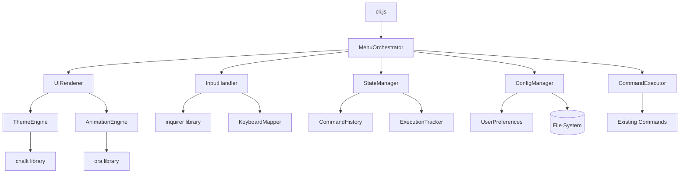
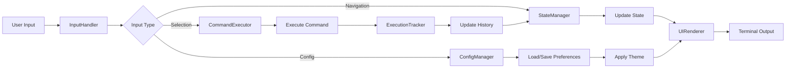
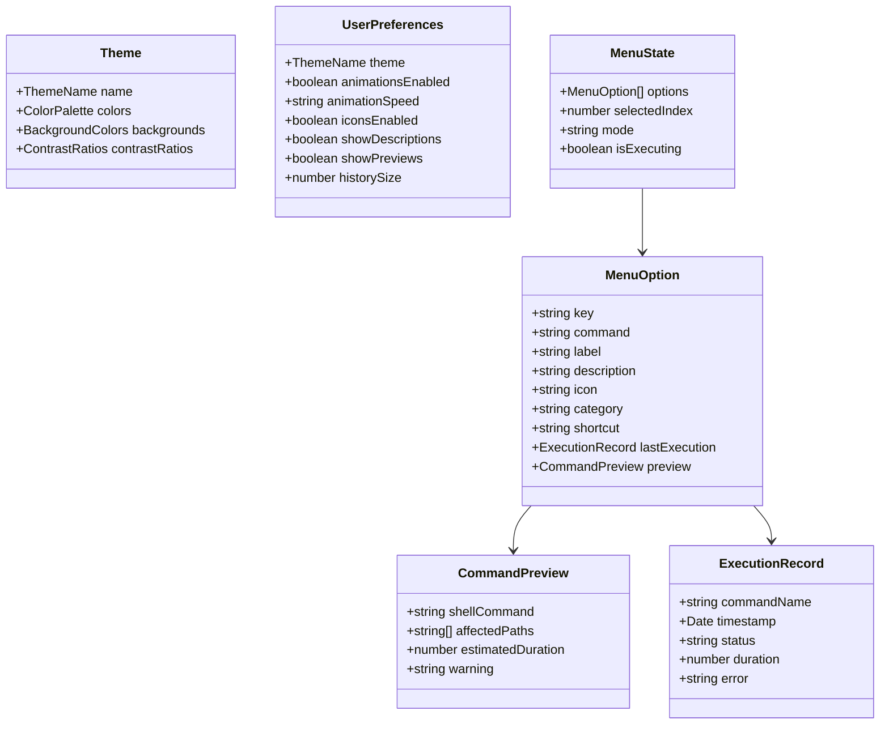
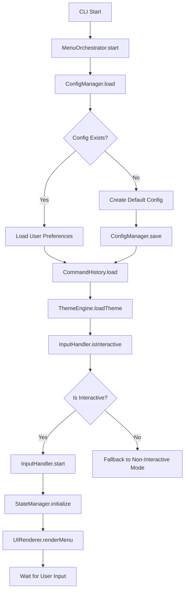
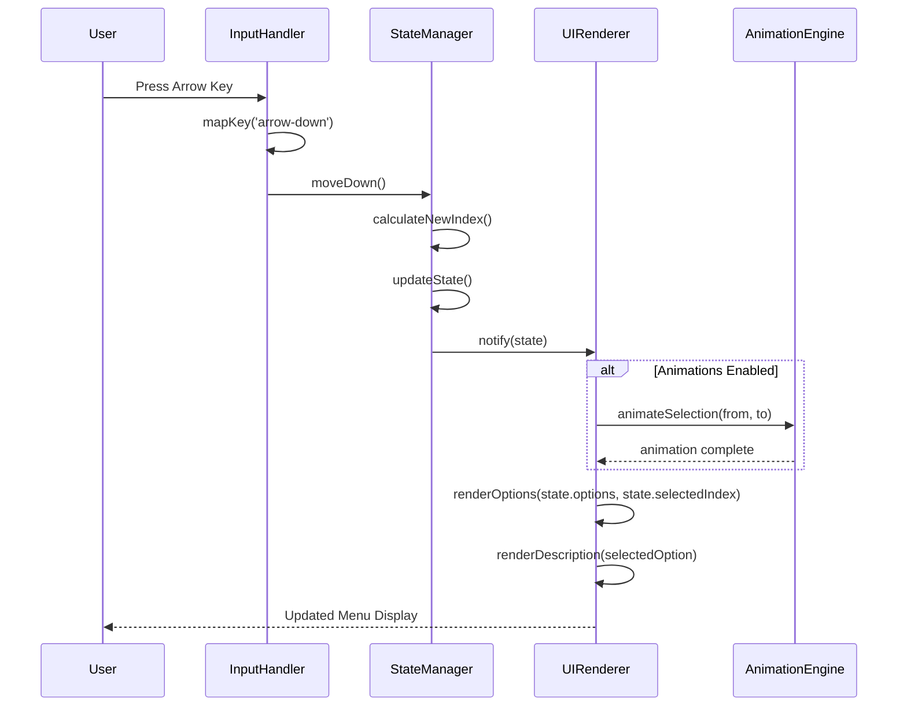
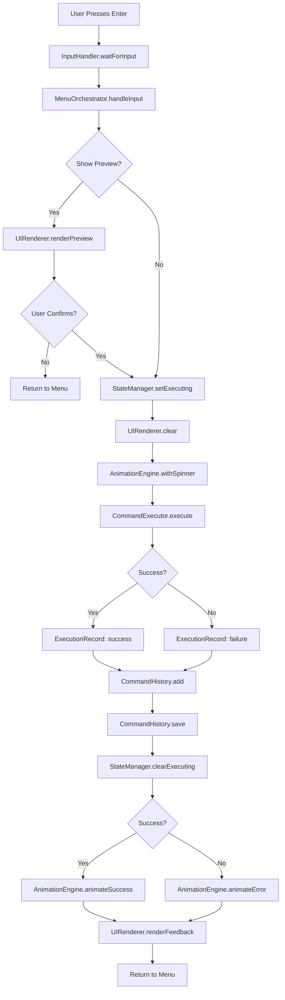
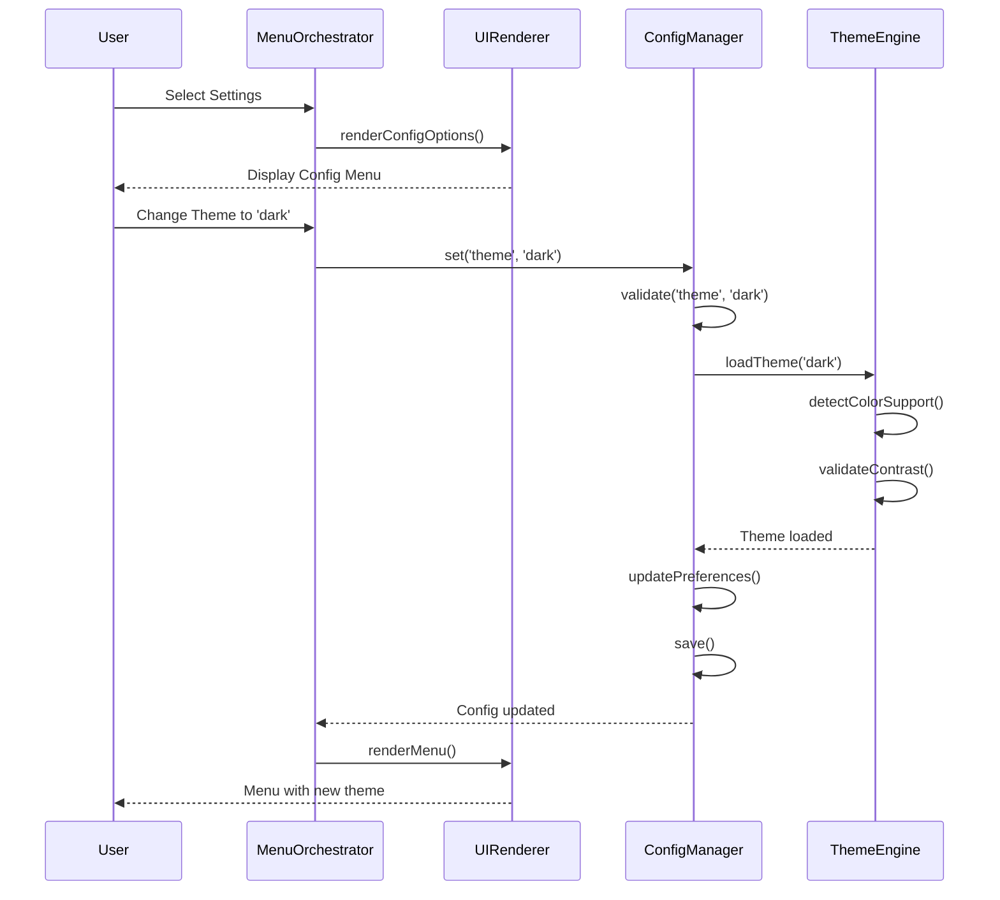
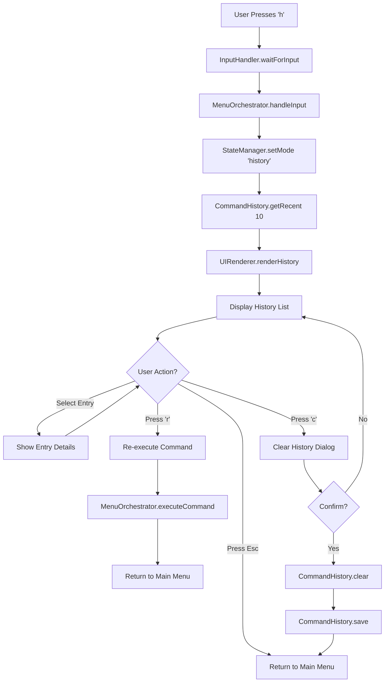
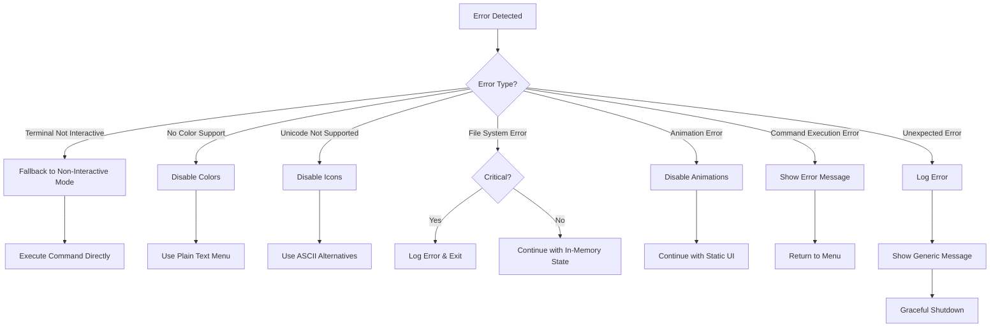

# Design Document - Interactive Menu Enhancement

## Overview

Este documento detalha o design técnico para aprimorar o menu interativo do CLI docs-jana, transformando-o de um menu simples baseado em readline para uma interface moderna, intuitiva e visualmente rica. O design foca em criar uma experiência de usuário excepcional mantendo modularidade, performance e compatibilidade multiplataforma.

### Objetivos do Design

1. **Experiência de Usuário Superior**: Navegação por setas, feedback visual rico, animações sutis
2. **Acessibilidade**: Suporte a diferentes terminais, fallback gracioso, configurabilidade
3. **Modularidade**: Componentes reutilizáveis e extensíveis
4. **Performance**: Resposta instantânea (< 50ms) e renderização eficiente
5. **Manutenibilidade**: Código limpo, testável e bem documentado

### Escopo

**Incluído:**
- Sistema de navegação interativo com setas
- Sistema visual (cores, ícones, animações)
- Histórico de execução de comandos
- Preview e confirmação de comandos
- Sistema de configuração de preferências
- Atalhos de teclado

**Excluído:**
- Modificações nos comandos existentes (n8n:download, n8n:upload, outline:download)
- Alterações na lógica de negócio dos serviços
- Mudanças no sistema de autenticação

---

## Architecture Design

### System Architecture Diagram



### Data Flow Diagram



---

## Component Design

### Component 1: MenuOrchestrator

**Responsabilidades:**
- Coordenar todos os componentes do sistema de menu
- Gerenciar o ciclo de vida do menu (inicialização, execução, encerramento)
- Orquestrar fluxo entre navegação, preview e execução
- Gerenciar estado global do menu

**Interfaces:**
```typescript
interface MenuOrchestrator {
  /**
   * Inicializa o menu interativo
   * @returns Promise que resolve quando o menu é encerrado
   */
  start(): Promise<void>;

  /**
   * Renderiza o menu com estado atual
   */
  render(): void;

  /**
   * Processa entrada do usuário
   * @param input - Entrada do usuário
   */
  handleInput(input: UserInput): Promise<void>;

  /**
   * Executa comando selecionado
   * @param commandName - Nome do comando
   */
  executeCommand(commandName: string): Promise<ExecutionResult>;

  /**
   * Encerra o menu graciosamente
   */
  shutdown(): void;
}

interface UserInput {
  type: 'navigation' | 'selection' | 'shortcut' | 'config';
  key?: string;
  value?: any;
}

interface ExecutionResult {
  success: boolean;
  message: string;
  timestamp: Date;
  duration: number;
}
```

**Dependências:**
- UIRenderer
- InputHandler
- StateManager
- ConfigManager
- CommandExecutor

---

### Component 2: UIRenderer

**Responsabilidades:**
- Renderizar interface visual do menu
- Aplicar temas e cores
- Gerenciar animações
- Renderizar descrições, previews e feedback visual

**Interfaces:**
```typescript
interface UIRenderer {
  /**
   * Renderiza o menu completo
   * @param state - Estado atual do menu
   */
  renderMenu(state: MenuState): void;

  /**
   * Renderiza header do menu
   */
  renderHeader(): void;

  /**
   * Renderiza lista de opções
   * @param options - Lista de opções
   * @param selectedIndex - Índice da opção selecionada
   */
  renderOptions(options: MenuOption[], selectedIndex: number): void;

  /**
   * Renderiza descrição detalhada
   * @param option - Opção selecionada
   */
  renderDescription(option: MenuOption): void;

  /**
   * Renderiza preview do comando
   * @param command - Comando a ser previewed
   */
  renderPreview(command: Command): void;

  /**
   * Renderiza histórico de execução
   * @param history - Lista de execuções passadas
   */
  renderHistory(history: ExecutionRecord[]): void;

  /**
   * Renderiza feedback de execução (sucesso/erro)
   * @param result - Resultado da execução
   */
  renderFeedback(result: ExecutionResult): void;

  /**
   * Limpa a tela
   */
  clear(): void;
}

interface MenuOption {
  key: string;
  command: string;
  label: string;
  description: string;
  icon: string;
  category: 'action' | 'info' | 'destructive' | 'utility';
  shortcut?: string;
  lastExecution?: ExecutionRecord;
}

interface MenuState {
  options: MenuOption[];
  selectedIndex: number;
  mode: 'navigation' | 'preview' | 'history' | 'config';
  isExecuting: boolean;
}

interface ExecutionRecord {
  commandName: string;
  timestamp: Date;
  status: 'success' | 'failure';
  duration: number;
}
```

**Dependências:**
- ThemeEngine
- AnimationEngine
- chalk (biblioteca externa)

---

### Component 3: ThemeEngine

**Responsabilidades:**
- Gerenciar esquemas de cores
- Aplicar cores baseadas em contexto (sucesso, erro, aviso, etc.)
- Detectar suporte a cores do terminal
- Implementar fallback para terminais sem suporte a cores
- Validar contraste de acessibilidade

**Interfaces:**
```typescript
interface ThemeEngine {
  /**
   * Aplica cor baseada em tipo semântico
   * @param text - Texto a colorir
   * @param type - Tipo semântico
   */
  colorize(text: string, type: ColorType): string;

  /**
   * Aplica formatação
   * @param text - Texto a formatar
   * @param format - Tipo de formatação
   */
  format(text: string, format: FormatType): string;

  /**
   * Detecta nível de suporte a cores
   * @returns Nível de suporte (0-3)
   */
  detectColorSupport(): ColorLevel;

  /**
   * Valida contraste de cor
   * @param foreground - Cor de frente
   * @param background - Cor de fundo
   * @returns Ratio de contraste
   */
  validateContrast(foreground: string, background: string): number;

  /**
   * Carrega tema
   * @param themeName - Nome do tema
   */
  loadTheme(themeName: ThemeName): void;
}

type ColorType =
  | 'primary'
  | 'success'
  | 'error'
  | 'warning'
  | 'info'
  | 'highlight'
  | 'muted'
  | 'destructive';

type FormatType =
  | 'bold'
  | 'italic'
  | 'underline'
  | 'strikethrough'
  | 'dim';

type ColorLevel = 0 | 1 | 2 | 3; // 0=none, 1=basic, 2=256, 3=truecolor

type ThemeName = 'default' | 'dark' | 'light' | 'high-contrast';

interface Theme {
  name: ThemeName;
  colors: {
    primary: string;
    success: string;
    error: string;
    warning: string;
    info: string;
    highlight: string;
    muted: string;
    destructive: string;
  };
  backgrounds: {
    selected: string;
    normal: string;
  };
}
```

**Dependências:**
- chalk (biblioteca externa)
- supports-color (para detecção de suporte - incluído no chalk)

---

### Component 4: AnimationEngine

**Responsabilidades:**
- Gerenciar animações de interface (fade-in, slide-in, pulse)
- Exibir spinners durante execução
- Controlar timing e performance de animações
- Habilitar/desabilitar animações baseado em configuração

**Interfaces:**
```typescript
interface AnimationEngine {
  /**
   * Exibe spinner durante operação assíncrona
   * @param message - Mensagem a exibir
   * @param operation - Operação a executar
   */
  withSpinner<T>(message: string, operation: () => Promise<T>): Promise<T>;

  /**
   * Anima transição de seleção
   * @param from - Índice anterior
   * @param to - Novo índice
   */
  animateSelection(from: number, to: number): Promise<void>;

  /**
   * Anima feedback de sucesso
   */
  animateSuccess(): Promise<void>;

  /**
   * Anima feedback de erro
   */
  animateError(): Promise<void>;

  /**
   * Anima entrada do menu (fade-in)
   */
  animateFadeIn(): Promise<void>;

  /**
   * Verifica se animações estão habilitadas
   */
  isEnabled(): boolean;

  /**
   * Habilita/desabilita animações
   */
  setEnabled(enabled: boolean): void;
}

interface SpinnerConfig {
  type: 'dots' | 'line' | 'arrow' | 'bouncingBar';
  color: ColorType;
  text: string;
}
```

**Dependências:**
- ora (biblioteca externa)
- cli-spinners (incluído no ora)

---

### Component 5: InputHandler

**Responsabilidades:**
- Capturar entrada do usuário
- Mapear teclas para ações
- Suportar navegação por setas
- Processar atalhos de teclado
- Detectar ambiente não-interativo

**Interfaces:**
```typescript
interface InputHandler {
  /**
   * Inicia captura de entrada
   */
  start(): void;

  /**
   * Para captura de entrada
   */
  stop(): void;

  /**
   * Aguarda próxima entrada do usuário
   * @returns Entrada processada
   */
  waitForInput(): Promise<UserInput>;

  /**
   * Registra callback para tipo de entrada
   * @param inputType - Tipo de entrada
   * @param callback - Função a executar
   */
  on(inputType: InputType, callback: (input: UserInput) => void): void;

  /**
   * Detecta se terminal é interativo
   */
  isInteractive(): boolean;

  /**
   * Configura modo de entrada
   */
  setMode(mode: InputMode): void;
}

type InputType =
  | 'arrow-up'
  | 'arrow-down'
  | 'enter'
  | 'escape'
  | 'shortcut'
  | 'char';

type InputMode = 'navigation' | 'text-input' | 'confirmation';

interface KeyMapping {
  key: string;
  action: string;
  description: string;
}
```

**Dependências:**
- inquirer (biblioteca externa)
- process.stdin (Node.js built-in)

---

### Component 6: StateManager

**Responsabilidades:**
- Gerenciar estado do menu
- Rastrear opção selecionada
- Gerenciar modo atual (navegação, preview, histórico)
- Notificar observers sobre mudanças de estado

**Interfaces:**
```typescript
interface StateManager {
  /**
   * Obtém estado atual
   */
  getState(): MenuState;

  /**
   * Atualiza índice selecionado
   * @param index - Novo índice
   */
  setSelectedIndex(index: number): void;

  /**
   * Move seleção para cima
   */
  moveUp(): void;

  /**
   * Move seleção para baixo
   */
  moveDown(): void;

  /**
   * Define modo atual
   * @param mode - Novo modo
   */
  setMode(mode: MenuMode): void;

  /**
   * Marca comando como em execução
   * @param commandName - Nome do comando
   */
  setExecuting(commandName: string): void;

  /**
   * Limpa estado de execução
   */
  clearExecuting(): void;

  /**
   * Registra observer de estado
   * @param callback - Função a executar em mudanças
   */
  subscribe(callback: (state: MenuState) => void): () => void;
}

type MenuMode = 'navigation' | 'preview' | 'history' | 'config' | 'help';
```

**Dependências:**
- Nenhuma (componente isolado)

---

### Component 7: CommandHistory

**Responsabilidades:**
- Armazenar histórico de execuções
- Persistir histórico em arquivo local
- Limitar tamanho do histórico (50 entradas)
- Fornecer consultas ao histórico

**Interfaces:**
```typescript
interface CommandHistory {
  /**
   * Adiciona execução ao histórico
   * @param record - Registro de execução
   */
  add(record: ExecutionRecord): void;

  /**
   * Obtém histórico completo
   * @returns Lista ordenada de execuções (mais recente primeiro)
   */
  getAll(): ExecutionRecord[];

  /**
   * Obtém últimas N execuções
   * @param count - Número de execuções
   */
  getRecent(count: number): ExecutionRecord[];

  /**
   * Obtém última execução de comando específico
   * @param commandName - Nome do comando
   */
  getLastExecution(commandName: string): ExecutionRecord | null;

  /**
   * Limpa todo o histórico
   */
  clear(): void;

  /**
   * Persiste histórico em arquivo
   */
  save(): Promise<void>;

  /**
   * Carrega histórico de arquivo
   */
  load(): Promise<void>;
}

interface HistoryFile {
  version: string;
  records: ExecutionRecord[];
  maxSize: number;
}
```

**Dependências:**
- FileSystem (Node.js fs/promises)
- JSON serialization

---

### Component 8: ConfigManager

**Responsabilidades:**
- Gerenciar preferências do usuário
- Persistir configurações em arquivo local
- Fornecer valores padrão
- Validar configurações

**Interfaces:**
```typescript
interface ConfigManager {
  /**
   * Carrega configurações
   */
  load(): Promise<UserPreferences>;

  /**
   * Salva configurações
   * @param preferences - Preferências a salvar
   */
  save(preferences: UserPreferences): Promise<void>;

  /**
   * Obtém valor de configuração
   * @param key - Chave da configuração
   */
  get<T>(key: string): T;

  /**
   * Define valor de configuração
   * @param key - Chave da configuração
   * @param value - Valor a definir
   */
  set(key: string, value: any): void;

  /**
   * Reseta para valores padrão
   */
  reset(): void;
}

interface UserPreferences {
  theme: ThemeName;
  animationsEnabled: boolean;
  animationSpeed: 'slow' | 'normal' | 'fast';
  iconsEnabled: boolean;
  showDescriptions: boolean;
  showPreviews: boolean;
  historySize: number;
}

interface ConfigFile {
  version: string;
  preferences: UserPreferences;
}
```

**Dependências:**
- FileSystem (Node.js fs/promises)
- JSON serialization

---

### Component 9: KeyboardMapper

**Responsabilidades:**
- Mapear teclas físicas para ações lógicas
- Suportar atalhos customizáveis
- Detectar conflitos de atalhos

**Interfaces:**
```typescript
interface KeyboardMapper {
  /**
   * Registra atalho
   * @param key - Tecla ou combinação
   * @param action - Ação a executar
   */
  registerShortcut(key: string, action: string): void;

  /**
   * Remove atalho
   * @param key - Tecla a remover
   */
  unregisterShortcut(key: string): void;

  /**
   * Obtém ação para tecla
   * @param key - Tecla pressionada
   */
  getAction(key: string): string | null;

  /**
   * Obtém todos os atalhos
   */
  getAllShortcuts(): KeyMapping[];

  /**
   * Valida se atalho está disponível
   * @param key - Tecla a validar
   */
  isAvailable(key: string): boolean;
}
```

**Dependências:**
- Nenhuma (componente isolado)

---

## Data Model

### Core Data Structures

```typescript
/**
 * Definição de opção do menu
 */
interface MenuOption {
  // Identificador único
  key: string;

  // Nome do comando a executar
  command: string;

  // Label exibido no menu
  label: string;

  // Descrição detalhada
  description: string;

  // Ícone Unicode
  icon: string;

  // Categoria para aplicar cores
  category: 'action' | 'info' | 'destructive' | 'utility';

  // Atalho de teclado (opcional)
  shortcut?: string;

  // Última execução (opcional)
  lastExecution?: ExecutionRecord;

  // Preview do comando
  preview?: CommandPreview;
}

/**
 * Preview de comando
 */
interface CommandPreview {
  // Comando shell exato
  shellCommand: string;

  // Arquivos/diretórios afetados
  affectedPaths: string[];

  // Tempo estimado (segundos)
  estimatedDuration?: number;

  // Aviso (para comandos destrutivos)
  warning?: string;
}

/**
 * Registro de execução
 */
interface ExecutionRecord {
  // Nome do comando executado
  commandName: string;

  // Timestamp da execução
  timestamp: Date;

  // Status (sucesso ou falha)
  status: 'success' | 'failure';

  // Duração em milissegundos
  duration: number;

  // Mensagem de erro (se houver)
  error?: string;
}

/**
 * Configuração de tema
 */
interface Theme {
  name: ThemeName;

  // Paleta de cores
  colors: {
    primary: string;
    success: string;
    error: string;
    warning: string;
    info: string;
    highlight: string;
    muted: string;
    destructive: string;
  };

  // Cores de fundo
  backgrounds: {
    selected: string;
    normal: string;
  };

  // Validação de contraste
  contrastRatios: {
    minRatio: number; // 4.5:1 por padrão (WCAG AA)
    largeTextRatio: number; // 3:1 por padrão
  };
}

/**
 * Preferências do usuário
 */
interface UserPreferences {
  // Tema visual
  theme: ThemeName;

  // Animações habilitadas
  animationsEnabled: boolean;

  // Velocidade das animações
  animationSpeed: 'slow' | 'normal' | 'fast';

  // Ícones Unicode habilitados
  iconsEnabled: boolean;

  // Mostrar descrições detalhadas
  showDescriptions: boolean;

  // Mostrar previews de comandos
  showPreviews: boolean;

  // Tamanho do histórico
  historySize: number;
}
```

### Data Model Diagram



---

## Business Process

### Process 1: Menu Initialization



### Process 2: Navigation Flow



### Process 3: Command Execution Flow



### Process 4: Configuration Update



### Process 5: History Viewing



---

## Error Handling Strategy

### Error Categories

1. **User Input Errors**
   - Invalid key press
   - Invalid configuration value
   - Cancelled operation

2. **System Errors**
   - Terminal not interactive
   - No color support
   - File system errors (history, config)

3. **Command Execution Errors**
   - Command failed
   - Command not found
   - Timeout

4. **Runtime Errors**
   - Unexpected exceptions
   - Memory issues
   - Signal interruptions (SIGINT, SIGTERM)

### Error Handling Patterns

```typescript
/**
 * Error Handler centralizado
 */
class ErrorHandler {
  /**
   * Trata erro de forma apropriada
   */
  handle(error: Error, context: ErrorContext): ErrorResponse {
    // Log detalhado (se DEBUG ativado)
    if (process.env.DEBUG) {
      this.logError(error, context);
    }

    // Determinar tipo de erro
    const errorType = this.categorizeError(error);

    // Aplicar estratégia de tratamento
    switch (errorType) {
      case 'user-input':
        return this.handleUserInputError(error);
      case 'system':
        return this.handleSystemError(error);
      case 'command-execution':
        return this.handleCommandError(error);
      case 'runtime':
        return this.handleRuntimeError(error);
      default:
        return this.handleUnknownError(error);
    }
  }

  /**
   * Recupera graciosamente de erro
   */
  recover(error: Error, fallback: () => void): void {
    try {
      fallback();
    } catch (recoveryError) {
      this.logError(recoveryError, { phase: 'recovery' });
      process.exit(1);
    }
  }
}
```

### Fallback Strategies



### Error Messages

```typescript
const ERROR_MESSAGES = {
  TERMINAL_NOT_INTERACTIVE:
    'Terminal is not interactive. Running in non-interactive mode.',

  NO_COLOR_SUPPORT:
    'Terminal does not support colors. Using plain text mode.',

  CONFIG_LOAD_FAILED:
    'Failed to load configuration. Using defaults.',

  HISTORY_SAVE_FAILED:
    'Failed to save command history. History will not persist.',

  COMMAND_EXECUTION_FAILED: (cmd: string, error: string) =>
    `Failed to execute command '${cmd}': ${error}`,

  INVALID_INPUT:
    'Invalid input. Please try again.',

  UNEXPECTED_ERROR:
    'An unexpected error occurred. Please check logs for details.'
};
```

---

## Testing Strategy

### Unit Tests

**Coverage Target:** 90%+ para componentes críticos

**Componentes a Testar:**
1. **StateManager**: Navegação circular, atualização de índice, notificações
2. **ThemeEngine**: Aplicação de cores, detecção de suporte, validação de contraste
3. **KeyboardMapper**: Mapeamento de teclas, detecção de conflitos
4. **CommandHistory**: Adicionar, limitar tamanho, persistência
5. **ConfigManager**: Load/save, valores padrão, validação

**Ferramentas:**
- Jest (já configurado no projeto)
- Mocks para dependências externas (inquirer, chalk, ora)

### Integration Tests

**Cenários a Testar:**
1. **Menu Flow Completo**: Inicialização → Navegação → Execução → Feedback
2. **Theme Loading**: Carregar tema → Aplicar cores → Renderizar
3. **History Persistence**: Executar comando → Salvar histórico → Recarregar → Verificar
4. **Config Update**: Alterar configuração → Salvar → Recarregar → Aplicar
5. **Error Recovery**: Simular erro → Verificar fallback → Verificar estado

### E2E Tests

**Cenários a Testar:**
1. **Primeira Execução**: Menu nunca usado → Criar config padrão → Executar comando
2. **Navegação Completa**: Navegar por todas as opções → Verificar descrições
3. **Execução com Preview**: Selecionar comando → Ver preview → Confirmar → Executar
4. **Histórico**: Executar múltiplos comandos → Ver histórico → Re-executar
5. **Alteração de Configuração**: Mudar tema → Desabilitar animações → Verificar aplicação

### Performance Tests

**Métricas a Validar:**
1. **Renderização Inicial**: < 200ms
2. **Resposta a Navegação**: < 50ms
3. **Atualização de Descrição**: < 100ms
4. **Início de Execução**: < 200ms após confirmação
5. **Frame Rate de Animações**: 60fps mínimo

**Ferramentas:**
- `performance.now()` para medições
- Testes de stress (navegação rápida, múltiplas execuções)

### Accessibility Tests

**Validações:**
1. **Contraste de Cores**: Validar ratio mínimo de 4.5:1
2. **Fallback para Terminais Limitados**: Testar em ambiente sem cores
3. **Fallback para Unicode**: Testar com encoding ASCII
4. **Modo Não-Interativo**: Testar em CI/CD pipeline

---

## Implementation Notes

### Technology Stack

**Core Dependencies (já instaladas):**
- `inquirer@12.9.6` - Sistema de prompts interativos
- `chalk@5.6.2` - Cores e formatação de terminal
- `ora@9.0.0` - Spinners e animações

**Novas Dependências Necessárias:**
- Nenhuma! Todas as funcionalidades podem ser implementadas com as bibliotecas já instaladas

**Observações Importantes:**
1. **Inquirer 12.x usa ESM**: O projeto atual é CommonJS, então precisaremos usar `require()` com cuidado ou considerar migração parcial
2. **Chalk 5.x também é ESM**: Mesma consideração
3. **Ora 9.x também é ESM**: Mesma consideração

**Estratégia para Compatibilidade ESM/CommonJS:**
```javascript
// Padrão para importar módulos ESM em CommonJS
async function loadESMModule(moduleName) {
  return await import(moduleName);
}

// Uso
const chalk = await loadESMModule('chalk');
```

### File Structure

```
src/
├── menu/
│   ├── orchestrator/
│   │   ├── MenuOrchestrator.js
│   │   └── index.js
│   ├── ui/
│   │   ├── UIRenderer.js
│   │   ├── ThemeEngine.js
│   │   ├── AnimationEngine.js
│   │   └── themes/
│   │       ├── default.js
│   │       ├── dark.js
│   │       ├── light.js
│   │       └── high-contrast.js
│   ├── input/
│   │   ├── InputHandler.js
│   │   ├── KeyboardMapper.js
│   │   └── keymaps/
│   │       └── default-keymap.js
│   ├── state/
│   │   ├── StateManager.js
│   │   ├── CommandHistory.js
│   │   └── ExecutionTracker.js
│   ├── config/
│   │   ├── ConfigManager.js
│   │   └── default-preferences.js
│   └── index.js (menu entry point)
├── commands/ (existing)
└── ... (other existing directories)

.docs-jana/ (user home directory)
├── config.json
└── history.json
```

### Configuration Files

**config.json** (localizado em ~/.docs-jana/config.json):
```json
{
  "version": "1.0",
  "preferences": {
    "theme": "default",
    "animationsEnabled": true,
    "animationSpeed": "normal",
    "iconsEnabled": true,
    "showDescriptions": true,
    "showPreviews": true,
    "historySize": 50
  }
}
```

**history.json** (localizado em ~/.docs-jana/history.json):
```json
{
  "version": "1.0",
  "maxSize": 50,
  "records": [
    {
      "commandName": "n8n:download",
      "timestamp": "2025-10-01T14:30:00.000Z",
      "status": "success",
      "duration": 5420
    }
  ]
}
```

### Menu Options Definition

```javascript
// src/menu/config/menu-options.js
const MENU_OPTIONS = [
  {
    key: '1',
    command: 'n8n:download',
    label: 'Download workflows from N8N',
    description: 'Download and backup all workflows from your N8N instance. Supports filtering by tags and output directory selection.',
    icon: '📥',
    category: 'action',
    shortcut: 'd',
    preview: {
      shellCommand: 'docs-jana n8n:download',
      affectedPaths: ['./n8n-workflows-{timestamp}'],
      estimatedDuration: 5
    }
  },
  {
    key: '2',
    command: 'n8n:upload',
    label: 'Upload workflows to N8N',
    description: 'Upload workflows to your N8N instance with preserved IDs. Supports dry-run mode for testing without making changes.',
    icon: '📤',
    category: 'action',
    shortcut: 'u',
    preview: {
      shellCommand: 'docs-jana n8n:upload --input {path}',
      affectedPaths: ['N8N Instance'],
      warning: 'This will modify workflows on your N8N instance. Use --dry-run to test first.'
    }
  },
  {
    key: '3',
    command: 'outline:download',
    label: 'Download documentation from Outline',
    description: 'Download all documentation from your Outline instance. Supports collection filtering and custom output paths.',
    icon: '📚',
    category: 'action',
    shortcut: 'o',
    preview: {
      shellCommand: 'docs-jana outline:download',
      affectedPaths: ['./outline-docs-{timestamp}'],
      estimatedDuration: 10
    }
  },
  {
    key: '4',
    command: 'history',
    label: 'View command history',
    description: 'View the history of recently executed commands with timestamps and status. Re-execute previous commands or clear history.',
    icon: '📜',
    category: 'info',
    shortcut: 'h'
  },
  {
    key: '5',
    command: 'config',
    label: 'Settings',
    description: 'Configure menu preferences: theme, animations, icons, and more.',
    icon: '⚙️',
    category: 'utility',
    shortcut: 's'
  },
  {
    key: '6',
    command: 'help',
    label: 'Help & Shortcuts',
    description: 'Show all available commands, keyboard shortcuts, and usage examples.',
    icon: '❓',
    category: 'info',
    shortcut: '?'
  },
  {
    key: '0',
    command: 'exit',
    label: 'Exit',
    description: 'Exit the CLI application.',
    icon: '🚪',
    category: 'utility',
    shortcut: 'q'
  }
];

module.exports = { MENU_OPTIONS };
```

### Theme Definitions

```javascript
// src/menu/ui/themes/default.js
module.exports = {
  name: 'default',
  colors: {
    primary: '#3b82f6',      // blue-500
    success: '#10b981',      // green-500
    error: '#ef4444',        // red-500
    warning: '#f59e0b',      // amber-500
    info: '#06b6d4',         // cyan-500
    highlight: '#8b5cf6',    // violet-500
    muted: '#6b7280',        // gray-500
    destructive: '#dc2626'   // red-600
  },
  backgrounds: {
    selected: '#3b82f6',     // blue-500
    normal: 'transparent'
  },
  contrastRatios: {
    minRatio: 4.5,          // WCAG AA
    largeTextRatio: 3.0     // WCAG AA for large text
  }
};
```

### Performance Optimizations

1. **Debouncing**: Debounce navegação rápida para evitar renderizações excessivas
2. **Lazy Loading**: Carregar descrições detalhadas apenas quando necessário
3. **Caching**: Cache de temas carregados e estados renderizados
4. **Minimal Re-renders**: Atualizar apenas partes da UI que mudaram
5. **Async Operations**: Usar async/await para operações I/O (load config, save history)

### Accessibility Considerations

1. **Contraste de Cores**: Validar WCAG 2.1 Level AA (4.5:1)
2. **Fallback para Terminais Limitados**: Detectar suporte e ajustar automaticamente
3. **Texto Alternativo**: Fornecer labels textuais além de ícones
4. **Modo Alto Contraste**: Tema dedicado para usuários com baixa visão
5. **Documentação**: Documentar todos os atalhos e navegação

---

## Migration Strategy

### Phase 1: Foundation (Week 1)

**Objetivo:** Estabelecer infraestrutura básica

**Tarefas:**
1. Criar estrutura de diretórios (`src/menu/`)
2. Implementar `StateManager` (componente isolado, fácil de testar)
3. Implementar `ConfigManager` (gerenciamento de preferências)
4. Implementar `CommandHistory` (histórico de execuções)
5. Escrever testes unitários para componentes acima
6. **Deliverable:** Componentes de estado e persistência funcionando

### Phase 2: UI Foundation (Week 2)

**Objetivo:** Sistema de renderização e temas

**Tarefas:**
1. Implementar `ThemeEngine` (cores, contraste, detecção)
2. Criar temas padrão (default, dark, light, high-contrast)
3. Implementar `AnimationEngine` (spinners, feedback)
4. Implementar `UIRenderer` (renderização de menu)
5. Escrever testes unitários para componentes UI
6. **Deliverable:** Sistema de UI renderizando menu estático

### Phase 3: Interaction (Week 3)

**Objetivo:** Sistema de entrada e navegação

**Tarefas:**
1. Implementar `InputHandler` (captura de entrada)
2. Implementar `KeyboardMapper` (mapeamento de teclas)
3. Integrar navegação por setas com `StateManager`
4. Implementar sistema de atalhos
5. Escrever testes de integração para fluxo de navegação
6. **Deliverable:** Menu totalmente navegável

### Phase 4: Orchestration (Week 4)

**Objetivo:** Integração completa e execução de comandos

**Tarefas:**
1. Implementar `MenuOrchestrator` (coordenação de componentes)
2. Integrar com comandos existentes (n8n:download, etc.)
3. Implementar preview de comandos
4. Implementar histórico visual
5. Implementar configurações
6. **Deliverable:** Menu completo e funcional

### Phase 5: Polish & Testing (Week 5)

**Objetivo:** Refinamento e validação

**Tarefas:**
1. Testes E2E completos
2. Testes de performance
3. Testes de acessibilidade
4. Refinamento de animações e UX
5. Documentação completa
6. **Deliverable:** Feature pronta para produção

### Backwards Compatibility

**Estratégia:**
- Manter função `showInteractiveMenu()` existente como fallback
- Detectar se novo menu está disponível, caso contrário usar menu antigo
- Migração gradual: suportar ambos os modos simultaneamente
- Feature flag: `USE_ENHANCED_MENU=true/false` em `.env`

```javascript
// cli.js - Ponto de integração
async function showMenu() {
  const useEnhanced = process.env.USE_ENHANCED_MENU !== 'false'; // default: true

  if (useEnhanced) {
    try {
      const { MenuOrchestrator } = require('./src/menu');
      const menu = new MenuOrchestrator();
      await menu.start();
    } catch (error) {
      console.warn('Enhanced menu failed, falling back to basic menu');
      await showInteractiveMenu(); // fallback existente
    }
  } else {
    await showInteractiveMenu(); // modo legado
  }
}
```

---

## Security Considerations

### Input Validation

1. **Sanitização de Input**: Validar todas as entradas do usuário
2. **Command Injection Prevention**: Não executar comandos shell diretamente de input do usuário
3. **Path Traversal Prevention**: Validar paths de arquivo (config, history)

### Configuration Security

1. **Permissões de Arquivo**: Config e history com permissões restritas (0600)
2. **Validação de Schema**: Validar estrutura de arquivos JSON antes de carregar
3. **Defaults Seguros**: Valores padrão conservadores

### Error Information Disclosure

1. **Mensagens de Erro**: Não expor paths completos ou informações sensíveis
2. **Debug Mode**: Informações detalhadas apenas com flag `DEBUG=true`
3. **Stack Traces**: Esconder em produção, mostrar apenas em debug

---

## Monitoring & Logging

### Logging Strategy

```javascript
// src/menu/utils/logger.js
class MenuLogger {
  constructor() {
    this.debugEnabled = process.env.DEBUG === 'true';
  }

  debug(message, context = {}) {
    if (this.debugEnabled) {
      console.debug(`[DEBUG] ${message}`, context);
    }
  }

  info(message, context = {}) {
    console.log(`[INFO] ${message}`, context);
  }

  warn(message, context = {}) {
    console.warn(`[WARN] ${message}`, context);
  }

  error(message, error, context = {}) {
    console.error(`[ERROR] ${message}`, {
      ...context,
      error: error.message,
      stack: this.debugEnabled ? error.stack : undefined
    });
  }

  // Performance logging
  performance(operation, duration) {
    if (this.debugEnabled) {
      console.debug(`[PERF] ${operation}: ${duration}ms`);
    }
  }
}
```

### Metrics to Track

1. **Performance Metrics**:
   - Tempo de renderização inicial
   - Tempo de resposta a navegação
   - Tempo de execução de comandos

2. **Usage Metrics**:
   - Comandos mais executados
   - Taxa de uso de atalhos vs navegação
   - Taxa de uso de preview

3. **Error Metrics**:
   - Taxa de erros por tipo
   - Comandos com maior taxa de falha
   - Fallbacks ativados

---

## Future Enhancements

### Possíveis Melhorias Futuras

1. **Search/Filter**: Busca incremental de comandos
2. **Command Grouping**: Agrupar comandos por categoria
3. **Fuzzy Matching**: Busca fuzzy para comandos
4. **Command Aliases**: Permitir usuário criar aliases customizados
5. **Macros**: Combinar múltiplos comandos em sequência
6. **Remote Config**: Sincronizar configurações entre máquinas
7. **Telemetria**: Opt-in para telemetria de uso (melhorias)
8. **Themes Gallery**: Temas comunitários compartilhados
9. **Plugin System**: Permitir extensões de terceiros
10. **Multi-language**: Suporte a múltiplos idiomas

---

## Conclusão

Este design fornece uma base sólida para implementar o menu interativo aprimorado do docs-jana CLI. A arquitetura modular e extensível permite implementação incremental, testes robustos e evolução futura sem refatoração significativa.

### Próximos Passos

1. **Revisão do Design**: Validar design com stakeholders
2. **Aprovação**: Obter aprovação para prosseguir
3. **Criação do Implementation Plan**: Quebrar em tasks detalhadas
4. **Início da Implementação**: Phase 1 - Foundation

---

**Documento criado em:** 2025-10-01
**Versão:** 1.0
**Status:** Aguardando Revisão
