# Design Document V3: N8N Transfer System Refactor

**Versão:** 3.0
**Data:** 2025-10-02
**Abordagem:** Developer Experience First com Plugin Architecture
**Status:** Em Revisão

---

## Índice

1. [Overview](#overview)
2. [Princípios de Design](#princípios-de-design)
3. [Arquitetura do Sistema](#arquitetura-do-sistema)
4. [Design de Componentes](#design-de-componentes)
5. [Modelo de Dados](#modelo-de-dados)
6. [Processos de Negócio](#processos-de-negócio)
7. [Sistema de Plugins](#sistema-de-plugins)
8. [Interactive CLI Design](#interactive-cli-design)
9. [Estratégia de Tratamento de Erros](#estratégia-de-tratamento-de-erros)
10. [Estratégia de Testes](#estratégia-de-testes)
11. [Estratégia de Remoção de Código Legado](#estratégia-de-remoção-de-código-legado)
12. [Roadmap de Implementação](#roadmap-de-implementação)

---

## Overview

### Propósito

Refatorar o sistema de transferência de workflows N8N com foco em **Developer Experience (DX)** excepcional, criando uma arquitetura extensível baseada em plugins que permite:

1. **API intuitiva** para operações comuns de transferência
2. **Sistema de plugins** para customização de deduplicação, validação e reporting
3. **CLI interativa** com wizards guiados e feedback visual rico
4. **Código auto-documentado** com JSDoc completo e exemplos práticos
5. **Experiência deliciosa** para desenvolvedores que usam e estendem o sistema

### Objetivos do Design V3

- **Simplicidade**: API clara com defaults sensíveis, customização quando necessário
- **Extensibilidade**: Arquitetura de plugins para adicionar funcionalidades sem modificar core
- **Usabilidade**: CLI com UX de primeira classe (PT-BR perfeito, visual consistente, feedback claro)
- **Manutenibilidade**: Código limpo, bem testado, com documentação inline
- **Segurança**: Tratamento seguro de credenciais, logs sem exposição de secrets

### Principais Mudanças em Relação à Versão Atual

| Aspecto | Antes | V3 (Depois) |
|---------|-------|-------------|
| **Arquitetura** | Script monolítico | Core + Plugin System modular |
| **CLI** | Comandos básicos com UX ruim | Interactive wizards com UX rica |
| **Extensibilidade** | Hardcoded, difícil estender | Plugin registry, fácil adicionar features |
| **Documentação** | README desatualizado, sem exemplos | JSDoc inline, exemplos, ADRs |
| **Configuração** | .env manual, sem validação | Wizard interativo com testes de conexão |
| **Relatórios** | Console básico | Múltiplos formatos (Markdown, JSON, CSV) via plugins |
| **Validação** | Básica, sem extensibilidade | Validators plugáveis com regras customizadas |
| **Deduplicação** | Lógica fixa | Deduplicators plugáveis (standard, fuzzy, custom) |

---

## Princípios de Design

### 1. Developer Experience First

**Princípio:** O código deve ser um prazer de usar e estender.

**Implementação:**
- API auto-explicativa: `transferManager.transfer({ from: 'source', to: 'target', dryRun: true })`
- Mensagens de erro com sugestões: `"❌ API key inválida. Verifique TARGET_N8N_API_KEY no .env. Execute 'npm run configure' para configurar."`
- Documentação inline: Toda função pública tem JSDoc com exemplos
- Wizards interativos: Setup guiado em vez de editar .env manualmente

### 2. Convention Over Configuration

**Princípio:** Defaults sensíveis, configuração apenas quando necessário.

**Implementação:**
- Configuração padrão funciona para 80% dos casos
- Plugins built-in para casos comuns (StandardDeduplicator, IntegrityValidator)
- Config file opcional apenas para casos avançados
- Auto-discovery de plugins em diretórios convencionais

### 3. Progressive Disclosure

**Princípio:** Informação revelada gradualmente, complexidade escondida até necessária.

**Implementação:**
- CLI básica: `npm run transfer` (usa defaults, modo interativo)
- CLI avançada: `npm run transfer -- --dry-run --plugin=fuzzy-deduplicator --report=json`
- Help contextual: `--help` em qualquer comando mostra opções relevantes
- Modo debug opcional: `DEBUG=1` revela logs técnicos detalhados

### 4. Fail Fast & Fail Clear

**Princípio:** Detectar problemas cedo, comunicar claramente.

**Implementação:**
- Validação de config na inicialização
- Testes de conectividade antes de transferências
- Erros com código, mensagem, e ação sugerida
- Exit codes específicos para automação

### 5. Plugin-Based Extensibility

**Princípio:** Core mínimo, funcionalidades adicionadas via plugins.

**Implementação:**
- Interface de plugin simples e documentada
- Plugins built-in demonstram padrões
- Plugin registry para descoberta automática
- Hooks em pontos-chave do fluxo de transferência

---

## Arquitetura do Sistema

### Visão Geral da Arquitetura

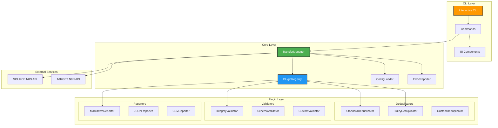

### Diagrama de Fluxo de Dados

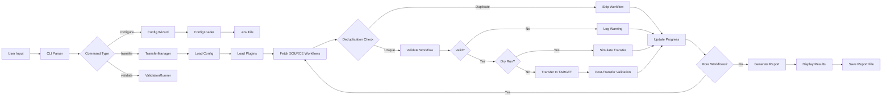

### Estrutura de Diretórios

```
scripts/admin/n8n-transfer/
├── index.js                          # Entry point, exports public API
├── package.json                      # Dependencies, scripts
├── README.md                         # Quick start guide
│
├── core/                             # Core system (minimal, stable)
│   ├── transfer-manager.js           # Main orchestrator
│   ├── plugin-registry.js            # Plugin discovery and loading
│   ├── config-loader.js              # Config validation and loading
│   ├── error-reporter.js             # Error handling utilities
│   ├── logger.js                     # Structured logging
│   └── http-client.js                # N8N API client with retry logic
│
├── plugins/                          # Plugin system
│   ├── index.js                      # Plugin interface definitions
│   ├── deduplicators/
│   │   ├── standard-deduplicator.js  # Built-in: exact name + tags match
│   │   ├── fuzzy-deduplicator.js     # Built-in: fuzzy string matching
│   │   └── README.md                 # How to create custom deduplicators
│   ├── validators/
│   │   ├── integrity-validator.js    # Built-in: pre/post transfer validation
│   │   ├── schema-validator.js       # Built-in: workflow schema validation
│   │   └── README.md                 # How to create custom validators
│   └── reporters/
│       ├── markdown-reporter.js      # Built-in: Markdown report
│       ├── json-reporter.js          # Built-in: JSON report
│       ├── csv-reporter.js           # Built-in: CSV report
│       └── README.md                 # How to create custom reporters
│
├── cli/                              # Interactive CLI
│   ├── interactive-cli.js            # Main CLI entry point
│   ├── commands/
│   │   ├── transfer.js               # Transfer command with wizard
│   │   ├── configure.js              # Interactive config wizard
│   │   ├── validate.js               # Validation-only command
│   │   ├── list-plugins.js           # List available plugins
│   │   └── help.js                   # Contextual help system
│   ├── ui/
│   │   ├── components.js             # Reusable UI components
│   │   ├── themes.js                 # Color themes and styles
│   │   └── progress-bar.js           # Progress indicators
│   └── i18n/
│       ├── pt-BR.json                # Portuguese translations
│       └── en-US.json                # English translations
│
├── docs/                             # Documentation
│   ├── architecture/
│   │   ├── ADR-001-plugin-system.md  # Architecture Decision Record
│   │   ├── ADR-002-cli-ux.md         # CLI UX decisions
│   │   └── ADR-003-error-handling.md # Error handling strategy
│   ├── guides/
│   │   ├── quick-start.md            # 5-minute getting started
│   │   ├── configuration.md          # Config options explained
│   │   ├── creating-plugins.md       # Plugin development guide
│   │   └── troubleshooting.md        # Common issues and solutions
│   └── api/
│       └── api-reference.md          # Full API documentation
│
├── tests/                            # Test suite
│   ├── unit/
│   │   ├── core/                     # Core component tests
│   │   ├── plugins/                  # Plugin tests
│   │   └── cli/                      # CLI tests
│   ├── integration/
│   │   ├── transfer-flow.test.js     # End-to-end transfer tests
│   │   └── plugin-registry.test.js   # Plugin loading tests
│   ├── fixtures/
│   │   ├── mock-workflows.json       # Test data
│   │   └── mock-api-responses.json   # API mocks
│   └── helpers/
│       └── test-utils.js             # Test utilities
│
├── config/                           # Configuration
│   ├── default.json                  # Default configuration
│   └── schema.json                   # Config validation schema
│
├── logs/                             # Log files (gitignored)
│   └── .gitkeep
│
└── reports/                          # Generated reports (gitignored)
    └── .gitkeep
```

---

## Design de Componentes

### TransferManager (Core)

**Responsabilidades:**
- Orquestrar todo o processo de transferência de workflows
- Coordenar plugins (deduplicators, validators, reporters)
- Gerenciar estado de progresso e estatísticas
- Implementar dry-run mode
- Fornecer API pública para operações de transferência

**Interfaces:**

```typescript
/**
 * Main API for N8N workflow transfers
 *
 * @example Basic transfer
 * const manager = new TransferManager();
 * await manager.transfer({
 *   from: 'source',
 *   to: 'target',
 *   interactive: true
 * });
 *
 * @example Dry run with custom deduplicator
 * await manager.transfer({
 *   from: 'source',
 *   to: 'target',
 *   dryRun: true,
 *   plugins: {
 *     deduplicator: 'fuzzy'
 *   }
 * });
 */
class TransferManager {
  constructor(config: TransferConfig);

  /**
   * Transfer workflows from SOURCE to TARGET
   * @returns TransferResult with detailed statistics
   */
  async transfer(options: TransferOptions): Promise<TransferResult>;

  /**
   * Validate workflows without transferring
   * @returns ValidationResult with issues found
   */
  async validate(options: ValidationOptions): Promise<ValidationResult>;

  /**
   * Get current transfer progress (for async operations)
   * @returns TransferProgress with current state
   */
  getProgress(): TransferProgress;

  /**
   * Cancel ongoing transfer gracefully
   */
  async cancel(): Promise<void>;

  /**
   * Register custom plugin at runtime
   */
  registerPlugin(plugin: Plugin): void;
}

interface TransferOptions {
  from: 'source' | string;              // SOURCE instance identifier
  to: 'target' | string;                // TARGET instance identifier
  dryRun?: boolean;                     // Simulate without actual transfer
  interactive?: boolean;                // Enable interactive prompts
  filters?: {
    workflowIds?: string[];             // Transfer only specific IDs
    workflowNames?: string[];           // Transfer by name patterns
    tags?: string[];                    // Transfer workflows with tags
    excludeTags?: string[];             // Exclude workflows with tags
  };
  plugins?: {
    deduplicator?: string;              // Deduplicator plugin name
    validators?: string[];              // Validator plugin names
    reporters?: string[];               // Reporter plugin names
  };
  options?: {
    skipCredentials?: boolean;          // Skip workflows with credentials
    validatePostTransfer?: boolean;     // Enable post-transfer validation
    parallelism?: number;               // Concurrent transfers (default: 3)
    timeout?: number;                   // Timeout per workflow (ms)
  };
}

interface TransferResult {
  success: boolean;
  stats: {
    total: number;                      // Total workflows processed
    transferred: number;                // Successfully transferred
    skipped: number;                    // Skipped (duplicates)
    failed: number;                     // Failed transfers
    duration: number;                   // Total duration (ms)
  };
  workflows: {
    transferred: WorkflowTransferInfo[];
    skipped: WorkflowSkipInfo[];
    failed: WorkflowFailureInfo[];
  };
  reports: ReportFile[];                // Generated report files
}

interface WorkflowTransferInfo {
  sourceId: string;
  targetId: string;
  name: string;
  tags: string[];
  duration: number;
  validated: boolean;
}

interface WorkflowSkipInfo {
  sourceId: string;
  name: string;
  reason: 'duplicate' | 'filtered' | 'invalid' | 'credentials';
  details: string;
}

interface WorkflowFailureInfo {
  sourceId: string;
  name: string;
  error: {
    code: string;
    message: string;
    suggestion: string;
  };
}
```

**Dependências:**
- `PluginRegistry`: Para carregar e gerenciar plugins
- `ConfigLoader`: Para validar e carregar configuração
- `HttpClient`: Para comunicação com APIs N8N
- `ErrorReporter`: Para tratamento padronizado de erros
- `Logger`: Para logging estruturado

**Implementação Chave:**

```javascript
// transfer-manager.js (pseudocódigo simplificado)
class TransferManager {
  async transfer(options) {
    // 1. Validação inicial
    this.validateOptions(options);

    // 2. Carregar configuração e plugins
    const config = await this.configLoader.load();
    const deduplicator = this.pluginRegistry.getDeduplicator(options.plugins?.deduplicator);
    const validators = this.pluginRegistry.getValidators(options.plugins?.validators);
    const reporters = this.pluginRegistry.getReporters(options.plugins?.reporters);

    // 3. Testar conectividade
    await this.testConnectivity(config);

    // 4. Buscar workflows do SOURCE
    const sourceWorkflows = await this.fetchSourceWorkflows(config.source, options.filters);

    // 5. Buscar workflows do TARGET (para deduplicação)
    const targetWorkflows = await this.fetchTargetWorkflows(config.target);

    // 6. Processar cada workflow
    const results = {
      transferred: [],
      skipped: [],
      failed: []
    };

    for (const workflow of sourceWorkflows) {
      try {
        // Deduplication check
        const isDuplicate = await deduplicator.check(workflow, targetWorkflows);
        if (isDuplicate) {
          results.skipped.push({ ...workflow, reason: 'duplicate' });
          this.updateProgress('skipped');
          continue;
        }

        // Pre-transfer validation
        const validationErrors = await this.runValidators(validators, workflow, 'pre');
        if (validationErrors.length > 0) {
          results.skipped.push({ ...workflow, reason: 'invalid', details: validationErrors });
          this.updateProgress('skipped');
          continue;
        }

        // Transfer (or simulate if dry-run)
        if (options.dryRun) {
          results.transferred.push({ ...workflow, simulated: true });
        } else {
          const transferred = await this.transferWorkflow(workflow, config.target);

          // Post-transfer validation (optional)
          if (options.options?.validatePostTransfer) {
            await this.runValidators(validators, transferred, 'post');
          }

          results.transferred.push(transferred);
        }

        this.updateProgress('transferred');

      } catch (error) {
        results.failed.push({
          ...workflow,
          error: this.errorReporter.format(error)
        });
        this.updateProgress('failed');
      }
    }

    // 7. Gerar relatórios
    const reportFiles = await this.generateReports(reporters, results, options);

    // 8. Retornar resultado
    return {
      success: results.failed.length === 0,
      stats: this.calculateStats(results),
      workflows: results,
      reports: reportFiles
    };
  }
}
```

---

### PluginRegistry (Core)

**Responsabilidades:**
- Descobrir e carregar plugins disponíveis
- Validar interfaces de plugins
- Fornecer acesso a plugins por tipo e nome
- Permitir registro de plugins customizados em runtime

**Interfaces:**

```typescript
/**
 * Central registry for all plugins
 *
 * @example Register custom plugin
 * const registry = new PluginRegistry();
 * registry.register({
 *   type: 'deduplicator',
 *   name: 'my-custom-deduplicator',
 *   plugin: new MyCustomDeduplicator()
 * });
 */
class PluginRegistry {
  constructor();

  /**
   * Load all plugins from standard directories
   */
  async loadAll(): Promise<void>;

  /**
   * Register a plugin manually
   */
  register(entry: PluginEntry): void;

  /**
   * Get deduplicator by name (default: 'standard')
   */
  getDeduplicator(name?: string): Deduplicator;

  /**
   * Get validators by names (default: ['integrity'])
   */
  getValidators(names?: string[]): Validator[];

  /**
   * Get reporters by names (default: ['markdown'])
   */
  getReporters(names?: string[]): Reporter[];

  /**
   * List all available plugins
   */
  list(): PluginInfo[];
}

interface PluginEntry {
  type: 'deduplicator' | 'validator' | 'reporter';
  name: string;
  plugin: Plugin;
}

interface PluginInfo {
  type: string;
  name: string;
  description: string;
  version: string;
  builtin: boolean;
}
```

**Dependências:**
- `Logger`: Para logging de plugin loading

---

### ConfigLoader (Core)

**Responsabilidades:**
- Carregar configuração de múltiplas fontes (.env, config files, args)
- Validar configuração contra schema
- Fornecer defaults sensíveis
- Testar conectividade com instâncias N8N

**Interfaces:**

```typescript
/**
 * Configuration loader with validation
 *
 * @example Load config
 * const loader = new ConfigLoader();
 * const config = await loader.load();
 *
 * @example Test connectivity
 * const canConnect = await loader.testConnectivity(config);
 */
class ConfigLoader {
  constructor(options?: ConfigLoaderOptions);

  /**
   * Load and validate configuration
   * @throws {ConfigError} if configuration is invalid
   */
  async load(): Promise<N8NTransferConfig>;

  /**
   * Test connectivity to N8N instances
   * @returns Connectivity test results
   */
  async testConnectivity(config: N8NTransferConfig): Promise<ConnectivityResult>;

  /**
   * Validate configuration against schema
   * @throws {ValidationError} if config is invalid
   */
  validate(config: unknown): N8NTransferConfig;
}

interface N8NTransferConfig {
  source: {
    url: string;                        // SOURCE_N8N_URL
    apiKey: string;                     // SOURCE_N8N_API_KEY
  };
  target: {
    url: string;                        // TARGET_N8N_URL
    apiKey: string;                     // TARGET_N8N_API_KEY
  };
  options?: {
    logLevel?: 'debug' | 'info' | 'warn' | 'error';
    logDir?: string;                    // Default: './logs'
    reportsDir?: string;                // Default: './reports'
    timeout?: number;                   // Default: 10000ms
    parallelism?: number;               // Default: 3
  };
}

interface ConnectivityResult {
  source: {
    reachable: boolean;
    authenticated: boolean;
    error?: string;
  };
  target: {
    reachable: boolean;
    authenticated: boolean;
    error?: string;
  };
}
```

**Dependências:**
- `HttpClient`: Para testar conectividade
- Schema validation library (e.g., Zod, Joi)

---

### HttpClient (Core)

**Responsabilidades:**
- Abstrair comunicação com N8N API
- Implementar retry logic com backoff exponencial
- Rate limiting para evitar sobrecarga
- Logging de requisições (mascarando API keys)

**Interfaces:**

```typescript
/**
 * HTTP client for N8N API with retry logic
 *
 * @example Fetch workflows
 * const client = new HttpClient({ baseUrl: 'https://n8n.example.com', apiKey: 'xxx' });
 * const workflows = await client.getWorkflows();
 */
class HttpClient {
  constructor(config: HttpClientConfig);

  /**
   * Fetch all workflows from N8N instance
   */
  async getWorkflows(filters?: WorkflowFilters): Promise<Workflow[]>;

  /**
   * Create workflow in N8N instance
   */
  async createWorkflow(workflow: Workflow): Promise<Workflow>;

  /**
   * Get single workflow by ID
   */
  async getWorkflow(id: string): Promise<Workflow>;

  /**
   * Test API connectivity
   */
  async testConnection(): Promise<boolean>;
}

interface HttpClientConfig {
  baseUrl: string;
  apiKey: string;
  timeout?: number;                     // Default: 10000ms
  retries?: number;                     // Default: 3
  retryDelay?: number;                  // Default: 1000ms (exponential backoff)
}

interface WorkflowFilters {
  active?: boolean;
  tags?: string[];
}

interface Workflow {
  id?: string;
  name: string;
  active: boolean;
  nodes: Node[];
  connections: Record<string, Connection>;
  tags?: Tag[];
  settings?: Record<string, unknown>;
  staticData?: Record<string, unknown>;
}
```

**Dependências:**
- HTTP library (e.g., axios, node-fetch)
- `Logger`: Para logging de requisições

---

## Modelo de Dados

### Core Data Structures

```typescript
/**
 * Workflow representation (matches N8N API schema)
 */
interface Workflow {
  id?: string;                          // N8N workflow ID (undefined for new workflows)
  name: string;                         // Workflow name
  active: boolean;                      // Is workflow active?
  nodes: Node[];                        // Workflow nodes
  connections: Record<string, Connection>; // Node connections
  tags?: Tag[];                         // Tags for organization
  settings?: WorkflowSettings;          // Workflow settings
  staticData?: Record<string, unknown>; // Static data storage
  createdAt?: string;                   // ISO timestamp
  updatedAt?: string;                   // ISO timestamp
}

/**
 * Workflow node (N8N node)
 */
interface Node {
  id: string;                           // Unique node ID
  name: string;                         // Node name
  type: string;                         // Node type (e.g., 'n8n-nodes-base.httpRequest')
  position: [number, number];           // [x, y] coordinates
  parameters: Record<string, unknown>;  // Node configuration
  credentials?: Record<string, string>; // Credential references
  typeVersion?: number;                 // Node type version
}

/**
 * Connection between nodes
 */
interface Connection {
  main: Array<Array<{
    node: string;                       // Target node name
    type: string;                       // Connection type
    index: number;                      // Output index
  }>>;
}

/**
 * Workflow tag
 */
interface Tag {
  id?: string;                          // Tag ID
  name: string;                         // Tag name
  createdAt?: string;                   // ISO timestamp
  updatedAt?: string;                   // ISO timestamp
}

/**
 * Workflow settings
 */
interface WorkflowSettings {
  executionOrder?: 'v0' | 'v1';         // Execution order version
  saveDataErrorExecution?: 'all' | 'none';
  saveDataSuccessExecution?: 'all' | 'none';
  saveManualExecutions?: boolean;
  callerPolicy?: string;
  timezone?: string;
}
```

### Transfer State Model

```typescript
/**
 * Transfer operation state
 */
interface TransferState {
  id: string;                           // Unique transfer ID
  startedAt: string;                    // ISO timestamp
  completedAt?: string;                 // ISO timestamp
  status: 'running' | 'completed' | 'failed' | 'cancelled';
  progress: {
    total: number;                      // Total workflows to process
    processed: number;                  // Workflows processed so far
    transferred: number;                // Successfully transferred
    skipped: number;                    // Skipped (duplicates, filtered)
    failed: number;                     // Failed transfers
  };
  currentWorkflow?: {
    name: string;
    step: 'fetching' | 'validating' | 'transferring' | 'verifying';
  };
  options: TransferOptions;             // Transfer options used
}

/**
 * Transfer result summary
 */
interface TransferSummary {
  transferId: string;
  timestamp: string;                    // ISO timestamp
  source: {
    url: string;                        // SOURCE instance URL (without credentials)
    totalWorkflows: number;
  };
  target: {
    url: string;                        // TARGET instance URL (without credentials)
    totalWorkflows: number;             // Total workflows in TARGET after transfer
  };
  stats: {
    total: number;
    transferred: number;
    skipped: number;
    failed: number;
    duration: number;                   // Duration in ms
    successRate: number;                // Percentage (0-100)
  };
  workflows: {
    transferred: WorkflowTransferInfo[];
    skipped: WorkflowSkipInfo[];
    failed: WorkflowFailureInfo[];
  };
}
```

### Plugin Interface Models

```typescript
/**
 * Base plugin interface
 */
interface Plugin {
  name: string;                         // Unique plugin name
  version: string;                      // Semver version
  description: string;                  // Human-readable description
  type: 'deduplicator' | 'validator' | 'reporter';
}

/**
 * Deduplicator plugin interface
 *
 * @example Standard deduplicator
 * class StandardDeduplicator implements Deduplicator {
 *   async check(sourceWorkflow, targetWorkflows) {
 *     return targetWorkflows.some(tw =>
 *       tw.name === sourceWorkflow.name &&
 *       this.tagsMatch(tw.tags, sourceWorkflow.tags)
 *     );
 *   }
 * }
 */
interface Deduplicator extends Plugin {
  type: 'deduplicator';

  /**
   * Check if workflow is duplicate
   * @returns true if duplicate found, false otherwise
   */
  check(
    sourceWorkflow: Workflow,
    targetWorkflows: Workflow[]
  ): Promise<boolean>;

  /**
   * Get reason for duplication (for reporting)
   */
  getReason(
    sourceWorkflow: Workflow,
    duplicateWorkflow: Workflow
  ): string;
}

/**
 * Validator plugin interface
 *
 * @example Integrity validator
 * class IntegrityValidator implements Validator {
 *   async validate(workflow, phase) {
 *     const errors = [];
 *     if (!workflow.name) errors.push('Workflow name is required');
 *     if (workflow.nodes.length === 0) errors.push('Workflow has no nodes');
 *     return errors;
 *   }
 * }
 */
interface Validator extends Plugin {
  type: 'validator';

  /**
   * Validate workflow
   * @returns Array of validation errors (empty if valid)
   */
  validate(
    workflow: Workflow,
    phase: 'pre' | 'post'
  ): Promise<ValidationError[]>;
}

interface ValidationError {
  code: string;                         // Error code (e.g., 'MISSING_NAME')
  message: string;                      // Human-readable message
  severity: 'error' | 'warning';        // Error severity
  field?: string;                       // Field that failed validation
}

/**
 * Reporter plugin interface
 *
 * @example Markdown reporter
 * class MarkdownReporter implements Reporter {
 *   async generate(summary, options) {
 *     const markdown = this.formatSummary(summary);
 *     const filePath = path.join(options.outputDir, `report-${Date.now()}.md`);
 *     await fs.writeFile(filePath, markdown);
 *     return { filePath, format: 'markdown' };
 *   }
 * }
 */
interface Reporter extends Plugin {
  type: 'reporter';

  /**
   * Generate report from transfer summary
   * @returns Information about generated report file
   */
  generate(
    summary: TransferSummary,
    options: ReporterOptions
  ): Promise<ReportFile>;
}

interface ReporterOptions {
  outputDir: string;                    // Directory for report files
  format?: 'markdown' | 'json' | 'csv'; // Report format
  includeDetails?: boolean;             // Include detailed workflow info
}

interface ReportFile {
  filePath: string;                     // Absolute path to report file
  format: string;                       // Report format
  size: number;                         // File size in bytes
}
```

---

## Processos de Negócio

### Processo 1: Setup Inicial (First-Time User)

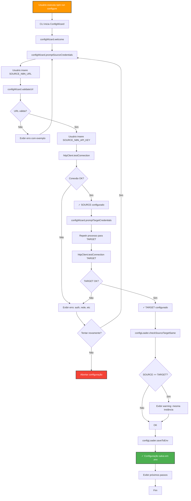

### Processo 2: Transferência Interativa com Wizard

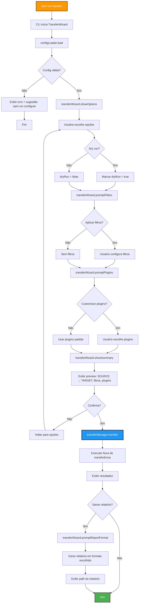

### Processo 3: Fluxo de Transferência (TransferManager)

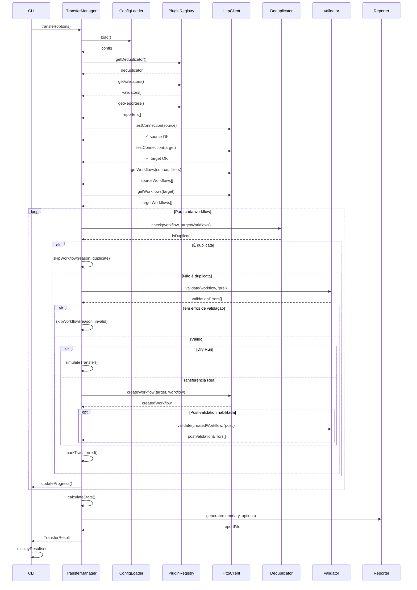

### Processo 4: Plugin Loading e Discovery

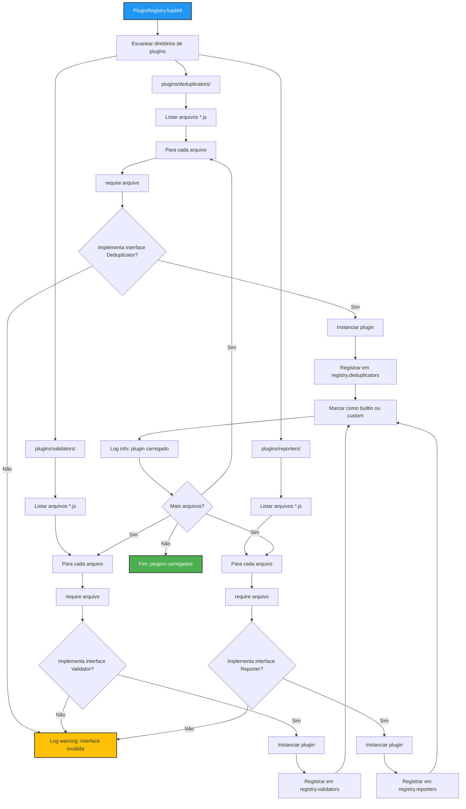

### Processo 5: Geração de Relatório Multi-Formato

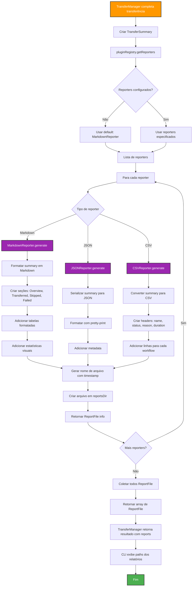

---

## Sistema de Plugins

### Plugin Architecture

O sistema de plugins permite extensão de funcionalidades sem modificar o core. Três tipos de plugins são suportados:

1. **Deduplicators**: Lógica customizada para detectar workflows duplicados
2. **Validators**: Validações customizadas pre/post transferência
3. **Reporters**: Formatos customizados de relatórios

### Plugin Interface Contract

Todos os plugins devem:
- Implementar interface específica do tipo (Deduplicator, Validator, Reporter)
- Exportar classe ou factory function
- Incluir metadata (name, version, description)
- Ser stateless (não manter estado entre invocações)
- Tratar erros gracefully

### Built-in Plugins

#### StandardDeduplicator

**Lógica:** Workflow é considerado duplicado se nome E tags correspondem exatamente.

```javascript
/**
 * Standard deduplicator: exact name + tags match
 *
 * @example
 * const dedup = new StandardDeduplicator();
 * const isDuplicate = await dedup.check(sourceWorkflow, targetWorkflows);
 */
class StandardDeduplicator {
  name = 'standard';
  version = '1.0.0';
  description = 'Detecta duplicatas por correspondência exata de nome e tags';
  type = 'deduplicator';

  async check(sourceWorkflow, targetWorkflows) {
    return targetWorkflows.some(tw =>
      tw.name === sourceWorkflow.name &&
      this.tagsMatch(tw.tags || [], sourceWorkflow.tags || [])
    );
  }

  getReason(sourceWorkflow, duplicateWorkflow) {
    return `Workflow com nome "${sourceWorkflow.name}" e tags idênticas já existe no TARGET (ID: ${duplicateWorkflow.id})`;
  }

  tagsMatch(tags1, tags2) {
    if (tags1.length !== tags2.length) return false;
    const names1 = tags1.map(t => t.name).sort();
    const names2 = tags2.map(t => t.name).sort();
    return names1.every((name, i) => name === names2[i]);
  }
}
```

#### FuzzyDeduplicator

**Lógica:** Workflow é considerado duplicado se nome é similar (fuzzy match) E tags têm overlap significativo.

```javascript
/**
 * Fuzzy deduplicator: approximate name + tag overlap
 *
 * Útil quando workflows têm nomes levemente diferentes mas são essencialmente os mesmos
 *
 * @example
 * const dedup = new FuzzyDeduplicator({ threshold: 0.85 });
 * const isDuplicate = await dedup.check(sourceWorkflow, targetWorkflows);
 */
class FuzzyDeduplicator {
  name = 'fuzzy';
  version = '1.0.0';
  description = 'Detecta duplicatas usando similaridade fuzzy de nome e overlap de tags';
  type = 'deduplicator';

  constructor(options = {}) {
    this.nameThreshold = options.nameThreshold || 0.8;    // 80% similarity
    this.tagOverlap = options.tagOverlap || 0.5;          // 50% overlap
  }

  async check(sourceWorkflow, targetWorkflows) {
    return targetWorkflows.some(tw => {
      const nameSimilarity = this.calculateSimilarity(
        sourceWorkflow.name.toLowerCase(),
        tw.name.toLowerCase()
      );

      const tagOverlap = this.calculateTagOverlap(
        sourceWorkflow.tags || [],
        tw.tags || []
      );

      return nameSimilarity >= this.nameThreshold && tagOverlap >= this.tagOverlap;
    });
  }

  getReason(sourceWorkflow, duplicateWorkflow) {
    const similarity = this.calculateSimilarity(
      sourceWorkflow.name.toLowerCase(),
      duplicateWorkflow.name.toLowerCase()
    );
    return `Workflow similar encontrado: "${duplicateWorkflow.name}" (${Math.round(similarity * 100)}% de similaridade)`;
  }

  calculateSimilarity(str1, str2) {
    // Levenshtein distance algorithm
    // Implementação simplificada (use biblioteca como 'string-similarity' em produção)
    const len1 = str1.length;
    const len2 = str2.length;
    const matrix = Array(len2 + 1).fill(null).map(() => Array(len1 + 1).fill(null));

    for (let i = 0; i <= len1; i++) matrix[0][i] = i;
    for (let j = 0; j <= len2; j++) matrix[j][0] = j;

    for (let j = 1; j <= len2; j++) {
      for (let i = 1; i <= len1; i++) {
        const indicator = str1[i - 1] === str2[j - 1] ? 0 : 1;
        matrix[j][i] = Math.min(
          matrix[j][i - 1] + 1,
          matrix[j - 1][i] + 1,
          matrix[j - 1][i - 1] + indicator
        );
      }
    }

    const distance = matrix[len2][len1];
    return 1 - distance / Math.max(len1, len2);
  }

  calculateTagOverlap(tags1, tags2) {
    if (tags1.length === 0 && tags2.length === 0) return 1.0;
    if (tags1.length === 0 || tags2.length === 0) return 0.0;

    const names1 = new Set(tags1.map(t => t.name.toLowerCase()));
    const names2 = new Set(tags2.map(t => t.name.toLowerCase()));

    const intersection = [...names1].filter(name => names2.has(name)).length;
    const union = new Set([...names1, ...names2]).size;

    return intersection / union;
  }
}
```

#### IntegrityValidator

**Lógica:** Valida estrutura básica do workflow (campos obrigatórios, nodes, connections).

```javascript
/**
 * Integrity validator: validates workflow structure
 *
 * @example
 * const validator = new IntegrityValidator();
 * const errors = await validator.validate(workflow, 'pre');
 */
class IntegrityValidator {
  name = 'integrity';
  version = '1.0.0';
  description = 'Valida integridade estrutural de workflows (campos obrigatórios, nodes, connections)';
  type = 'validator';

  async validate(workflow, phase) {
    const errors = [];

    // Validações de campos obrigatórios
    if (!workflow.name || workflow.name.trim() === '') {
      errors.push({
        code: 'MISSING_NAME',
        message: 'Workflow deve ter um nome',
        severity: 'error',
        field: 'name'
      });
    }

    if (!Array.isArray(workflow.nodes)) {
      errors.push({
        code: 'INVALID_NODES',
        message: 'Workflow deve ter array de nodes',
        severity: 'error',
        field: 'nodes'
      });
    } else if (workflow.nodes.length === 0) {
      errors.push({
        code: 'EMPTY_WORKFLOW',
        message: 'Workflow não contém nodes',
        severity: 'warning',
        field: 'nodes'
      });
    }

    if (!workflow.connections || typeof workflow.connections !== 'object') {
      errors.push({
        code: 'INVALID_CONNECTIONS',
        message: 'Workflow deve ter objeto de connections',
        severity: 'error',
        field: 'connections'
      });
    }

    // Validações específicas de fase
    if (phase === 'post') {
      if (!workflow.id) {
        errors.push({
          code: 'MISSING_ID',
          message: 'Workflow criado deve ter ID',
          severity: 'error',
          field: 'id'
        });
      }
    }

    // Validar integridade de connections
    if (Array.isArray(workflow.nodes) && workflow.connections) {
      const nodeNames = new Set(workflow.nodes.map(n => n.name));

      for (const [sourceName, connections] of Object.entries(workflow.connections)) {
        if (!nodeNames.has(sourceName)) {
          errors.push({
            code: 'ORPHAN_CONNECTION',
            message: `Connection referencia node inexistente: ${sourceName}`,
            severity: 'error',
            field: 'connections'
          });
        }

        // Validar targets
        if (connections.main) {
          connections.main.flat().forEach(conn => {
            if (conn.node && !nodeNames.has(conn.node)) {
              errors.push({
                code: 'INVALID_TARGET',
                message: `Connection target inexistente: ${conn.node}`,
                severity: 'error',
                field: 'connections'
              });
            }
          });
        }
      }
    }

    return errors;
  }
}
```

#### MarkdownReporter

**Lógica:** Gera relatório formatado em Markdown com tabelas e estatísticas.

```javascript
/**
 * Markdown reporter: generates formatted Markdown report
 *
 * @example
 * const reporter = new MarkdownReporter();
 * const reportFile = await reporter.generate(summary, { outputDir: './reports' });
 */
class MarkdownReporter {
  name = 'markdown';
  version = '1.0.0';
  description = 'Gera relatórios em formato Markdown com tabelas formatadas';
  type = 'reporter';

  async generate(summary, options) {
    const markdown = this.formatReport(summary, options);

    const timestamp = new Date().toISOString().replace(/[:.]/g, '-');
    const fileName = `transfer-report-${timestamp}.md`;
    const filePath = path.join(options.outputDir, fileName);

    await fs.mkdir(options.outputDir, { recursive: true });
    await fs.writeFile(filePath, markdown, 'utf8');

    return {
      filePath,
      format: 'markdown',
      size: Buffer.byteLength(markdown, 'utf8')
    };
  }

  formatReport(summary, options) {
    const { stats, workflows, source, target } = summary;

    let md = `# Relatório de Transferência N8N\n\n`;
    md += `**Data:** ${new Date(summary.timestamp).toLocaleString('pt-BR')}\n`;
    md += `**Transfer ID:** \`${summary.transferId}\`\n\n`;

    md += `## Instâncias\n\n`;
    md += `- **SOURCE:** ${source.url} (${source.totalWorkflows} workflows)\n`;
    md += `- **TARGET:** ${target.url} (${target.totalWorkflows} workflows)\n\n`;

    md += `## Estatísticas\n\n`;
    md += `| Métrica | Valor |\n`;
    md += `|---------|-------|\n`;
    md += `| Total Processado | ${stats.total} |\n`;
    md += `| ✅ Transferidos | ${stats.transferred} |\n`;
    md += `| ⏭️ Pulados | ${stats.skipped} |\n`;
    md += `| ❌ Falhas | ${stats.failed} |\n`;
    md += `| Taxa de Sucesso | ${stats.successRate.toFixed(1)}% |\n`;
    md += `| Duração Total | ${this.formatDuration(stats.duration)} |\n\n`;

    if (workflows.transferred.length > 0) {
      md += `## Workflows Transferidos (${workflows.transferred.length})\n\n`;
      md += `| Nome | SOURCE ID | TARGET ID | Duração |\n`;
      md += `|------|-----------|-----------|----------|\n`;
      workflows.transferred.forEach(w => {
        md += `| ${w.name} | \`${w.sourceId}\` | \`${w.targetId}\` | ${w.duration}ms |\n`;
      });
      md += `\n`;
    }

    if (workflows.skipped.length > 0) {
      md += `## Workflows Pulados (${workflows.skipped.length})\n\n`;
      md += `| Nome | SOURCE ID | Razão |\n`;
      md += `|------|-----------|-------|\n`;
      workflows.skipped.forEach(w => {
        md += `| ${w.name} | \`${w.sourceId}\` | ${w.reason} |\n`;
      });
      md += `\n`;
    }

    if (workflows.failed.length > 0) {
      md += `## Workflows com Falha (${workflows.failed.length})\n\n`;
      md += `| Nome | SOURCE ID | Erro |\n`;
      md += `|------|-----------|------|\n`;
      workflows.failed.forEach(w => {
        md += `| ${w.name} | \`${w.sourceId}\` | ${w.error.code}: ${w.error.message} |\n`;
      });
      md += `\n`;

      md += `### Detalhes de Erros\n\n`;
      workflows.failed.forEach(w => {
        md += `#### ${w.name}\n\n`;
        md += `- **Código:** \`${w.error.code}\`\n`;
        md += `- **Mensagem:** ${w.error.message}\n`;
        md += `- **Sugestão:** ${w.error.suggestion}\n\n`;
      });
    }

    md += `---\n\n`;
    md += `*Relatório gerado automaticamente pelo N8N Transfer System*\n`;

    return md;
  }

  formatDuration(ms) {
    if (ms < 1000) return `${ms}ms`;
    if (ms < 60000) return `${(ms / 1000).toFixed(1)}s`;
    return `${(ms / 60000).toFixed(1)}min`;
  }
}
```

### Como Criar Plugin Customizado

**Exemplo: Custom Deduplicator que ignora capitalização**

```javascript
// plugins/deduplicators/case-insensitive-deduplicator.js

/**
 * Case-insensitive deduplicator
 *
 * Detecta duplicatas ignorando capitalização nos nomes
 * Útil quando workflows podem ter nomes como "Deploy Prod" vs "deploy prod"
 */
class CaseInsensitiveDeduplicator {
  name = 'case-insensitive';
  version = '1.0.0';
  description = 'Detecta duplicatas ignorando capitalização em nomes';
  type = 'deduplicator';

  async check(sourceWorkflow, targetWorkflows) {
    const sourceName = sourceWorkflow.name.toLowerCase();

    return targetWorkflows.some(tw =>
      tw.name.toLowerCase() === sourceName &&
      this.tagsMatch(tw.tags || [], sourceWorkflow.tags || [])
    );
  }

  getReason(sourceWorkflow, duplicateWorkflow) {
    return `Workflow "${duplicateWorkflow.name}" corresponde a "${sourceWorkflow.name}" (ignorando capitalização)`;
  }

  tagsMatch(tags1, tags2) {
    if (tags1.length !== tags2.length) return false;
    const names1 = tags1.map(t => t.name.toLowerCase()).sort();
    const names2 = tags2.map(t => t.name.toLowerCase()).sort();
    return names1.every((name, i) => name === names2[i]);
  }
}

module.exports = CaseInsensitiveDeduplicator;
```

**Uso do plugin customizado:**

```bash
# CLI detecta automaticamente plugin em plugins/deduplicators/
npm run transfer -- --plugin=case-insensitive

# Ou via API programática
const transferManager = new TransferManager();
transferManager.registerPlugin(new CaseInsensitiveDeduplicator());
await transferManager.transfer({ plugins: { deduplicator: 'case-insensitive' } });
```

---

## Interactive CLI Design

### Árvore de Comandos

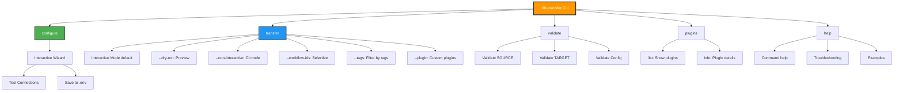

### Componentes Visuais da CLI

#### 1. Welcome Screen

```
╔══════════════════════════════════════════════════════════════════════╗
║                                                                      ║
║                  🚀  N8N Transfer System v3.0                        ║
║                                                                      ║
║         Transferência de Workflows entre Instâncias N8N              ║
║                                                                      ║
╚══════════════════════════════════════════════════════════════════════╝

✨  Modo Interativo Ativado

📍  SOURCE: https://source.n8n.example.com
📍  TARGET: https://target.n8n.example.com

O que você gostaria de fazer?

  1. Transferir Workflows
  2. Preview (Dry Run)
  3. Validar Configuração
  4. Listar Plugins Disponíveis
  5. Ajuda

❯ Escolha uma opção (1-5):
```

#### 2. Configuration Wizard

```
╔══════════════════════════════════════════════════════════════════════╗
║                     Configuração Inicial                             ║
╚══════════════════════════════════════════════════════════════════════╝

Vamos configurar suas instâncias N8N. Você precisará de:
  • URL da instância SOURCE
  • API key da instância SOURCE
  • URL da instância TARGET
  • API key da instância TARGET

────────────────────────────────────────────────────────────────────────

📦  Passo 1 de 3: Instância SOURCE

❯ URL da instância SOURCE:
  Exemplo: https://n8n.mycompany.com
  _

[Após entrada da URL]

✓ URL válida: https://source.example.com

❯ API Key da SOURCE:
  (entrada mascarada: ****************)

[Testando conexão...]

⏳  Testando conectividade com SOURCE...

✓ Conexão estabelecida com sucesso!
✓ Autenticação OK
✓ 127 workflows encontrados

────────────────────────────────────────────────────────────────────────

📦  Passo 2 de 3: Instância TARGET

[Processo similar para TARGET...]

────────────────────────────────────────────────────────────────────────

💾  Passo 3 de 3: Salvando Configuração

✓ Configuração salva em .env

╔══════════════════════════════════════════════════════════════════════╗
║                     ✅  Configuração Completa!                       ║
╚══════════════════════════════════════════════════════════════════════╝

Próximos passos:

  1. Execute 'npm run transfer' para iniciar transferência
  2. Ou 'npm run transfer -- --dry-run' para preview
  3. Execute 'npm run help' para ver todas as opções

Pressione qualquer tecla para continuar...
```

#### 3. Transfer Preview (Dry Run)

```
╔══════════════════════════════════════════════════════════════════════╗
║                  Preview de Transferência (Dry Run)                  ║
╚══════════════════════════════════════════════════════════════════════╝

📊  Configuração

  SOURCE → TARGET
  https://source.example.com → https://target.example.com

  Plugin de Deduplicação: standard
  Validadores: integrity
  Relatórios: markdown

────────────────────────────────────────────────────────────────────────

📋  Análise de Workflows

  Total no SOURCE: 127 workflows
  Total no TARGET: 89 workflows

  ✅  A transferir: 32 workflows
  ⏭️  A pular (duplicatas): 95 workflows
  ❌  Inválidos: 0 workflows

────────────────────────────────────────────────────────────────────────

📝  Workflows a Transferir (primeiros 10)

  1. Deploy Production Pipeline
  2. Customer Onboarding Flow
  3. Weekly Report Generator
  4. Slack Notification Bot
  5. Database Backup Scheduler
  6. Email Campaign Automator
  7. GitHub Issue Sync
  8. Invoice Processing
  9. Lead Scoring Model
  10. Social Media Publisher

  ... e mais 22 workflows

────────────────────────────────────────────────────────────────────────

⏭️  Workflows a Pular (primeiros 5)

  1. ❌  "User Registration" - duplicata (nome + tags idênticas)
  2. ❌  "Data Sync" - duplicata (nome + tags idênticas)
  3. ❌  "Monitor Service" - duplicata (nome + tags idênticas)
  4. ❌  "Send Welcome Email" - duplicata (nome + tags idênticas)
  5. ❌  "Process Payments" - duplicata (nome + tags idênticas)

  ... e mais 90 workflows

────────────────────────────────────────────────────────────────────────

⏱️  Estimativas

  Tempo estimado: ~5 minutos
  Workflows/minuto: ~6

────────────────────────────────────────────────────────────────────────

ℹ️  Este é um DRY RUN. Nenhuma mudança será feita.

Deseja prosseguir com a transferência real?

  1. Sim, executar transferência agora
  2. Não, voltar ao menu
  3. Salvar preview e sair

❯ Escolha uma opção (1-3):
```

#### 4. Transfer Progress

```
╔══════════════════════════════════════════════════════════════════════╗
║                     Transferência em Andamento                       ║
╚══════════════════════════════════════════════════════════════════════╝

📊  Progresso Geral

  [████████████████████░░░░░░░░]  75% (24/32)

  ✅  Transferidos: 24
  ⏭️  Pulados: 95
  ❌  Falhas: 0

  Tempo decorrido: 3m 45s
  Tempo restante: ~1m 15s

────────────────────────────────────────────────────────────────────────

🔄  Workflow Atual

  ⏳  Transferindo: "Email Campaign Automator"

      1. ✓ Buscando workflow do SOURCE
      2. ✓ Verificando duplicatas
      3. ✓ Validando estrutura
      4. → Criando no TARGET...

────────────────────────────────────────────────────────────────────────

📝  Últimas Operações

  ✅  "Lead Scoring Model" - Transferido (2.3s)
  ✅  "Invoice Processing" - Transferido (1.8s)
  ✅  "GitHub Issue Sync" - Transferido (3.1s)
  ✅  "Slack Notification Bot" - Transferido (1.5s)

────────────────────────────────────────────────────────────────────────

💡  Dica: Pressione Ctrl+C para cancelar (progresso será salvo)
```

#### 5. Transfer Complete

```
╔══════════════════════════════════════════════════════════════════════╗
║                    ✅  Transferência Concluída!                      ║
╚══════════════════════════════════════════════════════════════════════╝

📊  Resumo Final

  ┌────────────────────────────────┬───────────┐
  │ Métrica                        │ Valor     │
  ├────────────────────────────────┼───────────┤
  │ Total Processado               │ 127       │
  │ ✅  Transferidos               │ 32        │
  │ ⏭️  Pulados (duplicatas)       │ 95        │
  │ ❌  Falhas                     │ 0         │
  │ Taxa de Sucesso                │ 100.0%    │
  │ Duração Total                  │ 5m 12s    │
  └────────────────────────────────┴───────────┘

────────────────────────────────────────────────────────────────────────

📄  Relatórios Gerados

  ✓ Markdown: ./reports/transfer-report-2025-10-02-143022.md
  ✓ JSON: ./reports/transfer-report-2025-10-02-143022.json

────────────────────────────────────────────────────────────────────────

🎉  Workflows transferidos com sucesso para TARGET!

⚠️  Lembre-se:

  • Credenciais NÃO são transferidas automaticamente
  • Configure credenciais manualmente no TARGET se necessário
  • Workflows podem precisar ser ativados manualmente

────────────────────────────────────────────────────────────────────────

O que você gostaria de fazer agora?

  1. Ver relatório detalhado
  2. Transferir mais workflows
  3. Validar workflows transferidos
  4. Sair

❯ Escolha uma opção (1-4):
```

#### 6. Error Display

```
╔══════════════════════════════════════════════════════════════════════╗
║                         ❌  Erro Detectado                           ║
╚══════════════════════════════════════════════════════════════════════╝

🔴  Falha na Autenticação com TARGET

  Código: AUTH_FAILED
  Mensagem: API key inválida ou expirada

────────────────────────────────────────────────────────────────────────

💡  Como Resolver

  1. Verifique se a variável TARGET_N8N_API_KEY está configurada no .env
  2. Confirme que a API key está ativa e não expirou
  3. Execute 'npm run configure' para reconfigurar

────────────────────────────────────────────────────────────────────────

🔍  Detalhes Técnicos

  URL: https://target.example.com/api/v1/workflows
  Status HTTP: 401 Unauthorized
  Timestamp: 2025-10-02 14:30:22

────────────────────────────────────────────────────────────────────────

Deseja tentar reconfigurar agora?

  1. Sim, abrir configuração
  2. Não, sair

❯ Escolha uma opção (1-2):
```

### UI Components (Reusáveis)

```typescript
/**
 * Reusable UI components for CLI
 */
class UIComponents {
  /**
   * Display box with title and content
   */
  static box(title: string, content: string, style?: BoxStyle): void;

  /**
   * Display progress bar
   */
  static progressBar(current: number, total: number, width?: number): string;

  /**
   * Display table with headers and rows
   */
  static table(headers: string[], rows: string[][]): void;

  /**
   * Display numbered list
   */
  static numberedList(items: string[]): void;

  /**
   * Prompt user for input
   */
  static async prompt(question: string, options?: PromptOptions): Promise<string>;

  /**
   * Prompt user for selection
   */
  static async select(question: string, choices: Choice[]): Promise<string>;

  /**
   * Display success message
   */
  static success(message: string): void;

  /**
   * Display error message with suggestions
   */
  static error(message: string, suggestions?: string[]): void;

  /**
   * Display warning message
   */
  static warning(message: string): void;

  /**
   * Display info message
   */
  static info(message: string): void;

  /**
   * Display separator line
   */
  static separator(char?: string, width?: number): void;

  /**
   * Clear screen
   */
  static clear(): void;

  /**
   * Display spinner with message
   */
  static spinner(message: string): Spinner;
}

interface BoxStyle {
  borderColor?: 'blue' | 'green' | 'red' | 'yellow';
  padding?: number;
  align?: 'left' | 'center' | 'right';
}

interface PromptOptions {
  default?: string;
  mask?: boolean;                       // For passwords
  validate?: (value: string) => boolean | string;
}

interface Choice {
  value: string;
  label: string;
  description?: string;
}

interface Spinner {
  update(message: string): void;
  succeed(message?: string): void;
  fail(message?: string): void;
  stop(): void;
}
```

---

## Estratégia de Tratamento de Erros

### Hierarquia de Erros

```typescript
/**
 * Base error class for N8N Transfer System
 */
class N8NTransferError extends Error {
  code: string;
  details?: Record<string, unknown>;
  suggestion?: string;

  constructor(message: string, code: string, details?: Record<string, unknown>) {
    super(message);
    this.name = 'N8NTransferError';
    this.code = code;
    this.details = details;
  }
}

/**
 * Configuration errors (invalid .env, missing variables)
 */
class ConfigError extends N8NTransferError {
  constructor(message: string, details?: Record<string, unknown>) {
    super(message, 'CONFIG_ERROR', details);
    this.name = 'ConfigError';
    this.suggestion = 'Execute "npm run configure" para configurar o sistema';
  }
}

/**
 * Connectivity errors (network, API unreachable)
 */
class ConnectivityError extends N8NTransferError {
  constructor(message: string, details?: Record<string, unknown>) {
    super(message, 'CONNECTIVITY_ERROR', details);
    this.name = 'ConnectivityError';
    this.suggestion = 'Verifique sua conexão de rede e se as URLs estão corretas';
  }
}

/**
 * Authentication errors (invalid API keys)
 */
class AuthError extends N8NTransferError {
  constructor(message: string, details?: Record<string, unknown>) {
    super(message, 'AUTH_ERROR', details);
    this.name = 'AuthError';
    this.suggestion = 'Verifique se suas API keys estão corretas e ativas';
  }
}

/**
 * Validation errors (invalid workflow structure)
 */
class ValidationError extends N8NTransferError {
  constructor(message: string, details?: Record<string, unknown>) {
    super(message, 'VALIDATION_ERROR', details);
    this.name = 'ValidationError';
    this.suggestion = 'Execute "npm run validate" para detalhes de validação';
  }
}

/**
 * Transfer errors (errors during workflow transfer)
 */
class TransferError extends N8NTransferError {
  workflowName?: string;

  constructor(message: string, details?: Record<string, unknown>) {
    super(message, 'TRANSFER_ERROR', details);
    this.name = 'TransferError';
  }
}

/**
 * Plugin errors (plugin loading, execution failures)
 */
class PluginError extends N8NTransferError {
  pluginName?: string;

  constructor(message: string, details?: Record<string, unknown>) {
    super(message, 'PLUGIN_ERROR', details);
    this.name = 'PluginError';
    this.suggestion = 'Execute "npm run plugins list" para ver plugins disponíveis';
  }
}
```

### Error Reporter

```typescript
/**
 * Central error reporting and formatting
 */
class ErrorReporter {
  constructor(private logger: Logger);

  /**
   * Format error for display (includes code, message, suggestion)
   */
  format(error: Error): FormattedError {
    if (error instanceof N8NTransferError) {
      return {
        code: error.code,
        message: error.message,
        suggestion: error.suggestion || 'Execute "npm run help" para ajuda',
        details: error.details
      };
    }

    // Unknown error
    return {
      code: 'UNKNOWN_ERROR',
      message: error.message,
      suggestion: 'Execute com DEBUG=1 para mais detalhes',
      details: { stack: error.stack }
    };
  }

  /**
   * Log error (never exposes credentials)
   */
  log(error: Error, context?: Record<string, unknown>): void {
    const formatted = this.format(error);

    // Sanitize context (remove API keys)
    const sanitized = this.sanitize(context);

    this.logger.error({
      code: formatted.code,
      message: formatted.message,
      details: formatted.details,
      context: sanitized,
      stack: error.stack
    });
  }

  /**
   * Display error in CLI (user-friendly)
   */
  display(error: Error): void {
    const formatted = this.format(error);

    UIComponents.box('Erro', '', { borderColor: 'red' });
    UIComponents.error(formatted.message);

    if (formatted.suggestion) {
      console.log('\n💡  Como Resolver:\n');
      console.log(`   ${formatted.suggestion}\n`);
    }

    if (process.env.DEBUG) {
      console.log('\n🔍  Detalhes Técnicos:\n');
      console.log(JSON.stringify(formatted.details, null, 2));
    }
  }

  /**
   * Remove sensitive data from logs
   */
  private sanitize(data?: Record<string, unknown>): Record<string, unknown> {
    if (!data) return {};

    const sanitized = { ...data };
    const sensitiveKeys = ['apiKey', 'api_key', 'password', 'token', 'secret'];

    for (const key of Object.keys(sanitized)) {
      if (sensitiveKeys.some(sk => key.toLowerCase().includes(sk))) {
        sanitized[key] = '***REDACTED***';
      }
    }

    return sanitized;
  }
}

interface FormattedError {
  code: string;
  message: string;
  suggestion: string;
  details?: Record<string, unknown>;
}
```

### Tratamento de Erros por Camada

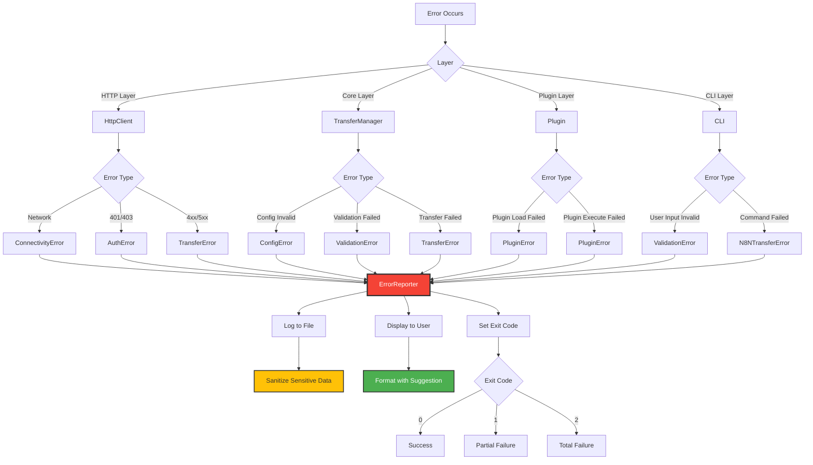

### Exit Codes

| Exit Code | Significado | Quando Usar |
|-----------|-------------|-------------|
| `0` | Success | Todas as operações completaram com sucesso |
| `1` | Partial Failure | Algumas operações falharam, mas não todas |
| `2` | Total Failure | Erro crítico, nenhuma operação foi completada |
| `3` | Config Error | Erro de configuração (variáveis faltando, inválidas) |
| `4` | Connectivity Error | Não foi possível conectar com SOURCE ou TARGET |
| `5` | Auth Error | Falha de autenticação |

**Uso em CI/CD:**

```bash
#!/bin/bash

# CI script para transfer
npm run transfer -- --non-interactive

EXIT_CODE=$?

if [ $EXIT_CODE -eq 0 ]; then
  echo "✅ Transfer completed successfully"
  exit 0
elif [ $EXIT_CODE -eq 1 ]; then
  echo "⚠️ Transfer completed with some failures"
  exit 1
else
  echo "❌ Transfer failed"
  exit 1
fi
```

---

## Estratégia de Testes

### Pirâmide de Testes

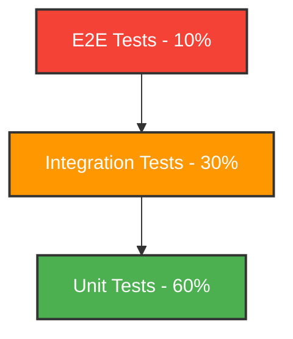

### Unit Tests (60%)

**Foco:** Testar componentes individuais em isolamento.

**Exemplos:**

```javascript
// tests/unit/core/transfer-manager.test.js
describe('TransferManager', () => {
  describe('transfer()', () => {
    it('should transfer workflows successfully', async () => {
      const mockConfig = createMockConfig();
      const mockSourceWorkflows = createMockWorkflows(5);
      const mockTargetWorkflows = createMockWorkflows(3);

      const httpClient = createMockHttpClient({
        getWorkflows: jest.fn()
          .mockResolvedValueOnce(mockSourceWorkflows) // SOURCE
          .mockResolvedValueOnce(mockTargetWorkflows), // TARGET
        createWorkflow: jest.fn().mockResolvedValue({ id: 'new-id' })
      });

      const manager = new TransferManager({ httpClient });
      const result = await manager.transfer({ dryRun: false });

      expect(result.success).toBe(true);
      expect(result.stats.transferred).toBe(2); // 5 - 3 duplicates
    });

    it('should skip duplicate workflows', async () => {
      // Test deduplication logic
    });

    it('should handle transfer errors gracefully', async () => {
      // Test error handling
    });

    it('should respect dry-run mode', async () => {
      // Test that no actual transfers happen in dry-run
    });
  });
});

// tests/unit/plugins/standard-deduplicator.test.js
describe('StandardDeduplicator', () => {
  it('should detect exact name + tags match as duplicate', async () => {
    const dedup = new StandardDeduplicator();

    const sourceWorkflow = {
      name: 'Test Workflow',
      tags: [{ name: 'prod' }, { name: 'api' }]
    };

    const targetWorkflows = [
      { name: 'Test Workflow', tags: [{ name: 'prod' }, { name: 'api' }] }
    ];

    const isDuplicate = await dedup.check(sourceWorkflow, targetWorkflows);

    expect(isDuplicate).toBe(true);
  });

  it('should not detect duplicate if tags differ', async () => {
    // Test with different tags
  });
});

// tests/unit/core/config-loader.test.js
describe('ConfigLoader', () => {
  it('should load config from .env successfully', async () => {
    // Test config loading
  });

  it('should throw ConfigError if required variables are missing', async () => {
    // Test error on missing variables
  });

  it('should validate URL format', async () => {
    // Test URL validation
  });
});
```

### Integration Tests (30%)

**Foco:** Testar interação entre componentes.

**Exemplos:**

```javascript
// tests/integration/transfer-flow.test.js
describe('Transfer Flow (Integration)', () => {
  it('should complete full transfer flow with real plugins', async () => {
    // Setup: Create real instances of components (not mocks)
    const configLoader = new ConfigLoader();
    const pluginRegistry = new PluginRegistry();
    await pluginRegistry.loadAll();

    const httpClient = createMockHttpClient(); // Mock only external API
    const manager = new TransferManager({ configLoader, pluginRegistry, httpClient });

    // Execute
    const result = await manager.transfer({
      dryRun: false,
      plugins: {
        deduplicator: 'standard',
        validators: ['integrity'],
        reporters: ['markdown']
      }
    });

    // Verify
    expect(result.success).toBe(true);
    expect(result.reports).toHaveLength(1);
    expect(result.reports[0].format).toBe('markdown');

    // Verify report file was created
    const reportExists = await fs.pathExists(result.reports[0].filePath);
    expect(reportExists).toBe(true);
  });

  it('should use custom plugin registered at runtime', async () => {
    // Test custom plugin integration
  });
});

// tests/integration/plugin-registry.test.js
describe('PluginRegistry (Integration)', () => {
  it('should discover and load all built-in plugins', async () => {
    const registry = new PluginRegistry();
    await registry.loadAll();

    const deduplicator = registry.getDeduplicator('standard');
    expect(deduplicator).toBeDefined();
    expect(deduplicator.name).toBe('standard');

    const validators = registry.getValidators(['integrity']);
    expect(validators).toHaveLength(1);

    const reporters = registry.getReporters(['markdown', 'json']);
    expect(reporters).toHaveLength(2);
  });
});
```

### E2E Tests (10%)

**Foco:** Testar sistema completo com N8N mock server.

**Exemplos:**

```javascript
// tests/e2e/cli-transfer.test.js
describe('CLI Transfer (E2E)', () => {
  let mockServer;

  beforeAll(async () => {
    // Start mock N8N server
    mockServer = await startMockN8NServer({
      source: { port: 5678, workflows: generateMockWorkflows(10) },
      target: { port: 5679, workflows: generateMockWorkflows(5) }
    });
  });

  afterAll(async () => {
    await mockServer.close();
  });

  it('should transfer workflows via CLI in non-interactive mode', async () => {
    // Setup .env with mock server URLs
    process.env.SOURCE_N8N_URL = 'http://localhost:5678';
    process.env.SOURCE_N8N_API_KEY = 'test-key-source';
    process.env.TARGET_N8N_URL = 'http://localhost:5679';
    process.env.TARGET_N8N_API_KEY = 'test-key-target';

    // Execute CLI
    const { stdout, exitCode } = await execCLI([
      'transfer',
      '--non-interactive',
      '--report=json'
    ]);

    // Verify
    expect(exitCode).toBe(0);
    expect(stdout).toContain('Transfer completed successfully');

    // Verify report was generated
    const reportFiles = await fs.readdir('./reports');
    expect(reportFiles).toHaveLength(1);

    const report = await fs.readJSON(`./reports/${reportFiles[0]}`);
    expect(report.stats.transferred).toBeGreaterThan(0);
  });
});
```

### Test Utilities

```javascript
// tests/helpers/test-utils.js

/**
 * Create mock config for testing
 */
export function createMockConfig(overrides = {}) {
  return {
    source: {
      url: 'https://source.example.com',
      apiKey: 'test-source-key',
      ...overrides.source
    },
    target: {
      url: 'https://target.example.com',
      apiKey: 'test-target-key',
      ...overrides.target
    },
    options: {
      logLevel: 'error',
      ...overrides.options
    }
  };
}

/**
 * Create mock workflows for testing
 */
export function createMockWorkflows(count, template = {}) {
  return Array.from({ length: count }, (_, i) => ({
    id: `workflow-${i}`,
    name: `Test Workflow ${i}`,
    active: false,
    nodes: [
      { id: 'node1', name: 'Start', type: 'n8n-nodes-base.start', position: [0, 0], parameters: {} }
    ],
    connections: {},
    tags: [],
    ...template
  }));
}

/**
 * Create mock HTTP client
 */
export function createMockHttpClient(overrides = {}) {
  return {
    getWorkflows: jest.fn().mockResolvedValue([]),
    createWorkflow: jest.fn().mockResolvedValue({ id: 'new-id' }),
    getWorkflow: jest.fn().mockResolvedValue({}),
    testConnection: jest.fn().mockResolvedValue(true),
    ...overrides
  };
}

/**
 * Start mock N8N server for E2E tests
 */
export async function startMockN8NServer(config) {
  const express = require('express');
  const sourceApp = express();
  const targetApp = express();

  // Setup SOURCE endpoints
  sourceApp.get('/api/v1/workflows', (req, res) => {
    res.json({ data: config.source.workflows });
  });

  // Setup TARGET endpoints
  targetApp.get('/api/v1/workflows', (req, res) => {
    res.json({ data: config.target.workflows });
  });

  targetApp.post('/api/v1/workflows', (req, res) => {
    const workflow = req.body;
    workflow.id = `new-${Date.now()}`;
    config.target.workflows.push(workflow);
    res.status(201).json(workflow);
  });

  const sourceServer = sourceApp.listen(config.source.port);
  const targetServer = targetApp.listen(config.target.port);

  return {
    close: async () => {
      sourceServer.close();
      targetServer.close();
    }
  };
}

/**
 * Execute CLI command and capture output
 */
export async function execCLI(args) {
  const { spawn } = require('child_process');

  return new Promise((resolve) => {
    const child = spawn('node', ['./cli/interactive-cli.js', ...args]);

    let stdout = '';
    let stderr = '';

    child.stdout.on('data', (data) => { stdout += data.toString(); });
    child.stderr.on('data', (data) => { stderr += data.toString(); });

    child.on('close', (exitCode) => {
      resolve({ stdout, stderr, exitCode });
    });
  });
}
```

### Cobertura de Testes

**Metas:**
- Overall: 80%+
- Core components: 90%+
- Plugins: 85%+
- CLI: 70%+ (UI components podem ter cobertura menor)

**Ferramentas:**
- Jest para test runner
- Istanbul/NYC para code coverage
- Supertest para mock HTTP servers

---

## Estratégia de Remoção de Código Legado

### Fases de Remoção

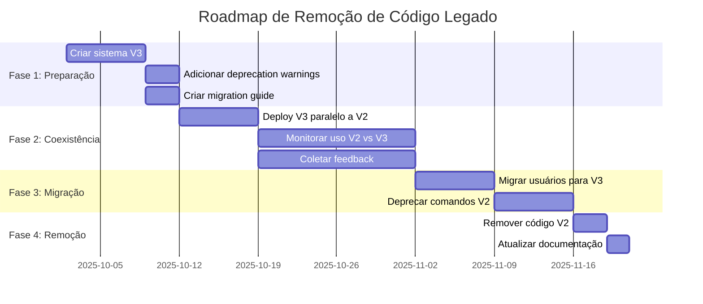

### Detection Tool (Automated)

**Script para detectar uso de código legado:**

```javascript
// scripts/detect-legacy-usage.js

/**
 * Detect legacy code usage in codebase
 *
 * Searches for:
 * - References to rename-mapping-atualizado.json
 * - Old CLI commands
 * - Deprecated functions
 */

const fs = require('fs-extra');
const path = require('path');
const glob = require('glob');

async function detectLegacyUsage() {
  console.log('🔍  Scanning for legacy code usage...\n');

  const issues = [];

  // 1. Search for rename-mapping-atualizado.json references
  const filesWithMapping = await searchInFiles('rename-mapping-atualizado');
  if (filesWithMapping.length > 0) {
    issues.push({
      type: 'DEPRECATED_FILE_REFERENCE',
      severity: 'high',
      files: filesWithMapping,
      message: 'References to deprecated rename-mapping-atualizado.json found',
      fix: 'Remove references and use N8N API directly'
    });
  }

  // 2. Search for old CLI patterns
  const filesWithOldCLI = await searchInFiles('apply-layer-tags');
  if (filesWithOldCLI.length > 0) {
    issues.push({
      type: 'OLD_CLI_COMMAND',
      severity: 'medium',
      files: filesWithOldCLI,
      message: 'Old CLI command patterns found',
      fix: 'Update to use new transfer command'
    });
  }

  // 3. Check if legacy files still exist
  const legacyFiles = [
    'rename-mapping-atualizado.json',
    'scripts/old-transfer.js'
  ];

  for (const file of legacyFiles) {
    if (await fs.pathExists(file)) {
      issues.push({
        type: 'LEGACY_FILE_EXISTS',
        severity: 'high',
        files: [file],
        message: `Legacy file still exists: ${file}`,
        fix: `Delete file: ${file}`
      });
    }
  }

  // 4. Display results
  if (issues.length === 0) {
    console.log('✅  No legacy code usage detected!\n');
    process.exit(0);
  }

  console.log(`⚠️  Found ${issues.length} legacy code issues:\n`);

  issues.forEach((issue, i) => {
    console.log(`${i + 1}. ${issue.type} (${issue.severity})`);
    console.log(`   ${issue.message}`);
    console.log(`   Files: ${issue.files.join(', ')}`);
    console.log(`   Fix: ${issue.fix}\n`);
  });

  process.exit(1);
}

async function searchInFiles(pattern) {
  const files = glob.sync('**/*.{js,json,md}', {
    ignore: ['node_modules/**', 'reports/**', 'logs/**']
  });

  const matches = [];

  for (const file of files) {
    const content = await fs.readFile(file, 'utf8');
    if (content.includes(pattern)) {
      matches.push(file);
    }
  }

  return matches;
}

detectLegacyUsage();
```

### Deprecation Warnings

**Adicionar warnings em código legado:**

```javascript
// legacy/old-transfer.js (código V2)

/**
 * @deprecated This transfer function is deprecated and will be removed in V4.
 * Use TransferManager from '../core/transfer-manager.js' instead.
 *
 * Migration guide: docs/migration-v2-to-v3.md
 */
function oldTransfer() {
  console.warn(`
╔══════════════════════════════════════════════════════════════════════╗
║                         ⚠️  DEPRECATION WARNING                      ║
╚══════════════════════════════════════════════════════════════════════╝

This function is DEPRECATED and will be removed in V4.

Please migrate to the new N8N Transfer System V3:

  📖  Migration guide: docs/migration-v2-to-v3.md
  📦  New API: const manager = new TransferManager()

This warning will become an error in the next major version.
  `);

  // Original implementation...
}
```

### Migration Guide

**docs/migration-v2-to-v3.md:**

```markdown
# Migration Guide: V2 → V3

## Overview

This guide helps you migrate from the old transfer system (V2) to the new plugin-based system (V3).

## Breaking Changes

### 1. rename-mapping-atualizado.json Removed

**Before (V2):**
```javascript
const mapping = require('./rename-mapping-atualizado.json');
const workflows = applyMapping(sourceWorkflows, mapping);
```

**After (V3):**
```javascript
// No mapping needed! Workflows are fetched directly from N8N API
const manager = new TransferManager();
const result = await manager.transfer({ from: 'source', to: 'target' });
```

### 2. CLI Commands Changed

**Before (V2):**
```bash
node old-transfer.js --apply-tags
```

**After (V3):**
```bash
npm run transfer
# or
npm run transfer -- --dry-run
```

### 3. API Changed

**Before (V2):**
```javascript
const result = await transferWorkflows({
  sourceUrl: SOURCE_URL,
  targetUrl: TARGET_URL,
  mapping: mapping
});
```

**After (V3):**
```javascript
const manager = new TransferManager();
const result = await manager.transfer({
  from: 'source',
  to: 'target',
  filters: { tags: ['prod'] },
  plugins: { deduplicator: 'standard' }
});
```

## Migration Steps

### Step 1: Update Dependencies

```bash
npm install
```

### Step 2: Run Configuration Wizard

```bash
npm run configure
```

This will:
- Guide you through setting up SOURCE and TARGET credentials
- Test connectivity
- Save configuration to .env

### Step 3: Test with Dry Run

```bash
npm run transfer -- --dry-run
```

Review the preview to ensure everything looks correct.

### Step 4: Execute Transfer

```bash
npm run transfer
```

### Step 5: Remove Legacy Code

Once you've verified V3 works, remove:
- `rename-mapping-atualizado.json`
- Any imports of old transfer functions
- Old CLI scripts

## Troubleshooting

### Issue: "Config not found"

**Solution:** Run `npm run configure` to set up your environment.

### Issue: "No workflows found"

**Solution:** Check your SOURCE_N8N_URL and API key. Run `npm run validate` to test connectivity.

### Issue: "All workflows skipped (duplicates)"

**Solution:** This is expected if workflows already exist in TARGET. Use filters to transfer specific workflows.

## Need Help?

- 📖 Read the full documentation: `docs/README.md`
- 🐛 Report issues: GitHub Issues
- 💬 Ask questions: Team Slack channel
```

### Backward Compatibility Shims (Temporary)

**Fornecer shims para facilitar transição:**

```javascript
// legacy/compatibility-shim.js

/**
 * Temporary compatibility shim for old API
 *
 * @deprecated Use TransferManager directly
 */
const { TransferManager } = require('../core/transfer-manager');

let warningShown = false;

function showDeprecationWarning() {
  if (!warningShown) {
    console.warn('⚠️  You are using deprecated API. Migrate to TransferManager. See docs/migration-v2-to-v3.md');
    warningShown = true;
  }
}

/**
 * Old API wrapper (for backward compatibility)
 */
async function transferWorkflows(options) {
  showDeprecationWarning();

  // Map old options to new API
  const manager = new TransferManager();

  return await manager.transfer({
    from: 'source',
    to: 'target',
    // Map old options...
  });
}

module.exports = {
  transferWorkflows
};
```

---

## Roadmap de Implementação

### Fase 1: Core System (Semana 1-2)

**Objetivos:**
- Implementar core components (TransferManager, PluginRegistry, ConfigLoader)
- Implementar HttpClient com retry logic
- Implementar ErrorReporter e Logger
- Testes unitários para core

**Entregáveis:**
- ✅ `core/transfer-manager.js` implementado
- ✅ `core/plugin-registry.js` implementado
- ✅ `core/config-loader.js` implementado
- ✅ `core/http-client.js` implementado
- ✅ `core/error-reporter.js` implementado
- ✅ `core/logger.js` implementado
- ✅ Testes unitários com 90%+ coverage

### Fase 2: Plugin System (Semana 2-3)

**Objetivos:**
- Implementar built-in plugins (StandardDeduplicator, FuzzyDeduplicator, IntegrityValidator)
- Implementar reporters (Markdown, JSON, CSV)
- Plugin discovery e loading
- Testes para plugins

**Entregáveis:**
- ✅ `plugins/deduplicators/standard-deduplicator.js`
- ✅ `plugins/deduplicators/fuzzy-deduplicator.js`
- ✅ `plugins/validators/integrity-validator.js`
- ✅ `plugins/reporters/markdown-reporter.js`
- ✅ `plugins/reporters/json-reporter.js`
- ✅ `plugins/reporters/csv-reporter.js`
- ✅ Plugin README com exemplos
- ✅ Testes de plugins

### Fase 3: Interactive CLI (Semana 3-4)

**Objetivos:**
- Implementar CLI interativa com wizards
- Implementar UI components reutilizáveis
- Implementar comandos (configure, transfer, validate, plugins)
- Implementar i18n (PT-BR, EN-US)
- Testes E2E

**Entregáveis:**
- ✅ `cli/interactive-cli.js`
- ✅ `cli/commands/configure.js`
- ✅ `cli/commands/transfer.js`
- ✅ `cli/commands/validate.js`
- ✅ `cli/ui/components.js`
- ✅ `cli/i18n/pt-BR.json`
- ✅ Testes E2E

### Fase 4: Documentation & Migration (Semana 4)

**Objetivos:**
- Escrever documentação completa
- Criar migration guide
- Criar ADRs (Architecture Decision Records)
- Criar detection script para código legado
- Code review e refinamento

**Entregáveis:**
- ✅ `README.md` atualizado
- ✅ `docs/guides/quick-start.md`
- ✅ `docs/guides/configuration.md`
- ✅ `docs/guides/creating-plugins.md`
- ✅ `docs/guides/troubleshooting.md`
- ✅ `docs/migration-v2-to-v3.md`
- ✅ `docs/architecture/ADR-001-plugin-system.md`
- ✅ `scripts/detect-legacy-usage.js`

### Fase 5: Deploy & Cleanup (Semana 5)

**Objetivos:**
- Deploy do sistema V3
- Monitorar uso e coletar feedback
- Remover código legado
- Celebrar! 🎉

**Entregáveis:**
- ✅ Sistema V3 em produção
- ✅ Código legado removido
- ✅ Documentação final revisada
- ✅ Feedback incorporado

---

## Considerações Finais

### Métricas de Sucesso

O design V3 será considerado bem-sucedido se:

1. **Developer Experience:**
   - Novos desenvolvedores conseguem usar o sistema em < 5 minutos
   - Feedback positivo sobre UX da CLI
   - Documentação inline reduz perguntas em 80%

2. **Extensibilidade:**
   - Desenvolvedores criam plugins customizados sem modificar core
   - Tempo para adicionar novo plugin: < 1 hora

3. **Confiabilidade:**
   - Taxa de sucesso de transferências: > 95%
   - Zero exposição de credenciais em logs
   - Erros são auto-explicativos e acionáveis

4. **Performance:**
   - Transferências < 10s por workflow
   - Batch de 100 workflows < 20min

5. **Manutenibilidade:**
   - Cobertura de testes: 80%+
   - Código segue padrões do projeto
   - Sem código legado após Fase 5

### Próximos Passos

Após revisão e aprovação deste design:

1. ✅ **Aprovação do design document**
2. Criar tasks detalhadas no board (baseado no roadmap)
3. Iniciar Fase 1: Core System
4. Setup CI/CD para testes automatizados
5. Criar branch feature/n8n-transfer-v3

---

**Fim do Design Document V3**

*Para dúvidas ou sugestões, contate a equipe de desenvolvimento.*
