# Plano de Implementação: N8N Transfer System Refactor V3

**Feature:** n8n-transfer-system-refactor
**Versão do Design:** V3 - Developer Experience First com Plugin Architecture
**Data de Criação:** 2025-10-02
**Abordagem:** Implementação incremental com 5 fases (Safe Migration Strategy)

---

## Visão Geral

Este plano implementa a refatoração completa do sistema de transferência de workflows N8N, transformando-o de um script monolítico em uma arquitetura moderna baseada em plugins com foco excepcional em Developer Experience (DX).

**Estratégia de Migração:** 5 fases com coexistência entre código legacy e novo, permitindo rollback a qualquer momento até a Fase 5.

---

## FASE 1: Fundação - Core Architecture & Data Models

### Objetivo da Fase 1
Estabelecer a fundação arquitetural com core components, interfaces TypeScript/JSDoc, e estrutura de diretórios. Esta fase cria a base para todas as próximas fases sem afetar código existente.

---

- [x] **1. Criar estrutura de diretórios da nova arquitetura**
  - Criar diretórios conforme design: `core/`, `plugins/`, `cli/`, `docs/`, `tests/`, `config/`, `logs/`, `reports/`
  - Adicionar `.gitkeep` em `logs/` e `reports/`
  - Atualizar `.gitignore` para excluir `logs/` e `reports/`
  - _Requisitos: Todos (infraestrutura base)_
  - _Deliverable: Estrutura de diretórios completa e versionada_

- [x] **2. Implementar modelo de dados TypeScript/JSDoc**
  - Criar `core/types.js` com todas as interfaces documentadas no design: `Workflow`, `Node`, `Connection`, `Tag`, `TransferState`, `TransferSummary`
  - Documentar cada interface com JSDoc completo incluindo exemplos
  - Adicionar validadores de tipo runtime usando Zod ou Joi
  - _Requisitos: 1 (correção de documentação), 10 (validação de integridade)_
  - _Deliverable: Modelo de dados completo com validação_

- [x] **3. Implementar ConfigLoader com validação**
  - Criar `core/config-loader.js` com classe `ConfigLoader`
  - Implementar método `load()` que carrega de .env e valida configuração
  - Implementar método `validate()` usando schema Zod/Joi
  - Implementar método `testConnectivity()` para testar SOURCE e TARGET
  - Adicionar validação de formato de URLs e API keys não-vazias
  - Adicionar warning se SOURCE_N8N_URL === TARGET_N8N_URL
  - _Requisitos: 5 (configuração de variáveis de ambiente)_
  - _Deliverable: ConfigLoader funcional com validação robusta_

- [x] **4. Implementar Logger estruturado**
  - Criar `core/logger.js` com suporte a níveis (DEBUG, INFO, WARN, ERROR)
  - Implementar logging em arquivo com timestamp e formato estruturado
  - Implementar mascaramento de API keys em logs
  - Adicionar suporte a rotação de logs (opcional, usando library como winston)
  - Configurar output diferenciado para console vs arquivo
  - _Requisitos: 14 (logging e auditoria)_
  - _Deliverable: Sistema de logging configurável e seguro_

- [x] **5. Implementar HttpClient com retry logic**
  - Criar `core/http-client.js` com classe `HttpClient`
  - Implementar métodos: `getWorkflows()`, `createWorkflow()`, `getWorkflow()`, `testConnection()`
  - Implementar retry com backoff exponencial (3 tentativas por default)
  - Implementar timeout configurável (default 10s)
  - Implementar rate limiting básico para evitar sobrecarga
  - Adicionar logging de requisições (mascarando API keys)
  - _Requisitos: 6 (tratamento de erros), Requisitos Não-Funcionais (performance)_
  - _Deliverable: Cliente HTTP robusto com retry e logging_

- [ ] **6. Implementar ErrorReporter**
  - Criar `core/error-reporter.js` com utilitários de formatação de erros
  - Implementar método `format()` que converte erros em formato padronizado com code, message, suggestion
  - Implementar detecção de tipos de erro específicos: autenticação, rede, timeout, storage cheio
  - Implementar sugestões acionáveis para cada tipo de erro
  - _Requisitos: 6 (tratamento de erros), 3 (melhorias de UX)_
  - _Deliverable: Sistema de error reporting padronizado_

- [ ] **7. Escrever testes unitários para Core Components**
  - Criar `tests/unit/core/config-loader.test.js` com testes de validação e connectivity
  - Criar `tests/unit/core/logger.test.js` com testes de mascaramento e níveis de log
  - Criar `tests/unit/core/http-client.test.js` com mocks de API e testes de retry
  - Criar `tests/unit/core/error-reporter.test.js` com testes de formatação
  - Criar `tests/fixtures/mock-workflows.json` e `mock-api-responses.json`
  - _Requisitos: Requisitos Não-Funcionais (manutenibilidade)_
  - _Deliverable: Cobertura de testes >80% para core components_

---

## FASE 2: Plugin System - Extensibility Foundation

### Objetivo da Fase 2
Implementar o sistema de plugins com built-in plugins demonstrando padrões de uso. Esta fase estabelece extensibilidade do sistema.

---

- [ ] **8. Criar interfaces de plugins**
  - Criar `plugins/index.js` com definições TypeScript/JSDoc de interfaces: `Plugin`, `Deduplicator`, `Validator`, `Reporter`
  - Documentar cada interface com exemplos de implementação
  - Criar classe base `BasePlugin` com funcionalidades comuns
  - _Requisitos: Todos (infraestrutura de extensibilidade)_
  - _Deliverable: Interfaces de plugin bem documentadas_

- [ ] **9. Implementar PluginRegistry**
  - Criar `core/plugin-registry.js` com classe `PluginRegistry`
  - Implementar método `loadAll()` para auto-discovery de plugins
  - Implementar método `register()` para registro manual
  - Implementar métodos `getDeduplicator()`, `getValidators()`, `getReporters()` com defaults
  - Implementar método `list()` para listar plugins disponíveis
  - Adicionar validação de interfaces de plugins
  - _Requisitos: Todos (coordenação de plugins)_
  - _Deliverable: Registry funcional com auto-discovery_

- [ ] **10. Implementar StandardDeduplicator**
  - Criar `plugins/deduplicators/standard-deduplicator.js`
  - Implementar lógica: exact match de nome E tags (comparação de arrays)
  - Implementar método `check()` retornando boolean
  - Implementar método `getReason()` para reporting
  - Adicionar JSDoc completo com exemplos
  - _Requisitos: 2 (lógica de deduplicação)_
  - _Deliverable: Deduplicator padrão funcional_

- [ ] **11. Implementar FuzzyDeduplicator**
  - Criar `plugins/deduplicators/fuzzy-deduplicator.js`
  - Implementar fuzzy string matching usando library (ex: fuzzball.js, levenshtein)
  - Implementar threshold configurável (default 85% similarity)
  - Implementar lógica: fuzzy match de nome E exact match de tags
  - Adicionar JSDoc completo com exemplos
  - _Requisitos: 2 (lógica de deduplicação), extensibilidade_
  - _Deliverable: Deduplicator fuzzy opcional_

- [ ] **12. Implementar IntegrityValidator**
  - Criar `plugins/validators/integrity-validator.js`
  - Implementar validações pre-transfer: nome existe, nodes não vazio, connections válidas
  - Implementar validações post-transfer (opcional): comparar nome, número de nodes, número de connections
  - Retornar array de `ValidationError` com code, message, severity
  - Adicionar JSDoc completo com exemplos
  - _Requisitos: 10 (validação de integridade)_
  - _Deliverable: Validator de integridade funcional_

- [ ] **13. Implementar SchemaValidator**
  - Criar `plugins/validators/schema-validator.js`
  - Implementar validação contra schema N8N usando Zod/Joi
  - Validar campos obrigatórios: name, nodes, connections
  - Validar estrutura de nodes e connections
  - Retornar erros descritivos para cada violação de schema
  - _Requisitos: 10 (validação de integridade)_
  - _Deliverable: Validator de schema funcional_

- [ ] **14. Implementar MarkdownReporter**
  - Criar `plugins/reporters/markdown-reporter.js`
  - Implementar geração de relatório em formato Markdown
  - Incluir seções: metadata (data, SOURCE, TARGET), estatísticas, workflows transferidos, pulados, falhas
  - Usar tabelas Markdown para listas de workflows
  - Salvar com nome descritivo: `transfer-report-YYYY-MM-DD-HHmmss.md`
  - _Requisitos: 9 (geração de relatórios)_
  - _Deliverable: Reporter Markdown funcional_

- [ ] **15. Implementar JSONReporter**
  - Criar `plugins/reporters/json-reporter.js`
  - Implementar geração de relatório em formato JSON estruturado
  - Incluir todo `TransferSummary` serializado
  - Pretty-print com 2 espaços de indentação
  - Salvar com nome descritivo: `transfer-report-YYYY-MM-DD-HHmmss.json`
  - _Requisitos: 9 (geração de relatórios), 13 (modo não-interativo)_
  - _Deliverable: Reporter JSON funcional_

- [ ] **16. Implementar CSVReporter**
  - Criar `plugins/reporters/csv-reporter.js`
  - Implementar geração de relatório em formato CSV
  - Criar CSV com colunas: Workflow Name, Source ID, Target ID, Status (Transferred/Skipped/Failed), Reason/Error
  - Usar library CSV (ex: papaparse, csv-writer)
  - Salvar com nome descritivo: `transfer-report-YYYY-MM-DD-HHmmss.csv`
  - _Requisitos: 9 (geração de relatórios)_
  - _Deliverable: Reporter CSV funcional_

- [ ] **17. Criar documentação de criação de plugins customizados**
  - Criar `plugins/deduplicators/README.md` com guia de criação de custom deduplicators
  - Criar `plugins/validators/README.md` com guia de criação de custom validators
  - Criar `plugins/reporters/README.md` com guia de criação de custom reporters
  - Incluir exemplos completos e boas práticas
  - _Requisitos: 15 (documentação e help system)_
  - _Deliverable: Guias de plugin development_

- [ ] **18. Escrever testes para Plugin System**
  - Criar `tests/unit/plugins/standard-deduplicator.test.js` com casos de exact match e non-match
  - Criar `tests/unit/plugins/fuzzy-deduplicator.test.js` com casos de similarity threshold
  - Criar `tests/unit/plugins/integrity-validator.test.js` com workflows válidos e inválidos
  - Criar `tests/unit/plugins/reporters/*.test.js` validando formato de cada reporter
  - Criar `tests/integration/plugin-registry.test.js` testando auto-discovery
  - _Requisitos: Requisitos Não-Funcionais (manutenibilidade)_
  - _Deliverable: Cobertura de testes >80% para plugins_

---

## FASE 3: TransferManager - Business Logic Core

### Objetivo da Fase 3
Implementar o core business logic de transferência, orquestrando plugins e coordenando todo o fluxo. Esta fase cria a API pública do sistema.

---

- [ ] **19. Implementar TransferManager - estrutura base**
  - Criar `core/transfer-manager.js` com classe `TransferManager`
  - Implementar constructor que inicializa ConfigLoader, PluginRegistry, HttpClient, Logger
  - Implementar método `getProgress()` retornando estado atual
  - Implementar método `cancel()` para cancelamento graceful
  - Implementar método `registerPlugin()` para registro runtime
  - _Requisitos: Todos (orquestrador central)_
  - _Deliverable: Estrutura do TransferManager_

- [ ] **20. Implementar TransferManager.transfer() - validação inicial**
  - Implementar método `transfer(options)` - parte 1: validação
  - Validar `TransferOptions` usando Zod/Joi
  - Carregar configuração via ConfigLoader
  - Testar conectividade com SOURCE e TARGET
  - Retornar erro descritivo se validação falhar
  - _Requisitos: 5 (configuração), 6 (tratamento de erros)_
  - _Deliverable: Validação inicial robusta_

- [ ] **21. Implementar TransferManager.transfer() - carregamento de plugins**
  - Implementar parte 2: carregamento de plugins
  - Carregar deduplicator via PluginRegistry (default: StandardDeduplicator)
  - Carregar validators via PluginRegistry (default: IntegrityValidator)
  - Carregar reporters via PluginRegistry (default: MarkdownReporter)
  - Logar plugins carregados
  - _Requisitos: Todos (uso de plugins)_
  - _Deliverable: Carregamento dinâmico de plugins_

- [ ] **22. Implementar TransferManager.transfer() - fetching de workflows**
  - Implementar parte 3: fetching de workflows
  - Buscar workflows do SOURCE via HttpClient com filtros aplicados
  - Buscar workflows do TARGET via HttpClient (para deduplicação)
  - Implementar aplicação de filtros: workflowIds, workflowNames, tags, excludeTags
  - Logar quantidade de workflows encontrados
  - Exibir mensagem se nenhum workflow corresponde aos filtros
  - _Requisitos: 11 (transferência seletiva)_
  - _Deliverable: Fetching com filtros funcionando_

- [ ] **23. Implementar TransferManager.transfer() - loop principal de processamento**
  - Implementar parte 4: loop de processamento
  - Para cada workflow SOURCE: executar deduplication check, pre-validation, transfer/simulate, post-validation
  - Implementar atualização de progresso (`updateProgress()`)
  - Implementar contadores: total, processed, transferred, skipped, failed
  - Implementar tratamento de erros individuais (continuar processando batch)
  - Implementar detecção de credenciais e skip opcional
  - _Requisitos: 2 (deduplicação), 10 (validação), 12 (workflows com credenciais)_
  - _Deliverable: Loop de processamento completo_

- [ ] **24. Implementar dry-run mode**
  - Adicionar flag `dryRun` em `TransferOptions`
  - Implementar simulação de transferência: rodar todas validações mas não chamar `createWorkflow()`
  - Marcar workflows transferidos como `simulated: true` em dry-run
  - Exibir mensagem clara no final: "Dry-run concluído. Nenhuma mudança foi feita."
  - _Requisitos: 7 (modo dry-run)_
  - _Deliverable: Dry-run funcional_

- [ ] **25. Implementar geração de relatórios**
  - Implementar método `generateReports()` que chama reporters carregados
  - Passar `TransferSummary` completo para cada reporter
  - Salvar relatórios em diretório configurado (default: `./reports/`)
  - Retornar array de `ReportFile` com paths
  - _Requisitos: 9 (geração de relatórios)_
  - _Deliverable: Geração automática de relatórios_

- [ ] **26. Implementar método TransferManager.validate()**
  - Criar método `validate(options)` para validação sem transferência
  - Buscar workflows do SOURCE
  - Executar validators em cada workflow
  - Retornar `ValidationResult` com lista de issues encontrados
  - Suportar diferentes níveis de severidade (error vs warning)
  - _Requisitos: 10 (validação de integridade)_
  - _Deliverable: Modo de validação standalone_

- [ ] **27. Implementar paralelização de transferências**
  - Adicionar opção `parallelism` em `TransferOptions` (default: 3)
  - Implementar processamento paralelo usando Promise.all() com batches
  - Implementar semáforo/limiter para controlar concorrência
  - Garantir que progresso e logs são thread-safe
  - _Requisitos: Requisitos Não-Funcionais (performance)_
  - _Deliverable: Transferências paralelas com concorrência configurável_

- [ ] **28. Implementar cancelamento graceful**
  - Implementar método `cancel()` que seta flag de cancelamento
  - Verificar flag em pontos-chave do loop de processamento
  - Finalizar processamento gracefully e gerar relatório parcial
  - Implementar signal handler para Ctrl+C (SIGINT)
  - _Requisitos: 8 (rastreamento de progresso)_
  - _Deliverable: Cancelamento graceful funcionando_

- [ ] **29. Escrever testes para TransferManager**
  - Criar `tests/unit/core/transfer-manager.test.js` com mocks de plugins e HttpClient
  - Testar cenários: transferência completa, dry-run, filtros, erros de API, cancelamento
  - Criar `tests/integration/transfer-flow.test.js` testando fluxo completo com mocks de N8N API
  - Testar tratamento de workflows inválidos, duplicatas, credenciais
  - _Requisitos: Requisitos Não-Funcionais (manutenibilidade)_
  - _Deliverable: Cobertura de testes >80% para TransferManager_

---

## FASE 4: Interactive CLI - User Experience Excellence

### Objetivo da Fase 4
Criar CLI interativa com wizards guiados, UX de primeira classe em PT-BR, e feedback visual rico. Esta fase entrega a interface principal para usuários.

---

- [ ] **30. Criar sistema de internacionalização (i18n)**
  - Criar `cli/i18n/pt-BR.json` com todas as strings em português (textos gramaticalmente corretos)
  - Criar `cli/i18n/en-US.json` com todas as strings em inglês
  - Criar `cli/i18n/index.js` com função de carregamento de idioma baseado em env var `LANGUAGE` ou default pt-BR
  - Organizar strings por contexto: errors, prompts, messages, help
  - _Requisitos: 3 (melhorias de UX), 15 (documentação e help)_
  - _Deliverable: Sistema i18n completo_

- [ ] **31. Implementar UI components reutilizáveis**
  - Criar `cli/ui/components.js` com componentes usando Inquirer.js e Chalk
  - Implementar componentes: `showBanner()`, `showSuccess()`, `showError()`, `showWarning()`, `showInfo()`, `showTable()`, `showList()`
  - Criar `cli/ui/themes.js` com esquema de cores consistente
  - Implementar numeração sequencial (1, 2, 3...) em listas
  - Garantir alinhamento visual correto
  - _Requisitos: 3 (melhorias de UX)_
  - _Deliverable: Biblioteca de UI components_

- [ ] **32. Implementar ProgressBar component**
  - Criar `cli/ui/progress-bar.js` usando library (ex: cli-progress)
  - Implementar barra de progresso visual com percentual
  - Implementar contador de workflows: "Processando workflow X de Y"
  - Implementar estimativa de tempo restante baseada em média
  - Suportar fallback para terminais sem cores
  - _Requisitos: 8 (rastreamento de progresso)_
  - _Deliverable: Progress bar visual_

- [ ] **33. Implementar comando `configure` - Configuration Wizard**
  - Criar `cli/commands/configure.js` com wizard interativo
  - Criar wizard de 3 etapas:
    - Etapa 1: Configurar SOURCE N8N (URL e API Key)
    - Etapa 2: Configurar TARGET N8N (URL e API Key)
    - Etapa 3: Testar conectividade e confirmar
  - Para cada etapa: validar input, testar conexão, exibir feedback visual (✓ ou ✗)
  - Salvar configuração validada em `.env`
  - Exibir mensagem de sucesso com próximos passos
  - _Requisitos: 5 (configuração de variáveis de ambiente), 3 (melhorias de UX)_
  - _Deliverable: Wizard de configuração interativo_

- [ ] **34. Implementar comando `transfer` - Transfer Wizard**
  - Criar `cli/commands/transfer.js` com wizard interativo
  - Criar wizard de 5 etapas:
    - Etapa 1: Escolher modo (All workflows, Selective, Dry-run)
    - Etapa 2: Configurar filtros (se Selective)
    - Etapa 3: Escolher plugins (deduplicator, validators, reporters)
    - Etapa 4: Preview (mostrar workflows que serão transferidos)
    - Etapa 5: Confirmação final
  - Implementar integração com TransferManager
  - Exibir progresso em tempo real durante transferência
  - Exibir resumo final com estatísticas e paths de relatórios
  - _Requisitos: 3 (melhorias de UX), 8 (rastreamento de progresso), 11 (transferência seletiva)_
  - _Deliverable: Wizard de transferência interativo_

- [ ] **35. Implementar modo não-interativo**
  - Adicionar flag `--non-interactive` em todos os comandos
  - Implementar lógica: se flag presente, usar defaults e não exibir prompts
  - Implementar output estruturado em modo não-interativo (JSON ou formato parseable)
  - Implementar exit codes específicos: 0 (sucesso total), 1 (erro parcial), 2 (erro total)
  - Abortar com erro se configuração crítica está faltando
  - _Requisitos: 13 (modo interativo vs não-interativo)_
  - _Deliverable: Modo não-interativo para automação_

- [ ] **36. Implementar comando `validate`**
  - Criar `cli/commands/validate.js` para validação standalone
  - Permitir validação de workflows SOURCE sem transferir
  - Exibir lista de issues encontrados com severidade (error/warning)
  - Gerar relatório de validação (opcional)
  - _Requisitos: 10 (validação de integridade)_
  - _Deliverable: Comando de validação standalone_

- [ ] **37. Implementar comando `list-plugins`**
  - Criar `cli/commands/list-plugins.js` para listar plugins disponíveis
  - Exibir tabela com: Type, Name, Version, Description, Built-in
  - Permitir filtrar por tipo: `--type=deduplicator`
  - Exibir informação sobre como criar custom plugins
  - _Requisitos: 15 (documentação e help)_
  - _Deliverable: Comando de listagem de plugins_

- [ ] **38. Implementar sistema de help contextual**
  - Criar `cli/commands/help.js` com sistema de ajuda
  - Implementar `--help` em cada comando mostrando: descrição, flags, exemplos
  - Criar help geral mostrando todos os comandos disponíveis
  - Suportar i18n em mensagens de help
  - _Requisitos: 15 (documentação e help system)_
  - _Deliverable: Sistema de help completo_

- [ ] **39. Implementar CLI entry point**
  - Criar `cli/interactive-cli.js` como entry point principal
  - Implementar parsing de comandos e flags usando library (ex: commander.js, yargs)
  - Implementar roteamento para comandos: configure, transfer, validate, list-plugins, help
  - Implementar global flags: `--non-interactive`, `--debug`, `--language`
  - Implementar tratamento de erros global com mensagens user-friendly
  - _Requisitos: Todos (interface principal)_
  - _Deliverable: CLI funcional e completa_

- [ ] **40. Atualizar package.json com scripts de CLI**
  - Adicionar script `configure`: `node cli/interactive-cli.js configure`
  - Adicionar script `transfer`: `node cli/interactive-cli.js transfer`
  - Adicionar script `validate`: `node cli/interactive-cli.js validate`
  - Adicionar script `list-plugins`: `node cli/interactive-cli.js list-plugins`
  - Adicionar script `help`: `node cli/interactive-cli.js help`
  - _Requisitos: 15 (documentação)_
  - _Deliverable: Scripts npm configurados_

- [ ] **41. Escrever testes para CLI**
  - Criar `tests/unit/cli/components.test.js` testando UI components
  - Criar `tests/unit/cli/commands/*.test.js` testando cada comando com mocks
  - Testar modo interativo e não-interativo
  - Testar tratamento de erros e exit codes
  - _Requisitos: Requisitos Não-Funcionais (manutenibilidade)_
  - _Deliverable: Cobertura de testes >70% para CLI_

---

## FASE 5: Migration & Documentation - Legacy Removal

### Objetivo da Fase 5
Remover código legado, atualizar documentação, e finalizar migração. Esta fase completa a refatoração e remove dependências obsoletas.

---

- [ ] **42. Identificar e documentar código legado**
  - Analisar codebase atual e identificar arquivos/funções legados
  - Criar lista de arquivos a serem removidos: `rename-mapping-atualizado.json`, scripts antigos, lógica de apply-tags
  - Documentar dependências entre código novo e legado
  - Criar checklist de remoção segura
  - _Requisitos: 4 (remoção de dependências obsoletas)_
  - _Deliverable: Plano de remoção de código legado_

- [ ] **43. Criar script de migração de configuração**
  - Criar script que migra .env antigo para novo formato (se necessário)
  - Criar backup de configuração antiga
  - Validar configuração migrada
  - Exibir diff de mudanças
  - _Requisitos: 5 (configuração)_
  - _Deliverable: Script de migração de config_

- [ ] **44. Remover arquivo rename-mapping-atualizado.json e dependências**
  - Remover arquivo `rename-mapping-atualizado.json` do repositório
  - Buscar e remover todo código que referencia este arquivo
  - Remover lógica de renomeação de workflows via JSON
  - Atualizar testes que dependiam deste arquivo
  - _Requisitos: 4 (remoção de dependências obsoletas)_
  - _Deliverable: Remoção completa de dependência em JSON_

- [ ] **45. Remover lógica de "apply-layer-tags" obsoleta**
  - Identificar e remover funções relacionadas a apply-layer-tags
  - Remover comandos CLI relacionados a tag application
  - Atualizar documentação para remover referências a "tag application system"
  - _Requisitos: 4 (remoção de dependências obsoletas), 1 (correção de documentação)_
  - _Deliverable: Remoção de lógica obsoleta de tags_

- [ ] **46. Atualizar README.md principal**
  - Reescrever README.md descrevendo sistema como "N8N to N8N Workflow Transfer System"
  - Adicionar seções: Propósito, Features, Quick Start, Configuration, Usage, Troubleshooting
  - Incluir exemplos de uso: transferência básica, dry-run, transferência seletiva, modo não-interativo
  - Adicionar badges: build status, coverage, license
  - Remover todas as referências a "tag application system"
  - _Requisitos: 1 (correção de documentação), 15 (documentação e help)_
  - _Deliverable: README.md atualizado e correto_

- [ ] **47. Criar documentação técnica - Quick Start Guide**
  - Criar `docs/guides/quick-start.md` com tutorial de 5 minutos
  - Incluir: instalação, configuração inicial, primeira transferência
  - Adicionar screenshots ou GIFs demonstrando CLI interativa
  - _Requisitos: 15 (documentação e help)_
  - _Deliverable: Quick Start Guide completo_

- [ ] **48. Criar documentação técnica - Configuration Guide**
  - Criar `docs/guides/configuration.md` explicando todas as opções de configuração
  - Documentar variáveis de ambiente com exemplos
  - Documentar arquivo de configuração opcional (config.json)
  - Documentar opções avançadas: parallelism, timeout, log level
  - _Requisitos: 5 (configuração), 15 (documentação)_
  - _Deliverable: Configuration Guide completo_

- [ ] **49. Criar documentação técnica - Plugin Development Guide**
  - Criar `docs/guides/creating-plugins.md` com tutorial de criação de plugins
  - Incluir exemplos completos: custom deduplicator, custom validator, custom reporter
  - Documentar interfaces de plugins com JSDoc
  - Documentar como registrar plugins customizados
  - _Requisitos: 15 (documentação), extensibilidade_
  - _Deliverable: Plugin Development Guide completo_

- [ ] **50. Criar documentação técnica - Troubleshooting Guide**
  - Criar `docs/guides/troubleshooting.md` com erros comuns e soluções
  - Documentar: problemas de autenticação, problemas de rede, workflows inválidos, erros de API
  - Incluir logs de exemplo e como interpretá-los
  - Incluir seção de FAQ
  - _Requisitos: 6 (tratamento de erros), 15 (documentação)_
  - _Deliverable: Troubleshooting Guide completo_

- [ ] **51. Criar Architecture Decision Records (ADRs)**
  - Criar `docs/architecture/ADR-001-plugin-system.md` documentando decisão de arquitetura de plugins
  - Criar `docs/architecture/ADR-002-cli-ux.md` documentando decisões de UX da CLI
  - Criar `docs/architecture/ADR-003-error-handling.md` documentando estratégia de error handling
  - Para cada ADR: incluir contexto, decisão, consequências, alternativas consideradas
  - _Requisitos: Requisitos Não-Funcionais (manutenibilidade)_
  - _Deliverable: ADRs documentando decisões arquiteturais_

- [ ] **52. Gerar API Reference documentation**
  - Criar `docs/api/api-reference.md` com documentação completa da API pública
  - Usar JSDoc comments existentes para gerar documentação
  - Documentar: TransferManager, PluginRegistry, ConfigLoader, interfaces de plugins
  - Incluir exemplos de código para cada API
  - _Requisitos: 15 (documentação)_
  - _Deliverable: API Reference completa_

- [ ] **53. Realizar testes end-to-end completos**
  - Criar `tests/e2e/full-transfer.test.js` testando fluxo completo contra instâncias N8N de teste
  - Testar cenários: primeira transferência, transferência com duplicatas, dry-run, filtros, errors
  - Testar CLI interativa e não-interativa
  - Validar relatórios gerados
  - _Requisitos: Todos (validação completa do sistema)_
  - _Deliverable: Suite de testes E2E passando_

- [ ] **54. Realizar auditoria de segurança**
  - Revisar todos os pontos de logging para garantir que API keys não são expostas
  - Revisar error messages para garantir que credentials não são expostas
  - Revisar relatórios gerados para garantir que não contêm secrets
  - Validar que .env não é commitado (verificar .gitignore)
  - Executar linter de segurança (ex: npm audit, eslint-plugin-security)
  - _Requisitos: Requisitos Não-Funcionais (segurança)_
  - _Deliverable: Sistema auditado e seguro_

- [ ] **55. Otimizar performance e finalizar**
  - Executar profiling de transferências com 100+ workflows
  - Otimizar gargalos identificados
  - Validar que transferências completam dentro dos SLAs (10s por workflow)
  - Validar rate limiting para evitar sobrecarga de N8N
  - Executar todos os testes e garantir cobertura >80%
  - _Requisitos: Requisitos Não-Funcionais (performance)_
  - _Deliverable: Sistema otimizado e performático_

- [ ] **56. Criar CHANGELOG.md**
  - Criar `CHANGELOG.md` documentando todas as mudanças da refatoração
  - Organizar por categorias: Added, Changed, Deprecated, Removed, Fixed, Security
  - Incluir breaking changes claramente marcados
  - Incluir guia de migração de versão anterior
  - _Requisitos: 1 (correção de documentação)_
  - _Deliverable: CHANGELOG.md completo_

- [ ] **57. Preparar release notes e comunicação**
  - Criar release notes destacando: nova arquitetura de plugins, CLI melhorada, remoção de código legado
  - Incluir exemplos de novos recursos: dry-run, transferência seletiva, relatórios customizados
  - Incluir guia de migração para usuários existentes
  - Incluir screenshots/GIFs da nova CLI
  - _Requisitos: 1 (correção de documentação), 15 (documentação)_
  - _Deliverable: Release notes prontas para publicação_

---

## Diagrama de Dependências de Tasks

```mermaid
flowchart TD
    %% FASE 1: Fundação
    T1[Task 1: Estrutura de diretórios]
    T2[Task 2: Modelo de dados TypeScript/JSDoc]
    T3[Task 3: ConfigLoader]
    T4[Task 4: Logger estruturado]
    T5[Task 5: HttpClient com retry]
    T6[Task 6: ErrorReporter]
    T7[Task 7: Testes Core Components]

    %% FASE 2: Plugin System
    T8[Task 8: Interfaces de plugins]
    T9[Task 9: PluginRegistry]
    T10[Task 10: StandardDeduplicator]
    T11[Task 11: FuzzyDeduplicator]
    T12[Task 12: IntegrityValidator]
    T13[Task 13: SchemaValidator]
    T14[Task 14: MarkdownReporter]
    T15[Task 15: JSONReporter]
    T16[Task 16: CSVReporter]
    T17[Task 17: Docs de plugins customizados]
    T18[Task 18: Testes Plugin System]

    %% FASE 3: TransferManager
    T19[Task 19: TransferManager estrutura]
    T20[Task 20: TransferManager validação]
    T21[Task 21: TransferManager plugins]
    T22[Task 22: TransferManager fetching]
    T23[Task 23: TransferManager loop principal]
    T24[Task 24: Dry-run mode]
    T25[Task 25: Geração de relatórios]
    T26[Task 26: Método validate]
    T27[Task 27: Paralelização]
    T28[Task 28: Cancelamento graceful]
    T29[Task 29: Testes TransferManager]

    %% FASE 4: Interactive CLI
    T30[Task 30: Sistema i18n]
    T31[Task 31: UI components]
    T32[Task 32: ProgressBar]
    T33[Task 33: Comando configure]
    T34[Task 34: Comando transfer]
    T35[Task 35: Modo não-interativo]
    T36[Task 36: Comando validate]
    T37[Task 37: Comando list-plugins]
    T38[Task 38: Sistema de help]
    T39[Task 39: CLI entry point]
    T40[Task 40: package.json scripts]
    T41[Task 41: Testes CLI]

    %% FASE 5: Migration & Documentation
    T42[Task 42: Identificar código legado]
    T43[Task 43: Script de migração]
    T44[Task 44: Remover rename-mapping]
    T45[Task 45: Remover apply-layer-tags]
    T46[Task 46: Atualizar README]
    T47[Task 47: Quick Start Guide]
    T48[Task 48: Configuration Guide]
    T49[Task 49: Plugin Dev Guide]
    T50[Task 50: Troubleshooting Guide]
    T51[Task 51: ADRs]
    T52[Task 52: API Reference]
    T53[Task 53: Testes E2E]
    T54[Task 54: Auditoria segurança]
    T55[Task 55: Otimização performance]
    T56[Task 56: CHANGELOG]
    T57[Task 57: Release notes]

    %% Dependências FASE 1
    T1 --> T2
    T1 --> T4
    T2 --> T3
    T2 --> T5
    T2 --> T6
    T3 --> T7
    T4 --> T7
    T5 --> T7
    T6 --> T7

    %% Dependências FASE 2
    T2 --> T8
    T8 --> T9
    T8 --> T10
    T8 --> T11
    T8 --> T12
    T8 --> T13
    T8 --> T14
    T8 --> T15
    T8 --> T16
    T9 --> T18
    T10 --> T18
    T11 --> T18
    T12 --> T18
    T13 --> T18
    T14 --> T18
    T15 --> T18
    T16 --> T18
    T17 --> T18

    %% Dependências FASE 3
    T3 --> T19
    T4 --> T19
    T5 --> T19
    T6 --> T19
    T9 --> T19
    T19 --> T20
    T20 --> T21
    T21 --> T22
    T22 --> T23
    T23 --> T24
    T23 --> T25
    T23 --> T26
    T23 --> T27
    T23 --> T28
    T24 --> T29
    T25 --> T29
    T26 --> T29
    T27 --> T29
    T28 --> T29

    %% Dependências FASE 4
    T1 --> T30
    T30 --> T31
    T31 --> T32
    T31 --> T33
    T3 --> T33
    T19 --> T34
    T32 --> T34
    T33 --> T34
    T34 --> T35
    T26 --> T36
    T9 --> T37
    T30 --> T38
    T33 --> T39
    T34 --> T39
    T35 --> T39
    T36 --> T39
    T37 --> T39
    T38 --> T39
    T39 --> T40
    T31 --> T41
    T33 --> T41
    T34 --> T41

    %% Dependências FASE 5
    T1 --> T42
    T42 --> T43
    T42 --> T44
    T42 --> T45
    T44 --> T46
    T45 --> T46
    T46 --> T47
    T3 --> T48
    T8 --> T49
    T6 --> T50
    T19 --> T51
    T19 --> T52
    T29 --> T53
    T41 --> T53
    T4 --> T54
    T6 --> T54
    T53 --> T55
    T54 --> T55
    T46 --> T56
    T55 --> T56
    T56 --> T57

    %% Styling por fase
    style T1 fill:#E3F2FD,stroke:#1976D2,stroke-width:2px
    style T2 fill:#E3F2FD,stroke:#1976D2,stroke-width:2px
    style T3 fill:#E3F2FD,stroke:#1976D2,stroke-width:2px
    style T4 fill:#E3F2FD,stroke:#1976D2,stroke-width:2px
    style T5 fill:#E3F2FD,stroke:#1976D2,stroke-width:2px
    style T6 fill:#E3F2FD,stroke:#1976D2,stroke-width:2px
    style T7 fill:#E3F2FD,stroke:#1976D2,stroke-width:2px

    style T8 fill:#F3E5F5,stroke:#7B1FA2,stroke-width:2px
    style T9 fill:#F3E5F5,stroke:#7B1FA2,stroke-width:2px
    style T10 fill:#F3E5F5,stroke:#7B1FA2,stroke-width:2px
    style T11 fill:#F3E5F5,stroke:#7B1FA2,stroke-width:2px
    style T12 fill:#F3E5F5,stroke:#7B1FA2,stroke-width:2px
    style T13 fill:#F3E5F5,stroke:#7B1FA2,stroke-width:2px
    style T14 fill:#F3E5F5,stroke:#7B1FA2,stroke-width:2px
    style T15 fill:#F3E5F5,stroke:#7B1FA2,stroke-width:2px
    style T16 fill:#F3E5F5,stroke:#7B1FA2,stroke-width:2px
    style T17 fill:#F3E5F5,stroke:#7B1FA2,stroke-width:2px
    style T18 fill:#F3E5F5,stroke:#7B1FA2,stroke-width:2px

    style T19 fill:#E8F5E9,stroke:#388E3C,stroke-width:2px
    style T20 fill:#E8F5E9,stroke:#388E3C,stroke-width:2px
    style T21 fill:#E8F5E9,stroke:#388E3C,stroke-width:2px
    style T22 fill:#E8F5E9,stroke:#388E3C,stroke-width:2px
    style T23 fill:#E8F5E9,stroke:#388E3C,stroke-width:2px
    style T24 fill:#E8F5E9,stroke:#388E3C,stroke-width:2px
    style T25 fill:#E8F5E9,stroke:#388E3C,stroke-width:2px
    style T26 fill:#E8F5E9,stroke:#388E3C,stroke-width:2px
    style T27 fill:#E8F5E9,stroke:#388E3C,stroke-width:2px
    style T28 fill:#E8F5E9,stroke:#388E3C,stroke-width:2px
    style T29 fill:#E8F5E9,stroke:#388E3C,stroke-width:2px

    style T30 fill:#FFF3E0,stroke:#F57C00,stroke-width:2px
    style T31 fill:#FFF3E0,stroke:#F57C00,stroke-width:2px
    style T32 fill:#FFF3E0,stroke:#F57C00,stroke-width:2px
    style T33 fill:#FFF3E0,stroke:#F57C00,stroke-width:2px
    style T34 fill:#FFF3E0,stroke:#F57C00,stroke-width:2px
    style T35 fill:#FFF3E0,stroke:#F57C00,stroke-width:2px
    style T36 fill:#FFF3E0,stroke:#F57C00,stroke-width:2px
    style T37 fill:#FFF3E0,stroke:#F57C00,stroke-width:2px
    style T38 fill:#FFF3E0,stroke:#F57C00,stroke-width:2px
    style T39 fill:#FFF3E0,stroke:#F57C00,stroke-width:2px
    style T40 fill:#FFF3E0,stroke:#F57C00,stroke-width:2px
    style T41 fill:#FFF3E0,stroke:#F57C00,stroke-width:2px

    style T42 fill:#FFEBEE,stroke:#C62828,stroke-width:2px
    style T43 fill:#FFEBEE,stroke:#C62828,stroke-width:2px
    style T44 fill:#FFEBEE,stroke:#C62828,stroke-width:2px
    style T45 fill:#FFEBEE,stroke:#C62828,stroke-width:2px
    style T46 fill:#FFEBEE,stroke:#C62828,stroke-width:2px
    style T47 fill:#FFEBEE,stroke:#C62828,stroke-width:2px
    style T48 fill:#FFEBEE,stroke:#C62828,stroke-width:2px
    style T49 fill:#FFEBEE,stroke:#C62828,stroke-width:2px
    style T50 fill:#FFEBEE,stroke:#C62828,stroke-width:2px
    style T51 fill:#FFEBEE,stroke:#C62828,stroke-width:2px
    style T52 fill:#FFEBEE,stroke:#C62828,stroke-width:2px
    style T53 fill:#FFEBEE,stroke:#C62828,stroke-width:2px
    style T54 fill:#FFEBEE,stroke:#C62828,stroke-width:2px
    style T55 fill:#FFEBEE,stroke:#C62828,stroke-width:2px
    style T56 fill:#FFEBEE,stroke:#C62828,stroke-width:2px
    style T57 fill:#FFEBEE,stroke:#C62828,stroke-width:2px
```

**Legenda de Cores:**
- 🔵 Azul: FASE 1 - Fundação (Core Architecture)
- 🟣 Roxo: FASE 2 - Plugin System
- 🟢 Verde: FASE 3 - TransferManager (Business Logic)
- 🟠 Laranja: FASE 4 - Interactive CLI (User Experience)
- 🔴 Vermelho: FASE 5 - Migration & Documentation (Finalização)

---

## Resumo de Deliverables por Fase

### FASE 1 (Tasks 1-7)
- ✅ Estrutura de diretórios completa
- ✅ Modelo de dados com validação
- ✅ Core components: ConfigLoader, Logger, HttpClient, ErrorReporter
- ✅ Testes unitários com >80% cobertura

### FASE 2 (Tasks 8-18)
- ✅ Sistema de plugins com registry
- ✅ Built-in plugins: 2 deduplicators, 2 validators, 3 reporters
- ✅ Documentação de plugin development
- ✅ Testes de plugins com >80% cobertura

### FASE 3 (Tasks 19-29)
- ✅ TransferManager com API pública completa
- ✅ Dry-run, paralelização, cancelamento
- ✅ Geração automática de relatórios
- ✅ Testes de integração com >80% cobertura

### FASE 4 (Tasks 30-41)
- ✅ CLI interativa com wizards guiados
- ✅ Sistema i18n (PT-BR e EN-US)
- ✅ Modo não-interativo para automação
- ✅ UI components com feedback visual rico
- ✅ Testes de CLI com >70% cobertura

### FASE 5 (Tasks 42-57)
- ✅ Remoção completa de código legado
- ✅ Documentação completa (guides, API reference, ADRs)
- ✅ Testes E2E e auditoria de segurança
- ✅ Sistema otimizado e pronto para produção
- ✅ Release notes e comunicação

---

## Notas de Implementação

### Estratégia de Coexistência (Fases 1-4)

Durante as Fases 1-4, o código legado permanece intacto e funcional. O novo código é desenvolvido em diretórios separados, permitindo:

1. **Desenvolvimento incremental** sem breaking changes
2. **Testes em paralelo** de código novo vs legado
3. **Rollback fácil** se problemas forem detectados
4. **Migração gradual** de usuários

### Estratégia de Testes

- **Unit tests:** Cobertura >80% para core e plugins
- **Integration tests:** Fluxos completos com mocks de API
- **E2E tests:** Testes contra instâncias N8N reais de teste
- **CLI tests:** Testes de comandos interativos e não-interativos

### Tecnologias Recomendadas

- **Validation:** Zod ou Joi
- **HTTP Client:** Axios ou node-fetch
- **Logging:** Winston ou Pino
- **CLI Framework:** Commander.js ou Yargs
- **Interactive Prompts:** Inquirer.js
- **UI Styling:** Chalk
- **Progress Bars:** cli-progress
- **Testing:** Jest ou Vitest
- **Fuzzy Matching:** fuzzball.js ou levenshtein

### Pontos de Atenção

⚠️ **Segurança:** Nunca logar API keys em texto plano
⚠️ **Performance:** Implementar rate limiting para não sobrecarregar N8N
⚠️ **UX:** Todas as mensagens em português devem estar gramaticalmente corretas
⚠️ **Testabilidade:** Usar dependency injection para facilitar mocking
⚠️ **Documentação:** Manter JSDoc atualizado em todos os métodos públicos

---

## Critérios de Aceitação da Refatoração Completa

A refatoração será considerada completa quando:

1. ✅ Todas as 57 tasks estiverem implementadas
2. ✅ Cobertura de testes >80% em core e plugins, >70% em CLI
3. ✅ Todos os testes (unit, integration, E2E) estiverem passando
4. ✅ Documentação completa (README, guides, API reference, ADRs)
5. ✅ Auditoria de segurança concluída sem issues críticos
6. ✅ Performance validada (transferências completam em <10s por workflow)
7. ✅ Código legado completamente removido
8. ✅ CLI interativa funcionando perfeitamente em PT-BR e EN-US
9. ✅ Sistema de plugins demonstrado com custom plugins
10. ✅ Release notes prontas e aprovadas

---

**Próximos Passos:** Após aprovação deste plano, iniciar implementação pela FASE 1, garantindo que cada task seja completada com testes e documentação antes de avançar para a próxima.
