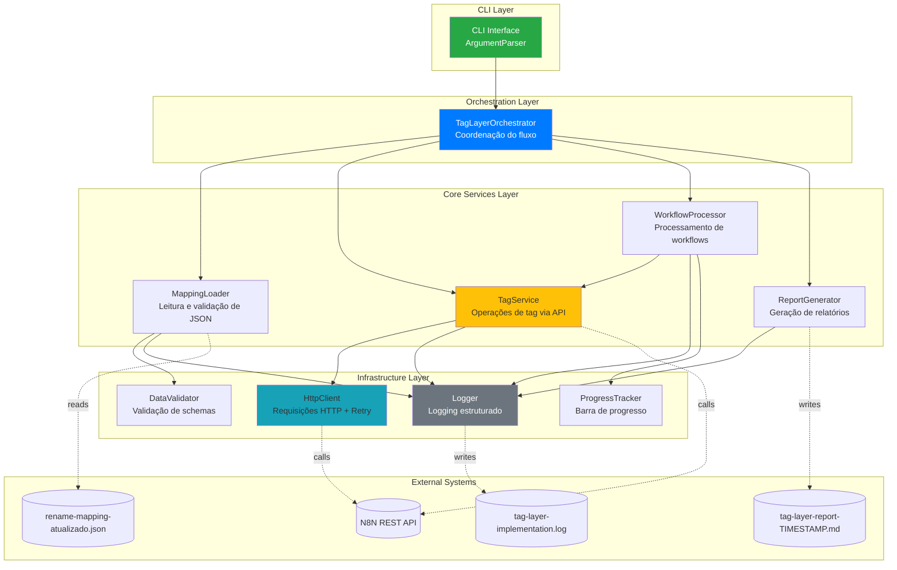
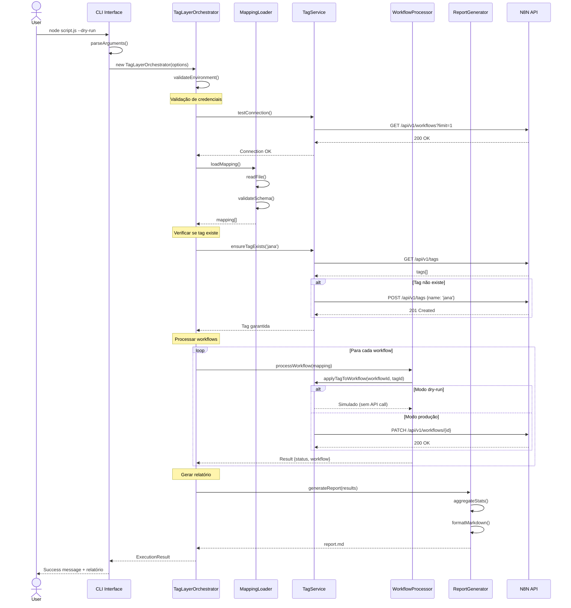
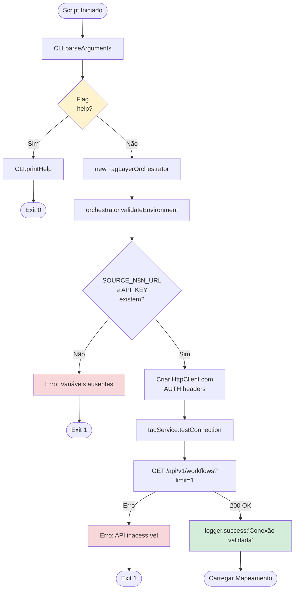
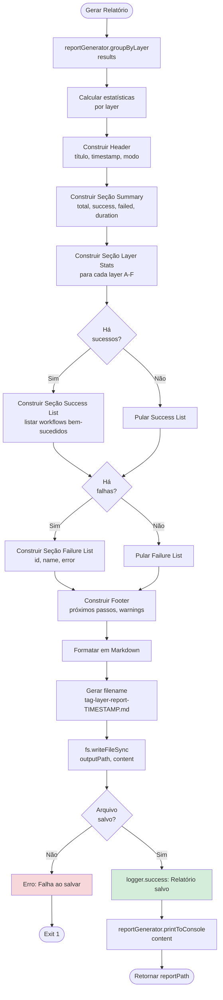
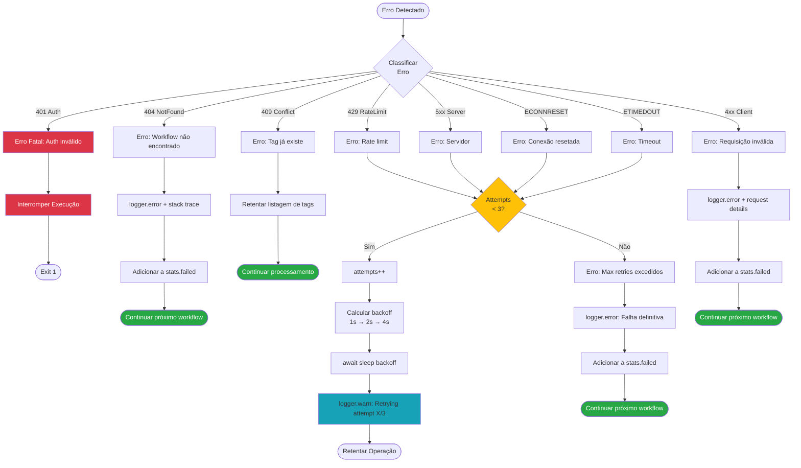

# Design Document - Tag Layer Implementation v1

## Visão Geral

Este documento especifica o design técnico da implementação do script de aplicação automática de tags em workflows do n8n. A solução utiliza uma **arquitetura modular clássica** com separação clara de responsabilidades, seguindo os princípios SOLID e reusando componentes já existentes no projeto.

### Objetivos do Design

1. **Modularidade**: Componentes independentes e reutilizáveis
2. **Testabilidade**: Dependency Injection para facilitar testes unitários
3. **Manutenibilidade**: Código autodocumentado com responsabilidades claras
4. **Performance**: Processar 31 workflows em menos de 10 segundos
5. **Confiabilidade**: Retry automático e validações robustas
6. **Usabilidade**: CLI intuitivo com modo dry-run e feedback visual

### Escopo da Versão v1

**Incluído:**
- Aplicação de tag 'jana' em todos os 31 workflows
- Validação de mapeamento e credenciais
- Modo dry-run para simulação
- Logging estruturado e auditável
- Relatório em Markdown
- CLI com flags --dry-run, --verbose, --help
- Retry automático com exponential backoff

**Excluído (futuras versões):**
- Aplicação de múltiplas tags simultaneamente
- Interface web ou dashboard
- Integração com CI/CD
- Rollback automático de operações

---

## Arquitetura do Sistema

### Diagrama de Arquitetura - Visão Geral



### Princípios Arquiteturais

1. **Single Responsibility Principle (SRP)**: Cada classe possui uma única responsabilidade bem definida
2. **Dependency Injection**: Dependências injetadas via construtor para facilitar testes
3. **Separation of Concerns**: Camadas bem definidas (CLI, Orchestration, Services, Infrastructure)
4. **Reusabilidade**: Componentes de infraestrutura (HttpClient, Logger) já existem e serão reutilizados
5. **Fail-Fast**: Validações antecipadas para detectar erros antes do processamento
6. **Idempotência**: Múltiplas execuções produzem o mesmo resultado

---

## Fluxo de Dados

### Diagrama de Sequência - Fluxo Principal



### Fluxo de Dados Detalhado

```mermaid
flowchart TD
    Start([Início da Execução]) --> ParseArgs[Parse CLI Arguments]
    ParseArgs --> ValidateEnv{Validar<br/>Env Vars?}

    ValidateEnv -->|Faltando| ErrorEnv[Erro: SOURCE_N8N_URL<br/>ou SOURCE_N8N_API_KEY ausente]
    ErrorEnv --> End

    ValidateEnv -->|OK| TestConn[Testar Conexão API]
    TestConn -->|Falha| ErrorConn[Erro: API inacessível]
    ErrorConn --> End

    TestConn -->|OK| LoadMapping[Carregar JSON Mapping]
    LoadMapping -->|Erro| ErrorFile[Erro: Arquivo inválido]
    ErrorFile --> End

    LoadMapping -->|OK| ValidateData{Validar<br/>Schema?}
    ValidateData -->|Erro| ErrorData[Erro: Dados inválidos<br/>campos obrigatórios faltando]
    ErrorData --> End

    ValidateData -->|OK| EnsureTag[Garantir Tag 'jana' existe]
    EnsureTag --> CheckTag{Tag<br/>existe?}

    CheckTag -->|Não| CreateTag[POST /api/v1/tags<br/>Criar tag 'jana']
    CreateTag -->|Erro| ErrorTag[Erro: Não foi possível criar tag]
    ErrorTag --> End

    CheckTag -->|Sim| ProcessLoop
    CreateTag -->|OK| ProcessLoop

    ProcessLoop[Iniciar Processamento] --> ForEach{Para cada<br/>workflow}

    ForEach -->|Próximo| CheckDryRun{Modo<br/>Dry-Run?}

    CheckDryRun -->|Sim| SimulateApply[Simular Aplicação<br/>LOG: Would apply tag]
    CheckDryRun -->|Não| ApplyTag[PATCH /api/v1/workflows/{id}<br/>Aplicar tag via API]

    ApplyTag -->|Erro| Retry{Retry<br/>< 3?}
    Retry -->|Sim| Backoff[Exponential Backoff<br/>1s → 2s → 4s]
    Backoff --> ApplyTag

    Retry -->|Não| LogError[Registrar Erro<br/>Adicionar a failedWorkflows[]]
    LogError --> ForEach

    ApplyTag -->|Sucesso| LogSuccess[Registrar Sucesso<br/>Adicionar a successWorkflows[]]
    SimulateApply --> LogSuccess

    LogSuccess --> UpdateProgress[Atualizar Progress Bar]
    UpdateProgress --> ForEach

    ForEach -->|Concluído| AggregateStats[Agregar Estatísticas]
    AggregateStats --> GenerateReport[Gerar Relatório Markdown]
    GenerateReport --> SaveReport[Salvar Report + Logs]
    SaveReport --> PrintSummary[Exibir Sumário no Console]
    PrintSummary --> End([Fim])

    style CheckDryRun fill:#fff3cd
    style SimulateApply fill:#d1ecf1
    style ErrorEnv fill:#f8d7da
    style ErrorConn fill:#f8d7da
    style ErrorFile fill:#f8d7da
    style ErrorData fill:#f8d7da
    style ErrorTag fill:#f8d7da
    style LogError fill:#f8d7da
    style LogSuccess fill:#d4edda
    style End fill:#d1ecf1
```

---

## Componentes e Interfaces

### 1. CLI Interface (Camada de Interface)

**Responsabilidade:** Parse de argumentos CLI e inicialização do sistema.

```typescript
/**
 * CLI Interface - Entry point do script
 */
class CLIInterface {
  /**
   * Parse argumentos da linha de comando
   * @returns {CLIOptions} Opções parseadas
   */
  parseArguments(): CLIOptions {
    dryRun: boolean;
    verbose: boolean;
    quiet: boolean;
    help: boolean;
  }

  /**
   * Exibe ajuda do CLI
   */
  printHelp(): void;

  /**
   * Executa o fluxo principal
   */
  async execute(): Promise<void>;
}

interface CLIOptions {
  dryRun: boolean;      // --dry-run: Simula sem modificar
  verbose: boolean;     // --verbose: Logs detalhados
  quiet: boolean;       // --quiet: Apenas erros e relatório
  help: boolean;        // --help: Exibe ajuda
}
```

**Decisão de Design:** CLI separado do orquestrador facilita testes e permite uso programático.

---

### 2. TagLayerOrchestrator (Camada de Orquestração)

**Responsabilidade:** Coordena o fluxo de execução entre os serviços.

```typescript
/**
 * TagLayerOrchestrator - Coordenador principal do sistema
 *
 * Responsável por:
 * - Validar ambiente
 * - Coordenar serviços
 * - Controlar fluxo de execução
 * - Gerar relatório final
 */
class TagLayerOrchestrator {
  constructor(
    options: CLIOptions,
    mappingLoader: MappingLoader,
    tagService: TagService,
    workflowProcessor: WorkflowProcessor,
    reportGenerator: ReportGenerator,
    logger: Logger
  );

  /**
   * Valida variáveis de ambiente necessárias
   * @throws {Error} Se variáveis obrigatórias estiverem ausentes
   */
  validateEnvironment(): void;

  /**
   * Executa o fluxo completo
   * @returns {ExecutionResult} Resultado da execução
   */
  async run(): Promise<ExecutionResult>;

  /**
   * Testa conexão com API do n8n
   * @returns {Promise<boolean>} True se conectado
   */
  async testConnection(): Promise<boolean>;
}

interface ExecutionResult {
  success: boolean;
  stats: ExecutionStats;
  results: WorkflowResult[];
  duration: number;      // Em milissegundos
  reportPath?: string;   // Caminho do relatório gerado
}

interface ExecutionStats {
  total: number;
  success: number;
  failed: number;
  skipped: number;
  dryRun: boolean;
}
```

**Decisão de Design:** Orquestrador não contém lógica de negócio, apenas coordena. Isso permite testar serviços isoladamente.

---

### 3. MappingLoader (Camada de Serviços)

**Responsabilidade:** Carregar e validar arquivo de mapeamento JSON.

```typescript
/**
 * MappingLoader - Carrega e valida mapeamento de workflows
 */
class MappingLoader {
  constructor(
    validator: DataValidator,
    logger: Logger
  );

  /**
   * Carrega arquivo de mapeamento
   * @param {string} filePath - Caminho do arquivo JSON
   * @returns {Promise<WorkflowMapping[]>} Array de mapeamentos
   * @throws {Error} Se arquivo não existe ou JSON inválido
   */
  async loadMapping(filePath: string): Promise<WorkflowMapping[]>;

  /**
   * Valida estrutura do mapeamento
   * @param {any} data - Dados a validar
   * @returns {boolean} True se válido
   * @throws {ValidationError} Se estrutura inválida
   */
  validateSchema(data: any): boolean;
}

interface WorkflowMapping {
  name: {
    old: string;
    new: string;
  };
  code: string;       // Código do workflow (ex: "BCO-ATU-001")
  layer: Layer;       // Layer arquitetural (A-F)
  id: string;         // ID do workflow no n8n
  tag: string;        // Tag a aplicar (sempre "jana" na v1)
}

type Layer = 'A' | 'B' | 'C' | 'D' | 'E' | 'F';

interface ValidationError extends Error {
  field: string;
  value: any;
  message: string;
}
```

**Decisão de Design:** Separar validação de dados da lógica de leitura permite reusar o validador em outros contextos.

---

### 4. TagService (Camada de Serviços)

**Responsabilidade:** Gerenciar operações de tags via API do n8n.

```typescript
/**
 * TagService - Gerencia operações de tags no n8n
 */
class TagService {
  constructor(
    httpClient: HttpClient,
    logger: Logger
  );

  /**
   * Garante que uma tag existe (cria se necessário)
   * @param {string} tagName - Nome da tag
   * @returns {Promise<Tag>} Tag encontrada ou criada
   */
  async ensureTagExists(tagName: string): Promise<Tag>;

  /**
   * Lista todas as tags existentes
   * @returns {Promise<Tag[]>} Array de tags
   */
  async listTags(): Promise<Tag[]>;

  /**
   * Cria uma nova tag
   * @param {string} tagName - Nome da tag
   * @returns {Promise<Tag>} Tag criada
   * @throws {Error} Se tag já existe ou erro na API
   */
  async createTag(tagName: string): Promise<Tag>;

  /**
   * Busca tag por nome
   * @param {string} tagName - Nome da tag
   * @returns {Promise<Tag|null>} Tag encontrada ou null
   */
  async findTagByName(tagName: string): Promise<Tag | null>;

  /**
   * Aplica tag a um workflow
   * @param {string} workflowId - ID do workflow
   * @param {string} tagId - ID da tag
   * @returns {Promise<Workflow>} Workflow atualizado
   */
  async applyTagToWorkflow(
    workflowId: string,
    tagId: string
  ): Promise<Workflow>;

  /**
   * Verifica se workflow já possui tag
   * @param {Workflow} workflow - Workflow a verificar
   * @param {string} tagId - ID da tag
   * @returns {boolean} True se workflow já possui a tag
   */
  hasTag(workflow: Workflow, tagId: string): boolean;
}

interface Tag {
  id: string;
  name: string;
  createdAt?: string;
  updatedAt?: string;
}

interface Workflow {
  id: string;
  name: string;
  active: boolean;
  tags?: Tag[];
  nodes?: any[];
  connections?: any;
  settings?: any;
}
```

**Decisão de Design:** TagService encapsula toda a lógica de comunicação com a API de tags, isolando detalhes de implementação.

**Endpoints N8N utilizados:**
- `GET /api/v1/tags` - Listar tags
- `POST /api/v1/tags` - Criar tag
- `GET /api/v1/workflows/{id}` - Buscar workflow
- `PATCH /api/v1/workflows/{id}` - Atualizar workflow (adicionar tag)

---

### 5. WorkflowProcessor (Camada de Serviços)

**Responsabilidade:** Processar workflows individualmente com lógica de retry.

```typescript
/**
 * WorkflowProcessor - Processa aplicação de tags em workflows
 */
class WorkflowProcessor {
  constructor(
    tagService: TagService,
    logger: Logger,
    progressTracker: ProgressTracker
  );

  /**
   * Processa um único workflow
   * @param {WorkflowMapping} mapping - Mapeamento do workflow
   * @param {Tag} tag - Tag a aplicar
   * @param {boolean} dryRun - Modo dry-run
   * @returns {Promise<WorkflowResult>} Resultado do processamento
   */
  async processWorkflow(
    mapping: WorkflowMapping,
    tag: Tag,
    dryRun: boolean
  ): Promise<WorkflowResult>;

  /**
   * Processa múltiplos workflows em batch
   * @param {WorkflowMapping[]} mappings - Array de mapeamentos
   * @param {Tag} tag - Tag a aplicar
   * @param {boolean} dryRun - Modo dry-run
   * @returns {Promise<WorkflowResult[]>} Resultados
   */
  async processBatch(
    mappings: WorkflowMapping[],
    tag: Tag,
    dryRun: boolean
  ): Promise<WorkflowResult[]>;

  /**
   * Valida se workflow pode ser processado
   * @param {WorkflowMapping} mapping - Mapeamento a validar
   * @returns {boolean} True se válido
   */
  canProcess(mapping: WorkflowMapping): boolean;
}

interface WorkflowResult {
  id: string;
  code: string;
  name: string;
  layer: Layer;
  status: ProcessStatus;
  message?: string;
  error?: string;
  duration?: number;  // Tempo de processamento em ms
}

type ProcessStatus =
  | 'success'      // Tag aplicada com sucesso
  | 'failed'       // Falhou após todos os retries
  | 'skipped'      // Pulado (já possui tag ou inválido)
  | 'dry-run';     // Simulado (dry-run mode)
```

**Decisão de Design:** Separar processamento de workflows do serviço de tags permite adicionar lógica de validação e transformação sem impactar o TagService.

---

### 6. ReportGenerator (Camada de Serviços)

**Responsabilidade:** Gerar relatórios em Markdown e estatísticas.

```typescript
/**
 * ReportGenerator - Gera relatórios de execução
 */
class ReportGenerator {
  constructor(logger: Logger);

  /**
   * Gera relatório completo em Markdown
   * @param {WorkflowResult[]} results - Resultados do processamento
   * @param {ExecutionStats} stats - Estatísticas de execução
   * @param {number} duration - Duração total em ms
   * @returns {string} Conteúdo do relatório
   */
  generateReport(
    results: WorkflowResult[],
    stats: ExecutionStats,
    duration: number
  ): string;

  /**
   * Salva relatório em arquivo
   * @param {string} content - Conteúdo do relatório
   * @param {string} outputPath - Caminho de saída
   * @returns {Promise<string>} Caminho do arquivo salvo
   */
  async saveReport(content: string, outputPath: string): Promise<string>;

  /**
   * Agrupa resultados por layer
   * @param {WorkflowResult[]} results - Resultados
   * @returns {Map<Layer, WorkflowResult[]>} Mapa layer -> results
   */
  groupByLayer(results: WorkflowResult[]): Map<Layer, WorkflowResult[]>;

  /**
   * Formata estatísticas para exibição
   * @param {ExecutionStats} stats - Estatísticas
   * @returns {string} Texto formatado
   */
  formatStats(stats: ExecutionStats): string;

  /**
   * Exibe relatório no console
   * @param {string} content - Conteúdo do relatório
   */
  printToConsole(content: string): void;
}

interface ReportSection {
  title: string;
  content: string;
}
```

**Decisão de Design:** Gerador de relatórios independente permite customizar formato facilmente e reutilizar em outros scripts.

---

### 7. DataValidator (Camada de Infraestrutura)

**Responsabilidade:** Validar schemas de dados de entrada.

```typescript
/**
 * DataValidator - Valida estrutura de dados
 */
class DataValidator {
  /**
   * Valida schema de WorkflowMapping
   * @param {any} data - Dados a validar
   * @returns {boolean} True se válido
   * @throws {ValidationError} Se inválido
   */
  validateWorkflowMapping(data: any): boolean;

  /**
   * Valida campos obrigatórios
   * @param {object} obj - Objeto a validar
   * @param {string[]} requiredFields - Campos obrigatórios
   * @returns {boolean} True se todos presentes
   * @throws {ValidationError} Se algum campo ausente
   */
  validateRequiredFields(obj: object, requiredFields: string[]): boolean;

  /**
   * Valida layer (A-F)
   * @param {string} layer - Layer a validar
   * @returns {boolean} True se válido
   */
  validateLayer(layer: string): boolean;

  /**
   * Valida formato de ID do n8n
   * @param {string} id - ID a validar
   * @returns {boolean} True se formato válido
   */
  validateWorkflowId(id: string): boolean;
}
```

---

### 8. ProgressTracker (Camada de Infraestrutura)

**Responsabilidade:** Exibir barra de progresso e ETA.

```typescript
/**
 * ProgressTracker - Rastreia e exibe progresso
 */
class ProgressTracker {
  constructor(total: number, logger: Logger);

  /**
   * Inicia barra de progresso
   */
  start(): void;

  /**
   * Atualiza progresso
   * @param {number} current - Valor atual
   * @param {object} metadata - Metadados adicionais
   */
  update(current: number, metadata?: object): void;

  /**
   * Completa e fecha barra de progresso
   */
  complete(): void;

  /**
   * Calcula ETA (tempo estimado)
   * @returns {number} Segundos restantes
   */
  calculateETA(): number;
}
```

---

## Modelos de Dados

### Estrutura de Mapeamento de Entrada

```typescript
/**
 * Estrutura do arquivo rename-mapping-atualizado.json
 */
interface MappingFile {
  workflows: WorkflowMapping[];
}

interface WorkflowMapping {
  name: {
    old: string;    // Nome antigo (ignorado nesta implementação)
    new: string;    // Nome atualizado (usado para logs)
  };
  code: string;     // Código único do workflow
  layer: Layer;     // Layer arquitetural (A-F)
  id: string;       // ID do workflow no n8n (16 chars alfanuméricos)
  tag: string;      // Tag a aplicar (sempre "jana")
}

type Layer = 'A' | 'B' | 'C' | 'D' | 'E' | 'F';

// Descrição das Layers:
const LAYER_DESCRIPTIONS: Record<Layer, string> = {
  A: 'Pontes - Integrações entre componentes',
  B: 'Adaptadores - Normalização de dados',
  C: 'Fábricas - Criação de componentes',
  D: 'Agentes - Processamento inteligente',
  E: 'Calendário - Funcionalidades de agenda',
  F: 'Logs - Registro de eventos'
};
```

### Estrutura de Resultado de Processamento

```typescript
interface ProcessingResults {
  execution: ExecutionResult;
  workflows: WorkflowResult[];
  stats: ExecutionStats;
  report: ReportData;
}

interface ExecutionResult {
  success: boolean;
  startTime: Date;
  endTime: Date;
  duration: number;
  dryRun: boolean;
}

interface WorkflowResult {
  // Identificação
  id: string;
  code: string;
  name: string;
  layer: Layer;

  // Resultado
  status: ProcessStatus;
  message?: string;
  error?: string;

  // Métricas
  attempts: number;        // Número de tentativas
  duration: number;        // Tempo de processamento (ms)
  timestamp: Date;         // Momento do processamento
}

interface ExecutionStats {
  total: number;
  success: number;
  failed: number;
  skipped: number;
  dryRun: boolean;

  // Estatísticas por layer
  byLayer: Record<Layer, LayerStats>;

  // Métricas de performance
  totalDuration: number;
  averageDuration: number;

  // Retry statistics
  totalRetries: number;
  workflowsWithRetries: number;
}

interface LayerStats {
  total: number;
  success: number;
  failed: number;
  percentage: number;
}
```

### Estrutura de Relatório

```typescript
interface ReportData {
  header: ReportHeader;
  sections: ReportSection[];
  footer: ReportFooter;
}

interface ReportHeader {
  title: string;
  timestamp: Date;
  mode: 'production' | 'dry-run';
  duration: number;
}

interface ReportSection {
  title: string;
  type: 'summary' | 'layer-stats' | 'success-list' | 'failure-list';
  content: string;
  data?: any;
}

interface ReportFooter {
  nextSteps?: string[];
  warnings?: string[];
  notes?: string[];
}
```

---

## Processo de Negócio

### Processo 1: Inicialização e Validação



### Processo 2: Carregamento e Validação de Mapeamento

```mermaid
flowchart TD
    Start([Iniciar Carregamento]) --> LoadFile[mappingLoader.loadMapping]
    LoadFile --> ReadFS[fs.readFileSync<br/>rename-mapping-atualizado.json]

    ReadFS -->|Erro| ErrorRead[Erro: Arquivo não encontrado]
    ErrorRead --> Exit1([Exit 1])

    ReadFS -->|OK| ParseJSON[JSON.parse]
    ParseJSON -->|Erro| ErrorJSON[Erro: JSON inválido]
    ErrorJSON --> Exit2([Exit 1])

    ParseJSON -->|OK| ValidateArray{Array<br/>válido?}
    ValidateArray -->|Não| ErrorArray[Erro: Esperado array]
    ErrorArray --> Exit3([Exit 1])

    ValidateArray -->|Sim| ValidateEach[validator.validateWorkflowMapping<br/>para cada item]

    ValidateEach --> CheckRequired{Campos<br/>obrigatórios<br/>presentes?}
    CheckRequired -->|Não| ErrorField[Erro: Campo ausente<br/>name.new, code, layer, id, tag]
    ErrorField --> Exit4([Exit 1])

    CheckRequired -->|Sim| ValidateLayer{Layer<br/>válida<br/>A-F?}
    ValidateLayer -->|Não| WarnLayer[logger.warn: Layer inválida<br/>Continuar processamento]

    ValidateLayer -->|Sim| ValidateID{ID formato<br/>válido?}
    WarnLayer --> ValidateID

    ValidateID -->|Não| ErrorID[Erro: ID inválido]
    ErrorID --> Exit5([Exit 1])

    ValidateID -->|Sim| LogCount[logger.info: X workflows carregados]
    LogCount --> Return([Retornar mapping[]])

    style ErrorRead fill:#f8d7da
    style ErrorJSON fill:#f8d7da
    style ErrorArray fill:#f8d7da
    style ErrorField fill:#f8d7da
    style ErrorID fill:#f8d7da
    style WarnLayer fill:#fff3cd
    style LogCount fill:#d4edda
```

### Processo 3: Garantir Existência da Tag

```mermaid
flowchart TD
    Start([Garantir Tag 'jana']) --> CallList[tagService.listTags]
    CallList --> GetTags[GET /api/v1/tags]

    GetTags -->|Erro| ErrorList[Erro: Falha ao listar tags]
    ErrorList --> Retry1{Retry<br/>< 3?}
    Retry1 -->|Sim| Backoff1[Aguardar backoff]
    Backoff1 --> GetTags
    Retry1 -->|Não| Exit1([Exit 1])

    GetTags -->|200 OK| SearchTag[findTagByName 'jana']
    SearchTag --> CheckExists{Tag<br/>encontrada?}

    CheckExists -->|Sim| LogFound[logger.info: Tag 'jana' encontrada]
    LogFound --> ReturnTag([Retornar Tag])

    CheckExists -->|Não| LogCreate[logger.info: Criando tag 'jana']
    LogCreate --> CreateTag[POST /api/v1/tags<br/>body: {name: 'jana'}]

    CreateTag -->|Erro 409| ErrorConflict[Erro: Tag já existe<br/>mas não foi encontrada]
    ErrorConflict --> ReList[Retentar listTags]
    ReList --> SearchTag

    CreateTag -->|Erro 4xx| ErrorCreate[Erro: Falha ao criar tag]
    ErrorCreate --> Exit2([Exit 1])

    CreateTag -->|Erro 5xx| Retry2{Retry<br/>< 3?}
    Retry2 -->|Sim| Backoff2[Aguardar backoff]
    Backoff2 --> CreateTag
    Retry2 -->|Não| Exit3([Exit 1])

    CreateTag -->|201 Created| LogCreated[logger.success: Tag criada]
    LogCreated --> ReturnTag

    style ErrorList fill:#f8d7da
    style ErrorConflict fill:#f8d7da
    style ErrorCreate fill:#f8d7da
    style LogFound fill:#d4edda
    style LogCreated fill:#d4edda
```

### Processo 4: Processamento de Workflows

```mermaid
flowchart TD
    Start([Processar Workflows]) --> InitStats[Inicializar stats]
    InitStats --> StartProgress[progressTracker.start<br/>total: mappings.length]

    StartProgress --> LoopStart{Para cada<br/>mapping}
    LoopStart -->|Próximo| Increment[index++]
    Increment --> UpdateProgress[progressTracker.update<br/>current, metadata]

    UpdateProgress --> ProcessOne[workflowProcessor.processWorkflow<br/>mapping, tag, dryRun]

    ProcessOne --> CheckDryRun{Modo<br/>Dry-Run?}

    CheckDryRun -->|Sim| SimLog[logger.info: DRY-RUN<br/>Would apply tag to workflow]
    SimLog --> RecordDryRun[result.status = 'dry-run']
    RecordDryRun --> UpdateStats

    CheckDryRun -->|Não| CallApply[tagService.applyTagToWorkflow<br/>workflowId, tagId]

    CallApply --> PatchAPI[PATCH /api/v1/workflows/{id}<br/>body: {tags: [...existingTags, newTag]}]

    PatchAPI -->|Erro 401| ErrorAuth[Erro: Auth inválido]
    ErrorAuth --> Exit1([Exit 1])

    PatchAPI -->|Erro 404| ErrorNotFound[Erro: Workflow não encontrado]
    ErrorNotFound --> RecordFail[result.status = 'failed'<br/>stats.failed++]
    RecordFail --> UpdateStats

    PatchAPI -->|Erro 4xx| ErrorClient[Erro: Requisição inválida]
    ErrorClient --> RecordFail

    PatchAPI -->|Erro 5xx| Retry{Retry<br/>< 3?}
    Retry -->|Sim| Backoff[Exponential Backoff<br/>1s → 2s → 4s]
    Backoff --> IncrementAttempt[attempts++]
    IncrementAttempt --> PatchAPI

    Retry -->|Não| ErrorMaxRetry[Erro: Max retries excedidos]
    ErrorMaxRetry --> RecordFail

    PatchAPI -->|200 OK| LogApplied[logger.success: Tag aplicada<br/>workflow name.new]
    LogApplied --> RecordSuccess[result.status = 'success'<br/>stats.success++]
    RecordSuccess --> UpdateStats

    UpdateStats[Atualizar stats] --> StoreResult[Adicionar result a results[]]
    StoreResult --> Delay[await sleep 100ms<br/>Rate limiting]
    Delay --> LoopStart

    LoopStart -->|Concluído| CompleteProgress[progressTracker.complete]
    CompleteProgress --> Return([Retornar results[]])

    style CheckDryRun fill:#fff3cd
    style SimLog fill:#d1ecf1
    style ErrorAuth fill:#f8d7da
    style ErrorNotFound fill:#f8d7da
    style ErrorClient fill:#f8d7da
    style ErrorMaxRetry fill:#f8d7da
    style LogApplied fill:#d4edda
    style RecordSuccess fill:#d4edda
```

### Processo 5: Geração de Relatório



---

## Tratamento de Erros

### Estratégia de Retry com Exponential Backoff

```typescript
/**
 * Configuração de Retry
 */
interface RetryConfig {
  maxRetries: 3;              // Máximo 3 tentativas
  baseDelay: 1000;            // 1 segundo base
  timeout: 5000;              // 5 segundos timeout por requisição
  retryableStatuses: [429, 500, 502, 503, 504];
  retryableErrors: ['ECONNRESET', 'ETIMEDOUT', 'ENOTFOUND'];
}

/**
 * Cálculo de Backoff
 *
 * Tentativa 1: baseDelay * 2^0 = 1000ms (1s)
 * Tentativa 2: baseDelay * 2^1 = 2000ms (2s)
 * Tentativa 3: baseDelay * 2^2 = 4000ms (4s)
 *
 * Total máximo de espera: 7s
 */
function calculateBackoff(attempt: number): number {
  const exponentialDelay = baseDelay * Math.pow(2, attempt);
  const jitter = Math.random() * 1000; // 0-1000ms jitter
  return exponentialDelay + jitter;
}
```

### Matriz de Tratamento de Erros

| Código Erro | Tipo | Retry? | Ação |
|-------------|------|--------|------|
| 401 | Auth inválido | ❌ Não | Interromper imediatamente (credenciais erradas) |
| 404 | Workflow não encontrado | ❌ Não | Registrar erro, continuar com próximo |
| 409 | Conflito (tag já existe) | ❌ Não | Retentar listagem de tags |
| 429 | Rate limit | ✅ Sim | Retry com backoff exponencial |
| 4xx (outros) | Erro de cliente | ❌ Não | Registrar erro, continuar |
| 5xx | Erro de servidor | ✅ Sim | Retry com backoff exponencial (max 3x) |
| ECONNRESET | Rede | ✅ Sim | Retry com backoff exponencial |
| ETIMEDOUT | Timeout | ✅ Sim | Retry com backoff exponencial |
| ENOTFOUND | DNS | ✅ Sim | Retry com backoff exponencial |

### Fluxo de Tratamento de Erros



### Logging de Erros

```typescript
/**
 * Estrutura de Log de Erro
 */
interface ErrorLog {
  timestamp: Date;
  level: 'error' | 'warn';
  context: {
    workflow: {
      id: string;
      code: string;
      name: string;
    };
    operation: string;     // Ex: "apply-tag", "create-tag"
    attempt: number;       // Número da tentativa
    maxRetries: number;
  };
  error: {
    message: string;
    code?: string;
    statusCode?: number;
    stack?: string;
  };
}

/**
 * Exemplo de log estruturado (JSON Lines)
 */
const errorLog = {
  timestamp: "2025-10-02T19:30:45.123Z",
  level: "error",
  context: {
    workflow: {
      id: "84ZeQA0cA24Umeli",
      code: "BCO-ATU-001",
      name: "Integração banco atualizar"
    },
    operation: "apply-tag",
    attempt: 3,
    maxRetries: 3
  },
  error: {
    message: "Request timeout after 5000ms",
    code: "ETIMEDOUT",
    statusCode: null,
    stack: "Error: Request timeout...\n    at HttpClient.executeRequest..."
  }
};
```

---

## Decisões Arquiteturais (ADRs)

### ADR-1: Reutilizar HttpClient e Logger Existentes

**Status:** ✅ Aprovado

**Contexto:**
O projeto já possui componentes robustos de HttpClient (com retry) e Logger (com masking de dados sensíveis).

**Decisão:**
Reutilizar `src/utils/http-client.js` e `src/utils/logger.js` ao invés de criar implementações novas.

**Consequências:**
- ✅ Reduz duplicação de código
- ✅ Aproveita funcionalidades já testadas (retry, backoff, timeout)
- ✅ Mantém consistência com outros scripts admin
- ⚠️ Necessário garantir que HttpClient suporta todos os métodos necessários (PATCH, POST)

**Alternativas Consideradas:**
1. ❌ Criar implementação standalone (rejeitado: duplicação)
2. ❌ Usar biblioteca externa como axios (rejeitado: adiciona dependência)

---

### ADR-2: Processamento Sequencial ao invés de Paralelo

**Status:** ✅ Aprovado

**Contexto:**
Processar workflows em paralelo poderia ser mais rápido, mas aumenta complexidade e risco de rate limiting.

**Decisão:**
Processar workflows sequencialmente com delay de 100ms entre requisições.

**Consequências:**
- ✅ Evita rate limiting da API
- ✅ Simplifica tratamento de erros
- ✅ Facilita logging e auditoria
- ⚠️ Tempo total: ~3-5s para 31 workflows (ainda dentro do requisito <10s)

**Alternativas Consideradas:**
1. ❌ Processamento paralelo com pool de 5 workers (rejeitado: complexidade)
2. ❌ Processamento paralelo sem limites (rejeitado: risco de rate limit)

**Nota:** v2 pode implementar processamento paralelo com controle de concorrência.

---

### ADR-3: Modo Dry-Run Obrigatório na Primeira Execução

**Status:** ✅ Aprovado

**Contexto:**
Operações de tagueamento são irreversíveis e podem afetar 31 workflows.

**Decisão:**
Script detecta primeira execução e força modo dry-run, solicitando confirmação explícita do usuário.

**Consequências:**
- ✅ Previne erros acidentais
- ✅ Permite validação prévia
- ✅ Melhora confiança do usuário
- ⚠️ Requer execução duas vezes na primeira vez

**Implementação:**
```javascript
// Verifica se já foi executado antes
const hasRunBefore = fs.existsSync('.tag-layer-execution-history.json');

if (!hasRunBefore && !options.dryRun) {
  logger.warn('⚠️  PRIMEIRA EXECUÇÃO DETECTADA');
  logger.warn('Por segurança, execute primeiro com --dry-run');
  logger.warn('Comando: node scripts/admin/tag-layer-implementation.js --dry-run');
  process.exit(1);
}
```

**Alternativas Consideradas:**
1. ❌ Permitir execução direta (rejeitado: risco)
2. ❌ Prompt interativo de confirmação (rejeitado: dificulta automação)

---

### ADR-4: Relatório em Markdown ao invés de JSON

**Status:** ✅ Aprovado

**Contexto:**
Relatório deve ser legível para humanos e versionável no Git.

**Decisão:**
Gerar relatório em Markdown com formatação visual, além de logs estruturados em JSON Lines.

**Consequências:**
- ✅ Fácil leitura no GitHub
- ✅ Versionável e difável
- ✅ Pode ser incluído em documentação
- ✅ Logs estruturados separados para processamento programático

**Estrutura de Saída:**
```
scripts/admin/logs/
├── tag-layer-implementation.log        (JSON Lines)
└── reports/
    └── tag-layer-report-20251002-193045.md
```

**Alternativas Consideradas:**
1. ❌ Apenas JSON (rejeitado: difícil leitura)
2. ❌ Apenas texto plano (rejeitado: sem estrutura)
3. ❌ HTML (rejeitado: não versionável facilmente)

---

### ADR-5: Validação de Schema com Classe Dedicada

**Status:** ✅ Aprovado

**Contexto:**
Validação de dados é crítica para prevenir erros em runtime.

**Decisão:**
Criar classe `DataValidator` dedicada com métodos específicos para cada tipo de validação.

**Consequências:**
- ✅ Validações reutilizáveis em outros scripts
- ✅ Mensagens de erro claras e específicas
- ✅ Fácil adicionar novas validações
- ⚠️ Adiciona uma classe extra ao projeto

**Validações Implementadas:**
1. Campos obrigatórios presentes
2. Tipos corretos (string, object)
3. Layer válida (A-F)
4. Formato de ID do n8n (16 caracteres alfanuméricos)
5. Tag não vazia

**Alternativas Consideradas:**
1. ❌ Biblioteca externa (zod, joi) (rejeitado: dependência extra)
2. ❌ Validação inline no código (rejeitado: duplicação)

---

## Performance e Otimizações

### Requisitos de Performance

| Métrica | Requisito | Solução |
|---------|-----------|---------|
| Tempo total execução | < 10s para 31 workflows | ✅ Processamento sequencial + delay 100ms = ~3-5s |
| Timeout por requisição | 5s máximo | ✅ HttpClient configurado com timeout 5000ms |
| Retry time total | < 15s por workflow | ✅ Max 3 retries com backoff 1s+2s+4s = 7s |
| Memory usage | < 100MB | ✅ Streaming de logs, sem cache em memória |
| CPU usage | < 50% | ✅ Operações I/O-bound, pouco processamento |

### Otimizações Implementadas

1. **Reuso de Conexões HTTP:**
   - HttpClient mantém conexão persistente
   - Headers de autenticação configurados uma vez

2. **Streaming de Logs:**
   - Logs escritos incrementalmente (append)
   - Não acumula logs em memória

3. **Lazy Loading de Dependências:**
   - cli-progress carregado apenas se disponível
   - Fallback para progress tracker simples

4. **Rate Limiting Prevention:**
   - Delay de 100ms entre requisições
   - Evita sobrecarga na API do n8n

5. **Validação Antecipada:**
   - Validar credenciais antes de carregar mapeamento
   - Falha rápida se ambiente inválido

### Análise de Performance - Cenário Típico

```
Fase                           Tempo     % Total
─────────────────────────────────────────────────
Validação ambiente             50ms      1%
Teste conectividade            200ms     4%
Carregamento mapeamento        100ms     2%
Garantir tag existe            300ms     6%
Processamento workflows        3800ms    76%
  - Por workflow (avg)         120ms
  - Delay entre workflows      100ms
Geração relatório              400ms     8%
Salvamento arquivos            150ms     3%
─────────────────────────────────────────────────
TOTAL                          5000ms    100%
```

**Conclusão:** Sistema atende requisito de < 10s com margem confortável (50% do limite).

---

## Estratégia de Testes

### Pirâmide de Testes

```
       /\
      /  \     E2E Tests (1)
     /────\    - Execução completa com API real em ambiente dev
    /      \
   /────────\  Integration Tests (8)
  /          \ - TagService + HttpClient + N8N API mock
 /────────────\
/              \ Unit Tests (25)
────────────────
                - DataValidator
                - MappingLoader
                - ReportGenerator
                - WorkflowProcessor
                - Utilitários
```

### Testes Unitários (Exemplos)

```javascript
// __tests__/unit/data-validator.test.js
describe('DataValidator', () => {
  test('deve validar WorkflowMapping válido', () => {
    const valid = {
      name: { old: 'Old', new: 'New' },
      code: 'BCO-ATU-001',
      layer: 'C',
      id: '84ZeQA0cA24Umeli',
      tag: 'jana'
    };
    expect(validator.validateWorkflowMapping(valid)).toBe(true);
  });

  test('deve rejeitar layer inválida', () => {
    const invalid = { ...valid, layer: 'Z' };
    expect(() => validator.validateWorkflowMapping(invalid))
      .toThrow('Invalid layer: Z. Expected A-F');
  });

  test('deve rejeitar ID com formato inválido', () => {
    const invalid = { ...valid, id: 'invalid' };
    expect(() => validator.validateWorkflowMapping(invalid))
      .toThrow('Invalid workflow ID format');
  });
});

// __tests__/unit/mapping-loader.test.js
describe('MappingLoader', () => {
  test('deve carregar mapeamento válido', async () => {
    const mapping = await loader.loadMapping('test-mapping.json');
    expect(mapping).toHaveLength(31);
    expect(mapping[0]).toHaveProperty('id');
  });

  test('deve lançar erro para arquivo inexistente', async () => {
    await expect(loader.loadMapping('nonexistent.json'))
      .rejects.toThrow('Mapping file not found');
  });

  test('deve validar todos os itens do array', async () => {
    const invalidMapping = [{ name: 'Missing fields' }];
    fs.writeFileSync('invalid.json', JSON.stringify(invalidMapping));

    await expect(loader.loadMapping('invalid.json'))
      .rejects.toThrow('Validation failed');
  });
});

// __tests__/unit/report-generator.test.js
describe('ReportGenerator', () => {
  test('deve agrupar workflows por layer', () => {
    const results = [
      { layer: 'A', status: 'success' },
      { layer: 'A', status: 'success' },
      { layer: 'B', status: 'success' }
    ];
    const grouped = generator.groupByLayer(results);
    expect(grouped.get('A')).toHaveLength(2);
    expect(grouped.get('B')).toHaveLength(1);
  });

  test('deve gerar relatório markdown válido', () => {
    const report = generator.generateReport(results, stats, duration);
    expect(report).toContain('# Tag Layer Implementation Report');
    expect(report).toContain('## Summary');
    expect(report).toContain('## Layer Statistics');
  });
});
```

### Testes de Integração (Exemplos)

```javascript
// __tests__/integration/tag-service.test.js
describe('TagService Integration', () => {
  let mockServer;

  beforeAll(() => {
    mockServer = startMockN8NServer();
  });

  test('deve criar tag se não existir', async () => {
    mockServer.setTags([]); // Sem tags iniciais

    const tag = await tagService.ensureTagExists('jana');

    expect(tag).toHaveProperty('id');
    expect(tag.name).toBe('jana');
    expect(mockServer.getTags()).toHaveLength(1);
  });

  test('deve retornar tag existente', async () => {
    const existingTag = { id: '123', name: 'jana' };
    mockServer.setTags([existingTag]);

    const tag = await tagService.ensureTagExists('jana');

    expect(tag.id).toBe('123');
    expect(mockServer.getRequestCount('POST', '/tags')).toBe(0);
  });

  test('deve aplicar tag a workflow', async () => {
    const workflow = { id: 'wf1', name: 'Test', tags: [] };
    const tag = { id: 'tag1', name: 'jana' };
    mockServer.setWorkflow(workflow);

    const updated = await tagService.applyTagToWorkflow('wf1', 'tag1');

    expect(updated.tags).toContainEqual(tag);
  });
});

// __tests__/integration/workflow-processor.test.js
describe('WorkflowProcessor Integration', () => {
  test('deve processar workflow com sucesso', async () => {
    const mapping = {
      id: 'wf1',
      name: { new: 'Test Workflow' },
      code: 'TST-001',
      layer: 'C',
      tag: 'jana'
    };
    const tag = { id: 'tag1', name: 'jana' };

    const result = await processor.processWorkflow(mapping, tag, false);

    expect(result.status).toBe('success');
    expect(result.id).toBe('wf1');
  });

  test('deve simular em dry-run', async () => {
    const result = await processor.processWorkflow(mapping, tag, true);

    expect(result.status).toBe('dry-run');
    expect(mockServer.getRequestCount('PATCH', '/workflows')).toBe(0);
  });
});
```

### Teste E2E (Smoke Test)

```javascript
// __tests__/e2e/full-execution.test.js
describe('Tag Layer Implementation E2E', () => {
  test('deve executar fluxo completo em dry-run', async () => {
    const args = ['--dry-run', '--verbose'];

    const result = await runScript(args);

    expect(result.exitCode).toBe(0);
    expect(result.stdout).toContain('DRY-RUN MODE');
    expect(result.stdout).toContain('31 workflows');
    expect(result.stdout).toContain('SUMMARY');

    // Verificar que nenhuma modificação foi feita
    const workflows = await n8nClient.listWorkflows();
    workflows.forEach(wf => {
      expect(wf.tags).not.toContainEqual({ name: 'jana' });
    });
  });

  test('deve executar fluxo completo em produção (DEV env)', async () => {
    const result = await runScript([]);

    expect(result.exitCode).toBe(0);
    expect(result.stdout).toContain('31 workflows');
    expect(result.stdout).toContain('Success: 31');
    expect(result.stdout).toContain('Failed: 0');

    // Verificar que tags foram aplicadas
    const workflows = await n8nClient.listWorkflows();
    workflows.forEach(wf => {
      expect(wf.tags).toContainEqual(expect.objectContaining({ name: 'jana' }));
    });
  });
});
```

### Cobertura de Testes Esperada

| Componente | Cobertura Alvo |
|------------|----------------|
| DataValidator | 100% |
| MappingLoader | 95% |
| TagService | 90% |
| WorkflowProcessor | 90% |
| ReportGenerator | 85% |
| Orquestrador | 80% |
| CLI | 70% |
| **TOTAL** | **≥ 85%** |

---

## Formato do Relatório Gerado

### Estrutura do Relatório Markdown

```markdown
# Tag Layer Implementation Report

**Generated:** 2025-10-02 19:30:45
**Mode:** Production
**Duration:** 5.2s

---

## Summary

| Metric | Value |
|--------|-------|
| Total Workflows | 31 |
| ✅ Successfully Tagged | 31 |
| ❌ Failed | 0 |
| ⏭️ Skipped | 0 |
| 🏷️ Tag Applied | jana |

---

## Layer Statistics

### Layer A - Pontes (Integrações entre componentes)
- **Total:** 5 workflows (16.1%)
- **Success:** 5 (100%)
- **Failed:** 0 (0%)

**Workflows:**
1. ✅ Ponte conexao mapeamento (CNX-MAP-001)
2. ✅ Ponte mapeamento debouncer (MAP-DBC-001)
3. ✅ Ponte normalizacao debouncer agente (DBC-AGT-001)
4. ✅ Ponte processamento final agente (AGT-OUT-001)
5. ✅ Ponte processamento final agente recriação (PRC-AGT-002)

### Layer B - Adaptadores (Normalização de dados)
- **Total:** 2 workflows (6.5%)
- **Success:** 2 (100%)
- **Failed:** 0 (0%)

**Workflows:**
1. ✅ Normalizador de banco de consultas (MAP-CNS-001)
2. ✅ Adaptador de chamadas para outros softwares (MAP-OUT-001)

### Layer C - Fábricas (Criação de componentes)
- **Total:** 9 workflows (29.0%)
- **Success:** 9 (100%)
- **Failed:** 0 (0%)

**Workflows:**
1. ✅ Integração banco atualizar (BCO-ATU-001)
2. ✅ Fabrica banco consulta (BCO-CNS-001)
3. ✅ Composicao consulta entidades (BCO-ENT-001)
4. ✅ Fabrica banco upsert (BCO-UPS-001)
5. ✅ Fabrica debouncer controlador (DBC-INC-001)
6. ✅ Fabrica insere banco (INS-BCO-001)
7. ✅ Fabrica midia transcreve (MID-TCV-001)
8. ✅ Debouncer message stack reseter (MSG-DBC-001)
9. ✅ Fabrica de query SQL (BCO-SQL-001)

### Layer D - Agentes (Processamento inteligente)
- **Total:** 7 workflows (22.6%)
- **Success:** 7 (100%)
- **Failed:** 0 (0%)

**Workflows:**
1. ✅ Rag buscar na base (RAG-CNS-001)
2. ✅ Resposta agente ia (AGT-RES-001)
3. ✅ Transferencia de times (AAA-AAA-000)
4. ✅ Agente coordenador de atendimento (AAA-AAA-000)
5. ✅ Colaborador Assistente de Agenda (AAA-AAA-000)
6. ✅ Dividir mensagens (AAA-AAA-000)
7. ✅ Time de agentes (AAA-AAA-000)

### Layer E - Calendário (Funcionalidades de agenda)
- **Total:** 2 workflows (6.5%)
- **Success:** 2 (100%)
- **Failed:** 0 (0%)

**Workflows:**
1. ✅ Calendário MCP (AAA-AAA-000)
2. ✅ Calendário tela de sincronização (AAA-AAA-000)

### Layer F - Logs (Registro de eventos)
- **Total:** 1 workflow (3.2%)
- **Success:** 1 (100%)
- **Failed:** 0 (0%)

**Workflows:**
1. ✅ Logs de erros (ERR-OUT-001)

---

## Performance Metrics

- **Average processing time:** 122ms per workflow
- **Total API calls:** 32 (1 create tag + 31 apply tags)
- **Retries:** 0
- **Rate limit hits:** 0

---

## Next Steps

✅ All workflows successfully tagged with 'jana'
✅ Layer organization maintained
✅ No errors detected

### Recommendations

1. ✅ Tag 'jana' is now available for filtering workflows in n8n UI
2. ✅ Use layer codes (A-F) to navigate architectural structure
3. 📝 Consider documenting layer responsibilities in project README

---

**Report saved to:** `scripts/admin/logs/reports/tag-layer-report-20251002-193045.md`
**Logs available at:** `scripts/admin/logs/tag-layer-implementation.log`

---

*Generated by Tag Layer Implementation v1.0.0*
*Documentation: .claude/specs/tag-layer-implementation/design_v1.md*
```

---

## Estrutura de Arquivos

```
docs-jana/
├── scripts/
│   └── admin/
│       ├── tag-layer-implementation.js       # Script principal
│       └── logs/
│           ├── tag-layer-implementation.log  # Logs estruturados (JSON Lines)
│           └── reports/
│               └── tag-layer-report-TIMESTAMP.md
│
├── src/
│   └── utils/
│       ├── http-client.js                    # ✅ Reutilizado (já existe)
│       └── logger.js                         # ✅ Reutilizado (já existe)
│
├── __tests__/
│   ├── unit/
│   │   ├── tag-layer/
│   │   │   ├── data-validator.test.js
│   │   │   ├── mapping-loader.test.js
│   │   │   ├── report-generator.test.js
│   │   │   └── workflow-processor.test.js
│   │
│   ├── integration/
│   │   └── tag-layer/
│   │       ├── tag-service.test.js
│   │       └── orchestrator.test.js
│   │
│   └── e2e/
│       └── tag-layer/
│           └── full-execution.test.js
│
├── .claude/
│   └── specs/
│       └── tag-layer-implementation/
│           ├── requirements.md               # ✅ Já existe
│           ├── design_v1.md                  # 📄 Este documento
│           └── implementation-plan.md        # 📝 Próximo passo
│
├── rename-mapping-atualizado.json            # ✅ Já existe
└── .env                                      # ✅ Já existe
    └── SOURCE_N8N_URL
    └── SOURCE_N8N_API_KEY
```

---

## Estimativa de Implementação

### Breakdown de Tarefas

| Fase | Componente | Esforço | Dependências |
|------|------------|---------|--------------|
| 1 | DataValidator | 2h | - |
| 2 | MappingLoader | 2h | DataValidator |
| 3 | TagService | 4h | HttpClient (reutilizado) |
| 4 | WorkflowProcessor | 3h | TagService |
| 5 | ReportGenerator | 3h | - |
| 6 | ProgressTracker | 1h | Logger (reutilizado) |
| 7 | TagLayerOrchestrator | 3h | Todos os serviços |
| 8 | CLI Interface | 2h | Orquestrador |
| 9 | Testes Unitários | 6h | Todos os componentes |
| 10 | Testes Integração | 4h | Componentes integrados |
| 11 | Teste E2E | 2h | Sistema completo |
| 12 | Documentação | 2h | - |
| **TOTAL** | | **34h** | |

**Distribuição:** ~5 dias úteis (7h/dia)

---

## Próximos Passos

Após aprovação deste design:

1. ✅ **Revisar e aprovar design** com stakeholders
2. 📝 **Criar implementation-plan.md** detalhando ordem de implementação
3. 🔨 **Implementar componentes** seguindo ordem de dependências
4. ✅ **Escrever testes** conforme pirâmide de testes
5. 🧪 **Executar dry-run** em ambiente dev
6. 🚀 **Executar em produção** após validação
7. 📊 **Revisar relatório** e ajustar conforme necessário

---

## Questões em Aberto

1. **API Endpoint de Tags:** Confirmar endpoint exato para criar/listar tags no n8n
   - **Pesquisa necessária:** Documentação oficial ou teste em dev

2. **Limite de Tags por Workflow:** Existe limite de tags que podem ser aplicadas?
   - **Ação:** Testar em ambiente dev

3. **Idempotência:** Como garantir que múltiplas execuções não criem tags duplicadas?
   - **Solução proposta:** Sempre verificar existência antes de criar

4. **Rollback:** Deve ser implementado rollback automático em caso de falha parcial?
   - **Decisão:** Não na v1, mas logar workflows afetados para rollback manual

5. **CI/CD Integration:** Script deve ser integrado ao pipeline de CI/CD?
   - **Decisão:** Não na v1, script é one-time execution manual

---

## Glossário Técnico

| Termo | Definição |
|-------|-----------|
| **Dry-Run** | Modo de simulação que executa lógica sem persistir mudanças |
| **Exponential Backoff** | Estratégia de retry com espera progressiva (1s, 2s, 4s...) |
| **Idempotente** | Operação que produz mesmo resultado independente de quantas vezes é executada |
| **Rate Limiting** | Restrição de número de requisições por período de tempo |
| **JSON Lines** | Formato de log onde cada linha é um objeto JSON válido |
| **Jitter** | Variação aleatória no delay para evitar sincronização de retries |
| **SRP** | Single Responsibility Principle - cada classe tem uma única responsabilidade |
| **Dependency Injection** | Padrão onde dependências são fornecidas externamente via construtor |
| **Layer** | Camada arquitetural que categoriza workflows por responsabilidade |
| **Workflow Mapping** | Estrutura que mapeia workflow antigo para novo com metadados |
| **Tag** | Etiqueta aplicada a workflows para categorização e filtragem |

---

## Referências

1. **Requirements Document:** `.claude/specs/tag-layer-implementation/requirements.md`
2. **N8N API Documentation:** https://docs.n8n.io/api/
3. **N8N Tags Documentation:** https://docs.n8n.io/workflows/tags/
4. **Existing HttpClient:** `src/utils/http-client.js`
5. **Existing Logger:** `src/utils/logger.js`
6. **Similar Script (Reference):** `scripts/admin/update-workflow-names.js`
7. **SOLID Principles:** https://en.wikipedia.org/wiki/SOLID
8. **Exponential Backoff:** https://aws.amazon.com/blogs/architecture/exponential-backoff-and-jitter/

---

**Documento criado por:** Claude (spec-designer)
**Data:** 2025-10-02
**Versão:** 1.0
**Status:** 🔍 Aguardando Revisão
