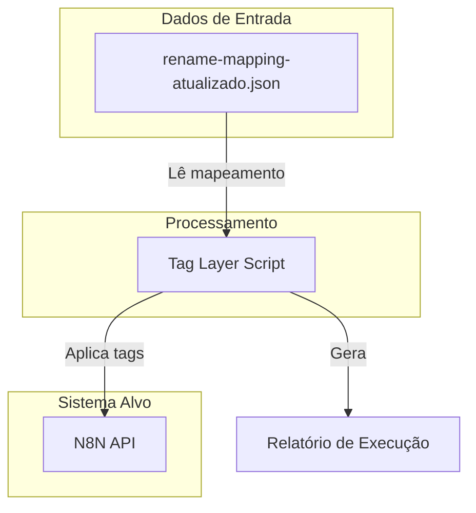
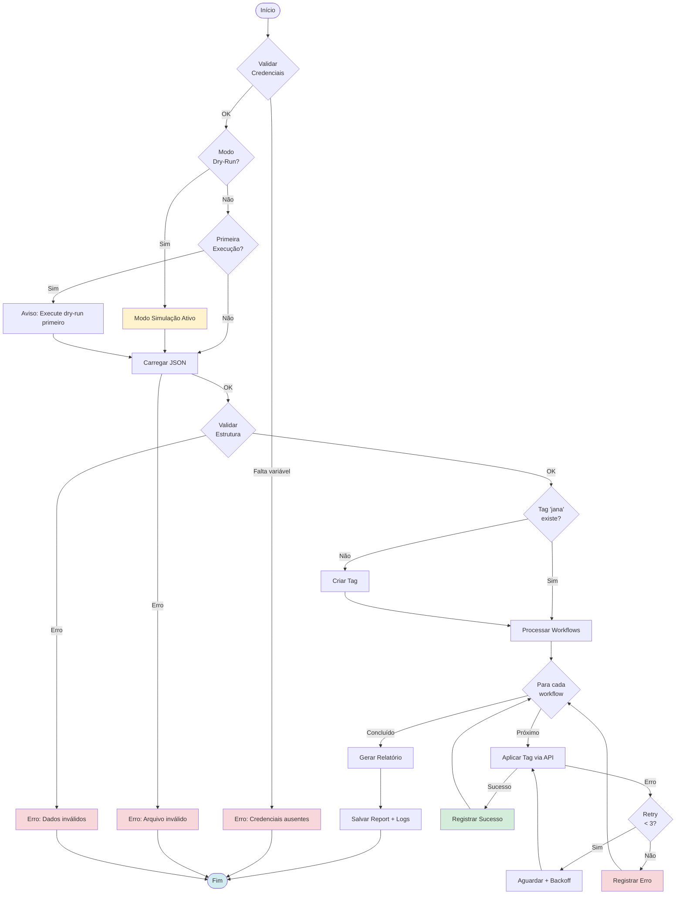
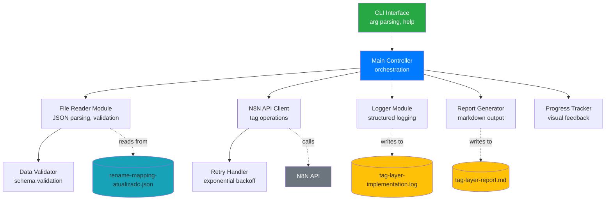

# Documento de Requirements - Tag Layer Implementation

## Introdução

Este documento especifica os requisitos para a implementação de um script de aplicação automática de tags em workflows do n8n. O objetivo é categorizar e organizar 31 workflows existentes através da aplicação da tag 'jana' e organização por layers arquiteturais (A-F), baseando-se no arquivo de mapeamento `rename-mapping-atualizado.json`.

A solução será um script administrativo de execução única (one-time execution) que automatiza o processo de tagueamento, com capacidade de validação prévia via modo dry-run e logging detalhado para auditoria.

### Contexto do Sistema

- **Total de workflows**: 31 workflows mapeados
- **Estrutura de dados**: Arquivo JSON com campos: name.old, name.new, code, layer, id, tag
- **Layers definidas**:
  - A: Pontes (integrações entre componentes)
  - B: Adaptadores (normalização de dados)
  - C: Fábricas (criação de componentes)
  - D: Agentes (processamento inteligente)
  - E: Calendário (funcionalidades de agenda)
  - F: Logs (registro de eventos)
- **Tag padrão**: 'jana' aplicada a todos os workflows

### Diagrama de Contexto

---

## Requisitos Funcionais

### REQ-1: Leitura e Validação do Arquivo de Mapeamento

**User Story:** Como desenvolvedor, eu quero que o script leia e valide o arquivo de mapeamento, para que possamos garantir a integridade dos dados antes do processamento.

#### Acceptance Criteria

1. WHEN o script é iniciado THEN o sistema SHALL localizar o arquivo `rename-mapping-atualizado.json` no diretório raiz do projeto
2. WHEN o arquivo é encontrado THEN o sistema SHALL validar que o JSON possui estrutura válida
3. WHEN cada item do array é processado THEN o sistema SHALL validar a presença dos campos obrigatórios: name.new, code, layer, id, tag
4. IF algum campo obrigatório estiver ausente THEN o sistema SHALL registrar erro e interromper a execução
5. WHEN a validação é concluída com sucesso THEN o sistema SHALL registrar no log o total de workflows encontrados
6. IF o arquivo não existir THEN o sistema SHALL exibir mensagem de erro clara indicando o caminho esperado

---

### REQ-2: Identificação de Workflows por Nome Atualizado

**User Story:** Como desenvolvedor, eu quero que o script utilize apenas o campo name.new para identificação, para que possamos trabalhar com a nomenclatura atualizada dos workflows.

#### Acceptance Criteria

1. WHEN o sistema processa um workflow THEN o sistema SHALL utilizar APENAS o valor de `name.new` para identificação
2. WHEN o campo `name.old` está presente THEN o sistema SHALL ignorá-lo completamente
3. IF `name.new` não existir ou estiver vazio THEN o sistema SHALL registrar erro específico com o ID do workflow
4. WHEN múltiplos workflows possuem o mesmo `name.new` THEN o sistema SHALL identificá-los usando o campo `id` como diferenciador
5. WHEN o log de processamento é gerado THEN o sistema SHALL exibir sempre `name.new` nas mensagens

---

### REQ-3: Aplicação de Tag 'jana' via API

**User Story:** Como administrador do sistema, eu quero que o script aplique a tag 'jana' em todos os workflows, para que possamos categorizá-los adequadamente no n8n.

#### Acceptance Criteria

1. WHEN um workflow precisa ser tagueado THEN o sistema SHALL utilizar o endpoint de tags da API do n8n
2. WHEN a tag 'jana' não existe no sistema THEN o sistema SHALL criar a tag automaticamente antes de aplicá-la
3. WHEN a tag é aplicada THEN o sistema SHALL utilizar as credenciais SOURCE_N8N_URL e SOURCE_N8N_API_KEY
4. IF a aplicação de tag falhar THEN o sistema SHALL registrar o erro com detalhes do workflow (id, name.new)
5. WHEN a tag é aplicada com sucesso THEN o sistema SHALL registrar confirmação no log
6. WHEN todos os workflows são processados THEN o sistema SHALL validar que todos possuem a tag 'jana'

---

### REQ-4: Organização por Layers Arquiteturais

**User Story:** Como arquiteto de software, eu quero que o script organize workflows por layers, para que possamos manter a estrutura arquitetural documentada.

#### Acceptance Criteria

1. WHEN um workflow possui campo `layer` THEN o sistema SHALL validar que o valor está entre: A, B, C, D, E, F
2. IF o valor de `layer` for inválido THEN o sistema SHALL registrar warning e continuar processamento
3. WHEN o relatório final é gerado THEN o sistema SHALL agrupar workflows por layer
4. WHEN a estatística por layer é exibida THEN o sistema SHALL mostrar:
   - Layer A (Pontes): X workflows
   - Layer B (Adaptadores): Y workflows
   - Layer C (Fábricas): Z workflows
   - Layer D (Agentes): W workflows
   - Layer E (Calendário): V workflows
   - Layer F (Logs): U workflows
5. WHEN múltiplos workflows pertencem à mesma layer THEN o sistema SHALL listá-los em ordem alfabética por `name.new`

---

### REQ-5: Modo Dry-Run para Validação

**User Story:** Como desenvolvedor, eu quero executar o script em modo dry-run, para que possa validar as operações antes de aplicá-las efetivamente.

#### Acceptance Criteria

1. WHEN o script é executado com flag `--dry-run` THEN o sistema SHALL simular todas as operações sem modificar dados
2. WHEN em modo dry-run THEN o sistema SHALL registrar todas as ações que SERIAM executadas
3. WHEN em modo dry-run THEN o sistema SHALL validar conectividade com a API do n8n sem fazer modificações
4. WHEN em modo dry-run THEN o sistema SHALL exibir preview do relatório final que seria gerado
5. IF erros forem detectados em dry-run THEN o sistema SHALL listá-los todos antes de encerrar
6. WHEN dry-run é concluído THEN o sistema SHALL exibir mensagem clara: "MODO DRY-RUN - Nenhuma modificação foi realizada"
7. IF o usuário executa sem `--dry-run` pela primeira vez THEN o sistema SHALL exibir aviso sugerindo executar dry-run primeiro

---

### REQ-6: Sistema de Logging Detalhado

**User Story:** Como administrador, eu quero ter logs detalhados de todas as operações, para que possa auditar e debugar o processo.

#### Acceptance Criteria

1. WHEN o script inicia THEN o sistema SHALL registrar timestamp, versão do script e parâmetros de execução
2. WHEN cada workflow é processado THEN o sistema SHALL registrar: id, name.new, layer, status da operação
3. WHEN ocorre um erro THEN o sistema SHALL registrar: timestamp, tipo de erro, contexto (workflow afetado), stack trace
4. WHEN uma tag é criada THEN o sistema SHALL registrar: "Tag 'jana' criada com sucesso"
5. WHEN uma tag é aplicada THEN o sistema SHALL registrar: "Tag 'jana' aplicada ao workflow [name.new] (id: [id])"
6. WHEN o script finaliza THEN o sistema SHALL registrar timestamp de conclusão e tempo total de execução
7. WHERE logs são gerados THEN o sistema SHALL usar níveis apropriados: INFO, WARNING, ERROR
8. WHEN logs são salvos THEN o sistema SHALL gravar em arquivo `tag-layer-implementation.log` no diretório `scripts/admin/logs/`

---

### REQ-7: Geração de Relatório Final

**User Story:** Como gestor de projeto, eu quero um relatório consolidado após execução, para que possa verificar os resultados de forma resumida.

#### Acceptance Criteria

1. WHEN o script finaliza THEN o sistema SHALL gerar relatório com as seguintes seções:
   - Sumário Executivo
   - Estatísticas por Layer
   - Lista de Sucessos
   - Lista de Falhas (se houver)
2. WHEN o sumário executivo é gerado THEN o sistema SHALL incluir:
   - Total de workflows processados
   - Total de sucessos
   - Total de falhas
   - Tempo de execução
3. WHEN estatísticas por layer são geradas THEN o sistema SHALL mostrar contagem e porcentagem para cada layer
4. WHEN há falhas THEN o sistema SHALL listar cada falha com: id, name.new, motivo do erro
5. WHEN o relatório é salvo THEN o sistema SHALL gravar em formato Markdown no arquivo `tag-layer-report-[timestamp].md`
6. WHEN o relatório é exibido no console THEN o sistema SHALL usar formatação colorida para melhor legibilidade

---

### REQ-8: Tratamento de Erros e Retry

**User Story:** Como desenvolvedor, eu quero que o script tenha retry automático, para que falhas temporárias não interrompam o processo completo.

#### Acceptance Criteria

1. WHEN uma chamada à API falha THEN o sistema SHALL tentar novamente até 3 vezes com backoff exponencial
2. WHEN o primeiro retry é executado THEN o sistema SHALL aguardar 1 segundo
3. WHEN o segundo retry é executado THEN o sistema SHALL aguardar 2 segundos
4. WHEN o terceiro retry é executado THEN o sistema SHALL aguardar 4 segundos
5. IF todas as tentativas falharem THEN o sistema SHALL registrar erro definitivo e continuar com próximo workflow
6. WHEN erros de rede ocorrem THEN o sistema SHALL identificar e aplicar retry
7. WHEN erros de autenticação ocorrem THEN o sistema SHALL interromper imediatamente (não fazer retry)
8. WHEN erros 5xx da API ocorrem THEN o sistema SHALL aplicar retry
9. WHEN erros 4xx da API ocorrem (exceto 401) THEN o sistema SHALL registrar erro e continuar sem retry

---

### REQ-9: Validação de Credenciais e Conectividade

**User Story:** Como desenvolvedor, eu quero validação prévia de credenciais, para que erros de configuração sejam detectados antes do processamento.

#### Acceptance Criteria

1. WHEN o script inicia THEN o sistema SHALL validar presença das variáveis SOURCE_N8N_URL e SOURCE_N8N_API_KEY
2. IF alguma variável estiver ausente THEN o sistema SHALL exibir erro claro indicando qual variável está faltando
3. WHEN variáveis são encontradas THEN o sistema SHALL testar conectividade com endpoint de health check da API
4. IF conectividade falhar THEN o sistema SHALL exibir mensagem de erro com detalhes do problema (timeout, DNS, etc.)
5. WHEN teste de autenticação é executado THEN o sistema SHALL fazer chamada simples à API para validar credenciais
6. IF autenticação falhar THEN o sistema SHALL exibir erro claro: "Credenciais inválidas - verifique SOURCE_N8N_API_KEY"
7. WHEN todas as validações passam THEN o sistema SHALL registrar: "Conectividade e credenciais validadas com sucesso"

---

### REQ-10: Interface de Linha de Comando

**User Story:** Como usuário do script, eu quero uma interface CLI intuitiva, para que possa executar o script com facilidade.

#### Acceptance Criteria

1. WHEN o script é executado sem argumentos THEN o sistema SHALL exibir mensagem de ajuda com todos os comandos disponíveis
2. WHEN o usuário executa `--help` THEN o sistema SHALL exibir documentação completa de uso
3. WHEN o usuário executa `--dry-run` THEN o sistema SHALL executar em modo de simulação
4. WHEN o usuário executa `--verbose` THEN o sistema SHALL exibir logs detalhados no console
5. WHEN o usuário executa `--quiet` THEN o sistema SHALL exibir apenas erros e relatório final
6. WHEN o script está em execução THEN o sistema SHALL exibir barra de progresso mostrando workflows processados
7. WHEN o usuário pressiona Ctrl+C THEN o sistema SHALL interromper gracefully e salvar relatório parcial

---

## Requisitos Não-Funcionais

### NFR-1: Performance

**User Story:** Como administrador, eu quero que o script processe todos os workflows rapidamente, para que possa ser usado em operações rotineiras.

#### Acceptance Criteria

1. WHEN o script processa 31 workflows THEN o sistema SHALL completar a execução em menos de 10 segundos (excluindo retries)
2. WHEN chamadas à API são feitas THEN o sistema SHALL usar timeout máximo de 5 segundos por requisição
3. WHERE possível THEN o sistema SHALL processar workflows em paralelo (máximo 5 requisições simultâneas)
4. WHEN o sistema faz processamento paralelo THEN o sistema SHALL respeitar rate limits da API do n8n
5. WHEN logs são escritos THEN o sistema SHALL usar buffer para minimizar operações de I/O

---

### NFR-2: Confiabilidade

**User Story:** Como desenvolvedor, eu quero que o script seja resiliente a falhas, para que operações parciais não corrompam dados.

#### Acceptance Criteria

1. WHEN falhas ocorrem THEN o sistema SHALL garantir que operações são atômicas (tudo ou nada por workflow)
2. IF o script é interrompido THEN o sistema SHALL salvar estado atual e permitir retomada
3. WHEN múltiplas execuções são feitas THEN o sistema SHALL ser idempotente (mesmos resultados)
4. WHEN erros críticos ocorrem THEN o sistema SHALL fazer rollback de operações parciais do workflow atual
5. WHEN o sistema detecta inconsistências THEN o sistema SHALL registrar detalhes e continuar com próximo workflow

---

### NFR-3: Usabilidade

**User Story:** Como usuário, eu quero que o script seja fácil de usar, para que possa executá-lo sem conhecimento técnico profundo.

#### Acceptance Criteria

1. WHEN o script é executado pela primeira vez THEN o sistema SHALL exigir execução em modo dry-run
2. WHEN mensagens de erro são exibidas THEN o sistema SHALL incluir sugestões de resolução
3. WHEN o relatório é gerado THEN o sistema SHALL usar linguagem clara e formatação visual adequada
4. WHEN progresso é mostrado THEN o sistema SHALL exibir porcentagem e ETA (tempo estimado)
5. WHEN o script finaliza THEN o sistema SHALL exibir próximos passos sugeridos ao usuário
6. WHERE documentação é necessária THEN o sistema SHALL incluir exemplos práticos de uso

---

### NFR-4: Manutenibilidade

**User Story:** Como desenvolvedor futuro, eu quero código bem estruturado e documentado, para que possa ser facilmente mantido e estendido.

#### Acceptance Criteria

1. WHEN o código é organizado THEN o sistema SHALL separar responsabilidades em módulos distintos:
   - Módulo de leitura de arquivo
   - Módulo de API do n8n
   - Módulo de logging
   - Módulo de relatório
2. WHEN funções são criadas THEN o sistema SHALL incluir JSDoc com descrição, parâmetros e retorno
3. WHEN configurações são definidas THEN o sistema SHALL centralizá-las em arquivo de constantes
4. WHEN o script é estendido para outras tags THEN o sistema SHALL permitir reutilização de pelo menos 80% do código
5. WHEN testes são necessários THEN o sistema SHALL ter estrutura que permita testes unitários
6. WHEN o código é versionado THEN o sistema SHALL incluir README.md com instruções completas de uso

---

## Constraints (Restrições)

### CONST-1: Credenciais e Configuração

1. O sistema DEVE usar exclusivamente SOURCE_N8N_URL e SOURCE_N8N_API_KEY do ambiente
2. O sistema NÃO DEVE armazenar credenciais em arquivos ou logs
3. O sistema DEVE validar formato das variáveis antes de usar

### CONST-2: Arquitetura e Localização

1. O script DEVE ser standalone e localizado em `scripts/admin/tag-layer-implementation.js`
2. O script DEVE ser compatível com Node.js >= 18.x
3. O script DEVE usar apenas dependências já presentes no projeto ou nativas do Node.js
4. O script NÃO DEVE modificar código ou arquivos fora de `scripts/admin/`

### CONST-3: Compatibilidade com Sistema Existente

1. O script DEVE funcionar sem interferir em workflows ativos
2. O script DEVE respeitar convenções de nomenclatura do projeto
3. O script DEVE ser compatível com a API v1 do n8n
4. O script NÃO DEVE criar dependências circulares com outros módulos

### CONST-4: Documentação e Logs

1. O script DEVE gerar logs em formato estruturado (JSON lines)
2. O script DEVE incluir documentação inline completa
3. O script DEVE gerar relatório em Markdown compatível com visualizadores GitHub
4. O script NÃO DEVE logar informações sensíveis (tokens, credenciais)

---

## Diagrama de Fluxo de Execução

---

## Diagrama de Arquitetura de Módulos

---

## Critérios de Aceitação Geral

O sistema será considerado completo quando:

1. ✅ Todos os 10 requisitos funcionais (REQ-1 a REQ-10) forem implementados
2. ✅ Todos os 4 requisitos não-funcionais (NFR-1 a NFR-4) forem atendidos
3. ✅ Todas as 4 constraints (CONST-1 a CONST-4) forem respeitadas
4. ✅ O script processar com sucesso os 31 workflows em modo dry-run
5. ✅ O script aplicar corretamente a tag 'jana' em todos os workflows em modo produção
6. ✅ O relatório final mostrar 100% de sucesso ou detalhar todas as falhas
7. ✅ A documentação README.md estiver completa com exemplos de uso
8. ✅ Os logs estiverem estruturados e auditáveis

---

## Glossário

- **EARS**: Easy Approach to Requirements Syntax - formato padronizado de requisitos
- **Dry-Run**: Modo de simulação que executa operações sem persistir mudanças
- **Layer**: Camada arquitetural que categoriza workflows por responsabilidade
- **Retry**: Tentativa automática de reexecutar operação após falha
- **Backoff Exponencial**: Estratégia de espera progressiva entre retries (1s, 2s, 4s...)
- **Idempotente**: Propriedade de operação que produz mesmo resultado independente de quantas vezes é executada
- **Rate Limit**: Limite de requisições por período de tempo imposto pela API
- **Graceful Shutdown**: Encerramento controlado que salva estado antes de finalizar
- **Atomic Operation**: Operação que completa totalmente ou falha totalmente, sem estados intermediários

---

## Referências

- N8N API Documentation: https://docs.n8n.io/api/
- EARS Syntax Guide: ISO/IEC/IEEE 29148:2018
- Node.js Best Practices: https://github.com/goldbergyoni/nodebestpractices
- Retry Strategies: https://aws.amazon.com/blogs/architecture/exponential-backoff-and-jitter/
