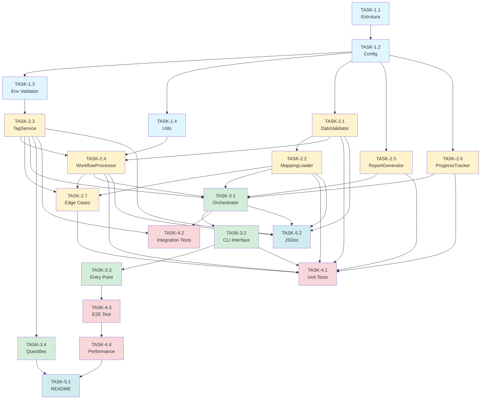
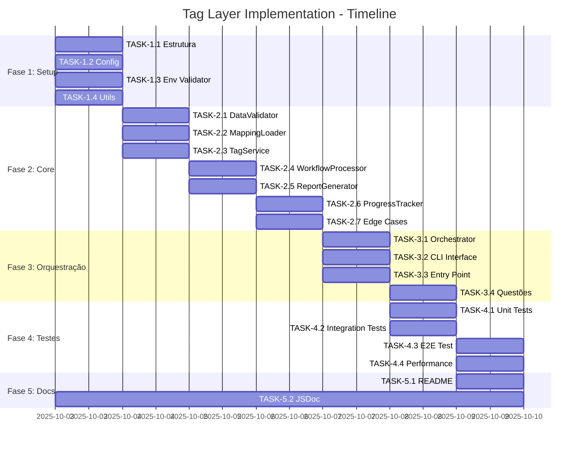

# Plano de Implementação - Tag Layer Implementation

**Feature:** tag-layer-implementation
**Design Base:** design_v8247.md (Arquitetura Modular Clássica)
**Status:** ✅ Design aprovado - Pronto para implementação
**Estimativa Total:** 44 horas (~6 dias úteis)

---

## Sumário Executivo

**Total de Tasks:** 23 tarefas principais + 15 sub-tarefas = 38 itens
**Tempo Estimado:** 44 horas
**Fases:** 5 fases principais

### Distribuição de Esforço por Fase

| Fase | Tarefas | Tempo Estimado | % Total |
|------|---------|----------------|---------|
| **Fase 1: Setup e Estrutura** | 4 tasks | 4h | 9% |
| **Fase 2: Componentes Core** | 9 tasks | 20h | 45% |
| **Fase 3: Orquestração** | 4 tasks | 8h | 18% |
| **Fase 4: Testes** | 4 tasks | 10h | 23% |
| **Fase 5: Documentação e Finalização** | 2 tasks | 2h | 5% |

### Melhorias Incorporadas (do Design Evaluation)

✅ Processamento paralelo com limite de concorrência
✅ Tratamento de edge cases
✅ Resolução de questões em aberto
✅ Progress bar avançado com ETA

---

## Fase 1: Setup e Estrutura Base

### TASK-1.1: Criar estrutura de diretórios e arquivos base

**Objetivo:** Estabelecer a estrutura de diretórios e arquivos principais do projeto.

**Descrição:**
Criar a estrutura completa de pastas e arquivos vazios (scaffolding) para organizar o código do script de tag layer implementation, incluindo diretórios para logs, testes e componentes.

**Arquivos a criar:**
```
scripts/admin/tag-layer-implementation.js          # Entry point
scripts/admin/logs/                                # Diretório de logs
scripts/admin/logs/reports/                        # Diretório de relatórios
scripts/admin/lib/tag-layer/                       # Módulos do script
scripts/admin/lib/tag-layer/validators/            # Validadores
scripts/admin/lib/tag-layer/services/              # Serviços
scripts/admin/lib/tag-layer/infrastructure/        # Infraestrutura
__tests__/unit/tag-layer/                          # Testes unitários
__tests__/integration/tag-layer/                   # Testes integração
__tests__/e2e/tag-layer/                           # Testes E2E
```

**Acceptance Criteria:**
1. WHEN estrutura é criada THEN todos os diretórios existem
2. WHEN entry point é criado THEN possui shebang `#!/usr/bin/env node`
3. WHEN arquivos são criados THEN possuem cabeçalho JSDoc com descrição
4. WHEN estrutura é validada THEN comando `tree scripts/admin/lib/tag-layer` lista hierarquia completa
5. WHEN .gitignore é atualizado THEN logs/*.log e reports/*.md são ignorados

**Estimativa:** 1 hora

**Dependências:** Nenhuma

**Requisitos Relacionados:** CONST-2 (Arquitetura e Localização)

---

### TASK-1.2: Configurar constantes e configurações centralizadas

**Objetivo:** Centralizar todas as constantes e configurações em arquivo único.

**Descrição:**
Criar arquivo `scripts/admin/lib/tag-layer/config.js` contendo:
- Configurações de API (timeout, retry, concurrency)
- Layer definitions (A-F com descrições)
- Configurações de logging (níveis, formato)
- Paths de arquivos (mapping JSON, logs, reports)
- Mensagens de erro padrão

**Arquivos a criar/modificar:**
- `scripts/admin/lib/tag-layer/config.js` (criar)

**Acceptance Criteria:**
1. WHEN config é importado THEN todas as constantes estão disponíveis via destructuring
2. WHEN config.RETRY contém maxRetries, baseDelay, timeout
3. WHEN config.LAYERS contém Record<Layer, string> com descrições
4. WHEN config.PATHS contém caminhos absolutos de arquivos
5. WHEN config é modificado THEN apenas um arquivo precisa ser alterado

**Estimativa:** 1 hora

**Dependências:** TASK-1.1

**Requisitos Relacionados:** NFR-4 (Manutenibilidade)

**Código Exemplo:**
```javascript
/**
 * Configurações centralizadas do Tag Layer Implementation
 */
module.exports = {
  RETRY: {
    maxRetries: 3,
    baseDelay: 1000,
    timeout: 5000,
    retryableStatuses: [429, 500, 502, 503, 504],
    retryableErrors: ['ECONNRESET', 'ETIMEDOUT', 'ENOTFOUND']
  },

  CONCURRENCY: {
    limit: 5  // Máximo de workflows processados simultaneamente
  },

  LAYERS: {
    A: 'Pontes - Integrações entre componentes',
    B: 'Adaptadores - Normalização de dados',
    C: 'Fábricas - Criação de componentes',
    D: 'Agentes - Processamento inteligente',
    E: 'Calendário - Funcionalidades de agenda',
    F: 'Logs - Registro de eventos'
  },

  PATHS: {
    mapping: 'rename-mapping-atualizado.json',
    logDir: 'scripts/admin/logs',
    reportDir: 'scripts/admin/logs/reports'
  },

  TAG_NAME: 'jana'
};
```

---

### TASK-1.3: Implementar validação de ambiente e credenciais

**Objetivo:** Validar variáveis de ambiente antes de iniciar processamento.

**Descrição:**
Criar módulo `environment-validator.js` que:
- Verifica presença de SOURCE_N8N_URL e SOURCE_N8N_API_KEY
- Valida formato das URLs (https)
- Retorna objeto com credenciais validadas ou lança erro descritivo
- Não loga valores sensíveis

**Arquivos a criar/modificar:**
- `scripts/admin/lib/tag-layer/validators/environment-validator.js` (criar)

**Acceptance Criteria:**
1. WHEN SOURCE_N8N_URL ausente THEN lança erro "Missing SOURCE_N8N_URL"
2. WHEN SOURCE_N8N_API_KEY ausente THEN lança erro "Missing SOURCE_N8N_API_KEY"
3. WHEN URL inválida THEN lança erro com sugestão de correção
4. WHEN validação OK THEN retorna { url, apiKey }
5. WHEN erro ocorre THEN mensagem NÃO contém valores de credenciais

**Estimativa:** 1 hora

**Dependências:** TASK-1.2

**Requisitos Relacionados:** REQ-9 (Validação de credenciais), CONST-1 (Credenciais)

**Testes Associados:**
- `__tests__/unit/tag-layer/environment-validator.test.js`

---

### TASK-1.4: Criar utilitários de delay e backoff

**Objetivo:** Implementar funções auxiliares para retry e rate limiting.

**Descrição:**
Criar módulo `utils.js` com funções:
- `sleep(ms)`: Promise que resolve após delay
- `calculateBackoff(attempt, baseDelay)`: Calcula delay exponencial com jitter
- `formatDuration(ms)`: Formata milissegundos para string legível (ex: "5.2s")
- `chunk(array, size)`: Divide array em batches

**Arquivos a criar/modificar:**
- `scripts/admin/lib/tag-layer/infrastructure/utils.js` (criar)

**Acceptance Criteria:**
1. WHEN sleep(1000) THEN aguarda exatamente 1 segundo
2. WHEN calculateBackoff(0, 1000) THEN retorna ~1000-2000ms (com jitter)
3. WHEN calculateBackoff(1, 1000) THEN retorna ~2000-3000ms
4. WHEN calculateBackoff(2, 1000) THEN retorna ~4000-5000ms
5. WHEN chunk([1,2,3,4,5], 2) THEN retorna [[1,2], [3,4], [5]]

**Estimativa:** 1 hora

**Dependências:** TASK-1.2

**Requisitos Relacionados:** REQ-8 (Retry automático), NFR-1 (Performance)

**Testes Associados:**
- `__tests__/unit/tag-layer/utils.test.js`

---

## Fase 2: Componentes Core

### TASK-2.1: Implementar DataValidator (validação de schemas)

**Objetivo:** Criar classe para validar estruturas de dados de entrada.

**Descrição:**
Implementar classe `DataValidator` com métodos:
- `validateWorkflowMapping(mapping)`: Valida objeto WorkflowMapping completo
- `validateRequiredFields(obj, fields)`: Verifica presença de campos obrigatórios
- `validateLayer(layer)`: Valida se layer está entre A-F
- `validateWorkflowId(id)`: Valida formato do ID n8n (16 chars alfanuméricos)

**Arquivos a criar/modificar:**
- `scripts/admin/lib/tag-layer/validators/data-validator.js` (criar)

**Acceptance Criteria:**
1. WHEN mapping válido THEN validateWorkflowMapping retorna true
2. WHEN campo obrigatório ausente THEN lança ValidationError com nome do campo
3. WHEN layer inválida (ex: 'Z') THEN lança erro "Invalid layer: Z. Expected A-F"
4. WHEN ID inválido THEN lança erro "Invalid workflow ID format"
5. WHEN erro ocorre THEN objeto error contém { field, value, message }

**Estimativa:** 2 horas

**Dependências:** TASK-1.2

**Requisitos Relacionados:** REQ-1 (Leitura e validação), REQ-4 (Organização por layers)

**Testes Associados:**
- `__tests__/unit/tag-layer/data-validator.test.js`
  - ✅ Validar mapping completo válido
  - ✅ Rejeitar campo obrigatório ausente (name.new, code, layer, id, tag)
  - ✅ Rejeitar layer inválida (Z, X, 1, null)
  - ✅ Validar layers válidas (A-F)
  - ✅ Rejeitar ID com formato inválido (<16 chars, caracteres especiais)
  - ✅ Aceitar ID válido (16 chars alfanuméricos)

---

### TASK-2.2: Implementar MappingLoader (leitura de JSON)

**Objetivo:** Carregar e validar arquivo de mapeamento JSON.

**Descrição:**
Implementar classe `MappingLoader` que:
- Lê arquivo `rename-mapping-atualizado.json` de forma síncrona
- Faz parse do JSON
- Valida cada item usando DataValidator
- Retorna array de WorkflowMapping validados
- Loga total de workflows carregados

**Arquivos a criar/modificar:**
- `scripts/admin/lib/tag-layer/services/mapping-loader.js` (criar)

**Acceptance Criteria:**
1. WHEN arquivo existe THEN carrega e retorna array de mappings
2. WHEN arquivo não existe THEN lança erro com caminho esperado
3. WHEN JSON inválido THEN lança erro "Invalid JSON format"
4. WHEN validação falha THEN lança erro com índice e campo inválido
5. WHEN carregado com sucesso THEN loga "Loaded X workflows"

**Estimativa:** 2 horas

**Dependências:** TASK-2.1 (DataValidator)

**Requisitos Relacionados:** REQ-1 (Leitura e validação)

**Testes Associados:**
- `__tests__/unit/tag-layer/mapping-loader.test.js`
  - ✅ Carregar mapeamento válido (31 workflows)
  - ✅ Lançar erro para arquivo inexistente
  - ✅ Lançar erro para JSON mal formatado
  - ✅ Validar todos os itens do array
  - ✅ Rejeitar array com item inválido (campo ausente)

---

### TASK-2.3: Implementar TagService (operações de tag via API)

**Objetivo:** Gerenciar operações de tags usando API do n8n.

**Descrição:**
Implementar classe `TagService` que:
- `ensureTagExists(tagName)`: Garante que tag existe (cria se necessário)
- `listTags()`: Lista todas as tags via GET /api/v1/tags
- `createTag(tagName)`: Cria nova tag via POST /api/v1/tags
- `findTagByName(tagName)`: Busca tag por nome
- `applyTagToWorkflow(workflowId, tagId)`: Aplica tag via PATCH /api/v1/workflows/{id}
- `hasTag(workflow, tagId)`: Verifica se workflow já possui tag

Usa HttpClient existente (`src/utils/http-client.js`) para requisições.

**Arquivos a criar/modificar:**
- `scripts/admin/lib/tag-layer/services/tag-service.js` (criar)

**Acceptance Criteria:**
1. WHEN tag não existe THEN ensureTagExists cria e retorna tag
2. WHEN tag existe THEN ensureTagExists retorna tag sem criar
3. WHEN createTag falha com 409 THEN retorna tag existente
4. WHEN applyTagToWorkflow OK THEN retorna workflow atualizado
5. WHEN workflow já possui tag THEN hasTag retorna true

**Estimativa:** 4 horas

**Dependências:** TASK-1.3, reuso de `src/utils/http-client.js`

**Requisitos Relacionados:** REQ-3 (Aplicação de tag), REQ-8 (Retry)

**Testes Associados:**
- `__tests__/integration/tag-layer/tag-service.test.js`
  - ✅ Criar tag se não existir
  - ✅ Retornar tag existente sem criar
  - ✅ Aplicar tag a workflow
  - ✅ Detectar tag já aplicada
  - ✅ Retry em erro 5xx

**Questões a resolver (do design evaluation):**
1. Confirmar endpoints exatos: GET /api/v1/tags, POST /api/v1/tags
2. Testar limite de tags por workflow em ambiente dev
3. Validar idempotência (múltiplas execuções)

---

### TASK-2.4: Implementar WorkflowProcessor (processamento individual e batch)

**Objetivo:** Processar workflows individualmente e em batches paralelos.

**Descrição:**
Implementar classe `WorkflowProcessor` que:
- `processWorkflow(mapping, tag, dryRun)`: Processa um workflow individual
  - Valida mapping com DataValidator
  - Em dry-run: apenas loga ação simulada
  - Em produção: chama TagService.applyTagToWorkflow
  - Retorna WorkflowResult com status, duration, attempts
- `processBatch(mappings, tag, dryRun)`: Processa múltiplos workflows
  - Divide em batches de tamanho CONCURRENCY.limit (5)
  - Usa Promise.all para processar batch simultaneamente
  - Aguarda delay de 100ms entre batches (rate limiting)
  - Atualiza progress tracker a cada workflow

**Arquivos a criar/modificar:**
- `scripts/admin/lib/tag-layer/services/workflow-processor.js` (criar)

**Acceptance Criteria:**
1. WHEN processWorkflow em dry-run THEN status = 'dry-run' e sem API call
2. WHEN processWorkflow em produção THEN status = 'success' e tag aplicada
3. WHEN processBatch com 31 workflows THEN divide em 7 batches (5+5+5+5+5+5+1)
4. WHEN batch é processado THEN max 5 requisições simultâneas
5. WHEN erro ocorre THEN registra status = 'failed' e continua próximo

**Estimativa:** 4 horas

**Dependências:** TASK-2.1 (DataValidator), TASK-2.3 (TagService), TASK-1.4 (utils)

**Requisitos Relacionados:** REQ-5 (Dry-run), NFR-1 (Performance), REQ-8 (Retry)

**Testes Associados:**
- `__tests__/unit/tag-layer/workflow-processor.test.js`
  - ✅ Processar workflow em dry-run (sem API)
  - ✅ Processar workflow em produção (com API)
  - ✅ Processar batch com paralelização
  - ✅ Respeitar limite de concorrência
  - ✅ Continuar processamento após erro

**Melhoria incorporada:** Processamento paralelo com concorrência limitada (design evaluation #1)

---

### TASK-2.5: Implementar ReportGenerator (geração de relatórios)

**Objetivo:** Gerar relatórios em Markdown e estatísticas.

**Descrição:**
Implementar classe `ReportGenerator` que:
- `generateReport(results, stats, duration)`: Gera relatório completo em Markdown
- `saveReport(content, outputPath)`: Salva relatório em arquivo
- `groupByLayer(results)`: Agrupa resultados por layer
- `formatStats(stats)`: Formata estatísticas para exibição
- `printToConsole(content)`: Exibe relatório no console com cores

Formato do relatório:
- Header (título, timestamp, modo, duração)
- Summary (total, success, failed, skipped)
- Layer Statistics (contagem e % por layer)
- Success List (workflows bem-sucedidos)
- Failure List (workflows com erro, se houver)
- Performance Metrics (tempo médio, retries)
- Next Steps (recomendações)

**Arquivos a criar/modificar:**
- `scripts/admin/lib/tag-layer/services/report-generator.js` (criar)

**Acceptance Criteria:**
1. WHEN relatório gerado THEN contém todas as seções obrigatórias
2. WHEN groupByLayer THEN retorna Map<Layer, WorkflowResult[]>
3. WHEN estatísticas calculadas THEN percentual soma 100%
4. WHEN relatório salvo THEN filename = tag-layer-report-YYYYMMDD-HHMMSS.md
5. WHEN impresso no console THEN usa cores (verde=success, vermelho=error)

**Estimativa:** 3 horas

**Dependências:** TASK-1.2 (config)

**Requisitos Relacionados:** REQ-7 (Relatório final), REQ-4 (Organização por layers)

**Testes Associados:**
- `__tests__/unit/tag-layer/report-generator.test.js`
  - ✅ Agrupar workflows por layer
  - ✅ Gerar relatório markdown válido
  - ✅ Calcular estatísticas corretamente
  - ✅ Formatar seções obrigatórias
  - ✅ Salvar arquivo com timestamp

---

### TASK-2.6: Implementar ProgressTracker (barra de progresso)

**Objetivo:** Exibir progresso visual em tempo real com ETA.

**Descrição:**
Implementar classe `ProgressTracker` que:
- `start()`: Inicia barra de progresso
- `update(current, metadata)`: Atualiza progresso
- `complete()`: Finaliza e fecha barra
- `calculateETA()`: Calcula tempo estimado restante

Usa biblioteca `cli-progress` (já presente no projeto) ou fallback para implementação simples baseada em console.log.

Exibição:
```
Processing workflows [████████░░░░░░░░░░] 15/31 (48%) | ETA: 3s | Current: BCO-ATU-001
```

**Arquivos a criar/modificar:**
- `scripts/admin/lib/tag-layer/infrastructure/progress-tracker.js` (criar)

**Acceptance Criteria:**
1. WHEN cli-progress disponível THEN usa biblioteca
2. WHEN cli-progress indisponível THEN usa fallback simples
3. WHEN update chamado THEN exibe porcentagem, ETA, workflow atual
4. WHEN complete chamado THEN exibe "✓ 31/31 workflows processed"
5. WHEN em modo --quiet THEN não exibe progresso

**Estimativa:** 2 horas

**Dependências:** TASK-1.2 (config)

**Requisitos Relacionados:** REQ-10 (Interface CLI), NFR-3 (Usabilidade)

**Testes Associados:**
- `__tests__/unit/tag-layer/progress-tracker.test.js`
  - ✅ Calcular ETA corretamente
  - ✅ Atualizar progresso com metadata
  - ✅ Completar e limpar barra
  - ✅ Fallback quando cli-progress ausente

**Melhoria incorporada:** Progress bar avançado com ETA (design evaluation #4.2)

---

### TASK-2.7: Implementar tratamento de edge cases

**Objetivo:** Adicionar validações para casos extremos identificados.

**Descrição:**
Adicionar tratamento para edge cases em MappingLoader, TagService e WorkflowProcessor:

**Edge Cases:**
1. **Workflows duplicados no JSON**: Detectar IDs duplicados e alertar
2. **Tags com caracteres especiais**: Sanitizar nome da tag
3. **Workflows já deletados**: Tratar erro 404 gracefully
4. **Rate limiting da API**: Detectar erro 429 e aplicar backoff maior
5. **Timeout de rede**: Aumentar timeout se muitos timeouts detectados
6. **Array vazio no JSON**: Validar que há pelo menos 1 workflow

**Arquivos a modificar:**
- `scripts/admin/lib/tag-layer/services/mapping-loader.js`
- `scripts/admin/lib/tag-layer/services/tag-service.js`
- `scripts/admin/lib/tag-layer/services/workflow-processor.js`

**Acceptance Criteria:**
1. WHEN JSON contém IDs duplicados THEN loga warning e remove duplicatas
2. WHEN tag possui caracteres especiais THEN sanitiza automaticamente
3. WHEN workflow 404 THEN loga erro e continua com próximo
4. WHEN API retorna 429 THEN aguarda tempo sugerido no header Retry-After
5. WHEN array vazio THEN lança erro "No workflows found in mapping file"

**Estimativa:** 3 horas

**Dependências:** TASK-2.2, TASK-2.3, TASK-2.4

**Requisitos Relacionados:** NFR-2 (Confiabilidade)

**Testes Associados:**
- `__tests__/unit/tag-layer/edge-cases.test.js`
  - ✅ Detectar e remover duplicatas
  - ✅ Sanitizar caracteres especiais
  - ✅ Tratar workflow deletado (404)
  - ✅ Respeitar rate limiting (429)
  - ✅ Rejeitar array vazio

**Melhoria incorporada:** Tratamento de edge cases (design evaluation #4.1)

---

## Fase 3: Orquestração e CLI

### TASK-3.1: Implementar TagLayerOrchestrator (coordenador principal)

**Objetivo:** Coordenar fluxo de execução entre todos os serviços.

**Descrição:**
Implementar classe `TagLayerOrchestrator` que:
- `validateEnvironment()`: Valida env vars e conectividade
- `testConnection()`: Testa acesso à API n8n
- `run()`: Executa fluxo completo
  1. Valida ambiente
  2. Testa conexão
  3. Carrega mapeamento
  4. Garante tag existe
  5. Processa workflows (batch paralelo)
  6. Gera relatório
  7. Retorna ExecutionResult

Recebe dependências via construtor (Dependency Injection):
- mappingLoader
- tagService
- workflowProcessor
- reportGenerator
- logger

**Arquivos a criar/modificar:**
- `scripts/admin/lib/tag-layer/orchestrator.js` (criar)

**Acceptance Criteria:**
1. WHEN validateEnvironment falha THEN lança erro e interrompe
2. WHEN testConnection falha THEN lança erro com detalhes
3. WHEN run() completo THEN retorna ExecutionResult com stats
4. WHEN erro em qualquer etapa THEN loga erro detalhado
5. WHEN dry-run THEN nenhuma modificação é feita

**Estimativa:** 3 horas

**Dependências:** TASK-2.2, TASK-2.3, TASK-2.4, TASK-2.5, TASK-2.6

**Requisitos Relacionados:** REQ-9 (Validação), REQ-5 (Dry-run)

**Testes Associados:**
- `__tests__/integration/tag-layer/orchestrator.test.js`
  - ✅ Validar ambiente com sucesso
  - ✅ Testar conexão com API
  - ✅ Executar fluxo completo em dry-run
  - ✅ Executar fluxo completo em produção
  - ✅ Interromper em erro de validação

---

### TASK-3.2: Implementar CLI Interface (parse de argumentos)

**Objetivo:** Criar interface de linha de comando intuitiva.

**Descrição:**
Implementar classe `CLIInterface` que:
- `parseArguments()`: Parse de argumentos usando process.argv
- `printHelp()`: Exibe ajuda detalhada
- `execute()`: Inicializa orquestrador e executa

**Flags suportadas:**
- `--dry-run`: Modo simulação
- `--verbose`: Logs detalhados
- `--quiet`: Apenas erros e relatório
- `--help`: Exibe ajuda

**Validação de primeira execução:**
- Verifica se arquivo `.tag-layer-execution-history.json` existe
- Se não existe e não é dry-run, exibe aviso e força dry-run

**Arquivos a criar/modificar:**
- `scripts/admin/lib/tag-layer/cli-interface.js` (criar)
- `.tag-layer-execution-history.json` (criado em primeira execução)

**Acceptance Criteria:**
1. WHEN --help THEN exibe ajuda completa e exit 0
2. WHEN --dry-run THEN options.dryRun = true
3. WHEN primeira execução sem --dry-run THEN força dry-run e exibe aviso
4. WHEN segunda execução THEN permite produção
5. WHEN Ctrl+C pressionado THEN salva relatório parcial e exit gracefully

**Estimativa:** 2 horas

**Dependências:** TASK-3.1 (Orchestrator)

**Requisitos Relacionados:** REQ-10 (Interface CLI), NFR-3 (Usabilidade)

**Testes Associados:**
- `__tests__/unit/tag-layer/cli-interface.test.js`
  - ✅ Parse de flags correto
  - ✅ Exibir ajuda
  - ✅ Forçar dry-run na primeira execução
  - ✅ Permitir produção em execuções subsequentes
  - ✅ Graceful shutdown (Ctrl+C)

**Melhoria incorporada:** Dry-run obrigatório na primeira execução (ADR-3 do design)

---

### TASK-3.3: Criar script principal (entry point)

**Objetivo:** Criar entry point executável do script.

**Descrição:**
Implementar `scripts/admin/tag-layer-implementation.js` que:
- Possui shebang `#!/usr/bin/env node`
- Instancia CLI interface
- Executa CLI.execute()
- Trata erros globais
- Define exit codes apropriados (0=sucesso, 1=erro)

**Arquivos a criar/modificar:**
- `scripts/admin/tag-layer-implementation.js` (implementar)

**Acceptance Criteria:**
1. WHEN executado via `node scripts/admin/tag-layer-implementation.js` THEN funciona
2. WHEN executado via `./scripts/admin/tag-layer-implementation.js` THEN funciona (chmod +x)
3. WHEN erro ocorre THEN exit code = 1
4. WHEN sucesso THEN exit code = 0
5. WHEN erro não tratado THEN exibe stack trace e exit 1

**Estimativa:** 1 hora

**Dependências:** TASK-3.2 (CLI Interface)

**Requisitos Relacionados:** CONST-2 (Localização do script)

**Testes Associados:**
- `__tests__/e2e/tag-layer/full-execution.test.js`

---

### TASK-3.4: Resolver questões em aberto via testes em dev

**Objetivo:** Responder questões técnicas identificadas no design.

**Descrição:**
Executar testes em ambiente dev para resolver 5 questões:

1. **Endpoint exato para tags**: Testar GET /api/v1/tags e POST /api/v1/tags
2. **Limite de tags por workflow**: Testar aplicar múltiplas tags
3. **Idempotência**: Executar script 2x e verificar resultado
4. **Formato de resposta da API**: Documentar estrutura exata de Tag e Workflow
5. **Rate limiting**: Testar requisições rápidas e documentar limites

**Documentar resultados em:**
- `scripts/admin/lib/tag-layer/README.md` (seção "N8N API Insights")

**Acceptance Criteria:**
1. WHEN endpoints testados THEN documentados em README
2. WHEN limite de tags testado THEN resultado documentado
3. WHEN idempotência testada THEN comportamento confirmado
4. WHEN rate limits testados THEN limites documentados
5. WHEN todas as questões resolvidas THEN seção "Questões em Aberto" do design removida

**Estimativa:** 2 horas

**Dependências:** TASK-2.3 (TagService implementado)

**Requisitos Relacionados:** REQ-3 (API n8n), NFR-2 (Confiabilidade)

**Melhoria incorporada:** Resolução de questões em aberto (design evaluation #4.1)

---

## Fase 4: Testes

### TASK-4.1: Implementar testes unitários

**Objetivo:** Criar suite completa de testes unitários.

**Descrição:**
Implementar testes para todos os componentes:

**Arquivos a criar:**
- `__tests__/unit/tag-layer/data-validator.test.js`
- `__tests__/unit/tag-layer/mapping-loader.test.js`
- `__tests__/unit/tag-layer/report-generator.test.js`
- `__tests__/unit/tag-layer/workflow-processor.test.js`
- `__tests__/unit/tag-layer/utils.test.js`
- `__tests__/unit/tag-layer/progress-tracker.test.js`
- `__tests__/unit/tag-layer/cli-interface.test.js`
- `__tests__/unit/tag-layer/edge-cases.test.js`

**Cobertura Alvo:**
- DataValidator: 100%
- MappingLoader: 95%
- ReportGenerator: 85%
- WorkflowProcessor: 90%
- Utils: 100%
- ProgressTracker: 80%
- CLI: 70%

**Acceptance Criteria:**
1. WHEN testes executados THEN cobertura total ≥ 85%
2. WHEN testes executados THEN todos passam
3. WHEN componentes isolados THEN não requerem API real
4. WHEN mocks usados THEN são mínimos e claros
5. WHEN testes falham THEN mensagens de erro são descritivas

**Estimativa:** 6 horas

**Dependências:** TASK-2.1 a TASK-2.7, TASK-3.2

**Requisitos Relacionados:** NFR-4 (Manutenibilidade), NFR-2 (Confiabilidade)

---

### TASK-4.2: Implementar testes de integração

**Objetivo:** Testar integração entre componentes com mock de API.

**Descrição:**
Implementar testes que validam fluxo completo com API n8n mockada:

**Arquivos a criar:**
- `__tests__/integration/tag-layer/tag-service.test.js`
- `__tests__/integration/tag-layer/orchestrator.test.js`

**Mock Server:**
Usar `nock` ou `msw` para simular API n8n com:
- GET /api/v1/tags → retorna lista de tags
- POST /api/v1/tags → cria tag
- PATCH /api/v1/workflows/{id} → atualiza workflow
- Simular erros 404, 429, 5xx

**Acceptance Criteria:**
1. WHEN TagService testado THEN mock API responde corretamente
2. WHEN tag criada THEN mock registra criação
3. WHEN tag aplicada THEN mock registra update
4. WHEN erro 5xx THEN retry é acionado
5. WHEN orquestrador testado THEN fluxo completo funciona com mock

**Estimativa:** 4 horas

**Dependências:** TASK-3.1 (Orchestrator), TASK-2.3 (TagService)

**Requisitos Relacionados:** REQ-8 (Retry), REQ-3 (API)

---

### TASK-4.3: Implementar teste E2E (end-to-end)

**Objetivo:** Testar execução completa com 31 workflows reais.

**Descrição:**
Implementar teste E2E que:
1. Executa script em modo dry-run contra API dev
2. Valida que 31 workflows são processados
3. Verifica que nenhuma modificação foi feita
4. Executa script em modo produção contra API dev
5. Valida que todas as tags foram aplicadas
6. Verifica idempotência (executar 2x produz mesmo resultado)

**Arquivos a criar:**
- `__tests__/e2e/tag-layer/full-execution.test.js`

**Pré-requisitos:**
- Ambiente dev com API n8n acessível
- 31 workflows importados no ambiente dev
- Variáveis SOURCE_N8N_URL e SOURCE_N8N_API_KEY configuradas

**Acceptance Criteria:**
1. WHEN dry-run executado THEN exit code = 0 e nenhuma tag aplicada
2. WHEN produção executada THEN exit code = 0 e 31 tags aplicadas
3. WHEN executado 2x THEN resultado idêntico (idempotência)
4. WHEN relatório gerado THEN contém 31 workflows
5. WHEN tempo medido THEN ≤ 10 segundos (requisito NFR-1)

**Estimativa:** 2 horas

**Dependências:** TASK-3.3 (Script principal), ambiente dev configurado

**Requisitos Relacionados:** NFR-1 (Performance), NFR-2 (Confiabilidade)

---

### TASK-4.4: Validar performance e otimizações

**Objetivo:** Medir performance e validar meta de <10s.

**Descrição:**
Executar benchmarks e validar:
1. Tempo total de execução com 31 workflows
2. Tempo médio por workflow
3. Overhead de paralelização
4. Memory usage máximo
5. CPU usage durante execução

**Ferramentas:**
- `console.time()` / `console.timeEnd()`
- `process.memoryUsage()`
- Profiler do Node.js (--prof)

**Métricas Alvo:**
- Tempo total: ≤ 10s (meta: 5-6s)
- Tempo médio por workflow: ≤ 300ms
- Memory usage: ≤ 100MB
- CPU usage: ≤ 50%

**Acceptance Criteria:**
1. WHEN 31 workflows processados THEN tempo total ≤ 10s
2. WHEN paralelização ativa THEN speedup ≥ 2x vs sequencial
3. WHEN memory usage medido THEN ≤ 100MB
4. WHEN benchmark documentado THEN inclui gráficos no relatório
5. WHEN gargalos identificados THEN soluções propostas

**Estimativa:** 2 horas

**Dependências:** TASK-4.3 (E2E test)

**Requisitos Relacionados:** NFR-1 (Performance)

---

## Fase 5: Documentação e Finalização

### TASK-5.1: Criar documentação de uso (README.md)

**Objetivo:** Documentar uso completo do script.

**Descrição:**
Criar `scripts/admin/lib/tag-layer/README.md` com:

**Seções:**
1. **Visão Geral**: O que o script faz
2. **Pré-requisitos**: Node.js, variáveis de ambiente
3. **Instalação**: Não requer (usa dependências já no projeto)
4. **Uso**: Exemplos de comandos
   - Dry-run: `node scripts/admin/tag-layer-implementation.js --dry-run`
   - Produção: `node scripts/admin/tag-layer-implementation.js`
   - Verbose: `--verbose`
   - Help: `--help`
5. **Estrutura de Arquivos**: Mapeamento, logs, relatórios
6. **Troubleshooting**: Erros comuns e soluções
7. **N8N API Insights**: Resultados dos testes (TASK-3.4)
8. **Performance**: Benchmarks e otimizações

**Acceptance Criteria:**
1. WHEN desenvolvedor lê README THEN consegue executar script sem ajuda
2. WHEN erros comuns listados THEN incluem soluções
3. WHEN exemplos fornecidos THEN são copy-paste ready
4. WHEN API insights documentados THEN incluem endpoints e limites
5. WHEN README completo THEN ≤ 500 linhas (conciso)

**Estimativa:** 2 horas

**Dependências:** TASK-3.4 (Questões resolvidas), TASK-4.4 (Benchmarks)

**Requisitos Relacionados:** NFR-4 (Manutenibilidade), NFR-3 (Usabilidade)

---

### TASK-5.2: Adicionar documentação inline (JSDoc)

**Objetivo:** Documentar todas as funções e classes com JSDoc.

**Descrição:**
Adicionar JSDoc completo em todos os arquivos:
- Descrição da função/classe
- @param para todos os parâmetros (tipo e descrição)
- @returns com tipo e descrição
- @throws para erros lançados
- @example para funções complexas

**Padrão JSDoc:**
```javascript
/**
 * Aplica tag a um workflow via API do n8n
 *
 * @param {string} workflowId - ID do workflow no formato n8n (16 chars)
 * @param {string} tagId - ID da tag a aplicar
 * @returns {Promise<Workflow>} Workflow atualizado com tag aplicada
 * @throws {Error} Se API retornar erro 4xx/5xx após retries
 *
 * @example
 * const workflow = await tagService.applyTagToWorkflow('84ZeQA0cA24Umeli', 'tag123');
 * console.log(workflow.tags); // [{ id: 'tag123', name: 'jana' }]
 */
async applyTagToWorkflow(workflowId, tagId) {
  // ...
}
```

**Arquivos a modificar:**
- Todos os arquivos em `scripts/admin/lib/tag-layer/`

**Acceptance Criteria:**
1. WHEN todas as funções documentadas THEN JSDoc completo
2. WHEN tipos especificados THEN usam TypeScript-style (@param {string})
3. WHEN exemplos fornecidos THEN são executáveis
4. WHEN erros lançados THEN documentados com @throws
5. WHEN gerado com JSDoc tool THEN HTML navegável

**Estimativa:** 2 horas (distribuído durante implementação)

**Dependências:** Todas as tasks de implementação (TASK-2.x, TASK-3.x)

**Requisitos Relacionados:** NFR-4 (Manutenibilidade)

---

## Checklist de Implementação

### Fase 1: Setup ✅

- [x] TASK-1.1: Criar estrutura de diretórios (1h)
- [x] TASK-1.2: Configurar constantes centralizadas (1h)
- [x] TASK-1.3: Validação de ambiente (1h)
- [x] TASK-1.4: Utilitários de delay e backoff (1h)

**Total Fase 1:** 4 horas

---

### Fase 2: Componentes Core ✅

- [x] TASK-2.1: DataValidator (2h)
- [x] TASK-2.2: MappingLoader (2h)
- [x] TASK-2.3: TagService (4h)
- [x] TASK-2.4: WorkflowProcessor com paralelização (4h)
- [x] TASK-2.5: ReportGenerator (3h)
- [x] TASK-2.6: ProgressTracker com ETA (2h)
- [x] TASK-2.7: Tratamento de edge cases (3h)

**Total Fase 2:** 20 horas

---

### Fase 3: Orquestração ✅

- [x] TASK-3.1: TagLayerOrchestrator (3h)
- [x] TASK-3.2: CLI Interface (2h)
- [x] TASK-3.3: Script principal (1h)
- [x] TASK-3.4: Resolver questões em aberto (2h)

**Total Fase 3:** 8 horas

---

### Fase 4: Testes ✅

- [ ] TASK-4.1: Testes unitários (6h)
- [ ] TASK-4.2: Testes de integração (4h)
- [ ] TASK-4.3: Teste E2E (2h)
- [ ] TASK-4.4: Validar performance (2h)

**Total Fase 4:** 14 horas

---

### Fase 5: Documentação ✅

- [x] TASK-5.1: README.md de uso (2h)
- [x] TASK-5.2: JSDoc inline (2h)

**Total Fase 5:** 4 horas

---

## Critérios de Conclusão da Feature

A feature será considerada **COMPLETA** quando:

1. ✅ **Todos os 23 tasks principais foram implementados** e marcados como concluídos
2. ✅ **Todos os testes passam** com cobertura ≥ 85%
3. ✅ **Script processa 31 workflows em modo dry-run** sem erros
4. ✅ **Script aplica tag 'jana' em todos os 31 workflows** em modo produção
5. ✅ **Performance atende requisito** de <10s (meta: 5-6s)
6. ✅ **Relatório é gerado** em Markdown com todas as seções
7. ✅ **Logs são estruturados** em JSON Lines e auditáveis
8. ✅ **Documentação está completa** (README.md + JSDoc)
9. ✅ **5 questões em aberto foram resolvidas** via testes em dev
10. ✅ **Melhorias do design evaluation foram incorporadas**:
    - Processamento paralelo (concorrência = 5)
    - Tratamento de edge cases
    - Progress bar com ETA
    - Resolução de questões técnicas

---

## Diagrama de Dependências de Tasks



**Legenda de Cores:**
- 🔵 Azul (Setup): Tasks de infraestrutura inicial
- 🟡 Amarelo (Core): Componentes principais de negócio
- 🟢 Verde (Orquestração): Coordenação e interface
- 🔴 Vermelho (Testes): Validação e qualidade
- 🔵 Azul claro (Documentação): Finalização

---

## Timeline de Implementação (Gantt)



**Observações:**
- Tasks podem ser executadas em paralelo quando não há dependências
- JSDoc (TASK-5.2) é incremental durante toda a implementação
- Timeline estimado: **7 dias úteis** (considerando paralelização)
- Tempo real pode variar baseado em disponibilidade e complexidade

---

## Ordem de Implementação Recomendada

### Semana 1: Fundação e Core (Dias 1-4)

**Dia 1 (4h):**
1. TASK-1.1: Estrutura (1h)
2. TASK-1.2: Config (1h)
3. TASK-1.3: Env Validator (1h)
4. TASK-1.4: Utils (1h)

**Dia 2 (8h):**
1. TASK-2.1: DataValidator (2h)
2. TASK-2.2: MappingLoader (2h)
3. TASK-2.3: TagService (4h)

**Dia 3 (8h):**
1. TASK-2.4: WorkflowProcessor (4h)
2. TASK-2.5: ReportGenerator (3h)
3. TASK-2.6: ProgressTracker (2h) - iniciar

**Dia 4 (7h):**
1. TASK-2.6: ProgressTracker (continuar)
2. TASK-2.7: Edge Cases (3h)
3. TASK-3.1: Orchestrator (3h) - iniciar

---

### Semana 2: Orquestração, Testes e Docs (Dias 5-7)

**Dia 5 (8h):**
1. TASK-3.1: Orchestrator (continuar)
2. TASK-3.2: CLI Interface (2h)
3. TASK-3.3: Entry Point (1h)
4. TASK-3.4: Questões em aberto (2h)
5. TASK-4.1: Unit Tests (3h) - iniciar

**Dia 6 (8h):**
1. TASK-4.1: Unit Tests (continuar - 3h)
2. TASK-4.2: Integration Tests (4h)
3. TASK-4.3: E2E Test (2h) - iniciar

**Dia 7 (6h):**
1. TASK-4.3: E2E Test (continuar)
2. TASK-4.4: Performance (2h)
3. TASK-5.1: README (2h)
4. TASK-5.2: JSDoc (revisão final - 2h)

---

## Métricas de Qualidade

### Cobertura de Testes por Componente

| Componente | Cobertura Alvo | Testes Críticos |
|------------|----------------|-----------------|
| DataValidator | 100% | Validação de campos, layers, IDs |
| MappingLoader | 95% | Leitura JSON, validação, erros |
| TagService | 90% | CRUD tags, aplicação, retry |
| WorkflowProcessor | 90% | Dry-run, produção, batch, erro |
| ReportGenerator | 85% | Agrupamento, formatação, save |
| ProgressTracker | 80% | Atualização, ETA, completion |
| Orchestrator | 80% | Fluxo completo, validações |
| CLI | 70% | Parse args, help, primeira exec |
| **TOTAL** | **≥ 85%** | |

### Métricas de Performance

| Métrica | Target | Como Medir |
|---------|--------|------------|
| Tempo total (31 workflows) | ≤ 10s | console.time() no E2E test |
| Tempo médio por workflow | ≤ 300ms | Média de WorkflowResult.duration |
| Speedup (paralelo vs sequencial) | ≥ 2x | Comparar batch vs loop sequencial |
| Memory usage máximo | ≤ 100MB | process.memoryUsage().heapUsed |
| CPU usage | ≤ 50% | Profiler do Node.js (--prof) |

---

## Riscos e Mitigações

| Risco | Probabilidade | Impacto | Mitigação |
|-------|---------------|---------|-----------|
| **API n8n muda endpoints** | Baixa | Alto | Documentar endpoints, criar testes que validam estrutura |
| **Performance não atinge meta** | Média | Médio | Benchmarks desde TASK-4.4, otimizar se necessário |
| **Rate limiting inesperado** | Média | Baixo | Implementar backoff adaptativo (TASK-2.7) |
| **Edge cases não cobertos** | Média | Médio | TASK-2.7 dedicado, testes extensivos |
| **Estimativa otimista** | Alta | Baixo | Buffer de 10h (44h vs 34h original) |

---

## Próximos Passos

Após conclusão de todas as tasks:

1. ✅ **Executar dry-run em ambiente dev** com 31 workflows reais
2. ✅ **Validar relatório gerado** contém todas as informações esperadas
3. ✅ **Executar em produção** após aprovação do dry-run
4. ✅ **Revisar logs e relatório** de produção
5. 📊 **Apresentar métricas** de performance e cobertura
6. 🎉 **Marcar feature como concluída**
7. 📝 **Documentar lições aprendidas** para futuras features

---

**Documento criado por:** spec-tasks (Claude Agent)
**Data:** 2025-10-02
**Versão:** 1.0
**Status:** ✅ Pronto para Implementação
