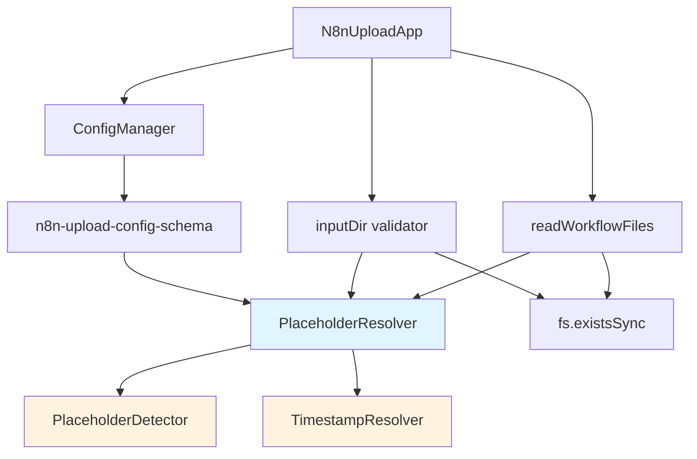
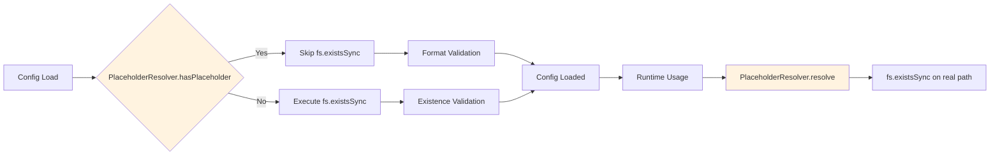
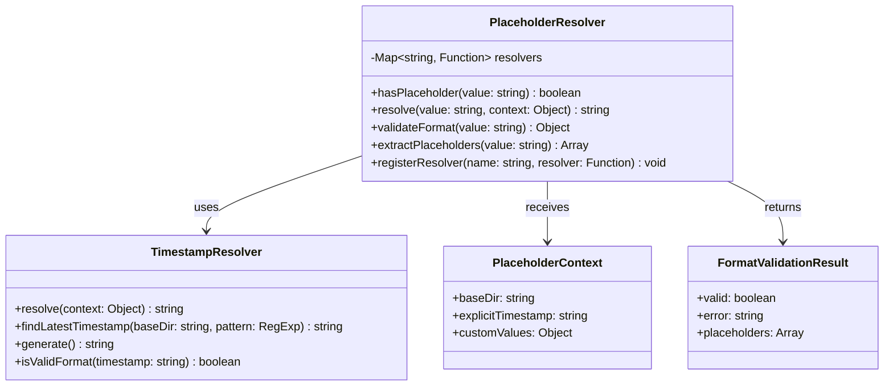
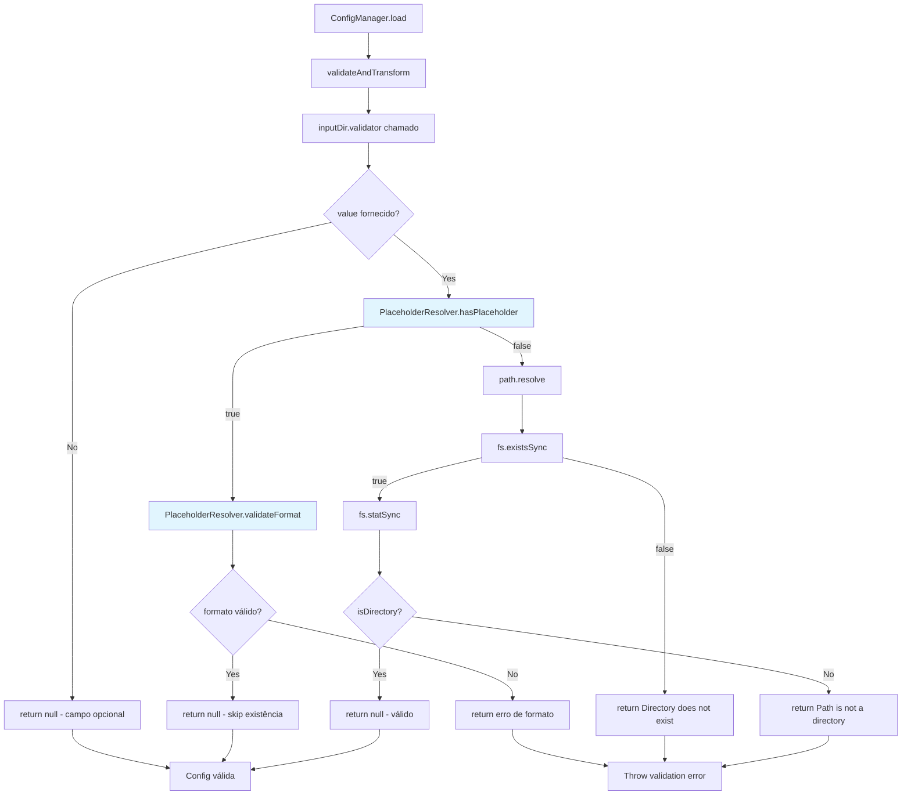
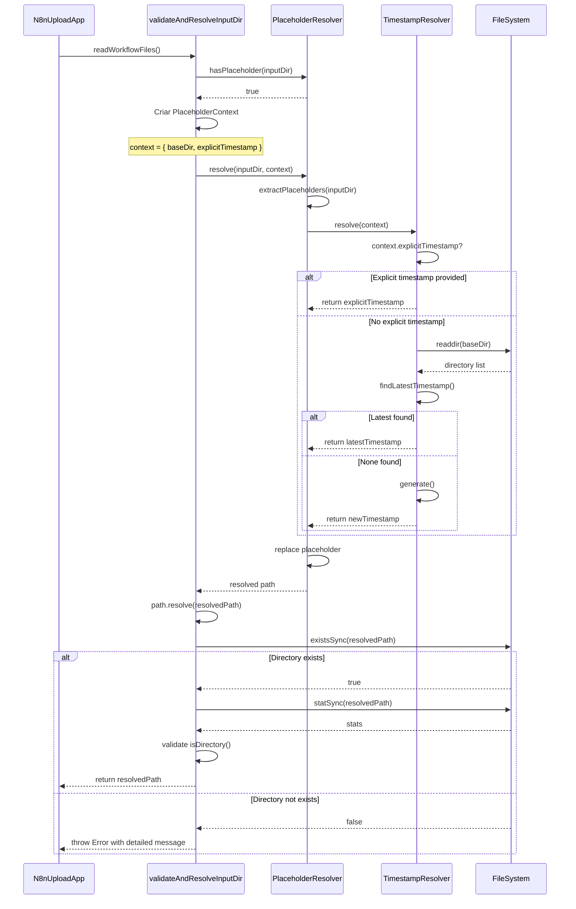
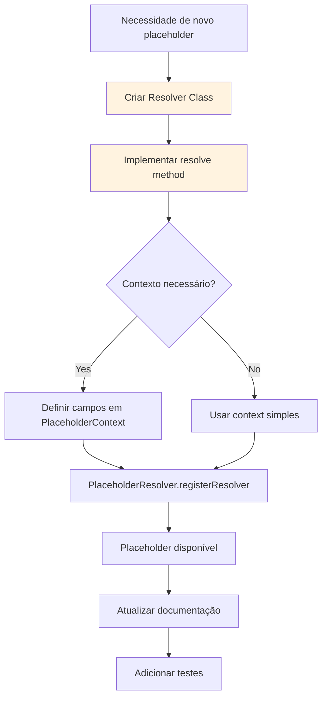
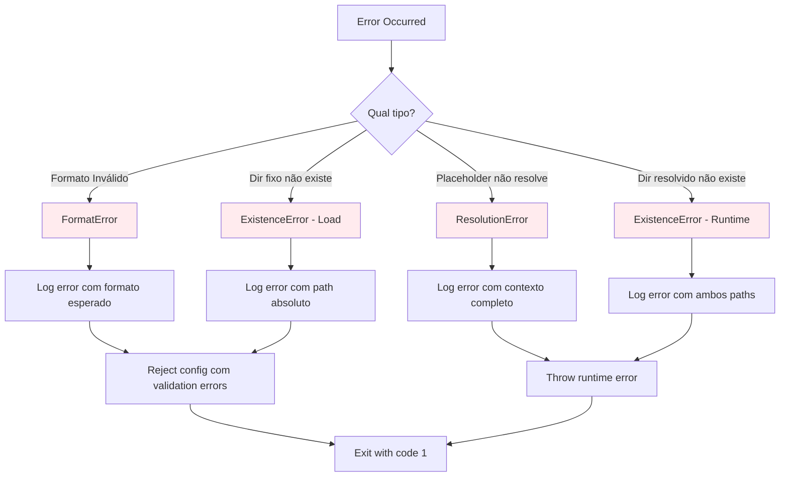

# Design Document - Correção de Validação de Placeholder `{timestamp}`

## Overview

Este documento descreve o design técnico para corrigir o bug de validação do placeholder `{timestamp}` no comando `n8n:upload`. Atualmente, o validator no schema de configuração valida o path literal com `fs.existsSync()` antes da substituição do placeholder, causando erro "Directory does not exist".

A solução implementa um sistema de detecção e resolução de placeholders que:
- Detecta placeholders em paths de configuração
- Pula validação de existência durante o carregamento de configuração
- Valida o diretório real apenas no momento de uso
- Mantém compatibilidade total com paths fixos existentes

### Design Goals

1. **Extensibilidade**: Arquitetura que permite adicionar novos placeholders facilmente
2. **Validação Adaptativa**: Validar formato no load, existência no runtime
3. **Compatibilidade**: Zero impacto em configurações sem placeholders
4. **Clareza**: Mensagens de erro específicas para cada cenário
5. **Testabilidade**: Componentes isolados e testáveis unitariamente

## Architecture Design

### System Architecture Diagram



### Data Flow Diagram



## Component Design

### Component 1: PlaceholderResolver

**Responsabilidades:**
- Detectar placeholders em strings de configuração
- Resolver placeholders para valores reais
- Validar formato de placeholders
- Gerenciar registro de placeholders suportados

**Interfaces:**

```javascript
class PlaceholderResolver {
  /**
   * Verifica se uma string contém placeholders
   * @param {string} value - String para verificar
   * @returns {boolean} true se contém placeholders
   */
  static hasPlaceholder(value)

  /**
   * Resolve placeholders em uma string
   * @param {string} value - String com placeholders
   * @param {Object} context - Contexto com valores disponíveis
   * @returns {string} String com placeholders substituídos
   * @throws {Error} Se placeholder não puder ser resolvido
   */
  static resolve(value, context = {})

  /**
   * Valida formato de placeholders
   * @param {string} value - String para validar
   * @returns {Object} { valid: boolean, error: string|null }
   */
  static validateFormat(value)

  /**
   * Extrai placeholders de uma string
   * @param {string} value - String para analisar
   * @returns {Array<string>} Lista de placeholders encontrados
   */
  static extractPlaceholders(value)

  /**
   * Registra um novo resolver de placeholder
   * @param {string} name - Nome do placeholder
   * @param {Function} resolver - Função que resolve o placeholder
   */
  static registerResolver(name, resolver)
}
```

**Dependências:**
- Nenhuma (classe utilitária pura)

**Estrutura de Dados Interna:**

```javascript
// Map de resolvers registrados
const resolvers = new Map([
  ['timestamp', TimestampResolver.resolve]
]);

// Regex para detecção de placeholders
const PLACEHOLDER_PATTERN = /\{([a-zA-Z_][a-zA-Z0-9_]*)\}/g;
```

### Component 2: TimestampResolver

**Responsabilidades:**
- Resolver o placeholder `{timestamp}` para valor real
- Gerenciar lógica de timestamp (usar último download ou gerar novo)
- Prover método para obter timestamp mais recente de diretórios

**Interfaces:**

```javascript
class TimestampResolver {
  /**
   * Resolve placeholder {timestamp} para valor real
   * @param {Object} context - Contexto com informações disponíveis
   * @param {string} context.baseDir - Diretório base para buscar timestamps
   * @param {string} context.explicitTimestamp - Timestamp explícito fornecido
   * @returns {string} Timestamp no formato YYYYMMDD-HHMMSS
   */
  static resolve(context = {})

  /**
   * Busca o timestamp mais recente em diretórios
   * @param {string} baseDir - Diretório base para buscar
   * @param {RegExp} pattern - Pattern para identificar diretórios com timestamp
   * @returns {string|null} Timestamp encontrado ou null
   */
  static findLatestTimestamp(baseDir, pattern)

  /**
   * Gera um novo timestamp
   * @returns {string} Timestamp no formato YYYYMMDD-HHMMSS
   */
  static generate()

  /**
   * Valida formato de timestamp
   * @param {string} timestamp - Timestamp para validar
   * @returns {boolean} true se válido
   */
  static isValidFormat(timestamp)
}
```

**Dependências:**
- `fs` (para listar diretórios)
- `path` (para manipulação de paths)

### Component 3: Validator Adaptativo (modificação em n8n-upload-config-schema.js)

**Responsabilidades:**
- Validar paths com ou sem placeholders
- Delegar para PlaceholderResolver quando necessário
- Manter validação completa para paths fixos

**Interfaces:**

```javascript
// Modificação no validator existente
inputDir: {
  type: 'string',
  required: false,
  env: 'N8N_INPUT_DIR',
  flag: '--input',
  positional: 2,
  description: 'Diretório contendo os arquivos JSON dos workflows',
  validator: (value) => {
    if (!value) {
      return null; // Allow empty if not provided
    }

    // Check if value contains placeholders
    if (PlaceholderResolver.hasPlaceholder(value)) {
      // Validate placeholder format only
      const formatValidation = PlaceholderResolver.validateFormat(value);
      if (!formatValidation.valid) {
        return formatValidation.error;
      }

      // Skip directory existence check - will be validated at runtime
      return null;
    }

    // Standard validation for non-placeholder paths
    const resolvedPath = path.isAbsolute(value) ? value : path.resolve(process.cwd(), value);

    if (!fs.existsSync(resolvedPath)) {
      return `Directory does not exist: ${resolvedPath}`;
    }

    const stats = fs.statSync(resolvedPath);
    if (!stats.isDirectory()) {
      return `Path is not a directory: ${resolvedPath}`;
    }

    return null;
  },
}
```

### Component 4: Runtime Validator (modificação em N8nUploadApp)

**Responsabilidades:**
- Validar existência de diretório no momento de uso
- Resolver placeholders antes da validação
- Prover mensagens de erro claras com path resolvido

**Interfaces:**

```javascript
class N8nUploadApp {
  /**
   * Valida e resolve inputDir no momento de uso
   * @returns {string} Path resolvido e validado
   * @throws {Error} Se diretório não existir
   */
  validateAndResolveInputDir() {
    let inputDir = this.config.inputDir;

    // Resolve placeholders if present
    if (PlaceholderResolver.hasPlaceholder(inputDir)) {
      const context = {
        baseDir: process.cwd(),
        explicitTimestamp: this.config.explicitTimestamp
      };

      inputDir = PlaceholderResolver.resolve(inputDir, context);
      this.logger.info(`📁 Placeholder resolvido: ${this.config.inputDir} → ${inputDir}`);
    }

    // Resolve relative paths
    const resolvedPath = path.isAbsolute(inputDir)
      ? inputDir
      : path.resolve(process.cwd(), inputDir);

    // Validate directory exists
    if (!fs.existsSync(resolvedPath)) {
      throw new Error(
        `Directory does not exist: ${resolvedPath}\n` +
        `   Original config: ${this.config.inputDir}\n` +
        `   💡 Tip: Ensure the directory was created by 'n8n:download' command`
      );
    }

    // Validate it's a directory
    const stats = fs.statSync(resolvedPath);
    if (!stats.isDirectory()) {
      throw new Error(`Path is not a directory: ${resolvedPath}`);
    }

    return resolvedPath;
  }

  /**
   * Modificação em readWorkflowFiles() para usar validação runtime
   */
  readWorkflowFiles() {
    // Valida e resolve inputDir no momento de uso
    const inputDir = this.validateAndResolveInputDir();

    // Apply folder filter if specified
    const finalDir = this.folderFilter
      ? path.join(inputDir, this.folderFilter)
      : inputDir;

    this.logger.info(`📂 Reading workflows from ${finalDir}`);

    // ... resto do código existente
  }
}
```

## Data Model

### Core Data Structure Definitions

```typescript
/**
 * Contexto para resolução de placeholders
 */
interface PlaceholderContext {
  /** Diretório base para buscar timestamps */
  baseDir?: string;

  /** Timestamp explícito fornecido pelo usuário */
  explicitTimestamp?: string;

  /** Valores customizados para placeholders */
  customValues?: Record<string, string>;
}

/**
 * Resultado de validação de formato
 */
interface FormatValidationResult {
  /** Indica se o formato é válido */
  valid: boolean;

  /** Mensagem de erro se inválido */
  error: string | null;

  /** Placeholders encontrados */
  placeholders?: string[];
}

/**
 * Configuração de resolver de placeholder
 */
interface PlaceholderResolverConfig {
  /** Nome do placeholder */
  name: string;

  /** Função que resolve o placeholder */
  resolver: (context: PlaceholderContext) => string;

  /** Descrição do placeholder (para documentação) */
  description?: string;

  /** Pattern para validar o valor resolvido */
  validationPattern?: RegExp;
}

/**
 * Resultado de busca de timestamp
 */
interface TimestampSearchResult {
  /** Timestamp encontrado */
  timestamp: string | null;

  /** Path do diretório de onde foi extraído */
  sourcePath?: string;

  /** Método usado para obter o timestamp */
  method: 'found' | 'generated' | 'explicit';
}
```

### Data Model Diagrams



## Business Process

### Process 1: Carregamento de Configuração (Config Load)

Fluxo de validação de `inputDir` durante o carregamento de configuração:



### Process 2: Resolução de Placeholder em Runtime

Fluxo de resolução de placeholder quando o diretório é realmente usado:



### Process 3: Registro e Extensão de Placeholders

Fluxo para adicionar novos placeholders no futuro:



## Error Handling Strategy

### Error Categories

#### 1. Erros de Formato de Placeholder (Config Load Time)

**Cenário:** Placeholder mal formatado na configuração

**Detecção:** Durante `PlaceholderResolver.validateFormat()`

**Mensagem de Erro:**
```
Invalid placeholder format in inputDir: "./workflows-{timestamp"
Expected format: {placeholder_name}
Supported placeholders: {timestamp}
```

**Ação:** Rejeitar configuração imediatamente

#### 2. Erros de Diretório Fixo Inexistente (Config Load Time)

**Cenário:** Path fixo (sem placeholder) que não existe

**Detecção:** Durante validator no schema

**Mensagem de Erro:**
```
Directory does not exist: /absolute/path/to/dir
```

**Ação:** Rejeitar configuração imediatamente (comportamento existente)

#### 3. Erros de Resolução de Placeholder (Runtime)

**Cenário:** Placeholder válido mas não pode ser resolvido

**Detecção:** Durante `PlaceholderResolver.resolve()`

**Mensagem de Erro:**
```
Failed to resolve placeholder {timestamp} in inputDir
Context: baseDir=/project/root, explicitTimestamp=undefined
Reason: No timestamp directories found in base directory
💡 Tip: Run 'n8n:download' first to create a timestamped directory
```

**Ação:** Throw error com contexto completo

#### 4. Erros de Diretório Resolvido Inexistente (Runtime)

**Cenário:** Placeholder resolvido mas diretório não existe

**Detecção:** Durante `validateAndResolveInputDir()`

**Mensagem de Erro:**
```
Directory does not exist: ./n8n-workflows-20251016-171935
   Original config: ./n8n-workflows-{timestamp}
   Resolved timestamp: 20251016-171935
   💡 Tip: Ensure the directory was created by 'n8n:download' command
```

**Ação:** Throw error com informação do path original e resolvido

### Error Handling Flow



### Error Recovery Strategy

1. **Validação Antecipada**: Detectar erros de formato o mais cedo possível (config load)
2. **Mensagens Contextuais**: Incluir todas as informações relevantes para debug
3. **Sugestões Acionáveis**: Sempre incluir dica de como resolver o problema
4. **Fail-Fast**: Não tentar continuar execução com configuração inválida
5. **Logging Detalhado**: Debug logs com contexto completo de resolução

## Testing Strategy

### Unit Tests

#### PlaceholderResolver Tests

```javascript
describe('PlaceholderResolver', () => {
  describe('hasPlaceholder', () => {
    test('detecta placeholder válido', () => {
      expect(PlaceholderResolver.hasPlaceholder('./dir-{timestamp}')).toBe(true);
    });

    test('retorna false para path sem placeholder', () => {
      expect(PlaceholderResolver.hasPlaceholder('./fixed-dir')).toBe(false);
    });

    test('detecta múltiplos placeholders', () => {
      expect(PlaceholderResolver.hasPlaceholder('./{env}-{timestamp}')).toBe(true);
    });
  });

  describe('validateFormat', () => {
    test('valida formato correto', () => {
      const result = PlaceholderResolver.validateFormat('./dir-{timestamp}');
      expect(result.valid).toBe(true);
      expect(result.error).toBeNull();
    });

    test('detecta placeholder mal fechado', () => {
      const result = PlaceholderResolver.validateFormat('./dir-{timestamp');
      expect(result.valid).toBe(false);
      expect(result.error).toContain('Invalid placeholder format');
    });

    test('detecta nome inválido de placeholder', () => {
      const result = PlaceholderResolver.validateFormat('./dir-{123invalid}');
      expect(result.valid).toBe(false);
    });
  });

  describe('extractPlaceholders', () => {
    test('extrai placeholder único', () => {
      const placeholders = PlaceholderResolver.extractPlaceholders('./dir-{timestamp}');
      expect(placeholders).toEqual(['timestamp']);
    });

    test('extrai múltiplos placeholders', () => {
      const placeholders = PlaceholderResolver.extractPlaceholders('./{env}-{timestamp}');
      expect(placeholders).toEqual(['env', 'timestamp']);
    });
  });

  describe('resolve', () => {
    test('resolve placeholder timestamp', () => {
      const context = { explicitTimestamp: '20251016-171935' };
      const resolved = PlaceholderResolver.resolve('./dir-{timestamp}', context);
      expect(resolved).toBe('./dir-20251016-171935');
    });

    test('lança erro para placeholder não registrado', () => {
      expect(() => {
        PlaceholderResolver.resolve('./dir-{unknown}', {});
      }).toThrow('Unknown placeholder: {unknown}');
    });
  });
});
```

#### TimestampResolver Tests

```javascript
describe('TimestampResolver', () => {
  describe('resolve', () => {
    test('usa timestamp explícito quando fornecido', () => {
      const context = { explicitTimestamp: '20251016-171935' };
      const result = TimestampResolver.resolve(context);
      expect(result).toBe('20251016-171935');
    });

    test('busca timestamp mais recente quando não explícito', () => {
      const context = { baseDir: './test-fixtures' };
      // Mock fs.readdirSync to return test directories
      const result = TimestampResolver.resolve(context);
      expect(result).toMatch(/^\d{8}-\d{6}$/);
    });

    test('gera novo timestamp quando nenhum encontrado', () => {
      const context = { baseDir: './empty-dir' };
      const result = TimestampResolver.resolve(context);
      expect(result).toMatch(/^\d{8}-\d{6}$/);
    });
  });

  describe('findLatestTimestamp', () => {
    test('encontra timestamp mais recente', () => {
      // Test with mocked filesystem
      const timestamp = TimestampResolver.findLatestTimestamp(
        './test-fixtures',
        /n8n-workflows-(\d{8}-\d{6})/
      );
      expect(timestamp).toBeTruthy();
    });

    test('retorna null quando nenhum timestamp encontrado', () => {
      const timestamp = TimestampResolver.findLatestTimestamp(
        './no-timestamps',
        /n8n-workflows-(\d{8}-\d{6})/
      );
      expect(timestamp).toBeNull();
    });
  });

  describe('generate', () => {
    test('gera timestamp no formato correto', () => {
      const timestamp = TimestampResolver.generate();
      expect(timestamp).toMatch(/^\d{8}-\d{6}$/);
    });

    test('gera timestamps únicos', () => {
      const t1 = TimestampResolver.generate();
      const t2 = TimestampResolver.generate();
      // May be equal if called in same second, but should be valid
      expect(t1).toMatch(/^\d{8}-\d{6}$/);
      expect(t2).toMatch(/^\d{8}-\d{6}$/);
    });
  });

  describe('isValidFormat', () => {
    test('valida formato correto', () => {
      expect(TimestampResolver.isValidFormat('20251016-171935')).toBe(true);
    });

    test('rejeita formato inválido', () => {
      expect(TimestampResolver.isValidFormat('2025-10-16')).toBe(false);
      expect(TimestampResolver.isValidFormat('invalid')).toBe(false);
    });
  });
});
```

### Integration Tests

#### Validator Integration Tests

```javascript
describe('inputDir validator (integration)', () => {
  test('aceita path com placeholder válido', () => {
    const validator = schema.inputDir.validator;
    const error = validator('./workflows-{timestamp}');
    expect(error).toBeNull();
  });

  test('rejeita path fixo inexistente', () => {
    const validator = schema.inputDir.validator;
    const error = validator('./non-existent-dir');
    expect(error).toContain('Directory does not exist');
  });

  test('aceita path fixo existente', () => {
    // Setup: create temp directory
    fs.mkdirSync('./test-temp-dir');

    const validator = schema.inputDir.validator;
    const error = validator('./test-temp-dir');
    expect(error).toBeNull();

    // Cleanup
    fs.rmdirSync('./test-temp-dir');
  });

  test('rejeita placeholder mal formatado', () => {
    const validator = schema.inputDir.validator;
    const error = validator('./workflows-{timestamp');
    expect(error).toContain('Invalid placeholder format');
  });
});
```

#### N8nUploadApp Integration Tests

```javascript
describe('N8nUploadApp.validateAndResolveInputDir', () => {
  test('resolve placeholder e valida existência', () => {
    // Setup: create test directory with timestamp
    const timestamp = '20251016-171935';
    fs.mkdirSync(`./test-workflows-${timestamp}`);

    const app = new N8nUploadApp();
    app.config = { inputDir: './test-workflows-{timestamp}' };

    const resolved = app.validateAndResolveInputDir();
    expect(resolved).toContain(timestamp);
    expect(fs.existsSync(resolved)).toBe(true);

    // Cleanup
    fs.rmdirSync(resolved);
  });

  test('lança erro para diretório resolvido inexistente', () => {
    const app = new N8nUploadApp();
    app.config = { inputDir: './workflows-{timestamp}' };

    expect(() => {
      app.validateAndResolveInputDir();
    }).toThrow('Directory does not exist');
  });

  test('funciona com path fixo sem placeholder', () => {
    // Setup: create temp directory
    fs.mkdirSync('./test-fixed-dir');

    const app = new N8nUploadApp();
    app.config = { inputDir: './test-fixed-dir' };

    const resolved = app.validateAndResolveInputDir();
    expect(resolved).toContain('test-fixed-dir');

    // Cleanup
    fs.rmdirSync('./test-fixed-dir');
  });
});
```

### Test Coverage Goals

- **PlaceholderResolver**: 100% coverage (classe utilitária crítica)
- **TimestampResolver**: 100% coverage (lógica de timestamp essencial)
- **Validator adaptativo**: 90%+ coverage (todos os branches)
- **Runtime validator**: 90%+ coverage (incluindo cenários de erro)

### Test Data

**Fixtures necessários:**
```
test-fixtures/
├── n8n-workflows-20251016-171935/
│   └── workflow1.json
├── n8n-workflows-20251015-120000/
│   └── workflow2.json
├── empty-dir/
└── fixed-workflows/
    └── workflow3.json
```

## Implementation Notes

### Phase 1: Core Infrastructure
1. Criar `src/utils/placeholder-resolver.js` com classe PlaceholderResolver
2. Criar `src/utils/timestamp-resolver.js` com classe TimestampResolver
3. Adicionar testes unitários para ambas as classes

### Phase 2: Schema Integration
4. Modificar validator em `src/config/n8n-upload-config-schema.js`
5. Adicionar import de PlaceholderResolver
6. Adicionar testes de integração para validator

### Phase 3: Runtime Integration
7. Adicionar método `validateAndResolveInputDir()` em `N8nUploadApp`
8. Modificar `readWorkflowFiles()` para usar novo método
9. Adicionar testes de integração para runtime validation

### Phase 4: Documentation
10. Atualizar `.env.example` com exemplo de `{timestamp}`
11. Adicionar comentários explicativos sobre placeholders
12. Atualizar help text do comando com informações de placeholder

### Backward Compatibility Checklist

- [ ] Paths fixos sem placeholder funcionam exatamente como antes
- [ ] Validação de paths fixos ocorre no mesmo momento (config load)
- [ ] Mensagens de erro para paths fixos mantêm formato atual
- [ ] Campo opcional `inputDir` continua funcionando quando não fornecido
- [ ] Nenhuma mudança necessária em código legado que não usa placeholder

### Performance Considerations

- Detecção de placeholder usa regex simples: O(n) onde n = tamanho da string
- Validação de formato é executada apenas se placeholder detectado
- Busca de timestamp mais recente: O(d) onde d = número de diretórios
- Cache de timestamp resolvido pode ser adicionado se necessário (otimização futura)

### Security Considerations

- Validação rigorosa de formato de placeholder previne injection
- Placeholder names restritos a caracteres alfanuméricos e underscore
- Paths resolvidos passam por path.resolve para prevenir path traversal
- Nenhum eval ou execução dinâmica de código

## Acceptance Criteria Mapping

| Requirement | Design Component | Validation Method |
|-------------|------------------|-------------------|
| REQ-1: Detecção de Placeholders | PlaceholderResolver.hasPlaceholder() | Unit tests |
| REQ-2: Validação Adaptativa | Validator adaptativo + Runtime validator | Integration tests |
| REQ-3: Validação de Formato | PlaceholderResolver.validateFormat() | Unit tests |
| REQ-4: Mensagens de Erro Claras | Error handling strategy | Manual testing |
| REQ-5: Compatibilidade | Validator logic branching | Regression tests |
| REQ-6: Resolução de Timestamp | TimestampResolver | Unit + Integration tests |
| REQ-7: Documentação | .env.example + help text | Manual review |
