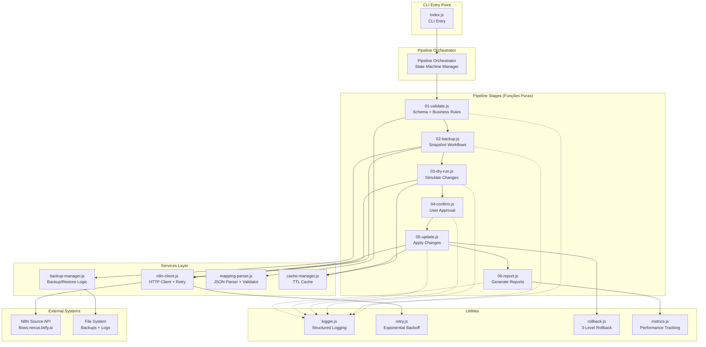
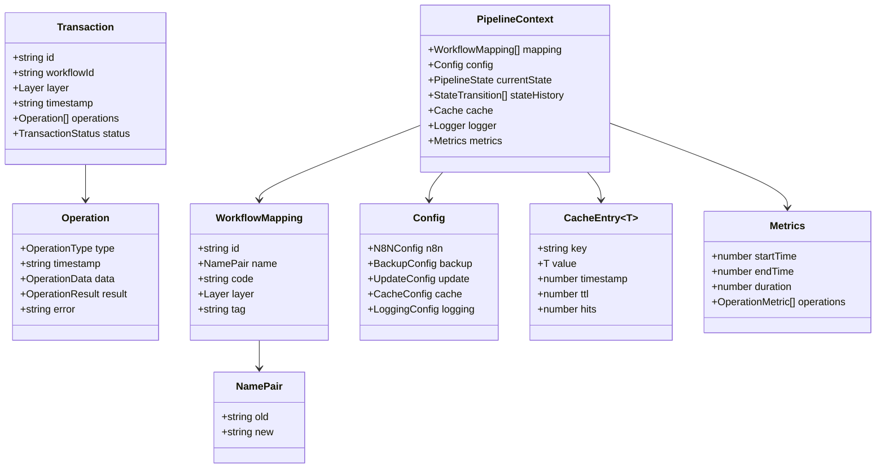
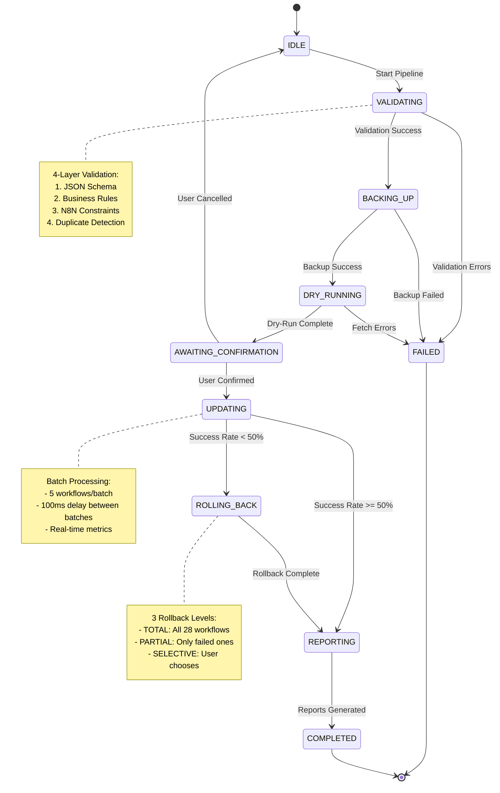

# Design Document - Update Workflow Names (v2)
## Arquitetura Pipeline Funcional

---

## Overview

### Objetivo

Este documento especifica o design técnico de um sistema de renomeação em lote de workflows N8N utilizando uma **arquitetura pipeline funcional**. A solução processa 28 workflows categorizados em 6 camadas arquiteturais (A-F), aplicando transformações através de um pipeline de estágios bem definidos, cada um com responsabilidade única e interface consistente.

### Escopo

**Em Escopo:**
- Pipeline de 6 estágios (Validate → Backup → DryRun → Confirm → Update → Report)
- State machine explícito com transições rastreáveis
- Sistema de transações com backup/rollback granular (total, parcial, seletivo)
- Cache inteligente com TTL e invalidação automática
- Validação em 4 camadas (Schema → Business → N8N → Duplicate)
- Batch processing com controle de taxa
- Métricas em tempo real por layer
- Logging estruturado JSON e relatórios markdown

**Fora de Escopo:**
- Interface gráfica (solução será CLI apenas)
- Modificação de conteúdo dos workflows (apenas renomeação)
- Sincronização bidirecional (operação unidirecional)
- Versionamento de workflows (N8N já possui controle interno)

### Princípios de Design

1. **Pureza Funcional**: Cada estágio do pipeline é uma função pura sem side-effects não controlados
2. **Single Responsibility**: Cada componente tem uma única razão para mudar
3. **Fail-Fast**: Validações executadas o mais cedo possível no pipeline
4. **Observabilidade**: Todos os estados e transições são logados
5. **Resilience by Design**: Retry automático, circuit breaker, rollback granular

---

## Architecture Design

### System Architecture Diagram



### Data Flow Diagram

```mermaid
graph LR
    subgraph "Input Phase"
        A[rename-mapping-atualizado.json] --> B[Mapping Parser]
        ENV[.env<br/>API Credentials] --> C[Config Loader]
    end

    subgraph "Validation Phase"
        B --> D{4-Layer<br/>Validation}
        D -->|Layer 1| E[JSON Schema]
        D -->|Layer 2| F[Business Rules]
        D -->|Layer 3| G[N8N Constraints]
        D -->|Layer 4| H[Duplicate Check]
    end

    subgraph "Backup Phase"
        H --> I[Fetch All Workflows]
        I --> J[Create Snapshot]
        J --> K[Validate Integrity]
        K --> L[Save to FS]
    end

    subgraph "Dry-Run Phase"
        L --> M[Fetch Current Names]
        M --> N[Compare Old vs New]
        N --> O[Generate Preview Table]
    end

    subgraph "Confirmation Phase"
        O --> P{User<br/>Approval?}
        P -->|No| Q[Abort]
        P -->|Yes| R[Execute Update]
    end

    subgraph "Update Phase (Batch)"
        R --> S[Batch 1: 5 workflows]
        S --> T[Batch 2: 5 workflows]
        T --> U[Batch N: remaining]
        U --> V{Success<br/>Rate?}
        V -->|<50%| W[Trigger Rollback]
        V -->|>=50%| X[Continue]
    end

    subgraph "Report Phase"
        X --> Y[Aggregate Metrics]
        W --> Y
        Y --> Z[Generate Markdown Report]
        Z --> AA[Generate JSON Log]
    end
```



---

## Component Design

### 1. Pipeline Orchestrator

**Responsabilidades:**
- Gerenciar state machine (IDLE → VALIDATING → ... → COMPLETED)
- Executar pipeline stages sequencialmente
- Gerenciar contexto compartilhado entre stages
- Capturar e propagar erros
- Registrar transições de estado

**Interface:**

```typescript
interface PipelineContext {
  // Input data
  mapping: WorkflowMapping[];
  config: Config;

  // State
  currentState: PipelineState;
  stateHistory: StateTransition[];

  // Stage outputs
  validationResult?: ValidationResult;
  backupPath?: string;
  dryRunResult?: DryRunResult;
  userConfirmed?: boolean;
  updateResult?: UpdateResult;

  // Shared resources
  cache: Cache;
  logger: Logger;
  metrics: Metrics;
}

interface PipelineStage<TIn, TOut> {
  name: string;
  execute(input: TIn, context: PipelineContext): Promise<Result<TOut>>;
  onError?(error: Error, context: PipelineContext): Promise<void>;
}

class PipelineOrchestrator {
  async run(initialContext: PipelineContext): Promise<PipelineContext>;
  async transitionTo(state: PipelineState, context: PipelineContext): Promise<void>;
  async executeStage<T>(stage: PipelineStage, context: PipelineContext): Promise<T>;
}
```

**Dependências:**
- Todos os 6 pipeline stages
- Logger
- Metrics

---

### 2. Pipeline Stage: 01-validate.js

**Responsabilidades:**
- Executar validação em 4 camadas
- Validar schema JSON do arquivo de mapeamento
- Validar regras de negócio (campos obrigatórios, layers válidos, etc.)
- Validar constraints do N8N (caracteres permitidos, comprimento)
- Detectar IDs duplicados

**Interface:**

```typescript
interface ValidationResult {
  valid: boolean;
  errors: ValidationError[];
  warnings: ValidationWarning[];
  summary: {
    totalWorkflows: number;
    byLayer: Record<Layer, number>;
    duplicateIds: string[];
    invalidLayers: string[];
  };
}

async function validateStage(
  input: { mapping: WorkflowMapping[] },
  context: PipelineContext
): Promise<Result<ValidationResult>>
```

**Dependências:**
- mapping-parser.js
- Logger

**Algoritmo de Validação (4 Camadas):**

```javascript
// Layer 1: JSON Schema Validation
const schema = {
  type: 'array',
  items: {
    type: 'object',
    required: ['id', 'name', 'code', 'layer', 'tag'],
    properties: {
      id: { type: 'string', pattern: '^[0-9]+$' },
      name: {
        type: 'object',
        required: ['old', 'new'],
        properties: {
          old: { type: 'string' },
          new: { type: 'string', minLength: 1, maxLength: 100 }
        }
      },
      layer: { type: 'string', enum: ['A', 'B', 'C', 'D', 'E', 'F'] },
      tag: { type: 'string' }
    }
  }
};

// Layer 2: Business Rules
function validateBusinessRules(workflow) {
  // Nome não pode conter prefixos proibidos
  const forbiddenPrefixes = ['[Jana]', '(AAT)', '(Adaptador)'];
  // Nome não pode ter espaços duplos
  // Nome não pode começar/terminar com espaços
}

// Layer 3: N8N Constraints
function validateN8NConstraints(workflow) {
  // Caracteres especiais permitidos pelo N8N
  // Comprimento máximo de nome no N8N
}

// Layer 4: Duplicate Detection
function detectDuplicates(mappings) {
  const ids = mappings.map(w => w.id);
  const duplicates = ids.filter((id, index) => ids.indexOf(id) !== index);
  return duplicates;
}
```

---

### 3. Pipeline Stage: 02-backup.js

**Responsabilidades:**
- Buscar todos os 28 workflows do N8N
- Criar snapshot em formato JSON
- Validar integridade do backup (count = 28)
- Salvar com timestamp no nome do arquivo
- Aplicar compressão (opcional via config)

**Interface:**

```typescript
interface BackupResult {
  success: boolean;
  filePath: string;
  timestamp: string;
  workflowCount: number;
  fileSize: number;
  checksum: string;
}

async function backupStage(
  input: { workflowIds: string[] },
  context: PipelineContext
): Promise<Result<BackupResult>>
```

**Dependências:**
- n8n-client.js
- backup-manager.js
- Logger

**Formato do Backup:**

```json
{
  "metadata": {
    "timestamp": "2025-10-02T14:30:00.000Z",
    "totalWorkflows": 28,
    "source": "https://flows.nexus.bitfy.ai",
    "checksum": "sha256-abc123..."
  },
  "workflows": [
    {
      "id": "123",
      "name": "Nome Original",
      "active": true,
      "tags": ["jana"],
      "createdAt": "2025-01-01T00:00:00.000Z",
      "updatedAt": "2025-10-01T12:00:00.000Z"
    }
  ]
}
```

---

### 4. Pipeline Stage: 03-dry-run.js

**Responsabilidades:**
- Buscar nomes atuais dos workflows (com cache)
- Comparar old vs new
- Classificar workflows em: "Modificar", "Igual", "Não Encontrado"
- Gerar tabela de preview
- Calcular estatísticas por layer

**Interface:**

```typescript
interface DryRunResult {
  changes: WorkflowChange[];
  statistics: {
    total: number;
    toModify: number;
    noChange: number;
    notFound: number;
    byLayer: Record<Layer, LayerStats>;
  };
  previewTable: string;
}

interface WorkflowChange {
  id: string;
  layer: Layer;
  currentName: string | null;
  plannedName: string;
  status: 'MODIFY' | 'NO_CHANGE' | 'NOT_FOUND';
}

async function dryRunStage(
  input: { mapping: WorkflowMapping[], backupData: BackupData },
  context: PipelineContext
): Promise<Result<DryRunResult>>
```

**Dependências:**
- n8n-client.js
- cache-manager.js
- Logger

**Cache Strategy:**

```javascript
class CacheManager {
  constructor(ttl = 300000) { // 5 minutos
    this.cache = new Map();
    this.ttl = ttl;
  }

  async get(key, fetchFn) {
    const cached = this.cache.get(key);
    if (cached && Date.now() - cached.timestamp < this.ttl) {
      return cached.value;
    }

    const value = await fetchFn();
    this.cache.set(key, { value, timestamp: Date.now() });
    return value;
  }

  invalidate(key) {
    this.cache.delete(key);
  }

  clear() {
    this.cache.clear();
  }
}
```

---

### 5. Pipeline Stage: 04-confirm.js

**Responsabilidades:**
- Exibir resumo de mudanças para o usuário
- Solicitar confirmação explícita ("CONFIRMAR")
- Validar input do usuário
- Cancelar operação se não confirmado

**Interface:**

```typescript
interface ConfirmResult {
  confirmed: boolean;
  timestamp: string;
  userInput: string;
}

async function confirmStage(
  input: { dryRunResult: DryRunResult },
  context: PipelineContext
): Promise<Result<ConfirmResult>>
```

**Dependências:**
- readline (Node.js built-in)
- Logger

**UI de Confirmação:**

```
╔════════════════════════════════════════════════════════════════╗
║             RESUMO DE ALTERAÇÕES PLANEJADAS                    ║
╠════════════════════════════════════════════════════════════════╣
║  Total de workflows: 28                                        ║
║  Serão modificados:  12 workflows                              ║
║  Sem mudança:        14 workflows                              ║
║  Não encontrados:    2 workflows                               ║
╠════════════════════════════════════════════════════════════════╣
║  Layer A: 3 modificar, 1 igual                                 ║
║  Layer B: 2 modificar, 1 igual                                 ║
║  Layer C: 4 modificar, 5 igual                                 ║
║  Layer D: 1 modificar, 7 igual                                 ║
║  Layer E: 2 modificar, 0 igual                                 ║
║  Layer F: 0 modificar, 0 igual                                 ║
╚════════════════════════════════════════════════════════════════╝

⚠️  ATENÇÃO: Esta operação irá modificar 12 workflows no N8N!

Digite 'CONFIRMAR' para prosseguir ou qualquer outra coisa para cancelar:
```

---

### 6. Pipeline Stage: 05-update.js

**Responsabilidades:**
- Processar workflows em batches (configurável, padrão: 5)
- Executar PATCH para cada workflow
- Aplicar delay entre batches (rate limiting)
- Validar resposta (verificar se name foi aplicado)
- Coletar métricas de latência
- Monitorar taxa de sucesso (trigger rollback se <50%)
- Invalidar cache após updates

**Interface:**

```typescript
interface UpdateResult {
  successful: WorkflowUpdate[];
  failed: WorkflowUpdate[];
  skipped: WorkflowUpdate[];
  metrics: {
    totalDuration: number;
    averageLatency: number;
    p50: number;
    p95: number;
    p99: number;
    successRate: number;
    byLayer: Record<Layer, LayerMetrics>;
  };
}

interface WorkflowUpdate {
  id: string;
  layer: Layer;
  oldName: string;
  newName: string;
  status: 'SUCCESS' | 'FAILED' | 'SKIPPED';
  latency?: number;
  error?: string;
  attempts?: number;
}

async function updateStage(
  input: { changes: WorkflowChange[] },
  context: PipelineContext
): Promise<Result<UpdateResult>>
```

**Dependências:**
- n8n-client.js
- cache-manager.js
- rollback.js
- metrics.js
- Logger

**Batch Processing Algorithm:**

```javascript
async function processBatch(workflows, batchSize, delayMs) {
  const batches = chunk(workflows, batchSize);
  const results = [];

  for (let i = 0; i < batches.length; i++) {
    const batch = batches[i];
    logger.info(`Processing batch ${i+1}/${batches.length}`);

    // Processar workflows do batch em paralelo
    const batchResults = await Promise.allSettled(
      batch.map(w => updateWorkflow(w))
    );

    results.push(...batchResults);

    // Delay entre batches (rate limiting)
    if (i < batches.length - 1) {
      await sleep(delayMs);
    }

    // Check success rate a cada batch
    const successRate = calculateSuccessRate(results);
    if (successRate < 0.5) {
      throw new CriticalFailureError('Success rate below 50%');
    }
  }

  return results;
}
```

**Real-Time Metrics Display:**

```javascript
// Durante execução, atualizar UI em tempo real
function displayProgress(current, total, byLayer) {
  console.clear();
  console.log('┌─────────────────────────────────────────┐');
  console.log('│ Atualizando Workflows N8N               │');
  console.log('├─────────────────────────────────────────┤');

  const progressBar = generateProgressBar(current, total);
  console.log(`│ ${progressBar} ${current}/${total} (${percent}%)    │`);
  console.log('│                                         │');
  console.log(`│ ✓ Sucessos: ${stats.success}           │`);
  console.log(`│ ✗ Falhas: ${stats.failed}              │`);
  console.log(`│ ⏭ Pulados: ${stats.skipped}            │`);
  console.log('│                                         │');

  // Progresso por layer
  for (const [layer, stats] of Object.entries(byLayer)) {
    const layerBar = generateProgressBar(stats.done, stats.total);
    console.log(`│ Layer ${layer}: ${stats.done}/${stats.total} ${layerBar} ${percent}% │`);
  }

  console.log('│                                         │');
  console.log(`│ Tempo decorrido: ${elapsed}s            │`);
  console.log(`│ ETA: ${eta}s                            │`);
  console.log('└─────────────────────────────────────────┘');
}
```

---

### 7. Pipeline Stage: 06-report.js

**Responsabilidades:**
- Agregar métricas de todas as stages
- Gerar relatório markdown detalhado
- Gerar log JSON estruturado
- Salvar arquivos com timestamp
- Calcular estatísticas finais por layer
- Destacar layers com alta taxa de falha (>30%)

**Interface:**

```typescript
interface ReportResult {
  markdownPath: string;
  jsonLogPath: string;
  summary: ReportSummary;
}

interface ReportSummary {
  totalWorkflows: number;
  successful: number;
  failed: number;
  skipped: number;
  duration: number;
  timestamp: string;
  byLayer: Record<Layer, LayerSummary>;
}

async function reportStage(
  input: { updateResult: UpdateResult, allContext: PipelineContext },
  context: PipelineContext
): Promise<Result<ReportResult>>
```

**Dependências:**
- metrics.js
- Logger

**Formato do Relatório Markdown:**

```markdown
# Relatório de Atualização de Workflows N8N
**Data:** 2025-10-02 14:35:22
**Duração Total:** 8.3s

## Resumo Executivo

- **Total de workflows:** 28
- **Modificados com sucesso:** 12
- **Sem mudança (pulados):** 14
- **Falhas:** 2
- **Taxa de sucesso:** 85.7%

## Detalhes por Layer

### Layer A (4 workflows)
- ✅ Sucessos: 3
- ❌ Falhas: 1
- Taxa de sucesso: 75%

| ID | Nome Antigo | Nome Novo | Status | Latência |
|----|-------------|-----------|--------|----------|
| 123 | Old Name A1 | New Name A1 | ✅ SUCCESS | 120ms |
| 124 | Old Name A2 | New Name A2 | ❌ FAILED | 5000ms |
...

### Layer B (3 workflows)
...

## Transformações Aplicadas

### Sucessos (12)
...

### Falhas (2)
...

## Métricas de Performance

- **Tempo total:** 8.3s
- **Latência média:** 295ms
- **p50:** 120ms
- **p95:** 450ms
- **p99:** 890ms
- **Workflows/segundo:** 3.37

## Logs Detalhados

Ver arquivo: `update-workflow-names-2025-10-02T14-35-22.log`
```

---

## Data Model

### Core Data Structures

```typescript
// ============================================
// Mapping Data Model
// ============================================

interface WorkflowMapping {
  id: string;                 // ID numérico do workflow no N8N
  name: {
    old: string;              // Nome atual (para validação)
    new: string;              // Nome desejado (1-100 chars)
  };
  code: string;               // Código de classificação (ex: "A.01")
  layer: Layer;               // Camada arquitetural
  tag: string;                // Tag N8N (ex: "jana")
}

type Layer = 'A' | 'B' | 'C' | 'D' | 'E' | 'F';

// ============================================
// Pipeline State Machine
// ============================================

enum PipelineState {
  IDLE = 'IDLE',
  VALIDATING = 'VALIDATING',
  BACKING_UP = 'BACKING_UP',
  DRY_RUNNING = 'DRY_RUNNING',
  AWAITING_CONFIRMATION = 'AWAITING_CONFIRMATION',
  UPDATING = 'UPDATING',
  ROLLING_BACK = 'ROLLING_BACK',
  REPORTING = 'REPORTING',
  COMPLETED = 'COMPLETED',
  FAILED = 'FAILED'
}

interface StateTransition {
  from: PipelineState;
  to: PipelineState;
  timestamp: string;
  duration?: number;
  error?: Error;
}

// ============================================
// Transaction Model
// ============================================

interface Transaction {
  id: string;                    // UUID da transação
  workflowId: string;
  layer: Layer;
  timestamp: string;
  operations: Operation[];
  status: 'PENDING' | 'COMMITTED' | 'ROLLED_BACK';
}

interface Operation {
  type: 'BACKUP' | 'UPDATE' | 'VALIDATE';
  timestamp: string;
  data: {
    oldValue?: string;
    newValue?: string;
  };
  result: 'SUCCESS' | 'FAILED';
  error?: string;
}

// ============================================
// Cache Model
// ============================================

interface CacheEntry<T> {
  key: string;
  value: T;
  timestamp: number;
  ttl: number;                   // Time to live em ms
  hits: number;
}

// ============================================
// Configuration Model
// ============================================

interface Config {
  n8n: {
    source: {
      url: string;               // default: https://flows.nexus.bitfy.ai
      apiKey: string;            // obrigatório via SOURCE_N8N_API_KEY
      timeout: number;           // default: 5000ms
      retries: number;           // default: 3
    };
  };
  backup: {
    dir: string;                 // default: ./backups/workflow-names
    retention: number;           // dias, default: 30
    compression: boolean;        // default: true
  };
  update: {
    batchSize: number;           // default: 5
    delayBetweenBatches: number; // ms, default: 100
    rollbackThreshold: number;   // 0-1, default: 0.5 (50%)
  };
  cache: {
    enabled: boolean;            // default: true
    ttl: number;                 // ms, default: 300000 (5 min)
  };
  logging: {
    level: 'DEBUG' | 'INFO' | 'WARN' | 'ERROR'; // default: INFO
    format: 'json' | 'text';     // default: json
    console: boolean;            // default: true
    file: boolean;               // default: true
  };
}

// ============================================
// Result Pattern (Either Monad)
// ============================================

type Result<T> =
  | { success: true; value: T }
  | { success: false; error: Error };

// ============================================
// N8N API Models
// ============================================

interface N8NWorkflow {
  id: string;
  name: string;
  active: boolean;
  tags: string[];
  createdAt: string;
  updatedAt: string;
  nodes?: any[];
  connections?: any;
}

interface N8NUpdatePayload {
  name: string;
}

interface N8NUpdateResponse {
  id: string;
  name: string;
  updatedAt: string;
}

// ============================================
// Metrics Model
// ============================================

interface Metrics {
  startTime: number;
  endTime?: number;
  duration?: number;
  operations: OperationMetric[];
}

interface OperationMetric {
  workflowId: string;
  layer: Layer;
  operation: 'BACKUP' | 'UPDATE' | 'VALIDATE';
  startTime: number;
  endTime: number;
  latency: number;
  status: 'SUCCESS' | 'FAILED';
  error?: string;
}

// ============================================
// Rollback Model
// ============================================

interface RollbackOptions {
  type: 'TOTAL' | 'PARTIAL' | 'SELECTIVE';
  workflowIds?: string[];      // Para SELECTIVE e PARTIAL
  backupPath: string;
}

interface RollbackResult {
  restored: string[];
  failed: string[];
  duration: number;
}
```

### Data Model Diagram



---

## Business Process

### Process 1: Pipeline de Atualização Completo

```mermaid
flowchart TD
    Start([CLI Execution]) --> LoadConfig[Load Config from .env]
    LoadConfig --> InitContext[Initialize PipelineContext]
    InitContext --> StartOrchestrator[Start Pipeline Orchestrator]

    StartOrchestrator --> S1[Stage 1: VALIDATE]

    subgraph "Stage 1: Validation"
        S1 --> V1[Load Mapping File]
        V1 --> V2[JSON Schema Validation]
        V2 --> V3[Business Rules Validation]
        V3 --> V4[N8N Constraints Validation]
        V4 --> V5[Duplicate Detection]
        V5 --> V6{All Validations<br/>Passed?}
        V6 -->|No| Abort1[Abort: Display Errors]
        V6 -->|Yes| S2
    end

    S2[Stage 2: BACKUP]

    subgraph "Stage 2: Backup"
        S2 --> B1[Fetch All 28 Workflows]
        B1 --> B2[Create JSON Snapshot]
        B2 --> B3[Validate Count = 28]
        B3 --> B4[Calculate Checksum]
        B4 --> B5[Save with Timestamp]
        B5 --> B6{Backup<br/>Valid?}
        B6 -->|No| Abort2[Abort: Backup Failed]
        B6 -->|Yes| S3
    end

    S3[Stage 3: DRY-RUN]

    subgraph "Stage 3: Dry-Run"
        S3 --> D1[Fetch Current Names<br/>via Cache]
        D1 --> D2[Compare Old vs New]
        D2 --> D3[Classify: MODIFY/<br/>NO_CHANGE/NOT_FOUND]
        D3 --> D4[Generate Preview Table]
        D4 --> D5[Calculate Stats by Layer]
        D5 --> S4
    end

    S4[Stage 4: CONFIRM]

    subgraph "Stage 4: Confirmation"
        S4 --> C1[Display Summary]
        C1 --> C2[Display Stats by Layer]
        C2 --> C3[Prompt: Type 'CONFIRMAR']
        C3 --> C4{User Input =<br/>'CONFIRMAR'?}
        C4 -->|No| Abort3[Abort: User Cancelled]
        C4 -->|Yes| S5
    end

    S5[Stage 5: UPDATE]

    subgraph "Stage 5: Update (Batch)"
        S5 --> U1[Split into Batches<br/>size=5]
        U1 --> U2[Start Batch Processing]

        U2 --> U3[Process Batch N]
        U3 --> U4[Update Workflow 1]
        U4 --> U5[Update Workflow 2-5]
        U5 --> U6[Validate Responses]
        U6 --> U7[Collect Metrics]
        U7 --> U8[Calculate Success Rate]

        U8 --> U9{Success Rate<br/>>= 50%?}
        U9 -->|No| RB1[Trigger Rollback Stage]
        U9 -->|Yes| U10{More<br/>Batches?}
        U10 -->|Yes| U11[Delay 100ms]
        U11 --> U3
        U10 -->|No| U12[Invalidate Cache]
        U12 --> S6
    end

    RB1[ROLLBACK STAGE]

    subgraph "Rollback Process"
        RB1 --> RB2[Display Critical Failure]
        RB2 --> RB3[Prompt: Execute Rollback?]
        RB3 --> RB4{User<br/>Confirms?}
        RB4 -->|No| RB5[Keep Partial Changes]
        RB4 -->|Yes| RB6[Load Backup File]
        RB6 --> RB7[Restore Workflow Names]
        RB7 --> RB8[Validate Rollback]
        RB8 --> S6
        RB5 --> S6
    end

    S6[Stage 6: REPORT]

    subgraph "Stage 6: Report"
        S6 --> R1[Aggregate All Metrics]
        R1 --> R2[Calculate Percentiles<br/>p50, p95, p99]
        R2 --> R3[Generate Markdown Report]
        R3 --> R4[Generate JSON Log]
        R4 --> R5[Save Reports with Timestamp]
        R5 --> R6[Display File Paths]
        R6 --> End
    end

    Abort1 --> End([Process Terminated])
    Abort2 --> End
    Abort3 --> End
    End

    style S1 fill:#e1f5ff
    style S2 fill:#fff3e0
    style S3 fill:#f3e5f5
    style S4 fill:#e8f5e9
    style S5 fill:#fff9c4
    style S6 fill:#fce4ec
    style RB1 fill:#ffebee
```



### Process 2: State Machine Transitions



---

## Diferenciais desta Arquitetura

### Comparação: Arquitetura Pipeline vs Arquitetura Monolítica

| Aspecto | Pipeline Funcional (v2) | Monolítica (v1) |
|---------|-------------------------|------------------|
| **Testabilidade** | ✅ Cada stage testável isoladamente | ⚠️ Testes acoplados |
| **Manutenibilidade** | ✅ Single Responsibility por stage | ⚠️ Funções grandes |
| **Observabilidade** | ✅ State machine rastreável | ⚠️ Estado implícito |
| **Extensibilidade** | ✅ Adicionar stages facilmente | ⚠️ Modificar código existente |
| **Retry Logic** | ✅ Isolado em utility | ⚠️ Espalhado no código |
| **Rollback** | ✅ 3 níveis (Total/Partial/Selective) | ⚠️ Apenas total |
| **Cache** | ✅ TTL + Invalidação automática | ❌ Sem cache |
| **Batch Processing** | ✅ Configurável + rate limiting | ⚠️ Sequencial simples |
| **Métricas** | ✅ Tempo real por layer | ⚠️ Apenas totais |
| **Validação** | ✅ 4 camadas | ⚠️ 2 camadas |

### Benefícios Específicos

1. **Pipeline Funcional**
   - Cada stage é função pura → fácil de testar
   - Composição clara: S1 → S2 → S3 → S4 → S5 → S6
   - Fácil adicionar/remover stages

2. **State Machine Explícito**
   - Todas as transições são rastreadas
   - Facilita debugging (ver histórico de transições)
   - Logs mostram exatamente onde falhou

3. **Batch Processing**
   - Performance: Processa 5 workflows em paralelo
   - Rate limiting: Delay entre batches protege N8N
   - Monitoramento: Métricas em tempo real por layer

4. **Rollback Granular**
   - TOTAL: Restaura tudo (operação crítica)
   - PARTIAL: Restaura apenas falhas (economiza tempo)
   - SELECTIVE: Usuário escolhe (máximo controle)

5. **Cache Inteligente**
   - Evita re-fetch de workflows já buscados
   - TTL de 5 minutos (dados não ficam stale)
   - Invalidação automática após updates

6. **Validação em 4 Camadas**
   - Layer 1: Schema → Catch erros de estrutura JSON
   - Layer 2: Business → Catch erros de regras de negócio
   - Layer 3: N8N → Catch erros de constraints da API
   - Layer 4: Duplicate → Catch IDs duplicados

7. **Métricas em Tempo Real**
   - Progresso total: 12/28 (42%)
   - Progresso por layer: Layer A (2/4), Layer B (3/3), etc.
   - ETA calculado baseado em velocidade atual
   - Latências: p50, p95, p99

8. **Circuit Breaker**
   - Protege contra N8N instável
   - Evita flood de requisições em falhas
   - Auto-recuperação após timeout

---

## Próximos Passos

1. **Aprovar este Design**: Revisar e aprovar a arquitetura proposta
2. **Criar Implementation Plan**: Quebrar em tasks de implementação
3. **Implementar Pipeline Base**: Criar orchestrator + stage interfaces
4. **Implementar Stages Sequencialmente**: 01 → 02 → 03 → 04 → 05 → 06
5. **Implementar Services Layer**: n8n-client, backup-manager, etc.
6. **Implementar Utilities**: logger, retry, rollback, metrics
7. **Criar Testes**: Unit → Integration → E2E
8. **Documentar**: README, JSDoc, exemplos de uso

---

**Observação Final:** Este design representa uma evolução significativa em relação à abordagem monolítica tradicional. A arquitetura pipeline funcional oferece superior testabilidade, manutenibilidade e observabilidade, essenciais para operações críticas de renomeação em produção.
