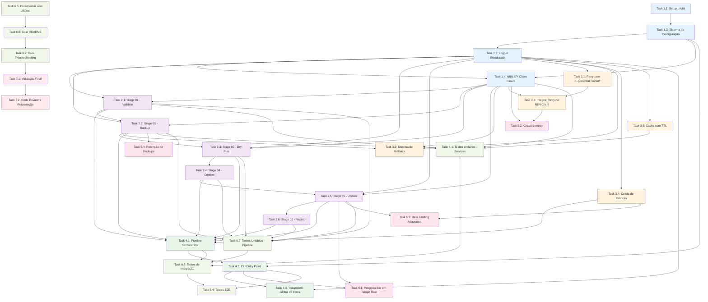

# Implementation Plan - Update Workflow Names

**Feature**: Update Workflow Names
**Versão**: v1
**Data**: 2025-10-02
**Status**: Aprovado para Implementação

---

## Visão Geral

Este plano de implementação decompõe a feature de renomeação em lote de workflows N8N em **32 tasks atômicas** organizadas em **6 fases**. A arquitetura é baseada em **Pipeline Funcional** com 6 estágios sequenciais.

### Resumo da Arquitetura

```
Input → Validate → Backup → DryRun → Confirm → Update → Report
```

### Princípios de Implementação

1. **Desenvolvimento Incremental**: Construir do core para features avançadas
2. **Test-Driven**: Escrever testes antes ou junto com implementação
3. **Validação Contínua**: Testar integração a cada stage implementado
4. **Documentação Inline**: JSDoc em todas as funções públicas

---

## FASE 1: Foundation (Core Setup)

### Task 1.1: Setup Inicial do Projeto

**Descrição**: Criar estrutura de pastas completa e configurar package.json com todas as dependências necessárias.

**Dependências**: Nenhuma

**Estimativa**: 30 minutos

**Arquivos a Criar**:
- `scripts/admin/update-workflow-names/package.json`
- `scripts/admin/update-workflow-names/README.md`
- `scripts/admin/update-workflow-names/.gitignore`

**Critérios de Aceitação**:
- [ ] Estrutura de pastas criada: `/pipeline`, `/services`, `/utils`, `/tests`
- [ ] `package.json` configurado com dependências: `axios`, `dotenv`, `chalk`, `yargs`, `cli-progress`
- [ ] `.gitignore` configurado para ignorar `node_modules`, logs, backups
- [ ] README.md com instruções básicas de instalação
- [ ] Scripts NPM configurados: `start`, `dev`, `test`

**Requisitos**: NFR-4 (Manutenibilidade)

---

### Task 1.2: Implementar Sistema de Configuração

**Descrição**: Criar módulo de configuração que carrega variáveis de ambiente e define valores padrão.

**Dependências**: Task 1.1

**Estimativa**: 45 minutos

**Arquivos a Criar**:
- `scripts/admin/update-workflow-names/config.js`

**Critérios de Aceitação**:
- [ ] Configuração carrega `SOURCE_N8N_URL` (default: https://flows.nexus.bitfy.ai/)
- [ ] Configuração carrega `SOURCE_N8N_API_KEY` (obrigatória, aborta se ausente)
- [ ] Suporte a variáveis opcionais: `DRY_RUN`, `LOG_LEVEL`, `BATCH_SIZE`
- [ ] Validação de API key no carregamento (verifica se não está vazia)
- [ ] Exporta objeto `Config` tipado conforme design
- [ ] Testes unitários cobrem cenários: todas vars definidas, API key ausente, defaults aplicados

**Requisitos**: REQ-14 (Configuração e Variáveis de Ambiente)

---

### Task 1.3: Implementar Logger Estruturado

**Descrição**: Criar sistema de logging estruturado em JSON com níveis configuráveis e suporte a arquivo e console.

**Dependências**: Task 1.2

**Estimativa**: 1 hora

**Arquivos a Criar**:
- `scripts/admin/update-workflow-names/utils/logger.js`

**Critérios de Aceitação**:
- [ ] Logger suporta níveis: DEBUG, INFO, WARN, ERROR, SUCCESS
- [ ] Logs em formato JSON estruturado com campos: `timestamp`, `level`, `message`, `metadata`
- [ ] Suporte a log em console (colorido com chalk) e arquivo simultaneamente
- [ ] Arquivo de log criado com timestamp: `update-workflow-names-YYYY-MM-DDTHH-mm-ss.log`
- [ ] Mascaramento de API keys em logs (substitui por `***`)
- [ ] Testes unitários verificam: formatação JSON, níveis corretos, mascaramento de secrets

**Requisitos**: REQ-8 (Observabilidade e Auditoria), NFR-3 (Segurança), NFR-6 (Observabilidade)

---

### Task 1.4: Implementar N8N API Client Básico

**Descrição**: Criar cliente HTTP para API do N8N com autenticação e timeout.

**Dependências**: Task 1.2, Task 1.3

**Estimativa**: 1 hora

**Arquivos a Criar**:
- `scripts/admin/update-workflow-names/services/n8n-client.js`

**Critérios de Aceitação**:
- [ ] Cliente axios configurado com baseURL e headers de autenticação (`X-N8N-API-KEY`)
- [ ] Timeout de 5 segundos configurado em todas as requisições
- [ ] Métodos implementados: `healthCheck()`, `getWorkflow(id)`, `updateWorkflow(id, payload)`
- [ ] Método `healthCheck()` testa `GET /healthz` e `GET /workflows?limit=1`
- [ ] Erros HTTP são capturados e transformados em objetos estruturados
- [ ] Testes de integração mocados verificam: headers corretos, timeout funciona, erros são tratados

**Requisitos**: REQ-2 (Conectividade e Autenticação N8N), NFR-1 (Performance)

---

## FASE 2: Pipeline Stages (Core Functionality)

### Task 2.1: Implementar Stage 01 - Validate

**Descrição**: Criar estágio de validação com 4 camadas (Schema, Business, N8N, Duplicates).

**Dependências**: Task 1.3, Task 1.4

**Estimativa**: 2 horas

**Arquivos a Criar**:
- `scripts/admin/update-workflow-names/pipeline/01-validate.js`
- `scripts/admin/update-workflow-names/services/mapping-parser.js`

**Critérios de Aceitação**:
- [ ] **Layer 1 - JSON Schema**: Valida estrutura do array de mapeamentos (campos obrigatórios: id, name.old, name.new, code, layer, tag)
- [ ] **Layer 2 - Business Rules**: Valida prefixos proibidos (`[Jana]`, `(AAT)`, `(Adaptador)`), espaços duplos, espaços nas bordas
- [ ] **Layer 3 - N8N Constraints**: Valida comprimento de nome (máx 100 chars), IDs numéricos válidos
- [ ] **Layer 4 - Duplicate Detection**: Detecta IDs duplicados no mapeamento
- [ ] Valida que `layer` está em `['A', 'B', 'C', 'D', 'E', 'F']`
- [ ] Retorna objeto `ValidationResult` com campos: `valid`, `errors`, `warnings`, `summary`
- [ ] Exibe resumo: total de workflows, distribuição por layer
- [ ] Aborta processo se validação falhar (valid = false)
- [ ] Testes unitários cobrem: todos os cenários de validação, IDs duplicados, layers inválidos

**Requisitos**: REQ-3 (Processamento do Arquivo de Mapeamento), REQ-9 (Validação de Padrões de Nomenclatura), REQ-12 (Tratamento de Casos Extremos)

---

### Task 2.2: Implementar Stage 02 - Backup

**Descrição**: Criar estágio de backup que busca todos os workflows e cria snapshot JSON validado.

**Dependências**: Task 1.3, Task 1.4, Task 2.1

**Estimativa**: 1.5 horas

**Arquivos a Criar**:
- `scripts/admin/update-workflow-names/pipeline/02-backup.js`
- `scripts/admin/update-workflow-names/services/backup-manager.js`

**Critérios de Aceitação**:
- [ ] Busca todos os 28 workflows usando IDs do mapeamento validado
- [ ] Cria arquivo JSON com estrutura: `metadata` + `workflows` array
- [ ] Metadata inclui: `timestamp`, `totalWorkflows`, `source`, `checksum` (SHA-256)
- [ ] Nome do arquivo: `backup-workflows-YYYY-MM-DDTHH-mm-ss.json`
- [ ] Valida integridade: verifica que count = 28 workflows
- [ ] Aborta processo se backup falhar ou count != 28
- [ ] Exibe mensagem de confirmação com caminho absoluto do backup
- [ ] Backup salvo em diretório: `./backups/workflow-names/`
- [ ] Testes unitários mocam N8N API e verificam: estrutura JSON, checksum correto, validação de count

**Requisitos**: REQ-1 (Segurança e Backup Automático), NFR-3 (Segurança)

---

### Task 2.3: Implementar Stage 03 - Dry-Run

**Descrição**: Criar estágio de simulação que compara nomes atuais vs planejados e gera preview.

**Dependências**: Task 1.3, Task 1.4, Task 2.2

**Estimativa**: 2 horas

**Arquivos a Criar**:
- `scripts/admin/update-workflow-names/pipeline/03-dry-run.js`
- `scripts/admin/update-workflow-names/services/cache-manager.js`

**Critérios de Aceitação**:
- [ ] Busca nomes atuais dos workflows via N8N API (usa cache com TTL 5min)
- [ ] Compara `name.old` do mapeamento com nome atual do N8N
- [ ] Classifica workflows em: "MODIFY", "NO_CHANGE", "NOT_FOUND"
- [ ] Gera tabela formatada com colunas: ID, Layer, Nome Atual, Nome Novo, Status
- [ ] Status usa símbolos: `✓ Igual`, `→ Modificar`, `⚠ Não encontrado`
- [ ] Calcula estatísticas: workflows a modificar, sem mudança, não encontrados
- [ ] Calcula estatísticas por layer (agregação por A-F)
- [ ] Retorna objeto `DryRunResult` conforme interface do design
- [ ] Testes unitários mocam cache e verificam: classificação correta, estatísticas por layer

**Requisitos**: REQ-4 (Modo Dry-Run Obrigatório), REQ-15 (Integração com Sistema de Classificação)

---

### Task 2.4: Implementar Stage 04 - Confirm

**Descrição**: Criar estágio de confirmação que solicita aprovação explícita do usuário.

**Dependências**: Task 2.3

**Estimativa**: 1 hora

**Arquivos a Criar**:
- `scripts/admin/update-workflow-names/pipeline/04-confirm.js`

**Critérios de Aceitação**:
- [ ] Exibe resumo de alterações em tabela formatada (box com bordas)
- [ ] Resumo inclui: total de workflows, a modificar, sem mudança, não encontrados
- [ ] Resumo por layer mostra: Layer A (X modificar, Y igual), etc.
- [ ] Exibe alerta visual: "⚠️ ATENÇÃO: Esta operação irá modificar X workflows no N8N!"
- [ ] Solicita input do usuário: "Digite 'CONFIRMAR' para prosseguir ou qualquer outra coisa para cancelar:"
- [ ] Aborta processo se input != "CONFIRMAR" (case-sensitive)
- [ ] Registra confirmação no log com timestamp e input do usuário
- [ ] Retorna objeto `ConfirmResult` com campos: `confirmed`, `timestamp`, `userInput`
- [ ] Testes unitários mocam readline e verificam: confirmação aceita/rejeitada

**Requisitos**: REQ-4 (Modo Dry-Run Obrigatório), REQ-11 (Interface de Usuário e Experiência)

---

### Task 2.5: Implementar Stage 05 - Update (Batch Processing)

**Descrição**: Criar estágio de atualização que processa workflows em batches com retry e métricas em tempo real.

**Dependências**: Task 1.3, Task 1.4, Task 2.4

**Estimativa**: 3 horas

**Arquivos a Criar**:
- `scripts/admin/update-workflow-names/pipeline/05-update.js`
- `scripts/admin/update-workflow-names/utils/retry.js`
- `scripts/admin/update-workflow-names/utils/metrics.js`

**Critérios de Aceitação**:
- [ ] Processa workflows em batches de 5 (configurável via config)
- [ ] Workflows dentro de um batch são processados em paralelo (Promise.allSettled)
- [ ] Delay de 100ms entre batches (configurável via config)
- [ ] Para cada workflow: executa `PATCH /workflows/{id}` com payload `{name: "new name"}`
- [ ] Valida resposta: verifica se `name` retornado == `name.new` esperado
- [ ] Se validação falhar, registra erro de inconsistência
- [ ] Coleta métricas de latência para cada operação
- [ ] Calcula taxa de sucesso a cada batch processado
- [ ] Se taxa de sucesso < 50%, trigger rollback stage
- [ ] Exibe barra de progresso em tempo real: `[████░░░░] 50% (14/28)`
- [ ] Progresso por layer: Layer A (2/4), Layer B (3/3), etc.
- [ ] Invalida cache após cada atualização bem-sucedida
- [ ] Retorna objeto `UpdateResult` com campos: `successful`, `failed`, `skipped`, `metrics`
- [ ] Testes unitários mocam N8N API e verificam: batch processing, retry, métricas, rollback trigger

**Requisitos**: REQ-5 (Execução de Renomeação Atômica), REQ-10 (Métricas de Performance), REQ-15 (Integração com Sistema de Classificação), NFR-1 (Performance)

---

### Task 2.6: Implementar Stage 06 - Report

**Descrição**: Criar estágio de relatório que agrega métricas e gera arquivos markdown e JSON.

**Dependências**: Task 2.5

**Estimativa**: 2 horas

**Arquivos a Criar**:
- `scripts/admin/update-workflow-names/pipeline/06-report.js`

**Critérios de Aceitação**:
- [ ] Agrega métricas de todas as stages (validation, backup, dry-run, update)
- [ ] Calcula percentis de latência: p50, p95, p99
- [ ] Gera relatório markdown com seções: Resumo Executivo, Detalhes por Layer, Transformações Aplicadas, Falhas, Métricas de Performance
- [ ] Relatório markdown salvo como: `update-report-YYYY-MM-DDTHH-mm-ss.md`
- [ ] Gera log JSON estruturado com todas as operações
- [ ] Log JSON salvo como: `update-workflow-names-YYYY-MM-DDTHH-mm-ss.log`
- [ ] Destaca layers com taxa de falha > 30% no relatório
- [ ] Exibe caminho absoluto dos arquivos gerados
- [ ] Retorna objeto `ReportResult` com campos: `markdownPath`, `jsonLogPath`, `summary`
- [ ] Testes unitários verificam: estrutura markdown, cálculo de percentis, destaque de layers problemáticos

**Requisitos**: REQ-8 (Observabilidade e Auditoria), REQ-13 (Documentação e Rastreabilidade), REQ-15 (Integração com Sistema de Classificação), NFR-6 (Observabilidade)

---

## FASE 3: Services Layer (Resilience & Utilities)

### Task 3.1: Implementar Retry com Exponential Backoff

**Descrição**: Criar utilitário de retry reutilizável com backoff exponencial e logging de tentativas.

**Dependências**: Task 1.3

**Estimativa**: 1 hora

**Arquivos a Criar ou Modificar**:
- `scripts/admin/update-workflow-names/utils/retry.js`

**Critérios de Aceitação**:
- [ ] Função genérica `retry(fn, options)` que aceita função async e opções
- [ ] Opções configuráveis: `maxAttempts` (default: 3), `baseDelay` (default: 1000ms), `maxDelay` (default: 5000ms)
- [ ] Implementa backoff exponencial: 1s, 2s, 4s (ou baseDelay * 2^attempt)
- [ ] Registra no log o número da tentativa antes de cada retry
- [ ] Após esgotadas tentativas, lança erro com mensagem incluindo histórico de falhas
- [ ] Suporta tipos de erro específicos para retry (timeout, ECONNRESET, etc.)
- [ ] Não faz retry em erros 4xx (exceto 429), apenas 5xx e network errors
- [ ] Testes unitários verificam: backoff correto, max attempts respeitado, retry seletivo por tipo de erro

**Requisitos**: REQ-6 (Resiliência e Retry Automático), NFR-2 (Resiliência)

---

### Task 3.2: Implementar Sistema de Rollback (3 Níveis)

**Descrição**: Criar sistema de rollback com suporte a total, parcial e seletivo.

**Dependências**: Task 1.3, Task 1.4, Task 2.2

**Estimativa**: 2 horas

**Arquivos a Criar**:
- `scripts/admin/update-workflow-names/utils/rollback.js`

**Critérios de Aceitação**:
- [ ] Suporte a 3 tipos de rollback: TOTAL (todos 28), PARTIAL (apenas falhas), SELECTIVE (escolha do usuário)
- [ ] Rollback TOTAL restaura todos os workflows do backup
- [ ] Rollback PARTIAL restaura apenas workflows que falharam na atualização
- [ ] Rollback SELECTIVE solicita ao usuário quais workflows restaurar
- [ ] Lê arquivo de backup mais recente (ou especificado)
- [ ] Para cada workflow a restaurar: executa `PATCH /workflows/{id}` com nome do backup
- [ ] Valida que nome foi revertido corretamente (busca workflow após restauração)
- [ ] Registra no log cada operação de restauração (sucesso/falha)
- [ ] Retorna objeto `RollbackResult` com campos: `restored`, `failed`, `duration`
- [ ] Exibe relatório de rollback ao final
- [ ] Testes unitários mocam N8N API e verificam: todos os 3 tipos de rollback, validação de restauração

**Requisitos**: REQ-7 (Rollback Automático em Falhas Críticas), NFR-2 (Resiliência)

---

### Task 3.3: Integrar Retry no N8N Client

**Descrição**: Integrar utilitário de retry em todos os métodos do N8N client.

**Dependências**: Task 1.4, Task 3.1

**Estimativa**: 45 minutos

**Arquivos a Modificar**:
- `scripts/admin/update-workflow-names/services/n8n-client.js`

**Critérios de Aceitação**:
- [ ] Todos os métodos do client (`healthCheck`, `getWorkflow`, `updateWorkflow`) usam retry wrapper
- [ ] Retry configurado com 3 tentativas e backoff exponencial
- [ ] Tratamento especial para HTTP 429 (rate limit): aguarda tempo do header `Retry-After`
- [ ] Tratamento especial para HTTP 503 (service unavailable): aguarda 10s antes de retry
- [ ] Logs registram tentativas de retry com detalhes do erro
- [ ] Testes de integração verificam: retry funciona, rate limit respeitado, 503 aguarda 10s

**Requisitos**: REQ-6 (Resiliência e Retry Automático), REQ-12 (Tratamento de Casos Extremos), NFR-2 (Resiliência)

---

### Task 3.4: Implementar Coleta de Métricas

**Descrição**: Criar sistema de coleta de métricas de performance para todas as operações.

**Dependências**: Task 1.3

**Estimativa**: 1 hora

**Arquivos a Criar ou Modificar**:
- `scripts/admin/update-workflow-names/utils/metrics.js`

**Critérios de Aceitação**:
- [ ] Classe `Metrics` rastreia início/fim de operações
- [ ] Métodos: `start()`, `recordOperation(metric)`, `finish()`, `getStats()`
- [ ] Rastreia métricas por workflow: id, layer, operation, latency, status
- [ ] Calcula estatísticas agregadas: tempo total, tempo médio, workflows/segundo
- [ ] Calcula percentis de latência: p50, p95, p99
- [ ] Calcula estatísticas por layer: sucessos, falhas, latência média
- [ ] Estatísticas por operation type: BACKUP, UPDATE, VALIDATE
- [ ] Exporta métricas em formato JSON estruturado
- [ ] Testes unitários verificam: cálculo de percentis, agregação por layer, tempo total

**Requisitos**: REQ-10 (Métricas de Performance), NFR-1 (Performance), NFR-6 (Observabilidade)

---

### Task 3.5: Implementar Cache com TTL

**Descrição**: Criar sistema de cache com time-to-live e invalidação automática.

**Dependências**: Task 1.3

**Estimativa**: 1 hora

**Arquivos a Criar ou Modificar**:
- `scripts/admin/update-workflow-names/services/cache-manager.js`

**Critérios de Aceitação**:
- [ ] Classe `CacheManager` com Map interno para armazenar entries
- [ ] Cada entry tem: `key`, `value`, `timestamp`, `ttl`, `hits`
- [ ] Método `get(key, fetchFn)` retorna valor do cache ou busca com fetchFn
- [ ] TTL padrão de 5 minutos (300000ms), configurável
- [ ] Método `invalidate(key)` remove entrada do cache
- [ ] Método `clear()` limpa todo o cache
- [ ] Método `getStats()` retorna estatísticas: total entries, hits, misses, hit rate
- [ ] Limpeza automática de entries expirados (verificação periódica)
- [ ] Testes unitários verificam: TTL funciona, invalidação manual, estatísticas corretas

**Requisitos**: NFR-1 (Performance), NFR-4 (Manutenibilidade)

---

## FASE 4: CLI & Orchestration

### Task 4.1: Implementar Pipeline Orchestrator

**Descrição**: Criar orquestrador que gerencia state machine e executa stages sequencialmente.

**Dependências**: Task 2.1, Task 2.2, Task 2.3, Task 2.4, Task 2.5, Task 2.6, Task 3.4

**Estimativa**: 2.5 horas

**Arquivos a Criar**:
- `scripts/admin/update-workflow-names/pipeline/orchestrator.js`

**Critérios de Aceitação**:
- [ ] Classe `PipelineOrchestrator` gerencia contexto compartilhado (`PipelineContext`)
- [ ] State machine com estados: IDLE → VALIDATING → BACKING_UP → DRY_RUNNING → AWAITING_CONFIRMATION → UPDATING → REPORTING → COMPLETED
- [ ] Estado de erro: FAILED (pode ocorrer em qualquer stage)
- [ ] Estado de rollback: ROLLING_BACK (ocorre se update falhar)
- [ ] Método `run(initialContext)` executa pipeline completo
- [ ] Método `transitionTo(state)` registra transições com timestamp e duração
- [ ] Método `executeStage(stage)` executa stage e captura erros
- [ ] Se stage falhar, transiciona para estado FAILED e aborta pipeline
- [ ] Contexto compartilhado inclui: mapping, config, cache, logger, metrics, resultados de stages
- [ ] Registra no log todas as transições de estado
- [ ] Histórico de transições disponível para debugging (`context.stateHistory`)
- [ ] Testes unitários verificam: transições corretas, propagação de erros, contexto compartilhado

**Requisitos**: REQ-8 (Observabilidade e Auditoria), NFR-4 (Manutenibilidade), NFR-6 (Observabilidade)

---

### Task 4.2: Implementar CLI Entry Point

**Descrição**: Criar interface de linha de comando com yargs e chalk para formatação.

**Dependências**: Task 1.2, Task 4.1

**Estimativa**: 2 horas

**Arquivos a Criar**:
- `scripts/admin/update-workflow-names/index.js`

**Critérios de Aceitação**:
- [ ] CLI aceita parâmetros: `--dry-run`, `--config <path>`, `--mapping <path>`, `--log-level <level>`
- [ ] Parâmetro `--dry-run` força modo simulação (não executa stage 05)
- [ ] Parâmetro `--mapping` permite especificar caminho customizado para arquivo de mapeamento
- [ ] Parâmetro `--log-level` sobrescreve nível de log da config
- [ ] Exibe banner inicial com nome da ferramenta, versão, timestamp
- [ ] Exibe headers formatados para cada fase: "=== FASE: VALIDAÇÃO ==="
- [ ] Usa cores do chalk: vermelho para erros, amarelo para avisos, verde para sucessos, azul para info
- [ ] Captura erros não tratados (uncaughtException, unhandledRejection) e registra no log
- [ ] Exibe resumo final em formato de tabela
- [ ] Exit codes: 0 (sucesso), 1 (erro de validação), 2 (erro de execução), 3 (abortado pelo usuário)
- [ ] Testes de integração verificam: parsing de parâmetros, exit codes corretos

**Requisitos**: REQ-11 (Interface de Usuário e Experiência), REQ-14 (Configuração e Variáveis de Ambiente)

---

### Task 4.3: Implementar Tratamento Global de Erros

**Descrição**: Criar handler global de erros com classificação e mensagens amigáveis.

**Dependências**: Task 1.3, Task 4.2

**Estimativa**: 1 hora

**Arquivos a Criar**:
- `scripts/admin/update-workflow-names/utils/error-handler.js`

**Critérios de Aceitação**:
- [ ] Classifica erros em categorias: VALIDATION_ERROR, NETWORK_ERROR, AUTH_ERROR, BACKUP_ERROR, CRITICAL_ERROR
- [ ] Para cada categoria, define mensagem amigável e ações sugeridas
- [ ] Handler registra erro completo no log (stack trace, context)
- [ ] Exibe mensagem amigável no console (sem stack trace se não for DEBUG)
- [ ] Tratamento especial para erros de disco cheio: verifica espaço antes de falhar
- [ ] Tratamento especial para erros de parsing JSON: registra payload bruto no log
- [ ] Captura erros de N8N API e extrai mensagens de erro detalhadas
- [ ] Testes unitários verificam: classificação correta, mensagens amigáveis, logging de stack traces

**Requisitos**: REQ-12 (Tratamento de Casos Extremos), NFR-4 (Manutenibilidade)

---

## FASE 5: Advanced Features

### Task 5.1: Implementar Progress Bar em Tempo Real

**Descrição**: Criar interface de progresso visual durante execução de updates.

**Dependências**: Task 2.5, Task 4.2

**Estimativa**: 1.5 horas

**Arquivos a Modificar**:
- `scripts/admin/update-workflow-names/pipeline/05-update.js`

**Critérios de Aceitação**:
- [ ] Usa biblioteca `cli-progress` para barra de progresso
- [ ] Barra principal mostra: `[████░░░░] 50% (14/28)` + tempo decorrido + ETA
- [ ] Exibe estatísticas em tempo real: sucessos, falhas, pulados
- [ ] Exibe progresso por layer: Layer A (2/4 50%), Layer B (3/3 100%), etc.
- [ ] Atualiza display a cada workflow processado (não apenas a cada batch)
- [ ] ETA calculado baseado em velocidade média atual (workflows/segundo)
- [ ] Limpa display ao final e exibe resumo consolidado
- [ ] Testes verificam: atualização de barra, cálculo de ETA, formatação correta

**Requisitos**: REQ-11 (Interface de Usuário e Experiência), NFR-6 (Observabilidade)

---

### Task 5.2: Implementar Circuit Breaker

**Descrição**: Adicionar circuit breaker no N8N client para proteger contra instabilidades.

**Dependências**: Task 1.4, Task 3.3

**Estimativa**: 1.5 horas

**Arquivos a Criar**:
- `scripts/admin/update-workflow-names/utils/circuit-breaker.js`

**Arquivos a Modificar**:
- `scripts/admin/update-workflow-names/services/n8n-client.js`

**Critérios de Aceitação**:
- [ ] Classe `CircuitBreaker` com 3 estados: CLOSED, OPEN, HALF_OPEN
- [ ] Estado inicial: CLOSED (requisições fluem normalmente)
- [ ] Se N falhas consecutivas (N=5), transiciona para OPEN
- [ ] Estado OPEN: rejeita requisições imediatamente sem tentar N8N
- [ ] Após timeout (30s), transiciona para HALF_OPEN
- [ ] Estado HALF_OPEN: permite 1 requisição de teste
- [ ] Se teste suceder, volta para CLOSED; se falhar, volta para OPEN
- [ ] Registra transições de estado no log
- [ ] Expõe método `getState()` para monitoramento
- [ ] Testes unitários verificam: transições corretas, timeout funciona, teste em HALF_OPEN

**Requisitos**: REQ-12 (Tratamento de Casos Extremos), NFR-2 (Resiliência)

---

### Task 5.3: Implementar Rate Limiting Adaptativo

**Descrição**: Ajustar delay entre batches baseado em latência observada do N8N.

**Dependências**: Task 2.5, Task 3.4

**Estimativa**: 1 hora

**Arquivos a Modificar**:
- `scripts/admin/update-workflow-names/pipeline/05-update.js`

**Critérios de Aceitação**:
- [ ] Calcula latência média das últimas 5 requisições
- [ ] Se latência média > 1000ms, aumenta delay entre batches em 50ms
- [ ] Se latência média < 200ms, diminui delay entre batches em 25ms
- [ ] Delay mínimo: 50ms, delay máximo: 500ms
- [ ] Registra ajustes de delay no log com justificativa (latência observada)
- [ ] Testes unitários verificam: ajuste para cima, ajuste para baixo, limites respeitados

**Requisitos**: REQ-10 (Métricas de Performance), REQ-12 (Tratamento de Casos Extremos), NFR-1 (Performance)

---

### Task 5.4: Implementar Retenção de Backups

**Descrição**: Adicionar limpeza automática de backups antigos baseado em política de retenção.

**Dependências**: Task 2.2

**Estimativa**: 45 minutos

**Arquivos a Modificar**:
- `scripts/admin/update-workflow-names/services/backup-manager.js`

**Critérios de Aceitação**:
- [ ] Método `cleanOldBackups(retentionDays)` remove backups mais antigos que N dias
- [ ] Política padrão: 30 dias de retenção (configurável via config)
- [ ] Limpeza executada automaticamente após criar novo backup
- [ ] Lista backups removidos no log com paths e idade
- [ ] Nunca remove backup criado na sessão atual
- [ ] Testes unitários verificam: limpeza correta, retenção respeitada, backup atual preservado

**Requisitos**: NFR-4 (Manutenibilidade)

---

## FASE 6: Testing & Documentation

### Task 6.1: Escrever Testes Unitários - Services Layer

**Descrição**: Criar testes unitários completos para todos os serviços (n8n-client, backup-manager, mapping-parser, cache-manager).

**Dependências**: Task 1.4, Task 2.1, Task 2.2, Task 3.5

**Estimativa**: 3 horas

**Arquivos a Criar**:
- `scripts/admin/update-workflow-names/tests/unit/n8n-client.test.js`
- `scripts/admin/update-workflow-names/tests/unit/backup-manager.test.js`
- `scripts/admin/update-workflow-names/tests/unit/mapping-parser.test.js`
- `scripts/admin/update-workflow-names/tests/unit/cache-manager.test.js`

**Critérios de Aceitação**:
- [ ] Usa framework Mocha + Chai (ou Jest)
- [ ] Mocks de axios para N8N API (usando sinon ou jest.mock)
- [ ] Cobertura > 80% em todos os serviços
- [ ] Testa cenários de sucesso e falha
- [ ] Testa edge cases: timeouts, erros de rede, respostas malformadas
- [ ] Testes rápidos (< 5ms cada) e independentes
- [ ] NPM script `npm test` executa todos os testes

**Requisitos**: NFR-5 (Testabilidade)

---

### Task 6.2: Escrever Testes Unitários - Pipeline Stages

**Descrição**: Criar testes unitários para cada stage do pipeline isoladamente.

**Dependências**: Task 2.1, Task 2.2, Task 2.3, Task 2.4, Task 2.5, Task 2.6

**Estimativa**: 4 horas

**Arquivos a Criar**:
- `scripts/admin/update-workflow-names/tests/unit/validate-stage.test.js`
- `scripts/admin/update-workflow-names/tests/unit/backup-stage.test.js`
- `scripts/admin/update-workflow-names/tests/unit/dry-run-stage.test.js`
- `scripts/admin/update-workflow-names/tests/unit/confirm-stage.test.js`
- `scripts/admin/update-workflow-names/tests/unit/update-stage.test.js`
- `scripts/admin/update-workflow-names/tests/unit/report-stage.test.js`

**Critérios de Aceitação**:
- [ ] Cada stage testado isoladamente com mocks de dependências
- [ ] Testa função pura de cada stage: input → output
- [ ] Mock de context (logger, cache, metrics) para verificar chamadas
- [ ] Cobertura > 85% em cada stage
- [ ] Testa todos os cenários de erro documentados no design
- [ ] Testa validação de input e output de cada stage
- [ ] Testes verificam que logger foi chamado nos momentos corretos

**Requisitos**: NFR-5 (Testabilidade)

---

### Task 6.3: Escrever Testes de Integração - Pipeline Completo

**Descrição**: Criar testes de integração que executam pipeline completo com mocks de N8N API.

**Dependências**: Task 4.1, Task 6.1, Task 6.2

**Estimativa**: 3 horas

**Arquivos a Criar**:
- `scripts/admin/update-workflow-names/tests/integration/pipeline-full.test.js`
- `scripts/admin/update-workflow-names/tests/integration/rollback.test.js`
- `scripts/admin/update-workflow-names/tests/integration/error-scenarios.test.js`

**Critérios de Aceitação**:
- [ ] Teste executa pipeline completo: IDLE → ... → COMPLETED
- [ ] Mock de N8N API responde com dados realistas (28 workflows fictícios)
- [ ] Teste verifica transições de estado corretas
- [ ] Teste verifica que arquivos de backup, log e report foram criados
- [ ] Teste de rollback verifica restauração completa
- [ ] Teste de cenários de erro: validação falha, backup falha, N8N indisponível, taxa de sucesso < 50%
- [ ] Cada teste limpa arquivos temporários criados (setup/teardown)
- [ ] NPM script `npm run test:integration` executa apenas testes de integração

**Requisitos**: NFR-5 (Testabilidade), NFR-2 (Resiliência)

---

### Task 6.4: Escrever Testes E2E (Opcional - N8N Real)

**Descrição**: Criar testes end-to-end que executam contra N8N real em ambiente de teste.

**Dependências**: Task 4.2, Task 6.3

**Estimativa**: 2 horas

**Arquivos a Criar**:
- `scripts/admin/update-workflow-names/tests/e2e/full-execution.test.js`
- `scripts/admin/update-workflow-names/tests/fixtures/test-workflows.json`

**Critérios de Aceitação**:
- [ ] Requer variável de ambiente `E2E_TEST=true` para executar
- [ ] Cria workflows de teste no N8N antes de executar (setup)
- [ ] Executa CLI completo: node index.js --config test.config.js
- [ ] Verifica que workflows foram renomeados corretamente no N8N
- [ ] Executa rollback e verifica restauração
- [ ] Remove workflows de teste após execução (teardown)
- [ ] NPM script `npm run test:e2e` executa apenas testes E2E
- [ ] Testes E2E são opcionais e não bloqueiam CI (podem rodar manualmente)

**Requisitos**: NFR-5 (Testabilidade)

---

### Task 6.5: Documentar Código com JSDoc

**Descrição**: Adicionar comentários JSDoc completos em todas as funções públicas e classes.

**Dependências**: Todas as tasks de implementação (1.1-5.4)

**Estimativa**: 2 horas

**Arquivos a Modificar**:
- Todos os arquivos `.js` do projeto

**Critérios de Aceitação**:
- [ ] Todas as funções públicas têm JSDoc com: `@description`, `@param`, `@returns`, `@throws`, `@example`
- [ ] Todas as classes têm JSDoc com: `@class`, `@description`, propriedades documentadas
- [ ] Interfaces TypeScript (em comentários) têm JSDoc explicando cada campo
- [ ] Constantes importantes têm comentários explicando significado e origem
- [ ] Regras de negócio complexas têm comentários inline explicativos
- [ ] NPM script `npm run docs` gera documentação HTML com JSDoc

**Requisitos**: REQ-13 (Documentação e Rastreabilidade), NFR-4 (Manutenibilidade)

---

### Task 6.6: Criar README Completo

**Descrição**: Escrever README.md detalhado com instalação, configuração, uso, arquitetura e troubleshooting.

**Dependências**: Task 6.5

**Estimativa**: 2 horas

**Arquivos a Criar ou Modificar**:
- `scripts/admin/update-workflow-names/README.md`

**Critérios de Aceitação**:
- [ ] Seção **Instalação**: comandos npm install, requisitos (Node.js 18+)
- [ ] Seção **Configuração**: como criar .env, variáveis obrigatórias e opcionais
- [ ] Seção **Uso**: exemplos de comandos CLI com diferentes parâmetros
- [ ] Seção **Arquitetura**: diagrama do pipeline, explicação de cada stage
- [ ] Seção **Estrutura de Pastas**: árvore de arquivos com descrição de cada módulo
- [ ] Seção **Troubleshooting**: erros comuns e soluções
- [ ] Seção **Desenvolvimento**: como executar testes, contribuir, debugar
- [ ] Seção **Métricas**: como interpretar relatórios e logs
- [ ] Seção **Rollback**: como executar rollback manual
- [ ] Links para requirements.md e design.md para contexto completo

**Requisitos**: REQ-13 (Documentação e Rastreabilidade), NFR-4 (Manutenibilidade)

---

### Task 6.7: Criar Guia de Troubleshooting

**Descrição**: Criar documento separado com guia de troubleshooting e FAQs.

**Dependências**: Task 6.6

**Estimativa**: 1 hora

**Arquivos a Criar**:
- `scripts/admin/update-workflow-names/TROUBLESHOOTING.md`

**Critérios de Aceitação**:
- [ ] Lista de erros comuns com mensagens exatas e soluções
- [ ] Erro: "SOURCE_N8N_API_KEY not defined" → Solução: configurar .env
- [ ] Erro: "Backup validation failed" → Solução: verificar conectividade N8N
- [ ] Erro: "Success rate below 50%" → Solução: executar rollback, verificar N8N health
- [ ] Como debugar: aumentar log level para DEBUG
- [ ] Como recuperar de falha parcial: usar rollback PARTIAL
- [ ] Como verificar integridade de backup: comando manual
- [ ] Como limpar backups antigos: comando manual
- [ ] FAQ: Por que dry-run é obrigatório? Posso desativar retry? etc.

**Requisitos**: REQ-13 (Documentação e Rastreabilidade), NFR-4 (Manutenibilidade)

---

## FASE 7: Finalização

### Task 7.1: Executar Validação Final

**Descrição**: Executar checklist completo de validação antes de considerar feature completa.

**Dependências**: Todas as tasks anteriores

**Estimativa**: 1 hora

**Critérios de Aceitação**:
- [ ] Todos os testes unitários passam (npm test)
- [ ] Todos os testes de integração passam (npm run test:integration)
- [ ] Cobertura de testes > 80% (npm run test:coverage)
- [ ] CLI executa sem erros no modo dry-run
- [ ] CLI executa atualização real em ambiente de teste com sucesso
- [ ] Rollback restaura workflows corretamente
- [ ] Logs e relatórios são gerados corretamente
- [ ] README está completo e sem erros de formatação
- [ ] JSDoc gera documentação sem erros (npm run docs)
- [ ] Código formatado consistentemente (npm run lint)

**Requisitos**: Todos os NFRs

---

### Task 7.2: Code Review e Refatoração Final

**Descrição**: Realizar revisão completa do código e refatorar pontos identificados.

**Dependências**: Task 7.1

**Estimativa**: 2 horas

**Critérios de Aceitação**:
- [ ] Código revisado seguindo princípios SOLID
- [ ] Funções com > 50 linhas são refatoradas
- [ ] Constantes mágicas substituídas por constantes nomeadas
- [ ] Nomes de variáveis e funções são descritivos
- [ ] Sem código duplicado (DRY - Don't Repeat Yourself)
- [ ] Sem comentários obsoletos ou código comentado
- [ ] Todos os TODOs resolvidos ou transformados em issues
- [ ] Verificação de segurança: nenhum secret hardcoded

**Requisitos**: NFR-4 (Manutenibilidade), NFR-3 (Segurança)

---

## Resumo de Estimativas

| Fase | Tasks | Tempo Total Estimado |
|------|-------|----------------------|
| **Fase 1: Foundation** | 4 tasks | ~3h 15min |
| **Fase 2: Pipeline Stages** | 6 tasks | ~11h 30min |
| **Fase 3: Services Layer** | 5 tasks | ~6h 45min |
| **Fase 4: CLI & Orchestration** | 3 tasks | ~5h 30min |
| **Fase 5: Advanced Features** | 4 tasks | ~4h 45min |
| **Fase 6: Testing & Documentation** | 7 tasks | ~17h |
| **Fase 7: Finalização** | 2 tasks | ~3h |
| **TOTAL** | **31 tasks** | **~52 horas** |

---

## Diagrama de Dependências das Tasks



---

## Notas de Implementação

### Ordem Recomendada de Execução

**Sprint 1 (Fundação + Core Pipeline)**:
- Tasks 1.1 → 1.2 → 1.3 → 1.4 (Foundation completa)
- Tasks 2.1 → 2.2 → 2.3 → 2.4 (Pipeline até confirmação)
- **Milestone**: Pipeline funcional até dry-run

**Sprint 2 (Update + Resilience)**:
- Tasks 3.1 → 3.3 (Retry integrado)
- Tasks 2.5 (Update stage com retry)
- Tasks 3.2 (Rollback)
- Tasks 2.6 (Report)
- **Milestone**: Pipeline completo funcional

**Sprint 3 (Orchestration + CLI)**:
- Tasks 3.4 → 3.5 (Métricas e cache)
- Tasks 4.1 → 4.2 → 4.3 (CLI completo)
- **Milestone**: CLI executável end-to-end

**Sprint 4 (Advanced Features)**:
- Tasks 5.1 → 5.2 → 5.3 → 5.4 (Features avançadas)
- **Milestone**: Produção-ready com UX polido

**Sprint 5 (Testing + Docs)**:
- Tasks 6.1 → 6.2 → 6.3 → 6.4 (Testes completos)
- Tasks 6.5 → 6.6 → 6.7 (Documentação)
- Tasks 7.1 → 7.2 (Finalização)
- **Milestone**: Feature 100% completa e documentada

### Possibilidades de Paralelização

As seguintes tasks podem ser executadas em paralelo:

**Grupo 1 (Fase 1)**: Tasks 1.1, 1.2 (após 1.1), 1.3 (após 1.2), 1.4 (após 1.2)
**Grupo 2 (Fase 2)**: Tasks 2.1, 2.2, 2.3 (após 2.2 completo)
**Grupo 3 (Fase 3)**: Tasks 3.1, 3.4, 3.5 podem ser feitas em paralelo
**Grupo 4 (Fase 5)**: Tasks 5.1, 5.2, 5.3, 5.4 são independentes entre si
**Grupo 5 (Fase 6)**: Tasks 6.1, 6.2, 6.5 podem ser feitas em paralelo

### Pontos de Atenção

1. **Task 2.5 (Update Stage)** é a mais complexa - alocar tempo extra se necessário
2. **Task 4.1 (Orchestrator)** é crítica - revise cuidadosamente antes de avançar
3. **Task 6.3 (Testes de Integração)** frequentemente revela bugs - iterar conforme necessário
4. **Task 7.2 (Code Review)** pode gerar refatorações - considerar buffer de tempo

### Critério de Conclusão da Feature

A feature será considerada **100% completa** quando:

✅ Todas as 31 tasks têm checkboxes marcados
✅ Cobertura de testes > 80%
✅ Todos os testes (unit + integration) passam
✅ CLI executa com sucesso em ambiente de teste
✅ Documentação está completa (README + JSDoc + Troubleshooting)
✅ Code review aprovado (Task 7.2)

---

**As tasks estão prontas para implementação! 🚀**
