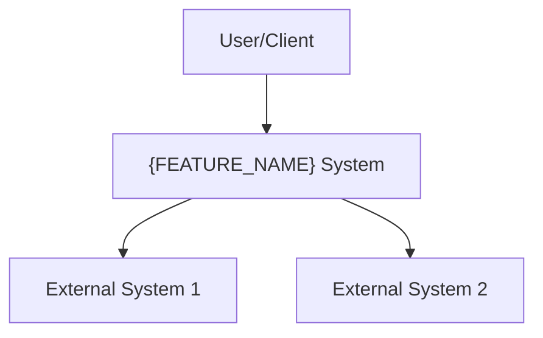
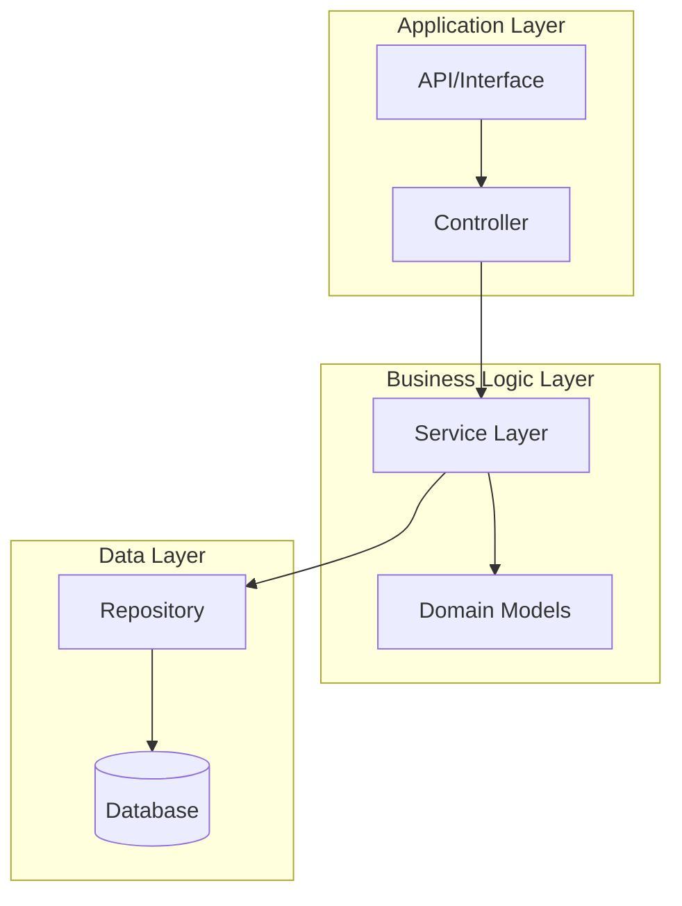
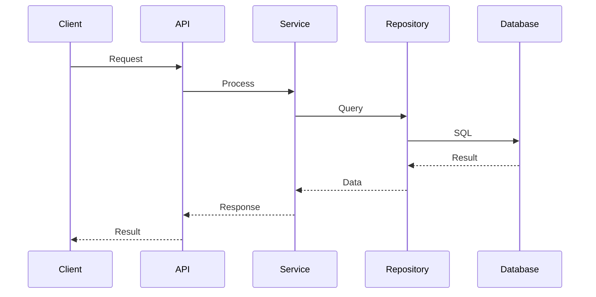
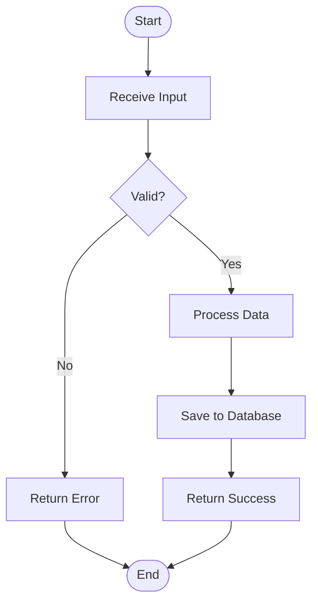
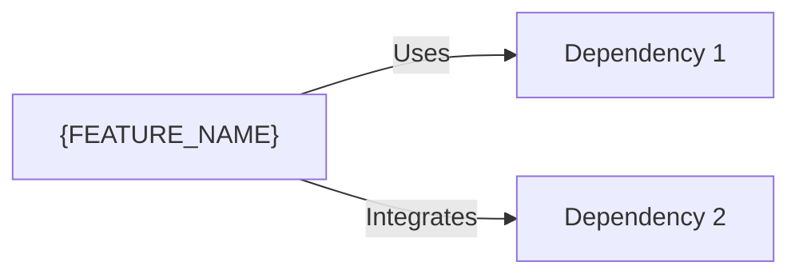

# Design Document - {FEATURE_NAME}

## Metadata

- **Feature Name**: {FEATURE_NAME}
- **Created**: {DATE}
- **Last Updated**: {DATE}
- **Status**: Draft
- **Version**: 0.1.0
- **Based on Requirements**: requirements.md v{VERSION}

## Executive Summary

<!-- Resumo de alto nível do design desta feature -->

## Architecture Overview

### System Context



### Component Architecture



## Detailed Design

### Component 1: {Component Name}

#### Responsibility
<!-- O que este componente faz? -->

#### Interface

```javascript
// API/Interface definition
class ComponentName {
  /**
   * Method description
   * @param {Type} param1 - Description
   * @returns {Type} Description
   */
  methodName(param1) {
    // Implementation details
  }
}
```

#### Implementation Details
<!-- Detalhes de como o componente funciona internamente -->

#### Dependencies
- {Dependency 1}
- {Dependency 2}

### Component 2: {Component Name}

#### Responsibility
<!-- O que este componente faz? -->

#### Interface

```javascript
// API/Interface definition
```

#### Implementation Details
<!-- Detalhes de como o componente funciona internamente -->

## Data Design

### Data Models

#### Model 1: {Model Name}

```javascript
{
  id: "string (UUID)",
  name: "string",
  description: "string",
  status: "enum: active|inactive|deleted",
  metadata: {
    createdAt: "timestamp",
    updatedAt: "timestamp",
    createdBy: "string (user_id)"
  }
}
```

**Validation Rules**:
- `id`: Required, unique, UUID format
- `name`: Required, max 255 characters
- `status`: Required, one of: active, inactive, deleted

### Database Schema

```sql
CREATE TABLE {table_name} (
  id UUID PRIMARY KEY DEFAULT gen_random_uuid(),
  name VARCHAR(255) NOT NULL,
  description TEXT,
  status VARCHAR(20) NOT NULL DEFAULT 'active',
  created_at TIMESTAMP NOT NULL DEFAULT NOW(),
  updated_at TIMESTAMP NOT NULL DEFAULT NOW(),
  created_by UUID REFERENCES users(id)
);

CREATE INDEX idx_{table_name}_status ON {table_name}(status);
CREATE INDEX idx_{table_name}_created_at ON {table_name}(created_at);
```

### Data Flow



## API Design

### Endpoint 1: {Endpoint Name}

**Method**: GET | POST | PUT | DELETE
**Path**: `/api/v1/resource/{id}`
**Authentication**: Required | Optional | None

**Request**:
```json
{
  "field1": "value",
  "field2": "value"
}
```

**Response** (200 OK):
```json
{
  "success": true,
  "data": {
    "id": "123",
    "field1": "value"
  }
}
```

**Error Response** (400 Bad Request):
```json
{
  "success": false,
  "error": {
    "code": "VALIDATION_ERROR",
    "message": "Invalid input",
    "details": []
  }
}
```

## Business Logic

### Process Flow 1: {Process Name}



**Steps**:
1. Receive and validate input
2. Process business logic
3. Persist data
4. Return result

### Business Rules

#### BR-001: {Rule Name}
**Rule**: {Description of the business rule}
**Implementation**: {How this rule is enforced in code}

## Security Design

### Authentication
<!-- Como a autenticação é implementada? -->

### Authorization
<!-- Como a autorização é implementada? -->

### Data Protection
<!-- Como os dados sensíveis são protegidos? -->

### Security Considerations
- {Security consideration 1}
- {Security consideration 2}

## Performance Design

### Performance Requirements
- {Requirement 1}: < Xms response time
- {Requirement 2}: Support X concurrent users

### Optimization Strategies
- **Caching**: {Caching strategy}
- **Database**: {Database optimization}
- **API**: {API optimization}

### Performance Monitoring
- {Metric 1 to monitor}
- {Metric 2 to monitor}

## Error Handling

### Error Categories

#### Client Errors (4xx)
- `400 Bad Request`: Invalid input
- `401 Unauthorized`: Authentication required
- `403 Forbidden`: Insufficient permissions
- `404 Not Found`: Resource not found

#### Server Errors (5xx)
- `500 Internal Server Error`: Unexpected error
- `503 Service Unavailable`: Service temporarily unavailable

### Error Response Format

```javascript
{
  success: false,
  error: {
    code: "ERROR_CODE",
    message: "Human readable message",
    details: [], // Optional additional details
    timestamp: "ISO 8601 timestamp",
    requestId: "UUID"
  }
}
```

## Testing Strategy

### Unit Testing
- Test individual components in isolation
- Mock dependencies
- Coverage target: 80%

### Integration Testing
- Test component interactions
- Use test database
- Test API endpoints

### E2E Testing
- Test complete user flows
- Test critical paths

## Deployment Considerations

### Environment Variables
```bash
FEATURE_ENABLED=true
FEATURE_CACHE_TTL=3600
FEATURE_MAX_REQUESTS=1000
```

### Database Migrations
<!-- Lista de migrations necessárias -->

### Configuration
<!-- Configurações necessárias -->

## Monitoring & Observability

### Metrics to Track
- {Metric 1}: {Description}
- {Metric 2}: {Description}

### Logs
- {What to log}
- Log level: INFO | WARN | ERROR

### Alerts
- {Alert condition 1}
- {Alert condition 2}

## Dependencies & Integration

### Internal Dependencies
- {Module/Service 1}
- {Module/Service 2}

### External Dependencies
- {External Service 1}: {Purpose}
- {External Service 2}: {Purpose}

### Integration Points


## Migration & Rollback

### Migration Plan
1. {Step 1}
2. {Step 2}

### Rollback Plan
1. {Rollback step 1}
2. {Rollback step 2}

### Data Migration
<!-- Se aplicável, descreva a estratégia de migração de dados -->

## Alternative Designs Considered

### Alternative 1: {Alternative Name}
**Pros**:
- {Pro 1}

**Cons**:
- {Con 1}

**Why not chosen**: {Reason}

## Open Questions

- [ ] {Question 1}
- [ ] {Question 2}

## Approval

### Technical Review
- [ ] Architect
- [ ] Tech Lead
- [ ] Security Team

### Approval Date
{Date when design was approved}

---

**Design Principles Applied**:
- SOLID principles
- Clean Architecture
- DRY (Don't Repeat Yourself)
- KISS (Keep It Simple, Stupid)
