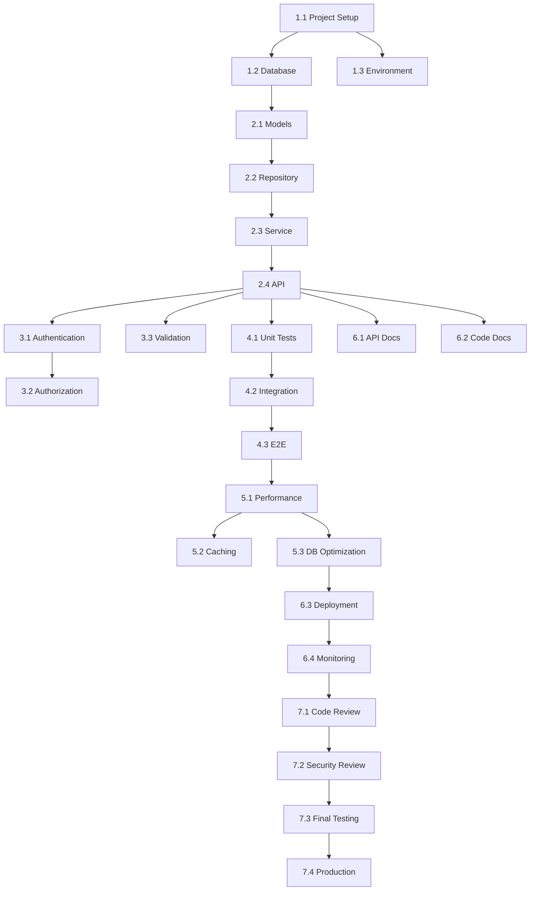

# Implementation Tasks - {FEATURE_NAME}

## Metadata

- **Feature Name**: {FEATURE_NAME}
- **Created**: {DATE}
- **Last Updated**: {DATE}
- **Status**: Not Started
- **Based on Design**: design.md v{VERSION}

## Task Overview

### Summary
<!-- Breve resumo das tarefas a serem executadas -->

### Total Tasks: {X}
### Estimated Time: {Y} hours
### Priority: High | Medium | Low

## Phase 1: Setup & Infrastructure

### 1.1 Project Setup
- [ ] **Task**: Configure project structure
  - **Estimated Time**: 1h
  - **Dependencies**: None
  - **Assignee**: TBD
  - **Description**: Create necessary directories and base files
  - **Acceptance Criteria**:
    - [ ] Directory structure matches design
    - [ ] Configuration files created
    - [ ] Dependencies installed

### 1.2 Database Setup
- [ ] **Task**: Create database schema
  - **Estimated Time**: 2h
  - **Dependencies**: 1.1
  - **Assignee**: TBD
  - **Description**: Implement database migrations
  - **Acceptance Criteria**:
    - [ ] Migration scripts created
    - [ ] Schema matches design document
    - [ ] Indexes created
    - [ ] Constraints applied

### 1.3 Environment Configuration
- [ ] **Task**: Setup environment variables
  - **Estimated Time**: 0.5h
  - **Dependencies**: 1.1
  - **Assignee**: TBD
  - **Description**: Configure .env files and environment-specific settings
  - **Acceptance Criteria**:
    - [ ] .env.example created
    - [ ] All required variables documented
    - [ ] Validation added

## Phase 2: Core Implementation

### 2.1 Data Models
- [ ] **Task**: Implement data models
  - **Estimated Time**: 3h
  - **Dependencies**: 1.2
  - **Assignee**: TBD
  - **Description**: Create models matching database schema
  - **Acceptance Criteria**:
    - [ ] All models created
    - [ ] Validation rules implemented
    - [ ] Relationships defined
    - [ ] Unit tests passing

### 2.2 Repository Layer
- [ ] **Task**: Implement repository pattern
  - **Estimated Time**: 4h
  - **Dependencies**: 2.1
  - **Assignee**: TBD
  - **Description**: Create repositories for data access
  - **Acceptance Criteria**:
    - [ ] CRUD operations implemented
    - [ ] Query methods created
    - [ ] Error handling added
    - [ ] Unit tests passing

### 2.3 Service Layer
- [ ] **Task**: Implement business logic
  - **Estimated Time**: 6h
  - **Dependencies**: 2.2
  - **Assignee**: TBD
  - **Description**: Create service layer with business rules
  - **Acceptance Criteria**:
    - [ ] All business rules implemented
    - [ ] Validation logic added
    - [ ] Error handling complete
    - [ ] Unit tests passing (>80% coverage)

### 2.4 API Endpoints
- [ ] **Task**: Implement API layer
  - **Estimated Time**: 5h
  - **Dependencies**: 2.3
  - **Assignee**: TBD
  - **Description**: Create REST API endpoints
  - **Acceptance Criteria**:
    - [ ] All endpoints implemented
    - [ ] Request validation added
    - [ ] Response formatting correct
    - [ ] API documentation updated

## Phase 3: Security & Validation

### 3.1 Authentication
- [ ] **Task**: Implement authentication
  - **Estimated Time**: 3h
  - **Dependencies**: 2.4
  - **Assignee**: TBD
  - **Description**: Add authentication middleware
  - **Acceptance Criteria**:
    - [ ] JWT/Session authentication working
    - [ ] Token validation implemented
    - [ ] Refresh token logic added
    - [ ] Security tests passing

### 3.2 Authorization
- [ ] **Task**: Implement authorization
  - **Estimated Time**: 3h
  - **Dependencies**: 3.1
  - **Assignee**: TBD
  - **Description**: Add role-based access control
  - **Acceptance Criteria**:
    - [ ] Permission checks implemented
    - [ ] Role validation working
    - [ ] Unauthorized access prevented
    - [ ] Authorization tests passing

### 3.3 Input Validation
- [ ] **Task**: Implement comprehensive validation
  - **Estimated Time**: 2h
  - **Dependencies**: 2.4
  - **Assignee**: TBD
  - **Description**: Add input validation and sanitization
  - **Acceptance Criteria**:
    - [ ] All inputs validated
    - [ ] XSS prevention implemented
    - [ ] SQL injection prevention verified
    - [ ] Validation tests passing

## Phase 4: Testing

### 4.1 Unit Tests
- [ ] **Task**: Write unit tests
  - **Estimated Time**: 4h
  - **Dependencies**: Phase 2 complete
  - **Assignee**: TBD
  - **Description**: Create comprehensive unit test suite
  - **Acceptance Criteria**:
    - [ ] All components tested
    - [ ] Coverage > 80%
    - [ ] Edge cases covered
    - [ ] All tests passing

### 4.2 Integration Tests
- [ ] **Task**: Write integration tests
  - **Estimated Time**: 4h
  - **Dependencies**: 4.1
  - **Assignee**: TBD
  - **Description**: Test component interactions
  - **Acceptance Criteria**:
    - [ ] API integration tests written
    - [ ] Database integration tests written
    - [ ] Error scenarios tested
    - [ ] All tests passing

### 4.3 E2E Tests
- [ ] **Task**: Write end-to-end tests
  - **Estimated Time**: 3h
  - **Dependencies**: 4.2
  - **Assignee**: TBD
  - **Description**: Test complete user flows
  - **Acceptance Criteria**:
    - [ ] Critical paths tested
    - [ ] User workflows verified
    - [ ] Error handling tested
    - [ ] All tests passing

## Phase 5: Performance & Optimization

### 5.1 Performance Testing
- [ ] **Task**: Conduct performance tests
  - **Estimated Time**: 2h
  - **Dependencies**: Phase 4 complete
  - **Assignee**: TBD
  - **Description**: Measure and optimize performance
  - **Acceptance Criteria**:
    - [ ] Load testing completed
    - [ ] Response times within SLA
    - [ ] Bottlenecks identified
    - [ ] Performance metrics documented

### 5.2 Caching Implementation
- [ ] **Task**: Implement caching strategy
  - **Estimated Time**: 3h
  - **Dependencies**: 5.1
  - **Assignee**: TBD
  - **Description**: Add caching where appropriate
  - **Acceptance Criteria**:
    - [ ] Cache layer implemented
    - [ ] Cache invalidation working
    - [ ] Performance improved
    - [ ] Cache tests passing

### 5.3 Database Optimization
- [ ] **Task**: Optimize database queries
  - **Estimated Time**: 2h
  - **Dependencies**: 5.1
  - **Assignee**: TBD
  - **Description**: Optimize slow queries and add indexes
  - **Acceptance Criteria**:
    - [ ] Slow queries identified
    - [ ] Indexes optimized
    - [ ] Query performance improved
    - [ ] Execution plans reviewed

## Phase 6: Documentation & Deployment

### 6.1 API Documentation
- [ ] **Task**: Complete API documentation
  - **Estimated Time**: 2h
  - **Dependencies**: Phase 2 complete
  - **Assignee**: TBD
  - **Description**: Document all API endpoints
  - **Acceptance Criteria**:
    - [ ] OpenAPI/Swagger docs complete
    - [ ] Examples provided
    - [ ] Error codes documented
    - [ ] Authentication documented

### 6.2 Code Documentation
- [ ] **Task**: Add code comments and docs
  - **Estimated Time**: 2h
  - **Dependencies**: Phase 2 complete
  - **Assignee**: TBD
  - **Description**: Document code and architecture
  - **Acceptance Criteria**:
    - [ ] JSDoc comments added
    - [ ] Complex logic explained
    - [ ] Architecture documented
    - [ ] README updated

### 6.3 Deployment Setup
- [ ] **Task**: Configure deployment pipeline
  - **Estimated Time**: 3h
  - **Dependencies**: Phase 5 complete
  - **Assignee**: TBD
  - **Description**: Setup CI/CD and deployment
  - **Acceptance Criteria**:
    - [ ] CI/CD pipeline configured
    - [ ] Deployment scripts created
    - [ ] Environment configs set
    - [ ] Rollback plan documented

### 6.4 Monitoring Setup
- [ ] **Task**: Implement monitoring
  - **Estimated Time**: 2h
  - **Dependencies**: 6.3
  - **Assignee**: TBD
  - **Description**: Add logging and monitoring
  - **Acceptance Criteria**:
    - [ ] Logging implemented
    - [ ] Metrics collection setup
    - [ ] Alerts configured
    - [ ] Dashboards created

## Phase 7: Review & Launch

### 7.1 Code Review
- [ ] **Task**: Conduct code review
  - **Estimated Time**: 2h
  - **Dependencies**: All phases complete
  - **Assignee**: TBD
  - **Description**: Review all code changes
  - **Acceptance Criteria**:
    - [ ] Code review completed
    - [ ] All feedback addressed
    - [ ] Code standards met
    - [ ] No critical issues

### 7.2 Security Review
- [ ] **Task**: Security audit
  - **Estimated Time**: 2h
  - **Dependencies**: 7.1
  - **Assignee**: TBD
  - **Description**: Security review and vulnerability scan
  - **Acceptance Criteria**:
    - [ ] Security scan completed
    - [ ] Vulnerabilities addressed
    - [ ] Security best practices verified
    - [ ] Penetration testing passed

### 7.3 Final Testing
- [ ] **Task**: Final QA testing
  - **Estimated Time**: 3h
  - **Dependencies**: 7.2
  - **Assignee**: TBD
  - **Description**: Complete final testing round
  - **Acceptance Criteria**:
    - [ ] All tests passing
    - [ ] No critical bugs
    - [ ] Performance verified
    - [ ] User acceptance complete

### 7.4 Production Deployment
- [ ] **Task**: Deploy to production
  - **Estimated Time**: 1h
  - **Dependencies**: 7.3
  - **Assignee**: TBD
  - **Description**: Production deployment
  - **Acceptance Criteria**:
    - [ ] Deployed successfully
    - [ ] Smoke tests passing
    - [ ] Monitoring active
    - [ ] Rollback plan ready

## Task Dependencies

## Risk Management

### High-Risk Tasks
1. **Task 2.3** (Service Layer): Complex business logic
   - **Mitigation**: Thorough unit testing, peer review
2. **Task 6.3** (Deployment): Production deployment risks
   - **Mitigation**: Staged rollout, comprehensive testing

### Blocked Tasks
<!-- List any tasks that are currently blocked and why -->

## Notes

- Tasks can be executed in parallel where dependencies allow
- Each task should have its own branch following: `feature/{feature-name}/task-{number}`
- All tests must pass before marking task complete
- Update this document as tasks are completed

## Progress Tracking

- **Total Tasks**: {X}
- **Completed**: 0
- **In Progress**: 0
- **Blocked**: 0
- **Not Started**: {X}
- **Progress**: 0%

---

**Last Updated**: {DATE}
**Next Review**: {DATE}
