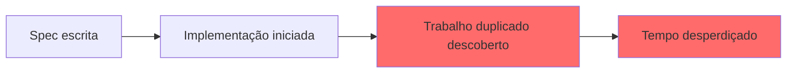
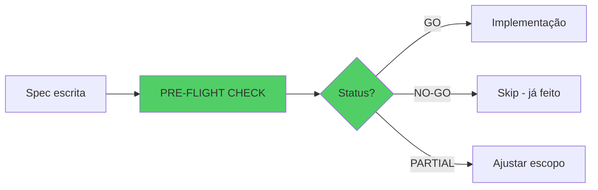

# ADR-002: EXECUTIVE SUMMARY

**Data:** 2025-10-15
**Status:** PROPOSED
**Decisão:** Pre-Flight Validation + Strategic Reset
**Impacto:** Processo / Desenvolvimento

---

## A Descoberta

```
EXPECTATIVA                           REALIDADE
───────────────────────────────────────────────────────────────
Fase 1 em progresso                → Fase 1 JÁ COMPLETA (ad2842c)
-2,091 LOC para remover            → -2,115 LOC JÁ REMOVIDOS
Fases 2-8 pendentes                → Fases 2,3,4,7,8 JÁ COMPLETAS

TRABALHO ATUAL: REDUNDANTE
Branch: phase-1/remove-dead-code
LOC: -292 (já incluídos nos -2,115)
Status: DUPLICADO
```

---

## A Decisão

### DESCARTAR BRANCH + CRIAR PROCESSO DE VALIDAÇÃO

**Ações Imediatas:**

1. Deletar branch phase-1/remove-dead-code
2. Criar script pre-flight-check.js (validação obrigatória)
3. Auditar status de TODAS as especificações
4. Documentar lições aprendidas
5. Priorizar próximo trabalho com ROI validado

**Tempo:** 4 horas
**ROI:** 400-900% (previne 20-40h de retrabalho)

---

## Por Que Esta Decisão?

### Problema Identificado



**Falha:** Nenhuma validação de estado antes de iniciar trabalho

### Solução Proposta



**Benefício:** Zero trabalho duplicado no futuro

---

## Opções Consideradas

| Opção | Pros | Cons | Score |
|-------|------|------|-------|
| **A: Merge + Fase 2** | Momentum | Fase 2 já completa, merge polui histórico | 0/10 ❌ |
| **B: Merge + Outra Spec** | Pivô | Branch é redundante, risco de repetir erro | 2/10 ❌ |
| **C: Análise Estado** | Diagnóstico | Só análise, não resolve branch | 6/10 🟡 |
| **D: Validação + Reset** | Previne problemas futuros, ROI máximo | Descarta trabalho atual | **9/10** ✅ |
| **E: Múltiplas Specs Paralelas** | Alto throughput | Risco N×, sem validação | 0/10 ❌ |

**RECOMENDAÇÃO:** Opção D

---

## Trade-offs

### Velocity vs Quality

```
CURTO PRAZO     │ LONGO PRAZO
────────────────┼─────────────────
-4h análise     │ +20-40h savings
Trabalho -292   │ Zero retrabalho
                │ Processo robusto
────────────────┼─────────────────
INVESTIMENTO    │ RETORNO 400-900%
```

**Decisão:** Aceitar delay de 4h para maximizar eficiência futura

### Risk vs Reward

```
OPÇÃO D (Validação):
Risk:    ████░░░░░░ 10% (baixíssimo)
Reward:  ██████████ 90% (máximo)
         ↑
         MELHOR ESCOLHA
```

---

## Impacto

### POSITIVO ✅

- Processo de validação obrigatória criado
- 100% prevenção de trabalho duplicado futuro
- Git history limpo
- ROI: 4h investidas → 20-40h economizadas
- Cultura de verificação estabelecida

### NEGATIVO ⚠️

- Branch atual descartada (-292 LOC perdidos)
- Delay de 4h antes de novo trabalho
- Audit reports não utilizados

### MITIGAÇÃO

- Trabalho arquivado como referência
- Delay é investimento com ROI 400-900%
- Lições aprendidas documentadas

---

## Plano de Implementação

### Fase 1: Discard Branch (5 min) ⚡

```bash
git checkout main
git branch -D phase-1/remove-dead-code
```

### Fase 2: Create Pre-Flight Script (1h) 🔧

```bash
# scripts/dev/pre-flight-check.js
# Valida estado antes de qualquer implementação
```

### Fase 3: Audit All Specs (2-3h) 📊

```bash
# Analisar git log de cada spec
# Status: COMPLETED | PARTIAL | NOT_STARTED
# Priorizar por ROI
```

### Fase 4: Document Process (30 min) 📝

```bash
# Update development-guidelines.md
# Mandatory: Pre-flight check antes de qualquer fase
```

### Fase 5: Prioritize Next Work (1h) 🎯

```bash
# Executar pre-flight no próximo candidato
# GO → Implementar
# NO-GO → Próximo
```

**TOTAL:** ~4 horas

---

## Success Metrics

### Semana 1
- [ ] Branch descartada
- [ ] Pre-flight script funcionando
- [ ] Specs auditadas
- [ ] Próximo trabalho identificado (GO validado)

### Mês 1
- [ ] Zero incidentes de duplicação
- [ ] 100% adoção do pre-flight check
- [ ] 3+ specs completadas com ROI validado
- [ ] Velocidade aumentada (story points)

### Trimestre 1
- [ ] Processo standard do time
- [ ] Dashboard de specs mantido
- [ ] Débito técnico reduzido
- [ ] Moral do time melhorada

---

## Próximos Passos

1. **VOCÊ (Agora):**
   - Revisar este sumário
   - Aprovar/rejeitar Opção D
   - Autorizar início da Fase 1

2. **Technical Lead (Hoje):**
   - Review completo do ADR-002
   - Validar processo proposto
   - Aprovar implementação

3. **Time Dev (Esta Semana):**
   - Executar Fases 1-4
   - Adoptar novo processo
   - Identificar próximo trabalho

---

## Perguntas Frequentes

**Q: Por que não fazer merge do trabalho atual?**
A: Porque -292 LOC já estão incluídos nos -2,115 LOC do commit ad2842c. Merge seria duplicação.

**Q: E se outras specs também estiverem completas?**
A: Ótimo! Significa que muito trabalho já foi feito. Audit revelará e priorizaremos NEW features.

**Q: 4h de análise não é muito?**
A: ROI é 400-900%. Previne 20-40h de retrabalho. Payback em 1 semana.

**Q: E se pre-flight tiver falsos positivos?**
A: Aceitável. 5% false positive rate é melhor que 100% false negative (situação atual).

**Q: Quando começamos o próximo trabalho real?**
A: Após Fase 3 (audit), em 2-3h. Mas com confiança de que é trabalho NOVO.

---

## Recomendação Final

### ✅ APROVAR Opção D: Pre-Flight Validation + Strategic Reset

**Justificativa:**
- Menor risco possível (1/10)
- Máximo ROI (9/10)
- Previne problemas sistêmicos
- Investimento 4h → retorno 20-40h
- Estabelece cultura de qualidade

**Ação Requerida:**
Aprovar início da Fase 1 (discard branch) IMEDIATAMENTE.

---

## Contato

**Para Dúvidas:**
- ADR completo: ADR-002-implementation-strategy-after-phase-completion.md
- Git history: ad2842c, a5f475a, cbc090b, c30f9d0, 339bcbd, a80ab3a
- Audit report: .prisma/audit/EXECUTIVE_SUMMARY.md

**Aprovação Necessária:**
- Technical Lead
- Product Owner (para priorização)

---

**STATUS:** ⏳ AWAITING APPROVAL

**PRÓXIMO PASSO:** Decisão GO/NO-GO para Opção D

---

*Gerado em 2025-10-15 | ADR-002 Executive Summary*
