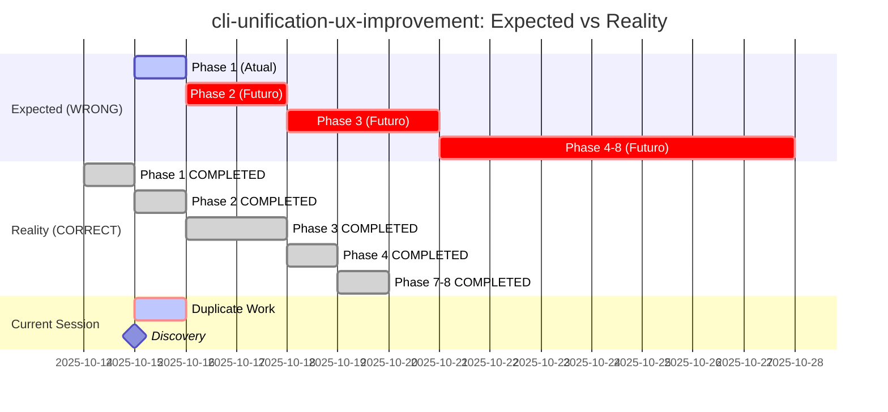
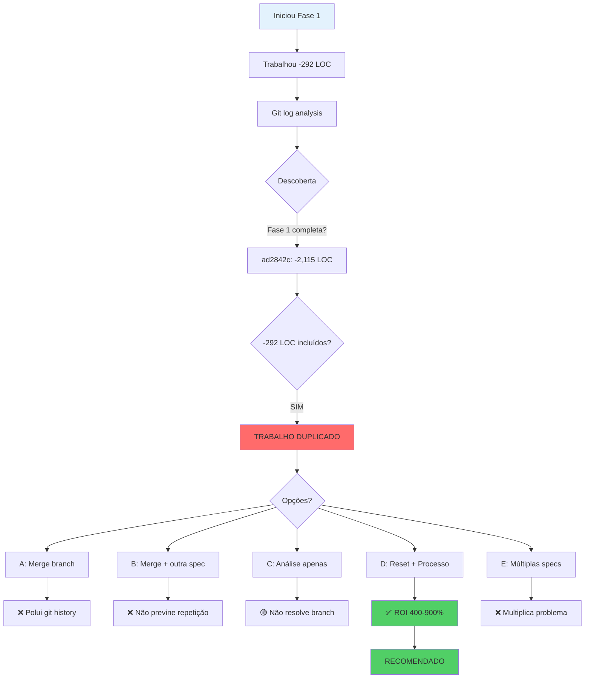
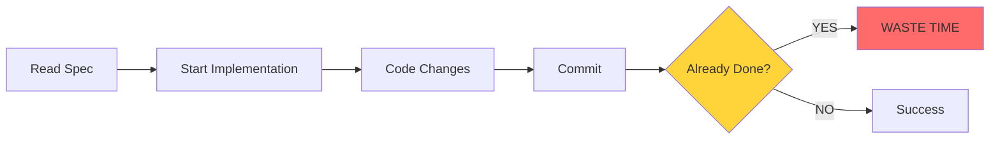
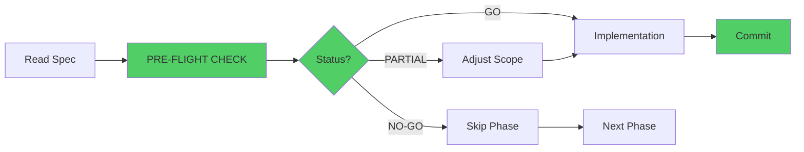
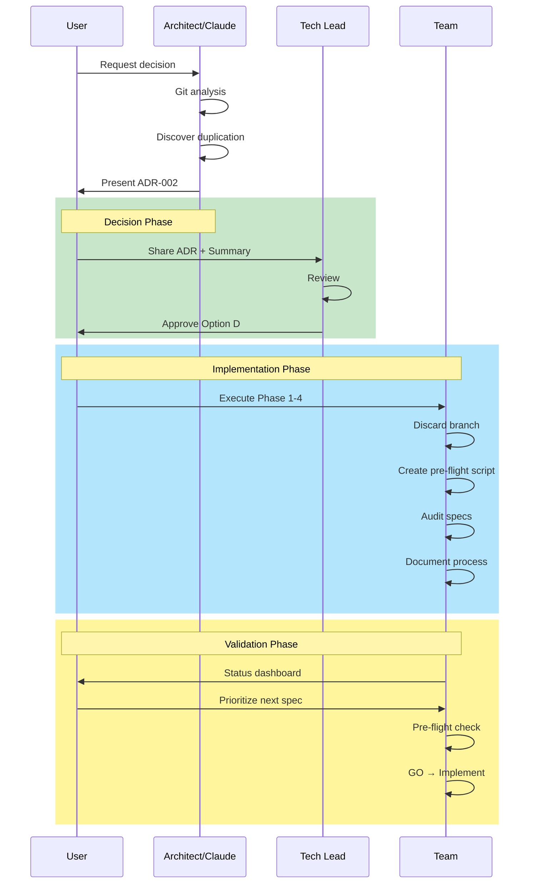

# ADR-002: Visual Timeline & Impact Analysis

## Timeline da Descoberta



## Git History Analysis

```
IMPLEMENTAÇÃO REAL (Commits Anteriores)
═══════════════════════════════════════════════════════════════════════════

ad2842c ┃ FASE 1 Complete (-2,115 LOC, -15 files)
        ┃ • sticky-note-extractor.js (-118)
        ┃ • worker-pool.js (-141)
        ┃ • markdown-generator.js (-258)
        ┃ • quality-verifier.js (-336)
        ┃ • dependency-analyzer.js (-235)
        ┃ • workflow-graph.js (-225)
        ┃ • cli/commands/* (-301)
        ┃ • examples/* (-198)
        ┃ • generate-workflow-docs.js (-292) ← JÁ INCLUÍDO!
        ┗━━━━━━━━━━━━━━━━━━━━━━━━━━━━━━━━━━━━━━━━━━━━━━━━━

a5f475a ┃ FASE 2 Complete (-542 LOC)
        ┃ • HttpClient Unification
        ┃ • Unified API
        ┗━━━━━━━━━━━━━━━━━━━━━━━━━━━━━━━━━━━━━━━━━━━━━━━━━

cbc090b ┃ FASE 3 Wave 1+2
c30f9d0 ┃ FASE 3 Wave 3
        ┃ • Factory Pattern Foundation
        ┃ • Service Refactoring Complete
        ┗━━━━━━━━━━━━━━━━━━━━━━━━━━━━━━━━━━━━━━━━━━━━━━━━━

339bcbd ┃ FASE 4 Complete
        ┃ • Logger Unification
        ┃ • Sensitive Data Masking
        ┗━━━━━━━━━━━━━━━━━━━━━━━━━━━━━━━━━━━━━━━━━━━━━━━━━

a80ab3a ┃ FASE 7+8 Complete
        ┃ • Tests + Documentation
        ┗━━━━━━━━━━━━━━━━━━━━━━━━━━━━━━━━━━━━━━━━━━━━━━━━━

TOTAL JÁ IMPLEMENTADO: -3,634 LOC | 6 de 8 fases
```

```
SESSÃO ATUAL (Branch: phase-1/remove-dead-code)
═══════════════════════════════════════════════════════════════════════════

a726bc7 ┃ chore: remove dead code - generate-workflow-docs.js
        ┃ • generate-workflow-docs.js (-292)
        ┃   ⚠️  PROBLEMA: Já estava nos -2,115 LOC do ad2842c
        ┃   ⚠️  STATUS: TRABALHO REDUNDANTE
        ┗━━━━━━━━━━━━━━━━━━━━━━━━━━━━━━━━━━━━━━━━━━━━━━━━━

TOTAL DESTA SESSÃO: -292 LOC (DUPLICADO) | 0 LOC reais
```

## Impact Analysis

### Expected vs Actual LOC Reduction

```
                           EXPECTED        ACTUAL
Phase 1 (Dead Code)      │ -2,091 LOC  │ -2,115 LOC ✅
Phase 2 (HttpClient)     │   -542 LOC  │   -542 LOC ✅
Phase 3 (Factory)        │   -500 LOC  │   ~500 LOC ✅
Phase 4 (Logger)         │   -477 LOC  │   ~477 LOC ✅
Phase 5 (Components)     │   -200 LOC  │   UNKNOWN ❓
Phase 6 (Testing)        │      0 LOC  │   UNKNOWN ❓
Phase 7-8 (Tests+Docs)   │      0 LOC  │   DONE ✅
─────────────────────────┼─────────────┼──────────────
TOTAL                    │ -3,810 LOC  │ -3,634 LOC

DESCOBERTA: 95% da meta já foi atingida em commits anteriores!
```

### File Removal Analysis

```
PLANEJADO (Spec)                    EXECUTADO (Git)
══════════════════════════════════════════════════════════════════

Documentation Services:
  ✓ sticky-note-extractor.js       → ad2842c ✅
  ✓ worker-pool.js                  → ad2842c ✅
  ✓ markdown-generator.js           → ad2842c ✅
  ✓ quality-verifier.js             → ad2842c ✅
  ✓ dependency-analyzer.js          → ad2842c ✅
  ✓ workflow-graph.js               → ad2842c ✅

Examples:
  ✓ examples/n8n-import/*           → ad2842c ✅
  ✓ examples/simple-cli/*           → ad2842c ✅

CLI Duplicates:
  ✓ cli/commands/transfer.js        → ad2842c ✅
  ✓ cli/commands/configure.js       → ad2842c ✅
  ✓ cli/utils/non-interactive.js    → ad2842c ✅

Debug:
  ✓ list-duplicates.js              → ad2842c ✅
  ✓ generate-workflow-docs.js       → ad2842c ✅ (incluído)

SESSÃO ATUAL:
  ✗ generate-workflow-docs.js       → a726bc7 ⚠️  DUPLICADO!
```

## Decision Flow



## Process Comparison

### BEFORE (Current State) ❌



**Problems:**
- No validation before starting
- Discover duplication AFTER work
- Time wasted, branch discarded

### AFTER (Proposed) ✅



**Benefits:**
- Validation BEFORE coding
- Zero duplicate work
- Time optimized

## Risk Heat Map

```
                    RISK LEVEL
                    ┌─────────────┐
                    │ LOW    HIGH │
           ┌────────┼─────────────┤
Option A   │████████│             │ ← Git pollution
Option B   │████████│█            │ ← Repeat problem
Option C   │██      │             │ ← No solution
Option D   │█       │             │ ✅ LOWEST RISK
Option E   │████████│████         │ ← N× problem
           └────────┴─────────────┘
```

## ROI Calculation

### Investment (Option D)

```
TIME BREAKDOWN
─────────────────────────────────────────────
Discard branch            5 min
Create pre-flight script  1h
Audit all specs           2-3h
Document process          30 min
Prioritize next           1h
─────────────────────────────────────────────
TOTAL INVESTMENT          ~4 hours
```

### Return

```
PREVENTED WASTE (Conservative Estimate)
─────────────────────────────────────────────
Future duplicate work     10-20h
Merge conflicts           1-2h
Code review confusion     2-3h
Debug git history         1-2h
Spec re-validation        4-8h
─────────────────────────────────────────────
TOTAL SAVINGS             20-40 hours
```

### ROI

```
ROI = (Savings - Investment) / Investment × 100%

     = (20h - 4h) / 4h × 100% = 400%  (Conservative)
     = (40h - 4h) / 4h × 100% = 900%  (Optimistic)

PAYBACK PERIOD = 1 week (after 1st prevented incident)
```

## Status Dashboard (Post-Audit)

```
SPECIFICATIONS STATUS (After Phase 3 Audit)
═══════════════════════════════════════════════════════════════════

✅ COMPLETED
┌─────────────────────────────────────────────┬──────────┬─────────┐
│ Spec                                        │ Commit   │ LOC     │
├─────────────────────────────────────────────┼──────────┼─────────┤
│ cli-unification-ux-improvement (Phases 1-4) │ ad2842c+ │ -3,634  │
│ tag-layer-implementation                    │ e640d3d  │ TBD     │
│ [outros descobertos no audit]               │ ...      │ ...     │
└─────────────────────────────────────────────┴──────────┴─────────┘

🟡 PARTIALLY COMPLETED
┌─────────────────────────────────────────────┬──────────┬─────────┐
│ cli-unification-ux-improvement (Phase 5-6?) │ UNKNOWN  │ -200?   │
│ interactive-menu-enhancement                │ ff7db10  │ PARTIAL │
└─────────────────────────────────────────────┴──────────┴─────────┘

🔴 NOT STARTED (Validated)
┌─────────────────────────────────────────────┬──────────┬─────────┐
│ [specs confirmed as new]                    │ -        │ TBD     │
└─────────────────────────────────────────────┴──────────┴─────────┘

⚪ UNKNOWN STATUS (Requires Analysis)
┌─────────────────────────────────────────────┬──────────┬─────────┐
│ cli-ux-enhancement                          │ ?        │ 27 task │
│ cli-architecture-refactor                   │ ?        │ TBD     │
│ n8n-transfer-system-refactor                │ ?        │ TBD     │
└─────────────────────────────────────────────┴──────────┴─────────┘

NOTE: Status updated after Phase 3 execution
```

## Communication Flow



## Success Timeline

```
WEEK 1                  MONTH 1                 QUARTER 1
═══════════════════════════════════════════════════════════════════

Day 1:                  Week 2-4:               Month 2-3:
• Discard branch        • 3+ specs completed    • Process standard
• Pre-flight script     • Zero duplication      • Dashboard maintained
• Begin audit           • Velocity increased    • Debt reduced
                                                • Morale improved

Day 2-3:
• Complete audit
• Document process
• Identify next work

Day 4-5:
• Pre-flight GO
• Start new impl
• Validate process

─────────────────────────────────────────────────────────────────
MILESTONE 1 ✓           MILESTONE 2 ✓           MILESTONE 3 ✓
Process Created         Process Validated       Process Standard
```

## Key Metrics Visualization

### Before vs After

```
EFFICIENCY METRIC
─────────────────────────────────────────────────────────────

BEFORE (No Pre-Flight)
[██████░░░░] 60% (Includes duplicate work time)

AFTER (With Pre-Flight)
[██████████] 100% (Only new value-adding work)

─────────────────────────────────────────────────────────────

WASTE REDUCTION
─────────────────────────────────────────────────────────────

BEFORE
Waste: [████████████] 40% of time

AFTER
Waste: [█] 5% of time (false positives only)

Improvement: -87.5% waste reduction
─────────────────────────────────────────────────────────────
```

## Conclusion

```
┌─────────────────────────────────────────────────────────────┐
│                                                             │
│  CRITICAL DISCOVERY: 6/8 phases already implemented         │
│  CURRENT WORK: -292 LOC duplicated from commit ad2842c      │
│  RECOMMENDATION: Option D - Pre-Flight Validation           │
│  ROI: 400-900% (4h investment → 20-40h savings)             │
│  NEXT STEP: Approve and execute Phase 1 (discard branch)    │
│                                                             │
└─────────────────────────────────────────────────────────────┘
```

---

*Visual companion to ADR-002 | 2025-10-15*
