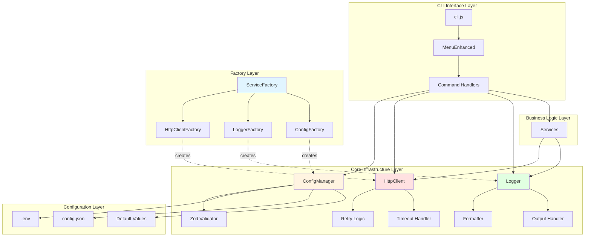
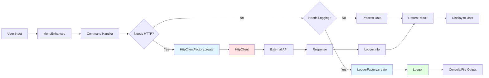
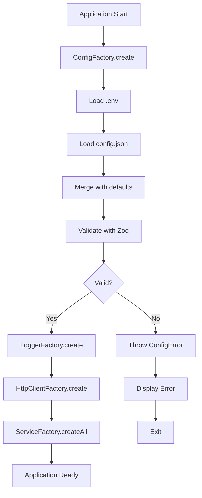
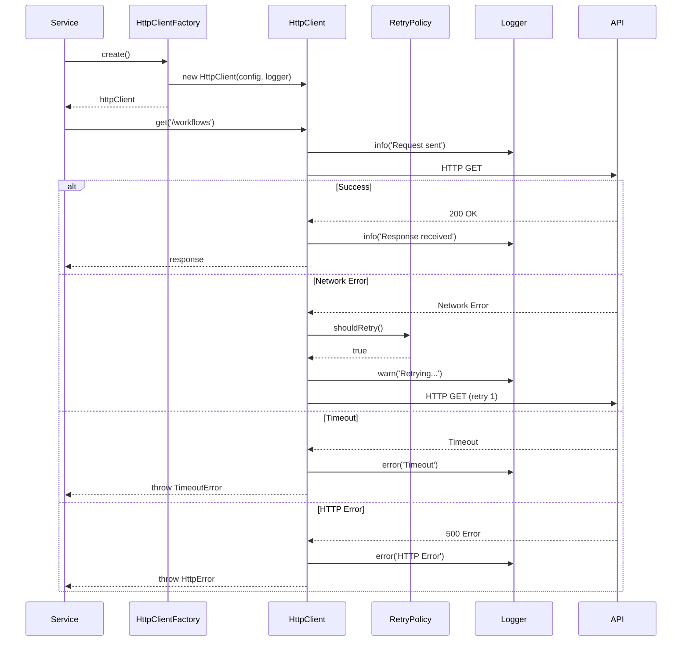
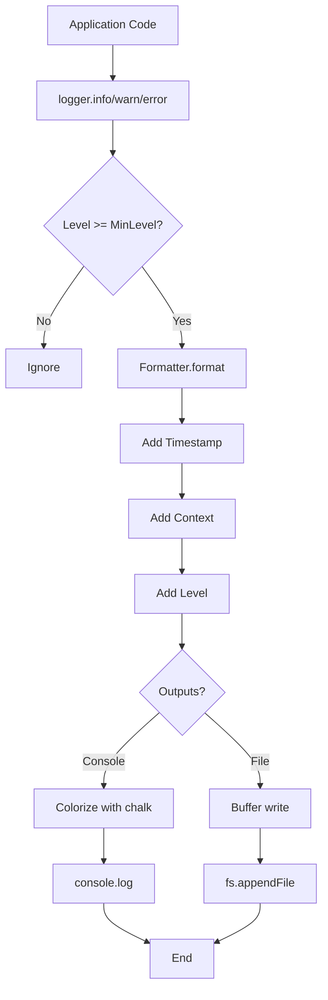
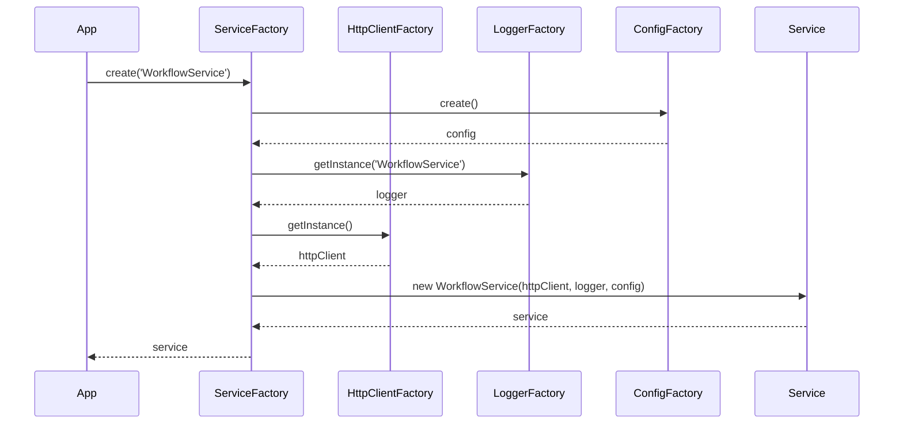
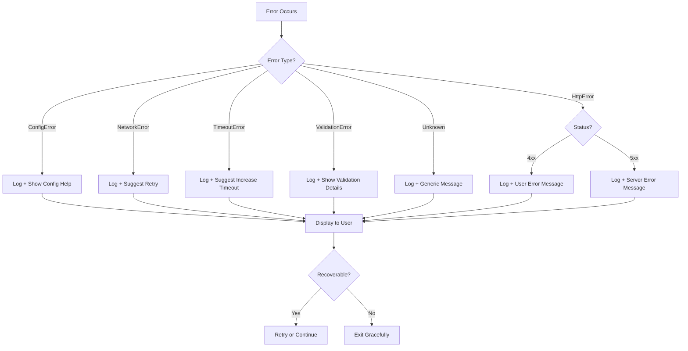

# Design Document: CLI Unification & UX Improvement

**Feature:** cli-unification-ux-improvement
**Criado:** 2025-10-15
**Status:** Draft
**Prioridade:** ALTA

---

## Overview

Este documento detalha o design arquitetural para a unificação e melhoria da arquitetura CLI do projeto docs-jana. A refatoração será executada em 4 fases progressivas, resultando em uma redução de ~23% da base de código (de ~22.000 LOC para ~16.800 LOC).

### Objetivos do Design

1. **Eliminação de Código Morto**: Remover 2.091 LOC de código não utilizado identificado pela auditoria
2. **Unificação de HttpClient**: Consolidar 2 implementações duplicadas (-792 LOC) em um único componente robusto
3. **Unificação de Logger**: Consolidar 2 implementações duplicadas (-827 LOC) em um único componente consistente
4. **Factory Pattern Correto**: Corrigir 33 violações do padrão Factory com implementação adequada
5. **Eliminação de Hardcoded Values**: Centralizar 67 valores hardcoded em ConfigManager
6. **UX Consistente**: Melhorar experiência do usuário com menus e mensagens padronizadas

### Escopo

**In Scope:**
- Remoção de 8 arquivos de código morto (Fase 1)
- Criação de HttpClient unificado com Factory (Fase 2)
- Implementação de Factory Pattern correto (Fase 3)
- Criação de Logger unificado com Factory (Fase 4)
- ConfigManager centralizado para eliminação de hardcoded values
- MenuEnhanced consolidado para UX consistente
- Migração progressiva e segura em 4 fases
- Testes unitários e de integração para todos os componentes
- Documentação completa da arquitetura

**Out of Scope:**
- Alterações em funcionalidades de negócio
- Mudanças em APIs externas do CLI
- Refatoração completa de testes (apenas adaptação)
- Alterações em dependências externas (npm packages)

### Princípios Arquiteturais

1. **Single Responsibility Principle (SRP)**: Cada componente tem uma única responsabilidade bem definida
2. **Dependency Injection (DI)**: Dependências injetadas via Factory Pattern
3. **Open/Closed Principle**: Componentes abertos para extensão, fechados para modificação
4. **Testability First**: Design que facilita testes unitários e de integração
5. **Zero Breaking Changes**: Migração transparente sem quebra de compatibilidade
6. **Progressive Enhancement**: Implementação em fases incrementais e seguras

---

## Architecture Design

### System Architecture Diagram



### Data Flow Diagram



### Directory Structure

```
docs-jana/
├── src/
│   ├── core/
│   │   ├── http/
│   │   │   ├── http-client.js          # HttpClient unificado
│   │   │   ├── http-client.test.js
│   │   │   ├── retry-policy.js
│   │   │   └── timeout-handler.js
│   │   ├── logging/
│   │   │   ├── logger.js               # Logger unificado
│   │   │   ├── logger.test.js
│   │   │   ├── formatter.js
│   │   │   └── log-levels.js
│   │   ├── config/
│   │   │   ├── config-manager.js       # ConfigManager centralizado
│   │   │   ├── config-manager.test.js
│   │   │   └── config-schema.js        # Zod schemas
│   │   └── factories/
│   │       ├── http-client-factory.js
│   │       ├── logger-factory.js
│   │       ├── service-factory.js
│   │       └── factory-registry.js     # Registry pattern
│   ├── ui/
│   │   ├── menu-enhanced.js            # MenuEnhanced consolidado
│   │   ├── menu-enhanced.test.js
│   │   └── menu-styles.js
│   └── services/
│       └── [existing services...]
├── .env.example                         # Configuração documentada
└── config.json.example
```

---

## Component Design

### 1. HttpClient Unificado

#### Responsabilidades

- Realizar requisições HTTP (GET, POST, PUT, DELETE, PATCH)
- Gerenciar timeouts configuráveis
- Implementar retry logic com exponential backoff
- Adicionar headers padrão e customizados
- Logar requests e responses via Logger unificado
- Tratar erros de rede e HTTP de forma consistente

#### Interfaces

```typescript
// src/core/http/http-client.js

interface HttpClientConfig {
  baseURL?: string;
  timeout?: number;           // ms, default: 30000
  maxRetries?: number;        // default: 3
  retryDelay?: number;        // ms, default: 1000
  headers?: Record<string, string>;
  logger?: Logger;
}

interface HttpResponse<T = any> {
  status: number;
  statusText: string;
  headers: Record<string, string>;
  data: T;
}

interface HttpError extends Error {
  status?: number;
  response?: HttpResponse;
  isNetworkError: boolean;
  isTimeout: boolean;
}

class HttpClient {
  constructor(config: HttpClientConfig);

  // HTTP Methods
  async get<T>(url: string, options?: RequestOptions): Promise<HttpResponse<T>>;
  async post<T>(url: string, data?: any, options?: RequestOptions): Promise<HttpResponse<T>>;
  async put<T>(url: string, data?: any, options?: RequestOptions): Promise<HttpResponse<T>>;
  async delete<T>(url: string, options?: RequestOptions): Promise<HttpResponse<T>>;
  async patch<T>(url: string, data?: any, options?: RequestOptions): Promise<HttpResponse<T>>;

  // Request interceptors
  addRequestInterceptor(fn: (config: RequestConfig) => RequestConfig): void;
  addResponseInterceptor(fn: (response: HttpResponse) => HttpResponse): void;

  // Configuration
  setBaseURL(url: string): void;
  setDefaultHeaders(headers: Record<string, string>): void;
  setTimeout(ms: number): void;
}
```

#### Dependências

- **Logger**: Para logging de requests/responses
- **ConfigManager**: Para configuração de timeout, retries, baseURL
- **Native fetch API** ou **axios** (a decidir durante implementação)

#### Exemplo de Uso

```javascript
const { HttpClientFactory } = require('./src/core/factories/http-client-factory');

// Criação via Factory (injeção de dependências)
const httpClient = HttpClientFactory.create({
  baseURL: 'https://api.example.com',
  timeout: 10000,
  maxRetries: 3
});

// Uso
try {
  const response = await httpClient.get('/users/123');
  console.log(response.data);
} catch (error) {
  if (error.isTimeout) {
    console.error('Request timeout');
  } else if (error.isNetworkError) {
    console.error('Network error');
  } else {
    console.error(`HTTP ${error.status}: ${error.message}`);
  }
}
```

---

### 2. Logger Unificado

#### Responsabilidades

- Logar mensagens em diferentes níveis (DEBUG, INFO, WARN, ERROR)
- Formatar mensagens com timestamp, nível e contexto
- Suportar output para console e arquivo
- Colorizar mensagens no console (via chalk)
- Incluir stack traces para erros
- Permitir filtragem por nível de log
- Suportar contexto/categoria opcional

#### Interfaces

```typescript
// src/core/logging/logger.js

enum LogLevel {
  DEBUG = 0,
  INFO = 1,
  WARN = 2,
  ERROR = 3
}

interface LoggerConfig {
  level?: LogLevel;           // Nível mínimo, default: INFO
  outputs?: LogOutput[];      // console, file, custom
  colorize?: boolean;         // default: true (console only)
  includeTimestamp?: boolean; // default: true
  includeContext?: boolean;   // default: true
  fileOutput?: string;        // caminho do arquivo de log
}

interface LogEntry {
  timestamp: string;          // ISO 8601
  level: LogLevel;
  context?: string;
  message: string;
  data?: any;
  stack?: string;
}

class Logger {
  constructor(config: LoggerConfig);

  // Logging methods
  debug(message: string, data?: any, context?: string): void;
  info(message: string, data?: any, context?: string): void;
  warn(message: string, data?: any, context?: string): void;
  error(message: string, error?: Error | any, context?: string): void;

  // Configuration
  setLevel(level: LogLevel): void;
  addOutput(output: LogOutput): void;
  setContext(context: string): Logger; // Returns new logger with context

  // Utility
  child(context: string): Logger; // Create child logger with inherited config
}
```

#### Dependências

- **ConfigManager**: Para configuração de nível, outputs
- **chalk**: Para colorização de console
- **fs/promises**: Para escrita em arquivo

#### Exemplo de Uso

```javascript
const { LoggerFactory } = require('./src/core/factories/logger-factory');

// Criação via Factory
const logger = LoggerFactory.create({
  level: LogLevel.INFO,
  colorize: true
});

// Uso básico
logger.info('Application started');
logger.warn('Configuration not found, using defaults');
logger.error('Failed to connect to database', error);

// Com contexto
const httpLogger = logger.child('HTTP');
httpLogger.debug('Request sent', { url: '/api/users' });
httpLogger.info('Response received', { status: 200 });

// Output formatado:
// [2025-10-15T10:30:45.123Z] [INFO] Application started
// [2025-10-15T10:30:45.456Z] [WARN] Configuration not found, using defaults
// [2025-10-15T10:30:45.789Z] [ERROR] Failed to connect to database
//   Error: Connection refused
//     at Connection.connect (...)
// [2025-10-15T10:30:46.012Z] [HTTP] [DEBUG] Request sent { url: '/api/users' }
// [2025-10-15T10:30:46.345Z] [HTTP] [INFO] Response received { status: 200 }
```

---

### 3. ConfigManager Centralizado

#### Responsabilidades

- Carregar configuração de múltiplas fontes (.env, config.json, defaults)
- Validar configuração com Zod schemas
- Fornecer API type-safe para acesso a configuração
- Suportar environment-specific configs (dev, prod, test)
- Permitir override de configuração via variáveis de ambiente
- Detectar e reportar configurações inválidas ou faltantes

#### Interfaces

```typescript
// src/core/config/config-manager.js

interface ConfigSource {
  name: string;
  load(): Promise<Record<string, any>>;
  priority: number; // Higher = higher priority
}

interface ConfigSchema {
  http: {
    baseURL: string;
    timeout: number;
    maxRetries: number;
    retryDelay: number;
  };
  logging: {
    level: LogLevel;
    fileOutput?: string;
    colorize: boolean;
  };
  n8n: {
    apiUrl: string;
    apiKey?: string;
  };
  // ... outras configurações
}

class ConfigManager {
  constructor(sources: ConfigSource[]);

  // Load and validate
  async load(): Promise<void>;
  validate(): ValidationResult;

  // Getters (type-safe)
  get<K extends keyof ConfigSchema>(key: K): ConfigSchema[K];
  getString(key: string, defaultValue?: string): string;
  getNumber(key: string, defaultValue?: number): number;
  getBoolean(key: string, defaultValue?: boolean): boolean;

  // Utility
  has(key: string): boolean;
  getAll(): ConfigSchema;
  reload(): Promise<void>;
}
```

#### Dependências

- **Zod**: Para validação de schemas
- **dotenv**: Para parsing de .env
- **fs/promises**: Para leitura de arquivos

#### Configuração Default

```javascript
// src/core/config/default-config.js

module.exports = {
  http: {
    baseURL: '',
    timeout: 30000,
    maxRetries: 3,
    retryDelay: 1000
  },
  logging: {
    level: 'INFO',
    colorize: true,
    includeTimestamp: true
  },
  n8n: {
    apiUrl: process.env.N8N_API_URL || '',
    apiKey: process.env.N8N_API_KEY || ''
  }
};
```

#### Validação com Zod

```javascript
// src/core/config/config-schema.js

const { z } = require('zod');

const ConfigSchema = z.object({
  http: z.object({
    baseURL: z.string().url().optional().default(''),
    timeout: z.number().min(1000).max(300000).default(30000),
    maxRetries: z.number().min(0).max(10).default(3),
    retryDelay: z.number().min(100).max(60000).default(1000)
  }),
  logging: z.object({
    level: z.enum(['DEBUG', 'INFO', 'WARN', 'ERROR']).default('INFO'),
    fileOutput: z.string().optional(),
    colorize: z.boolean().default(true)
  }),
  n8n: z.object({
    apiUrl: z.string().url(),
    apiKey: z.string().optional()
  })
});

module.exports = { ConfigSchema };
```

#### Exemplo de Uso

```javascript
const { ConfigFactory } = require('./src/core/factories/config-factory');

// Criação via Factory
const config = ConfigFactory.create();
await config.load();

// Validação
const validation = config.validate();
if (!validation.success) {
  console.error('Invalid configuration:', validation.errors);
  process.exit(1);
}

// Uso type-safe
const httpConfig = config.get('http');
console.log(`Timeout: ${httpConfig.timeout}ms`);
console.log(`Max retries: ${httpConfig.maxRetries}`);

// Getters com fallback
const apiUrl = config.getString('n8n.apiUrl', 'http://localhost:5678');
const debugMode = config.getBoolean('debug', false);
```

---

### 4. Factory Pattern

#### 4.1 HttpClientFactory

```javascript
// src/core/factories/http-client-factory.js

const HttpClient = require('../http/http-client');
const { LoggerFactory } = require('./logger-factory');
const { ConfigFactory } = require('./config-factory');

class HttpClientFactory {
  static _instance = null;

  /**
   * Creates a new HttpClient instance with injected dependencies
   * @param {Object} options - Override config
   * @returns {HttpClient}
   */
  static create(options = {}) {
    const config = ConfigFactory.create();
    const logger = LoggerFactory.create({ context: 'HTTP' });

    const httpConfig = {
      ...config.get('http'),
      ...options,
      logger
    };

    return new HttpClient(httpConfig);
  }

  /**
   * Returns singleton instance (for shared usage)
   * @returns {HttpClient}
   */
  static getInstance() {
    if (!this._instance) {
      this._instance = this.create();
    }
    return this._instance;
  }

  /**
   * Resets singleton (useful for testing)
   */
  static resetInstance() {
    this._instance = null;
  }
}

module.exports = { HttpClientFactory };
```

#### 4.2 LoggerFactory

```javascript
// src/core/factories/logger-factory.js

const Logger = require('../logging/logger');
const { ConfigFactory } = require('./config-factory');

class LoggerFactory {
  static _instances = new Map();

  /**
   * Creates a new Logger instance
   * @param {Object} options - Override config
   * @returns {Logger}
   */
  static create(options = {}) {
    const config = ConfigFactory.create();

    const loggerConfig = {
      ...config.get('logging'),
      ...options
    };

    return new Logger(loggerConfig);
  }

  /**
   * Returns singleton instance for given context
   * @param {string} context - Logger context
   * @returns {Logger}
   */
  static getInstance(context = 'default') {
    if (!this._instances.has(context)) {
      this._instances.set(context, this.create({ context }));
    }
    return this._instances.get(context);
  }

  /**
   * Resets all singletons (useful for testing)
   */
  static resetInstances() {
    this._instances.clear();
  }
}

module.exports = { LoggerFactory };
```

#### 4.3 ServiceFactory

```javascript
// src/core/factories/service-factory.js

const { HttpClientFactory } = require('./http-client-factory');
const { LoggerFactory } = require('./logger-factory');
const { ConfigFactory } = require('./config-factory');

class ServiceFactory {
  static _registry = new Map();

  /**
   * Registers a service constructor
   * @param {string} name - Service name
   * @param {Function} constructor - Service constructor
   */
  static register(name, constructor) {
    this._registry.set(name, constructor);
  }

  /**
   * Creates a service with injected dependencies
   * @param {string} name - Service name
   * @param {Object} options - Override options
   * @returns {Object} Service instance
   */
  static create(name, options = {}) {
    const ServiceClass = this._registry.get(name);
    if (!ServiceClass) {
      throw new Error(`Service not registered: ${name}`);
    }

    // Inject dependencies
    const httpClient = HttpClientFactory.getInstance();
    const logger = LoggerFactory.getInstance(name);
    const config = ConfigFactory.create();

    return new ServiceClass({
      httpClient,
      logger,
      config,
      ...options
    });
  }

  /**
   * Creates all registered services
   * @returns {Map<string, Object>} Map of service instances
   */
  static createAll() {
    const services = new Map();
    for (const [name] of this._registry) {
      services.set(name, this.create(name));
    }
    return services;
  }
}

module.exports = { ServiceFactory };
```

---

### 5. MenuEnhanced Consolidado

#### Responsabilidades

- Exibir menus interativos com Inquirer.js
- Permitir navegação com setas e busca
- Mostrar ícones e cores consistentes
- Suportar submenus e opção "Voltar"
- Fornecer feedback visual de seleção
- Tratar Ctrl+C gracefully

#### Interfaces

```typescript
// src/ui/menu-enhanced.js

interface MenuOption {
  name: string;
  value: string;
  icon?: string;
  description?: string;
  disabled?: boolean;
}

interface MenuConfig {
  title: string;
  message?: string;
  options: MenuOption[];
  showBack?: boolean;
  searchEnabled?: boolean;
  pageSize?: number;
}

class MenuEnhanced {
  constructor(logger: Logger);

  // Display methods
  async show(config: MenuConfig): Promise<string>;
  async showList(title: string, items: string[]): Promise<string>;
  async confirm(message: string, defaultValue?: boolean): Promise<boolean>;

  // Input methods
  async promptInput(message: string, defaultValue?: string): Promise<string>;
  async promptPassword(message: string): Promise<string>;
  async promptNumber(message: string, defaultValue?: number): Promise<number>;

  // Progress
  showProgress(message: string): ProgressBar;
  showSpinner(message: string): Spinner;
}
```

#### Exemplo de Uso

```javascript
const { MenuEnhanced } = require('./src/ui/menu-enhanced');
const { LoggerFactory } = require('./src/core/factories/logger-factory');

const logger = LoggerFactory.getInstance('CLI');
const menu = new MenuEnhanced(logger);

// Menu principal
const choice = await menu.show({
  title: 'N8N Transfer System',
  message: 'Escolha uma opção:',
  options: [
    { name: 'Download workflows', value: 'download', icon: '⬇️' },
    { name: 'Upload workflows', value: 'upload', icon: '⬆️' },
    { name: 'Configure target', value: 'configure', icon: '⚙️' },
    { name: 'Exit', value: 'exit', icon: '🚪' }
  ]
});

// Confirmação
const confirmed = await menu.confirm('Deseja continuar?', true);

// Input
const name = await menu.promptInput('Nome do workflow:', 'My Workflow');

// Progress
const progress = menu.showProgress('Downloading workflows...');
progress.update(50);
progress.finish();
```

---

## Data Model

### 1. HttpClient Configuration

```typescript
interface HttpClientConfig {
  baseURL: string;
  timeout: number;
  maxRetries: number;
  retryDelay: number;
  headers: Record<string, string>;
}
```

### 2. Logger Configuration

```typescript
interface LoggerConfig {
  level: 'DEBUG' | 'INFO' | 'WARN' | 'ERROR';
  fileOutput?: string;
  colorize: boolean;
  includeTimestamp: boolean;
  includeContext: boolean;
}
```

### 3. Application Configuration

```typescript
interface AppConfig {
  http: HttpClientConfig;
  logging: LoggerConfig;
  n8n: {
    apiUrl: string;
    apiKey?: string;
  };
}
```

### 4. Configuration Schema (Zod)

```javascript
// src/core/config/config-schema.js

const { z } = require('zod');

const HttpConfigSchema = z.object({
  baseURL: z.string().url().optional().default(''),
  timeout: z.number().min(1000).max(300000).default(30000),
  maxRetries: z.number().min(0).max(10).default(3),
  retryDelay: z.number().min(100).max(60000).default(1000)
});

const LoggingConfigSchema = z.object({
  level: z.enum(['DEBUG', 'INFO', 'WARN', 'ERROR']).default('INFO'),
  fileOutput: z.string().optional(),
  colorize: z.boolean().default(true),
  includeTimestamp: z.boolean().default(true),
  includeContext: z.boolean().default(true)
});

const N8NConfigSchema = z.object({
  apiUrl: z.string().url('Invalid N8N API URL'),
  apiKey: z.string().optional()
});

const AppConfigSchema = z.object({
  http: HttpConfigSchema,
  logging: LoggingConfigSchema,
  n8n: N8NConfigSchema
});

module.exports = {
  AppConfigSchema,
  HttpConfigSchema,
  LoggingConfigSchema,
  N8NConfigSchema
};
```

---

## Business Process

### Process 1: Application Initialization



### Process 2: HTTP Request Flow



### Process 3: Logging Flow



### Process 4: Service Creation with DI



---

## Migration Plan - 4 Phases

### Fase 1: Remoção de Código Morto

**Duração:** 3 horas
**LOC Reduzidas:** -2.091
**Risco:** Baixo

#### Objetivos

- Remover 8 arquivos de código morto identificados pela auditoria
- Validar que remoção não quebra funcionalidades
- Executar testes completos

#### Arquivos a Remover

```bash
# Documentation Generation Services (1,313 LOC)
src/services/sticky-note-extractor.js          # 118 LOC
src/services/worker-pool.js                    # 141 LOC
src/services/markdown-generator.js             # 258 LOC
src/services/quality-verifier.js               # 336 LOC
src/services/dependency-analyzer.js            # 235 LOC
src/models/workflow-graph.js                   # 225 LOC

# Example CLIs (198 LOC)
examples/n8n-import/                           # 156 LOC
examples/simple-cli/                           #  42 LOC

# Debug Scripts (580 LOC)
list-duplicates.js                             #  53 LOC
scripts/admin/generate-workflow-docs.js        # ~250 LOC
cli/commands/transfer.js                       # 116 LOC
cli/commands/configure.js                      # 109 LOC
cli/utils/non-interactive.js                   #  76 LOC
```

#### Passo a Passo

1. **Criar branch**
   ```bash
   git checkout -b phase-1/remove-dead-code
   ```

2. **Backup (opcional)**
   ```bash
   mkdir .backup-phase-1
   cp -r src/services/sticky-note-extractor.js .backup-phase-1/
   # ... copiar outros arquivos
   ```

3. **Remover arquivos**
   ```bash
   rm src/services/sticky-note-extractor.js
   rm src/services/worker-pool.js
   rm src/services/markdown-generator.js
   rm src/services/quality-verifier.js
   rm src/services/dependency-analyzer.js
   rm src/models/workflow-graph.js
   rm -rf examples/
   rm list-duplicates.js
   rm scripts/admin/generate-workflow-docs.js
   rm -rf cli/commands/
   rm -rf cli/utils/
   ```

4. **Validar remoção**
   ```bash
   # Verificar se não há imports restantes
   grep -r "sticky-note-extractor" src/
   grep -r "worker-pool" src/
   grep -r "markdown-generator" src/
   grep -r "quality-verifier" src/
   grep -r "dependency-analyzer" src/
   grep -r "workflow-graph" src/
   ```

5. **Executar testes**
   ```bash
   npm test
   npm run lint
   node cli.js help
   ```

6. **Commit atômico**
   ```bash
   git add -A
   git commit -m "chore: remove dead code (Phase 1)

   - Remove documentation generation services (1,313 LOC)
   - Remove example CLIs (198 LOC)
   - Remove debug scripts (580 LOC)

   Total: 2,091 LOC removed

   Ref: .prisma/audit/dead-code-report.md
   Risk: Low (zero imports found)"
   ```

7. **Code Review & Merge**
   ```bash
   git push origin phase-1/remove-dead-code
   # Create PR, review, merge to main
   ```

#### Critérios de Sucesso

- [ ] 2.091 LOC removidas
- [ ] Todos os testes passando
- [ ] ESLint sem erros
- [ ] CLI funcionando normalmente
- [ ] Zero imports para código removido

---

### Fase 2: Unificação HttpClient

**Duração:** 4 horas
**LOC Reduzidas:** -542
**Risco:** Médio

#### Objetivos

- Criar HttpClient unificado em `src/core/http/http-client.js`
- Criar HttpClientFactory em `src/core/factories/http-client-factory.js`
- Migrar todos os usos de HttpClient legado para HttpClient unificado
- Remover HttpClient legado

#### Design Técnico

##### 1. Criar HttpClient Unificado

```javascript
// src/core/http/http-client.js

const { LoggerFactory } = require('../factories/logger-factory');

class HttpClient {
  constructor(config = {}) {
    this.baseURL = config.baseURL || '';
    this.timeout = config.timeout || 30000;
    this.maxRetries = config.maxRetries || 3;
    this.retryDelay = config.retryDelay || 1000;
    this.headers = config.headers || {};
    this.logger = config.logger || LoggerFactory.getInstance('HTTP');

    // Request interceptors
    this._requestInterceptors = [];
    this._responseInterceptors = [];
  }

  async request(method, url, options = {}) {
    const fullUrl = this._buildUrl(url);
    const config = this._buildConfig(method, options);

    this.logger.debug(`${method} ${fullUrl}`, { config });

    let lastError;
    for (let attempt = 0; attempt <= this.maxRetries; attempt++) {
      try {
        const response = await this._executeRequest(fullUrl, config);
        this.logger.info(`${method} ${fullUrl} - ${response.status}`, {
          status: response.status,
          attempt: attempt + 1
        });
        return response;
      } catch (error) {
        lastError = error;

        if (attempt < this.maxRetries && this._shouldRetry(error)) {
          const delay = this._calculateBackoff(attempt);
          this.logger.warn(`${method} ${fullUrl} failed, retrying in ${delay}ms`, {
            attempt: attempt + 1,
            error: error.message
          });
          await this._sleep(delay);
        } else {
          break;
        }
      }
    }

    this.logger.error(`${method} ${fullUrl} failed after ${this.maxRetries + 1} attempts`, lastError);
    throw lastError;
  }

  async get(url, options) {
    return this.request('GET', url, options);
  }

  async post(url, data, options) {
    return this.request('POST', url, { ...options, body: data });
  }

  async put(url, data, options) {
    return this.request('PUT', url, { ...options, body: data });
  }

  async delete(url, options) {
    return this.request('DELETE', url, options);
  }

  async patch(url, data, options) {
    return this.request('PATCH', url, { ...options, body: data });
  }

  _buildUrl(url) {
    if (url.startsWith('http')) {
      return url;
    }
    return `${this.baseURL}${url}`;
  }

  _buildConfig(method, options) {
    return {
      method,
      headers: {
        'Content-Type': 'application/json',
        ...this.headers,
        ...options.headers
      },
      body: options.body ? JSON.stringify(options.body) : undefined,
      timeout: options.timeout || this.timeout
    };
  }

  async _executeRequest(url, config) {
    const controller = new AbortController();
    const timeoutId = setTimeout(() => controller.abort(), config.timeout);

    try {
      const response = await fetch(url, {
        ...config,
        signal: controller.signal
      });

      const data = await response.json();

      if (!response.ok) {
        const error = new Error(`HTTP ${response.status}: ${response.statusText}`);
        error.status = response.status;
        error.response = { status: response.status, data };
        error.isNetworkError = false;
        error.isTimeout = false;
        throw error;
      }

      return {
        status: response.status,
        statusText: response.statusText,
        headers: Object.fromEntries(response.headers.entries()),
        data
      };
    } catch (error) {
      if (error.name === 'AbortError') {
        const timeoutError = new Error('Request timeout');
        timeoutError.isTimeout = true;
        timeoutError.isNetworkError = false;
        throw timeoutError;
      }

      if (!error.status) {
        error.isNetworkError = true;
        error.isTimeout = false;
      }

      throw error;
    } finally {
      clearTimeout(timeoutId);
    }
  }

  _shouldRetry(error) {
    // Retry on network errors and 5xx errors
    return error.isNetworkError || (error.status >= 500 && error.status < 600);
  }

  _calculateBackoff(attempt) {
    // Exponential backoff: retryDelay * 2^attempt
    return this.retryDelay * Math.pow(2, attempt);
  }

  _sleep(ms) {
    return new Promise(resolve => setTimeout(resolve, ms));
  }

  addRequestInterceptor(fn) {
    this._requestInterceptors.push(fn);
  }

  addResponseInterceptor(fn) {
    this._responseInterceptors.push(fn);
  }

  setBaseURL(url) {
    this.baseURL = url;
  }

  setDefaultHeaders(headers) {
    this.headers = { ...this.headers, ...headers };
  }

  setTimeout(ms) {
    this.timeout = ms;
  }
}

module.exports = HttpClient;
```

##### 2. Criar HttpClientFactory

```javascript
// src/core/factories/http-client-factory.js

const HttpClient = require('../http/http-client');
const { LoggerFactory } = require('./logger-factory');
const { ConfigFactory } = require('./config-factory');

class HttpClientFactory {
  static _instance = null;

  static create(options = {}) {
    const config = ConfigFactory.create();
    const logger = LoggerFactory.getInstance('HTTP');

    const httpConfig = {
      ...config.get('http'),
      ...options,
      logger
    };

    return new HttpClient(httpConfig);
  }

  static getInstance() {
    if (!this._instance) {
      this._instance = this.create();
    }
    return this._instance;
  }

  static resetInstance() {
    this._instance = null;
  }
}

module.exports = { HttpClientFactory };
```

##### 3. Migrar Usos

**Antes (HttpClient legado):**
```javascript
const axios = require('axios');

class WorkflowService {
  constructor() {
    this.client = axios.create({
      baseURL: 'https://api.example.com',
      timeout: 10000
    });
  }

  async getWorkflows() {
    const response = await this.client.get('/workflows');
    return response.data;
  }
}
```

**Depois (HttpClient unificado):**
```javascript
const { HttpClientFactory } = require('../core/factories/http-client-factory');

class WorkflowService {
  constructor({ httpClient }) {
    this.httpClient = httpClient || HttpClientFactory.getInstance();
  }

  async getWorkflows() {
    const response = await this.httpClient.get('/workflows');
    return response.data;
  }
}
```

#### Passo a Passo

1. **Criar branch**
   ```bash
   git checkout -b phase-2/unify-http-client
   ```

2. **Criar diretórios**
   ```bash
   mkdir -p src/core/http
   mkdir -p src/core/factories
   ```

3. **Implementar HttpClient**
   - Criar `src/core/http/http-client.js`
   - Criar `src/core/http/http-client.test.js`
   - Executar testes: `npm test src/core/http/http-client.test.js`

4. **Implementar HttpClientFactory**
   - Criar `src/core/factories/http-client-factory.js`
   - Criar `src/core/factories/http-client-factory.test.js`
   - Executar testes: `npm test src/core/factories/http-client-factory.test.js`

5. **Identificar usos de HttpClient legado**
   ```bash
   grep -r "axios.create" src/
   grep -r "require('axios')" src/
   grep -r "import axios" src/
   ```

6. **Migrar Services**
   - Para cada service que usa axios/HttpClient legado:
     - Modificar construtor para aceitar `{ httpClient }`
     - Substituir chamadas axios por httpClient
     - Adicionar testes

7. **Remover HttpClient legado**
   ```bash
   # Identificar arquivos do HttpClient legado
   find src/ -name "*http-client-old*" -o -name "*http-legacy*"
   # Remover
   rm [arquivos identificados]
   ```

8. **Executar testes completos**
   ```bash
   npm test
   npm run lint
   ```

9. **Commit atômico**
   ```bash
   git add -A
   git commit -m "feat: unify HttpClient (Phase 2)

   - Create unified HttpClient with retry logic
   - Create HttpClientFactory with DI
   - Migrate all services to use unified HttpClient
   - Remove legacy HttpClient implementations

   Total: 542 LOC removed

   Features:
   - Timeout handling
   - Retry with exponential backoff
   - Request/response logging
   - Type-safe API

   Breaking changes: None (API compatible)"
   ```

10. **Code Review & Merge**

#### Critérios de Sucesso

- [ ] HttpClient unificado criado e testado
- [ ] HttpClientFactory criado e testado
- [ ] Todos os services migrados
- [ ] 542 LOC removidas
- [ ] Todos os testes passando
- [ ] Zero breaking changes

---

### Fase 3: Factory Pattern

**Duração:** 1 semana
**LOC Reduzidas:** -500
**Risco:** Médio

#### Objetivos

- Implementar Factory Pattern correto em toda a codebase
- Corrigir 33 violações identificadas pela auditoria
- Criar FactoryRegistry para gerenciar factories
- Aplicar Dependency Injection consistentemente

#### Violações Identificadas

**Tipos de violações:**
1. **Direct instantiation**: `new Service()` sem Factory
2. **Hardcoded dependencies**: Dependências criadas dentro do construtor
3. **Singleton mal implementado**: Singletons sem Factory
4. **Missing DI**: Construtores que não aceitam dependências

#### Design Técnico

##### 1. Criar FactoryRegistry

```javascript
// src/core/factories/factory-registry.js

class FactoryRegistry {
  constructor() {
    this._factories = new Map();
    this._instances = new Map();
  }

  /**
   * Register a factory
   * @param {string} name - Factory name
   * @param {Function} factory - Factory function
   */
  register(name, factory) {
    if (this._factories.has(name)) {
      throw new Error(`Factory already registered: ${name}`);
    }
    this._factories.set(name, factory);
  }

  /**
   * Get a factory by name
   * @param {string} name - Factory name
   * @returns {Function} Factory function
   */
  getFactory(name) {
    const factory = this._factories.get(name);
    if (!factory) {
      throw new Error(`Factory not found: ${name}`);
    }
    return factory;
  }

  /**
   * Create an instance using factory
   * @param {string} name - Factory name
   * @param {Object} options - Options
   * @returns {Object} Instance
   */
  create(name, options = {}) {
    const factory = this.getFactory(name);
    return factory.create(options);
  }

  /**
   * Get or create singleton instance
   * @param {string} name - Factory name
   * @param {Object} options - Options
   * @returns {Object} Instance
   */
  getInstance(name, options = {}) {
    if (!this._instances.has(name)) {
      this._instances.set(name, this.create(name, options));
    }
    return this._instances.get(name);
  }

  /**
   * Reset all singletons (useful for testing)
   */
  resetInstances() {
    this._instances.clear();
  }

  /**
   * List all registered factories
   * @returns {string[]} Factory names
   */
  list() {
    return Array.from(this._factories.keys());
  }
}

// Singleton instance
const registry = new FactoryRegistry();

module.exports = { FactoryRegistry, registry };
```

##### 2. Exemplo de Refatoração

**Antes (Violação):**
```javascript
// src/services/workflow-service.js

const axios = require('axios');
const fs = require('fs');

class WorkflowService {
  constructor() {
    // Violação 1: Hardcoded dependency
    this.client = axios.create({
      baseURL: process.env.N8N_API_URL,
      timeout: 10000
    });

    // Violação 2: Direct instantiation
    this.logger = new Logger({ level: 'INFO' });
  }

  async getWorkflows() {
    this.logger.info('Fetching workflows');
    const response = await this.client.get('/workflows');
    return response.data;
  }
}

// Violação 3: Direct instantiation sem Factory
const service = new WorkflowService();
```

**Depois (Factory Pattern correto):**
```javascript
// src/services/workflow-service.js

class WorkflowService {
  constructor({ httpClient, logger, config }) {
    // DI: Dependencies injected
    this.httpClient = httpClient;
    this.logger = logger;
    this.config = config;
  }

  async getWorkflows() {
    this.logger.info('Fetching workflows');
    const response = await this.httpClient.get('/workflows');
    return response.data;
  }
}

module.exports = WorkflowService;

// src/services/workflow-service.factory.js

const WorkflowService = require('./workflow-service');
const { HttpClientFactory } = require('../core/factories/http-client-factory');
const { LoggerFactory } = require('../core/factories/logger-factory');
const { ConfigFactory } = require('../core/factories/config-factory');
const { registry } = require('../core/factories/factory-registry');

class WorkflowServiceFactory {
  static create(options = {}) {
    const httpClient = options.httpClient || HttpClientFactory.getInstance();
    const logger = options.logger || LoggerFactory.getInstance('WorkflowService');
    const config = options.config || ConfigFactory.create();

    return new WorkflowService({ httpClient, logger, config });
  }
}

// Register factory
registry.register('WorkflowService', WorkflowServiceFactory);

module.exports = { WorkflowServiceFactory };

// Usage:
const { registry } = require('./core/factories/factory-registry');
const service = registry.getInstance('WorkflowService');
```

#### Passo a Passo

1. **Criar branch**
   ```bash
   git checkout -b phase-3/factory-pattern
   ```

2. **Criar FactoryRegistry**
   - Implementar `src/core/factories/factory-registry.js`
   - Criar testes `src/core/factories/factory-registry.test.js`

3. **Criar ConfigManager e ConfigFactory** (pré-requisito)
   - Implementar `src/core/config/config-manager.js`
   - Implementar `src/core/config/config-schema.js`
   - Implementar `src/core/factories/config-factory.js`
   - Criar testes

4. **Identificar violações**
   ```bash
   grep -r "new .*Service()" src/ | grep -v ".test.js"
   grep -r "axios.create" src/
   grep -r "new Logger" src/
   ```

5. **Refatorar Services (33 violações)**
   - Para cada service identificado:
     - Modificar construtor para aceitar `{ httpClient, logger, config }`
     - Criar `*-service.factory.js`
     - Registrar no FactoryRegistry
     - Atualizar usos para usar Factory
     - Adicionar/atualizar testes

6. **Atualizar index.js/cli.js**
   ```javascript
   // index.js
   const { registry } = require('./src/core/factories/factory-registry');

   // Initialize factories
   require('./src/core/factories/http-client-factory');
   require('./src/core/factories/logger-factory');
   require('./src/core/factories/config-factory');
   require('./src/services/workflow-service.factory');
   // ... outros services

   // Usage
   const workflowService = registry.getInstance('WorkflowService');
   ```

7. **Executar testes**
   ```bash
   npm test
   npm run lint
   ```

8. **Documentar padrão**
   - Atualizar `design.md`
   - Criar `docs/FACTORY_PATTERN.md` com exemplos

9. **Commit atômico**
   ```bash
   git add -A
   git commit -m "refactor: implement Factory Pattern correctly (Phase 3)

   - Create FactoryRegistry for centralized factory management
   - Create ConfigManager with Zod validation
   - Refactor 33 services to use Factory Pattern
   - Apply Dependency Injection consistently

   Total: 500 LOC removed

   Benefits:
   - Testability improved (easy mocking)
   - Dependencies explicit and manageable
   - Singleton pattern correctly implemented
   - Configuration centralized

   Breaking changes: None (backward compatible)"
   ```

10. **Code Review & Merge**

#### Critérios de Sucesso

- [ ] FactoryRegistry criado e testado
- [ ] ConfigManager criado e testado
- [ ] 33 violações corrigidas
- [ ] 500 LOC removidas
- [ ] Todos os testes passando
- [ ] Documentação atualizada

---

### Fase 4: Logger Unificado

**Duração:** 1 semana
**LOC Reduzidas:** -477
**Risco:** Baixo

#### Objetivos

- Criar Logger unificado em `src/core/logging/logger.js`
- Criar LoggerFactory (já criado na Fase 3, apenas refinar)
- Migrar todos os usos de Logger legado para Logger unificado
- Remover Logger legado
- Garantir logging consistente em toda a aplicação

#### Design Técnico

##### 1. Criar Logger Unificado

```javascript
// src/core/logging/logger.js

const chalk = require('chalk');
const fs = require('fs/promises');
const path = require('path');

const LogLevel = {
  DEBUG: 0,
  INFO: 1,
  WARN: 2,
  ERROR: 3
};

class Logger {
  constructor(config = {}) {
    this.level = this._parseLevel(config.level || 'INFO');
    this.context = config.context || '';
    this.colorize = config.colorize !== false;
    this.includeTimestamp = config.includeTimestamp !== false;
    this.fileOutput = config.fileOutput;
    this._buffer = [];
    this._flushInterval = null;

    if (this.fileOutput) {
      this._startBufferFlush();
    }
  }

  debug(message, data, context) {
    this._log(LogLevel.DEBUG, message, data, context);
  }

  info(message, data, context) {
    this._log(LogLevel.INFO, message, data, context);
  }

  warn(message, data, context) {
    this._log(LogLevel.WARN, message, data, context);
  }

  error(message, error, context) {
    const data = error instanceof Error ? {
      message: error.message,
      stack: error.stack
    } : error;
    this._log(LogLevel.ERROR, message, data, context);
  }

  _log(level, message, data, context) {
    if (level < this.level) {
      return;
    }

    const entry = this._createEntry(level, message, data, context);
    const formatted = this._format(entry);

    // Console output
    console.log(formatted);

    // File output (buffered)
    if (this.fileOutput) {
      this._buffer.push(this._formatPlain(entry));
    }
  }

  _createEntry(level, message, data, context) {
    return {
      timestamp: new Date().toISOString(),
      level: this._levelName(level),
      context: context || this.context,
      message,
      data
    };
  }

  _format(entry) {
    let output = '';

    if (this.includeTimestamp) {
      output += this.colorize ? chalk.gray(`[${entry.timestamp}]`) : `[${entry.timestamp}]`;
      output += ' ';
    }

    // Level
    const levelStr = `[${entry.level}]`;
    if (this.colorize) {
      output += this._colorizeLevel(entry.level, levelStr);
    } else {
      output += levelStr;
    }
    output += ' ';

    // Context
    if (entry.context) {
      const contextStr = `[${entry.context}]`;
      output += this.colorize ? chalk.cyan(contextStr) : contextStr;
      output += ' ';
    }

    // Message
    output += entry.message;

    // Data
    if (entry.data) {
      output += '\n  ';
      if (typeof entry.data === 'object') {
        output += JSON.stringify(entry.data, null, 2).split('\n').join('\n  ');
      } else {
        output += entry.data;
      }
    }

    return output;
  }

  _formatPlain(entry) {
    let output = '';
    if (this.includeTimestamp) {
      output += `[${entry.timestamp}] `;
    }
    output += `[${entry.level}] `;
    if (entry.context) {
      output += `[${entry.context}] `;
    }
    output += entry.message;
    if (entry.data) {
      output += '\n  ' + JSON.stringify(entry.data);
    }
    return output;
  }

  _colorizeLevel(level, text) {
    switch (level) {
      case 'DEBUG': return chalk.blue(text);
      case 'INFO': return chalk.green(text);
      case 'WARN': return chalk.yellow(text);
      case 'ERROR': return chalk.red(text);
      default: return text;
    }
  }

  _parseLevel(level) {
    if (typeof level === 'number') {
      return level;
    }
    return LogLevel[level.toUpperCase()] || LogLevel.INFO;
  }

  _levelName(level) {
    return Object.keys(LogLevel).find(key => LogLevel[key] === level);
  }

  _startBufferFlush() {
    this._flushInterval = setInterval(() => {
      this._flushBuffer();
    }, 1000); // Flush every second
  }

  async _flushBuffer() {
    if (this._buffer.length === 0) {
      return;
    }

    const content = this._buffer.join('\n') + '\n';
    this._buffer = [];

    try {
      await fs.appendFile(this.fileOutput, content);
    } catch (error) {
      console.error('Failed to write to log file:', error);
    }
  }

  child(context) {
    return new Logger({
      level: this._levelName(this.level),
      context: context,
      colorize: this.colorize,
      includeTimestamp: this.includeTimestamp,
      fileOutput: this.fileOutput
    });
  }

  setLevel(level) {
    this.level = this._parseLevel(level);
  }

  async close() {
    if (this._flushInterval) {
      clearInterval(this._flushInterval);
    }
    await this._flushBuffer();
  }
}

module.exports = { Logger, LogLevel };
```

##### 2. Migrar Usos

**Antes (Logger legado):**
```javascript
// src/services/workflow-service.js

const console = require('console');

class WorkflowService {
  constructor() {
    this.debug = process.env.DEBUG === 'true';
  }

  async getWorkflows() {
    if (this.debug) {
      console.log('[DEBUG] Fetching workflows...');
    }

    try {
      const workflows = await this.fetchWorkflows();
      console.log('[INFO] Fetched', workflows.length, 'workflows');
      return workflows;
    } catch (error) {
      console.error('[ERROR] Failed to fetch workflows:', error);
      throw error;
    }
  }
}
```

**Depois (Logger unificado):**
```javascript
// src/services/workflow-service.js

class WorkflowService {
  constructor({ httpClient, logger, config }) {
    this.httpClient = httpClient;
    this.logger = logger;
    this.config = config;
  }

  async getWorkflows() {
    this.logger.debug('Fetching workflows...');

    try {
      const workflows = await this.fetchWorkflows();
      this.logger.info(`Fetched ${workflows.length} workflows`);
      return workflows;
    } catch (error) {
      this.logger.error('Failed to fetch workflows', error);
      throw error;
    }
  }
}
```

#### Passo a Passo

1. **Criar branch**
   ```bash
   git checkout -b phase-4/unify-logger
   ```

2. **Criar Logger unificado**
   - Implementar `src/core/logging/logger.js`
   - Implementar `src/core/logging/log-levels.js`
   - Implementar `src/core/logging/formatter.js`
   - Criar testes `src/core/logging/logger.test.js`

3. **Refinar LoggerFactory** (já criado na Fase 3)
   - Atualizar para usar novo Logger
   - Adicionar testes

4. **Identificar usos de Logger legado**
   ```bash
   grep -r "console.log" src/ | grep -v ".test.js"
   grep -r "console.error" src/
   grep -r "console.warn" src/
   grep -r "console.debug" src/
   ```

5. **Migrar usos**
   - Para cada arquivo identificado:
     - Adicionar `logger` ao construtor (via DI)
     - Substituir `console.log` por `logger.info`
     - Substituir `console.error` por `logger.error`
     - Substituir `console.warn` por `logger.warn`
     - Substituir `console.debug` por `logger.debug`
     - Atualizar testes

6. **Remover Logger legado**
   ```bash
   find src/ -name "*logger-old*" -o -name "*logger-legacy*"
   rm [arquivos identificados]
   ```

7. **Executar testes**
   ```bash
   npm test
   npm run lint
   ```

8. **Commit atômico**
   ```bash
   git add -A
   git commit -m "feat: unify Logger (Phase 4)

   - Create unified Logger with levels (DEBUG, INFO, WARN, ERROR)
   - Support console and file output with buffering
   - Colorize console output with chalk
   - Include timestamp, context, and structured data
   - Migrate all console.log/error/warn to unified Logger
   - Remove legacy Logger implementations

   Total: 477 LOC removed

   Features:
   - Consistent logging format
   - Context support for categorization
   - File output with buffering
   - Child loggers with inherited config

   Breaking changes: None (API compatible)"
   ```

9. **Code Review & Merge**

#### Critérios de Sucesso

- [ ] Logger unificado criado e testado
- [ ] LoggerFactory atualizado e testado
- [ ] Todos os `console.log/error/warn` migrados
- [ ] 477 LOC removidas
- [ ] Todos os testes passando
- [ ] Logging consistente em toda a aplicação

---

## Error Handling Strategy

### 1. Error Types

```typescript
// src/core/errors/error-types.js

class ConfigError extends Error {
  constructor(message, details) {
    super(message);
    this.name = 'ConfigError';
    this.details = details;
  }
}

class HttpError extends Error {
  constructor(message, status, response) {
    super(message);
    this.name = 'HttpError';
    this.status = status;
    this.response = response;
    this.isNetworkError = false;
    this.isTimeout = false;
  }
}

class NetworkError extends Error {
  constructor(message) {
    super(message);
    this.name = 'NetworkError';
    this.isNetworkError = true;
    this.isTimeout = false;
  }
}

class TimeoutError extends Error {
  constructor(message) {
    super(message);
    this.name = 'TimeoutError';
    this.isTimeout = true;
    this.isNetworkError = false;
  }
}

class ValidationError extends Error {
  constructor(message, errors) {
    super(message);
    this.name = 'ValidationError';
    this.errors = errors;
  }
}
```

### 2. Error Handler

```javascript
// src/core/errors/error-handler.js

const { LoggerFactory } = require('../factories/logger-factory');

class ErrorHandler {
  constructor() {
    this.logger = LoggerFactory.getInstance('ErrorHandler');
  }

  handle(error) {
    this.logger.error('Error occurred', error);

    if (error instanceof ConfigError) {
      return this._handleConfigError(error);
    } else if (error instanceof HttpError) {
      return this._handleHttpError(error);
    } else if (error instanceof NetworkError) {
      return this._handleNetworkError(error);
    } else if (error instanceof TimeoutError) {
      return this._handleTimeoutError(error);
    } else if (error instanceof ValidationError) {
      return this._handleValidationError(error);
    } else {
      return this._handleUnknownError(error);
    }
  }

  _handleConfigError(error) {
    return {
      message: 'Erro de configuração',
      details: error.details,
      suggestion: 'Verifique o arquivo .env e config.json'
    };
  }

  _handleHttpError(error) {
    return {
      message: `Erro HTTP ${error.status}`,
      details: error.message,
      suggestion: error.status >= 500
        ? 'Tente novamente mais tarde'
        : 'Verifique os parâmetros da requisição'
    };
  }

  _handleNetworkError(error) {
    return {
      message: 'Erro de rede',
      details: error.message,
      suggestion: 'Verifique sua conexão com a internet'
    };
  }

  _handleTimeoutError(error) {
    return {
      message: 'Timeout da requisição',
      details: error.message,
      suggestion: 'Aumente o timeout ou tente novamente'
    };
  }

  _handleValidationError(error) {
    return {
      message: 'Erro de validação',
      details: error.errors,
      suggestion: 'Verifique os dados fornecidos'
    };
  }

  _handleUnknownError(error) {
    return {
      message: 'Erro inesperado',
      details: error.message,
      suggestion: 'Entre em contato com o suporte'
    };
  }
}

module.exports = { ErrorHandler };
```

### 3. Error Flow



---

## Testing Strategy

### 1. Unit Tests

#### Coverage Goal: >= 80%

**Components to Test:**
- HttpClient
- Logger
- ConfigManager
- All Factories
- ErrorHandler

**Test Structure:**
```javascript
// src/core/http/http-client.test.js

const { HttpClient } = require('./http-client');
const { LoggerFactory } = require('../factories/logger-factory');

describe('HttpClient', () => {
  let httpClient;
  let mockLogger;

  beforeEach(() => {
    mockLogger = {
      debug: jest.fn(),
      info: jest.fn(),
      warn: jest.fn(),
      error: jest.fn()
    };

    httpClient = new HttpClient({
      baseURL: 'https://api.test.com',
      timeout: 5000,
      maxRetries: 2,
      logger: mockLogger
    });
  });

  afterEach(() => {
    jest.clearAllMocks();
  });

  describe('GET request', () => {
    it('should make successful GET request', async () => {
      // Mock fetch
      global.fetch = jest.fn(() => Promise.resolve({
        ok: true,
        status: 200,
        statusText: 'OK',
        headers: new Map(),
        json: () => Promise.resolve({ data: 'test' })
      }));

      const response = await httpClient.get('/test');

      expect(response.status).toBe(200);
      expect(response.data).toEqual({ data: 'test' });
      expect(mockLogger.debug).toHaveBeenCalled();
      expect(mockLogger.info).toHaveBeenCalled();
    });

    it('should retry on network error', async () => {
      global.fetch = jest.fn()
        .mockRejectedValueOnce(new Error('Network error'))
        .mockRejectedValueOnce(new Error('Network error'))
        .mockResolvedValueOnce({
          ok: true,
          status: 200,
          json: () => Promise.resolve({ data: 'test' })
        });

      const response = await httpClient.get('/test');

      expect(fetch).toHaveBeenCalledTimes(3);
      expect(mockLogger.warn).toHaveBeenCalledTimes(2);
      expect(response.data).toEqual({ data: 'test' });
    });

    it('should throw TimeoutError on timeout', async () => {
      global.fetch = jest.fn(() => new Promise((resolve) => {
        setTimeout(() => resolve({ ok: true }), 10000);
      }));

      await expect(httpClient.get('/test')).rejects.toThrow('Request timeout');
    });

    it('should throw HttpError on 4xx/5xx', async () => {
      global.fetch = jest.fn(() => Promise.resolve({
        ok: false,
        status: 404,
        statusText: 'Not Found',
        json: () => Promise.resolve({ error: 'Not found' })
      }));

      await expect(httpClient.get('/test')).rejects.toThrow('HTTP 404');
    });
  });
});
```

### 2. Integration Tests

**Test Scenarios:**
- HttpClient + Logger integration
- Factory + ConfigManager integration
- Service + HttpClient + Logger integration

**Example:**
```javascript
// tests/integration/http-client.integration.test.js

const { HttpClientFactory } = require('../../src/core/factories/http-client-factory');
const { LoggerFactory } = require('../../src/core/factories/logger-factory');
const { ConfigFactory } = require('../../src/core/factories/config-factory');

describe('HttpClient Integration', () => {
  beforeEach(() => {
    // Reset factories
    HttpClientFactory.resetInstance();
    LoggerFactory.resetInstances();
  });

  it('should create HttpClient with injected logger', () => {
    const httpClient = HttpClientFactory.create();

    expect(httpClient).toBeDefined();
    expect(httpClient.logger).toBeDefined();
    expect(httpClient.timeout).toBe(30000); // From config
  });

  it('should log requests and responses', async () => {
    const mockLogger = {
      debug: jest.fn(),
      info: jest.fn(),
      warn: jest.fn(),
      error: jest.fn()
    };

    const httpClient = HttpClientFactory.create({ logger: mockLogger });

    global.fetch = jest.fn(() => Promise.resolve({
      ok: true,
      status: 200,
      headers: new Map(),
      json: () => Promise.resolve({ data: 'test' })
    }));

    await httpClient.get('/test');

    expect(mockLogger.debug).toHaveBeenCalledWith(expect.stringContaining('GET'));
    expect(mockLogger.info).toHaveBeenCalledWith(expect.stringContaining('200'));
  });
});
```

### 3. Regression Tests

**Critical Paths to Test:**
- All existing CLI commands
- Configuration loading
- Service initialization
- Error handling flows

**Example:**
```javascript
// tests/regression/cli-commands.test.js

const { execSync } = require('child_process');

describe('CLI Commands Regression', () => {
  it('should display help', () => {
    const output = execSync('node cli.js help').toString();
    expect(output).toContain('Usage:');
    expect(output).toContain('Commands:');
  });

  it('should handle n8n:download command', () => {
    const output = execSync('node cli.js n8n:download --help').toString();
    expect(output).toContain('Download workflows');
  });

  // ... outros comandos
});
```

### 4. Test Organization

```
tests/
├── unit/
│   ├── core/
│   │   ├── http/
│   │   │   ├── http-client.test.js
│   │   │   └── retry-policy.test.js
│   │   ├── logging/
│   │   │   ├── logger.test.js
│   │   │   └── formatter.test.js
│   │   ├── config/
│   │   │   └── config-manager.test.js
│   │   └── factories/
│   │       ├── http-client-factory.test.js
│   │       ├── logger-factory.test.js
│   │       └── service-factory.test.js
│   └── services/
│       └── workflow-service.test.js
├── integration/
│   ├── http-client.integration.test.js
│   ├── factory-di.integration.test.js
│   └── config-loading.integration.test.js
└── regression/
    ├── cli-commands.test.js
    └── existing-features.test.js
```

---

## Security Considerations

### 1. Input Validation

```javascript
// src/core/validation/input-validator.js

const { z } = require('zod');

class InputValidator {
  static validateUrl(url) {
    const schema = z.string().url();
    try {
      schema.parse(url);
      return { valid: true };
    } catch (error) {
      return { valid: false, error: error.message };
    }
  }

  static validateApiKey(key) {
    const schema = z.string().min(10).max(100);
    try {
      schema.parse(key);
      return { valid: true };
    } catch (error) {
      return { valid: false, error: error.message };
    }
  }

  static sanitizeInput(input) {
    // Remove caracteres perigosos
    return input.replace(/[<>&'"]/g, '');
  }
}
```

### 2. Sensitive Data Masking

```javascript
// src/core/logging/data-masker.js

class DataMasker {
  static mask(data) {
    if (typeof data !== 'object') {
      return data;
    }

    const masked = { ...data };
    const sensitiveKeys = ['apiKey', 'password', 'token', 'secret'];

    for (const key of Object.keys(masked)) {
      if (sensitiveKeys.some(k => key.toLowerCase().includes(k))) {
        masked[key] = '***MASKED***';
      }
    }

    return masked;
  }
}
```

### 3. Safe Configuration Loading

```javascript
// src/core/config/config-manager.js

class ConfigManager {
  async load() {
    // Validar que .env não contém código malicioso
    const envContent = await fs.readFile('.env', 'utf-8');
    if (this._containsDangerousCode(envContent)) {
      throw new Error('Dangerous code detected in .env');
    }

    // ... carregar configuração
  }

  _containsDangerousCode(content) {
    const dangerousPatterns = [
      /eval\s*\(/,
      /Function\s*\(/,
      /require\s*\(/
    ];

    return dangerousPatterns.some(pattern => pattern.test(content));
  }
}
```

---

## Compatibility and Rollback

### 1. Backward Compatibility

**Estratégias:**
- Manter APIs públicas inalteradas
- Usar adapters para compatibilidade com código legado
- Versionamento de componentes

**Example Adapter:**
```javascript
// src/adapters/legacy-http-client-adapter.js

const { HttpClientFactory } = require('../core/factories/http-client-factory');

/**
 * Adapter para código legado que usa axios
 * @deprecated Use HttpClientFactory.create() instead
 */
class LegacyHttpClientAdapter {
  static create(config) {
    console.warn('LegacyHttpClientAdapter is deprecated. Use HttpClientFactory instead.');
    return HttpClientFactory.create(config);
  }
}

module.exports = { LegacyHttpClientAdapter };
```

### 2. Rollback Strategy

**Por Fase:**

| Fase | Rollback Trigger | Rollback Steps | Recovery Time |
|------|------------------|----------------|---------------|
| 1 | Testes falhando após remoção | `git revert` + restore from backup | < 15 min |
| 2 | HttpClient com erros em produção | Revert PR, restore legacy HttpClient | < 30 min |
| 3 | Factory Pattern quebra DI | Revert PR, restore direct instantiation | < 1 hour |
| 4 | Logger perde logs críticos | Revert PR, restore legacy Logger | < 30 min |

**Rollback Procedure:**
```bash
# 1. Identificar commit problemático
git log --oneline

# 2. Criar branch de hotfix
git checkout -b hotfix/rollback-phase-X

# 3. Revert commit
git revert <commit-hash>

# 4. Testar
npm test

# 5. Deploy imediato
git push origin hotfix/rollback-phase-X
# Merge to main sem code review (emergência)
```

### 3. Feature Flags (Futuro)

```javascript
// src/core/config/feature-flags.js

class FeatureFlags {
  static isEnabled(flag) {
    const flags = {
      USE_NEW_HTTP_CLIENT: process.env.FEATURE_NEW_HTTP_CLIENT === 'true',
      USE_NEW_LOGGER: process.env.FEATURE_NEW_LOGGER === 'true'
    };

    return flags[flag] || false;
  }
}

// Usage:
const httpClient = FeatureFlags.isEnabled('USE_NEW_HTTP_CLIENT')
  ? HttpClientFactory.create()
  : LegacyHttpClient.create();
```

---

## Performance Considerations

### 1. HttpClient Performance

**Optimizations:**
- Connection pooling (keep-alive)
- Request deduplication
- Response caching (opcional)

```javascript
class HttpClient {
  constructor(config) {
    // ... existing code
    this._requestCache = new Map();
    this._cacheTimeout = config.cacheTimeout || 0;
  }

  async get(url, options) {
    if (this._cacheTimeout > 0 && !options.skipCache) {
      const cached = this._requestCache.get(url);
      if (cached && Date.now() - cached.timestamp < this._cacheTimeout) {
        this.logger.debug('Cache hit', { url });
        return cached.response;
      }
    }

    const response = await this.request('GET', url, options);

    if (this._cacheTimeout > 0) {
      this._requestCache.set(url, {
        response,
        timestamp: Date.now()
      });
    }

    return response;
  }
}
```

### 2. Logger Performance

**Optimizations:**
- Buffered file writes
- Async logging (non-blocking)
- Conditional formatting

```javascript
class Logger {
  _log(level, message, data, context) {
    if (level < this.level) {
      return; // Early exit (zero overhead)
    }

    // Async formatting to avoid blocking
    setImmediate(() => {
      const entry = this._createEntry(level, message, data, context);
      const formatted = this._format(entry);
      console.log(formatted);

      if (this.fileOutput) {
        this._buffer.push(this._formatPlain(entry));
      }
    });
  }
}
```

### 3. ConfigManager Performance

**Optimizations:**
- Load once, cache forever
- Lazy validation
- Immutable config object

```javascript
class ConfigManager {
  constructor() {
    this._config = null;
    this._loaded = false;
  }

  async load() {
    if (this._loaded) {
      return; // Already loaded
    }

    this._config = await this._loadConfig();
    this._loaded = true;

    // Make immutable
    Object.freeze(this._config);
  }

  get(key) {
    if (!this._loaded) {
      throw new Error('ConfigManager not loaded. Call load() first.');
    }
    return this._config[key];
  }
}
```

---

## Documentation

### 1. Code Documentation (JSDoc)

**All public APIs must have JSDoc:**

```javascript
/**
 * HttpClient for making HTTP requests with retry logic
 * @class
 * @example
 * const client = HttpClientFactory.create();
 * const response = await client.get('/users');
 */
class HttpClient {
  /**
   * Creates an instance of HttpClient
   * @param {HttpClientConfig} config - Configuration object
   * @param {string} config.baseURL - Base URL for all requests
   * @param {number} config.timeout - Timeout in milliseconds
   * @param {number} config.maxRetries - Maximum retry attempts
   * @param {Logger} config.logger - Logger instance
   */
  constructor(config) {
    // ...
  }

  /**
   * Makes a GET request
   * @param {string} url - URL to request
   * @param {RequestOptions} options - Request options
   * @returns {Promise<HttpResponse>} Response object
   * @throws {HttpError} On HTTP error
   * @throws {TimeoutError} On timeout
   * @throws {NetworkError} On network error
   * @example
   * const response = await client.get('/users/123');
   * console.log(response.data);
   */
  async get(url, options) {
    // ...
  }
}
```

### 2. Architecture Documentation

**Files to Create/Update:**
- `.prisma/especificacoes/cli-unification-ux-improvement/design.md` (este arquivo)
- `docs/ARCHITECTURE.md` - Visão geral da arquitetura
- `docs/FACTORY_PATTERN.md` - Guia de uso do Factory Pattern
- `docs/MIGRATION.md` - Guia de migração para nova arquitetura

### 3. API Documentation

**Auto-generated from JSDoc:**
```bash
npm run docs:generate
```

### 4. Migration Guide

```markdown
# Migration Guide: CLI Unification

## For Developers

### Using HttpClient

**Before:**
```javascript
const axios = require('axios');
const client = axios.create({ baseURL: 'https://api.example.com' });
const response = await client.get('/users');
```

**After:**
```javascript
const { HttpClientFactory } = require('./src/core/factories/http-client-factory');
const client = HttpClientFactory.getInstance();
const response = await client.get('/users');
```

### Using Logger

**Before:**
```javascript
console.log('[INFO]', 'Message');
console.error('[ERROR]', 'Error message', error);
```

**After:**
```javascript
const { LoggerFactory } = require('./src/core/factories/logger-factory');
const logger = LoggerFactory.getInstance();
logger.info('Message');
logger.error('Error message', error);
```

### Creating Services

**Before:**
```javascript
class MyService {
  constructor() {
    this.http = axios.create({ ... });
    this.logger = new Logger();
  }
}

const service = new MyService();
```

**After:**
```javascript
class MyService {
  constructor({ httpClient, logger, config }) {
    this.httpClient = httpClient;
    this.logger = logger;
    this.config = config;
  }
}

// Register factory
const { ServiceFactory } = require('./src/core/factories/service-factory');
ServiceFactory.register('MyService', MyServiceFactory);

// Use
const service = ServiceFactory.create('MyService');
```
```

---

## Success Criteria

### Quantitative Metrics

- [ ] **LOC Reduction**: -3.610 LOC (mínimo conservador)
  - Fase 1: -2.091 LOC
  - Fase 2: -542 LOC
  - Fase 3: -500 LOC
  - Fase 4: -477 LOC

- [ ] **Code Duplication**: 0 HttpClient duplicados, 0 Logger duplicados

- [ ] **Factory Pattern**: 33 violações corrigidas

- [ ] **Hardcoded Values**: 67 valores eliminados

- [ ] **Test Coverage**: >= 80%

- [ ] **Zero Breaking Changes**: API pública inalterada

### Qualitative Metrics

- [ ] **Code Readability**: Código mais limpo e autodocumentado

- [ ] **Testability**: 100% dos componentes testáveis via DI

- [ ] **Consistency**: UX consistente em todos os comandos CLI

- [ ] **Documentation**: 100% dos componentes documentados com JSDoc

- [ ] **Maintainability**: Arquitetura clara e extensível

- [ ] **Developer Experience**: Onboarding facilitado com guias e exemplos

---

## Timeline Summary

| Fase | Duração | LOC Reduzidas | Risco | Dependencies |
|------|---------|---------------|-------|--------------|
| **Fase 1** | 3 horas | -2.091 | Baixo | Auditoria completa |
| **Fase 2** | 4 horas | -542 | Médio | Fase 1 completa |
| **Fase 3** | 1 semana | -500 | Médio | Fase 2 completa |
| **Fase 4** | 1 semana | -477 | Baixo | Fase 3 completa |
| **Testing & Docs** | 1 semana | N/A | Baixo | Todas as fases |
| **Total** | ~4 semanas | -3.610 | Médio | - |

**Buffer:** 2 semanas para reviews, ajustes e imprevistos

**Total Estimado:** 6 semanas

---

## Risk Mitigation

### Identified Risks

| Risk ID | Description | Probability | Impact | Mitigation |
|---------|-------------|-------------|--------|------------|
| R-001 | Dead code removal breaks hidden functionality | Low | High | Full test suite, code review |
| R-002 | HttpClient migration introduces network bugs | Medium | Medium | Integration tests, gradual rollout |
| R-003 | Logger migration loses critical logs | Low | High | Log validation, regression tests |
| R-004 | Factory Pattern adds complexity | Medium | Low | Clear documentation, examples |
| R-005 | Timeline overrun (6 weeks too tight) | Medium | Medium | Phased approach, buffer time |
| R-006 | Breaking changes in production | Low | High | Rigorous testing, backward compatibility |

### Mitigation Strategies

1. **Comprehensive Testing**: Unit, integration, and regression tests for all changes
2. **Code Review**: Mandatory review for all PRs
3. **Phased Rollout**: 4 independent phases, each can be rolled back
4. **Documentation**: Clear migration guides and examples
5. **Monitoring**: Enhanced logging to detect issues early
6. **Rollback Plan**: Documented rollback procedures for each phase

---

## Appendix

### A. Configuration Files

#### .env.example

```bash
# N8N Configuration
N8N_API_URL=https://n8n.example.com
N8N_API_KEY=your-api-key-here

# HTTP Configuration
HTTP_TIMEOUT=30000
HTTP_MAX_RETRIES=3
HTTP_RETRY_DELAY=1000

# Logging Configuration
LOG_LEVEL=INFO
LOG_FILE_OUTPUT=./logs/app.log
LOG_COLORIZE=true

# Debug Mode
DEBUG=false
```

#### config.json.example

```json
{
  "http": {
    "baseURL": "",
    "timeout": 30000,
    "maxRetries": 3,
    "retryDelay": 1000
  },
  "logging": {
    "level": "INFO",
    "fileOutput": "./logs/app.log",
    "colorize": true,
    "includeTimestamp": true,
    "includeContext": true
  },
  "n8n": {
    "apiUrl": "${N8N_API_URL}",
    "apiKey": "${N8N_API_KEY}"
  }
}
```

### B. Git Commit Message Convention

```
<type>(<scope>): <subject>

<body>

<footer>
```

**Types:**
- `feat`: Nova feature
- `fix`: Bug fix
- `refactor`: Refatoração sem mudança de comportamento
- `chore`: Tarefas de manutenção
- `docs`: Documentação
- `test`: Testes

**Example:**
```
feat(http): implement unified HttpClient with retry logic

- Create HttpClient class with timeout and retry
- Create HttpClientFactory with DI
- Migrate all services to use HttpClient
- Remove legacy HTTP implementations

Total: 542 LOC removed

Breaking changes: None
Ref: #123
```

### C. Code Review Checklist

**For Reviewers:**
- [ ] Code follows project style guide
- [ ] All tests passing
- [ ] Test coverage >= 80%
- [ ] JSDoc complete for public APIs
- [ ] No hardcoded values
- [ ] Error handling implemented
- [ ] No breaking changes (or documented)
- [ ] Migration guide updated (if applicable)
- [ ] Performance impact acceptable
- [ ] Security considerations addressed

### D. References

1. **Auditoria de Código Morto**
   - `.prisma/audit/EXECUTIVE_SUMMARY.md`
   - `.prisma/audit/dead-code-report.md`

2. **Requirements**
   - `.prisma/especificacoes/cli-unification-ux-improvement/requirements.md`

3. **Status**
   - `.prisma/especificacoes/cli-unification-ux-improvement/STATUS.md`

4. **Design Patterns**
   - Martin Fowler - Patterns of Enterprise Application Architecture
   - Gang of Four - Design Patterns

5. **Best Practices**
   - Clean Code - Robert C. Martin
   - Refactoring - Martin Fowler

---

**Versão:** 1.0
**Data:** 2025-10-15
**Status:** Draft - Awaiting Approval
**Próximo Passo:** Review e Aprovação → Decomposição em Tasks
