# Implementation Tasks: CLI Unification & UX Improvement

**Feature:** cli-unification-ux-improvement
**Created:** 2025-10-15
**Status:** Ready for Implementation
**Priority:** HIGH
**Total Estimated Effort:** ~107 hours (2.7 semanas full-time)

---

## Overview

Este documento detalha a decomposição completa de tarefas para implementação da feature CLI Unification & UX Improvement. O trabalho está organizado em 6 fases principais, totalizando ~50 tarefas individuais.

### Meta de Redução de Código

- **LOC Atual:** ~22.000
- **LOC Final:** ~16.800
- **Redução Total:** -5.200 LOC (-23%)

### Fases de Implementação

1. **FASE 1:** Remoção de Código Morto (3h)
2. **FASE 2:** Unificação HttpClient (4h)
3. **FASE 3:** Factory Pattern (40h / 1 semana)
4. **FASE 4:** Logger Unificado (40h / 1 semana)
5. **FASE 5:** Componentes Adicionais (16h / 2 dias)
6. **FASE 6:** Testing, Documentation & Polish (8h / 1 dia)

---

## FASE 1: Remoção de Código Morto

**Duração Total:** 3 horas
**LOC Reduzidas:** -2.091
**Risco:** 🟢 Baixo
**Prioridade:** 🔴 Alta

### TASK-001: Preparação e Backup

**Descrição:** Criar branch, preparar ambiente de trabalho e fazer backup dos arquivos a serem removidos.

**Critérios de Aceitação:**
- Branch `phase-1/remove-dead-code` criada
- Backup de todos os 8 arquivos em `.backup-phase-1/`
- Git status limpo antes de iniciar

**Arquivos Afetados:**
- N/A (preparação)

**Requisitos Mapeados:**
- REQ-NEGÓCIO-001 (Fase 1 - Código Morto)

**Estimativa:** 15 minutos
**Prioridade:** 🔴 High
**Risco:** Baixo

**Passos:**
```bash
git checkout -b phase-1/remove-dead-code
mkdir .backup-phase-1
git status
```

---

### TASK-002: Remover Serviços de Documentação

**Descrição:** Remover 6 arquivos de serviços de documentação não utilizados (1.313 LOC).

**Critérios de Aceitação:**
- 6 arquivos removidos do repositório
- Nenhum import restante para esses arquivos
- Git diff mostra -1.313 LOC

**Arquivos Afetados:**
- `src/services/sticky-note-extractor.js` (118 LOC)
- `src/services/worker-pool.js` (141 LOC)
- `src/services/markdown-generator.js` (258 LOC)
- `src/services/quality-verifier.js` (336 LOC)
- `src/services/dependency-analyzer.js` (235 LOC)
- `src/models/workflow-graph.js` (225 LOC)

**Requisitos Mapeados:**
- REQ-FUNC-001 (Remoção de Serviços de Documentação)

**Estimativa:** 30 minutos
**Prioridade:** 🔴 High
**Risco:** Baixo

**Passos:**
```bash
# Backup
cp src/services/sticky-note-extractor.js .backup-phase-1/
cp src/services/worker-pool.js .backup-phase-1/
cp src/services/markdown-generator.js .backup-phase-1/
cp src/services/quality-verifier.js .backup-phase-1/
cp src/services/dependency-analyzer.js .backup-phase-1/
cp src/models/workflow-graph.js .backup-phase-1/

# Remover
rm src/services/sticky-note-extractor.js
rm src/services/worker-pool.js
rm src/services/markdown-generator.js
rm src/services/quality-verifier.js
rm src/services/dependency-analyzer.js
rm src/models/workflow-graph.js
```

**Testes Necessários:**
- Executar grep para confirmar zero imports
- Executar test suite completa

---

### TASK-003: Remover CLIs de Exemplo

**Descrição:** Remover diretórios de exemplos não utilizados (198 LOC).

**Critérios de Aceitação:**
- 2 diretórios removidos completamente
- Git diff mostra -198 LOC

**Arquivos Afetados:**
- `examples/n8n-import/` (156 LOC)
- `examples/simple-cli/` (42 LOC)

**Requisitos Mapeados:**
- REQ-FUNC-002 (Remoção de CLIs de Exemplo)

**Estimativa:** 15 minutos
**Prioridade:** 🔴 High
**Risco:** Baixo

**Passos:**
```bash
cp -r examples/ .backup-phase-1/
rm -rf examples/
```

**Testes Necessários:**
- Confirmar que não há referências em package.json ou README

---

### TASK-004: Remover Scripts de Debug

**Descrição:** Remover scripts de debug e utilitários não utilizados (580 LOC).

**Critérios de Aceitação:**
- 5 arquivos removidos
- Git diff mostra -580 LOC

**Arquivos Afetados:**
- `list-duplicates.js` (53 LOC)
- `scripts/admin/generate-workflow-docs.js` (~250 LOC)
- `cli/commands/transfer.js` (116 LOC)
- `cli/commands/configure.js` (109 LOC)
- `cli/utils/non-interactive.js` (76 LOC)

**Requisitos Mapeados:**
- REQ-FUNC-003 (Remoção de Scripts de Debug)
- REQ-FUNC-004 (Remoção de Comandos CLI Duplicados)

**Estimativa:** 30 minutos
**Prioridade:** 🔴 High
**Risco:** Baixo

**Passos:**
```bash
cp list-duplicates.js .backup-phase-1/
cp scripts/admin/generate-workflow-docs.js .backup-phase-1/
cp -r cli/commands/ .backup-phase-1/
cp -r cli/utils/ .backup-phase-1/

rm list-duplicates.js
rm scripts/admin/generate-workflow-docs.js
rm -rf cli/commands/
rm -rf cli/utils/
```

**Testes Necessários:**
- Verificar que CLI principal não depende desses arquivos

---

### TASK-005: Validação de Remoção Segura

**Descrição:** Executar suite completa de testes e validações para garantir que nenhuma funcionalidade foi quebrada.

**Critérios de Aceitação:**
- Todos os testes unitários passando
- ESLint sem erros
- CLI principal funcionando corretamente
- Zero imports para código removido

**Arquivos Afetados:**
- Todos os arquivos do projeto (validação)

**Requisitos Mapeados:**
- REQ-NFUNC-001 (Validação de Remoção Segura)

**Estimativa:** 30 minutos
**Prioridade:** 🔴 High
**Risco:** Médio

**Passos:**
```bash
# Verificar imports restantes
grep -r "sticky-note-extractor" src/
grep -r "worker-pool" src/
grep -r "markdown-generator" src/
grep -r "quality-verifier" src/
grep -r "dependency-analyzer" src/
grep -r "workflow-graph" src/

# Executar testes
npm test
npm run lint

# Testar CLI
node cli.js help
node cli.js n8n:download --help
```

**Testes Necessários:**
- Suite de testes completa
- Smoke test do CLI
- Validação de imports

---

### TASK-006: Commit e Push - Fase 1

**Descrição:** Criar commit atômico com todas as remoções da Fase 1.

**Critérios de Aceitação:**
- Commit com mensagem descritiva
- Git log mostra -2.091 LOC
- Push para branch phase-1/remove-dead-code

**Arquivos Afetados:**
- Todos os arquivos removidos

**Requisitos Mapeados:**
- REQ-NEGÓCIO-001 (Fase 1 conclusão)

**Estimativa:** 15 minutos
**Prioridade:** 🔴 High
**Risco:** Baixo

**Passos:**
```bash
git add -A
git commit -m "chore: remove dead code (Phase 1)

- Remove documentation generation services (1,313 LOC)
- Remove example CLIs (198 LOC)
- Remove debug scripts (580 LOC)

Total: 2,091 LOC removed

Ref: .prisma/audit/dead-code-report.md
Risk: Low (zero imports found)"

git push origin phase-1/remove-dead-code
```

**Testes Necessários:**
- Verificar que commit está limpo

---

### TASK-007: Code Review & Merge - Fase 1

**Descrição:** Criar PR, realizar code review e fazer merge para main.

**Critérios de Aceitação:**
- PR criado com descrição completa
- Pelo menos 1 aprovação de code review
- CI/CD checks passando
- Merge para main sem conflitos

**Arquivos Afetados:**
- N/A (processo)

**Requisitos Mapeados:**
- REQ-NFUNC-006 (Rollback e Segurança)

**Estimativa:** 30 minutos
**Prioridade:** 🔴 High
**Risco:** Baixo

**Testes Necessários:**
- CI/CD pipeline completa

---

## FASE 2: Unificação HttpClient

**Duração Total:** 4 horas
**LOC Reduzidas:** -542
**Risco:** 🟡 Médio
**Prioridade:** 🔴 Alta

### TASK-008: Preparação - Fase 2

**Descrição:** Criar branch, criar estrutura de diretórios para componentes core.

**Critérios de Aceitação:**
- Branch `phase-2/unify-http-client` criada
- Diretórios `src/core/http/` e `src/core/factories/` criados

**Arquivos Afetados:**
- N/A (estrutura)

**Requisitos Mapeados:**
- REQ-NEGÓCIO-002 (Fase 2)

**Estimativa:** 10 minutos
**Prioridade:** 🔴 High
**Risco:** Baixo

**Passos:**
```bash
git checkout main
git pull
git checkout -b phase-2/unify-http-client
mkdir -p src/core/http
mkdir -p src/core/factories
```

---

### TASK-009: Implementar HttpClient Unificado

**Descrição:** Criar classe HttpClient unificada com suporte a timeout, retry, logging e error handling.

**Critérios de Aceitação:**
- Arquivo `src/core/http/http-client.js` criado (~200 LOC)
- Suporte a GET, POST, PUT, DELETE, PATCH
- Timeout configurável
- Retry logic com exponential backoff
- Error handling (NetworkError, TimeoutError, HttpError)
- Logging integrado

**Arquivos Afetados:**
- `src/core/http/http-client.js` (novo)

**Requisitos Mapeados:**
- REQ-FUNC-005 (HttpClient Unificado)
- REQ-INTERFACE-001 (API do HttpClient)
- REQ-NFUNC-002 (Performance do HttpClient)

**Estimativa:** 1 hora
**Prioridade:** 🔴 High
**Risco:** Médio

**Dependências:**
- Logger básico (pode usar console temporariamente)

**Testes Necessários:**
- Unit tests para todos os métodos HTTP
- Testes de retry logic
- Testes de timeout
- Testes de error handling

---

### TASK-010: Criar Testes para HttpClient

**Descrição:** Escrever suite completa de testes unitários para HttpClient.

**Critérios de Aceitação:**
- Arquivo `src/core/http/http-client.test.js` criado
- Cobertura >= 80%
- Testes para todos os métodos HTTP
- Testes para retry logic
- Testes para timeout
- Testes para error handling
- Mocks para fetch API

**Arquivos Afetados:**
- `src/core/http/http-client.test.js` (novo)

**Requisitos Mapeados:**
- REQ-NFUNC-007 (Cobertura de Testes)

**Estimativa:** 45 minutos
**Prioridade:** 🔴 High
**Risco:** Baixo

**Testes Necessários:**
- Executar: `npm test src/core/http/http-client.test.js`

---

### TASK-011: Implementar HttpClientFactory

**Descrição:** Criar factory para criação de HttpClient com dependency injection.

**Critérios de Aceitação:**
- Arquivo `src/core/factories/http-client-factory.js` criado (~50 LOC)
- Método `create(options)` implementado
- Método `getInstance()` para singleton
- Método `resetInstance()` para testes
- Injeção de Logger

**Arquivos Afetados:**
- `src/core/factories/http-client-factory.js` (novo)

**Requisitos Mapeados:**
- REQ-FUNC-009 (HttpClientFactory)
- REQ-NFUNC-004 (Testabilidade)

**Estimativa:** 30 minutos
**Prioridade:** 🔴 High
**Risco:** Baixo

**Testes Necessários:**
- Unit tests para factory methods

---

### TASK-012: Criar Testes para HttpClientFactory

**Descrição:** Escrever suite de testes para HttpClientFactory.

**Critérios de Aceitação:**
- Arquivo `src/core/factories/http-client-factory.test.js` criado
- Testes para create()
- Testes para getInstance() singleton
- Testes para resetInstance()
- Testes de dependency injection

**Arquivos Afetados:**
- `src/core/factories/http-client-factory.test.js` (novo)

**Requisitos Mapeados:**
- REQ-NFUNC-007 (Cobertura de Testes)

**Estimativa:** 30 minutos
**Prioridade:** 🟡 Medium
**Risco:** Baixo

---

### TASK-013: Identificar Usos de HttpClient Legado

**Descrição:** Usar grep/rg para identificar todos os arquivos que usam axios ou HttpClient legado.

**Critérios de Aceitação:**
- Lista completa de arquivos identificados
- Documentação dos padrões de uso encontrados
- Plano de migração para cada arquivo

**Arquivos Afetados:**
- Vários (análise)

**Requisitos Mapeados:**
- REQ-FUNC-006 (Migração de HttpClient Legado)

**Estimativa:** 20 minutos
**Prioridade:** 🔴 High
**Risco:** Baixo

**Passos:**
```bash
grep -r "axios.create" src/
grep -r "require('axios')" src/
grep -r "import axios" src/
```

---

### TASK-014: Migrar Services para HttpClient Unificado

**Descrição:** Migrar todos os services identificados para usar HttpClient unificado via Factory.

**Critérios de Aceitação:**
- Todos os services migrados
- Construtores atualizados para aceitar `{ httpClient }`
- Imports de axios removidos
- Testes adaptados

**Arquivos Afetados:**
- `src/services/*.js` (vários arquivos)

**Requisitos Mapeados:**
- REQ-FUNC-006 (Migração de HttpClient Legado)
- REQ-NFUNC-011 (Compatibilidade de API)

**Estimativa:** 1 hora
**Prioridade:** 🔴 High
**Risco:** Médio

**Testes Necessários:**
- Executar testes de cada service migrado
- Testes de integração

---

### TASK-015: Remover HttpClient Legado

**Descrição:** Remover todas as implementações antigas de HttpClient e dependências de axios.

**Critérios de Aceitação:**
- Arquivos de HttpClient legado removidos
- Dependência axios removida (se não usada em outro lugar)
- Git diff mostra -542 LOC
- Zero imports de axios restantes

**Arquivos Afetados:**
- Arquivos legados identificados

**Requisitos Mapeados:**
- REQ-FUNC-006 (Migração completa)

**Estimativa:** 15 minutos
**Prioridade:** 🟡 Medium
**Risco:** Baixo

---

### TASK-016: Validação e Testes - Fase 2

**Descrição:** Executar suite completa de testes, validar que todas as integrações HTTP funcionam.

**Critérios de Aceitação:**
- Todos os testes passando
- Cobertura >= 80%
- Testes de integração com APIs reais (opcional)
- Smoke tests do CLI

**Arquivos Afetados:**
- Todos (validação)

**Requisitos Mapeados:**
- REQ-NFUNC-002 (Performance)
- REQ-NFUNC-012 (Testes de Regressão)

**Estimativa:** 30 minutos
**Prioridade:** 🔴 High
**Risco:** Médio

**Testes Necessários:**
- `npm test`
- Smoke tests manuais

---

### TASK-017: Commit, Push & PR - Fase 2

**Descrição:** Criar commit, push e PR para Fase 2.

**Critérios de Aceitação:**
- Commit atômico com mensagem descritiva
- PR criado e revisado
- Merge para main

**Arquivos Afetados:**
- Todos os alterados na Fase 2

**Requisitos Mapeados:**
- REQ-NEGÓCIO-002 (Fase 2 conclusão)

**Estimativa:** 30 minutos
**Prioridade:** 🔴 High
**Risco:** Baixo

---

## FASE 3: Factory Pattern

**Duração Total:** 40 horas (1 semana)
**LOC Reduzidas:** -500
**Risco:** 🟡 Médio
**Prioridade:** 🔴 Alta

### TASK-018: Preparação - Fase 3

**Descrição:** Criar branch, criar estrutura para config e factories.

**Critérios de Aceitação:**
- Branch `phase-3/factory-pattern` criada
- Diretórios `src/core/config/` criados

**Arquivos Afetados:**
- N/A (estrutura)

**Requisitos Mapeados:**
- REQ-NEGÓCIO-003 (Fase 3)

**Estimativa:** 10 minutos
**Prioridade:** 🔴 High
**Risco:** Baixo

---

### TASK-019: Implementar ConfigManager

**Descrição:** Criar ConfigManager centralizado com suporte a múltiplas fontes (.env, config.json, defaults).

**Critérios de Aceitação:**
- Arquivo `src/core/config/config-manager.js` criado (~150 LOC)
- Suporte a .env, config.json, defaults
- Merge de configurações com prioridade
- API type-safe para acesso

**Arquivos Afetados:**
- `src/core/config/config-manager.js` (novo)

**Requisitos Mapeados:**
- REQ-DADOS-002 (Configuração Centralizada)

**Estimativa:** 2 horas
**Prioridade:** 🔴 High
**Risco:** Médio

---

### TASK-020: Implementar Config Schemas com Zod

**Descrição:** Criar schemas Zod para validação de configuração.

**Critérios de Aceitação:**
- Arquivo `src/core/config/config-schema.js` criado (~100 LOC)
- Schemas para http, logging, n8n
- Validação de tipos, ranges, formatos
- Mensagens de erro descritivas

**Arquivos Afetados:**
- `src/core/config/config-schema.js` (novo)

**Requisitos Mapeados:**
- REQ-DADOS-003 (Validação de Configuração)

**Estimativa:** 1.5 horas
**Prioridade:** 🔴 High
**Risco:** Baixo

---

### TASK-021: Criar Testes para ConfigManager

**Descrição:** Escrever suite completa de testes para ConfigManager e schemas.

**Critérios de Aceitação:**
- Testes de loading de múltiplas fontes
- Testes de merge e prioridade
- Testes de validação Zod
- Testes de error handling
- Cobertura >= 80%

**Arquivos Afetados:**
- `src/core/config/config-manager.test.js` (novo)

**Requisitos Mapeados:**
- REQ-NFUNC-007 (Cobertura de Testes)

**Estimativa:** 1.5 horas
**Prioridade:** 🟡 Medium
**Risco:** Baixo

---

### TASK-22: Implementar ConfigFactory

**Descrição:** Criar factory para ConfigManager.

**Critérios de Aceitação:**
- Arquivo `src/core/factories/config-factory.js` criado (~40 LOC)
- Singleton para ConfigManager
- Lazy loading de configuração

**Arquivos Afetados:**
- `src/core/factories/config-factory.js` (novo)

**Requisitos Mapeados:**
- REQ-DADOS-001 (Configuração de Factories)

**Estimativa:** 30 minutos
**Prioridade:** 🔴 High
**Risco:** Baixo

---

### TASK-023: Implementar FactoryRegistry

**Descrição:** Criar registry centralizado para gerenciar todas as factories.

**Critérios de Aceitação:**
- Arquivo `src/core/factories/factory-registry.js` criado (~100 LOC)
- Métodos: register(), getFactory(), create(), getInstance()
- Suporte a reset de singletons para testes
- Listagem de factories registradas

**Arquivos Afetados:**
- `src/core/factories/factory-registry.js` (novo)

**Requisitos Mapeados:**
- REQ-FUNC-011 (ServiceFactory)
- REQ-NFUNC-004 (Testabilidade)

**Estimativa:** 2 horas
**Prioridade:** 🔴 High
**Risco:** Médio

---

### TASK-024: Criar Testes para FactoryRegistry

**Descrição:** Escrever testes para FactoryRegistry.

**Critérios de Aceitação:**
- Testes de register/get/create
- Testes de singleton behavior
- Testes de reset
- Testes de error handling
- Cobertura >= 80%

**Arquivos Afetados:**
- `src/core/factories/factory-registry.test.js` (novo)

**Requisitos Mapeados:**
- REQ-NFUNC-007 (Cobertura de Testes)

**Estimativa:** 1 hora
**Prioridade:** 🟡 Medium
**Risco:** Baixo

---

### TASK-025: Identificar Violações de Factory Pattern

**Descrição:** Usar grep/análise para identificar todas as 33 violações de Factory Pattern.

**Critérios de Aceitação:**
- Lista completa de violações documentada
- Categorização por tipo (direct instantiation, hardcoded deps, etc)
- Plano de correção para cada violação

**Arquivos Afetados:**
- Vários (análise)

**Requisitos Mapeados:**
- REQ-NEGÓCIO-003 (Correção de 33 violações)

**Estimativa:** 1 hora
**Prioridade:** 🔴 High
**Risco:** Baixo

**Passos:**
```bash
grep -r "new .*Service()" src/ | grep -v ".test.js"
grep -r "axios.create" src/
grep -r "new Logger" src/
```

---

### TASK-026: Refatorar Services - Grupo 1 (10 services)

**Descrição:** Refatorar primeiro grupo de services para usar Factory Pattern correto.

**Critérios de Aceitação:**
- 10 services refatorados
- Construtores aceitam `{ httpClient, logger, config }`
- Factory criada para cada service
- Factories registradas no FactoryRegistry
- Testes adaptados

**Arquivos Afetados:**
- `src/services/*.js` (10 arquivos)
- `src/services/*.factory.js` (10 novos)

**Requisitos Mapeados:**
- REQ-FUNC-009, REQ-FUNC-010, REQ-FUNC-011
- REQ-NFUNC-004 (Testabilidade)

**Estimativa:** 8 horas
**Prioridade:** 🔴 High
**Risco:** Médio

**Testes Necessários:**
- Testes unitários para cada service
- Testes de integração com factories

---

### TASK-027: Refatorar Services - Grupo 2 (11 services)

**Descrição:** Refatorar segundo grupo de services.

**Critérios de Aceitação:**
- 11 services refatorados
- Mesmos critérios do TASK-026

**Arquivos Afetados:**
- `src/services/*.js` (11 arquivos)
- `src/services/*.factory.js` (11 novos)

**Requisitos Mapeados:**
- REQ-FUNC-009, REQ-FUNC-010, REQ-FUNC-011

**Estimativa:** 8 horas
**Prioridade:** 🔴 High
**Risco:** Médio

---

### TASK-028: Refatorar Services - Grupo 3 (12 services)

**Descrição:** Refatorar terceiro e último grupo de services.

**Critérios de Aceitação:**
- 12 services refatorados
- Total de 33 violações corrigidas
- Mesmos critérios do TASK-026

**Arquivos Afetados:**
- `src/services/*.js` (12 arquivos)
- `src/services/*.factory.js` (12 novos)

**Requisitos Mapeados:**
- REQ-FUNC-009, REQ-FUNC-010, REQ-FUNC-011

**Estimativa:** 8 horas
**Prioridade:** 🔴 High
**Risco:** Médio

---

### TASK-029: Atualizar index.js/cli.js para usar Factories

**Descrição:** Atualizar ponto de entrada da aplicação para usar FactoryRegistry.

**Critérios de Aceitação:**
- index.js/cli.js usa FactoryRegistry
- Todas as factories registradas no bootstrap
- Inicialização correta de ConfigManager
- Logging de inicialização

**Arquivos Afetados:**
- `index.js` ou `cli.js`
- Possivelmente `src/bootstrap.js` (novo)

**Requisitos Mapeados:**
- REQ-FUNC-011 (ServiceFactory)

**Estimativa:** 2 horas
**Prioridade:** 🔴 High
**Risco:** Médio

---

### TASK-030: Migrar Valores Hardcoded para ConfigManager

**Descrição:** Identificar e migrar 67 valores hardcoded para ConfigManager.

**Critérios de Aceitação:**
- 67 valores migrados
- Todos os valores em .env.example documentados
- Validação Zod para todos os valores
- Zero valores hardcoded restantes

**Arquivos Afetados:**
- Vários arquivos (migração)
- `.env.example` (atualizado)

**Requisitos Mapeados:**
- REQ-DADOS-002 (Configuração Centralizada)
- REQ-FUNC-013 (Migração de Hardcoded Values)

**Estimativa:** 4 horas
**Prioridade:** 🟡 Medium
**Risco:** Baixo

**Passos:**
```bash
# Identificar hardcoded values
grep -r "http://" src/ | grep -v ".test.js"
grep -r "https://" src/ | grep -v ".test.js"
grep -r "timeout.*[0-9]" src/
```

---

### TASK-031: Criar .env.example e config.json.example

**Descrição:** Criar arquivos de exemplo de configuração com documentação completa.

**Critérios de Aceitação:**
- `.env.example` criado com todos os valores
- `config.json.example` criado
- Comentários explicativos para cada valor
- Valores default seguros

**Arquivos Afetados:**
- `.env.example` (novo)
- `config.json.example` (novo)

**Requisitos Mapeados:**
- REQ-FUNC-014 (Documentação de Arquitetura)

**Estimativa:** 1 hora
**Prioridade:** 🟡 Medium
**Risco:** Baixo

---

### TASK-032: Validação e Testes - Fase 3

**Descrição:** Executar suite completa de testes, validar todas as refatorações.

**Critérios de Aceitação:**
- Todos os testes passando
- Cobertura >= 80%
- Zero violações de Factory Pattern
- ConfigManager funcional

**Arquivos Afetados:**
- Todos (validação)

**Requisitos Mapeados:**
- REQ-NFUNC-007 (Cobertura de Testes)
- REQ-NFUNC-012 (Testes de Regressão)

**Estimativa:** 2 horas
**Prioridade:** 🔴 High
**Risco:** Médio

**Testes Necessários:**
- `npm test`
- Testes de integração end-to-end

---

### TASK-033: Documentar Factory Pattern

**Descrição:** Criar documentação completa do Factory Pattern implementado.

**Critérios de Aceitação:**
- Arquivo `docs/FACTORY_PATTERN.md` criado
- Exemplos de uso
- Guia para criar novas factories
- Diagrams Mermaid

**Arquivos Afetados:**
- `docs/FACTORY_PATTERN.md` (novo)

**Requisitos Mapeados:**
- REQ-FUNC-014 (Documentação)

**Estimativa:** 2 horas
**Prioridade:** 🟡 Medium
**Risco:** Baixo

---

### TASK-034: Commit, Push & PR - Fase 3

**Descrição:** Criar commit, push e PR para Fase 3.

**Critérios de Aceitação:**
- Commit atômico
- PR com descrição completa
- Code review e merge

**Arquivos Afetados:**
- Todos os alterados na Fase 3

**Requisitos Mapeados:**
- REQ-NEGÓCIO-003 (Fase 3 conclusão)

**Estimativa:** 1 hora
**Prioridade:** 🔴 High
**Risco:** Baixo

---

## FASE 4: Logger Unificado

**Duração Total:** 40 horas (1 semana)
**LOC Reduzidas:** -477
**Risco:** 🟢 Baixo
**Prioridade:** 🔴 Alta

### TASK-035: Preparação - Fase 4

**Descrição:** Criar branch, criar estrutura para logging.

**Critérios de Aceitação:**
- Branch `phase-4/unify-logger` criada
- Diretórios `src/core/logging/` criados

**Arquivos Afetados:**
- N/A (estrutura)

**Requisitos Mapeados:**
- REQ-NEGÓCIO-004 (Fase 4)

**Estimativa:** 10 minutos
**Prioridade:** 🔴 High
**Risco:** Baixo

---

### TASK-036: Implementar Logger Unificado

**Descrição:** Criar classe Logger unificada com 4 níveis (DEBUG, INFO, WARN, ERROR).

**Critérios de Aceitação:**
- Arquivo `src/core/logging/logger.js` criado (~250 LOC)
- 4 níveis de log implementados
- Suporte a console e file output
- Formatação com timestamp, context, level
- Colorização com chalk
- Buffered file writes
- Stack traces para erros

**Arquivos Afetados:**
- `src/core/logging/logger.js` (novo)
- `src/core/logging/log-levels.js` (novo)

**Requisitos Mapeados:**
- REQ-FUNC-007 (Logger Unificado)
- REQ-INTERFACE-002 (API do Logger)
- REQ-NFUNC-003 (Performance do Logger)

**Estimativa:** 3 horas
**Prioridade:** 🔴 High
**Risco:** Baixo

---

### TASK-037: Implementar Formatter

**Descrição:** Criar formatter para mensagens de log com suporte a colorização.

**Critérios de Aceitação:**
- Arquivo `src/core/logging/formatter.js` criado (~80 LOC)
- Formatação de timestamp
- Formatação de nível (cores diferentes)
- Formatação de contexto
- Formatação de dados estruturados

**Arquivos Afetados:**
- `src/core/logging/formatter.js` (novo)

**Requisitos Mapeados:**
- REQ-FUNC-007 (Logger Unificado)

**Estimativa:** 1.5 horas
**Prioridade:** 🟡 Medium
**Risco:** Baixo

---

### TASK-038: Criar Testes para Logger

**Descrição:** Escrever suite completa de testes para Logger.

**Critérios de Aceitação:**
- Testes para todos os níveis de log
- Testes de formatação
- Testes de file output
- Testes de buffering
- Testes de child logger
- Cobertura >= 80%

**Arquivos Afetados:**
- `src/core/logging/logger.test.js` (novo)

**Requisitos Mapeados:**
- REQ-NFUNC-007 (Cobertura de Testes)

**Estimativa:** 2 horas
**Prioridade:** 🟡 Medium
**Risco:** Baixo

---

### TASK-039: Atualizar LoggerFactory

**Descrição:** Atualizar LoggerFactory para usar novo Logger (criado na Fase 3, apenas refinar).

**Critérios de Aceitação:**
- LoggerFactory usa novo Logger
- Testes atualizados
- Singleton por contexto funcional

**Arquivos Afetados:**
- `src/core/factories/logger-factory.js` (atualizar)

**Requisitos Mapeados:**
- REQ-FUNC-010 (LoggerFactory)

**Estimativa:** 30 minutos
**Prioridade:** 🔴 High
**Risco:** Baixo

---

### TASK-040: Identificar Usos de Logger Legado

**Descrição:** Identificar todos os usos de console.log/error/warn/debug.

**Critérios de Aceitação:**
- Lista completa de arquivos identificados
- Documentação de padrões de uso
- Plano de migração

**Arquivos Afetados:**
- Vários (análise)

**Requisitos Mapeados:**
- REQ-FUNC-008 (Migração de Logger Legado)

**Estimativa:** 1 hora
**Prioridade:** 🔴 High
**Risco:** Baixo

**Passos:**
```bash
grep -r "console.log" src/ | grep -v ".test.js"
grep -r "console.error" src/
grep -r "console.warn" src/
grep -r "console.debug" src/
```

---

### TASK-041: Migrar console.log para Logger - Grupo 1

**Descrição:** Migrar primeiro grupo de arquivos (1/3).

**Critérios de Aceitação:**
- ~30% dos arquivos migrados
- Logger injetado via DI
- console.log substituído por logger.info
- console.error substituído por logger.error
- console.warn substituído por logger.warn
- console.debug substituído por logger.debug

**Arquivos Afetados:**
- Vários (migração)

**Requisitos Mapeados:**
- REQ-FUNC-008 (Migração de Logger Legado)

**Estimativa:** 8 horas
**Prioridade:** 🔴 High
**Risco:** Baixo

**Testes Necessários:**
- Validar que logs aparecem corretamente
- Testes de regressão

---

### TASK-042: Migrar console.log para Logger - Grupo 2

**Descrição:** Migrar segundo grupo de arquivos (2/3).

**Critérios de Aceitação:**
- ~60% dos arquivos migrados
- Mesmos critérios do TASK-041

**Arquivos Afetados:**
- Vários (migração)

**Requisitos Mapeados:**
- REQ-FUNC-008 (Migração de Logger Legado)

**Estimativa:** 8 horas
**Prioridade:** 🔴 High
**Risco:** Baixo

---

### TASK-043: Migrar console.log para Logger - Grupo 3

**Descrição:** Migrar terceiro e último grupo de arquivos (3/3).

**Critérios de Aceitação:**
- 100% dos arquivos migrados
- Zero console.log/error/warn/debug em código de produção
- Testes podem usar console (opcional)

**Arquivos Afetados:**
- Vários (migração)

**Requisitos Mapeados:**
- REQ-FUNC-008 (Migração de Logger Legado)

**Estimativa:** 8 horas
**Prioridade:** 🔴 High
**Risco:** Baixo

---

### TASK-044: Remover Logger Legado

**Descrição:** Remover implementações antigas de Logger.

**Critérios de Aceitação:**
- Arquivos de Logger legado removidos
- Git diff mostra -477 LOC
- Zero imports de Logger legado

**Arquivos Afetados:**
- Arquivos legados identificados

**Requisitos Mapeados:**
- REQ-FUNC-008 (Migração completa)

**Estimativa:** 30 minutos
**Prioridade:** 🟡 Medium
**Risco:** Baixo

---

### TASK-045: Validação e Testes - Fase 4

**Descrição:** Executar suite completa de testes, validar logging.

**Critérios de Aceitação:**
- Todos os testes passando
- Logs aparecem corretamente no console
- Logs aparecem corretamente em arquivo (se configurado)
- Formatação consistente
- Cobertura >= 80%

**Arquivos Afetados:**
- Todos (validação)

**Requisitos Mapeados:**
- REQ-NFUNC-003 (Performance do Logger)
- REQ-NFUNC-012 (Testes de Regressão)

**Estimativa:** 2 horas
**Prioridade:** 🔴 High
**Risco:** Baixo

**Testes Necessários:**
- `npm test`
- Smoke tests manuais com diferentes níveis de log

---

### TASK-046: Commit, Push & PR - Fase 4

**Descrição:** Criar commit, push e PR para Fase 4.

**Critérios de Aceitação:**
- Commit atômico
- PR com descrição completa
- Code review e merge

**Arquivos Afetados:**
- Todos os alterados na Fase 4

**Requisitos Mapeados:**
- REQ-NEGÓCIO-004 (Fase 4 conclusão)

**Estimativa:** 1 hora
**Prioridade:** 🔴 High
**Risco:** Baixo

---

## FASE 5: Componentes Adicionais

**Duração Total:** 16 horas (2 dias)
**LOC Reduzidas:** -200 (estimativa)
**Risco:** 🟡 Médio
**Prioridade:** 🟡 Média

### TASK-47: Implementar MenuEnhanced Consolidado

**Descrição:** Criar classe MenuEnhanced unificada com Inquirer.js.

**Critérios de Aceitação:**
- Arquivo `src/ui/menu-enhanced.js` criado (~200 LOC)
- Suporte a menus interativos
- Navegação com setas
- Busca de opções
- Ícones e cores consistentes
- Submenu support
- Opção "Voltar" automática

**Arquivos Afetados:**
- `src/ui/menu-enhanced.js` (novo)
- `src/ui/menu-styles.js` (novo)

**Requisitos Mapeados:**
- REQ-FUNC-012 (MenuEnhanced Unificado)
- REQ-INTERFACE-003 (UX do Menu)
- REQ-NFUNC-005 (Consistência de UX)

**Estimativa:** 4 horas
**Prioridade:** 🟡 Medium
**Risco:** Médio

---

### TASK-48: Criar Testes para MenuEnhanced

**Descrição:** Escrever testes para MenuEnhanced.

**Critérios de Aceitação:**
- Testes de exibição de menu
- Testes de navegação (simulado)
- Testes de confirmação
- Testes de input
- Cobertura >= 70% (UI é mais difícil de testar)

**Arquivos Afetados:**
- `src/ui/menu-enhanced.test.js` (novo)

**Requisitos Mapeados:**
- REQ-NFUNC-007 (Cobertura de Testes)

**Estimativa:** 2 horas
**Prioridade:** 🟡 Medium
**Risco:** Baixo

---

### TASK-49: Implementar Error Types e ErrorHandler

**Descrição:** Criar classes de erro customizadas e error handler centralizado.

**Critérios de Aceitação:**
- Arquivo `src/core/errors/error-types.js` criado (~100 LOC)
- ConfigError, HttpError, NetworkError, TimeoutError, ValidationError
- Arquivo `src/core/errors/error-handler.js` criado (~150 LOC)
- Handler para cada tipo de erro
- Mensagens user-friendly

**Arquivos Afetados:**
- `src/core/errors/error-types.js` (novo)
- `src/core/errors/error-handler.js` (novo)

**Requisitos Mapeados:**
- REQ-INTERFACE-001 (API do HttpClient - erros)

**Estimativa:** 3 horas
**Prioridade:** 🟡 Medium
**Risco:** Baixo

---

### TASK-50: Criar Testes para Error Handling

**Descrição:** Escrever testes para error types e handler.

**Critérios de Aceitação:**
- Testes para cada tipo de erro
- Testes de error handler
- Testes de mensagens user-friendly
- Cobertura >= 80%

**Arquivos Afetados:**
- `src/core/errors/error-handler.test.js` (novo)

**Requisitos Mapeados:**
- REQ-NFUNC-007 (Cobertura de Testes)

**Estimativa:** 2 horas
**Prioridade:** 🟡 Medium
**Risco:** Baixo

---

### TASK-51: Implementar Input Validation e Data Masking

**Descrição:** Criar utilitários para validação de input e masking de dados sensíveis.

**Critérios de Aceitação:**
- Arquivo `src/core/validation/input-validator.js` criado (~80 LOC)
- Validação de URL, API key, etc
- Sanitização de input
- Arquivo `src/core/logging/data-masker.js` criado (~50 LOC)
- Masking de campos sensíveis em logs

**Arquivos Afetados:**
- `src/core/validation/input-validator.js` (novo)
- `src/core/logging/data-masker.js` (novo)

**Requisitos Mapeados:**
- REQ-DADOS-003 (Validação de Configuração)

**Estimativa:** 2 horas
**Prioridade:** 🟡 Medium
**Risco:** Baixo

---

### TASK-52: Migrar Comandos CLI para MenuEnhanced

**Descrição:** Atualizar todos os comandos CLI para usar MenuEnhanced unificado.

**Critérios de Aceitação:**
- Todos os comandos usam MenuEnhanced
- UX consistente em todos os comandos
- Menus antigos removidos

**Arquivos Afetados:**
- Vários comandos CLI

**Requisitos Mapeados:**
- REQ-FUNC-012 (MenuEnhanced Unificado)
- REQ-NFUNC-005 (Consistência de UX)

**Estimativa:** 3 horas
**Prioridade:** 🟡 Medium
**Risco:** Baixo

---

## FASE 6: Testing, Documentation & Polish

**Duração Total:** 8 horas (1 dia)
**LOC Reduzidas:** 0
**Risco:** 🟢 Baixo
**Prioridade:** 🟡 Média

### TASK-53: Executar Testes de Regressão Completos

**Descrição:** Executar suite completa de testes de regressão para validar todas as mudanças.

**Critérios de Aceitação:**
- Todos os testes unitários passando
- Todos os testes de integração passando
- Testes de regressão passando
- Smoke tests manuais de todos os comandos CLI
- Cobertura >= 80%

**Arquivos Afetados:**
- Todos (validação)

**Requisitos Mapeados:**
- REQ-NFUNC-012 (Testes de Regressão)

**Estimativa:** 2 horas
**Prioridade:** 🔴 High
**Risco:** Médio

**Testes Necessários:**
- `npm test`
- `npm run test:integration`
- Smoke tests manuais

---

### TASK-54: Criar MIGRATION.md

**Descrição:** Criar guia completo de migração para desenvolvedores.

**Critérios de Aceitação:**
- Arquivo `docs/MIGRATION.md` criado
- Exemplos antes/depois para HttpClient
- Exemplos antes/depois para Logger
- Exemplos antes/depois para Services
- Guia de troubleshooting

**Arquivos Afetados:**
- `docs/MIGRATION.md` (novo)

**Requisitos Mapeados:**
- REQ-FUNC-015 (Migration Guide)

**Estimativa:** 2 horas
**Prioridade:** 🟡 Medium
**Risco:** Baixo

---

### TASK-55: Criar ARCHITECTURE.md

**Descrição:** Criar documentação de visão geral da arquitetura.

**Critérios de Aceitação:**
- Arquivo `docs/ARCHITECTURE.md` criado
- Diagramas Mermaid da arquitetura
- Explicação de cada layer
- Exemplos de uso

**Arquivos Afetados:**
- `docs/ARCHITECTURE.md` (novo)

**Requisitos Mapeados:**
- REQ-FUNC-014 (Documentação de Arquitetura)

**Estimativa:** 2 horas
**Prioridade:** 🟡 Medium
**Risco:** Baixo

---

### TASK-56: Adicionar JSDoc Completo

**Descrição:** Garantir que todos os componentes públicos têm JSDoc completo.

**Critérios de Aceitação:**
- 100% dos métodos públicos com JSDoc
- Exemplos de uso em JSDoc
- Tipos documentados
- Erros documentados

**Arquivos Afetados:**
- Todos os arquivos core

**Requisitos Mapeados:**
- REQ-FUNC-014 (Documentação)
- REQ-NFUNC-010 (Clareza da Documentação)

**Estimativa:** 2 horas
**Prioridade:** 🟡 Medium
**Risco:** Baixo

---

## Summary Metrics

### Total Tasks: 56

**By Phase:**
- Fase 1: 7 tasks (3h)
- Fase 2: 10 tasks (4h)
- Fase 3: 17 tasks (40h)
- Fase 4: 12 tasks (40h)
- Fase 5: 6 tasks (16h)
- Fase 6: 4 tasks (8h)

**By Priority:**
- 🔴 High: 38 tasks
- 🟡 Medium: 18 tasks
- 🟢 Low: 0 tasks

**By Risk:**
- 🟢 Low: 34 tasks
- 🟡 Medium: 22 tasks
- 🔴 High: 0 tasks

**Total Estimated Effort:** 111 hours (~2.8 semanas full-time)

### LOC Reduction by Phase

| Phase | LOC Removed | Percentage |
|-------|-------------|------------|
| Fase 1 | -2,091 | 40% |
| Fase 2 | -542 | 10% |
| Fase 3 | -500 | 10% |
| Fase 4 | -477 | 9% |
| Fase 5 | -200 | 4% |
| **Total** | **-3,810** | **73%** |

**Nota:** O total de -3.810 LOC é conservador. A meta de -5.200 LOC (-23%) inclui refatorações adicionais e otimizações.

---

## Checkpoints de Qualidade

Cada fase deve passar pelos seguintes checkpoints antes de merge:

### Checkpoint 1: Code Quality
- [ ] ESLint sem erros
- [ ] JSCPD (duplicação) < 5%
- [ ] Complexidade ciclomática < 10

### Checkpoint 2: Testing
- [ ] Todos os testes passando
- [ ] Cobertura >= 80%
- [ ] Testes de regressão passando

### Checkpoint 3: Documentation
- [ ] JSDoc completo
- [ ] README atualizado (se aplicável)
- [ ] Migration guide atualizado

### Checkpoint 4: Code Review
- [ ] Pelo menos 1 aprovação
- [ ] Todos os comentários resolvidos
- [ ] CI/CD checks passando

### Checkpoint 5: Smoke Testing
- [ ] CLI commands funcionando
- [ ] Testes manuais básicos
- [ ] Performance aceitável

---

## Rollback Strategy

### Por Fase

| Fase | Rollback Trigger | Rollback Steps | Recovery Time |
|------|------------------|----------------|---------------|
| 1 | Testes falhando após remoção | `git revert` + restore from backup | < 15 min |
| 2 | HttpClient com erros | Revert PR, restore legacy | < 30 min |
| 3 | Factory Pattern quebra DI | Revert PR, restore direct instantiation | < 1 hour |
| 4 | Logger perde logs | Revert PR, restore legacy Logger | < 30 min |
| 5 | MenuEnhanced com bugs | Revert PR, restore old menus | < 30 min |
| 6 | N/A (apenas docs) | N/A | N/A |

### Rollback Procedure

```bash
# 1. Identificar commit problemático
git log --oneline

# 2. Criar branch de hotfix
git checkout -b hotfix/rollback-phase-X

# 3. Revert commit
git revert <commit-hash>

# 4. Testar
npm test

# 5. Deploy imediato
git push origin hotfix/rollback-phase-X
# Merge to main sem code review (emergência)
```

---

## Parallelization Opportunities

Algumas tarefas podem ser executadas em paralelo por múltiplos desenvolvedores:

### Fase 3 - Factory Pattern
- **TASK-026, TASK-027, TASK-028** podem ser divididos entre 3 desenvolvedores
- **TASK-030** (migração de hardcoded values) pode ser paralelo às refatorações

### Fase 4 - Logger
- **TASK-041, TASK-042, TASK-043** podem ser divididos entre 3 desenvolvedores

### Fase 5 - Componentes Adicionais
- **TASK-47** (MenuEnhanced) e **TASK-49** (ErrorHandler) podem ser paralelos

---

## Testing Requirements por Fase

### Fase 1
- ✅ Regression tests (CLI commands)
- ✅ Grep validation (zero imports)

### Fase 2
- ✅ Unit tests: HttpClient, HttpClientFactory
- ✅ Integration tests: HttpClient + Logger
- ✅ Regression tests

### Fase 3
- ✅ Unit tests: ConfigManager, FactoryRegistry, todas as Factories
- ✅ Integration tests: Factory + DI flow
- ✅ Regression tests
- ✅ End-to-end tests

### Fase 4
- ✅ Unit tests: Logger, Formatter
- ✅ Integration tests: Logger + file output
- ✅ Regression tests
- ✅ Log validation tests

### Fase 5
- ✅ Unit tests: MenuEnhanced, ErrorHandler, Validators
- ✅ UI tests (limitado)
- ✅ Regression tests

### Fase 6
- ✅ Full regression suite
- ✅ Smoke tests manuais
- ✅ Performance tests (opcional)

---

## Code Review Checklist

Para cada PR, revisar:

**Geral:**
- [ ] Code follows project style guide
- [ ] No hardcoded values
- [ ] Error handling implemented
- [ ] No breaking changes (or documented)

**Testing:**
- [ ] All tests passing
- [ ] Test coverage >= 80%
- [ ] No flaky tests

**Documentation:**
- [ ] JSDoc complete for public APIs
- [ ] Migration guide updated (if applicable)
- [ ] README updated (if applicable)

**Performance:**
- [ ] No obvious performance regressions
- [ ] Acceptable memory usage

**Security:**
- [ ] No sensitive data in logs
- [ ] Input validation implemented
- [ ] No SQL injection vulnerabilities (N/A para este projeto)

---

## Tasks Dependency Diagram

```mermaid
flowchart TD
    %% FASE 1
    T1[TASK-001: Preparação Fase 1]
    T2[TASK-002: Remover Serviços Documentação]
    T3[TASK-003: Remover CLIs Exemplo]
    T4[TASK-004: Remover Scripts Debug]
    T5[TASK-005: Validação Fase 1]
    T6[TASK-006: Commit Fase 1]
    T7[TASK-007: Code Review & Merge Fase 1]

    %% FASE 2
    T8[TASK-008: Preparação Fase 2]
    T9[TASK-009: Implementar HttpClient]
    T10[TASK-010: Testes HttpClient]
    T11[TASK-011: Implementar HttpClientFactory]
    T12[TASK-012: Testes HttpClientFactory]
    T13[TASK-013: Identificar Usos Legados]
    T14[TASK-014: Migrar Services]
    T15[TASK-015: Remover HttpClient Legado]
    T16[TASK-016: Validação Fase 2]
    T17[TASK-017: Commit Fase 2]

    %% FASE 3
    T18[TASK-018: Preparação Fase 3]
    T19[TASK-019: Implementar ConfigManager]
    T20[TASK-020: Implementar Config Schemas]
    T21[TASK-021: Testes ConfigManager]
    T22[TASK-022: Implementar ConfigFactory]
    T23[TASK-023: Implementar FactoryRegistry]
    T24[TASK-024: Testes FactoryRegistry]
    T25[TASK-025: Identificar Violações]
    T26[TASK-026: Refatorar Services Grupo 1]
    T27[TASK-027: Refatorar Services Grupo 2]
    T28[TASK-028: Refatorar Services Grupo 3]
    T29[TASK-029: Atualizar index.js]
    T30[TASK-030: Migrar Hardcoded Values]
    T31[TASK-031: Criar .env.example]
    T32[TASK-032: Validação Fase 3]
    T33[TASK-033: Documentar Factory Pattern]
    T34[TASK-034: Commit Fase 3]

    %% FASE 4
    T35[TASK-035: Preparação Fase 4]
    T36[TASK-036: Implementar Logger]
    T37[TASK-037: Implementar Formatter]
    T38[TASK-038: Testes Logger]
    T39[TASK-039: Atualizar LoggerFactory]
    T40[TASK-040: Identificar Usos Legados]
    T41[TASK-041: Migrar console.log Grupo 1]
    T42[TASK-042: Migrar console.log Grupo 2]
    T43[TASK-043: Migrar console.log Grupo 3]
    T44[TASK-044: Remover Logger Legado]
    T45[TASK-045: Validação Fase 4]
    T46[TASK-046: Commit Fase 4]

    %% FASE 5
    T47[TASK-047: Implementar MenuEnhanced]
    T48[TASK-048: Testes MenuEnhanced]
    T49[TASK-049: Implementar ErrorHandler]
    T50[TASK-050: Testes ErrorHandler]
    T51[TASK-051: Implementar Validators]
    T52[TASK-052: Migrar Comandos CLI]

    %% FASE 6
    T53[TASK-053: Testes Regressão Completos]
    T54[TASK-054: Criar MIGRATION.md]
    T55[TASK-055: Criar ARCHITECTURE.md]
    T56[TASK-056: Adicionar JSDoc]

    %% Dependencies FASE 1
    T1 --> T2
    T1 --> T3
    T1 --> T4
    T2 --> T5
    T3 --> T5
    T4 --> T5
    T5 --> T6
    T6 --> T7

    %% Dependencies FASE 2
    T7 --> T8
    T8 --> T9
    T9 --> T10
    T10 --> T11
    T11 --> T12
    T12 --> T13
    T13 --> T14
    T14 --> T15
    T15 --> T16
    T16 --> T17

    %% Dependencies FASE 3
    T17 --> T18
    T18 --> T19
    T19 --> T20
    T20 --> T21
    T21 --> T22
    T22 --> T23
    T23 --> T24
    T24 --> T25
    T25 --> T26
    T25 --> T27
    T25 --> T28
    T26 --> T29
    T27 --> T29
    T28 --> T29
    T29 --> T30
    T30 --> T31
    T31 --> T32
    T32 --> T33
    T33 --> T34

    %% Dependencies FASE 4
    T34 --> T35
    T35 --> T36
    T36 --> T37
    T37 --> T38
    T38 --> T39
    T39 --> T40
    T40 --> T41
    T40 --> T42
    T40 --> T43
    T41 --> T44
    T42 --> T44
    T43 --> T44
    T44 --> T45
    T45 --> T46

    %% Dependencies FASE 5 (podem ser paralelas)
    T46 --> T47
    T46 --> T49
    T46 --> T51
    T47 --> T48
    T49 --> T50
    T48 --> T52
    T50 --> T52
    T51 --> T52

    %% Dependencies FASE 6
    T52 --> T53
    T53 --> T54
    T53 --> T55
    T53 --> T56

    %% Styling
    style T1 fill:#e1f5fe
    style T8 fill:#e1f5fe
    style T18 fill:#e1f5fe
    style T35 fill:#e1f5fe

    style T7 fill:#c8e6c9
    style T17 fill:#c8e6c9
    style T34 fill:#c8e6c9
    style T46 fill:#c8e6c9

    style T9 fill:#fff3e0
    style T19 fill:#fff3e0
    style T23 fill:#fff3e0
    style T36 fill:#fff3e0
    style T47 fill:#fff3e0
    style T49 fill:#fff3e0

    style T53 fill:#ffebee
```



---

**Versão:** 1.0
**Data:** 2025-10-15
**Status:** Ready for Implementation
**Próximo Passo:** Começar TASK-001 (Fase 1)

---

## Aprovação

- [ ] Product Owner - Aprovação de tasks e cronograma
- [ ] Tech Lead - Aprovação de decomposição técnica
- [ ] QA Lead - Aprovação de estratégia de testes

**Após aprovação, prosseguir para implementação da Fase 1.**
