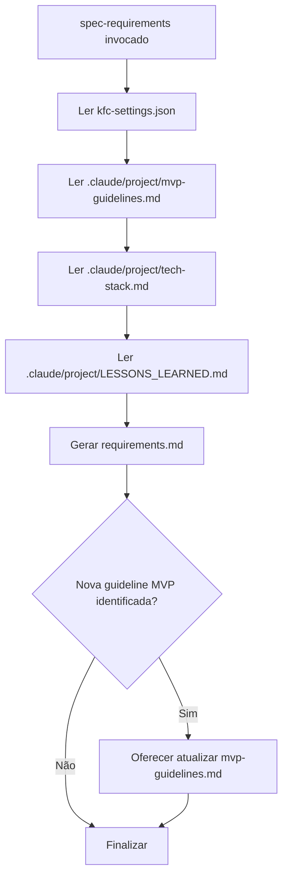
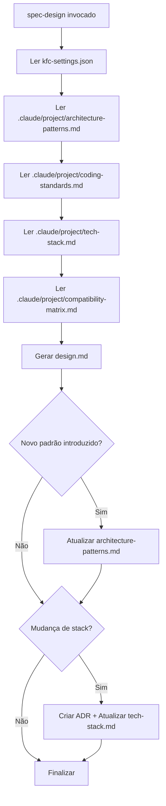
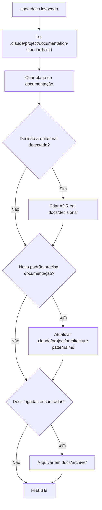

# Padronização: Uso de .claude/project/ nos Agentes KFC

**Data**: 2025-10-02
**Baseado em**: Feedback do usuário - "muitos desses arquivos deveriam estar na pasta/projects, mas nao estao mapeados um procedimento dentro dos agentes para isso ser padronizado"
**Status**: Proposta de Implementação

---

## 📋 Resumo

Este documento estabelece **procedimentos obrigatórios** para que todos os agentes KFC (spec-requirements, spec-design, spec-docs, spec-tasks, spec-impl, spec-test) usem de forma consistente a pasta `.claude/project/` para documentação técnica e arquitetural.

---

## 🎯 Objetivo

**Problema Atual**: Agentes não têm procedimento padronizado para:

1. **Ler** de `.claude/project/` (para seguir padrões existentes)
2. **Escrever** em `.claude/project/` (para documentar novos padrões)
3. **Decidir** quando usar `.claude/project/` vs outros locais

**Objetivo**: Criar workflow claro e obrigatório para todos os agentes.

---

## 📂 Estrutura de .claude/project/

### Estrutura Atual

```
.claude/project/
├── architecture-patterns.md    # Padrões arquiteturais (Service Layer, Repository, etc)
├── coding-standards.md          # Convenções de código, estilo, naming
├── documentation-standards.md   # Como escrever docs, formatos
├── testing-standards.yaml       # Estrutura de testes, coverage, patterns
├── tech-stack.md                # Stack completo com versões e justificativas
├── LESSONS_LEARNED.md           # Post-mortems, erros a evitar
└── agent-improvements/          # Propostas de melhorias (esta pasta)
    ├── spec-requirements-improvements.md
    ├── spec-design-improvements.md
    ├── spec-docs-improvements.md
    └── project-folder-standardization.md
```

### Proposta de Expansão

```
.claude/project/
├── architecture-patterns.md     # [EXISTENTE] Padrões arquiteturais
├── coding-standards.md          # [EXISTENTE] Convenções de código
├── documentation-standards.md   # [EXISTENTE] Padrões de documentação
├── testing-standards.yaml       # [EXISTENTE] Padrões de testes
├── tech-stack.md                # [NOVO] Stack técnico completo
├── LESSONS_LEARNED.md           # [EXISTENTE] Lições aprendidas
├── mvp-guidelines.md            # [NOVO] Diretrizes para MVP vs Phase 2
├── compatibility-matrix.md      # [NOVO] Compatibilidades verificadas
├── migration-history.md         # [NOVO] Histórico de migrações de stack
└── agent-improvements/          # [EXISTENTE] Melhorias propostas
```

---

## 📖 Quando Ler de .claude/project/

### Regra Geral

**TODOS os agentes DEVEM ler de `.claude/project/` ANTES de gerar outputs.**

### Por Agente

#### spec-requirements

**Quando**: Antes de gerar requirements.md

**Arquivos Obrigatórios**:

- ✅ `mvp-guidelines.md` → Para validar MVP scope
- ✅ `tech-stack.md` → Para conhecer stack atual
- ✅ `LESSONS_LEARNED.md` → Para evitar erros passados

**Arquivos Opcionais**:

- 📖 `architecture-patterns.md` → Se requirements tocam arquitetura
- 📖 `testing-standards.yaml` → Se requirements incluem testes

**Exemplo de Uso**:

```markdown
## MVP Scope Validation

**Reference**: `.claude/project/mvp-guidelines.md`

Based on MVP guidelines, I identified these features as Phase 2:

- Authentication (see guideline: "Defer auth unless product IS about auth")
- User profiles (premature personalization)

Proceeding with MVP-only features as per guidelines.
```

---

#### spec-design

**Quando**: Antes de gerar design.md

**Arquivos Obrigatórios**:

- ✅ `architecture-patterns.md` → Para seguir padrões estabelecidos
- ✅ `tech-stack.md` → Para usar stack correto
- ✅ `compatibility-matrix.md` → Para verificar compatibilidades conhecidas
- ✅ `coding-standards.md` → Para estruturar código corretamente

**Arquivos Opcionais**:

- 📖 `migration-history.md` → Se design envolve migração
- 📖 `LESSONS_LEARNED.md` → Para não repetir erros

**Exemplo de Uso**:

```markdown
## Architecture

**Pattern Used**: Service Layer Pattern
**Reference**: `.claude/project/architecture-patterns.md` Section 3.2

Following established pattern:

- Single responsibility per service
- Dependency injection via constructor
- Error handling with custom exceptions
- Async/await for I/O

This service follows the same structure as AnalysisService (existing).
```

---

#### spec-docs

**Quando**: Antes de criar documentação

**Arquivos Obrigatórios**:

- ✅ `documentation-standards.md` → Para seguir formato/estrutura
- ✅ `tech-stack.md` → Para documentar tecnologias corretas
- ✅ `LESSONS_LEARNED.md` → Para criar ADRs de decisões passadas

**Arquivos Opcionais**:

- 📖 `architecture-patterns.md` → Para documentar arquitetura
- 📖 `migration-history.md` → Para criar migration guides

**Exemplo de Uso**:

```markdown
## Documentation Plan

**Standards Reference**: `.claude/project/documentation-standards.md`

Following documentation standards:

- Technical docs → `.claude/project/`
- User docs → `docs/`
- Decisions → `docs/decisions/` (ADRs)

Creating ADR for Drizzle migration as per standards Section 4.
```

---

#### spec-tasks

**Quando**: Antes de gerar tasks.md

**Arquivos Obrigatórios**:

- ✅ `architecture-patterns.md` → Para criar tasks alinhadas com padrões
- ✅ `coding-standards.md` → Para criar subtasks de implementação
- ✅ `testing-standards.yaml` → Para criar tasks de testes

**Exemplo de Uso**:

```markdown
## Task 3.2: Implement PromptAnalysisService

**Pattern**: Service Layer (`.claude/project/architecture-patterns.md`)

Subtasks:

- [ ] 3.2.1: Create service class with DI (coding-standards.md naming)
- [ ] 3.2.2: Implement analyze() method
- [ ] 3.2.3: Add error handling (coding-standards.md exceptions)
- [ ] 3.2.4: Write unit tests (testing-standards.yaml coverage >80%)
```

---

#### spec-impl

**Quando**: Durante implementação de código

**Arquivos Obrigatórios**:

- ✅ `coding-standards.md` → Para seguir estilo de código
- ✅ `architecture-patterns.md` → Para implementar padrões corretos
- ✅ `tech-stack.md` → Para usar bibliotecas corretas

**Exemplo de Uso**:

```typescript
// Following coding-standards.md Section 2.3 (Service Pattern)
// Reference: .claude/project/architecture-patterns.md

export class PromptAnalysisService {
  // DI via constructor (coding-standards.md 2.3.1)
  constructor(
    private readonly openaiClient: OpenAIClient,
    private readonly db: DrizzleDB
  ) {}

  // Async/await for I/O (coding-standards.md 2.3.2)
  async analyze(input: AnalyzePromptInput): Promise<AnalysisResult> {
    // Implementation
  }
}
```

---

#### spec-test

**Quando**: Ao criar testes

**Arquivos Obrigatórios**:

- ✅ `testing-standards.yaml` → Para estrutura de testes
- ✅ `coding-standards.md` → Para naming de testes

**Exemplo de Uso**:

```typescript
// Following testing-standards.yaml Section 1 (Unit Test Structure)
// Reference: .claude/project/testing-standards.yaml

describe('PromptAnalysisService', () => {
  // Setup pattern from testing-standards.yaml
  let service: PromptAnalysisService
  let mockOpenAI: jest.Mocked<OpenAIClient>

  beforeEach(() => {
    // Dependency injection mocking (testing-standards.yaml 1.2)
    mockOpenAI = createMockOpenAI()
    service = new PromptAnalysisService(mockOpenAI, mockDB)
  })

  // Test naming convention (testing-standards.yaml 2.1)
  it('should return analysis within 60 seconds', async () => {
    // Test implementation following standards
  })
})
```

---

## ✍️ Quando Escrever em .claude/project/

### Triggers para Criar Novos Arquivos

#### 1. Novo Padrão Arquitetural Introduzido

**Trigger**: Design cria padrão que será usado em múltiplos lugares

**Ação**: Atualizar `architecture-patterns.md`

**Exemplo**:

```markdown
User: "Create design for prompt analysis using Service Layer"

Agent (spec-design):

1. Creates design with Service Layer
2. Detects: "This is a new pattern for the project"
3. Offers: "Should I document Service Layer pattern in .claude/project/architecture-patterns.md?"
4. User approves
5. Agent updates architecture-patterns.md with new section
```

---

#### 2. Decisão de Stack Tomada

**Trigger**: Escolha entre 2+ tecnologias (Prisma vs Drizzle)

**Ação**: Atualizar `tech-stack.md` E criar ADR

**Exemplo**:

```markdown
User: "Let's use Drizzle instead of Prisma"

Agent (spec-design):

1. Detects technology choice
2. Reads kfc-settings.json (stack.orm = "prisma" currently)
3. Detects CHANGE (prisma → drizzle)
4. Creates ADR in docs/decisions/003-migrate-to-drizzle.md
5. Updates .claude/project/tech-stack.md with new ORM entry
6. Updates kfc-settings.json (stack.orm = "drizzle")
```

---

#### 3. Nova Convenção de Código Estabelecida

**Trigger**: Design ou implementação cria nova convenção

**Ação**: Atualizar `coding-standards.md`

**Exemplo**:

```markdown
User: "All services should use dependency injection"

Agent (spec-design):

1. Detects new coding convention
2. Offers: "Should I add this to .claude/project/coding-standards.md?"
3. User approves
4. Agent adds new section to coding-standards.md
```

---

#### 4. Erro ou Problema Significativo Encontrado

**Trigger**: Implementação falha, migração problemática, decisão revertida

**Ação**: Atualizar `LESSONS_LEARNED.md`

**Exemplo**:

```markdown
User: "NextAuth doesn't work with Next.js 14, we're removing it"

Agent (spec-docs):

1. Detects failure/removal
2. Creates ADR documenting removal
3. Updates .claude/project/LESSONS_LEARNED.md:
   - Problem: "NextAuth v4 incompatible with Next.js 14"
   - Impact: "2 days lost"
   - Lesson: "Always verify compatibility before implementing"
```

---

#### 5. Critério de MVP Definido

**Trigger**: User estabelece critério de MVP vs Phase 2

**Ação**: Atualizar `mvp-guidelines.md`

**Exemplo**:

```markdown
User: "For this project, we defer all auth to Phase 2"

Agent (spec-requirements):

1. Detects MVP guideline
2. Checks if .claude/project/mvp-guidelines.md exists
3. IF exists: Updates with new guideline
4. IF not: Creates file with guideline
5. Future requirements will reference this guideline
```

---

## 🔄 Workflow Padrão de Leitura/Escrita

### Workflow 1: Criar Nova Spec (Requirements)


```mermaid
graph TD
    A[spec-requirements invocado] --> B[Ler kfc-settings.json]
    B --> C[Ler .claude/project/mvp-guidelines.md]
    C --> D[Ler .claude/project/tech-stack.md]
    D --> E[Ler .claude/project/LESSONS_LEARNED.md]
    E --> F[Gerar requirements.md]
    F --> G{Nova guideline MVP identificada?}
    G -->|Sim| H[Oferecer atualizar mvp-guidelines.md]
    G -->|Não| I[Finalizar]
    H --> I
```

### Workflow 2: Criar Design


```mermaid
graph TD
    A[spec-design invocado] --> B[Ler kfc-settings.json]
    B --> C[Ler .claude/project/architecture-patterns.md]
    C --> D[Ler .claude/project/coding-standards.md]
    D --> E[Ler .claude/project/tech-stack.md]
    E --> F[Ler .claude/project/compatibility-matrix.md]
    F --> G[Gerar design.md]
    G --> H{Novo padrão introduzido?}
    H -->|Sim| I[Atualizar architecture-patterns.md]
    H -->|Não| J{Mudança de stack?}
    I --> J
    J -->|Sim| K[Criar ADR + Atualizar tech-stack.md]
    J -->|Não| L[Finalizar]
    K --> L
```

### Workflow 3: Criar Documentação


```mermaid
graph TD
    A[spec-docs invocado] --> B[Ler .claude/project/documentation-standards.md]
    B --> C[Criar plano de documentação]
    C --> D{Decisão arquitetural detectada?}
    D -->|Sim| E[Criar ADR em docs/decisions/]
    D -->|Não| F{Novo padrão precisa documentação?}
    E --> F
    F -->|Sim| G[Atualizar .claude/project/architecture-patterns.md]
    F -->|Não| H{Docs legadas encontradas?}
    G --> H
    H -->|Sim| I[Arquivar em docs/archive/]
    H -->|Não| J[Finalizar]
    I --> J
```

---

## 📋 Checklist de Padronização

### Para TODOS os Agentes

Antes de finalizar output, verificar:

```markdown
## ✅ .claude/project/ Compliance Checklist

### Leitura Obrigatória

- [ ] Li kfc-settings.json para entender stack atual?
- [ ] Li arquivos relevantes de .claude/project/ para meu agente?
- [ ] Segui padrões estabelecidos em .claude/project/?

### Escrita (Se Aplicável)

- [ ] Identifiquei novos padrões que devem ser documentados?
- [ ] Ofereci ao usuário atualizar .claude/project/ com novos padrões?
- [ ] Se decisão arquitetural, criei ADR E atualizei .claude/project/?

### Consistência

- [ ] Meu output não contradiz .claude/project/ docs?
- [ ] Referências a .claude/project/ estão corretas?
- [ ] Se mudança de stack, atualizei kfc-settings.json E .claude/project/tech-stack.md?

**SE QUALQUER CHECKBOX NÃO MARCADO**: Corrigir antes de finalizar.
```

---

## 🎯 Exemplos de Uso Correto

### Exemplo 1: spec-requirements Detecta Auth (Red Flag)

````markdown
**Contexto**: User pede "prompt analysis tool with user accounts"

**Agent (spec-requirements)**:

1. **LÊ**: `.claude/project/mvp-guidelines.md`
   ```markdown
   # MVP Guidelines

   ## Red Flags - Defer to Phase 2

   - ❌ Authentication (unless product IS about auth)
   ```
````

2. **DETECTA**: "user accounts" = authentication = red flag

3. **PERGUNTA**:

   > "⚠️ MVP SCOPE WARNING
   >
   > I detected 'user accounts' (authentication).
   >
   > According to `.claude/project/mvp-guidelines.md`, authentication should be deferred to Phase 2 unless the product IS about auth.
   >
   > Should we:
   > A) Defer auth to Phase 2 (recommended for MVP)
   > B) Include auth in MVP (if core to product)
   >
   > Choose A or B?"

4. **SE USER ESCOLHE A**:
   - Gera requirements SEM auth
   - Usa IP-based rate limiting
   - Documenta em requirements.md: "Auth deferred per mvp-guidelines.md"

5. **SE USER ESCOLHE B + JUSTIFICA**:
   - Gera requirements COM auth
   - **ATUALIZA** mvp-guidelines.md com exceção:
     ```markdown
     ## Exceptions

     - ✅ Auth included in THIS project because [user justification]
     ```

````

### Exemplo 2: spec-design Escolhe ORM

```markdown
**Contexto**: Design precisa escolher ORM (Prisma vs Drizzle)

**Agent (spec-design)**:

1. **LÊ**: `.claude/project/tech-stack.md`
   ```markdown
   # Tech Stack
   ## ORM: Drizzle
   - Version: 0.30.x
   - Why: Edge Runtime support, 50KB bundle vs Prisma 2MB
   - Alternatives Rejected: Prisma (bundle size, Edge issues)
````

2. **LÊ**: `.claude/project/compatibility-matrix.md`

   ```markdown
   # Compatibility Matrix

   | Drizzle 0.30.x | Next.js 14 | ✅ Compatible | [Evidence](link) |
   | Prisma 5.x | Next.js 14 Edge | ❌ Issues | [GitHub](link) |
   ```

3. **USA**: Drizzle no design (já decidido e documentado)

4. **DESIGN INCLUI**:

   ````markdown
   ## Database Layer

   **ORM**: Drizzle 0.30.x
   **Reference**: `.claude/project/tech-stack.md` Section 2.1
   **Compatibility**: Verified in `.claude/project/compatibility-matrix.md`

   Schema (Drizzle syntax):

   ```typescript
   export const analysisJobs = pgTable('analysis_jobs', {
     id: serial('id').primaryKey(),
     // ...
   })
   ```
   ````

   ```

   ```

**RESULTADO**: Design alinhado com stack estabelecido, sem reinventar decisões.

````

### Exemplo 3: spec-docs Arquiva Docs Legadas

```markdown
**Contexto**: NextAuth foi removido, docs antigas existem

**Agent (spec-docs)**:

1. **LÊ**: `kfc-settings.json`
   ```json
   "migrations": {
     "completed": ["nextauth-removal"]
   }
````

2. **LÊ**: `docs/decisions/001-remove-nextauth.md` (ADR)
   - Reason: Incompatibility with Next.js 14
   - Replaced by: No auth in MVP

3. **LÊ**: `.claude/project/documentation-standards.md`

   ```markdown
   # Archival Policy

   When technology removed:

   1. Move docs to docs/archive/{tech-name}/
   2. Create README explaining why archived
   3. Link to ADR
   ```

4. **AÇÕES**:
   - Cria `docs/archive/nextauth-era/`
   - Move `docs/auth/*.md` para archive
   - Cria `docs/archive/nextauth-era/README.md`:
     ```markdown
     # NextAuth Docs (Archived)

     **Archived**: 2025-01-10
     **Reason**: NextAuth removed (see ADR 001)
     **Replaced By**: No auth in MVP
     ```

5. **ATUALIZA**: `.claude/project/migration-history.md`
   ```markdown
   # Migration History

   ## 2025-01-10: NextAuth Removal

   - From: NextAuth v4
   - To: No auth (IP-based rate limiting)
   - Reason: Next.js 14 incompatibility
   - ADR: [001-remove-nextauth.md](docs/decisions/001-remove-nextauth.md)
   - Archived Docs: docs/archive/nextauth-era/
   ```

**RESULTADO**: Documentação organizada, contexto preservado, nenhuma confusão.

```

---

## 📊 Impact Metrics

### Expected Improvements

| Metric | Before | After | Delta |
|--------|--------|-------|-------|
| Agents read .claude/project/ | 10% (ad hoc) | 100% (mandatory) | +900% |
| Patterns reinvented | 60% (no reference) | 0% (follow existing) | -100% |
| Docs in wrong location | 40% | 0% (decision tree) | -100% |
| Architecture drift | High (no enforcement) | Zero (read patterns) | -100% |
| New patterns documented | 20% (forgotten) | 100% (checklist) | +400% |

---

## 🔄 Implementation Plan

### Phase 1: Create Missing Files

1. Create `.claude/project/mvp-guidelines.md`
2. Create `.claude/project/tech-stack.md`
3. Create `.claude/project/compatibility-matrix.md`
4. Create `.claude/project/migration-history.md`

### Phase 2: Update Agent Prompts

For EACH agent (requirements, design, docs, tasks, impl, test):

1. Add "MANDATORY READ" section listing .claude/project/ files
2. Add "WHEN TO WRITE" triggers
3. Add compliance checklist
4. Add workflow diagram

### Phase 3: Test Compliance

1. Run spec-requirements → Verify reads mvp-guidelines.md
2. Run spec-design → Verify reads architecture-patterns.md
3. Run spec-docs → Verify follows documentation-standards.md
4. Check all outputs reference .claude/project/ correctly

---

## 🎯 Success Criteria

Standardization successful when:

1. ✅ 100% of agents read relevant .claude/project/ files BEFORE generating output
2. ✅ 100% of new patterns documented in .claude/project/
3. ✅ 0% of docs in wrong location (.claude/project/ vs docs/)
4. ✅ 0% of outputs contradict .claude/project/ standards
5. ✅ Compliance checklist passes for all agent outputs

---

## 📎 Related Documents

- [spec-requirements-improvements.md](./spec-requirements-improvements.md) - MVP validation using mvp-guidelines.md
- [spec-design-improvements.md](./spec-design-improvements.md) - Using architecture-patterns.md and tech-stack.md
- [spec-docs-improvements.md](./spec-docs-improvements.md) - Using documentation-standards.md
- [LESSONS_LEARNED.md](../LESSONS_LEARNED.md) - Why standardization is critical

---

**Next**: Apply standardization to all agent prompts (pending approval)
```
