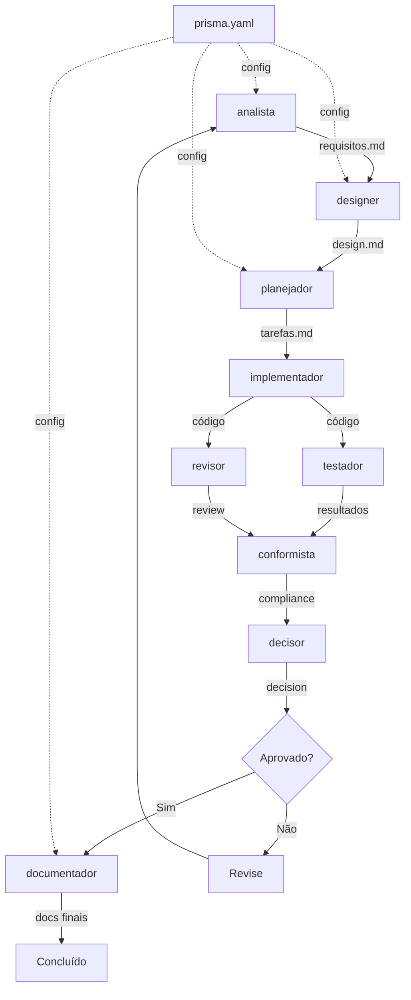

# Grafo de Dependências dos Agentes

**Propósito**: Rastrear dependências entre agentes e arquivos para prevenir falhas em cascata

**Última Atualização**: 2025-10-14

---

## analista (requisitos)

**Lê**:

- `.prisma/configuracoes/prisma.yaml` → configurações gerais
- Contexto do projeto (arquivos existentes)
- Templates de requisitos

**Escreve**:

- `.prisma/especificacoes/{feature}/requisitos.md`

**Estratégia de Fallback**:

- IF prisma.yaml missing: Usa valores padrão built-in
- IF templates missing: Usa template interno
- Nunca falha - sempre tem fallback

---

## designer (design técnico)

**Lê**:

- `.prisma/configuracoes/prisma.yaml` → padrões arquiteturais
- `.prisma/especificacoes/{feature}/requisitos.md` (quando disponível)
- Contexto do projeto

**Escreve**:

- `.prisma/especificacoes/{feature}/design.md`

**Estratégia de Fallback**:

- IF requisitos missing: Solicita do usuário
- IF padrões missing: Usa Service Layer genérico
- IF prisma.yaml missing: Usa configuração padrão

---

## planejador (tarefas)

**Lê**:

- `.prisma/especificacoes/{feature}/design.md`
- `.prisma/especificacoes/{feature}/requisitos.md`
- `.prisma/configuracoes/prisma.yaml`

**Escreve**:

- `.prisma/especificacoes/{feature}/tarefas.md`

**Estratégia de Fallback**:

- IF design missing: Solicita do usuário
- IF requisitos missing: Cria tarefas baseado apenas em design
- Sempre valida antes de prosseguir

---

## documentador (documentação final)

**Lê**:

- `.prisma/configuracoes/prisma.yaml` → formatos de docs
- `.prisma/especificacoes/{feature}/` (todos arquivos)
- `docs/decisions/` (ADRs existentes)

**Escreve**:

- `docs/decisions/{XXX}-{decision}.md` (ADRs)
- `docs/` ou `.prisma/projeto/` (baseado em decisão)
- `docs/archive/` (docs legados)

**Estratégia de Fallback**:

- IF configuração missing: Requer aprovação do usuário para todos docs
- IF docs/decisions/ não existe: Cria o diretório
- Usa template ADR interno se necessário

---

## Matriz de Dependências

| Agente        | Dependências Críticas (Obrigatórias) | Dependências Opcionais          | Fallback Disponível? |
| ------------- | ------------------------------------ | ------------------------------- | -------------------- |
| analista      | -                                    | prisma.yaml, templates          | ✅ Sim (built-in)    |
| designer      | requisitos.md                        | prisma.yaml, padrões            | ✅ Sim (genérico)    |
| planejador    | design.md                            | requisitos.md, prisma.yaml      | ✅ Sim (parcial)     |
| implementador | tarefas.md                           | design.md, requisitos.md        | ⚠️ Limitado          |
| testador      | código implementado                  | especificações                  | ✅ Sim (básico)      |
| revisor       | código implementado                  | padrões de código               | ✅ Sim (built-in)    |
| conformista   | especificação completa               | prisma.yaml                     | ✅ Sim (checklist)   |
| documentador  | especificação completa               | configurações, ADRs existentes  | ✅ Sim (template)    |
| decisor       | fase atual do workflow               | histórico de decisões           | ✅ Sim (scoring)     |
| auditor       | codebase completo                    | especificações                  | ✅ Sim (análise)     |

---

## Prevenção de Dependências Circulares

**Regra 1**: Agentes NÃO DEVEM depender de arquivos que eles criam

- ❌ Ruim: analista lê requisitos.md
- ✅ Bom: analista lê prisma.yaml (criado separadamente)

**Regra 2**: Ordem de bootstrap importa

- ✅ Primeira execução: Criar arquivos de projeto (configurações, padrões, etc)
- ✅ Segunda execução: Agentes referenciam esses arquivos
- ❌ Nunca: Tentar ler arquivos antes de existirem

**Regra 3**: Use fallbacks para arquivos opcionais

- Todos agentes DEVEM ter comportamento de fallback
- Nunca falhar completamente por arquivo opcional ausente
- Logar warning e continuar

---

## Análise de Impacto de Mudanças

**Se você modificar**:

- `prisma.yaml` → Afeta: TODOS os agentes (mudanças de configuração)
- `templates/requisitos.md` → Afeta: analista (formato de requisitos)
- `templates/design.md` → Afeta: designer (estrutura de design)
- `templates/tarefas.md` → Afeta: planejador (formato de tarefas)

**Validação Obrigatória**: Após mudar qualquer arquivo, validar que todos agentes dependentes ainda funcionam.

---

## Fluxo de Dependências no Workflow

---

## Estratégias de Resiliência

### Nível 1: Fallback Automático
- Agente usa configuração/template interno
- Nenhuma intervenção do usuário necessária
- Log de warning emitido

### Nível 2: Degradação Graciosa
- Agente executa com funcionalidade reduzida
- Avisa usuário sobre limitações
- Continua com processo

### Nível 3: Falha Controlada
- Agente não pode continuar sem input crítico
- Solicita usuário explicitamente
- Aguarda aprovação/informação

---

**Sistema**: Prisma v1.0
**Status**: Ativo
