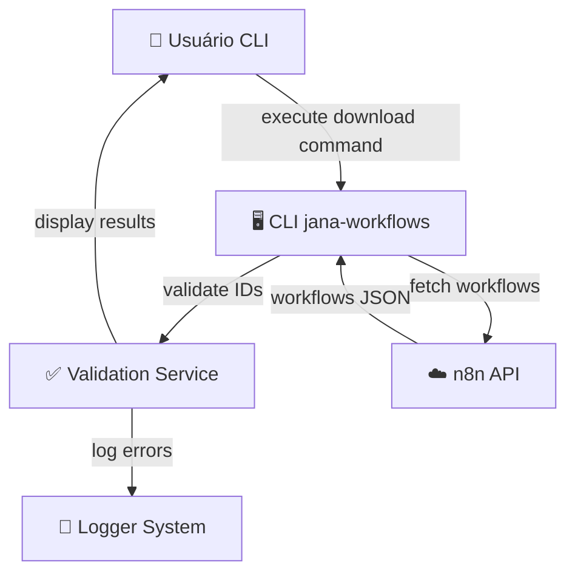
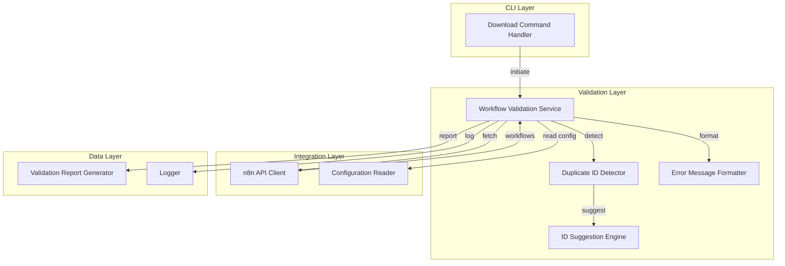
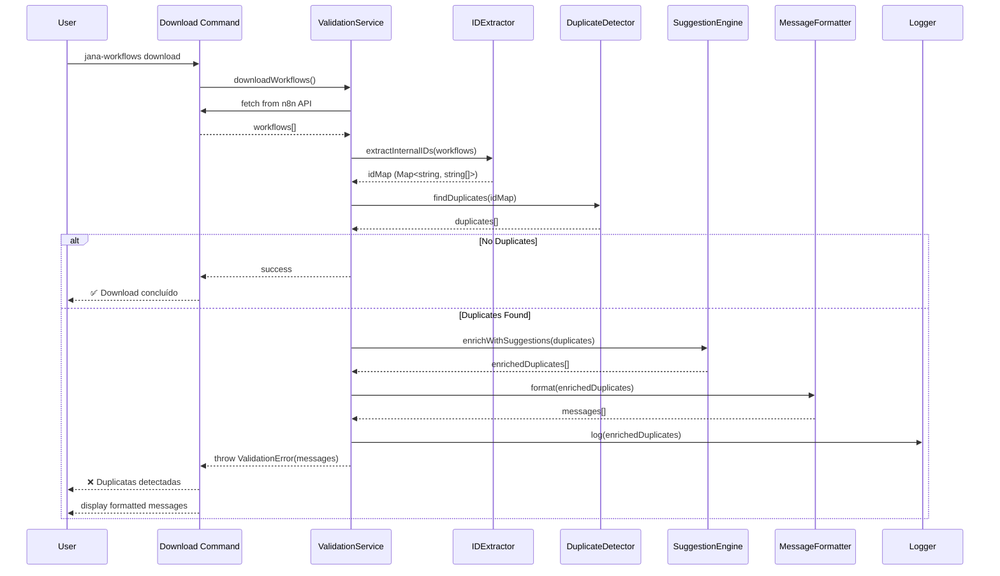
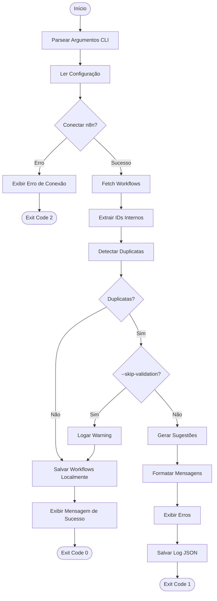
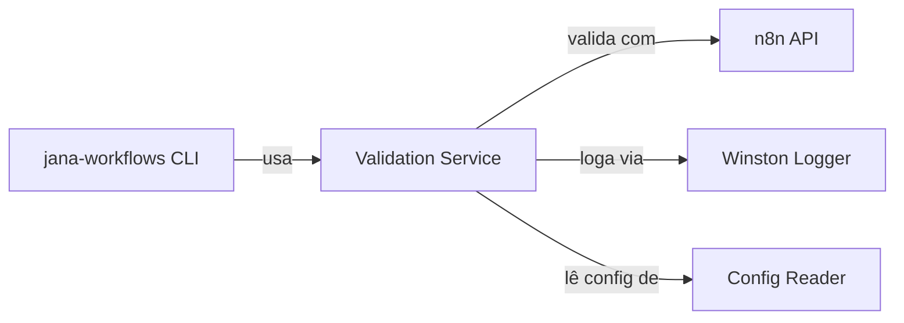

# Documento de Design - Validação de IDs Duplicados em Workflows

## Metadados

- **Nome da Feature**: Validação de IDs Duplicados em Workflows
- **Criado em**: 2025-10-17
- **Última Atualização**: 2025-10-17
- **Status**: Rascunho
- **Versão**: 0.1.0
- **Baseado em Requisitos**: [requisitos.md](./requisitos.md) v0.1.0

## Resumo Executivo

Este documento descreve o design técnico de um sistema de validação automática que detecta IDs internos duplicados durante o processo de download de workflows do n8n via CLI. O sistema intercepta o fluxo de download, valida unicidade de IDs, e fornece feedback acionável ao usuário com sugestões automáticas de correção.

**Abordagem Técnica**: Implementação em TypeScript/Node.js com arquitetura modular baseada em Service Layer pattern, processamento em memória O(n), e integração transparente com comandos CLI existentes.

## Visão Geral da Arquitetura

### Contexto do Sistema



### Arquitetura de Componentes



## Design Detalhado

### Componente 1: WorkflowValidationService

#### Responsabilidade

Orquestrar o processo completo de validação de IDs duplicados, coordenando extração, detecção, sugestão e relatório de erros.

#### Interface

```typescript
interface WorkflowValidationService {
  /**
   * Valida workflows baixados para detectar IDs duplicados
   * @param workflows - Array de workflows do n8n
   * @returns Resultado de validação com erros (se houver)
   * @throws ValidationError se duplicatas forem encontradas
   */
  validateWorkflows(workflows: N8NWorkflow[]): ValidationResult;

  /**
   * Valida workflows e retorna apenas relatório (sem throw)
   * @param workflows - Array de workflows do n8n
   * @returns Relatório de validação
   */
  validateWorkflowsNonBlocking(workflows: N8NWorkflow[]): ValidationReport;
}

class WorkflowValidationService implements WorkflowValidationService {
  constructor(
    private idExtractor: InternalIDExtractor,
    private duplicateDetector: DuplicateIDDetector,
    private suggestionEngine: IDSuggestionEngine,
    private messageFormatter: ErrorMessageFormatter,
    private logger: Logger
  ) {}

  validateWorkflows(workflows: N8NWorkflow[]): ValidationResult {
    const idMap = this.idExtractor.extractInternalIDs(workflows);
    const duplicates = this.duplicateDetector.findDuplicates(idMap);

    if (duplicates.length === 0) {
      return { valid: true, duplicates: [] };
    }

    const enrichedDuplicates = this.suggestionEngine.enrichWithSuggestions(
      duplicates,
      idMap
    );

    const formattedMessages = this.messageFormatter.format(enrichedDuplicates);

    this.logger.error("Duplicates detected", { duplicates: enrichedDuplicates });

    throw new ValidationError(formattedMessages, enrichedDuplicates);
  }
}
```

#### Detalhes de Implementação

- **Estratégia**: Fail-fast - interrompe download ao detectar primeira duplicata
- **Performance**: O(n) complexidade usando `Map<string, string[]>` para lookup
- **Error Handling**: Lança `ValidationError` com detalhes estruturados
- **Logging**: Registra todas as duplicatas detectadas em `.jana/logs/validation.log`

#### Dependências

- `InternalIDExtractor`: Extração de IDs usando regex
- `DuplicateIDDetector`: Algoritmo de detecção
- `IDSuggestionEngine`: Geração de sugestões
- `ErrorMessageFormatter`: Formatação de mensagens
- `Logger`: Sistema de logging

### Componente 2: InternalIDExtractor

#### Responsabilidade

Extrair IDs internos de workflows n8n usando padrões regex configuráveis, com suporte a múltiplos formatos de nomenclatura.

#### Interface

```typescript
interface InternalIDExtractor {
  /**
   * Extrai IDs internos de todos os workflows
   * @param workflows - Array de workflows do n8n
   * @returns Map de ID interno para array de IDs n8n
   */
  extractInternalIDs(workflows: N8NWorkflow[]): Map<string, string[]>;

  /**
   * Extrai ID interno de um único workflow
   * @param workflow - Workflow individual
   * @returns ID interno ou null se não encontrado
   */
  extractSingleID(workflow: N8NWorkflow): string | null;
}

class InternalIDExtractor implements InternalIDExtractor {
  private readonly ID_PATTERN: RegExp;

  constructor(config: ValidationConfig) {
    // Padrão padrão: (PREFIX-TYPE-NNN)
    // Exemplo: (ERR-OUT-001), (LOG-IN-042)
    this.ID_PATTERN = new RegExp(
      config.idPattern || String.raw`\([A-Z]+-[A-Z]+-\d{3}\)`,
      'g'
    );
  }

  extractInternalIDs(workflows: N8NWorkflow[]): Map<string, string[]> {
    const idMap = new Map<string, string[]>();

    for (const workflow of workflows) {
      const internalID = this.extractSingleID(workflow);

      if (internalID) {
        if (!idMap.has(internalID)) {
          idMap.set(internalID, []);
        }
        idMap.get(internalID)!.push(workflow.id);
      }
    }

    return idMap;
  }

  extractSingleID(workflow: N8NWorkflow): string | null {
    // Procura ID no nome do workflow primeiro
    const nameMatch = workflow.name.match(this.ID_PATTERN);
    if (nameMatch) {
      return nameMatch[0];
    }

    // Fallback: procura em tags ou metadata (se disponível)
    if (workflow.tags) {
      const tagsString = workflow.tags.join(' ');
      const tagMatch = tagsString.match(this.ID_PATTERN);
      if (tagMatch) {
        return tagMatch[0];
      }
    }

    return null;
  }
}
```

#### Detalhes de Implementação

- **Regex Configurável**: Lê padrão de `.jana/config.json` (fallback: padrão hardcoded)
- **Estratégia de Busca**: Nome do workflow → Tags → Metadata (nessa ordem)
- **Normalização**: Remove espaços e converte para uppercase antes de match
- **Validação**: Ignora workflows sem ID válido (não retorna erro)

### Componente 3: DuplicateIDDetector

#### Responsabilidade

Detectar IDs internos duplicados usando algoritmo eficiente baseado em Map.

#### Interface

```typescript
interface DuplicateIDDetector {
  /**
   * Encontra todos os IDs duplicados
   * @param idMap - Map de ID interno para IDs n8n
   * @returns Array de duplicatas detectadas
   */
  findDuplicates(idMap: Map<string, string[]>): DuplicateInfo[];

  /**
   * Verifica se um ID específico está duplicado
   * @param internalID - ID interno para verificar
   * @param idMap - Map de referência
   * @returns true se duplicado
   */
  isDuplicate(internalID: string, idMap: Map<string, string[]>): boolean;
}

class DuplicateIDDetector implements DuplicateIDDetector {
  findDuplicates(idMap: Map<string, string[]>): DuplicateInfo[] {
    const duplicates: DuplicateInfo[] = [];

    for (const [internalID, n8nIDs] of idMap.entries()) {
      if (n8nIDs.length > 1) {
        duplicates.push({
          internalID,
          n8nIDs,
          count: n8nIDs.length,
        });
      }
    }

    // Ordena por número de duplicatas (maior primeiro)
    return duplicates.sort((a, b) => b.count - a.count);
  }

  isDuplicate(internalID: string, idMap: Map<string, string[]>): boolean {
    const n8nIDs = idMap.get(internalID);
    return n8nIDs !== undefined && n8nIDs.length > 1;
  }
}
```

#### Detalhes de Implementação

- **Complexidade**: O(n) onde n = número de IDs únicos
- **Ordenação**: Duplicatas mais severas primeiro (mais ocorrências)
- **Estrutura**: Retorna array ordenado para feedback incremental

### Componente 4: IDSuggestionEngine

#### Responsabilidade

Gerar sugestões automáticas de IDs corretos baseadas em padrões sequenciais.

#### Interface

```typescript
interface IDSuggestionEngine {
  /**
   * Enriquece duplicatas com sugestões de IDs corretos
   * @param duplicates - Duplicatas detectadas
   * @param idMap - Map de todos os IDs (para validar sugestão)
   * @returns Duplicatas enriquecidas com sugestões
   */
  enrichWithSuggestions(
    duplicates: DuplicateInfo[],
    idMap: Map<string, string[]>
  ): EnrichedDuplicateInfo[];

  /**
   * Gera sugestão para um ID específico
   * @param internalID - ID duplicado
   * @param usedIDs - Set de IDs já usados
   * @returns ID sugerido ou null se não conseguir gerar
   */
  suggestNextID(internalID: string, usedIDs: Set<string>): string | null;
}

class IDSuggestionEngine implements IDSuggestionEngine {
  enrichWithSuggestions(
    duplicates: DuplicateInfo[],
    idMap: Map<string, string[]>
  ): EnrichedDuplicateInfo[] {
    const usedIDs = new Set(idMap.keys());

    return duplicates.map((duplicate) => {
      const suggestions: string[] = [];

      // Gera múltiplas sugestões (até 3) para cada duplicata
      for (let i = 0; i < duplicate.count - 1 && suggestions.length < 3; i++) {
        const suggestion = this.suggestNextID(
          duplicate.internalID,
          new Set([...usedIDs, ...suggestions])
        );
        if (suggestion) {
          suggestions.push(suggestion);
        }
      }

      return {
        ...duplicate,
        suggestions,
      };
    });
  }

  suggestNextID(internalID: string, usedIDs: Set<string>): string | null {
    // Parse: (ERR-OUT-001) → prefix="ERR-OUT", number=1
    const match = internalID.match(/\(([A-Z]+-[A-Z]+)-(\d{3})\)/);

    if (!match) {
      return null; // Padrão não reconhecido
    }

    const [, prefix, numberStr] = match;
    const currentNumber = parseInt(numberStr, 10);

    // Tenta incrementar até encontrar ID livre
    for (let i = currentNumber + 1; i <= 999; i++) {
      const candidate = `(${prefix}-${String(i).padStart(3, '0')})`;

      if (!usedIDs.has(candidate)) {
        return candidate;
      }
    }

    return null; // Não encontrou ID livre até 999
  }
}
```

#### Detalhes de Implementação

- **Algoritmo**: Sequencial incremental com zero-padding (001, 002, etc.)
- **Limite**: Sugere até ID 999 (3 dígitos)
- **Validação**: Garante que sugestão não está em uso
- **Múltiplas Sugestões**: Gera até 3 sugestões por duplicata

### Componente 5: ErrorMessageFormatter

#### Responsabilidade

Formatar mensagens de erro claras e acionáveis para o usuário.

#### Interface

```typescript
interface ErrorMessageFormatter {
  /**
   * Formata mensagens de erro para duplicatas
   * @param duplicates - Duplicatas enriquecidas
   * @returns Array de mensagens formatadas
   */
  format(duplicates: EnrichedDuplicateInfo[]): string[];

  /**
   * Formata mensagem para uma única duplicata
   * @param duplicate - Info da duplicata
   * @returns Mensagem formatada
   */
  formatSingle(duplicate: EnrichedDuplicateInfo): string;
}

class ErrorMessageFormatter implements ErrorMessageFormatter {
  format(duplicates: EnrichedDuplicateInfo[]): string[] {
    const messages: string[] = [];

    messages.push(`\n❌ Detectadas ${duplicates.length} duplicatas de ID interno:\n`);

    for (const duplicate of duplicates) {
      messages.push(this.formatSingle(duplicate));
    }

    messages.push(`\n💡 Corrija os IDs duplicados no n8n e execute o download novamente.\n`);

    return messages;
  }

  formatSingle(duplicate: EnrichedDuplicateInfo): string {
    const { internalID, n8nIDs, suggestions } = duplicate;

    let message = `\n📍 ID interno: ${internalID}\n`;
    message += `   Encontrado em ${n8nIDs.length} workflows:\n`;

    n8nIDs.forEach((n8nID, index) => {
      message += `   ${index + 1}. Workflow n8n ID: ${n8nID}\n`;

      if (index > 0 && suggestions[index - 1]) {
        message += `      → Sugestão: Alterar para ${suggestions[index - 1]}\n`;
      }
    });

    return message;
  }
}
```

#### Detalhes de Implementação

- **Formato**: Mensagens estruturadas com emojis para melhor UX
- **Acionável**: Cada mensagem inclui sugestão específica
- **Agrupamento**: Agrupa duplicatas por ID interno
- **Numeração**: Lista workflows afetados numerados

## Design de Dados

### Modelos de Dados

#### Modelo 1: N8NWorkflow

```typescript
/**
 * Representação de workflow do n8n (API response)
 */
interface N8NWorkflow {
  id: string;                    // UUID do workflow no n8n
  name: string;                  // Nome do workflow (pode conter ID interno)
  active: boolean;               // Status ativo/inativo
  tags?: string[];              // Tags opcionais
  nodes: WorkflowNode[];        // Estrutura de nós
  connections: object;          // Conexões entre nós
  createdAt: string;            // ISO 8601 timestamp
  updatedAt: string;            // ISO 8601 timestamp
}

interface WorkflowNode {
  id: string;
  name: string;
  type: string;
  parameters: Record<string, unknown>;
  position: [number, number];
}
```

**Fonte**: API do n8n v1 (GET /workflows)

#### Modelo 2: ValidationResult

```typescript
/**
 * Resultado de validação de workflows
 */
interface ValidationResult {
  valid: boolean;                           // true se sem duplicatas
  duplicates: EnrichedDuplicateInfo[];      // Array de duplicatas (vazio se valid=true)
  totalWorkflows: number;                   // Total de workflows validados
  validatedAt: Date;                        // Timestamp da validação
}

interface DuplicateInfo {
  internalID: string;           // ID interno duplicado (ex: "(ERR-OUT-001)")
  n8nIDs: string[];             // Array de IDs n8n com esse ID interno
  count: number;                // Número de ocorrências
}

interface EnrichedDuplicateInfo extends DuplicateInfo {
  suggestions: string[];        // Sugestões de IDs corretos
}
```

#### Modelo 3: ValidationConfig

```typescript
/**
 * Configuração de validação (lida de .jana/config.json)
 */
interface ValidationConfig {
  idPattern?: string;           // Regex customizado para ID interno
  strict: boolean;              // Se true, falha mesmo com 1 duplicata
  maxDuplicates: number;        // Máximo de duplicatas antes de parar validação
  logPath: string;              // Caminho do arquivo de log
}
```

**Padrão**:
```json
{
  "validation": {
    "idPattern": "\\([A-Z]+-[A-Z]+-\\d{3}\\)",
    "strict": true,
    "maxDuplicates": 100,
    "logPath": ".jana/logs/validation.log"
  }
}
```

### Estrutura de Armazenamento

#### Arquivo de Log: `.jana/logs/validation-errors.json`

```json
{
  "timestamp": "2025-10-17T14:30:00.000Z",
  "totalWorkflows": 45,
  "duplicatesFound": 2,
  "duplicates": [
    {
      "internalID": "(ERR-OUT-001)",
      "n8nIDs": ["aKdqlCGOK8gCcP9b", "xYz123AbC456"],
      "count": 2,
      "suggestions": ["(ERR-OUT-002)", "(ERR-OUT-003)"]
    },
    {
      "internalID": "(LOG-IN-015)",
      "n8nIDs": ["abc789def012", "ghi345jkl678", "mno901pqr234"],
      "count": 3,
      "suggestions": ["(LOG-IN-016)", "(LOG-IN-017)", "(LOG-IN-018)"]
    }
  ]
}
```

### Fluxo de Dados



## Design da API (CLI)

### Comando: `jana-workflows download`

**Descrição**: Baixa workflows do n8n e valida IDs duplicados

**Uso**:
```bash
jana-workflows download [opções]
```

**Opções**:
```bash
--skip-validation    # Ignora validação de duplicatas (não recomendado)
--dry-run           # Valida sem salvar workflows localmente
--config <path>     # Caminho customizado para config.json
--verbose           # Exibe logs detalhados
```

**Saída de Sucesso** (Exit Code 0):
```bash
✅ Download concluído com sucesso
📊 Total de workflows: 45
✔️  Nenhuma duplicata detectada
💾 Workflows salvos em: .jana/workflows/
```

**Saída de Erro** (Exit Code 1):
```bash
❌ Detectadas 2 duplicatas de ID interno:

📍 ID interno: (ERR-OUT-001)
   Encontrado em 2 workflows:
   1. Workflow n8n ID: aKdqlCGOK8gCcP9b
   2. Workflow n8n ID: xYz123AbC456
      → Sugestão: Alterar para (ERR-OUT-002)

📍 ID interno: (LOG-IN-015)
   Encontrado em 3 workflows:
   1. Workflow n8n ID: abc789def012
   2. Workflow n8n ID: ghi345jkl678
      → Sugestão: Alterar para (LOG-IN-016)
   3. Workflow n8n ID: mno901pqr234
      → Sugestão: Alterar para (LOG-IN-017)

💡 Corrija os IDs duplicados no n8n e execute o download novamente.

🔍 Detalhes salvos em: .jana/logs/validation-errors.json
```

## Lógica de Negócio

### Fluxo de Processo 1: Download e Validação



**Passos Detalhados**:

1. **Parsear Argumentos**: Validar flags e opções
2. **Ler Configuração**: Carregar `.jana/config.json` (criar padrão se ausente)
3. **Conectar n8n**: Autenticar com API key
4. **Fetch Workflows**: GET /workflows (paginado se necessário)
5. **Extrair IDs**: Aplicar regex no nome/tags de cada workflow
6. **Detectar Duplicatas**: Iterar Map e encontrar n8nIDs.length > 1
7. **Gerar Sugestões**: Calcular próximo ID sequencial disponível
8. **Formatar Mensagens**: Criar output user-friendly
9. **Exibir Erros**: Console.error com formatação colorida
10. **Salvar Log**: Persistir JSON para análise posterior

### Regras de Negócio

#### RN-001: Bloqueio de Download com Duplicatas

**Regra**: Se houver pelo menos 1 duplicata, o download DEVE ser interrompido e exit code DEVE ser 1.

**Exceção**: Flag `--skip-validation` permite bypass (com warning)

**Implementação**:
```typescript
if (duplicates.length > 0 && !args.skipValidation) {
  throw new ValidationError(messages, duplicates);
}
```

#### RN-002: Sugestão Sequencial Inteligente

**Regra**: Sugestão DEVE ser o próximo número sequencial disponível no mesmo prefixo.

**Exemplo**:
- ID duplicado: `(ERR-OUT-001)`
- IDs existentes: `(ERR-OUT-001)`, `(ERR-OUT-002)`, `(ERR-OUT-005)`
- Sugestão: `(ERR-OUT-003)` (primeiro gap)

**Implementação**:
```typescript
// Procura gaps antes de incrementar para 999
for (let i = currentNumber + 1; i <= 999; i++) {
  const candidate = `(${prefix}-${pad(i, 3)})`;
  if (!usedIDs.has(candidate)) return candidate;
}
```

#### RN-003: Validação Apenas de IDs com Padrão Válido

**Regra**: Workflows sem ID interno válido DEVEM ser ignorados (não gerar erro).

**Justificativa**: Permite workflows sem nomenclatura padronizada coexistirem.

**Implementação**:
```typescript
const internalID = extractSingleID(workflow);
if (!internalID) continue; // Ignora workflow sem ID
```

## Design de Performance

### Requisitos de Performance

- **Validação**: < 100ms para 100 workflows (< 1ms por workflow)
- **Extração de ID**: Regex deve executar em < 5ms por workflow
- **Sugestão de ID**: < 10ms por duplicata
- **Overhead Total**: < 5% do tempo de download

### Estratégias de Otimização

#### Estruturas de Dados Eficientes

```typescript
// ✅ BOM: Map - O(1) lookup
const idMap = new Map<string, string[]>();

// ❌ RUIM: Array de objetos - O(n) lookup
const idArray: Array<{ id: string; workflows: string[] }> = [];
```

#### Processamento Lazy

```typescript
// Processa workflows de forma streaming se n8n API suportar paginação
async function* fetchWorkflowsStream(client: N8NClient) {
  let page = 1;
  while (true) {
    const batch = await client.getWorkflows({ page, limit: 100 });
    if (batch.length === 0) break;

    for (const workflow of batch) {
      yield workflow; // Valida incrementalmente
    }

    page++;
  }
}
```

#### Caching de Regex

```typescript
class InternalIDExtractor {
  // Compila regex uma vez no constructor (não a cada extração)
  private readonly ID_PATTERN: RegExp;

  constructor(config: ValidationConfig) {
    this.ID_PATTERN = new RegExp(config.idPattern, 'g');
  }
}
```

### Monitoramento de Performance

**Métricas para rastrear**:
- `validation.duration_ms`: Tempo total de validação
- `validation.workflows_per_second`: Taxa de processamento
- `validation.duplicates_found`: Contador de duplicatas
- `validation.regex_match_ms`: Tempo de regex por workflow

**Implementação**:
```typescript
const startTime = performance.now();
const result = validateWorkflows(workflows);
const duration = performance.now() - startTime;

logger.info('Validation completed', {
  duration_ms: duration,
  workflows_per_second: workflows.length / (duration / 1000),
  duplicates_found: result.duplicates.length,
});
```

## Tratamento de Erros

### Categorias de Erro

#### Erros de Validação (Exit Code 1)

```typescript
class ValidationError extends Error {
  constructor(
    public messages: string[],
    public duplicates: EnrichedDuplicateInfo[]
  ) {
    super('Validation failed: duplicate IDs detected');
    this.name = 'ValidationError';
  }
}
```

**Tratamento**:
```typescript
try {
  validationService.validateWorkflows(workflows);
} catch (error) {
  if (error instanceof ValidationError) {
    console.error(error.messages.join('\n'));
    process.exit(1);
  }
  throw error; // Re-throw se não for ValidationError
}
```

#### Erros de Conexão (Exit Code 2)

```typescript
class N8NConnectionError extends Error {
  constructor(
    public statusCode: number,
    public message: string
  ) {
    super(`Failed to connect to n8n: ${message}`);
    this.name = 'N8NConnectionError';
  }
}
```

**Mensagem**:
```bash
❌ Erro de conexão com n8n
🔗 Verifique se o n8n está acessível em: https://your-n8n-instance.com
🔑 Verifique suas credenciais em .jana/config.json

Detalhes: Status 401 Unauthorized
```

#### Erros de Configuração (Exit Code 3)

```typescript
class ConfigError extends Error {
  constructor(public missingField: string) {
    super(`Missing required config field: ${missingField}`);
    this.name = 'ConfigError';
  }
}
```

### Formato de Log de Erro

```json
{
  "timestamp": "2025-10-17T14:30:00.000Z",
  "level": "error",
  "type": "ValidationError",
  "message": "Duplicate IDs detected",
  "details": {
    "totalWorkflows": 45,
    "duplicatesFound": 2,
    "duplicates": [...]
  },
  "stack": "..."
}
```

## Estratégia de Testes

### Testes Unitários

**Arquivo**: `src/services/__tests__/workflow-validation.test.ts`

```typescript
describe('WorkflowValidationService', () => {
  describe('validateWorkflows', () => {
    it('should pass validation when no duplicates', () => {
      const workflows = [
        { id: 'w1', name: '(ERR-OUT-001) Error Handler' },
        { id: 'w2', name: '(ERR-OUT-002) Error Logger' },
      ];

      const result = service.validateWorkflows(workflows);
      expect(result.valid).toBe(true);
    });

    it('should detect duplicate IDs', () => {
      const workflows = [
        { id: 'w1', name: '(ERR-OUT-001) Handler A' },
        { id: 'w2', name: '(ERR-OUT-001) Handler B' },
      ];

      expect(() => service.validateWorkflows(workflows))
        .toThrow(ValidationError);
    });

    it('should ignore workflows without valid ID', () => {
      const workflows = [
        { id: 'w1', name: 'Random Workflow' },
        { id: 'w2', name: '(ERR-OUT-001) Valid' },
      ];

      const result = service.validateWorkflows(workflows);
      expect(result.valid).toBe(true);
    });
  });
});

describe('IDSuggestionEngine', () => {
  it('should suggest next sequential ID', () => {
    const usedIDs = new Set(['(ERR-OUT-001)', '(ERR-OUT-002)']);
    const suggestion = engine.suggestNextID('(ERR-OUT-001)', usedIDs);

    expect(suggestion).toBe('(ERR-OUT-003)');
  });

  it('should find gaps in sequence', () => {
    const usedIDs = new Set(['(ERR-OUT-001)', '(ERR-OUT-003)']);
    const suggestion = engine.suggestNextID('(ERR-OUT-001)', usedIDs);

    expect(suggestion).toBe('(ERR-OUT-002)'); // Usa gap
  });
});
```

**Meta de Cobertura**: 90%

### Testes de Integração

**Arquivo**: `src/__tests__/integration/download-command.test.ts`

```typescript
describe('Download Command Integration', () => {
  it('should download workflows and validate successfully', async () => {
    // Mock n8n API
    nock('https://n8n.test')
      .get('/api/v1/workflows')
      .reply(200, {
        data: [
          { id: 'w1', name: '(ERR-OUT-001) Handler' },
          { id: 'w2', name: '(ERR-OUT-002) Logger' },
        ],
      });

    const exitCode = await runCLI(['download']);
    expect(exitCode).toBe(0);
  });

  it('should fail when duplicates detected', async () => {
    nock('https://n8n.test')
      .get('/api/v1/workflows')
      .reply(200, {
        data: [
          { id: 'w1', name: '(ERR-OUT-001) Handler A' },
          { id: 'w2', name: '(ERR-OUT-001) Handler B' },
        ],
      });

    const exitCode = await runCLI(['download']);
    expect(exitCode).toBe(1);
  });
});
```

### Testes E2E

**Cenário 1**: Download com sucesso (sem duplicatas)
```bash
# Setup: Criar instância n8n de teste com workflows únicos
# Executar: jana-workflows download
# Verificar: Exit code 0, arquivos salvos em .jana/workflows/
```

**Cenário 2**: Falha por duplicatas
```bash
# Setup: n8n com 2 workflows usando (ERR-OUT-001)
# Executar: jana-workflows download
# Verificar: Exit code 1, mensagem de erro exibida, log salvo
```

## Considerações de Deploy

### Variáveis de Ambiente

```bash
# .env
N8N_API_URL=https://your-n8n-instance.com/api/v1
N8N_API_KEY=your_api_key_here

# Validação
JANA_VALIDATION_STRICT=true
JANA_VALIDATION_ID_PATTERN="\([A-Z]+-[A-Z]+-\d{3}\)"
JANA_VALIDATION_LOG_PATH=.jana/logs/validation.log
```

### Arquivo de Configuração

**`.jana/config.json`**:
```json
{
  "n8n": {
    "apiUrl": "${N8N_API_URL}",
    "apiKey": "${N8N_API_KEY}"
  },
  "validation": {
    "idPattern": "\\([A-Z]+-[A-Z]+-\\d{3}\\)",
    "strict": true,
    "maxDuplicates": 100,
    "logPath": ".jana/logs/validation.log"
  }
}
```

### Instalação

```bash
# NPM global
npm install -g jana-workflows-cli

# Ou local no projeto
npm install --save-dev jana-workflows-cli
```

### Inicialização

```bash
# Configuração inicial
jana-workflows init

# Isso cria:
# - .jana/config.json (template)
# - .jana/logs/ (diretório)
# - .jana/workflows/ (diretório)
```

## Monitoramento e Observabilidade

### Métricas para Rastrear

**Validação**:
- `jana.validation.duration_ms`: Tempo de validação
- `jana.validation.workflows_total`: Total de workflows processados
- `jana.validation.duplicates_found`: Duplicatas detectadas
- `jana.validation.success_rate`: Taxa de sucesso (0-1)

**Download**:
- `jana.download.duration_ms`: Tempo total de download
- `jana.download.workflows_count`: Workflows baixados
- `jana.download.failed_count`: Falhas no download

### Logs

**Estrutura de Log**:
```json
{
  "timestamp": "2025-10-17T14:30:00.000Z",
  "level": "info|warn|error",
  "service": "WorkflowValidationService",
  "message": "Validation completed",
  "context": {
    "totalWorkflows": 45,
    "duplicatesFound": 0,
    "duration_ms": 87
  }
}
```

**Níveis**:
- **INFO**: Validação iniciada/concluída, workflows processados
- **WARN**: `--skip-validation` usado, padrão de ID não reconhecido
- **ERROR**: Duplicatas detectadas, falha de conexão

### Alertas

**Condições de Alerta**:

1. **Taxa de Duplicatas Alta** (> 10%):
   ```
   IF (duplicates_found / total_workflows) > 0.10
   THEN alert "High duplicate rate detected"
   ```

2. **Performance Degradada**:
   ```
   IF validation_duration_ms > (total_workflows * 2)
   THEN alert "Validation performance degraded"
   ```

3. **Falhas Consecutivas**:
   ```
   IF consecutive_validation_failures > 3
   THEN alert "Multiple validation failures"
   ```

## Dependências e Integração

### Dependências Internas

- **Logger**: Sistema de logging centralizado da CLI
- **ConfigReader**: Leitor de configuração `.jana/config.json`
- **N8NClient**: Cliente HTTP para comunicação com n8n API

### Dependências Externas

**NPM Packages**:

| Package       | Versão | Propósito                  | Licença |
| ------------- | ------ | -------------------------- | ------- |
| `axios`       | ^1.6.0 | Cliente HTTP para n8n API  | MIT     |
| `chalk`       | ^5.3.0 | Formatação de output CLI   | MIT     |
| `commander`   | ^11.1.0| Parser de argumentos CLI   | MIT     |
| `winston`     | ^3.11.0| Sistema de logging         | MIT     |
| `zod`         | ^3.22.0| Validação de schemas       | MIT     |

**Serviços Externos**:
- **n8n API v1**: API REST para acesso a workflows
  - Endpoint: `GET /api/v1/workflows`
  - Autenticação: API Key (header `X-N8N-API-KEY`)
  - Rate Limit: 100 req/min (padrão)

### Pontos de Integração



## Designs Alternativos Considerados

### Alternativa 1: Correção Automática de Duplicatas

**Descrição**: Sistema detecta duplicatas e automaticamente renomeia workflows no n8n.

**Prós**:
- ✅ UX mais suave (sem interação manual)
- ✅ Resolve problema instantaneamente

**Contras**:
- ❌ Risco de renomear incorretamente (sem contexto do usuário)
- ❌ Requer permissões de escrita no n8n (maior complexidade de autenticação)
- ❌ Pode causar confusão se usuário esperava nome específico

**Por que não foi escolhido**: MVP prioriza segurança e controle do usuário. Correção automática pode ser adicionada na v2 como opt-in feature.

### Alternativa 2: Validação Assíncrona Pós-Download

**Descrição**: Baixa workflows primeiro, valida depois, permite rollback se duplicatas.

**Prós**:
- ✅ Download não é bloqueado
- ✅ Usuário pode inspecionar workflows antes de decidir

**Contras**:
- ❌ Maior complexidade (requer sistema de transações/rollback)
- ❌ Workflows inválidos ficam temporariamente no sistema
- ❌ Pior UX (descoberta tardia de problemas)

**Por que não foi escolhido**: Fail-fast é mais alinhado com princípios de qualidade. Detectar erros antes de persistir evita estado inconsistente.

### Alternativa 3: Banco de Dados para Tracking de IDs

**Descrição**: Usar SQLite/Postgres para rastrear IDs usados, permitir queries complexas.

**Prós**:
- ✅ Queries avançadas (ex: histórico de mudanças de ID)
- ✅ Performance melhor para 10k+ workflows
- ✅ Possibilita relatórios e analytics

**Contras**:
- ❌ Over-engineering para MVP (processamento em memória é suficiente para < 1000 workflows)
- ❌ Aumenta dependências externas
- ❌ Complexidade de setup (migrations, backups)

**Por que não foi escolhido**: MVP targets < 1000 workflows. Solução em memória é mais simples e atende requisitos de performance. Database pode ser adicionado na v2 se necessário.

## Questões em Aberto

- [ ] Deve suportar múltiplos padrões de ID simultaneamente (ex: `(ERR-*)` e `[LOG-*]`)?
- [ ] Deve validar IDs em subworkflows (workflows aninhados)?
- [ ] Deve ter modo interativo para resolver duplicatas (CLI wizard)?
- [ ] Deve integrar com sistema de CI/CD (GitHub Actions) para validação automática?
- [ ] Deve persistir histórico de validações para análise de tendências?

## Aprovação

### Revisão Técnica

- [ ] Desenvolvedor Principal - Review de código e design patterns
- [ ] Tech Lead - Aprovação de arquitetura
- [ ] QA Lead - Revisão de estratégia de testes

### Data de Aprovação

_Pendente aprovação do design_

---

**Princípios de Design Aplicados**:

- **SOLID**: Single Responsibility (cada serviço tem uma responsabilidade)
- **Clean Architecture**: Separação clara entre CLI, Business Logic, Data
- **DRY**: Componentes reutilizáveis (Extractor, Detector, Suggester)
- **KISS**: Solução simples em memória (sem over-engineering)
- **Fail-Fast**: Detecta erros antes de persistir dados
- **User-Centric**: Mensagens claras e acionáveis
