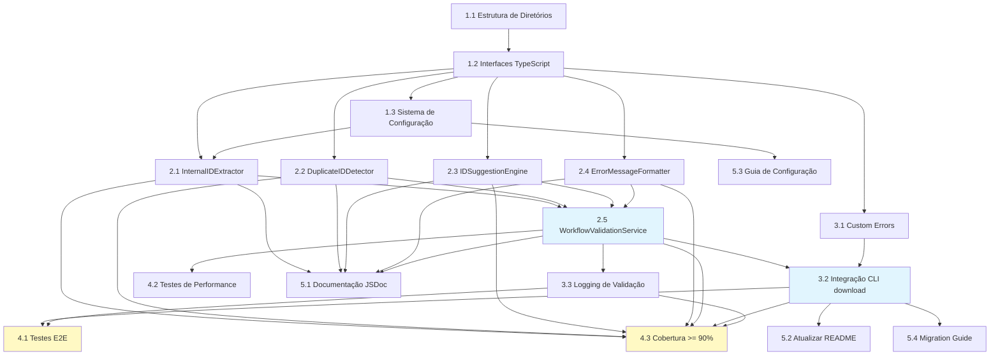

# Tarefas de Implementação - Validação de IDs Duplicados em Workflows

> **Contexto do Prisma**: Este arquivo de tarefas faz parte do Sistema Prisma de desenvolvimento orientado a especificações. Para entender o contexto completo da migração e convenções do projeto, leia `.prisma/tarefas.md`.

## Metadados

- **Nome da Funcionalidade**: Validação de IDs Duplicados em Workflows
- **Criado em**: 2025-10-17
- **Última Atualização**: 2025-10-17
- **Status**: Não Iniciado
- **Localização**: `.prisma/projeto/especificacoes/validacao-ids-duplicados-workflow/tarefas.md`
- **Baseado nos Documentos**:
  - **Requisitos**: [requisitos.md](./requisitos.md) v0.1.0
  - **Design**: [design.md](./design.md) v0.1.0
- **Agentes Envolvidos**: implementador, testador, revisor

## Visão Geral das Tarefas

### Resumo

Implementar sistema de validação automática de IDs duplicados em workflows do n8n, incluindo:
- Extração de IDs internos usando regex configurável
- Detecção de duplicatas com algoritmo O(n)
- Geração automática de sugestões sequenciais
- Formatação de mensagens de erro user-friendly
- Integração transparente com comando CLI de download

### Total de Tarefas: 18

### Tempo Estimado: 28 horas

### Prioridade: Alta

## Plano de Implementação

### Fase 1: Configuração e Infraestrutura

- [ ] **1.1** Criar estrutura de diretórios para o módulo de validação
  - Criar `src/services/validation/` para serviços de validação
  - Criar `src/services/validation/__tests__/` para testes
  - Criar `src/types/validation.ts` para interfaces TypeScript
  - Configurar barrels (index.ts) para exports
  - **Tempo Estimado**: 0.5h
  - **Dependências**: Nenhuma
  - **Requisitos**: Todos (setup base)

- [ ] **1.2** Configurar interfaces TypeScript para validação
  - Definir interface `N8NWorkflow` baseada na API do n8n
  - Definir interface `ValidationResult` com duplicatas e metadata
  - Definir interface `DuplicateInfo` e `EnrichedDuplicateInfo`
  - Definir interface `ValidationConfig` para configurações
  - Criar types para error codes e exit codes
  - **Tempo Estimado**: 1h
  - **Dependências**: 1.1
  - **Requisitos**: RD-001, RD-002, RD-003

- [ ] **1.3** Configurar sistema de configuração
  - Criar schema de validação com Zod para `.jana/config.json`
  - Implementar `ConfigReader` para ler configurações
  - Adicionar validação de schema na leitura
  - Criar configuração padrão (fallback)
  - Escrever testes unitários para ConfigReader
  - **Tempo Estimado**: 2h
  - **Dependências**: 1.2
  - **Requisitos**: RD-003, RNF-004

### Fase 2: Implementação de Componentes Core

- [ ] **2.1** Implementar InternalIDExtractor
  - Criar classe `InternalIDExtractor` com regex configurável
  - Implementar método `extractInternalIDs(workflows)` retornando Map
  - Implementar método `extractSingleID(workflow)` com fallback (nome → tags)
  - Adicionar normalização de IDs (uppercase, trim)
  - Compilar regex no constructor (performance)
  - Escrever testes unitários:
    - Extração de ID válido do nome do workflow
    - Extração de ID de tags (fallback)
    - Ignorar workflows sem ID válido
    - Múltiplos workflows com IDs únicos
    - Regex customizado via config
  - **Tempo Estimado**: 3h
  - **Dependências**: 1.2, 1.3
  - **Requisitos**: RF-002, RF-008, RNF-002

- [ ] **2.2** Implementar DuplicateIDDetector
  - Criar classe `DuplicateIDDetector`
  - Implementar método `findDuplicates(idMap)` retornando array de DuplicateInfo
  - Implementar método `isDuplicate(internalID, idMap)` helper
  - Ordenar duplicatas por severidade (count desc)
  - Otimizar para O(n) complexity usando Map
  - Escrever testes unitários:
    - Detectar nenhuma duplicata
    - Detectar 1 duplicata (2 workflows)
    - Detectar múltiplas duplicatas
    - Ordenação por severidade
    - Edge case: 10+ ocorrências do mesmo ID
  - **Tempo Estimado**: 2h
  - **Dependências**: 1.2
  - **Requisitos**: RF-003, RNF-001, RNF-002

- [ ] **2.3** Implementar IDSuggestionEngine
  - Criar classe `IDSuggestionEngine`
  - Implementar método `enrichWithSuggestions(duplicates, idMap)`
  - Implementar método `suggestNextID(internalID, usedIDs)`
  - Implementar algoritmo de busca de gaps sequenciais
  - Suportar zero-padding (001, 002, ..., 999)
  - Gerar até 3 sugestões por duplicata
  - Escrever testes unitários:
    - Sugerir próximo ID sequencial
    - Encontrar gaps na sequência (001, 003 → sugerir 002)
    - Limite de 999 (retornar null se esgotado)
    - Múltiplas sugestões por duplicata
    - Prefixos diferentes não interferem
  - **Tempo Estimado**: 3h
  - **Dependências**: 1.2
  - **Requisitos**: RF-004, RN-002

- [ ] **2.4** Implementar ErrorMessageFormatter
  - Criar classe `ErrorMessageFormatter`
  - Implementar método `format(duplicates)` retornando array de strings
  - Implementar método `formatSingle(duplicate)` para mensagem individual
  - Usar emojis para melhor UX (📍, ❌, 💡, →)
  - Incluir sugestões inline para cada workflow duplicado
  - Formatar com numeração e estrutura clara
  - Escrever testes unitários:
    - Formatação de 1 duplicata
    - Formatação de múltiplas duplicatas
    - Mensagem inclui todos os n8n IDs
    - Mensagem inclui sugestões
    - Formatação é user-friendly
  - **Tempo Estimado**: 2h
  - **Dependências**: 1.2
  - **Requisitos**: RF-005, RNF-003

- [ ] **2.5** Implementar WorkflowValidationService (orquestrador)
  - Criar classe `WorkflowValidationService`
  - Implementar método `validateWorkflows(workflows)` com throw em duplicatas
  - Implementar método `validateWorkflowsNonBlocking(workflows)` sem throw
  - Integrar todos os componentes (Extractor → Detector → Suggester → Formatter)
  - Adicionar logging via Winston
  - Implementar fail-fast (interrompe no primeiro erro)
  - Escrever testes unitários:
    - Validação com sucesso (sem duplicatas)
    - Validação falha (com duplicatas) - throw ValidationError
    - NonBlocking retorna report sem throw
    - Logging de duplicatas
    - Performance: validar 100 workflows em < 100ms
  - **Tempo Estimado**: 3h
  - **Dependências**: 2.1, 2.2, 2.3, 2.4
  - **Requisitos**: RF-001, RF-003, RF-006, RNF-001

### Fase 3: Integração com CLI

- [ ] **3.1** Criar custom errors
  - Implementar classe `ValidationError` extends Error
  - Adicionar propriedades: `messages`, `duplicates`, `exitCode`
  - Implementar classe `N8NConnectionError` para erros de API
  - Implementar classe `ConfigError` para erros de configuração
  - Escrever testes para cada error class
  - **Tempo Estimado**: 1h
  - **Dependências**: 1.2
  - **Requisitos**: Tratamento de erros

- [ ] **3.2** Integrar validação no comando `download`
  - Localizar arquivo do comando `download` (ex: `src/commands/download.ts`)
  - Importar `WorkflowValidationService` e dependências
  - Adicionar validação após fetch de workflows do n8n
  - Implementar tratamento de `ValidationError` (display + exit 1)
  - Adicionar flag `--skip-validation` (bypass com warning)
  - Adicionar flag `--dry-run` (valida sem salvar)
  - Escrever testes de integração:
    - Download com sucesso (sem duplicatas)
    - Download falha (com duplicatas) - exit code 1
    - `--skip-validation` permite bypass
    - `--dry-run` valida sem persistir
  - **Tempo Estimado**: 3h
  - **Dependências**: 2.5, 3.1
  - **Requisitos**: RF-001, RF-006, RN-001

- [ ] **3.3** Implementar logging de validação
  - Criar arquivo de log `.jana/logs/validation-errors.json`
  - Implementar `ValidationReportGenerator` para salvar JSON estruturado
  - Adicionar timestamp, totalWorkflows, duplicatesFound
  - Incluir array completo de duplicatas com sugestões
  - Escrever testes:
    - Log é criado quando duplicatas detectadas
    - Log tem formato JSON válido
    - Log contém todos os campos esperados
  - **Tempo Estimado**: 2h
  - **Dependências**: 2.5
  - **Requisitos**: RF-007, RD-003

### Fase 4: Testes Abrangentes

- [ ] **4.1** Escrever testes de integração end-to-end
  - Criar suite de testes E2E em `src/__tests__/integration/`
  - Mock da API do n8n com `nock`
  - Cenário 1: Download 50 workflows únicos (sucesso)
  - Cenário 2: Download com 2 IDs duplicados (falha)
  - Cenário 3: Download com 5+ duplicatas (mensagem truncada?)
  - Cenário 4: Workflow sem ID válido (deve ignorar)
  - Cenário 5: Usar `--skip-validation` com duplicatas (warning + sucesso)
  - Verificar exit codes (0, 1, 2, 3)
  - Verificar arquivo de log criado
  - **Tempo Estimado**: 4h
  - **Dependências**: 3.2, 3.3
  - **Requisitos**: Todos os requisitos funcionais

- [ ] **4.2** Escrever testes de performance
  - Benchmark: Validar 100 workflows em < 100ms
  - Benchmark: Validar 500 workflows em < 500ms
  - Benchmark: Validar 1000 workflows em < 2s
  - Medir overhead: (tempo validação / tempo total) < 5%
  - Verificar complexidade O(n) na prática
  - Documentar resultados em `performance-report.md`
  - **Tempo Estimado**: 2h
  - **Dependências**: 2.5
  - **Requisitos**: RNF-001

- [ ] **4.3** Atingir cobertura de testes >= 90%
  - Executar `npm run test:coverage`
  - Identificar código não coberto
  - Adicionar testes para edge cases:
    - IDs com padrões incomuns
    - Workflows com nomes vazios
    - Workflows inativos
    - Múltiplos padrões de ID no mesmo workflow
  - Verificar cobertura >= 90% em todos os arquivos do módulo
  - **Tempo Estimado**: 2h
  - **Dependências**: 2.1, 2.2, 2.3, 2.4, 2.5, 3.2, 3.3
  - **Requisitos**: RNF-005

### Fase 5: Documentação e Finalização

- [ ] **5.1** Documentar código com JSDoc
  - Adicionar comentários JSDoc em todas as classes e métodos públicos
  - Documentar parâmetros, retornos, throws
  - Incluir exemplos de uso em docstrings
  - Gerar documentação com TypeDoc (se configurado)
  - **Tempo Estimado**: 2h
  - **Dependências**: Fase 2 completa
  - **Requisitos**: RNF-005

- [ ] **5.2** Atualizar README da CLI
  - Adicionar seção "Validação de IDs Duplicados"
  - Documentar comando `download` e flags:
    - `--skip-validation`
    - `--dry-run`
    - `--config <path>`
  - Incluir exemplos de uso
  - Documentar formato de mensagens de erro
  - Adicionar troubleshooting
  - **Tempo Estimado**: 1h
  - **Dependências**: 3.2
  - **Requisitos**: Documentação

- [ ] **5.3** Criar guia de configuração
  - Documentar formato de `.jana/config.json`
  - Explicar campo `validation.idPattern` com regex examples
  - Documentar campos `strict`, `maxDuplicates`, `logPath`
  - Incluir exemplos de configurações customizadas
  - Criar FAQ para problemas comuns
  - **Tempo Estimado**: 1h
  - **Dependências**: 1.3
  - **Requisitos**: RD-003

- [ ] **5.4** Criar migration guide (se aplicável)
  - Documentar mudanças no comando `download`
  - Explicar novo comportamento (validação bloqueante)
  - Fornecer workaround para usuários que querem comportamento antigo
  - Adicionar changelog entry
  - **Tempo Estimado**: 0.5h
  - **Dependências**: 3.2
  - **Requisitos**: Documentação

## Dependências entre Tarefas

## Gestão de Riscos

### Tarefas de Alto Risco

1. **Tarefa 2.5** (WorkflowValidationService): Orquestração complexa de múltiplos componentes
   - **Impacto**: Alta
   - **Mitigação**: Testes unitários rigorosos, mock de dependências, revisão por pares

2. **Tarefa 3.2** (Integração CLI): Modificação de comando crítico existente
   - **Impacto**: Alta
   - **Mitigação**: Feature flag (`--skip-validation`), testes de regressão, rollout gradual

3. **Tarefa 4.2** (Performance): Pode não atingir metas de performance
   - **Impacto**: Média
   - **Mitigação**: Benchmark early, otimizar estruturas de dados, considerar caching

### Tarefas Bloqueadas

- Nenhuma tarefa atualmente bloqueada

### Dependências Externas

- **n8n API**: Disponibilidade e formato de response (assumido estável)
- **Winston**: Biblioteca de logging (já instalada?)
- **Zod**: Validação de schema (instalar se necessário)

## Notas de Implementação

### Convenções de Código

- **Estilo**: Seguir ESLint/Prettier configurado no projeto
- **Naming**: PascalCase para classes, camelCase para métodos/variáveis
- **Imports**: Usar imports absolutos (`@/services/validation`)
- **Errors**: Sempre usar custom errors (não throw strings)

### Estratégia de Testes

- **Unit Tests**: Vitest com mocks (coverage >= 90%)
- **Integration Tests**: Vitest com `nock` para mock HTTP
- **E2E Tests**: Testes reais do comando CLI (spawn process)
- **Performance Tests**: `performance.now()` para benchmarking

### Git Workflow

- **Branch**: `feat/validacao-ids-duplicados-workflow`
- **Sub-branches**: `feat/validacao-ids-duplicados-workflow/task-{numero}` para cada tarefa
- **Commits**: Conventional Commits (`feat:`, `test:`, `docs:`)
- **PR**: Um PR por fase (ou por epic task)

### Execução Paralela

**Tarefas que podem rodar em paralelo**:

**Fase 2**:
- `2.1`, `2.2`, `2.3`, `2.4` podem ser desenvolvidos simultaneamente (sem dependências entre si)
- `2.5` depende de todos acima

**Fase 3**:
- `3.1` pode rodar em paralelo com `2.5` (se interfaces já definidas)
- `3.3` pode rodar em paralelo com `3.2`

**Fase 5**:
- `5.1`, `5.2`, `5.3`, `5.4` podem rodar em paralelo (documentação)

## Acompanhamento de Progresso

- **Total de Tarefas**: 18
- **Concluídas**: 0
- **Em Progresso**: 0
- **Bloqueadas**: 0
- **Não Iniciadas**: 18
- **Progresso**: 0%

### Progresso por Fase

| Fase | Tarefas | Concluídas | Progresso |
|------|---------|------------|-----------|
| Fase 1 | 3 | 0 | 0% |
| Fase 2 | 5 | 0 | 0% |
| Fase 3 | 3 | 0 | 0% |
| Fase 4 | 3 | 0 | 0% |
| Fase 5 | 4 | 0 | 0% |

## Workflow de Agentes

### Agentes Principais

- **implementador**: Implementação de código (Fases 1-3, 5)
- **testador**: Criação e execução de testes (Fase 4)
- **revisor**: Revisão de código e qualidade (pós-implementação)
- **documentador**: Documentação técnica (Fase 5)

### Estrutura de Artefatos

Artefatos relacionados a esta especificação devem ser armazenados em:

- **Relatórios**: `.prisma/projeto/especificacoes/validacao-ids-duplicados-workflow/relatorios/`
- **Decisões**: `.prisma/projeto/especificacoes/validacao-ids-duplicados-workflow/decisoes/`
- **Artefatos**: `.prisma/projeto/especificacoes/validacao-ids-duplicados-workflow/artefatos/`

### Logs de Execução

- **Performance Reports**: `artefatos/performance-report.md`
- **Test Coverage**: `artefatos/coverage-report.html`
- **Validation Errors (runtime)**: `.jana/logs/validation-errors.json`

## Critérios de Conclusão

A feature será considerada **concluída** quando:

- [x] Todas as 18 tarefas estão marcadas como concluídas
- [x] Cobertura de testes >= 90%
- [x] Todos os testes (unit, integration, E2E) passando
- [x] Performance atende requisitos (< 100ms para 100 workflows)
- [x] Documentação completa (README, JSDoc, guias)
- [x] Code review aprovado
- [x] Nenhum bug crítico ou blocker

---

**Última Atualização**: 2025-10-17
**Próxima Revisão**: A ser agendada após início da implementação
**Estimativa Total**: 28 horas (~3.5 dias de trabalho)
**Branch**: `feat/validacao-ids-duplicados-workflow`
