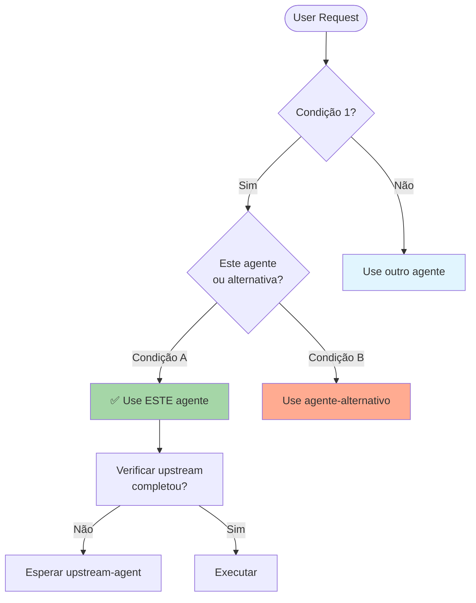

# Agent Activation Context Template

Este template define o formato padrão para seções de activation context em todos os agentes Prisma.

## 🎯 Quando Usar Este Agente

**Triggers Concretos** (invoque automaticamente quando):

- **Trigger 1**: [Condição específica com exemplo]
  - Exemplo: "Quando usuário diz 'criar requirements para {feature}'"
  - Detecção: Verificar se `.prisma/especificacoes/{feature}/requisitos.md` não existe
- **Trigger 2**: [Condição específica com exemplo]
  - Exemplo: "Quando spec-decision aprova fase X"
  - Detecção: Arquivo `phase-X-approved.flag` existe
- **Trigger 3**: [Condição específica com exemplo]
  - Exemplo: "Quando há N+ versões de documento"
  - Detecção: Glob pattern `requirements_v*.md` retorna 2+ arquivos

**User Requests** (usuário solicita explicitamente):

- "create requirements for..."
- "update design of..."
- "validate compliance on..."
- [Adicione frases exatas que usuários usam]

**System Conditions** (condições automáticas do sistema):

- Arquivo X existe OU não existe
- Score Y ≥ threshold Z
- N versões de documento criadas
- [Adicione condições verificáveis programaticamente]

---

## 🚫 NÃO Usar Este Agente Quando

**Anti-Patterns** (delegar para outro agente):

- ❌ **Anti-pattern 1**: [Descrição do que NÃO fazer]
  - **Use instead**: `{agent-name}` → [Razão clara]
  - **Exemplo**: "Se precisa validar CÓDIGO, não specs" → Use `standards`

- ❌ **Anti-pattern 2**: [Descrição do que NÃO fazer]
  - **Use instead**: `{agent-name}` → [Razão clara]
  - **Exemplo**: "Se há apenas 1 versão" → Pule para `spec-decision`

- ❌ **Anti-pattern 3**: [Descrição do que NÃO fazer]
  - **Use instead**: `{agent-name}` → [Razão clara]
  - **Exemplo**: "Se precisa criar CÓDIGO executável" → Use `spec-impl`

**Wrong Timing** (timing incorreto no workflow):

- ⏰ **Muito cedo**: [Quando é cedo demais]
  - Exemplo: "Antes de requirements aprovadas" → Espere `spec-decision` aprovar
- ⏰ **Muito tarde**: [Quando é tarde demais]
  - Exemplo: "Após deployment" → Deveria ter sido usado antes

---

## 🔗 Agentes Relacionados

### Upstream (dependências - executar ANTES)

- **`{agent-name}`**: [Descrição da relação]
  - **O que recebo**: [Outputs do upstream usado como inputs]
  - **Por que preciso**: [Justificativa da dependência]
  - **Exemplo**: `spec-requirements` precisa de `spec-elicitation` para garantir alinhamento arquitetural

### Downstream (dependentes - executar DEPOIS)

- **`{agent-name}`**: [Descrição da relação]
  - **O que forneço**: [Outputs meus usados como inputs do downstream]
  - **Por que ele precisa**: [Justificativa da dependência]
  - **Exemplo**: `spec-design` depende de `spec-requirements` para criar arquitetura baseada em requisitos

### Overlapping (conflitos - escolher 1)

- **`{agent-name}` vs `{este-agente}`**: [Decision criteria]
  - **Use `{agent-name}` quando**: [Condição específica]
  - **Use `{este-agente}` quando**: [Condição específica]
  - **Exemplo**:
    - Use `code-tests` quando: **ANTES** de implementação (TDD setup)
    - Use `spec-test` quando: **DEPOIS** de implementação (validação final)

---

## 📊 Decision Tree (Visual)



---

## 📋 Checklist de Invocação

Antes de invocar este agente, verificar:

- [ ] **Upstream completo?** {upstream-agent-1} terminou?
- [ ] **Inputs disponíveis?** Arquivos X, Y, Z existem?
- [ ] **Timing correto?** Fase atual é {fase-esperada}?
- [ ] **Alternativas descartadas?** Não é caso de {agente-alternativo}?
- [ ] **User approval?** (se necessário) Aprovação explícita recebida?

---

## 🎓 Exemplos de Uso Correto

### ✅ Exemplo 1: [Cenário específico]

**Contexto**: [Descrição do cenário]

**Por que correto**: [Razão de usar este agente]

**Invocação**:

```bash
*{agent-name} --param1 value1 --param2 value2
```

**Resultado esperado**: [O que deve acontecer]

---

### ✅ Exemplo 2: [Cenário específico]

**Contexto**: [Descrição do cenário]

**Por que correto**: [Razão de usar este agente]

**Invocação**:

```bash
*{agent-name} --param1 value1 --param2 value2
```

**Resultado esperado**: [O que deve acontecer]

---

## ❌ Exemplos de Uso INCORRETO

### ❌ Exemplo 1: [Cenário de erro comum]

**Contexto**: [Descrição do cenário]

**Por que INCORRETO**: [Razão de NÃO usar este agente]

**Correção**: Use `{agent-correto}` porque [justificativa]

---

### ❌ Exemplo 2: [Cenário de erro comum]

**Contexto**: [Descrição do cenário]

**Por que INCORRETO**: [Razão de NÃO usar este agente]

**Correção**: Use `{agent-correto}` porque [justificativa]

---

## 🔍 Debug: Como Identificar Invocação Incorreta

**Sintomas de invocação incorreta**:

- 🔴 **Sintoma 1**: [Como detectar erro]
  - **Causa**: [Por que aconteceu]
  - **Fix**: [Como corrigir]
- 🔴 **Sintoma 2**: [Como detectar erro]
  - **Causa**: [Por que aconteceu]
  - **Fix**: [Como corrigir]

---

## 📚 Referências

- **Spec Base**: `.prisma/especificacoes/meta-agent-improvement/requisitos.md` → FR14
- **Design Doc**: `.prisma/especificacoes/meta-agent-improvement/design.md` → Section 17
- **Related ADRs**: [Links para ADRs relevantes]
- **Overlap Guide**: `.prisma/docs/agent-overlap-guide.md`

---

**Template Version**: 1.0
**Last Updated**: 2025-10-02
**Maintainer**: spec-meta agent
