# Prisma Spec Development Workflow

## Desenvolvimento Orientado a Especificações

### Environment Configuration

**Operating System**: Windows 11
**Shell Environment**: PowerShell 7+ (pwsh.exe)
**Script Format**: Use `.ps1` scripts and PowerShell syntax
**Command Execution**: All shell commands should be PowerShell-compatible

### Overview

Workflow de desenvolvimento baseado em especificações formais que segue a metodologia Prisma para criar features robustas, testáveis e bem documentadas.

## Workflow Philosophy

### Core Principles

1. **Specification First**: Toda feature começa com requirements formais
2. **Quality Gates**: Validação rigorosa entre fases
3. **Parallel Execution**: Suporte a múltiplos agentes quando necessário
4. **Continuous Validation**: Cada fase valida contra especificações anteriores
5. **Traceable Implementation**: Mapeamento direto de requirements para código
6. **Complete Documentation**: Documentação automática após implementação

## Prisma Workflow Structure

```mermaid
graph TD
    A[User Request] --> DECISION{🧠 spec-decision}

    DECISION -->|REQUIREMENTS| B[spec-requirements]
    B --> DECISION

    DECISION -->|DESIGN| D[spec-design]
    D --> DECISION

    DECISION -->|TASKS| F[spec-tasks]
    F --> DECISION

    DECISION -->|TESTS| H[code-tests]
    H --> DECISION

    DECISION -->|STANDARDS| ST[standards]
    ST --> DECISION

    DECISION -->|IMPLEMENT| J[spec-impl]
    J --> K[code-review]
    K --> DECISION

    DECISION -->|VALIDATE| L[spec-test]
    L --> DECISION

    DECISION -->|DOCUMENT| M[spec-docs]
    M --> DECISION

    DECISION -->|COMPLIANCE| N[spec-compliance]
    N --> DECISION

    DECISION -->|AUDIT| P[audit]
    P --> Q{spec-meta}
    Q -->|Problems 2+| R[Auto-Generate Agent]
    Q -->|Simplify| S[Auto-Optimize]
    Q --> DECISION

    DECISION -->|COMPLETE| O[✅ Feature Ready]

    style DECISION fill:#ff6b6b,stroke:#c92a2a,stroke-width:4px
    style B fill:#4ecdc4,stroke:#26a69a
    style D fill:#45b7d1,stroke:#0288d1
    style F fill:#96ceb4,stroke:#66bb6a
    style H fill:#feca57,stroke:#ffa726
    style ST fill:#ff9ff3,stroke:#e91e63
    style J fill:#54a0ff,stroke:#2196f3
    style K fill:#5f27cd,stroke:#673ab7
    style L fill:#00d2d3,stroke:#00bcd4
    style M fill:#ff9f43,stroke:#ff9800
    style N fill:#ee5a6f,stroke:#f44336
    style P fill:#c44569,stroke:#9c27b0
    style Q fill:#786fa6,stroke:#3f51b5
```



## Phase 1: Requirements Gathering

### 1.1 Requirements Creation

**Agent**: spec-requirements
**Format**: EARS (Easy Approach to Requirements Syntax)
**Parallel Support**: 1-128 agents for multiple perspectives

```yaml
trigger: User describes feature need
process:
  - Load spec-system-prompt-loader
  - Initialize spec-requirements agent(s)
  - Generate requirements in EARS format
  - If parallel: Use spec-judge for selection
validation: spec-decision validates completeness and clarity
output: .prisma/especificacoes/{feature-name}/requisitos.md
```

### 1.2 Requirements Review

**Agent**: spec-decision
**Decision**: ADVANCE | REVISE | RESTART

```yaml
quality_gates:
  - All requirements in EARS format
  - User stories with acceptance criteria
  - No ambiguous language
  - Dependencies identified
```

## Phase 2: Technical Design

### 2.1 Design Creation

**Agent**: spec-design
**Input**: Approved requirements
**Parallel Support**: 1-128 agents for design alternatives

```yaml
trigger: Requirements approved by spec-decision
process:
  - Analyze requirements document
  - Research existing codebase
  - Create technical design document
  - Include architecture diagrams
  - If parallel: Judge evaluation for selection
validation: spec-decision validates technical soundness
output: .prisma/especificacoes/{feature-name}/design.md
```

### 2.2 Design Review

**Agent**: spec-decision
**Focus**: Technical architecture and feasibility

```yaml
quality_gates:
  - Architecture compatible with existing system
  - All requirements covered in design
  - Performance considerations addressed
  - Security implications documented
```

## Phase 3: Task Planning

### 3.1 Task Creation

**Agent**: spec-tasks
**Input**: Approved design
**Format**: Hierarchical task list with dependencies

```yaml
trigger: Design approved by spec-decision
process:
  - Break down design into implementable tasks
  - Identify task dependencies
  - Estimate complexity and effort
  - Create executable checklist
validation: spec-decision validates task coverage
output: .prisma/especificacoes/{feature-name}/tarefas.md
```

### 3.2 Task Review

**Agent**: spec-decision
**Focus**: Implementation completeness

```yaml
quality_gates:
  - All design components covered
  - Tasks are specific and actionable
  - Dependencies properly mapped
  - Testing tasks included
```

## Phase 4: Test Planning & Strategy Generation

### 4.1 Automated Test Generation

**Agent**: code-tests
**Input**: Approved tasks + environment detection
**Output**: Comprehensive test suite + implementation guide

```yaml
trigger: Tasks approved by spec-decision
process:
  - Detect development environment automatically
  - Generate test strategies (3-5 competitive variants)
  - Create TDD test suite using advanced patterns
  - Setup Fabric-aware testing infrastructure
  - Generate spec-specific tests directory
  - Prepare implementation guidance
validation: spec-decision validates test completeness
output: .prisma/especificacoes/{feature-name}/testes.md + tests/ directory
```

#### Environment Detection & Optimization

- **Automatic Detection**: OS, shell, package manager, frameworks
- **Tool Integration**: VSCode, testing frameworks, CI/CD setup
- **Performance Tuning**: Parallel execution, resource optimization
- **Standards Application**: Project-wide testing standards

#### Advanced Testing Architecture

- **Test Trophy Pattern**: 40% unit, 40% integration, 15% e2e, 5% contract
- **Hexagonal Architecture**: Presentation, domain, infrastructure layers
- **Domain-Driven Testing**: Organization by business domains
- **Fabric-Aware Testing**: Tier-conscious, context-sensitive tests

#### Competitive Strategy Generation

```yaml
strategy_competition:
  parallel_strategies: 3-5
  evaluation_criteria:
    - coverage_potential: 30%
    - execution_speed: 25%
    - maintainability: 20%
    - readability: 15%
    - innovation_score: 10%

  judge_integration: spec-judge
  selection_process: automatic_optimal_strategy
```

### 4.2 Test Strategy Review

**Agent**: spec-decision
**Focus**: Test strategy validation and TDD readiness

```yaml
quality_gates:
  - Test coverage strategy meets standards
  - TDD implementation guide complete
  - Environment configuration validated
  - Fabric patterns properly integrated
  - Performance benchmarks established
```

## Phase 5: Implementation

### 5.1 Implementation Execution

**Agent**: spec-impl
**Input**: Approved tasks
**Execution Modes**:

- **SEQUENTIAL**: One task at a time (default)
- **PARALLEL**: Multiple tasks when user requests
- **AUTO**: Automatic execution of all tasks

```yaml
execution_options:
  default:
    - Execute tasks sequentially
    - Mark completed in tasks.md
    - User approval between tasks

  parallel:
    - User requests specific parallel execution
    - Respect task dependencies
    - Coordinate multiple spec-impl agents

  auto:
    - Analyze dependencies in tasks.md
    - Execute independent tasks in parallel
    - Sequential for dependent tasks
```

### 4.2 Multi-Perspective Analysis

**When to Use**: Complex decisions requiring stakeholder input

**Process**: Integrated party mode discussions

```yaml
participants:
  - DEV: Technical implementation
  - QA: Testing strategy
  - PM: Business alignment
  - ARCHITECT: System design
  - SECURITY: Security considerations
  - UX: User experience
```

## Phase 5: Testing & Quality

### 5.1 Test Generation

**Agent**: spec-test
**Input**: Completed implementation

```yaml
process:
  - Generate test cases from requirements
  - Create integration tests
  - Validate acceptance criteria
  - Performance and security tests
output: Comprehensive test suite
```

## Phase 6: Documentation

### 6.1 Documentation Generation

**Agent**: spec-docs
**Target**: docs/ directory structure

```yaml
process:
  - Convert specs to user documentation
  - Generate API reference
  - Create usage examples
  - Troubleshooting guides
output: docs/{feature-name}/ complete documentation
```

## Phase 7: Compliance Validation

### 7.1 Final Compliance Check

**Agent**: spec-compliance
**Scope**: Complete feature validation

```yaml
validation:
  - File naming conventions
  - Content structure compliance
  - Process adherence verification
  - Code standards compliance
decision: Feature approval or correction requirements
```

## Feature and Sub Agent Mapping

| Feature            | Sub Agent       | Path                                                   | Parallel Support     | Status     |
| ------------------ | --------------- | ------------------------------------------------------ | -------------------- | ---------- |
| Requirements       | analista        | .prisma/especificacoes/{feature-name}/requisitos.md    | Yes (1-128)          | ✅ Core    |
| **Quality Review** | **decisor**     | **No doc, quality gates**                              | **No**               | **🆕 New** |
| Design             | designer        | .prisma/especificacoes/{feature-name}/design.md        | Yes (1-128)          | ✅ Core    |
| **Quality Review** | **decisor**     | **No doc, quality gates**                              | **No**               | **🆕 New** |
| Tasks              | planejador      | .prisma/especificacoes/{feature-name}/tarefas.md       | Yes (1-128)          | ✅ Core    |
| **Quality Review** | **decisor**     | **No doc, quality gates**                              | **No**               | **🆕 New** |
| Implementation     | implementador   | No doc, code execution                                 | Yes (parallel tasks) | ✅ Core    |
| Judge              | juiz            | No doc, evaluation only                                | Yes (tree-based)     | ✅ Core    |
| Testing            | testador        | No doc, test generation                                | No                   | ✅ Core    |
| **Documentation**  | **documentador** | **docs/{feature-name}/**                               | **No**               | **🆕 New** |
| **Compliance**     | **conformista** | **No doc, validation**                                 | **No**               | **🆕 New** |
| System Loader      | carregador      | No doc, context loading                                | No                   | ✅ Core    |

## Command Interface

### Primary Commands

```bash
# Start complete spec development
spec-dev "feature description"

# Continue from specific phase
spec-dev --resume-from design

# Party mode for decisions
spec-party "decision topic"

# Review current phase
spec-decision --phase current

# Validate compliance
spec-compliance --feature {name}
```

## Quality Assurance

### Automatic Quality Gates

- **Requirements**: EARS format, completeness, clarity
- **Design**: Technical feasibility, requirement coverage
- **Tasks**: Implementation completeness, dependency mapping
- **Implementation**: Code quality, test coverage
- **Documentation**: User-friendly, complete coverage
- **Compliance**: Standards adherence, process validation

### Success Metrics

- **Requirement Coverage**: % of EARS requirements implemented
- **Design Adherence**: Implementation matches design specifications
- **Task Completion**: All tasks.md items completed
- **Test Coverage**: Automated tests for all requirements
- **Documentation**: Complete user and technical documentation

## Best Practices

1. **Always Start with Requirements**: Even for simple features
2. **Use Parallel Agents for Exploration**: Multiple perspectives prevent blind spots
3. **Respect Quality Gates**: Don't skip spec-decision validations
4. **Maintain Documentation**: Keep specs and docs synchronized
5. **Follow Compliance Standards**: Use spec-compliance for consistency

## Quick Start Example

```bash
# 1. Start new feature development
spec-dev "add user notification preferences"

# 2. System creates requirements with 3 agents
# 3. spec-judge selects best requirements
# 4. spec-decision validates and approves
# 5. Continue through design, tasks, implementation
# 6. Automatic documentation and compliance validation
# 7. Audit performs meta-analysis and optimization
# 8. spec-meta auto-generates improvements if patterns detected
# 9. Feature complete with continuous system evolution
```

---

**Prisma Workflow**: Specification-driven development that ensures quality, traceability, and maintainability through formal processes and automated validation.
