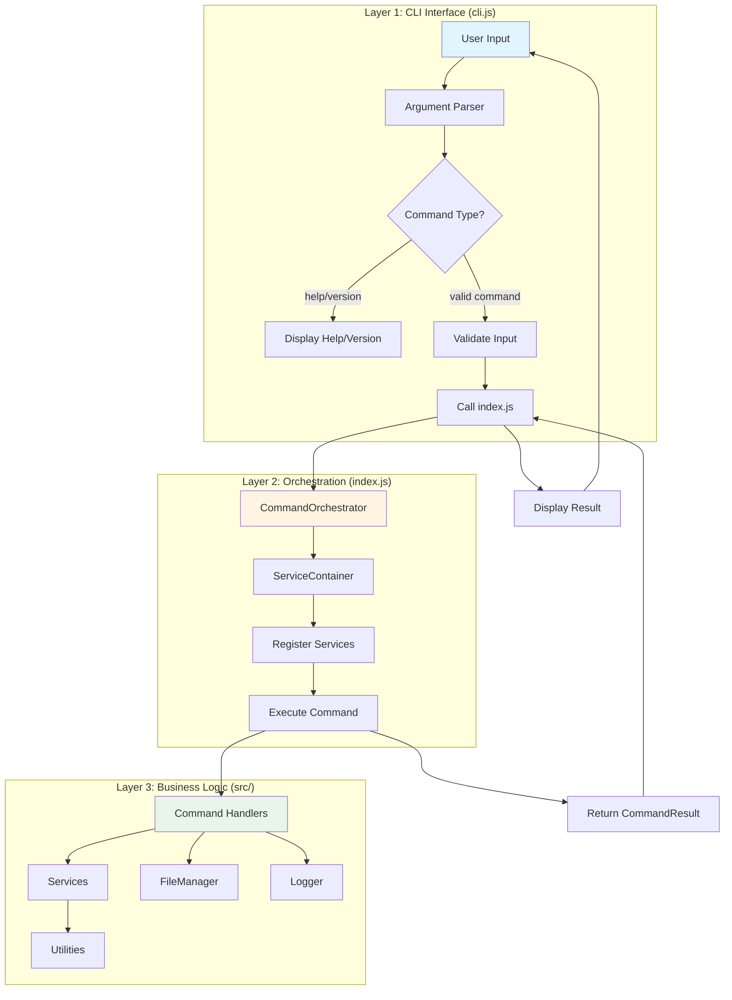
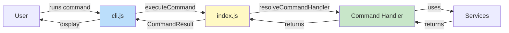
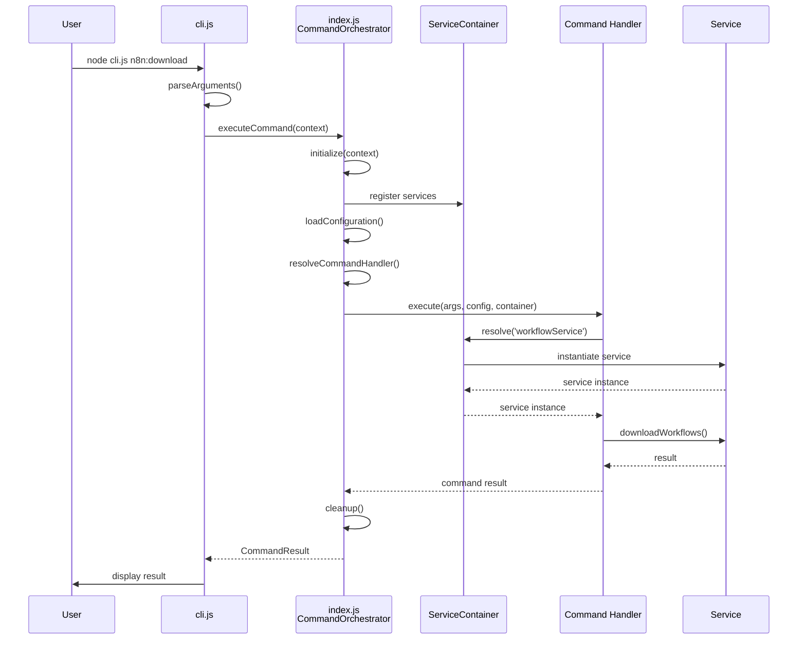

# CLI Architecture

> Comprehensive documentation for the docs-jana CLI architecture
> Version: 2.0.0 | Last Updated: 2025-10-01

## Table of Contents

- [Overview](#overview)
- [Architecture Layers](#architecture-layers)
- [System Architecture](#system-architecture)
- [Data Flow](#data-flow)
- [Component Details](#component-details)
- [Interfaces](#interfaces)
- [Usage Examples](#usage-examples)
- [Adding New Commands](#adding-new-commands)

---

## Overview

The docs-jana CLI architecture follows a **three-layer design** that separates user interaction, orchestration logic, and business logic into distinct layers with clear responsibilities.

### Design Principles

1. **Separation of Concerns**: CLI interface, orchestration, and business logic are separated
2. **Dependency Injection**: Services are injected via ServiceContainer
3. **Service Locator Pattern**: Centralized service management with lazy instantiation
4. **Zero Breaking Changes**: Fully backward compatible with existing code
5. **Programmatic API**: index.js can be used outside CLI context

### Key Benefits

- ✅ **Testability**: Each layer can be tested independently
- ✅ **Maintainability**: Clear separation makes code easier to understand
- ✅ **Reusability**: Orchestration layer can be used programmatically
- ✅ **Performance**: Minimal overhead (~1ms average)
- ✅ **Extensibility**: Easy to add new commands and services

---

## Architecture Layers



### Layer 1: CLI Interface

**File**: [`cli.js`](../../cli.js)

**Responsibilities**:
- Parse command-line arguments (`process.argv`)
- Display help, version, error messages
- Interactive menu when no arguments provided
- Invoke orchestration layer
- Display results to user

**Characteristics**:
- **Thin layer**: Minimal business logic
- **User-facing**: All user interaction happens here
- **Synchronous**: Argument parsing is fast and synchronous

### Layer 2: Orchestration

**File**: [`index.js`](../../index.js)

**Responsibilities**:
- Coordinate command execution
- Manage service lifecycle (initialize → run → cleanup)
- Dependency injection via ServiceContainer
- Configuration loading
- Error handling and structured logging

**Characteristics**:
- **Orchestration logic**: Coordinates services and commands
- **Asynchronous**: All execution is async/await
- **Testable**: Fully testable with mocks
- **Reusable**: Can be used outside CLI (programmatically)

### Layer 3: Business Logic

**Directory**: [`src/`](../../src/)

**Responsibilities**:
- Command implementations ([`src/commands/`](../../src/commands/))
- Business services ([`src/services/`](../../src/services/))
- Utilities ([`src/utils/`](../../src/utils/))
- Factories ([`src/factories/`](../../src/factories/), [`src/auth/`](../../src/auth/))

**Characteristics**:
- **Unchanged**: Existing codebase preserved
- **Well-tested**: Has comprehensive unit tests
- **Design patterns**: Factory, Strategy, Dependency Injection

---

## System Architecture

### High-Level Architecture



### Entry Points

| Entry Point | Purpose | Used By |
|-------------|---------|---------|
| `cli.js` | Command-line interface | End users, npm scripts |
| `index.js` | Programmatic API | Scripts, tests, integrations |

**Example - CLI Usage:**
```bash
node cli.js n8n:download --tag production
```

**Example - Programmatic Usage:**
```javascript
const { executeCommand } = require('./index.js');

const result = await executeCommand({
  command: 'n8n:download',
  args: ['--tag', 'production'],
  flags: { verbose: true },
  env: process.env
});

if (result.success) {
  console.log('Success:', result.message);
} else {
  console.error('Error:', result.error);
}
```

---

## Data Flow

### Complete Execution Flow



### Argument Parsing Flow

```javascript
// Input: ['node', 'cli.js', 'n8n:download', '--tag', 'production', '--verbose']

parseArguments(argv) {
  // Step 1: Extract command
  command = 'n8n:download'

  // Step 2: Extract remaining args
  args = ['--tag', 'production', '--verbose']

  // Step 3: Parse flags
  flags = { verbose: true }

  // Step 4: Build context
  return {
    command: 'n8n:download',
    args: ['--tag', 'production'],
    flags: { verbose: true },
    env: process.env
  }
}
```

---

## Component Details

### ServiceContainer

**Purpose**: Centralized service registry with lazy instantiation and caching.

**Pattern**: Service Locator

**Key Methods**:
```javascript
// Register a service factory
container.register('logger', (config) => new Logger(config));

// Resolve service (creates if first call, returns cached otherwise)
const logger = container.resolve('logger', { level: 'debug' });

// Clear all cached instances
container.clear();

// Check if service is registered
const hasLogger = container.has('logger');

// Get list of registered service names
const services = container.getRegisteredServices();
```

**Lifecycle**:
1. **Registration**: Services registered during orchestrator initialization
2. **Resolution**: Services instantiated on first `resolve()` call
3. **Caching**: Subsequent `resolve()` calls return cached instance
4. **Cleanup**: `clear()` called in orchestrator cleanup

### CommandOrchestrator

**Purpose**: Coordinates command execution lifecycle.

**Lifecycle Phases**:

```javascript
// Phase 1: Initialize
orchestrator.initialize(context);
// - Creates logger
// - Registers services
// - Logs initialization

// Phase 2: Run
const result = await orchestrator.run(context);
// - Loads configuration
// - Resolves command handler
// - Executes command
// - Returns result

// Phase 3: Cleanup
orchestrator.cleanup();
// - Clears service cache
// - Releases resources
```

**Registered Services**:
- `logger`: Logging service
- `httpClient`: HTTP client with retry logic
- `fileManager`: File operations
- `configManager`: Configuration management

### executeCommand() API

**Purpose**: Public API for command execution.

**Signature**:
```javascript
/**
 * Execute a command with given context
 * @param {CommandContext} context - Command execution context
 * @returns {Promise<CommandResult>} Result object
 */
async function executeCommand(context)
```

**Implementation**:
```javascript
async function executeCommand(context) {
  const container = new ServiceContainer();
  const orchestrator = new CommandOrchestrator(container);

  try {
    orchestrator.initialize(context);
    const result = await orchestrator.run(context);
    return {
      success: true,
      message: `Command '${context.command}' completed successfully`,
      data: result
    };
  } catch (error) {
    return {
      success: false,
      message: error.message,
      error: {
        code: error.code || 'EXECUTION_ERROR',
        message: error.message
      }
    };
  } finally {
    orchestrator.cleanup();
  }
}
```

---

## Interfaces

### CommandContext

```javascript
/**
 * @typedef {Object} CommandContext
 * @property {string} command - Command name (e.g., 'n8n:download')
 * @property {string[]} args - Command arguments
 * @property {Object} flags - Parsed flags (verbose, debug, dry-run, etc.)
 * @property {Object} env - Environment variables
 */
```

**Example**:
```javascript
{
  command: 'n8n:download',
  args: ['--tag', 'production', '--output', './workflows'],
  flags: {
    verbose: true,
    debug: false,
    dryRun: false
  },
  env: process.env
}
```

### CommandResult

```javascript
/**
 * @typedef {Object} CommandResult
 * @property {boolean} success - Whether command succeeded
 * @property {string} message - Result message
 * @property {*} [data] - Result data (on success)
 * @property {CommandError} [error] - Error details (on failure)
 */
```

**Success Example**:
```javascript
{
  success: true,
  message: "Command 'n8n:download' completed successfully",
  data: {
    workflows: 42,
    duration: 1523
  }
}
```

**Error Example**:
```javascript
{
  success: false,
  message: "Configuration error: Missing N8N_API_KEY",
  error: {
    code: 'EXECUTION_ERROR',
    message: 'Configuration error: Missing N8N_API_KEY'
  }
}
```

### CommandError

```javascript
/**
 * @typedef {Object} CommandError
 * @property {string} code - Error code (INVALID_CONTEXT, EXECUTION_ERROR, etc.)
 * @property {string} message - Error message
 */
```

---

## Usage Examples

### Example 1: CLI Usage

```bash
# Show help
node cli.js --help

# Show version
node cli.js --version

# Download N8N workflows
node cli.js n8n:download --tag production

# Upload workflows (dry run)
node cli.js n8n:upload --input ./workflows --dry-run

# Download Outline docs with verbose logging
node cli.js outline:download --verbose
```

### Example 2: Programmatic Usage

```javascript
const { executeCommand } = require('./index.js');

// Execute command programmatically
async function downloadWorkflows() {
  const result = await executeCommand({
    command: 'n8n:download',
    args: ['--tag', 'production', '--output', './my-workflows'],
    flags: { verbose: true },
    env: process.env
  });

  if (result.success) {
    console.log('✅ Downloaded workflows:', result.data);
  } else {
    console.error('❌ Error:', result.error);
  }
}

downloadWorkflows();
```

### Example 3: Using ServiceContainer

```javascript
const { ServiceContainer } = require('./index.js');
const Logger = require('./src/utils/logger');

// Create container
const container = new ServiceContainer();

// Register custom service
container.register('myService', (config) => {
  return {
    doSomething: () => console.log('Doing something with', config)
  };
});

// Resolve and use
const service = container.resolve('myService', { name: 'test' });
service.doSomething(); // Doing something with { name: 'test' }

// Service is cached - same instance returned
const service2 = container.resolve('myService');
console.log(service === service2); // true
```

---

## Adding New Commands

### Step 1: Create Command Handler

Create file in `src/commands/`:

```javascript
// src/commands/my-new-command.js

/**
 * Execute my new command
 * @param {string[]} args - Command arguments
 * @param {Object} config - Configuration object
 * @param {ServiceContainer} container - Service container
 */
async function execute(args, config, container) {
  // Resolve services from container
  const logger = container.resolve('logger');
  const fileManager = container.resolve('fileManager');

  logger.info('Executing my new command');

  // Your command logic here

  return {
    status: 'success',
    message: 'Command completed'
  };
}

module.exports = { execute };
```

### Step 2: Register Command

Add to `index.js` command map:

```javascript
// In CommandOrchestrator.resolveCommandHandler()
const commandMap = {
  'n8n:download': './src/commands/n8n-download',
  'n8n:upload': './src/commands/n8n-upload',
  'outline:download': './src/commands/outline-download',
  'my:command': './src/commands/my-new-command'  // Add here
};
```

### Step 3: Add Help Text

Add to `cli.js` help message:

```javascript
// In printHelp() function
  My Commands:
    my:command            Description of my command
                          Aliases: my:cmd
```

### Step 4: Test

```bash
# Test CLI
node cli.js my:command --help

# Test programmatically
node -e "
const { executeCommand } = require('./index.js');
executeCommand({ command: 'my:command', args: [], flags: {}, env: process.env })
  .then(r => console.log(r));
"
```

---

## Performance

### Overhead Benchmarks

Orchestration layer overhead measured across 100 iterations:

| Metric | Value |
|--------|-------|
| Average | **1.08ms** |
| Median | 0.28ms |
| Min | 0.15ms |
| Max | 76.03ms |
| Threshold | 50ms |
| **Result** | ✅ **PASS** (97.8% under budget) |

### Performance Characteristics

- ✅ **Minimal overhead**: ~1ms average execution time
- ✅ **Lazy instantiation**: Services only created when needed
- ✅ **Caching**: Service instances reused across same execution
- ✅ **Cleanup**: Resources properly released after execution

---

## Related Documentation

- **[Service Factory Pattern](./SERVICE-FACTORY.md)** - Detailed service management documentation
- **[Scripts Documentation](../../scripts/README.md)** - Utility scripts and admin tools
- **[CLI Learning Guide](../../LEARNING-CLI.md)** - Understanding CLI internals
- **[Main README](../../README.md)** - Project overview and quick start

---

## Change History

| Version | Date | Changes |
|---------|------|---------|
| 2.0.0 | 2025-10-01 | CLI architecture refactor with orchestration layer |
| 1.0.0 | 2025-01-15 | Initial CLI implementation |

---

**Last Updated**: 2025-10-01
**Maintained By**: Jana Team
**License**: MIT
