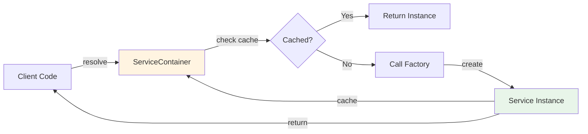

# Service Factory & Dependency Injection

> Comprehensive guide to service management patterns in docs-jana
> Version: 2.0.0 | Last Updated: 2025-10-01

## Table of Contents

- [Overview](#overview)
- [Service Locator Pattern](#service-locator-pattern)
- [ServiceContainer](#servicecontainer)
- [ServiceFactory Integration](#servicefactory-integration)
- [Dependency Injection](#dependency-injection)
- [Best Practices](#best-practices)
- [Advanced Usage](#advanced-usage)
- [Troubleshooting](#troubleshooting)

---

## Overview

The docs-jana project uses a combination of **Service Locator** and **Dependency Injection** patterns to manage service dependencies in a clean, testable, and maintainable way.

### Design Patterns Used

| Pattern | Purpose | Implementation |
|---------|---------|----------------|
| **Service Locator** | Centralized service registry | `ServiceContainer` class |
| **Factory** | Service instantiation | `ServiceFactory` in src/factories/ |
| **Dependency Injection** | Loose coupling | Constructor injection |
| **Lazy Instantiation** | Performance optimization | Services created on first use |
| **Singleton (per execution)** | Resource efficiency | One instance per command execution |

### Key Benefits

- ✅ **Testability**: Easy to mock services in tests
- ✅ **Flexibility**: Services can be replaced without changing consumers
- ✅ **Performance**: Lazy instantiation - only create what you use
- ✅ **Maintainability**: Centralized service configuration
- ✅ **Type Safety**: JSDoc provides IDE autocomplete

---

## Service Locator Pattern

### What is Service Locator?

The Service Locator pattern provides a **centralized registry** where services can be registered and resolved. This allows:

1. **Decoupling**: Consumers don't need to know how to create services
2. **Centralization**: All service creation logic in one place
3. **Flexibility**: Easy to swap implementations (production vs test)

### Pattern Diagram



### When to Use

Use Service Locator when:
- ✅ You have multiple services with complex dependencies
- ✅ You need to control service lifecycle centrally
- ✅ You want to easily mock services in tests
- ✅ You need lazy instantiation for performance

Avoid when:
- ❌ You have simple, one-off dependencies (use direct instantiation)
- ❌ Service dependencies are static and never change

---

## ServiceContainer

### Class Overview

**Location**: [`index.js`](../../index.js)

```javascript
class ServiceContainer {
  constructor() {
    this.factories = new Map();  // Service factories
    this.instances = new Map();  // Cached instances
  }

  register(name, factory) { }
  resolve(name, config) { }
  clear() { }
  has(name) { }
  getRegisteredServices() { }
}
```

### API Reference

#### `register(name, factory)`

Register a service factory.

**Parameters**:
- `name` (string): Unique service identifier
- `factory` (function): Factory function that creates the service

**Example**:
```javascript
const container = new ServiceContainer();

// Register with config parameter
container.register('logger', (config) => {
  return new Logger(config.level || 'info');
});

// Register without config
container.register('httpClient', () => {
  return new HttpClient({ timeout: 30000 });
});
```

**Validation**:
```javascript
// ❌ Invalid: missing name
container.register('', factory); // Throws error

// ❌ Invalid: name not a string
container.register(123, factory); // Throws error

// ❌ Invalid: factory not a function
container.register('logger', 'not a function'); // Throws error
```

#### `resolve(name, config)`

Resolve a service (creates if first call, returns cached otherwise).

**Parameters**:
- `name` (string): Service identifier
- `config` (Object, optional): Configuration passed to factory

**Returns**: Service instance

**Example**:
```javascript
// First call - creates instance
const logger1 = container.resolve('logger', { level: 'debug' });

// Second call - returns cached instance
const logger2 = container.resolve('logger');

console.log(logger1 === logger2); // true (same instance)
```

**Caching Behavior**:
```javascript
// Config is only used on FIRST resolve call
const logger1 = container.resolve('logger', { level: 'debug' });
const logger2 = container.resolve('logger', { level: 'info' }); // config ignored!

// To use different config, clear first
container.clear();
const logger3 = container.resolve('logger', { level: 'info' });
```

**Error Handling**:
```javascript
try {
  const service = container.resolve('nonexistent');
} catch (error) {
  console.error(error.message); // "Service 'nonexistent' is not registered"
}
```

#### `clear()`

Clear all cached service instances.

**Example**:
```javascript
const logger = container.resolve('logger');
console.log(container.instances.size); // 1

container.clear();
console.log(container.instances.size); // 0

// Next resolve will create new instance
const newLogger = container.resolve('logger');
console.log(logger === newLogger); // false (different instances)
```

**When to use**:
- ✅ After command execution (cleanup)
- ✅ Before tests (ensure clean state)
- ✅ When you need fresh instances with different config

#### `has(name)`

Check if a service is registered.

**Example**:
```javascript
container.register('logger', () => new Logger());

console.log(container.has('logger'));      // true
console.log(container.has('nonexistent')); // false
```

#### `getRegisteredServices()`

Get array of all registered service names.

**Example**:
```javascript
container.register('logger', () => new Logger());
container.register('httpClient', () => new HttpClient());

const services = container.getRegisteredServices();
console.log(services); // ['logger', 'httpClient']
```

---

## ServiceFactory Integration

### Existing ServiceFactory

The project already has a `ServiceFactory` in [`src/factories/service-factory.js`](../../src/factories/service-factory.js). The new `ServiceContainer` **integrates with** (not replaces) this factory.

### Integration Pattern

```javascript
// In CommandOrchestrator
registerServices() {
  // Register Logger
  this.container.register('logger', () => this.logger);

  // Register HttpClient (uses ServiceFactory internally if needed)
  this.container.register('httpClient', (config) => {
    const HttpClient = require('./src/utils/http-client');
    return new HttpClient(config);
  });

  // Register FileManager
  this.container.register('fileManager', (config) => {
    const FileManager = require('./src/utils/file-manager');
    return new FileManager(config);
  });

  // Register ConfigManager
  this.container.register('configManager', () => {
    const ConfigManager = require('./src/utils/config-manager');
    return ConfigManager;
  });
}
```

### Extending with ServiceFactory

You can use the existing `ServiceFactory` inside `ServiceContainer`:

```javascript
const ServiceFactory = require('./src/factories/service-factory');

container.register('workflowService', (config) => {
  // Use ServiceFactory to create complex services
  return ServiceFactory.createWorkflowService(config);
});
```

---

## Dependency Injection

### Constructor Injection

Services receive dependencies via constructor:

```javascript
class MyService {
  constructor(logger, httpClient, config) {
    this.logger = logger;
    this.httpClient = httpClient;
    this.config = config;
  }

  async doSomething() {
    this.logger.info('Doing something');
    const result = await this.httpClient.get('/api/data');
    return result;
  }
}
```

### Injecting via ServiceContainer

```javascript
// Register the service
container.register('myService', (config) => {
  // Resolve dependencies
  const logger = container.resolve('logger');
  const httpClient = container.resolve('httpClient');

  // Inject via constructor
  return new MyService(logger, httpClient, config);
});

// Use the service
const service = container.resolve('myService', { apiKey: 'xxx' });
await service.doSomething();
```

### Command Handler Pattern

Command handlers receive the container and resolve what they need:

```javascript
// src/commands/my-command.js

async function execute(args, config, container) {
  // Resolve only what you need
  const logger = container.resolve('logger');
  const fileManager = container.resolve('fileManager');

  logger.info('Executing command');

  // Your logic here
  const files = await fileManager.readDirectory(config.inputDir);

  return { success: true, files: files.length };
}

module.exports = { execute };
```

### Benefits

- ✅ **Loose Coupling**: Commands don't create services directly
- ✅ **Testability**: Easy to inject mocks in tests
- ✅ **Flexibility**: Swap implementations without changing commands
- ✅ **Clear Dependencies**: Explicit what each command needs

---

## Best Practices

### 1. Register Services Early

Register all services during initialization:

```javascript
// ✅ Good: Register during init
class CommandOrchestrator {
  initialize(context) {
    this.logger = new Logger(context.flags?.verbose ? 'debug' : 'info');
    this.registerServices(); // Register all services here
  }
}

// ❌ Bad: Register on-demand (harder to track)
function execute(args, config, container) {
  container.register('logger', () => new Logger()); // Don't do this
}
```

### 2. Use Meaningful Service Names

```javascript
// ✅ Good: Clear, descriptive names
container.register('logger', ...);
container.register('httpClient', ...);
container.register('workflowService', ...);

// ❌ Bad: Vague or inconsistent names
container.register('log', ...);
container.register('http', ...);
container.register('wf', ...);
```

### 3. Keep Factory Functions Pure

```javascript
// ✅ Good: Factory creates and returns
container.register('logger', (config) => {
  return new Logger(config.level);
});

// ❌ Bad: Factory has side effects
container.register('logger', (config) => {
  console.log('Creating logger'); // Side effect
  globalLoggerInstance = new Logger(config); // Global state
  return globalLoggerInstance;
});
```

### 4. Clear After Execution

Always clear the container after command execution:

```javascript
// ✅ Good: Cleanup in finally block
async function executeCommand(context) {
  const container = new ServiceContainer();
  const orchestrator = new CommandOrchestrator(container);

  try {
    orchestrator.initialize(context);
    return await orchestrator.run(context);
  } finally {
    orchestrator.cleanup(); // Calls container.clear()
  }
}
```

### 5. Document Service Dependencies

Use JSDoc to document what services a function needs:

```javascript
/**
 * Execute workflow download command
 *
 * @param {string[]} args - Command arguments
 * @param {Object} config - Configuration
 * @param {ServiceContainer} container - Service container
 *
 * @requires logger - Logging service
 * @requires httpClient - HTTP client for API calls
 * @requires fileManager - File operations
 */
async function execute(args, config, container) {
  const logger = container.resolve('logger');
  const httpClient = container.resolve('httpClient');
  const fileManager = container.resolve('fileManager');

  // ...
}
```

---

## Advanced Usage

### Custom Service Lifecycle

```javascript
class DatabaseConnection {
  constructor(config) {
    this.config = config;
    this.connected = false;
  }

  async connect() {
    // Connection logic
    this.connected = true;
  }

  async disconnect() {
    // Cleanup logic
    this.connected = false;
  }
}

// Register with lifecycle management
container.register('database', (config) => {
  const db = new DatabaseConnection(config);
  db.connect(); // Initialize on creation
  return db;
});

// Custom cleanup
class CommandOrchestrator {
  cleanup() {
    // Custom cleanup for specific services
    if (this.container.has('database')) {
      const db = this.container.instances.get('database');
      if (db) db.disconnect();
    }

    // Then clear all
    this.container.clear();
  }
}
```

### Service Decorators

```javascript
// Add logging to any service
function withLogging(service, logger) {
  return new Proxy(service, {
    get(target, prop) {
      const value = target[prop];
      if (typeof value === 'function') {
        return function(...args) {
          logger.debug(`Calling ${prop}`);
          const result = value.apply(target, args);
          logger.debug(`${prop} completed`);
          return result;
        };
      }
      return value;
    }
  });
}

// Use decorator in factory
container.register('workflowService', (config) => {
  const logger = container.resolve('logger');
  const service = new WorkflowService(config);
  return withLogging(service, logger);
});
```

### Conditional Registration

```javascript
// Register different implementations based on environment
function registerServices(container, env) {
  if (env === 'test') {
    // Mock services for testing
    container.register('httpClient', () => new MockHttpClient());
  } else {
    // Real services for production
    container.register('httpClient', () => new HttpClient());
  }
}
```

---

## Troubleshooting

### Common Issues

#### 1. "Service 'X' is not registered"

**Cause**: Trying to resolve a service that wasn't registered.

**Solution**:
```javascript
// Check if registered first
if (container.has('myService')) {
  const service = container.resolve('myService');
} else {
  console.error('Service not registered!');
}
```

#### 2. Service Using Old Config

**Cause**: Service is cached with old config from first resolve.

**Solution**:
```javascript
// Clear cache before resolving with new config
container.clear();
const service = container.resolve('myService', { newConfig: true });
```

#### 3. Services Not Being Cleaned Up

**Cause**: Forgetting to call `clear()` in cleanup.

**Solution**:
```javascript
// Always use finally block
try {
  // Use services
} finally {
  container.clear(); // Always cleanup
}
```

#### 4. Circular Dependencies

**Cause**: ServiceA needs ServiceB, ServiceB needs ServiceA.

**Solution**:
```javascript
// ❌ Bad: Circular dependency
container.register('serviceA', () => {
  const b = container.resolve('serviceB');
  return new ServiceA(b);
});
container.register('serviceB', () => {
  const a = container.resolve('serviceA'); // Infinite loop!
  return new ServiceB(a);
});

// ✅ Good: Break the cycle with interface injection
container.register('serviceA', () => new ServiceA());
container.register('serviceB', () => {
  const getA = () => container.resolve('serviceA');
  return new ServiceB(getA); // Lazy resolution
});
```

---

## Related Documentation

- **[CLI Architecture](./CLI-ARCHITECTURE.md)** - Overall CLI architecture
- **[Main README](../../README.md)** - Project overview
- **[Service Factory Source](../../src/factories/service-factory.js)** - Existing ServiceFactory implementation

---

## Change History

| Version | Date | Changes |
|---------|------|---------|
| 2.0.0 | 2025-10-01 | Added ServiceContainer with Service Locator pattern |
| 1.0.0 | 2025-01-15 | Initial ServiceFactory implementation |

---

**Last Updated**: 2025-10-01
**Maintained By**: Jana Team
**License**: MIT
