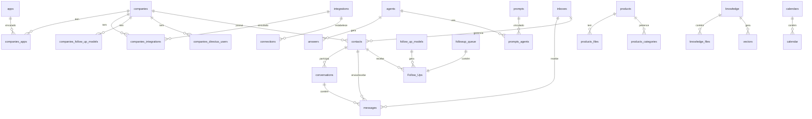

# 📋 Directus Schema.json - Explicação Completa

## 🎯 O Que É?

O arquivo `directus/schema.json` é o **schema de banco de dados completo** exportado do **Directus CMS**. Ele contém toda a estrutura de dados da aplicação, incluindo:

- ✅ Definições de coleções (tabelas)
- ✅ Definições de campos (colunas)
- ✅ Relacionamentos entre coleções
- ✅ Configurações de interface do Directus
- ✅ Permissões e políticas de acesso

**Tamanho**: 1.5MB (41.240 linhas)
**Formato**: JSON estruturado
**Propósito**: Versionamento e sincronização de schema

---

## 📊 Estrutura do Arquivo

### Visão Geral

```json
{
  "collections": [...],  // 59 coleções (tabelas)
  "fields": [...],       // Campos de todas as coleções
  "relations": [...]     // Relacionamentos entre coleções
}
```

### 1. `collections` (Coleções/Tabelas)

Define as **tabelas** do banco de dados e suas configurações no Directus.

**Total**: 59 coleções

**Estrutura de uma coleção**:
```json
{
  "collection": "contacts",
  "meta": {
    "collection": "contacts",
    "icon": null,
    "note": null,
    "display_template": null,
    "hidden": false,
    "singleton": false,
    "translations": null,
    "archive_field": null,
    "archive_app_filter": true,
    "sort_field": "sort",
    "accountability": "all",
    "color": null,
    "sort": 1,
    "group": "inboxes",
    "collapse": "open",
    "versioning": false
  },
  "schema": {}
}
```

**Campos importantes**:

| Campo | Descrição | Exemplo |
|-------|-----------|---------|
| `collection` | Nome da tabela | `"contacts"` |
| `icon` | Ícone no Directus UI | `"spatial_tracking"` |
| `hidden` | Ocultar da interface | `true`/`false` |
| `singleton` | Tabela com 1 registro único | `true`/`false` |
| `sort_field` | Campo para ordenação | `"sort"` |
| `group` | Grupo no menu lateral | `"inboxes"` |
| `translations` | Traduções da coleção | Array de idiomas |
| `versioning` | Habilitar versionamento | `true`/`false` |

---

### 2. `fields` (Campos/Colunas)

Define os **campos** (colunas) de cada coleção.

**Estrutura de um campo**:
```json
{
  "collection": "contacts",
  "field": "name",
  "type": "string",
  "meta": {
    "interface": "input",
    "options": null,
    "display": "formatted-value",
    "display_options": null,
    "readonly": false,
    "hidden": false,
    "sort": 1,
    "width": "full",
    "translations": [
      {
        "language": "pt-BR",
        "translation": "Nome"
      }
    ],
    "note": "Nome completo do contato",
    "conditions": null,
    "required": true,
    "group": null,
    "validation": null,
    "validation_message": null
  },
  "schema": {
    "name": "name",
    "table": "contacts",
    "data_type": "varchar",
    "default_value": null,
    "max_length": 255,
    "numeric_precision": null,
    "numeric_scale": null,
    "is_generated": false,
    "generation_expression": null,
    "is_nullable": false,
    "is_unique": false,
    "is_primary_key": false,
    "has_auto_increment": false,
    "foreign_key_column": null,
    "foreign_key_table": null
  }
}
```

**Campos importantes**:

| Campo | Descrição | Valores Possíveis |
|-------|-----------|-------------------|
| `field` | Nome do campo | `"name"`, `"email"`, etc |
| `type` | Tipo de dado Directus | `"string"`, `"integer"`, `"json"`, `"datetime"` |
| `interface` | Interface no Directus | `"input"`, `"select-dropdown"`, `"textarea"` |
| `required` | Campo obrigatório | `true`/`false` |
| `readonly` | Somente leitura | `true`/`false` |
| `hidden` | Ocultar da interface | `true`/`false` |
| `width` | Largura do campo | `"full"`, `"half"`, `"fill"` |

**Tipos de Dados Comuns**:

| Tipo Directus | SQL Type | Descrição |
|---------------|----------|-----------|
| `string` | `varchar` | Texto curto |
| `text` | `text` | Texto longo |
| `integer` | `int` | Número inteiro |
| `bigInteger` | `bigint` | Número inteiro grande |
| `float` | `float` | Número decimal |
| `decimal` | `decimal` | Número decimal preciso |
| `boolean` | `boolean` | Verdadeiro/Falso |
| `datetime` | `datetime` | Data e hora |
| `date` | `date` | Data |
| `time` | `time` | Hora |
| `json` | `json` | Objeto JSON |
| `uuid` | `uuid` | UUID |
| `csv` | `text` | Lista separada por vírgula |

---

### 3. `relations` (Relacionamentos)

Define os **relacionamentos** entre coleções (foreign keys, many-to-many, etc).

**Estrutura de um relacionamento**:
```json
{
  "collection": "contacts",
  "field": "company_id",
  "related_collection": "companies",
  "meta": {
    "many_collection": "contacts",
    "many_field": "company_id",
    "one_collection": "companies",
    "one_field": null,
    "one_collection_field": null,
    "one_allowed_collections": null,
    "junction_field": null,
    "sort_field": null,
    "one_deselect_action": "nullify"
  },
  "schema": {
    "constraint_name": "contacts_company_id_foreign",
    "table": "contacts",
    "column": "company_id",
    "foreign_key_table": "companies",
    "foreign_key_column": "id",
    "on_update": "NO ACTION",
    "on_delete": "SET NULL"
  }
}
```

**Tipos de Relacionamentos**:

#### Many-to-One (M2O)
- Muitos registros de uma tabela → Um registro de outra tabela
- Exemplo: Muitos `contacts` → Uma `company`

```json
{
  "collection": "contacts",
  "field": "company_id",
  "related_collection": "companies"
}
```

#### One-to-Many (O2M)
- Um registro → Muitos registros relacionados
- Exemplo: Uma `company` → Muitos `contacts`

```json
{
  "collection": "companies",
  "field": "contacts",
  "related_collection": "contacts",
  "meta": {
    "one_field": "contacts"
  }
}
```

#### Many-to-Many (M2M)
- Muitos registros → Muitos registros (via tabela junction)
- Exemplo: `companies` ↔ `integrations` via `companies_integrations`

```json
{
  "collection": "companies",
  "field": "integrations",
  "related_collection": "integrations",
  "meta": {
    "junction_field": "integration_id"
  }
}
```

---

## 🗂️ Coleções do Sistema

### Coleções Directus (Sistema)

Começam com `directus_` - **NÃO devem ser modificadas manualmente**:

| Coleção | Descrição |
|---------|-----------|
| `directus_users` | Usuários do Directus |
| `directus_roles` | Perfis de acesso |
| `directus_permissions` | Permissões de acesso |
| `directus_files` | Arquivos enviados |
| `directus_folders` | Pastas de arquivos |
| `directus_collections` | Metadados de coleções |
| `directus_fields` | Metadados de campos |
| `directus_relations` | Metadados de relacionamentos |
| `directus_activity` | Log de atividades |
| `directus_revisions` | Histórico de versões |
| `directus_flows` | Automações/Workflows |
| `directus_operations` | Operações de flows |
| `directus_webhooks` | Webhooks configurados |
| `directus_settings` | Configurações globais |
| `directus_dashboards` | Dashboards customizados |
| `directus_panels` | Painéis de dashboard |
| `directus_notifications` | Notificações |
| `directus_shares` | Links compartilhados |
| `directus_translations` | Traduções de interface |

---

## 🏢 Coleções da Aplicação

### Coleções Principais (33 customizadas + 26 sistema)

**Todas as Coleções Customizadas** (não incluem `directus_*`):

```
agents                          # Agentes de IA/Chatbot
answers                         # Respostas dos agentes
apps                            # Aplicativos integrados
calendar                        # Eventos de calendário
calendars                       # Calendários configurados
companies                       # Empresas clientes
companies_apps                  # Junction: Empresas ↔ Apps
companies_directus_users        # Junction: Empresas ↔ Usuários
companies_follow_up_models      # Junction: Empresas ↔ Modelos Follow-up
companies_integrations          # Junction: Empresas ↔ Integrações
connections                     # Conexões com APIs externas
contacts                        # Contatos (leads/clientes)
conversations                   # Conversas/histórico
follow_settings                 # Configurações de follow-up
follow_up_models                # Modelos de follow-up
Follow_Ups                      # Follow-ups criados
followup_queue                  # Fila de follow-ups
identifiers                     # Identificadores únicos
inboxes                         # Caixas de entrada
integrations                    # Integrações disponíveis
knowledge                       # Base de conhecimento
knowledge_files                 # Arquivos da base de conhecimento
Lab                             # Experimentos/Features em beta
learning                        # Aprendizado de máquina/IA
messages                        # Mensagens enviadas/recebidas
products                        # Produtos/Serviços
products_categories             # Categorias de produtos
products_files                  # Arquivos de produtos
prompts                         # Prompts de IA
prompts_agents                  # Junction: Prompts ↔ Agentes
questions                       # Perguntas frequentes
vectors                         # Vetores para IA/Embeddings
```

**Agrupadas por Categoria**:

| Categoria | Coleções |
|-----------|----------|
| **🏢 Empresas** | `companies`, `companies_apps`, `companies_directus_users`, `companies_follow_up_models`, `companies_integrations` |
| **👥 Contatos & Inbox** | `contacts`, `conversations`, `inboxes`, `messages` |
| **🔄 Follow-Up** | `followup_queue`, `follow_up_models`, `Follow_Ups`, `follow_settings` |
| **🔌 Integrações** | `integrations`, `connections`, `apps` |
| **🤖 Agentes & IA** | `agents`, `answers`, `questions`, `prompts`, `prompts_agents`, `learning`, `vectors` |
| **📅 Calendário** | `calendar`, `calendars` |
| **📦 Produtos** | `products`, `products_categories`, `products_files` |
| **📚 Conhecimento** | `knowledge`, `knowledge_files` |
| **🔬 Experimentos** | `Lab` |
| **🔑 Sistema** | `identifiers` |

---

## 🔗 Diagrama de Relacionamentos Principais



**Legenda**:
- `||--o{` = Um-para-Muitos (1:N)
- `||--||` = Um-para-Um (1:1)
- `}o--o{` = Muitos-para-Muitos (M:N) via junction table

---

## 🔧 Para Que Serve o Schema.json?

### 1. **Versionamento de Schema**
```bash
# Exportar schema atual
directus schema snapshot > directus/schema.json

# Aplicar schema em outro ambiente
directus schema apply --yes directus/schema.json
```

### 2. **Sincronização entre Ambientes**

**Desenvolvimento → Produção**:
```bash
# No ambiente DEV
directus schema snapshot > schema-dev.json

# Commitar no git
git add directus/schema.json
git commit -m "feat: adicionar campo email em contacts"
git push

# No ambiente PROD
git pull
directus schema apply --yes directus/schema.json
```

### 3. **Backup de Estrutura**
- Schema.json = backup completo da estrutura
- Não inclui dados, apenas estrutura
- Pode ser restaurado em qualquer instância Directus

### 4. **Documentação**
- Serve como documentação da estrutura de dados
- Pode ser analisado para entender o modelo de dados
- Facilita onboarding de novos desenvolvedores

### 5. **Migrations Automáticas**
```bash
# Gerar migration a partir de diferenças
directus schema diff schema-old.json schema-new.json > migration.sql

# Aplicar migration
directus database migrate
```

---

## 📝 Exemplo Prático: Coleção "Contacts"

### Estrutura Completa

```json
{
  "collection": "contacts",
  "meta": {
    "icon": "person",
    "sort_field": "sort",
    "group": "inboxes",
    "translations": [
      {
        "language": "pt-BR",
        "translation": "Contatos"
      }
    ]
  }
}
```

### Campos Principais

```json
{
  "collection": "contacts",
  "field": "name",
  "type": "string",
  "meta": {
    "interface": "input",
    "required": true,
    "translations": [
      {"language": "pt-BR", "translation": "Nome"}
    ]
  }
}
```

### Relacionamentos

```json
// Many-to-One: contact → company
{
  "collection": "contacts",
  "field": "company_id",
  "related_collection": "companies"
}

// One-to-Many: contact → conversations
{
  "collection": "contacts",
  "field": "conversations",
  "related_collection": "conversations",
  "meta": {
    "one_field": "conversations"
  }
}
```

---

## ⚙️ Comandos Úteis

### Exportar Schema
```bash
# Exportar schema completo
npx directus schema snapshot > directus/schema.json

# Exportar apenas coleções específicas
npx directus schema snapshot --collection contacts --collection companies > schema-partial.json
```

### Aplicar Schema
```bash
# Aplicar schema (com confirmação)
npx directus schema apply directus/schema.json

# Aplicar schema (sem confirmação - CUIDADO!)
npx directus schema apply --yes directus/schema.json

# Dry-run (apenas visualizar mudanças)
npx directus schema apply --dry-run directus/schema.json
```

### Comparar Schemas
```bash
# Gerar diff entre dois schemas
npx directus schema diff schema-old.json schema-new.json

# Gerar SQL migration
npx directus schema diff schema-old.json schema-new.json --sql > migration.sql
```

---

## ⚠️ Cuidados Importantes

### ❌ Não Fazer

1. **Editar manualmente o schema.json**
   - Use a interface do Directus ou CLI
   - Edição manual pode corromper o schema

2. **Aplicar schema sem backup**
   ```bash
   # SEMPRE fazer backup antes
   npx directus database migrate:latest --backup
   npx directus schema apply schema.json
   ```

3. **Ignorar diferenças entre ambientes**
   - Dev, Staging e Prod podem divergir
   - Use schema diff para identificar diferenças

### ✅ Boas Práticas

1. **Versionar no Git**
   ```bash
   git add directus/schema.json
   git commit -m "feat: adicionar campo phone em contacts"
   ```

2. **Exportar após mudanças**
   ```bash
   # Após modificar schema no Directus
   npx directus schema snapshot > directus/schema.json
   git add directus/schema.json
   git commit -m "update: schema snapshot"
   ```

3. **Testar em ambiente de DEV primeiro**
   ```bash
   # DEV
   npx directus schema apply --dry-run schema.json
   npx directus schema apply --yes schema.json
   # Testar aplicação
   # Se OK, aplicar em PROD
   ```

4. **Documentar mudanças estruturais**
   ```bash
   git commit -m "feat(schema): adicionar tabela follow_up_models

   - Novo campo: priority (integer)
   - Novo relacionamento: company_id → companies
   - Índice criado em company_id para performance"
   ```

---

## 🔍 Como Ler o Schema.json

### Encontrar uma Coleção
```bash
# Buscar coleção "contacts"
grep -A 20 '"collection": "contacts"' directus/schema.json | head -30
```

### Listar Todos os Campos de uma Coleção
```bash
# Buscar campos de "contacts"
grep -B 2 -A 10 '"collection": "contacts"' directus/schema.json | grep '"field"'
```

### Encontrar Relacionamentos
```bash
# Buscar relacionamentos de "contacts"
grep -B 5 -A 10 '"collection": "contacts"' directus/schema.json | grep -A 10 '"related_collection"'
```

---

## 📊 Estatísticas do Schema Atual

| Métrica | Valor |
|---------|-------|
| **Tamanho** | 1.5 MB |
| **Linhas** | 41.240 |
| **Coleções** | 59 |
| **Coleções Sistema** | ~20 (directus_*) |
| **Coleções Aplicação** | ~39 (customizadas) |
| **Campos Totais** | ~500+ (estimado) |
| **Relacionamentos** | ~100+ (estimado) |

---

## 🔗 Links Úteis

- [Directus Schema Documentation](https://docs.directus.io/reference/cli.html#schema)
- [Directus Data Model](https://docs.directus.io/app/data-model.html)
- [Directus CLI Reference](https://docs.directus.io/reference/cli.html)

---

## 💡 Resumo

**O que é**: Schema de banco de dados completo do Directus (estrutura, não dados)

**Para que serve**:
- ✅ Versionamento de estrutura
- ✅ Sincronização entre ambientes
- ✅ Backup de schema
- ✅ Documentação automática
- ✅ Migrations automatizadas

**Estrutura**:
- `collections` - Tabelas (59 coleções)
- `fields` - Campos/Colunas
- `relations` - Relacionamentos

**Comandos principais**:
```bash
# Exportar
npx directus schema snapshot > schema.json

# Aplicar
npx directus schema apply schema.json

# Comparar
npx directus schema diff old.json new.json
```

---

**Última atualização**: 2025-10-18
**Versão do Directus**: (verificar package.json)
**Schema Version**: (verificar migrations)
