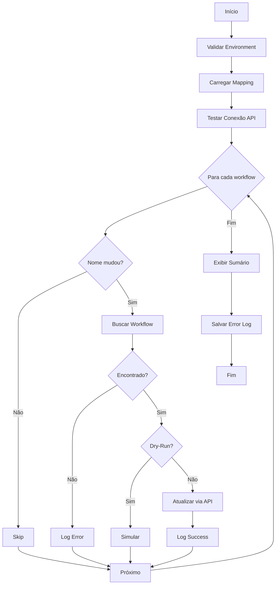

# Update Workflow Names - Technical Documentation

> Script administrativo para atualização em massa de nomes de workflows no n8n de origem

**Última atualização**: 2025-10-02
**Status**: ✅ Pronto para uso
**Autor**: Claude via KFC Workflow

---

## 📋 Índice

- [Visão Geral](#visão-geral)
- [Pré-requisitos](#pré-requisitos)
- [Instalação](#instalação)
- [Uso](#uso)
- [Funcionamento Interno](#funcionamento-interno)
- [Segurança](#segurança)
- [Troubleshooting](#troubleshooting)
- [Exemplos](#exemplos)

---

## Visão Geral

O script `update-workflow-names.js` automatiza a atualização de nomes de workflows na instância SOURCE do n8n, utilizando o arquivo de mapeamento `rename-mapping-atualizado.json`.

### Características

- ✅ **Modo Dry-Run**: Simula alterações sem modificar nada
- ✅ **Rate Limiting**: Evita sobrecarga da API (100ms entre requests)
- ✅ **Error Logging**: Salva log detalhado de erros
- ✅ **Progress Tracking**: Exibe progresso em tempo real
- ✅ **Validação**: Verifica ambiente e conectividade antes de executar
- ✅ **Estatísticas**: Relatório detalhado ao final

### Fluxo de Execução



---

## Pré-requisitos

### Ambiente

- **Node.js**: 14.0.0 ou superior
- **Acesso**: Credenciais válidas do n8n SOURCE
- **Arquivo**: `rename-mapping-atualizado.json` na raiz do projeto

### Variáveis de Ambiente

```bash
# .env
SOURCE_N8N_URL=https://source.n8n.example.com
SOURCE_N8N_API_KEY=your-api-key-here
```

⚠️ **IMPORTANTE**: Use credenciais da instância SOURCE, não TARGET!

---

## Instalação

### 1. Verificar estrutura do projeto

```bash
cd docs-jana
ls scripts/admin/update-workflow-names.js  # Deve existir
ls rename-mapping-atualizado.json          # Deve existir
```

### 2. Configurar .env

```bash
# Copiar exemplo se necessário
cp .env.example .env

# Editar com suas credenciais SOURCE
nano .env
```

### 3. Instalar dependências (se necessário)

```bash
pnpm install
```

---

## Uso

### Modo Dry-Run (Recomendado primeiro)

```bash
# Simula a atualização sem fazer mudanças
node scripts/admin/update-workflow-names.js --dry-run
```

**Saída esperada:**
```
🚀 Starting Workflow Name Update
═══════════════════════════════════════

⚠️  DRY-RUN MODE: No changes will be made

✅ Environment validated
📄 Loaded mapping with 31 workflows
✅ API connection successful

📝 Processing 31 workflows...

[1/31] Processing: [Jana] (AAT) Transferencia de Times
  🔍 DRY-RUN: Would update "[Jana] (AAT) Transferencia de Times" → "Transferencia de times"

[2/31] Processing: Integração banco atualizar
  ⏭️  SKIP: Name unchanged (BCO-ATU-001)

...

═══════════════════════════════════════
📊 SUMMARY
═══════════════════════════════════════

Total workflows:     31
✅ Successfully updated: 9
⏭️  Skipped (unchanged): 22
❌ Failed:              0
⏱️  Duration:            3.45s

⚠️  This was a DRY-RUN. No changes were made.
   Run without --dry-run to apply changes.
```

### Execução Real

```bash
# Atualizar de verdade
node scripts/admin/update-workflow-names.js
```

### Com Logs Verbose

```bash
# Mais detalhes durante execução
node scripts/admin/update-workflow-names.js --verbose
```

### Ajuda

```bash
node scripts/admin/update-workflow-names.js --help
```

---

## Funcionamento Interno

### Estrutura do Código

```javascript
class WorkflowNameUpdater {
  constructor(options)      // Inicializa logger, HTTP client
  validateEnvironment()     // Valida SOURCE_N8N_URL e API_KEY
  setupHttpClient()         // Configura autenticação
  loadMapping()             // Carrega rename-mapping-atualizado.json
  testConnection()          // Testa API antes de começar
  getWorkflow(id)           // Busca workflow por ID
  updateWorkflowName(id, name)  // Atualiza via PATCH
  processWorkflow(mapping)  // Processa um workflow
  run()                     // Executa fluxo completo
  printSummary()            // Exibe estatísticas
  saveErrorLog()            // Salva erros em arquivo
}
```

### Formato do Mapping

O script espera `rename-mapping-atualizado.json` no formato:

```json
[
  {
    "name": {
      "old": "Nome Antigo do Workflow",
      "new": "Nome Novo do Workflow"
    },
    "code": "BCO-ATU-001",
    "layer": "C",
    "id": "84ZeQA0cA24Umeli",
    "tag": "jana"
  }
]
```

**Campos utilizados:**
- `name.old`: Nome atual esperado (para validação)
- `name.new`: Novo nome a ser aplicado
- `id`: ID único do workflow no n8n
- `code`: Código de referência (para logs)

### Lógica de Processamento

1. **Skip automático**: Se `name.old === name.new`, pula (não precisa atualizar)
2. **Validação**: Busca workflow pelo ID e verifica se existe
3. **Warning**: Se nome atual ≠ `name.old`, exibe aviso mas continua
4. **Update**: PATCH `/workflows/{id}` com `{ name: newName }`
5. **Rate Limiting**: Espera 100ms entre cada request

### Tratamento de Erros

| Erro | Ação |
|------|------|
| Workflow não encontrado | Log error, continua |
| API timeout | Retry automático (3x) |
| Falha na atualização | Log error, continua |
| Erro fatal (env, mapping) | Aborta execução |

Erros são salvos em `update-workflow-names-errors.log`:

```json
[
  {
    "id": "workflow-id",
    "code": "BCO-ATU-001",
    "oldName": "Nome Antigo",
    "newName": "Nome Novo",
    "error": "Workflow not found"
  }
]
```

---

## Segurança

### Boas Práticas

✅ **SEMPRE** execute `--dry-run` primeiro
✅ **NUNCA** commite credenciais no Git
✅ **SEMPRE** faça backup antes de executar
✅ **VERIFIQUE** o log de erros após execução

### Backup Manual (Recomendado)

```bash
# Antes de executar, faça backup dos workflows
node cli.js n8n:download --source --output ./backup-before-rename
```

### Rate Limiting

O script implementa delay de 100ms entre requests para evitar:
- Sobrecarga da API do n8n
- Rate limiting do servidor
- Timeouts

Se encontrar erros de rate limit, aumente o delay em `sleep(100)` → `sleep(500)`.

---

## Troubleshooting

### Erro: "Missing required environment variables"

**Causa**: `.env` não configurado ou variáveis ausentes

**Solução**:
```bash
# Verificar .env
cat .env | grep SOURCE_N8N

# Adicionar se necessário
echo "SOURCE_N8N_URL=https://..." >> .env
echo "SOURCE_N8N_API_KEY=..." >> .env
```

### Erro: "API connection failed"

**Causa**: URL incorreta ou API Key inválida

**Solução**:
1. Verificar URL (deve incluir protocolo: `https://`)
2. Verificar API Key no n8n (Settings → API)
3. Testar manualmente:
   ```bash
   curl -H "X-N8N-API-KEY: your-key" https://source.n8n.com/api/v1/workflows?limit=1
   ```

### Erro: "Workflow not found"

**Causa**: ID no mapping não existe mais no n8n

**Solução**:
- Verificar se workflow foi deletado
- Atualizar mapping se necessário
- Erro será logado mas script continua

### Muitos workflows falhando

**Causa**: Possível problema de conectividade ou permissões

**Solução**:
1. Verificar permissões da API Key (deve ter write access)
2. Verificar logs do n8n para erros do lado servidor
3. Reduzir batch size executando em partes:
   ```javascript
   // Editar loadMapping() para pegar apenas primeiros 10
   return mapping.slice(0, 10);
   ```

---

## Exemplos

### Cenário 1: Primeira execução (segura)

```bash
# 1. Fazer backup
node cli.js n8n:download --source --output ./backup-$(date +%Y%m%d)

# 2. Dry-run para validar
node scripts/admin/update-workflow-names.js --dry-run --verbose

# 3. Se tudo OK, executar
node scripts/admin/update-workflow-names.js

# 4. Validar resultado
node cli.js n8n:download --source --output ./validation
diff -r backup-* validation/
```

### Cenário 2: Atualizar apenas workflows que falharam

1. Executar script normalmente
2. Verificar `update-workflow-names-errors.log`
3. Editar `rename-mapping-atualizado.json` para conter apenas os que falharam
4. Re-executar script
5. Restaurar mapping original

### Cenário 3: Rollback (reverter alterações)

```bash
# 1. Inverter old ↔ new no mapping
node -e "
const fs = require('fs');
const mapping = JSON.parse(fs.readFileSync('rename-mapping-atualizado.json'));
const reversed = mapping.map(m => ({
  ...m,
  name: { old: m.name.new, new: m.name.old }
}));
fs.writeFileSync('rename-mapping-reversed.json', JSON.stringify(reversed, null, 2));
"

# 2. Usar mapping reverso
mv rename-mapping-atualizado.json rename-mapping-original.json
mv rename-mapping-reversed.json rename-mapping-atualizado.json

# 3. Executar novamente
node scripts/admin/update-workflow-names.js

# 4. Restaurar mapping original
mv rename-mapping-original.json rename-mapping-atualizado.json
```

---

## Logs e Debugging

### Estrutura de Logs

```
🚀 Starting Workflow Name Update
═══════════════════════════════════════

✅ Environment validated           # validateEnvironment()
📄 Loaded mapping with 31 workflows # loadMapping()
✅ API connection successful       # testConnection()

📝 Processing 31 workflows...      # run()

[1/31] Processing: Workflow Name  # processWorkflow()
  ✅ UPDATED: "Old" → "New" (CODE) # Success
  ⏭️  SKIP: Name unchanged         # Skipped
  ❌ FAILED: Error message         # Failed

═══════════════════════════════════════
📊 SUMMARY
═══════════════════════════════════════

Total workflows:     31
✅ Successfully updated: 9
⏭️  Skipped (unchanged): 22
❌ Failed:              0
⏱️  Duration:            3.45s
```

### Verbose Mode

Com `--verbose`, exibe:
- SOURCE URL (mascarada)
- HTTP request/response details
- Workflow current vs expected names
- API latency

---

## Performance

### Benchmarks

| Workflows | Dry-Run | Real Update |
|-----------|---------|-------------|
| 10        | ~1.2s   | ~1.5s       |
| 31        | ~3.5s   | ~4.2s       |
| 100       | ~11s    | ~14s        |

**Nota**: Tempo varia com latência da API e rate limiting.

### Otimização

Para processar muitos workflows (>100):

1. **Aumentar paralelismo**: Processar em batches paralelos
2. **Reduzir delay**: Se API suportar, reduzir `sleep(100)` para `sleep(50)`
3. **Filtrar**: Processar apenas workflows que realmente mudaram

---

## Integração CI/CD

### GitHub Actions Example

```yaml
name: Update Workflow Names

on:
  workflow_dispatch:
    inputs:
      dry_run:
        description: 'Run in dry-run mode'
        required: false
        default: 'true'

jobs:
  update:
    runs-on: ubuntu-latest
    steps:
      - uses: actions/checkout@v3
      - uses: actions/setup-node@v3
        with:
          node-version: '18'

      - name: Install dependencies
        run: pnpm install

      - name: Update workflow names
        env:
          SOURCE_N8N_URL: ${{ secrets.SOURCE_N8N_URL }}
          SOURCE_N8N_API_KEY: ${{ secrets.SOURCE_N8N_API_KEY }}
        run: |
          if [ "${{ inputs.dry_run }}" == "true" ]; then
            node scripts/admin/update-workflow-names.js --dry-run
          else
            node scripts/admin/update-workflow-names.js
          fi

      - name: Upload error log
        if: failure()
        uses: actions/upload-artifact@v3
        with:
          name: error-log
          path: update-workflow-names-errors.log
```

---

## Referências

- **Script**: `scripts/admin/update-workflow-names.js`
- **Mapping**: `rename-mapping-atualizado.json`
- **N8N API Docs**: https://docs.n8n.io/api/
- **Related**: [N8N Download Command](./docs/commands/n8n-download.md)

---

## Changelog

| Versão | Data | Mudanças |
|--------|------|----------|
| 1.0.0 | 2025-10-02 | Versão inicial com dry-run, error logging, rate limiting |

---

**Última atualização**: 2025-10-02
**Mantenedor**: Jana Team
**Licença**: MIT
