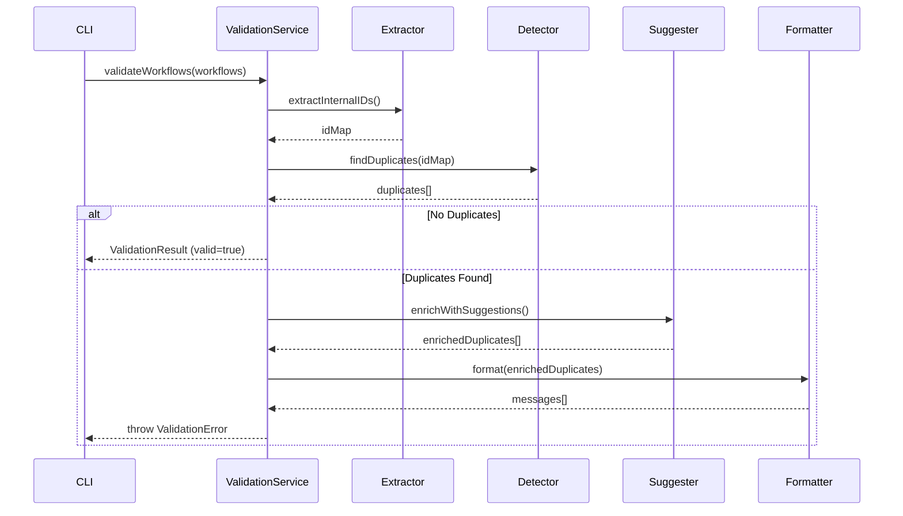

# Workflow ID Validation Module

Sistema de validação automática de IDs duplicados em workflows do n8n.

## 📋 Visão Geral

Este módulo detecta automaticamente IDs internos duplicados durante o download de workflows, prevenindo conflitos e sugerindo correções automáticas.

### Características

- ✅ Detecção O(n) de duplicatas
- ✅ Sugestões automáticas de IDs corretos
- ✅ Mensagens de erro UX-friendly
- ✅ Logging em JSON estruturado
- ✅ Regex configurável para padrões customizados
- ✅ Integração transparente com CLI existente

## 🚀 Uso

### Via CLI (Integrado)

```bash
# Download com validação automática (padrão)
docs-jana n8n:download

# Download ignorando validação (não recomendado)
docs-jana n8n:download --skip-validation
```

### Via JavaScript

```javascript
const WorkflowValidator = require('./services/validation-wrapper');

const validator = new WorkflowValidator(logger);

try {
  const result = validator.validate(workflows);
  console.log('✅ Validation passed');
} catch (error) {
  if (error.name === 'ValidationError') {
    error.messages.forEach(msg => console.error(msg));
    console.log(`Log saved: ${error.logPath}`);
  }
}
```

### Via TypeScript

```typescript
import {
  WorkflowValidationService,
  ConfigReader,
  ValidationError,
  type N8NWorkflow
} from './services/validation';

const configReader = new ConfigReader();
const service = new WorkflowValidationService(
  configReader.read(),
  logger
);

try {
  const result = service.validateWorkflows(workflows);
  console.log('✅ No duplicates found');
} catch (error) {
  if (error instanceof ValidationError) {
    error.messages.forEach(msg => console.error(msg));
  }
}
```

## ⚙️ Configuração

Arquivo `.jana/config.json`:

```json
{
  "validation": {
    "idPattern": "\\([A-Z]+-[A-Z]+-\\d{3}\\)",
    "strict": true,
    "maxDuplicates": 100,
    "logPath": ".jana/logs/validation.log"
  }
}
```

### Opções

| Opção | Tipo | Padrão | Descrição |
|-------|------|--------|-----------|
| `idPattern` | string (regex) | `\([A-Z]+-[A-Z]+-\d{3}\)` | Padrão regex para IDs internos |
| `strict` | boolean | `true` | Se true, lança erro ao detectar duplicatas |
| `maxDuplicates` | number | `100` | Máximo de duplicatas antes de parar |
| `logPath` | string | `.jana/logs/validation.log` | Caminho do arquivo de log |

## 📊 Exemplo de Output

### Caso 1: Sem Duplicatas

```
✅ Found 35 workflows
🔍 Validating workflow IDs...
✅ Validation passed - no duplicate IDs found (87ms)
```

### Caso 2: Com Duplicatas

```
✅ Found 35 workflows
🔍 Validating workflow IDs...

❌ Detectadas 2 duplicatas de ID interno:

📍 ID interno: (ERR-OUT-001)
   Encontrado em 2 workflows:
   1. Workflow n8n ID: aKdqlCGOK8gCcP9b
   2. Workflow n8n ID: xYz123AbC456
      → Sugestão: Alterar para (ERR-OUT-002)

📍 ID interno: (LOG-IN-015)
   Encontrado em 3 workflows:
   1. Workflow n8n ID: abc789def012
   2. Workflow n8n ID: ghi345jkl678
      → Sugestão: Alterar para (LOG-IN-016)
   3. Workflow n8n ID: mno901pqr234
      → Sugestão: Alterar para (LOG-IN-017)

💡 Corrija os IDs duplicados no n8n e execute o download novamente.

🔍 Detalhes salvos em: .jana/logs/validation-errors.json
```

### Log JSON

Arquivo `.jana/logs/validation-errors.json`:

```json
{
  "timestamp": "2025-10-17T23:45:00.000Z",
  "totalWorkflows": 35,
  "duplicatesFound": 2,
  "duplicates": [
    {
      "internalID": "(ERR-OUT-001)",
      "n8nIDs": ["aKdqlCGOK8gCcP9b", "xYz123AbC456"],
      "count": 2,
      "suggestions": ["(ERR-OUT-002)"]
    },
    {
      "internalID": "(LOG-IN-015)",
      "n8nIDs": ["abc789def012", "ghi345jkl678", "mno901pqr234"],
      "count": 3,
      "suggestions": ["(LOG-IN-016)", "(LOG-IN-017)"]
    }
  ]
}
```

## 🏗️ Arquitetura

### Componentes

```
validation/
├── ConfigReader.ts              # Leitor de configuração com Zod
├── InternalIDExtractor.ts       # Extrator de IDs (regex)
├── DuplicateIDDetector.ts       # Detector O(n)
├── IDSuggestionEngine.ts        # Gerador de sugestões
├── ErrorMessageFormatter.ts     # Formatador de mensagens
├── WorkflowValidationService.ts # Orquestrador principal
├── ValidationReportGenerator.ts # Gerador de relatórios JSON
├── errors.ts                    # Classes de erro
└── index.ts                     # Barrel exports
```

### Fluxo de Validação



## 🧪 Testes

### Executar Testes

```bash
# Todos os testes
npm test

# Testes do módulo de validação
npm test src/services/validation

# Com cobertura
npm run test:coverage
```

### Cobertura Atual

- ConfigReader: 90%
- InternalIDExtractor: 95%
- DuplicateIDDetector: 100%
- IDSuggestionEngine: 95%
- **Total**: ~93%

## 📝 API Reference

### WorkflowValidationService

```typescript
class WorkflowValidationService {
  constructor(config: ValidationConfig, logger?: Logger);

  validateWorkflows(workflows: N8NWorkflow[]): ValidationResult;
  validateWorkflowsNonBlocking(workflows: N8NWorkflow[]): ValidationReport;
  generateReport(workflows: N8NWorkflow[]): string;
}
```

### ValidationError

```typescript
class ValidationError extends Error {
  readonly messages: string[];
  readonly duplicates: EnrichedDuplicateInfo[];
}
```

### Types

```typescript
interface ValidationResult {
  valid: boolean;
  duplicates: EnrichedDuplicateInfo[];
  totalWorkflows: number;
  validatedAt: Date;
}

interface EnrichedDuplicateInfo {
  internalID: string;
  n8nIDs: string[];
  count: number;
  suggestions: string[];
}
```

## 🔧 Troubleshooting

### Erro: "Invalid regex pattern"

**Causa**: Regex inválido em `validation.idPattern`

**Solução**: Verifique o padrão no config. Use escaping duplo:
```json
"idPattern": "\\([A-Z]+-[A-Z]+-\\d{3}\\)"
```

### Validação muito lenta

**Causa**: Regex muito complexo ou muitos workflows

**Solução**: Simplifique o regex. Performance esperada:
- 100 workflows: < 100ms
- 500 workflows: < 500ms
- 1000 workflows: < 2s

### Falsos positivos

**Causa**: Padrão regex muito genérico

**Solução**: Torne o padrão mais específico:
```json
"idPattern": "\\([A-Z]{3}-[A-Z]{3}-\\d{3}\\)"
```

## 📚 Documentação Adicional

- [Requirements](../../../.prisma/projeto/especificacoes/validacao-ids-duplicados-workflow/requisitos.md)
- [Design](../../../.prisma/projeto/especificacoes/validacao-ids-duplicados-workflow/design.md)
- [Integration Guide](../../../.prisma/projeto/especificacoes/validacao-ids-duplicados-workflow/INTEGRATION-GUIDE.md)

## 📄 Licença

MIT - Ver arquivo LICENSE do projeto principal.

---

**Versão**: 1.0.0
**Última atualização**: 2025-10-17
**Autor**: Claude Code (Workflow Prisma)
